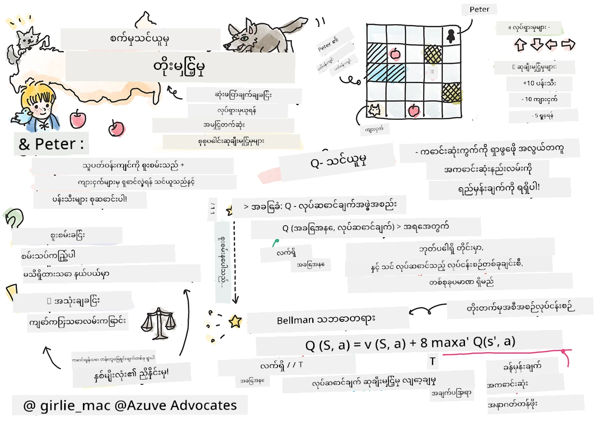
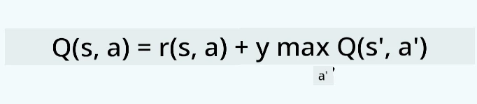
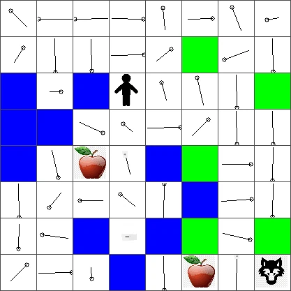
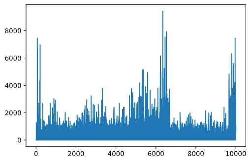

# ပြန်လည်မြှင့်တင်သင်ယူမှုပညာနှင့် Q-သင်ယူမှု မိတ်ဆက်ခြင်း


> Sketchnote ကို [Tomomi Imura](https://www.twitter.com/girlie_mac) မှ ဖန်တီးခဲ့သည်

ပြန်လည်မြှင့်တင်သင်ယူမှုတွင် အရေးကြီးသော အကြောင်းအရာသုံးခု ပါဝင်သည်။ အAgent၊ အချို့သော အခြေအနေများနှင့် အခြေအနေတိုင်းအလိုက် ကြားခံ လုပ်ဆောင်ချက်များဖြစ်သည်။ အAgent သည် ရှိသော အခြေအနေကြောင်းတွင် လုပ်ဆောင်ချက်တစ်ခုကို ဆောင်ရွက်ခြင်းဖြင့် ဆုလာဘ်ရနိုင်သည်။ ပြန်လည်စဉ်းစားပါ Super Mario ကွန်ပျူတာဂိမ်းအား။ သင်သည် Mario ဖြစ်ပြီး ဂိမ်းအဆင့်တစ်ခုတွင် တောင်တန်းကျောနားတွင် ရပ်နေနေသည်။ သင့်အပေါ်တွင် ပိုက်ဆံတစ်စက်ရှိသည်။ သင် Mario နှင့်အတူ ဂိမ်းအဆင့်အတည်ပြုဆိုင်း ... ၎င်းသည် သင့်အခြေအနေဖြစ်သည်။ ညာဘက်သို့ တစ်ခြားခြေလှမ်းတက်ခြင်း (လုပ်ဆောင်ချက်မှ) သင့်အား ကျောနေရာထက် ကျရောက်စေပြီး ဂဏန်းအနည်းငယ်သော ရမှတ်ဖြစ်ပွားစေမည်။ သို့သော် ကွေ့လျှင်ခလုတ်ကို နှိပ်ခြင်းသည် သင့်အား ရမှတ်တစ်ခုရရှိစေပြီး ကယ်တင်မှုရှိစေမည်။ ၎င်းသည် ကောင်းသောရလဒ်ဖြစ်ပြီး ကောင်းသောဂဏန်းတန်ဖိုးဖြင့် ဆုလာဘ်ပေးသင့်သည်။

ပြန်လည်မြှင့်တင်သင်ယူမှုနှင့် စမ်းသပ်ကစားနည်း (ဂိမ်း) ကို အသုံးပြု၍ ဂိမ်းကို ကစားရန် သင်ယူနိုင်ကာ အသက်ကို ကယ်တင်ခြင်း၊ အများဆုံးဆုလာဘ်ရရှိစေရန် နည်းလမ်းရှာနိုင်သည်။

[](https://www.youtube.com/watch?v=lDq_en8RNOo)

> 🎥 Dmitry မှ ပြန်လည်မြှင့်တင်သင်ယူမှုအကြောင်း ဆွေးနွေးခြင်းကြားရှုရန် ဓာတ်ပုံကို နှိပ်ပါ

## [ကြိုတင်စာမေးပွဲ](https://ff-quizzes.netlify.app/en/ml/)

## မတိုင်မီလိုအပ်ချက်များနှင့် တပ်ဆင်ခြင်း

ဤသင်ခန်းစာတွင် Python ကုဒ်အချို့ဖြင့် စမ်းသပ်လေ့လာမည်။ သင်သည် သင့်ကွန်ပျူတာတွင်သို့မဟုတ် ကောင်းလ်ၤ(Could) တစ်နေရာမှာ ဒီသင်ခန်းစာ၏ Jupyter Notebook ကုဒ်ကို ပတ်သတ်၍ ပြေးဆွဲနိုင်ပါသည်။

သင်သည် [သင်ခန်းစာစာအုပ်](https://github.com/microsoft/ML-For-Beginners/blob/main/8-Reinforcement/1-QLearning/notebook.ipynb) ကို ဖွင့်၍ သင်ခန်းစာကို လေ့လာနိုင်သည်။

> **မှတ်ချက်။** သင်သည် ကောင်းလ်ၤမှ ကုဒ်ဖိုင်ဖွင့်နေသည်ဆိုလျှင် သင်သည် [`rlboard.py`](https://github.com/microsoft/ML-For-Beginners/blob/main/8-Reinforcement/1-QLearning/rlboard.py) ဖိုင်ကိုလည်း ယူဆောင်ရမည်ဖြစ်ပြီး ၎င်းသည် Notebook ကုဒ်တွင် အသုံးပြုသည်။ Notebook နဲ့တူညီသော ဖိုင်တည်နေရာတွင် ထည့်သွင်းထားပါ။

## မိတ်ဆက်ခြင်း

ဤသင်ခန်းစာတွင် ကျွန်ုပ်တို့သည် ရုရှားဂီတရေးဆရာ [Sergei Prokofiev](https://en.wikipedia.org/wiki/Sergei_Prokofiev) ၏ဂီတဇာတ်လမ်းတစ်ပုဒ်ကို အတွေးပေး၍ **[Peter နှင့် Wolf](https://en.wikipedia.org/wiki/Peter_and_the_Wolf)** ၏ကမ္ဘာကို ရှာဖွေမှာဖြစ်သည်။ ကျွန်ုပ်တို့ **ပြန်လည်မြှင့်တင်သင်ယူမှု** သုံးပြီး Peter ကို သူ့ပတ်ဝန်းကျင်ကို လေ့လာစေပြီး အပျော်စေသောပန်းသီးများ စုဆောင်းကာ ယုမ်သမားနှင့် တွေ့ဆုံခြင်းမှ ရှောင်ကြဉ်စေမည်။

**ပြန်လည်မြှင့်တင်သင်ယူမှု** (RL) သည် စမ်းသပ်မှုများ ခန့်မှန်းပြုခြင်းဖြင့် အAgent ၏အကောင်းဆုံး အပြုအမူကို သင်ယူနိုင်စေသော သင်ယူနည်းပညာတစ်ခုဖြစ်သည်။ အAgent ၏ရည်မှန်းချက် သည် **ဆုလာဘ်လုပ်ဆောင်ချက်** နှင့် သတ်မှတ်ထားသည်။

## ပတ်ဝန်းကျင်

လွယ်ကူစွာ သတ်မှတ်ရအောင် Peter ၏ကမ္ဘာကို `အကျယ်` x `အမြင့်` အရွယ်အစား စတုရန်းဝင်းထားသော ဘားဒ်အဖြစ်ယူလိုက်ပါ။


ဤဘားဒ်၌ အစီအစဉ်တစ်ခုစီမှာ

* **မြေပြင်**, Peter နှင့် တခြားတိရစ္ဆာန်များလျှောက်နိုင်သောနေရာ။
* **ရေ**, သင်မလျှောက်နိုင်သည့်နေရာ။
* **သစ်ပင်** သို့မဟုတ် **ရွက်မြက်**, အနားယူနိုင်သောနေရာ။
* **ပန်းသီး**, Peter ကို သူ့ကိုယ်သူ စားစရာရှာဖွေရေးအတွက် ဝမ်းသာစေသော အရာ။
* **ယုမ်**, အန္တရာယ်ရှိပြီး ရှောင်ကြဉ်သင့်သည်။

Python မော်ဂျူးလ်တစ်ခုဖြစ်သော [`rlboard.py`](https://github.com/microsoft/ML-For-Beginners/blob/main/8-Reinforcement/1-QLearning/rlboard.py) တွင် ဤပတ်ဝန်းကျင်နဲ့ပတ်သက်သော ကုဒ်များ ပါဝင်သည်။ ၎င်း ကုဒ်သည် သဘောတရားနားလည်ရန် မလိုအပ်သဖြင့် မော်ဂျူးလ်ကို ရှာဖွေပြီး နမူနာဘားဒ် ဖန်တီးရန် အသုံးပြုပါမည် (ကုဒ်ပိုင်း ၁)။

```python
from rlboard import *

width, height = 8,8
m = Board(width,height)
m.randomize(seed=13)
m.plot()
```

ဤကုဒ်က ပတ်ဝန်းကျင်ဓာတ်ပုံကို အထက်ပါ သဘောတူညီမှုနှင့် တူညီစွာ ပုံနှိပ်ပြမည်။

## လုပ်ဆောင်ချက်များနှင့် မူဝါဒ

ဥပမာတွင် Peter ၏ ရည်မှန်းချက်မှာ ပန်းသီးကို ရှာဖွေရေးဖြစ်၊ ယုမ်နှင့် အခြားအတားအဆီးများရှောင်ကြဉ်ရန်ဖြစ်သည်။ ၎င်းအတွက် Peter သည် ပန်းသီးတစ်ခု တွေ့ရန်အထိ လမ်းလျှောက်ဝင်နိုင်သည်။

ထို့ကြောင့် မည်သည့်အနေအထားတွင်မဆို တောင်ဘက်၊ လျှောက်ဘက်၊ ဘယ်နှင့် ညာဘက် တို့မှ လုပ်ဆောင်ချက်များကို ရွေးချယ်နိုင်သည်။

ကုဒ်တွင် ၎င်းလုပ်ဆောင်ချက်များကို dictionary အဖြစ် သတ်မှတ်ကာ သက်ဆိုင်ရာ ဂဏန်းတစ်စုသို့ မျှဝေအပ်ပါမည်။ ဥပမာအားဖြင့် ညာဘက်သို့ ရွှေ့ခြင်း(`R`) သည် ဖော်ပြချက် `(1,0)` နှင့်ကိုက်ညီမည် (ကုဒ်ပိုင်း 2)။

```python
actions = { "U" : (0,-1), "D" : (0,1), "L" : (-1,0), "R" : (1,0) }
action_idx = { a : i for i,a in enumerate(actions.keys()) }
```

နိဂုံးချုပ်အနေဖြင့်၊ ဒီအကြောင်းအရာ၏ မူဝါဒနှင့် ရည်ရွယ်ချက်မှာ အောက်ပါအတိုင်းဖြစ်သည်။

- **မူဝါဒ** သည် ကျွန်ုပ်တို့၏အAgent (Peter) အတွက် သတ်မှတ်ထားသော **policy** အဓိပ္ပါယ်ရှိသည်။ မူဝါဒမှာ အခြေအနေတစ်ခုစီတွင် လုပ်ဆောင်ချက်ကို ပြန်လည်ပေးအပ်သော function ဖြစ်သည်။ ၎င်းတွင် ပြဿနာ၏ အခြေအနေသည် ဘားဒ်နှင့် လောလောဆယ်ကစားသမားအနေအထားဖြင့် ကိုယ်စားပြုသည်။

- **ရည်ရွယ်ချက်** သည် ပြန်လည်မြှင့်တင်သင်ယူမှု၏ နောက်ဆုံးရည်မှန်းချက်ဖြစ်ကာ ပြဿနာကို ထိရောက်စွာ ဖြေရှင်းနိုင်သော ကောင်းမွန်သော မူဝါဒတစ်ခု သင်ယူရန်ဖြစ်သည်။ သို့သော် အခြေခံအနေဖြင့် **random walk** မူဝါဒရိုးရိုးဆွဲကြည့်ရမည်။

## Random Walk

ပထမဦးဆုံး random walk မူဝါဒဖြင့် ပြဿနာကို ဖြေရှင်းကြပါစို့။ random walk နှင့် အနာဂတ်လုပ်ဆောင်ချက်ကို ခွင့်ပြုသော လုပ်ဆောင်ချက်များထဲမှ သဘောတူညီမှုအတိုင်း ရွေးချယ်၍ ပန်းသီးကို ရောက်သည်အထိ လိုက်နာမည် (ကုဒ်ပိုင်း 3)။

1. အောက်ပါကုဒ်ဖြင့် random walk ကို အကောင်အထည်ဖော်ပါ။

    ```python
    def random_policy(m):
        return random.choice(list(actions))
    
    def walk(m,policy,start_position=None):
        n = 0 # အဆင့်အရေအတွက်
        # ပထမဆုံးနေရာသတ်မှတ်ပါ
        if start_position:
            m.human = start_position 
        else:
            m.random_start()
        while True:
            if m.at() == Board.Cell.apple:
                return n # အောင်မြင်ပါပြီ!
            if m.at() in [Board.Cell.wolf, Board.Cell.water]:
                return -1 # ကျားကစားလိုက် သို့မဟုတ် ရေဦးပြုတ်သွားပြီ
            while True:
                a = actions[policy(m)]
                new_pos = m.move_pos(m.human,a)
                if m.is_valid(new_pos) and m.at(new_pos)!=Board.Cell.water:
                    m.move(a) # တကယ်တမ်း ရွှေ့ပြောင်းမှု လုပ်ဆောင်ပါ
                    break
            n+=1
    
    walk(m,random_policy)
    ```

    `walk` ခေါ်သည့်အခါ တဆင့်လျှောက်လမ်းကြောင်း၏ အရှည် (run တစ်ခုနှင့် အခြားတစ်ခုကွဲပြားနိုင်သည်) ကို ပြန်လည်ပေးအပ်သည်။

1. လမ်းလျှောက် စမ်းသပ်မှုကို ၁၀၀ ကြိမ် ပြေးပြီး ရလဒ်စာရင်း ပုံနှိပ်ပါ(ကုဒ်ပိုင်း 4)။

    ```python
    def print_statistics(policy):
        s,w,n = 0,0,0
        for _ in range(100):
            z = walk(m,policy)
            if z<0:
                w+=1
            else:
                s += z
                n += 1
        print(f"Average path length = {s/n}, eaten by wolf: {w} times")
    
    print_statistics(random_policy)
    ```

    လမ်းကြောင်း၏ ပျမ်းမျှအရှည်မှာ ၃၀-၄၀ ခြေလှမ်းအတွင်းဖြစ်ကာ ပန်းသီးအဝေးကြည့်ရလို့၎င်း သာလွန်ရှည်လျားသည်။

    Peter ၏ random walk အတွင်း လမ်းလျှောက်မှု အနေအထားကိုလည်း ကြည့်ရှုနိုင်သည်။

    

## ဆုလာဘ်လုပ်ဆောင်ချက်

မူဝါဒကို ပိုမို ဉာဏ်မြင့်အောင် ပြင်ဆင်ရန် ရှေ့ဆက်လျှောက်လှမ်းမှုများထက် "ပိုကောင်း" ဟု သတ်မှတ်နိုင်သော လှုပ်ရှားမှုများကို နားလည်ရန် လိုအပ်သည်။

ရည်မှန်းချက်သည် **ဆုလာဘ်လုပ်ဆောင်ချက်** အနေဖြင့် သတ်မှတ်နိုင်ပြီး အခြေအနေလတ်ဖြစ်စဉ်တိုင်းတွင် နံပါတ်တန်ဖိုးတစ်ခုကို ပြန်ထုတ်ပေးသည်။ နံပါတ်မြင့်မားမှုသာ ဆုလာဘ်တန်ဖိုးကောင်းချက် ဖြစ်သည်။ (ကုဒ်ပိုင်း 5)

```python
move_reward = -0.1
goal_reward = 10
end_reward = -10

def reward(m,pos=None):
    pos = pos or m.human
    if not m.is_valid(pos):
        return end_reward
    x = m.at(pos)
    if x==Board.Cell.water or x == Board.Cell.wolf:
        return end_reward
    if x==Board.Cell.apple:
        return goal_reward
    return move_reward
```

ဆုလာဘ်လုပ်ဆောင်ချက်အကြောင်း စိတ်ဝင်စားဖွယ်ကောင်းတာက များသောအားဖြင့် *ဂိမ်းကုန်ဆုံးချိန်တွင်သာ ဆုလာဘ်တန်ဖိုးအရေးကြီးကြောင်း* ဖြစ်သည်။ ထို့ကြောင့် ကျွန်ုပ်တို့၏ အစီအစဉ်သည် ကောင်းမွန်သော ခြေလှမ်းများကို မှတ်မိကာ အဆုံးတွင် အကောင်းဆုံးဆုလာဘ် ရရှိစေဖို့ အလေးထားရမည်ဖြစ်သည်။ ဆိုးသောရလဒ်သို့ ခြေလှမ်းတွေကို ကန့်သတ်ပေးရမည်။

## Q-သင်ယူခြင်း

ကျူးလွန်မည့် အစီအစဉ်ကို **Q-သင်ယူခြင်း** ဟု ခေါ်သည်။ ၎င်းတွင် မူဝါဒကို **Q-ဇယား** ဟု ခေါ်သော function (သို့) ဒေတာဖွဲ့စည်းမှုမှ သတ်မှတ်သည်။ ၎င်းမှာ တစ်ခုချင်း လုပ်ဆောင်ချက်အား "ကောင်းမှု" အဆင့်တိုင်း ပြန်မှတ်တမ်းတင်သည်။

Q-ဇယားဟု ခေါ်ရသည့် အကြောင်းမှာ အားလုံးထိုင်ရာဇယားသို့မဟုတ် မျိုးစုံအတိုင်းအတာအဆင့် ရှိ multi-dimensional array အဖြစ် ကိုယ်စားပြုသည့်အတွက်ဖြစ်သည်။ ကျွန်ုပ်တို့ဘားဒ်မှာ `အကျယ်` x `အမြင့်` သတ်မှတ်ချက်ရှိသည့်အတွက် numpy array အဖြစ် သတ်မှတ်၍ `အကျယ်` x `အမြင့်` x `လုပ်ဆောင်ချက်အရေအတွက်` ကိုရှိစေသည်။ (ကုဒ်ပိုင်း 6)

```python
Q = np.ones((width,height,len(actions)),dtype=np.float)*1.0/len(actions)
```

Q-ဇယားမှ တန်ဖိုးအားလုံးကို 0.25 ဟူ၍ စတင်သတ်မှတ်ထားခြင်းမှာ "random walk" မူဝါဒနှင့် ကိုက်ညီပြီးထားသော လက်တွေ့လုပ်ဆောင်ချက်များအားလုံးမှာ မတူညီမှုမရှိခြင်းကို ဆိုလိုသည်။ ဤ Q-ဇယားကို `plot` function သို့ ဖြတ်သွားကာ ဘားဒ်ပေါ်တွင် မြင်ကွင်းပြရန် အသုံးပြုနိုင်သည်၊ `m.plot(Q)`။


အစိတ်အပိုင်းများ အတွင်းနောက်ခံတွင် ကိုယ်တိုင်လှည့်ပတ်မှု ဦးတည်ရာပြတင်းများရှိသည်။ အ directional အားလုံးသည်မျှတခြင်းကြောင့် dot တစ်ခု မြင်ရသည်။

ယခု simulation ကို စတင်ပြေး၍ ပတ်ဝန်းကျင်ကို ရှာဖွေပြီး Q-ဇယား၏ တန်ဖိုးများကို ပိုကောင်းအောင် သင်ယူခြင်းဖြင့် ပန်းသီးကို ရောက်ရှိရန် လမ်းကြောင်းကို အံ့သြဖွယ်မြန်ဆန်စေမည်။

## Q-သင်ယူမှု၏ အဓိပ္ပါယ် - Bellman ဂဏန်းနိတိ

လှည့်ပတ်ခြင်းစတင်သည်နှင့် လုပ်ဆောင်ချက်တိုင်းတွင် ဆုလာဘ်ရမည့် အခွင့်အရေးရှိသည်။ သိုသော် များသောအခြေအနေများတွင် လှည့်လည်းသည့် လမ်းကြောင်းသည် ပန်းသီးကို ရောက်ရှိစေမည်မဟုတ်သဖြင့် မည်သည့် ဦးတည်ရာကောင်းကြောင်း ချက်ချင်းဆုံးဖြတ်၍ မရနိုင်။

> အမြန်ရလဒ်မဟုတ်ပဲ အဆုံးတွင်ရမည့် နောက်ဆုံးရလဒ်သာ အရေးကြီးသည်။

ဤနောက်ကျသော ဆုလာဘ်အတွက် **[ဒိုင်နမစ်ပရိုဂရမ်မင်း](https://en.wikipedia.org/wiki/Dynamic_programming)** ၏ စံနှုန်းများကို အသုံးပြုရန် လိုအပ်သည်။ ၎င်းတွင် ပြဿနာကို recursive အနေဖြင့် စဉ်းစားနိုင်သည်။

ယခုအခါ ကျွန်ုပ်တို့သည် အခြေအနေ *s* တွင်ရှိပြီး နောက်ထပ်အခြေအနေ *s'* သို့ လှည့်သွားလိုပါက လက်ရှိ ဆုလာဘ် *r(s,a)* ကို ဆုလာဘ်လုပ်ဆောင်ချက်မှ ရရှိမည်ဖြစ်ပြီး နောက်အနာဂတ်ဆုလာဘ်ကိုလည်း ရရှိမည်။ ကျွန်ုပ်တို့ Q-ဇယားသည် လုပ်ဆောင်ချက်တိုင်း၏ "ကြည့်ရလှသော" တန်ဖိုးကို မှန်ကန်စွာ ကိုယ်စားပြုခဲ့သည်ဆိုရင် အခြေအနေ *s'* တွင် အကောင်းဆုံးတန်ဖိုးရှိသော လုပ်ဆောင်ချက် *a'* ကို ရွေးချယ်နိုင်မည်ဖြစ်သည်။ ထို့ကြောင့် အခြေအနေ *s* တွင် ရနိုင်သော အကောင်းဆုံး နောက်အနာဂတ်ဆုလာဘ်မှာ `max`<sub>a'</sub>*Q(s',a')* ဖြစ်မည် (ဖြစ်နိုင်သမျှ လုပ်ဆောင်ချက်အားလုံးပေါ်တွင် `max` ရရှိသည်)။

၎င်းသည် အခြေအနေ *s* တွင် လုပ်ဆောင်ချက် *a* အတွက် Q-ဇယားတန်ဖိုးတွက်ချက်ရာတွင် **Bellman ဂဏန်းနိတိ** ကို ပေးသည်။



ဒီမှာ γ ဆိုသည်မှာ **discount factor** ဖြစ်ပြီး လက်ရှိ ဆုလာဘ်ကို နောက်အနာဂတ်ဆုလာဘ်ထက် ဘယ်လောက်လောက် အရေးပေးရမည်ကို သတ်မှတ်ပေးသည်။

## သင်ယူမှု 알고리즘

အထက်ပါ ဂဏန်းနိတိအရ ကျွန်ုပ်တို့ သင်ယူမှု 알고리즘၏ စPseudoကုဒ်ကို ရေးနိုင်သည်။

* Q-ဇယား Q ကို states နှင့် လုပ်ဆောင်ချက်အားလုံးအတွက် တူညီသော နံပါတ်ဖြင့် စတင်သတ်မှတ်ပါ။
* သင်ယူနှုန်း α ← ၁ သတ်မှတ်ပါ။
* simulation တစ်လျှောက် များစွာ လုပ်ဆောင်ပါ။
   1. ကျပ်တည်းသောနေရာမှ စတင်ပါ။
   1. ထပ်မံလုပ်ဆောင်ပါ
        1. အခြေအနေ *s* တွင် လုပ်ဆောင်ချက် *a* ကို ရွေးပါ။
        2. လုပ်ဆောင်ချက်ကို အခြေအနေအသစ် *s'* သို့ ရွှေ့ပါ။
        3. ဂိမ်းဆုံးခြင်းကိစ္စဖြစ်ပွားသော်လည်း ဒေါသဆုလာဘ်လွန်စွာနည်းပါက simulation ထွက်ပါ။
        4. အခြေအနေအသစ်တွင် ဆုလာဘ် *r* ကိုတွက်ချက်ပါ။
        5. Bellman ဂဏန်းနိတိ အတိုင်း Q-Function ကို အပ်ဒိတ်လုပ်ပါ: *Q(s,a)* ← *(1-α)Q(s,a)+α(r+γ max<sub>a'</sub>Q(s',a'))*
        6. *s* ← *s'*
        7. စုစုပေါင်း ဆုလာဘ်ကို အပ်ဒိတ်လုပ်ပြီး α ကို လျော့ချပါ။

## Exploit နှင့် explore

အထက်ပါ 알고리즘တွင် 2.1 အဆင့်တွင် လုပ်ဆောင်ချက် ရွေးချယ်ပုံမသတ်မှတ်ထား။ အကယ်၍ လုပ်ဆောင်ချက်ကို ကျပ်တည်းစွာ ရွေးပါက ပတ်ဝန်းကျင်ကို မျှတစွာ စူးစမ်းပြီး မကြာခဏ သေဆုံးမှုများဖြစ်ပွားနိုင်သည်။ အခြားနည်းလမ်းမှာ ရှိပြီးသား Q-ဇယားတန်ဖိုးကို အသုံးချ၍ အခက်အခဲအတိုင်း အကောင်းဆုံး လုပ်ဆောင်ချက်ကို ရွေးချယ်ခြင်းဖြစ်သည်။ ၎င်းသည် အခြားအခြေအနေများကို စူးစမ်းရန် ကန့်သတ်သွားသည်၊ နှင့် အကောင်းဆုံးဖြေရှင်းချက် မရနိုင်နိုင်။

ထို့ကြောင့် စူးစမ်းမှု (exploration) နှင့် အသုံးချမှု (exploitation) ၏ မျှတမှုကို ရှာဖွေရန် အကောင်းဆုံးဖြစ်သည်။ ၎င်းကို Q-ဇယားတန်ဖိုးအလိုက် အလားအလာနှင့် လုပ်ဆောင်ချက်ရွေးချယ်ခြင်းဖြင့် ပြုလုပ်နိုင်သည်။ ပထမအခါတွင် Q-ဇယားတန်ဖိုးအားလုံး တူညီလျှင် နောက်ဆုံးတွင် မျှတသော ရွေးချယ်မှုဖြစ်သည်။ လေ့လာပြီးတိုင်း အကောင်းဆုံးလမ်းကြောင်းကို လိုက်နာရန်နှင့် အAgent သည် တခါတစ်လေ မသက်ဆိုင်သောလမ်းကိုလည်း သွားနိုင်စေရန် ဖြစ်သည်။

## Python အကောင်အထည်ဖော်မှု

အခုတော့ သင်ယူမှု 알고리즘 ကို အကောင်အထည်ဖော်ရန် အသင့်ဖြစ်သည်။ ၎င်းတို့ဖြစ်ရန် Q-ဇယားအတွင်း ကန့်သတ်မရှိသော နံပါတ်များကို လုပ်ဆောင်ချက်နှင့် အတူ လုပ်ဆောင်ချက် Probability များသို့ ပြောင်းလဲရန် လုပ်ဆောင်ချက်တစ်ခု လိုအပ်မည်။

1. `probs()` function ကို ဖန်တီးပါ။

    ```python
    def probs(v,eps=1e-4):
        v = v-v.min()+eps
        v = v/v.sum()
        return v
    ```

    အစပိုင်းတွင် vector ၏ သိပ်သည်းမှု ညီထွေမှုအသုံးများအတွက် division by 0 ဖြစ်ခြင်းမှ ကာကွယ်ရန် `eps` တန်ဖိုးနည်းနည်း ပေါင်းထည့်ထားသည်။

၅၀၀၀ ကြိမ် စမ်းသပ်မှု (epoch) ဖြင့် သင်ယူမှု 알고리즘 ကို ပြေးဆွဲပါ (ကုဒ်ပိုင်း 8)။
```python
    for epoch in range(5000):
    
        # အစပိုင်းအမှတ်ရွေးပါ
        m.random_start()
        
        # ခရီးစရောက်ရန် စတင်ပါ
        n=0
        cum_reward = 0
        while True:
            x,y = m.human
            v = probs(Q[x,y])
            a = random.choices(list(actions),weights=v)[0]
            dpos = actions[a]
            m.move(dpos,check_correctness=False) # ကစားသူအား ဘုတ်ပေါ်အပြင်သို့ ရွေ့နိုင်ခွင့်ပြုသည်၊ ၎င်းသည် အပိုင်းဆုံးမသည်ကို ဖြစ်စေသည်
            r = reward(m)
            cum_reward += r
            if r==end_reward or cum_reward < -1000:
                lpath.append(n)
                break
            alpha = np.exp(-n / 10e5)
            gamma = 0.5
            ai = action_idx[a]
            Q[x,y,ai] = (1 - alpha) * Q[x,y,ai] + alpha * (r + gamma * Q[x+dpos[0], y+dpos[1]].max())
            n+=1
```

알고리즘 ဖြတ်ပြီးနောက် Q-ဇယားမှာ လုပ်ဆောင်ချက်များနှင့် ဆွဲငင်မှုအဆင့်ကို သတ်မှတ်ထားသည့် တန်ဖိုးများဖြင့် update လုပ်ထားသင့်သည်။ Q-ဇယားကို မျက်နှာပြင်ပေါ်တွင် လမ်းညွှန်အတိုင်း တည်နေရာစနစ်ကို ပြရန် ကြိုးစားနိုင်သည်။ လွယ်ကူအောင် သုံးသော ဒီဇိုင်းတွင် arrow မဟုတ်ဘဲ circle သေးသေး ချည်းရိုက်သည်။



## မူဝါဒစစ်ဆေးခြင်း

Q-ဇယားသည် အခြေအနေနှင့် လုပ်ဆောင်ချက်စုံ၏ ဆွဲငင်မှုကို စာရင်းပြုစုထားသဖြင့် ပိုမိုထိရောက်သော လမ်းညွှန်မှု ရှာဖွေရန် အလွယ်တကူ အသုံးပြုနိုင်သည်။ လွယ်ကူဆုံးအမှုအခြေအနေတွင် Q-ဇယားသည် တန်ဖိုးသည် အမြင့်ဆုံးဖြစ်သည့် လုပ်ဆောင်ချက်ကို ရွေးချယ်နိုင်သည်။ (ကုဒ်ပိုင်း 9)

```python
def qpolicy_strict(m):
        x,y = m.human
        v = probs(Q[x,y])
        a = list(actions)[np.argmax(v)]
        return a

walk(m,qpolicy_strict)
```


> အထက်ပါကုဒ်ကို အကြိမ်ကြိမ် စမ်းသပ်ကြည့်မယ်ဆိုရင် တစ်ခါတစ်ရံမှာ "ထောက်လှမ်းနေတယ်" လို့ ခံစားရနိုင်ပြီး၊ notebook ထဲက STOP ခလုတ်ကို နှိပ်ဖို့ လိုအပ်ပါတယ်။ ဒီဟာက အ optimal Q-Value အရ နှစ်ခု states က မျှဝေ 'ညှိနှိုင်း' လုပ်နေတဲ့ အခြေအနေတွေ ဖြစ်နိုင်တာကြောင့် ဖြစ်ပါတယ်၊ ဒီလိုဖြစ်ရင် agent တွေဟာ ထို states တွေကြား ကိုယ်တိုင်ကာလအတိုင်း လှည့်လည်နေတတ်ပါတယ်။

## 🚀Challenge

> **Task 1:** `walk` function ကို ပြင်ဆင်ပြီး လမ်းကြောင်း အရှည်အတွက် အများဆုံး အဆင့်နောက်ဆုံးတက်ထားပါ (ဥပမာ- 100 အဆင့်)၊ ထို့နောက် အထက်ဖေါ်ပြသောကုဒ်က အချိန်အားလုံး အဲဒီတန်ဖိုးကို ပြန်ခေါ်ပေးတာကို ကြည့်ပါ။

> **Task 2:** `walk` function ကို ပြင်ဆင်ပြီး ယခင်အချိန်များတွင် သွားခဲ့သော နေရာများကို နောက်တစ်ခါ မသွားစေရန် ပြင်ဆင်ပါ။ ဒါကြောင့် `walk` function မှာ ဇယားပတ်မှု မဖြစ်ပေါ်ပါဘူး၊ သို့သော် agent သည် ထွက်ပြေးခက်ခဲသော နေရာတစ်ခုတွင် ပိတ်မိနိုင်သည်။

## Navigation

ပိုမိုကောင်းမွန်သော သယ်ယူပို့ဆောင်ရေးမူဝါဒမှာ သင်ကြားမှုအတွင်းအသုံးပြုခဲ့သည့် policy ဖြစ်ပြီး exploitation နဲ့ exploration များကို ပေါင်းစပ်ထားသည်။ ဒီမူဝါဒမှာ Q-Table မှတန်ဖိုးများကို အခြေခံပြီး အချိုးကျသော probability ဖြင့် action တစ်ခုချင်း ရွေးချယ်မည်။ ဒီနည်းလမ်းက agent သည် ရှေးရှုထားပြီးသော တည်နေရာကို ပြန်လည်သွားလာနိုင်သော်လည်း အောက်ပါကုဒ်မှ ကြည့်မယ်ဆိုရင် ပင်မ ရည်ရွယ်ရာနေရာထံ ဆန္ဒအတိုင်း အလျင်အမြန် လမ်းကြောင်းတိုကို ရှာဖွေတယ် (သတိပေးရန် `print_statistics` က simulation ကို 100 ဆ ပြေးဆွဲသည်):

```python
def qpolicy(m):
        x,y = m.human
        v = probs(Q[x,y])
        a = random.choices(list(actions),weights=v)[0]
        return a

print_statistics(qpolicy)
```

ဒီကုဒ်ကို ပြေးပြီးပြီဆိုရင် ဖော်ပြထားသည့်အတိုင်း ၃ မှ ၆ အတွင်း အလယ်အလတ် လမ်းကြောင်း တလျှောက် အတိုင်းအတာကို မျှော်မှန်းရမယ်။

## သင်ယူမှုဖြတ်သန်းမှု စူးစမ်းလေ့လာခြင်း

ကြော်ငြာထားသလို သင်ယူမှုဖြတ်သန်းမှုသည် problem space ၏ ဖွဲ့စည်းပုံအပေါ် ရရှိသော အသိပညာ စူးစမ်းခြင်းနှင့် စုဆောင်းမှုတို့၏ ထိန်းညှိမှုဖြစ်သည်။ သင်ယူမှုရလဒ်များမှာ (agent ကို ရည်ရွယ်ရာနေရာထိ လမ်းကြောင်းတိုရှာနိုင်စွမ်းမြှင့်တင်မှု) တိုးတက်လာသည်ကို မြင်တွေ့ပြီးပြီ၊ သို့သော် သင်ယူမှုဖြတ်သန်းမှုကာလအတွင်း လမ်းကြောင်းအလယ်အလတ် တာဝန်ခံမှု ကို စူးစမ်းလေ့လာတာကပါ စိတ်ဝင်စားဖွယ်ကောင်းသည်။



သင်ယူမှုကို အောက်ပါအတိုင်း အနှစ်ချုပ်နိုင်သည်-

- **လမ်းကြောင်း အလယ်အလတ် တိုးပွားတယ်**။ ဒီမှာ မြင်တွေ့ရတာက စတင်အချိန်မှာ လမ်းကြောင်း အလယ်အလတ် တိုးပွားတယ်ဆိုတာပါ။ ဒါက စတင်အချိန်မှာ ပတ်ဝန်းကျင်အကြောင်း မသိသောကြောင့် မကောင်းတဲ့ states (ရေ သို့မဟုတ် ကျွံ) တွင် ပိတ်မိနိုင်မှုကြောင့်ဖြစ်ပါတယ်။ ပိုမိုသိလာပြီး အသိပညာအသုံးချတယ်ဆိုရင် ပတ်ဝန်းကျင်ကို ပိုပြီး စူးစမ်းနိုင်ရင်လည်း ပန်းသီးများ ရှိနေရာကို မကောင်းစွာ သိရှိနိုင်ကြောင်းပါ။

- **သင်ယူသည့်အတိုင်း လမ်းကြောင်း လျော့နည်းလာတယ်**။ လုံလောက်စွာ သင်ယူပြီးရင် agent ရည်မှန်းရာကို အကောင်းဆုံး ရောက်နိုင်သလို လမ်းကြောင်းရည်ညွှန်းချက် လျော့နည်းလာတယ်။ သို့သော် exploration ကို ဆက်လက်ဖွင့်ထားတဲ့အတွက် ဆက်လက် အကောင်းဆုံး လမ်းကြောင်းမှ ပွားထွက်သွားပြီး နောက်ထပ်ရွေးချယ်မှုအသစ်များကို စူးစမ်းရာ အသွားအလာ ပြီးတော့ လမ်းကြောင်း ကြီးလာတတ်တယ်။

- **လမ်းကြောင်း တိုးကျယ်မှု ပြင်းထန်စွာ ဖြစ်တယ်**။ ဤ graph တွင် သိရှိထားတဲ့အတိုင်း တစ်ကြိမ်မှာ လမ်းကြောင်း တိုးကျယ်မှု ပြင်းထန်စွာ ဖြစ်ပေါ်ခဲ့တာကို တွေ့ရသည်။ ဒါက stochastic လုပ်ငန်းစဉ် အရ ဖြစ်ပြီး Q-Table ကုဒ်ဆိုဒ်များကို အသစ်တပ်ရိုက်တာကြောင့် ပြောင်းလဲမှု ဖြစ်တတ်သည်။ အထူးသဖြင့် သင်ကြားမှု၏ နောက်ဆုံးအဆင့်တွင် learning rate ကို နည်းစေပြီး Q-Table တန်ဖိုးများကို သေးငယ်စွာ ပြင်ဆင်သင့်သည်။

ဒါ့အပြင် သင်ယူမှုဖြတ်သန်းမှု အောင်မြင်မှုနှင့် အရည်အသွေးမှာ learning rate, learning rate decay, discount factor တို့ကဲ့သို့သော parameters ပေါ်မူတည်သည်။ ဤ parameters များကို **hyperparameters** ဟု ခေါ်ကြပြီး သင်ကြားမှုကာလအတွင်း optimize ဖြစ်သော **parameters** (ဥပမာ Q-Table coefficient များ) ကွဲပြားသည်။ hyperparameter တန်ဖိုးများကို ရှာဖွေသည့် လုပ်ငန်းစဉ်ကို **hyperparameter optimization** ဟုဆိုပြီး သီးခြားခေါင်းစဉ်တစ်ခုလိုချင်သည်။

## [Post-lecture quiz](https://ff-quizzes.netlify.app/en/ml/)

## Assignment 
[A More Realistic World](assignment.md)

---

<!-- CO-OP TRANSLATOR DISCLAIMER START -->
**ပြောကြားချက်**
ဤစာတမ်းကို AI ဘာသာပြန်ဝန်ဆောင်မှု [Co-op Translator](https://github.com/Azure/co-op-translator) အသုံးပြု၍ ဘာသာပြန်ထားပါသည်။ ကျွန်ုပ်တို့သည် တိကျမှန်ကန်မှုအတွက် ကြိုးပမ်းနေသော်လည်း၊ စက်ကိရိယာဘာသာပြန်ခြင်းများတွင် အမှားများ သို့မဟုတ် မှားယွင်းချက်များ ပါဝင်နိုင်ကြောင်း သတိပြုပါရန် လိုအပ်ပါသည်။ မူလစာတမ်းကို မူရင်းဘာသာဖြင့်သာ ယုံကြည်စိတ်ချရသော အချက်အလက်အဖြစ် သတ်မှတ်သင့်သည်။ အရေးကြီးသည့် သတင်းအချက်အလက်များအတွက် ပရော်ဖက်ရှင်နယ် လူသားဘာသာပြန်သူဝန်ဆောင်မှုကို အကြံပြုပါသည်။ ဤဘာသာပြန်ချက်ကို အသုံးပြုခြင်းမှ ဖြစ်ပေါ်လာသော နားလည်မှုကွာခြားမှုများ သို့မဟုတ် မမှန်ကန်သော အသုံးပြုမှုများအတွက် ကျွန်ုပ်တို့ တာဝန်မခံပါ။
<!-- CO-OP TRANSLATOR DISCLAIMER END -->