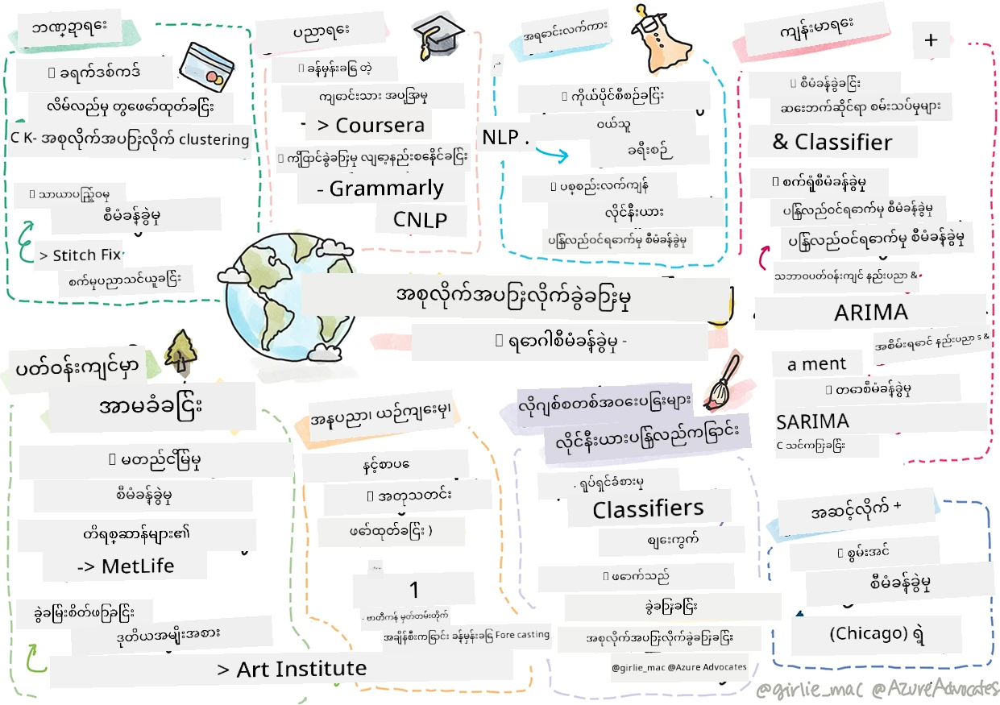

# အပြီးအစီး မှတ်စု - အမှန်တကယ်ကမ္ဘာကို ရှု့ရာတွင် စက်နှင့် သင်ယူမှု

> စကက်ချ်မှတ်သားချက်ကို [Tomomi Imura](https://www.twitter.com/girlie_mac) မှ ပြုစုသည်

သင်သည် ၎င်းပညာရပ်တွင် သင်ကြားသည့်အခါ ချိန်ညှိရန် ဒေတာပြင်ဆင်ခြင်းနည်းလမ်းများနှင့် စက်သင်ယူမှု မော်ဒယ်များ ဖန်တီးခြင်းနည်းလမ်းများကို များစွာလေ့လာခဲ့ပါသည်။ တိုင်းထွာမှု၊ အစုအဝေးခွဲခြားမှု၊ အတန်းခွဲခြားမှု၊ သဘာဝဘာသာစကားကို ထောက်ပံ့ရေးခြင်းနှင့် အချိန်ဇယားနိယာမ မော်ဒယ်များကို တည်ဆောက်ခဲ့ပါသည်။ ဂုဏ်ယူပါတယ်! ယခု သင်စဉ်းစား နေမှာ ဖြစ်တယ်... ဒီ မော်ဒယ်တွေကို အမှန်တကယ် ဘယ်လို အသုံးပြုကြတာလဲ?

စက်မှုလုပ်ငန်းတွင် AI ကို တစ်ခါတရံ အသုံးပြု၍ အလွန်စိတ်ဝင်စားမှုရရှိခဲ့သော်လည်း စက်သင်ယူမှုမော်ဒယ်ရိုးရှင်းသောတို့တွင်လည်း သုံးစွဲမှုအသုံးချနိုင်မှု မြင့်မားသေးသည်။ ယနေ့တစ်နေ့မှာတောင် ဒီအသုံးချမှုများတချို့ကို သင် အသုံးပြုနေနိုင်ပါသည်! ဒီသင်ခန်းစာမှာ စက်မှုလုပ်ငန်းအမျိုးအစားရှစ်ခုနှင့် အထူးကဏ္ဍများတွင် ဤမျိုးစုံမော်ဒယ်များကို အသုံးပြု၍ ၎င်း၏ အသုံးပြုမှုများကို ပိုမိုထိရောက်၊ ယုံကြည်စိတ်ချစေရန်၊ တရားမြတ်သောနှင့် အသုံးဝင်မှုရှိသော အဖြစ်လုပ်ဆောင်နေကြသည်ကို ရှာဖွေရမှာ ဖြစ်သည်။

## [သင်ခန်းစာမတိုင်ခင် စိစစ်မေးခွန်း](https://ff-quizzes.netlify.app/en/ml/)

## 💰 ဘဏ္ဍာရေး

ဘဏ္ဍာရေးကဏ္ဍမှာ စက်သင်ယူမှု အသုံးချရန် အခွင့်အလမ်းများစွာ ရှိသည်။ ဒီနယ်ပယ်ထဲရှိ ပြဿနာများ ဆက်စပ်ပြီး စက်သင်ယူမှုဖြင့် မော်ဒယ်ပြုလုပ်ကာ ဖြေရှင်းနိုင်ခြင်းများ ရှိပါသည်။

### ခရက်ဒစ်ကတ်လိမ်လည်မှု ကာကွယ်စစ်ဆေးခြင်း

သင်သည် အစောပိုင်းတွင် [k-means အစုအဝေးခွဲခြားမှု](../../5-Clustering/2-K-Means/README.md) ပြုလုပ်မှုကို လေ့လာခဲ့သည်၊ သို့သော် ၎င်းကို ခရက်ဒစ်ကတ်လိမ်လည်မှုနှင့် ဆက်စပ်သော ပြဿနာများကို မည်ကဲ့သို့ ဖြေရှင်းနိုင်သနည်း?

k-means အစုအဝေးခွဲခြားမှုသည် ခရက်ဒစ်ကတ်လိမ်လည်မှု ကာကွယ်စနစ်တွင် **အထူးထွက်များ (outlier detection)** အဖြစ် အသုံးပြုသည်။ အထူးထွက်များသည် ဒေတာအစုတစ်စုတွင် စောင့်ကြည့်ချက်များတွင် ကြာခြားမှုများဖြစ်ပြီး ခရက်ဒစ်ကတ်သည် ပုံမှန်အသုံးပြုမှုဖြစ်နေသည်ဟုတ်ဟု မဟုတ်ဟု ခွဲခြားပေးနိုင်သည်။ အောက်ပါ စာတမ်းတွင် ဖော်ပြထားသလို k-means မော်ဒယ်ဖြင့် ခရက်ဒစ်ကတ် ဒေတာများကို အစုအဝေးများအဖြစ် ကန့်သတ်ပြီး၊ လုပ်ငန်းဆောင်တာတိုင်းကို အထူးထွက်အသုံးပြုမှုအရ အစုတစ်ခုချင်းစီသို့ ခွဲခြားပေးနိုင်သည်။ ထို့နောက် အန္တရာယ်ဆုံး အစုများကို လိမ်လည်မှုနဲ့ တရားဝင်လုပ်ငန်းဆောင်တာများအနေဖြင့် သုံးသပ်နိုင်ပါသည်။
[Reference](https://citeseerx.ist.psu.edu/viewdoc/download?doi=10.1.1.680.1195&rep=rep1&type=pdf)

### ငွေကြေး စီမံခန့်ခွဲမှု

ငွေကြေး စီမံခန့်ခွဲမှုတွင် ကိုယ်ပိုင်သို့မဟုတ်ကုမ္ပဏီတစ်ခုသည် သုံးစွဲသူတစ်ဦး ဒါမှမဟုတ် အသင်းအတွက် ရင်းနှီးမြှုပ်နှံမှုများကို ကိုင်တွယ်သည်။ ၎င်း၏တာဝန်မှာ ရေရှည်အတွေ့အကြုံအတွက် ငွေကြေးကို ထိန်းသိမ်းပြီး တိုးတက်စေခြင်းဖြစ်သောကြောင့် ထိရောက်သော ရင်းနှီးမြှုပ်နှံမှုကိုေရြးချယ်ရပါမည်။

ရင်းနှီးမြှုပ်နှံမှုတစ်ခု၏ ဖောင်မော်ထိုးကို စစ်ဆေးမှုတစ်ခုက စာရင်းဇယား အနည်းငယ်မှတစ်ဆင့် ခုခံချက်တစ်ပါးသည် စတယ်လ့်ကတင်ခန့်မှန်းခြင်းဖြစ်ပါသည်။ [လင်းနီယာစတယ်လ့်](../../2-Regression/1-Tools/README.md) သည် ရင်းနှီးမြှုပ်နှံမှုတစ်ခု၏စတင်ယူဆချက်နှင့် ယှဉ်ပြိုင်သော အခြေခံခန့်မှန်းချက်များကို နားလည်ရန် အရေးပါတဲ့ကိရိယာတစ်ခု ဖြစ်သည်။ ထို့ပြင် စတယ်လ့်ရလဒ်များသည် စာရင်းဇယားအနေဖြင့် အရေးပါတော့မလား၊ ဒါမှမဟုတ် ရင်းနှီးမြှုပ်နှံသူ၏ ရင်းနှီးမြှုပ်နှံမှုကို မည်သို့ သက်ရောက်မှုရှိမည်ကို သုံးသပ်နိုင်ပါသည်။ လေ့လာမှုကို နည်းလမ်းပိုမိုကွဲပြားသော စတယ်လ့်များဖြင့် တိုးချဲ့နိုင်ပြီး အန္တရာယ်အချက်များကို ထည့်သွင်းစဉ်းစားနိုင်ပါသည်။ သတ်မှတ်ထားသော ငွေကြေးဖောင်တစ်ခုအတွက် စတယ်လ့်ဖြင့် အကဲဖြတ်ခြင်း စာတမ်းကို အောက်တွင် ကြည့်ရှုနိုင်သည်။
[Reference](http://www.brightwoodventures.com/evaluating-fund-performance-using-regression/)

## 🎓 ပညာရေး

ပညာရေးနယ်ပယ်များတွင်လည်း စက်သင်ယူမှုအသုံးပြုမှုများစွာ ရှိသည်။ စာမေးပွဲသို့မဟုတ် စာအဖွဲ့ရေးထဲ၌ လိမ်လည်မှုကို စစ်ဆေးခြင်း၊ မမြင်သာသော အမျိုးသမီးမဟုတ်သော အကြမ်းဖက်မှုများနှင့် ပြုပြင်ခြင်းလုပ်ငန်းစဉ်မှာ ရှုပ်ထွေးသော အကျိုးသက်ရောက်မှုများကို ကိုင်တွယ်နိုင်သော ခွင့်ရှိသည်။

### ကျောင်းသား စိတ်ဓာတ်ခန့်မှန်းခြေ

[Coursera](https://coursera.com) သည် အွန်လိုင်းသင်တန်းပေးသူတစ်ခုဖြစ်ပြီး အင်ဂျင်နီယာလုပ်ငန်း ဆုံးဖြတ်ချက်များကို ဆွေးနွေးသော ထုတ်လွှင့်ထားသော နည်းပညာဘလော့ဂ်ရှိသည်။ ဤလေ့လာမှုတွင် သူတို့သည် သင်ခန်းစာအရည်အသွေးနိမ့်ခြင်း (NPS) နှင့် သင်ရိုးတန်းတွေ့ဆုံမှု သို့မဟုတ် မက်ကွာခြင်းအကြား တွဲထိန်းမှုရှိမရှိ စစ်ဆေးရန် စတယ်လ့်လိုင်းတစ်ခုကို အကြောင်းပြုခဲ့သည်။
[Reference](https://medium.com/coursera-engineering/controlled-regression-quantifying-the-impact-of-course-quality-on-learner-retention-31f956bd592a)

### အမျိုးသမီး အလားအလာ လျော့ပါးခြင်း လုပ်ငန်းကိစ္စများ ကာကွယ်ခြင်း

[Grammarly](https://grammarly.com) သည် စာရေးအကူအညီပေးသော ကိရိယာတစ်ခုဖြစ်ပြီး စာလုံးပုဒ်နှင့် စာပိုဒ်တစ်ခုလုံးမှားတွေကို စစ်ဆေးပေးသည်။ ၎င်း၏ ကုန်ပစ္စည်းများတွင် နိုင်ငံတကာ [သဘာဝဘာသာစကားကိရိယာများ](../../6-NLP/README.md) ကို တိုးတက်စွာအသုံးပြုသည်။ သူတို့ နည်းပညာဘလော့ဂ်တွင် စက်သင်ယူမှုအမျိုးအစားများအတွက် အမျိုးသမီးအလားအလာ ပြဿနာဖြေရှင်းခဲ့ပုံကို စိတ်ဝင်စားဖွယ် ရေးသားခဲ့သည်။ သင်သည် ကျွန်ုပ်တို့၏ [အတန်းအတွင်းတရားမျှတမှု နိယာမသင်ခန်းစာ](../../1-Introduction/3-fairness/README.md) မှ လေ့လာခဲ့ဖူးသည်။
[Reference](https://www.grammarly.com/blog/engineering/mitigating-gender-bias-in-autocorrect/)

## 👜 လက်လီအရောင်း

လက်လီအရောင်း ပြဿနာများတွင် ဖောက်သည် ခရီးစဉ်ကောင်းမွန်မှုဖန်တီးခြင်းမှ စတင်၍ အကောင်းဆုံး ထုတ်ကုန်အသွင်းသိုလှောင်မှုထိ စက်သင်ယူမှု အသုံးချမှု အကျိုးရှိသည်။

### ဖောက်သည် ခရီးစဉ်ကို ပုဂ္ဂိုလ်ရေးပြုလုပ်ခြင်း

Wayfair ဆိုသည်မှာ ကုမ္ပဏီတစ်ခုဖြစ်ပြီး မီးပုံးစတိုင်ပစ္စည်းများကို ရောင်းချကာ ဖောက်သည်များ တိုင်းရင်းသား၏ အရသာနှင့် လိုအပ်ချက်များ အတွက် ထုတ်ကုန်မှန်များရှာဖွေရန်အရေးကြီးသည်။ ဒီဆောင်းပါးတွင် ကုမ္ပဏီမှ အင်ဂျင်နီယာများက စက်သင်ယူမှုနှင့် သဘာဝဘာသာစကားကို အသုံးပြု၍ "ဖောက်သည်များအတွက် မှန်ကန်သော ရလဒ်များကို ပြသရန်" ပြောကြားသည်။ အထူးသဖြင့် သူတို့၏ Query Intent Engine သည် ဖောက်သည် ပြန်လည်သုံးသပ်ချက်များပေါ်တွင် အရာဝတ္ထုထုတ်ယူခြင်း၊ အတန်းခွဲ လေ့ကျင့်မှု၊ ပစ္စည်းနှင့် အမြင်ထုတ်ယူခြင်း၊ခံစားချက် စာတန်းပေးခြင်းတို့ကို သုံးစွဲရန် တည်ဆောက်ထားသည်။ ၎င်းသည် အွန်လိုင်း လက်လီအရောင်းတွင် သဘာဝဘာသာစကားစနစ် အသုံးချမှု၏ ရိုးရာနမူနာတစ်ခုဖြစ်သည်။
[Reference](https://www.aboutwayfair.com/tech-innovation/how-we-use-machine-learning-and-natural-language-processing-to-empower-search)

### ပစ္စည်း သိုလှောင်မှု စီမံခန့်ခွဲမှု

[StitchFix](https://stitchfix.com) ဆိုသည်မှာ အသုံးပြုသူထံ အဝတ်အစားပို့ဆောင်ပေးသည့် ဘောက်စ်ဆိုင်တစ်ခုဖြစ်ပြီး အကြံပြုခြင်းနှင့် ပစ္စည်းသိုလှောင်မှု စီမံခန့်ခွဲမှုအတွက် စက်သင်ယူမှုကို အလွန်အကျွံ အားထားခြင်းဖြစ်သည်။ ၎င်းတို့၏ စတိုင်နည်းပညာအဖွဲ့များသည် ကုန်စာရင်းအဖွဲ့နှင့် ပူးပေါင်း၍ "တစ်ယောက်သော ဒေတာသိပ္ပံပညာရှင်တစ်ဦးက ဇီ၀ဗေဒနည်းပညာဂဏန်းရှင်ဓာတ်ခွဲခြင်းကို စမ်းသပ်၍ မယ့်အဝတ်အစားကို ခန့်မှန်းနိုင်သည့် ကိရိယာကို ဖန်တီးခဲ့သည်။ ၎င်းအရာကို ကုန်စာရင်းအဖွဲ့သို့ လာရောက်ခဲ့ပြီး ယခုအခါ ၎င်းတို့က သုံးစွဲသည့် ကိရိယာတစ်ခု ဖြစ်လာနိုင်သည်။"
[Reference](https://www.zdnet.com/article/how-stitch-fix-uses-machine-learning-to-master-the-science-of-styling/)

## 🏥 ကျန်းမာရေးစောင့်ရှောက်မှု

ကျန်းမာရေးစောင့်ရှောက်မှုနယ်ပယ်သည် သုတေသနတာဝန်များနှင့် လူနာများအား ပြန်လည်တက်ရောက်မှု သို့မဟုတ် ရောဂါ ကပ်လျက် ထိန်းချုပ်မှု တို့မှာ စက်သင်ယူမှုကို အကျိုးရှိစွာ အသုံးချနိုင်သည်။

### ဆေးစမ်းသပ်မှုစီမံခန့်ခွဲမှုပြဿနာ

ဆေးစမ်းသပ်မှုတွင် အဆိပ်အတောက်သည် ဆေးထုတ်လုပ်သူများအတွက် အဓိကပူပန်မှုပြဿနာဖြစ်သည်။ ဘယ်လောက်အဆိပ်ကို ချွတ်နိုင်သနည်း? ဤသုတေသနတွင် ဆေးစမ်းသပ်မှုနည်းပညာရှာဖွေရေးများနှင့်အတူ အခြေအနေများခန့်မှန်းခြင်းအသစ်တစ်ခုကို ဖန်တီးခဲ့သည်။ အထူးသဖြင့် random forest ကို အသုံးပြု၍ ဆေးအုပ်စုအသီးသီးကို ခွဲခြားနိုင်သော [အတန်းခွဲစနစ် (classifier)](../../4-Classification/README.md) ကို တည်ဆောက်နိုင်ခဲ့သည်။
[Reference](https://www.sciencedirect.com/science/article/pii/S2451945616302914)

### ဆေးရုံ ပြန်လည်တက်ရောက်မှု စီမံခန့်ခွဲမှု

ဆေးရုံစောင့်ရှောက်မှုသည်စျေးနှုန်းမြင့်သည်၊ အထူးသဖြင့် လူနာများ ပြန်လည်တက်ရောက်ရသည့်အခါ။ ဒီစာတမ်းတွင် ML ကို အသုံးပြု၍ [အစုအဝေးခွဲခြားမှု](../../5-Clustering/README.md) စနစ်ဖြင့် ပြန်လည်တက်ရောက်မှုရှိနိုင်ချေကို ခန့်မှန်းကြောင်းဖော်ပြသည်။ ဤအစုများက "မျိုးစုံသောပြန်လည်တက်ရောက်မှုပေးသောအုပ်စုများကို ရှာဖွေတွေ့ရှိရန်" ကူညီသည်။
[Reference](https://healthmanagement.org/c/healthmanagement/issuearticle/hospital-readmissions-and-machine-learning)

### ရောဂါစီမံခန့်ခွဲမှု

ကိုဗစ်ကပ်ရောဂါကဲ့သို့ နောက်ဆုံးဗိသုကာကာလတွင် စက်သင်ယူမှုက ရောဂါပြန့်ပွားမှုကို တားဆီးရာတွင် အလင်းစိုက် ချထားသည်။ ဤဆောင်းပါးတွင် ARIMA, logistic curves, linear regression, SARIMA ဆိုင်ရာအသုံးပြုမှုများကို တွေ့မြင်ရမည်။ "ဤလေ့လာမှုသည် ဤဗိုင်းရပ်စ်တို့၏ ပြန်လည်ပြန့်ပွားမှုနှုန်းကို ခန့်မှန်မှန်းခြေခြင်းဖြစ်ပြီး အသေဆုံးမှု၊ ကုန်လွန်မှု၊ အတည်ပြု ရောဂါကြုံတွေ့မှုများကို ကြိုတင်ခန့်မှန်းရန် အကူအညီပေးမည်ဖြစ်သည်။"
[Reference](https://www.ncbi.nlm.nih.gov/pmc/articles/PMC7979218/)

## 🌲 သဘာဝပတ်ဝန်းကျင် နှင့် အစိမ်းနှင့် နည်းပညာ

သဘာဝနှင့် သုပ်တောဟူသည် သတ္တဝါနှင့် သဘာဝ၏ တုံ့ပြန်ဆက်ဆံမှုရှိသော ကြောင့် ပျက်စီးမှုများကို တိတိကျကျ တိုင်းတာနိုင်ပြီး တင်းကြပ်စွာ ကိုင်တွယ်ရန် အရေးကြီးသည်။ မျိုးစိုက်မှု သို့မဟုတ် သတ္တဝါများ ဇယားကျမည့် ဖြစ်ရပ်များတွင် သင့်တော်သော လှုပ်ရှားမှုများ ပြုလုပ်ပေးရပါမည်။

### သစ်တော စီမံခန့်ခွဲမှု

သင်သည် ယခင်သင်ခန်းစာများတွင် [ထပ်မံလေ့လာမှု](../../8-Reinforcement/README.md) ကို လေ့လာခဲ့သည်။ သဘာဝအတွင်း နမူနာခန္ဓာ့လမ်းညွန်များ ခန့်မှန်းရာတွင် အထူးအသုံးဝင်သည်။ အထူးသဖြင့် သစ်တောမီးလောင်မှုများနှင့် အန္တရာယ်ရှိသော အသဉ်းဖွင့်ပိုးများ ပြန့်ပွားမှုတို့ကို စောင့်ကြည့်နိုင်သည်။ ကနေဒါတွင် သုတေသနဆိုင်ရာအဖွဲ့တစ်ခုက Reinforcement Learning ကို လေကြောင်းဓာတ်ပုံပေါ်မှ သစ်တောမီးလောင်မှုမော်ဒယ်များ ဖန်တီးရန် အသုံးပြုခဲ့သည်။ "spatially spreading process (SSP)" ဟု ခေါ်သော ပြုပြင်မှုတစ်ခုဖြင့် သစ်တောမီးလုံးကို သဘာဝအတိုင်း ဇယားတစ်ခု၏ ဆဲလ်တစ်ခုအတွက် ဆိုင်ရာ အေးဂျင့်အဖြစ် ဖော်ပြထားသည်။  "မီးလောင်မှုသည် အချိန်အမျိုးမျိုးတွင် မြောက်၊ တောင်၊ အရှေ့၊ အغربသို့ ပြန့်ပွားမှု သို့မဟုတ် မပြန့်ပွားမှု ပြုနိုင်ပါသည်။"

ဤနည်းလမ်းသည် ဓါတ်ပုံသွက်နယ်ပယ်၏ Markov Decision Process (MDP) တန်ဖိုးသိရှိမှုစနစ်အား လုံးဝ ပြောင်းလဲမည်ဖြစ်သည်။ ဤအဖွဲ့မော်ဒယ်များ၏ ရိုးရာအယ်လဂိုရီသည်မျှကို အောက်ပါ လင့်ခ်တွင် ဖတ်ရှုနိုင်သည်။
[Reference](https://www.frontiersin.org/articles/10.3389/fict.2018.00006/full)

### သတ္တဝါများ၏ လှုပ်ရှားမှု ချိတ်ဆက်မှု

အမြင့်ပြင်းထန်သော နည်းပညာဖြစ်သည့် deep learning က သတ္တဝါလှုပ်ရှားမှုကို ထိရောက်စွာ စောင့်ကြည့်ခြင်း ရလဒ် ပြောင်းလဲမှု တစ်ခု ဖြစ်လာခဲ့သည် (သင့်ကိုယ်ပိုင် [polar bear tracker](https://docs.microsoft.com/learn/modules/build-ml-model-with-azure-stream-analytics/?WT.mc_id=academic-77952-leestott) တည်ဆောက်နိုင်သည်)။ သို့သော် ရိုးရိုးစက်သင်ယူမှုလည်း ဤလုပ်ငန်းတွင် အသုံးဖြစ်နေဆဲ ဖြစ်သည်။

မိုးမွှမ်းသတ္တဝါလှုပ်ရှားမှုများစောင့်ကြည့်ရန် ဆင်ဆာများနှင့် IoT မှာ ဤအမျိုးအစား တွေ့မြင်မှု ပြုလုပ်မှုကို အသုံးပြုကြပြီး ဒေတာ မတည့်မှုများကို အထူး ML နည်းပညာဖြင့် ကြိုတင် စစ်ဆေးကြသည်။ ဥပမာအားဖြင့်၊ ဤစာတမ်းတွင် ဆိတ်လေးများ၏ ခန္ဓာကိုယ်အနေအထားများကို အတန်းခွဲစနစ်များဖြင့် စောင့်ကြည့် စစ်ဆေးခဲ့သည်။ စာမျက်နှာ ၃၃၅ တွင် ROC ကွက်ကို သင် မှတ်မိနိုင်ပါသည်။
[Reference](https://druckhaus-hofmann.de/gallery/31-wj-feb-2020.pdf)

### ⚡️ စွမ်းအင် စီမံခန့်ခွဲမှု
  
ကျွန်ုပ်တို့၏ [အချိန်စီးရီး ခန့်မှန်းချက်](../../7-TimeSeries/README.md) သင်ခန်းစာတွင် မြို့တော်အတွက် နေရပ်ဒေသများ စီမံခန့်ခွဲမှုအတွက် smart parking meters ကို အသုံးပြုပြီး ထွက်ကုန်နှင့် တောင်းဆိုမှုကို ပြန်လည်နားထောင်ခြင်းရေးထားသည်။ ဤဆောင်းပါးမှာ ไอร์แลนด์နိုင်ငံ၏ စမတ်မီတာအခြေပြု စွမ်းအင်သုံးစားမှု ခန့်မှန်းခြင်းအား အေစုအဝေးခွဲခြားမှု၊ စတယ်လ့်နှင့် အချိန်စီးရီးချိန်ခန့်မှန်းမှုတို့ပေါင်းစပ်သုံးစွဲမှုကို အသေးစိတ် ဆွေးနွေးထားသည်။
[Reference](https://www-cdn.knime.com/sites/default/files/inline-images/knime_bigdata_energy_timeseries_whitepaper.pdf)

## 💼 အာမခံ

အာမခံကဏ္ဍသည် စီးပွားရေးနှင့် အာမခံဆိုင်ရာ မော်ဒယ်များကို တည်ဆောက်၍ အဆင်ပြေစွာ စီမံခန့်ခွဲရန် စက်သင်ယူမှုကို အသုံးပြုသည်။

### ကွာခြားမှု စီမံခန့်ခွဲမှု

MetLife အာမခံကုမ္ပဏီသည် ငွေကြေးမော်ဒယ်များတွင် ကွာခြားမှုများကို စိစစ်ပြီး လျှော့ချပေးမှု နည်းလမ်းများကို ဖော်ပြထားသည်။ ဤဆောင်းပါးတွင်ဒစ်ဂျစ်တယ်နှင့် စာရင်းဗေဒအတန်းခွဲရေး မျှဝေမှုများကို တွေ့မြင်ရမည်ဖြစ်ပြီး ခန့်မှန်းချက် ပြသမှုများပါရှိသည်။
[Reference](https://investments.metlife.com/content/dam/metlifecom/us/investments/insights/research-topics/macro-strategy/pdf/MetLifeInvestmentManagement_MachineLearnedRanking_070920.pdf)

## 🎨 အနုပညာ၊ ယဉ်ကျေးမှုနှင့် စာပေ

အနုပညာတွင် ဥပမာအားဖြင့် သတင်းစာထုတ်လုပ်ရေးကဲ့သို့ လိမ်လည်သတင္းတွေ့၇ၣ်ကိစ္စ làအဓိက ဖြစ်သည်၊ ၎င်းသည် လူ့မြတ်နိုးစိတ်ကို ထိခိုက်ပြီး ဒီမိုကရေစီ များစုစည်းနိုင။ ပြတိုက်များသည် မူရင်းပစ္စည်းများနှင့် ယှဉ်၍ အရင်းအမြစ်စီမံခန့်ခွဲမှုအထိ အဓိက အကျိုးရှိစေရန် အထောက်အကူပြုသည်။

### လိမ်လည်သတင်းစစ်ဆေးခြင်း

လိမ်လည်သတင်းစစ်ဆေးခြင်းသည် ယနေ့မီဒီယာ၌ ကြိုးစားလျက်ရှိသော အပြိုင်အဆိုင်ကစားခြင်း တစ်ခုဖြစ်လာသည်။ ဤဆောင်းပါးတွင် သုတေသနကျွမ်းကျင်သူများက ကျွန်ုပ်တို့ လေ့လာခဲ့သော စက်သင်ယူမှုနည်းပညာများစွာ ပေါင်းစပ်သုံးစွဲသော စနစ်တစ်ခုစမ်းသပ်ပြီး အကောင်းဆုံး မော်ဒယ်ကို စမ်းသပ်၍ တပ်ဆင်ကြောင်း ချဉ်းကပ်သည်။ "ဤစနစ်သည် သဘာဝဘာသာစကား ပြန်လည်သုံးသပ်မှု ရှိ၍ ဒေတာမှ လက္ခဏာများကိုထုတ်ယူပြီး၊ Naive Bayes, Support Vector Machine (SVM), Random Forest (RF), Stochastic Gradient Descent (SGD), Logistic Regression(LR) ကဲ့သို့ စက်သင်ယူမှု အတန်းခွဲစနစ်များ လေ့ကျင့်ရန် သုံးသည်။"
[Reference](https://www.irjet.net/archives/V7/i6/IRJET-V7I6688.pdf)

ဤဆောင်းပါးသည် စက်သင်ယူမှု နယ်ပယ်များစွာ ပေါင်းစပ်ခြင်းဖြင့် လက်တွေ့ကောင်းမွန်သည့် ရလဒ်များထုတ်ပေးနိုင်ပြီး လိမ်လည်သတင်းများ ပြန့်ပွားမှု နှင့် စိုးရိမ်ရသော ပျက်စီးမှုများ အောင်မလုပ်စေရန် ကူညီနိုင်ကြောင်းပြသည်။ ဤအမှုတွင် COVID ကုသမှုများအကြောင်း လျှို့ဝှက်ချက်များ ပြန့်ပွား၍ လူဦးရေ ဆူပူမှု ဖြစ်ခဲ့သည်။

### ပြတိုက်တွင် စက်သင်ယူမှု

ပြတိုက်များသည် AI တိုးတက်နေသည့်အချိန် လူ့ဒီဂျစ်တယ်များနှင့် စုပေါင်းရန်နှင့် မူရင်းသက်တမ်းစာရွက်စာတမ်းများမှ တွဲချိတ်မှုများ ရှာဖွေရန် လွယ်ကူပြီဖြစ်လာသည်။ [In Codice Ratio](https://www.sciencedirect.com/science/article/abs/pii/S0306457321001035#:~:text=1.,studies%20over%20large%20historical%20sources.) ကဲ့သို့သော ပရောဂျက်များသည် ဗာတီကန်စာရွက်စာတမ်းများ ပိတ်ထားခြင်းကို ဖြေရှင်းရာတွင် ကူညီနေသည်။ ပြတိုက်စီးပွားရေးအပိုင်းမှာလည်း စက်သင်ယူမှု မော်ဒယ်များက ကူညီနေသည်။

ဥပမာအားဖြင့် Chicago အနုပညာအဖွဲ့အစည်းသည် ပရိသတ်တို့စိတ်ဝင်စားမှုများကို ခန့်မှန်းပြီး ပြပွဲများအတွက် ဘယ်တော့တက်ရောက်မည်ကို ခန့်မှန်းသည့် မော်ဒယ်တွေ ဖန်တီးခဲ့သည်။ ရည်ရွယ်ချက်မှာ သုံးစွဲသူတိုင်း ပြတိုက်သို့တက်ရောက်သည့်အခါ ပုဂ္ဂိုလ်ရေးနှင့် ထိရောက်သည့် ခရီးစဉ်ဖန်တီးခြင်းဖြစ်သည်။ "2017 ဘဏ္ဍာရေးနှစ်အတွင်း ထိုမော်ဒယ်သည် တက်ရောက်မှုနှင့် ဝင်ခွင့် ခန့်မှန်းချက်အား ၁ ရာခိုင်နှုန်း အစီအစဉ်အတိုင်း တိကျစွာ ခန့်မှန်းနိုင်ခဲ့ဟု Andrew Simnick၊ Art Institute ၏ ဒီဂရီအဆင့်မြင့် ဥက္ကဋ္ဌ ပြောသည်။"
[Reference](https://www.chicagobusiness.com/article/20180518/ISSUE01/180519840/art-institute-of-chicago-uses-data-to-make-exhibit-choices)

## 🏷 စျေးကွက်ရှာဖွေရေး

### ဖောက်သည်အုပ်စု ခွဲခြားခြင်း

အကောင်းဆုံးစျေးကွက်ရှာဖွေရေး သတ္တိစနစ်များသည် ဖောက်သည်များကို အုပ်စုအလိုက် မတူညီသည့် နည်းလမ်းဖြင့်ရည်ရွယ်သည်။ ဤဆောင်းပါးမှာ အစုအဝေးခွဲခြားမှုအယ်လဂိုရီသည်များကို အသုံးပြုကာ ခွဲခြားထားသောစျေးကွက်ရှာဖွေရေးကို ထောက်ပံ့သည်။ ခွဲခြားထားသော စျေးကွက်ရှာဖွေရေးသည် ကုမ္ပဏီများအား အမှတ်တံဆိပ် အသိအမှတ်ပြုမှုတိုးတက်ခြင်း၊ ဖောက်သည်များပိုမိုရောက်ရှိနိုင်ခြင်းနှင့် အမြတ်ပိုများစေရန် ကူညီပေးသည်။
[Reference](https://ai.inqline.com/machine-learning-for-marketing-customer-segmentation/)

## 🚀 စိန်ခေါ်မှု

ဤ သင်ခန်းစာတွင် သင်ယူခဲ့သော နည်းလမ်းများအချို့ကို အသုံးပြုသော နယ်ပယ်အသစ်တစ်ခုကို ရှာဖွေပြီး၊ စက်သင်ယူမှု မည်သို့ အသုံးချနေသည်ကို ရှာဖွေပါ။

## [စာသင်ပြီးနောက် စစ်တမ်း](https://ff-quizzes.netlify.app/en/ml/)

## ပြန်လည်စစ်ဆေးခြင်းနှင့် ကိုယ့်ကိုယ်ကိုလေ့လာမှု

Wayfair ဒေတာသိပ္ပံအဖွဲ့က သူတို့ကုမ္ပဏီမှာ ML ကို ဘယ်လိုအသုံးပြုနေတယ်ဆိုတာကို စိတ်ဝင်စားဖွယ် ရုပ်သံများ အများကြီးရှိပါတယ်။ [ကြည့်ရှုဖို့](https://www.youtube.com/channel/UCe2PjkQXqOuwkW1gw6Ameuw/videos) တစ်ကြိမ်လောက် သတိပြုဖို့တန်ပါပြီ!

## အလုပ်အမှု

[ML ရှာဖွေခြင်း အားဖြည့်လုပ်ငန်း](assignment.md)

---

<!-- CO-OP TRANSLATOR DISCLAIMER START -->
**ပြောကြားချက်**
ဤစာတမ်းကို AI ဘာသာပြန်ဝန်ဆောင်မှု [Co-op Translator](https://github.com/Azure/co-op-translator) အသုံးပြု၍ ဘာသာပြန်ထားပါသည်။ ကျွန်ုပ်တို့သည် တိကျမှန်ကန်မှုအတွက် ကြိုးပမ်းနေသော်လည်း၊ စက်ကိရိယာဘာသာပြန်ခြင်းများတွင် အမှားများ သို့မဟုတ် မှားယွင်းချက်များ ပါဝင်နိုင်ကြောင်း သတိပြုပါရန် လိုအပ်ပါသည်။ မူလစာတမ်းကို မူရင်းဘာသာဖြင့်သာ ယုံကြည်စိတ်ချရသော အချက်အလက်အဖြစ် သတ်မှတ်သင့်သည်။ အရေးကြီးသည့် သတင်းအချက်အလက်များအတွက် ပရော်ဖက်ရှင်နယ် လူသားဘာသာပြန်သူဝန်ဆောင်မှုကို အကြံပြုပါသည်။ ဤဘာသာပြန်ချက်ကို အသုံးပြုခြင်းမှ ဖြစ်ပေါ်လာသော နားလည်မှုကွာခြားမှုများ သို့မဟုတ် မမှန်ကန်သော အသုံးပြုမှုများအတွက် ကျွန်ုပ်တို့ တာဝန်မခံပါ။
<!-- CO-OP TRANSLATOR DISCLAIMER END -->