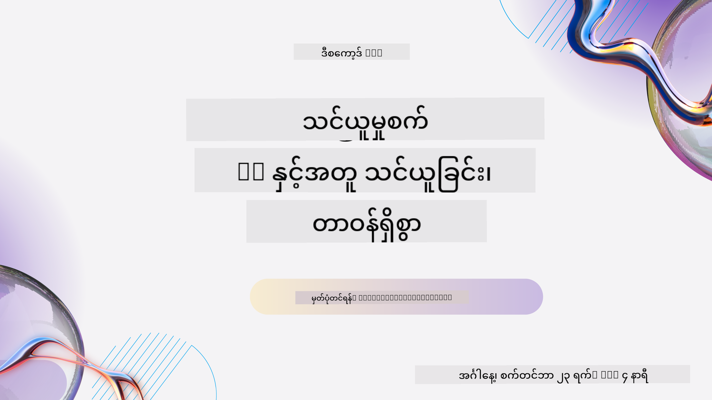
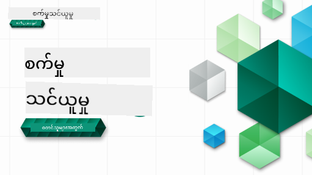

<!--
CO_OP_TRANSLATOR_METADATA:
{
  "original_hash": "7a13afb3674838f557d61f8d67e4d5f8",
  "translation_date": "2025-10-24T09:26:34+00:00",
  "source_file": "README.md",
  "language_code": "my"
}
-->

### 🌐 ဘာသာစကားအမျိုးမျိုးအတွက် ပံ့ပိုးမှု

#### GitHub Action မှတဆင့် ပံ့ပိုးထားသည် (အလိုအလျောက် & အမြဲတမ်းနောက်ဆုံးပေါ်)

<!-- CO-OP TRANSLATOR LANGUAGES TABLE START -->
[Arabic](../ar/README.md) | [Bengali](../bn/README.md) | [Bulgarian](../bg/README.md) | [Burmese (Myanmar)](./README.md) | [Chinese (Simplified)](../zh/README.md) | [Chinese (Traditional, Hong Kong)](../hk/README.md) | [Chinese (Traditional, Macau)](../mo/README.md) | [Chinese (Traditional, Taiwan)](../tw/README.md) | [Croatian](../hr/README.md) | [Czech](../cs/README.md) | [Danish](../da/README.md) | [Dutch](../nl/README.md) | [Estonian](../et/README.md) | [Finnish](../fi/README.md) | [French](../fr/README.md) | [German](../de/README.md) | [Greek](../el/README.md) | [Hebrew](../he/README.md) | [Hindi](../hi/README.md) | [Hungarian](../hu/README.md) | [Indonesian](../id/README.md) | [Italian](../it/README.md) | [Japanese](../ja/README.md) | [Korean](../ko/README.md) | [Lithuanian](../lt/README.md) | [Malay](../ms/README.md) | [Marathi](../mr/README.md) | [Nepali](../ne/README.md) | [Norwegian](../no/README.md) | [Persian (Farsi)](../fa/README.md) | [Polish](../pl/README.md) | [Portuguese (Brazil)](../br/README.md) | [Portuguese (Portugal)](../pt/README.md) | [Punjabi (Gurmukhi)](../pa/README.md) | [Romanian](../ro/README.md) | [Russian](../ru/README.md) | [Serbian (Cyrillic)](../sr/README.md) | [Slovak](../sk/README.md) | [Slovenian](../sl/README.md) | [Spanish](../es/README.md) | [Swahili](../sw/README.md) | [Swedish](../sv/README.md) | [Tagalog (Filipino)](../tl/README.md) | [Tamil](../ta/README.md) | [Thai](../th/README.md) | [Turkish](../tr/README.md) | [Ukrainian](../uk/README.md) | [Urdu](../ur/README.md) | [Vietnamese](../vi/README.md)
<!-- CO-OP TRANSLATOR LANGUAGES TABLE END -->

#### ကျွန်ုပ်တို့၏ အသိုင်းအဝိုင်းနှင့် ပူးပေါင်းပါ

ကျွန်ုပ်တို့တွင် AI နှင့်အတူ သင်ယူခြင်းဆိုင်ရာ Discord စီးရီးရှိပြီး၊ 2025 ခုနှစ် စက်တင်ဘာလ 18 ရက်မှ 30 ရက်အထိ [Learn with AI Series](https://aka.ms/learnwithai/discord) တွင် ပိုမိုသိရှိရန်နှင့် ကျွန်ုပ်တို့နှင့် ပူးပေါင်းပါ။ GitHub Copilot ကို Data Science အတွက် အသုံးပြုခြင်းဆိုင်ရာ အကြံဉာဏ်များနှင့် လှည့်ကွက်များကို ရရှိပါမည်။

# စတင်သူများအတွက် Machine Learning - သင်ရိုး

> 🌍 ကမ္ဘာ့ယဉ်ကျေးမှုများကို အသုံးပြု၍ Machine Learning ကိုလေ့လာရင်း ကမ္ဘာ့အနှံ့ ခရီးသွားကြမယ် 🌍

Microsoft မှ Cloud Advocates များသည် **Machine Learning** အကြောင်းကို ၁၂ ပတ်၊ ၂၆ သင်ခန်းစာ သင်ရိုးတစ်ခုကို ပေးဆောင်ရန် ဝမ်းမြောက်ဝမ်းသာဖြစ်နေပါသည်။ ဤသင်ရိုးတွင် **classic machine learning** ဟုခေါ်သောအရာများကို Scikit-learn ကို အဓိကစာကြည့်တိုက်အဖြစ် အသုံးပြု၍ သင်ယူမည်ဖြစ်ပြီး၊ ကျွန်ုပ်တို့၏ [AI for Beginners' curriculum](https://aka.ms/ai4beginners) တွင် ဖော်ပြထားသော deep learning ကို ရှောင်ရှားထားပါသည်။ ဤသင်ခန်းစာများကို ကျွန်ုပ်တို့၏ ['Data Science for Beginners' curriculum](https://aka.ms/ds4beginners) နှင့် တွဲဖက်ပါ။

ကျွန်ုပ်တို့နှင့်အတူ ကမ္ဘာ့အနှံ့ ခရီးသွားပြီး ကမ္ဘာ့ဒေသများမှ ဒေတာများကို classic နည်းလမ်းများဖြင့် အသုံးချပါ။ သင်ခန်းစာတစ်ခုစီတွင် သင်ခန်းစာမတိုင်မီနှင့်ပြီးနောက် စစ်ဆေးမှုများ၊ သင်ခန်းစာကို ပြီးမြောက်ရန် ရေးသားထားသောညွှန်ကြားချက်များ၊ ဖြေရှင်းချက်၊ လုပ်ငန်းတာဝန်များနှင့် အခြားအရာများ ပါဝင်သည်။ ကျွန်ုပ်တို့၏ ပရောဂျက်အခြေခံ သင်ကြားမှုနည်းလမ်းသည် သင်ယူရင်း တည်ဆောက်ရန် ခွင့်ပြုသည်။ ဤနည်းလမ်းသည် ကျွမ်းကျင်မှုအသစ်များကို 'တည်' စေသော အတည်ပြုထားသော နည်းလမ်းတစ်ခုဖြစ်သည်။

**✍️ ကျေးဇူးအထူးတင်ရှိပါသည်** Jen Looper, Stephen Howell, Francesca Lazzeri, Tomomi Imura, Cassie Breviu, Dmitry Soshnikov, Chris Noring, Anirban Mukherjee, Ornella Altunyan, Ruth Yakubu နှင့် Amy Boyd

**🎨 ကျေးဇူးတင်ရှိပါသည်** Tomomi Imura, Dasani Madipalli, နှင့် Jen Looper

**🙏 Microsoft Student Ambassador များအား အထူးကျေးဇူးတင်ရှိပါသည် 🙏** Rishit Dagli, Muhammad Sakib Khan Inan, Rohan Raj, Alexandru Petrescu, Abhishek Jaiswal, Nawrin Tabassum, Ioan Samuila, နှင့် Snigdha Agarwal

**🤩 Microsoft Student Ambassadors Eric Wanjau, Jasleen Sondhi, နှင့် Vidushi Gupta အား R သင်ခန်းစာများအတွက် အထူးကျေးဇူးတင်ရှိပါသည်!**

# စတင်ရန်

ဤအဆင့်များကို လိုက်နာပါ:
1. **Repository ကို Fork လုပ်ပါ**: ဤစာမျက်နှာ၏ အပေါ်ယံညာဘက်ထောင့်ရှိ "Fork" ခလုတ်ကို နှိပ်ပါ။
2. **Repository ကို Clone လုပ်ပါ**:   `git clone https://github.com/microsoft/ML-For-Beginners.git`

> [ဤသင်ရိုးအတွက် အပိုဆောင်းအရင်းအမြစ်များအား Microsoft Learn collection တွင် ရှာဖွေပါ](https://learn.microsoft.com/en-us/collections/qrqzamz1nn2wx3?WT.mc_id=academic-77952-bethanycheum)

> 🔧 **အကူအညီလိုပါသလား?** [Troubleshooting Guide](TROUBLESHOOTING.md) ကို စစ်ဆေးပြီး၊ တပ်ဆင်ခြင်း၊ စနစ်တပ်ဆင်ခြင်းနှင့် သင်ခန်းစာများကို အကောင်အထည်ဖော်ရာတွင် ဖြစ်နိုင်သော ပြဿနာများအတွက် ဖြေရှင်းချက်များကို ရှာဖွေပါ။

**[ကျောင်းသားများ](https://aka.ms/student-page)**, ဤသင်ရိုးကို အသုံးပြုရန်၊ repo အားလုံးကို သင်၏ GitHub အကောင့်သို့ fork လုပ်ပြီး၊ သင့်ကိုယ်တိုင် သို့မဟုတ် အဖွဲ့နှင့်အတူ လေ့ကျင့်မှုများကို ပြီးမြောက်ပါ:

- သင်ခန်းစာမတိုင်မီ စစ်ဆေးမှုဖြင့် စတင်ပါ။
- သင်ခန်းစာကို ဖတ်ပြီး လှုပ်ရှားမှုများကို ပြီးမြောက်ပါ၊ အသိပညာစစ်ဆေးမှုတစ်ခုစီတွင် ရပ်နားပြီး ပြန်လည်စဉ်းစားပါ။
- သင်ခန်းစာများကို နားလည်ခြင်းဖြင့် ပရောဂျက်များကို ဖန်တီးရန် ကြိုးစားပါ၊ သို့သော် ဖြေရှင်းချက်ကုဒ်ကို `/solution` ဖိုလ်ဒါများတွင် ရရှိနိုင်ပါသည်။
- သင်ခန်းစာပြီးနောက် စစ်ဆေးမှုကို ပြုလုပ်ပါ။
- စိန်ခေါ်မှုကို ပြီးမြောက်ပါ။
- လုပ်ငန်းတာဝန်ကို ပြီးမြောက်ပါ။
- သင်ခန်းစာအုပ်စုတစ်ခုကို ပြီးမြောက်ပြီးနောက်၊ [Discussion Board](https://github.com/microsoft/ML-For-Beginners/discussions) သို့ သွားပြီး "learn out loud" လုပ်ပါ။ သင့် PAT rubric ကို ဖြည့်စွက်ပါ။ PAT ဆိုသည်မှာ သင်ယူမှုကို တိုးတက်စေသော rubric ဖြစ်သည်။ ကျွန်ုပ်တို့အတူတူ သင်ယူနိုင်ရန် အခြား PAT များကိုလည်း တုံ့ပြန်နိုင်ပါသည်။

> ထပ်မံလေ့လာရန်၊ ဤ [Microsoft Learn](https://docs.microsoft.com/en-us/users/jenlooper-2911/collections/k7o7tg1gp306q4?WT.mc_id=academic-77952-leestott) modules နှင့် သင်ယူလမ်းကြောင်းများကို လိုက်နာရန် အကြံပြုပါသည်။

**ဆရာများ**၊ ကျွန်ုပ်တို့သည် ဤသင်ရိုးကို အသုံးပြုရန်အတွက် [အကြံပြုချက်များ](for-teachers.md) ပါဝင်ထားသည်။

---

## ဗီဒီယို လမ်းညွှန်များ

သင်ခန်းစာတချို့ကို အတိုချုံးဗီဒီယိုအဖြစ် ရရှိနိုင်ပါသည်။ ဤဗီဒီယိုများအားလုံးကို သင်ခန်းစာများတွင် ရှာနိုင်ပါသည်၊ သို့မဟုတ် [Microsoft Developer YouTube channel](https://aka.ms/ml-beginners-videos) တွင် ML for Beginners playlist တွင် ရှာဖွေပါ။

---

## အဖွဲ့ကို တွေ့ဆုံပါ

**Gif by** [Mohit Jaisal](https://linkedin.com/in/mohitjaisal)

> 🎥 အထက်ပါပုံကို နှိပ်ပြီး ပရောဂျက်နှင့် ဖန်တီးသူများအကြောင်း ဗီဒီယိုကို ကြည့်ပါ!

---

## သင်ကြားမှုနည်းလမ်း

ကျွန်ုပ်တို့သည် ဤသင်ရိုးကို တည်ဆောက်ရာတွင် သင်ကြားမှုနည်းလမ်းနှစ်ခုကို ရွေးချယ်ထားသည်။ အတန်းများသည် **ပရောဂျက်အခြေခံ** ဖြစ်ပြီး **မကြာခဏ စစ်ဆေးမှုများ** ပါဝင်သည်။ ထို့အပြင်၊ ဤသင်ရိုးတွင် **အဓိကအကြောင်းအရာ** ပါဝင်ပြီး သင်ရိုးကို ပိုမိုတည်ငြိမ်စေသည်။

အကြောင်းအရာများသည် ပရောဂျက်များနှင့် ကိုက်ညီစေရန် သေချာစေခြင်းအားဖြင့်၊ ကျောင်းသားများအတွက် ပိုမိုစိတ်ဝင်စားစေပြီး၊ အယူအဆများကို ပိုမိုမှတ်မိစေပါသည်။ ထို့အပြင်၊ အတန်းမတိုင်မီ အနိမ့်ဆုံးစစ်ဆေးမှုသည် ကျောင်းသား၏ အာရုံစိုက်မှုကို သင်ခန်းစာတစ်ခုကို သင်ယူရန် သတ်မှတ်ပေးပြီး၊ အတန်းပြီးနောက် စစ်ဆေးမှုသည် ပိုမိုမှတ်မိစေပါသည်။ ဤသင်ရိုးကို အပြည့်အစုံ သို့မဟုတ် အစိတ်အပိုင်းအဖြစ် လိုက်နာနိုင်ပြီး၊ ပျော်ရွှင်စေသော နည်းလမ်းဖြစ်စေရန် ဒီဇိုင်းဆွဲထားသည်။ ပရောဂျက်များသည် သေးငယ်ပြီး ၁၂ ပတ်အတွင်း ပိုမိုရှုပ်ထွေးလာသည်။ ဤသင်ရိုးတွင် ML ၏ အမှန်တကယ်အသုံးချမှုများအကြောင်း postscript ပါဝင်ပြီး၊ အပိုအမှတ် သို့မဟုတ် ဆွေးနွေးမှုအခြေခံအဖြစ် အသုံးပြုနိုင်သည်။

> ကျွန်ုပ်တို့၏ [Code of Conduct](CODE_OF_CONDUCT.md), [Contributing](CONTRIBUTING.md), [Translation](TRANSLATIONS.md), နှင့် [Troubleshooting](TROUBLESHOOTING.md) လမ်းညွှန်ချက်များကို ရှာဖွေပါ။ သင်၏ အဆောက်အအုံဆန်းသစ်မှုအတွက် ကျွန်ုပ်တို့၏ အကြံပြုချက်များကို ကြိုဆိုပါသည်!

## သင်ခန်းစာတစ်ခုစီတွင် ပါဝင်သည်

- ရွေးချယ်နိုင်သော sketchnote
- ရွေးချယ်နိုင်သော အပိုဗီဒီယို
- ဗီဒီယို လမ်းညွှန် (သင်ခန်းစာတချို့တွင်သာ)
- [သင်ခန်းစာမတိုင်မီ စစ်ဆေးမှု](https://ff-quizzes.netlify.app/en/ml/)
- ရေးသားထားသော သင်ခန်းစာ
- ပရောဂျက်အခြေခံ သင်ခန်းစာများအတွက်၊ ပရောဂျက်ကို တည်ဆောက်ရန် အဆင့်ဆင့် လမ်းညွှန်ချက်များ
- အသိပညာစစ်ဆေးမှုများ
- စိန်ခေါ်မှု
- အပိုဆောင်းစာဖတ်ခြင်း
- လုပ်ငန်းတာဝန်
- [သင်ခန်းစာပြီးနောက် စစ်ဆေးမှု](https://ff-quizzes.netlify.app/en/ml/)

> **ဘာသာစကားများအကြောင်း မှတ်ချက်**: ဤသင်ခန်းစာများကို အဓိကအားဖြင့် Python ဖြင့် ရေးသားထားပြီး၊ R ဖြင့်လည်း ရရှိနိုင်ပါသည်။ R သင်ခန်းစာကို ပြီးမြောက်ရန်၊ `/solution` ဖိုလ်ဒါသို့ သွားပြီး R သင်ခန်းစာများကို ရှာပါ။ .rmd extension ပါဝင်ပြီး၊ **R Markdown** ဖိုင်ကို ကိုယ်စားပြုသည်။ ဤသည်မှာ `code chunks` (R သို့မဟုတ် အခြားဘာသာစကားများ) နှင့် `YAML header` (PDF အဖြစ် output များကို format ပြုလုပ်ရန် လမ်းညွှန်ချက်များ) ကို `Markdown document` တွင် ထည့်သွင်းထားသော အဓိက framework ဖြစ်သည်။ ထို့ကြောင့်၊ ဒေတာသိပ္ပံအတွက် အထူးကောင်းမွန်သော authoring framework အဖြစ် တည်ဆောက်ထားသည်။ R Markdown ဖိုင်များကို PDF, HTML, သို့မဟုတ် Word အဖြစ် output format များသို့ ပြောင်း
|      01       |                စက်ရုပ်သင်ယူမှုအကြောင်းအကျဉ်း                |      [အကျဉ်းချုပ်](1-Introduction/README.md)       | စက်ရုပ်သင်ယူမှု၏ အခြေခံအယူအဆများကိုလေ့လာပါ                                                                                |                                             [သင်ခန်းစာ](1-Introduction/1-intro-to-ML/README.md)                                             |                       Muhammad                       |
|      02       |                စက်ရုပ်သင်ယူမှု၏ သမိုင်းကြောင်း                 |      [အကျဉ်းချုပ်](1-Introduction/README.md)       | ဒီနယ်ပယ်နဲ့ပတ်သက်တဲ့ သမိုင်းကြောင်းကိုလေ့လာပါ                                                                                         |                                            [သင်ခန်းစာ](1-Introduction/2-history-of-ML/README.md)                                            |                     Jen and Amy                      |
|      03       |                 တရားမျှတမှုနှင့် စက်ရုပ်သင်ယူမှု                  |      [အကျဉ်းချုပ်](1-Introduction/README.md)       | ML မော်ဒယ်များကိုတည်ဆောက်ခြင်းနှင့် အသုံးချခြင်းတွင် ကျောင်းသားများစဉ်းစားသင့်သော တရားမျှတမှုနှင့်ပတ်သက်သော အရေးကြီးသော အတွေးအမြင်များကဘာလဲ? |                                              [သင်ခန်းစာ](1-Introduction/3-fairness/README.md)                                               |                        Tomomi                        |
|      04       |                စက်ရုပ်သင်ယူမှုအတွက် နည်းလမ်းများ                 |      [အကျဉ်းချုပ်](1-Introduction/README.md)       | ML မော်ဒယ်များကိုတည်ဆောက်ရန် ML သုတေသနများက ဘယ်နည်းလမ်းများကိုအသုံးပြုသလဲ?                                                                       |                                          [သင်ခန်းစာ](1-Introduction/4-techniques-of-ML/README.md)                                           |                    Chris and Jen                     |
|      05       |                   ရှုထောင့်သုံးစွဲမှုအကျဉ်းချုပ်                   |        [Regression](2-Regression/README.md)         | Python နှင့် Scikit-learn ကို အသုံးပြု၍ ရှုထောင့်သုံးစွဲမှုမော်ဒယ်များကို စတင်ပါ                                                                  |         [Python](2-Regression/1-Tools/README.md) • [R](../../2-Regression/1-Tools/solution/R/lesson_1.html)         |      Jen • Eric Wanjau       |
|      06       |                မြောက်အမေရိက ဗူးဖရုံဈေးနှုန်း 🎃                |        [Regression](2-Regression/README.md)         | ML အတွက် အချက်အလက်များကို မြင်ကွင်းပြသခြင်းနှင့် သန့်စင်ခြင်း                                                                                  |          [Python](2-Regression/2-Data/README.md) • [R](../../2-Regression/2-Data/solution/R/lesson_2.html)          |      Jen • Eric Wanjau       |
|      07       |                မြောက်အမေရိက ဗူးဖရုံဈေးနှုန်း 🎃                |        [Regression](2-Regression/README.md)         | ရှုထောင့်သုံးစွဲမှုနှင့် ပိုလီနိုမီရယ် ရှုထောင့်သုံးစွဲမှုမော်ဒယ်များကို တည်ဆောက်ပါ                                                                                   |        [Python](2-Regression/3-Linear/README.md) • [R](../../2-Regression/3-Linear/solution/R/lesson_3.html)        |      Jen and Dmitry • Eric Wanjau       |
|      08       |                မြောက်အမေရိက ဗူးဖရုံဈေးနှုန်း 🎃                |        [Regression](2-Regression/README.md)         | လိုဂါရစ်မစ် ရှုထောင့်သုံးစွဲမှုမော်ဒယ်ကို တည်ဆောက်ပါ                                                                                               |     [Python](2-Regression/4-Logistic/README.md) • [R](../../2-Regression/4-Logistic/solution/R/lesson_4.html)      |      Jen • Eric Wanjau       |
|      09       |                          ဝက်ဘ်အက်ပ် 🔌                          |           [Web App](3-Web-App/README.md)            | သင့်ရဲ့ သင်ယူထားသော မော်ဒယ်ကို အသုံးပြုရန် ဝက်ဘ်အက်ပ်တစ်ခုကို တည်ဆောက်ပါ                                                                                       |                                                 [Python](3-Web-App/1-Web-App/README.md)                                                  |                         Jen                          |
|      10       |                 အမျိုးအစားခွဲခြင်းအကျဉ်းချုပ်                 |    [Classification](4-Classification/README.md)     | သင့်ရဲ့ အချက်အလက်များကို သန့်စင်ခြင်း၊ ပြင်ဆင်ခြင်းနှင့် မြင်ကွင်းပြသခြင်း; အမျိုးအစားခွဲခြင်းအကျဉ်းချုပ်                                                            | [Python](4-Classification/1-Introduction/README.md) • [R](../../4-Classification/1-Introduction/solution/R/lesson_10.html)  | Jen and Cassie • Eric Wanjau |
|      11       |             အာရှနှင့် အိန္ဒိယအစားအစာများ 🍜             |    [Classification](4-Classification/README.md)     | အမျိုးအစားခွဲခြင်းအကျဉ်းချုပ်                                                                                                     | [Python](4-Classification/2-Classifiers-1/README.md) • [R](../../4-Classification/2-Classifiers-1/solution/R/lesson_11.html) | Jen and Cassie • Eric Wanjau |
|      12       |             အာရှနှင့် အိန္ဒိယအစားအစာများ 🍜             |    [Classification](4-Classification/README.md)     | အမျိုးအစားခွဲခြင်းများ ပိုမိုလေ့လာပါ                                                                                                                | [Python](4-Classification/3-Classifiers-2/README.md) • [R](../../4-Classification/3-Classifiers-2/solution/R/lesson_12.html) | Jen and Cassie • Eric Wanjau |
|      13       |             အာရှနှင့် အိန္ဒိယအစားအစာများ 🍜             |    [Classification](4-Classification/README.md)     | သင့်ရဲ့ မော်ဒယ်ကို အသုံးပြု၍ အကြံပေးဝက်ဘ်အက်ပ်တစ်ခုကို တည်ဆောက်ပါ                                                                                    |                                              [Python](4-Classification/4-Applied/README.md)                                              |                         Jen                          |
|      14       |                   အစုခွဲခြင်းအကျဉ်းချုပ်                   |        [Clustering](5-Clustering/README.md)         | သင့်ရဲ့ အချက်အလက်များကို သန့်စင်ခြင်း၊ ပြင်ဆင်ခြင်းနှင့် မြင်ကွင်းပြသခြင်း; အစုခွဲခြင်းအကျဉ်းချုပ်                                                                |         [Python](5-Clustering/1-Visualize/README.md) • [R](../../5-Clustering/1-Visualize/solution/R/lesson_14.html)         |      Jen • Eric Wanjau       |
|      15       |              နိုင်ဂျီးရီးယားဂီတအရသာများ 🎧              |        [Clustering](5-Clustering/README.md)         | K-Means အစုခွဲခြင်းနည်းလမ်းကို လေ့လာပါ                                                                                           |           [Python](5-Clustering/2-K-Means/README.md) • [R](../../5-Clustering/2-K-Means/solution/R/lesson_15.html)           |      Jen • Eric Wanjau       |
|      16       |        သဘာဝဘာသာစကားကို အကျဉ်းချုပ် ☕️         |   [Natural language processing](6-NLP/README.md)    | Bot တစ်ခုကို တည်ဆောက်ခြင်းဖြင့် NLP အခြေခံကို လေ့လာပါ                                                                             |                                             [Python](6-NLP/1-Introduction-to-NLP/README.md)                                              |                       Stephen                        |
|      17       |                      သဘာဝဘာသာစကား၏ အလုပ်များ ☕️                      |   [Natural language processing](6-NLP/README.md)    | ဘာသာစကားဖွဲ့စည်းမှုများနှင့်ပတ်သက်သော အလုပ်များကို နားလည်ခြင်းဖြင့် သင့်ရဲ့ NLP အသိပညာကို ပိုမိုတိုးတက်စေပါ                          |                                                    [Python](6-NLP/2-Tasks/README.md)                                                     |                       Stephen                        |
|      18       |             ဘာသာပြန်ခြင်းနှင့် စိတ်ခံစားမှုခွဲခြင်း ♥️              |   [Natural language processing](6-NLP/README.md)    | Jane Austen နှင့်အတူ ဘာသာပြန်ခြင်းနှင့် စိတ်ခံစားမှုခွဲခြင်း                                                                             |                                            [Python](6-NLP/3-Translation-Sentiment/README.md)                                             |                       Stephen                        |
|      19       |                  ဥရောပ၏ Romantic ဟိုတယ်များ ♥️                  |   [Natural language processing](6-NLP/README.md)    | ဟိုတယ်ပြန်လည်သုံးသပ်မှုများနှင့် စိတ်ခံစားမှုခွဲခြင်း 1                                                                                         |                                               [Python](6-NLP/4-Hotel-Reviews-1/README.md)                                                |                       Stephen                        |
|      20       |                  ဥရောပ၏ Romantic ဟိုတယ်များ ♥️                  |   [Natural language processing](6-NLP/README.md)    | ဟိုတယ်ပြန်လည်သုံးသပ်မှုများနှင့် စိတ်ခံစားမှုခွဲခြင်း 2                                                                                         |                                               [Python](6-NLP/5-Hotel-Reviews-2/README.md)                                                |                       Stephen                        |
|      21       |            အချိန်စီးဆင်းမှုခန့်မှန်းခြင်းအကျဉ်းချုပ်             |        [Time series](7-TimeSeries/README.md)        | အချိန်စီးဆင်းမှုခန့်မှန်းခြင်းအကျဉ်းချုပ်                                                                                         |                                             [Python](7-TimeSeries/1-Introduction/README.md)                                              |                      Francesca                       |
|      22       | ⚡️ ကမ္ဘာ့လျှပ်စစ်သုံးစွဲမှု ⚡️ - ARIMA ဖြင့် အချိန်စီးဆင်းမှုခန့်မှန်းခြင်း |        [Time series](7-TimeSeries/README.md)        | ARIMA ဖြင့် အချိန်စီးဆင်းမှုခန့်မှန်းခြင်း                                                                                              |                                                 [Python](7-TimeSeries/2-ARIMA/README.md)                                                 |                      Francesca                       |
|      23       |  ⚡️ ကမ္ဘာ့လျှပ်စစ်သုံးစွဲမှု ⚡️ - SVR ဖြင့် အချိန်စီးဆင်းမှုခန့်မှန်းခြင်း  |        [Time series](7-TimeSeries/README.md)        | Support Vector Regressor ဖြင့် အချိန်စီးဆင်းမှုခန့်မှန်းခြင်း                                                                           |                                                  [Python](7-TimeSeries/3-SVR/README.md)                                                  |                       Anirban                        |
|      24       |             reinforcement learning အကျဉ်းချုပ်             | [Reinforcement learning](8-Reinforcement/README.md) | Q-Learning ဖြင့် reinforcement learning အကျဉ်းချုပ်                                                                          |                                             [Python](8-Reinforcement/1-QLearning/README.md)                                              |                        Dmitry                        |
|      25       |                 Peter ကို ဝက်ဝံမှ ကာကွယ်ပါ! 🐺                  | [Reinforcement learning](8-Reinforcement/README.md) | Reinforcement learning Gym                                                                                                      |                                                [Python](8-Reinforcement/2-Gym/README.md)                                                 |                        Dmitry                        |
|  Postscript   |            အမှန်တကယ် ML အခြေအနေများနှင့် လျှောက်လွှာများ            |      [ML in the Wild](9-Real-World/README.md)       | စိတ်ဝင်စားဖွယ်နှင့် ထင်ရှားသော အမှန်တကယ် classical ML လျှောက်လွှာများ                                                               |                                             [သင်ခန်းစာ](9-Real-World/1-Applications/README.md)                                              |                         Team                         |
|  Postscript   |            RAI dashboard ကို အသုံးပြု၍ ML မော်ဒယ်များကို Debugging          |      [ML in the Wild](9-Real-World/README.md)       | Responsible AI dashboard components ကို အသုံးပြု၍ ML မော်ဒယ်များကို Debugging                                                              |                                             [သင်ခန်းစာ](9-Real-World/2-Debugging-ML-Models/README.md)                                              |                         Ruth Yakubu                       |

> [ဒီသင်ခန်းစာအတွက် Microsoft Learn collection မှ အပိုဆောင်းအရင်းအမြစ်များအားလုံးကို ရှာဖွေပါ](https://learn.microsoft.com/en-us/collections/qrqzamz1nn2wx3?WT.mc_id=academic-77952-bethanycheum)

## အော့ဖ်လိုင်းအသုံးပြုမှု

Docsify ကိုအသုံးပြု၍ ဒီစာရွက်စာတမ်းကို အော့ဖ်လိုင်းတွင် လည်ပတ်နိုင်ပါသည်။ ဒီ repo ကို Fork လုပ်ပြီး [Docsify](https://docsify.js.org/#/quickstart) ကို သင့်ရဲ့ local machine တွင် install လုပ်ပါ၊ ထို့နောက် ဒီ repo ရဲ့ root folder တွင် `docsify serve` ကို ရိုက်ထည့်ပါ။ Website ကို သင့်ရဲ့ localhost: `localhost:3000` တွင် port 3000 မှာ လည်ပတ်ပါမည်။

## PDFs

လင့်များပါရှိသော သင်ခန်းစာ PDF ကို [ဒီမှာ](https://microsoft.github.io/ML-For-Beginners/pdf/readme.pdf) ရှာပါ။

## 🎒 အခြားသင်ခန်းစာများ 

ကျွန်ုပ်တို့၏အဖွဲ့သည် အခြားသင်ခန်းစာများကို ထုတ်လုပ်ပါသည်! စစ်ဆေးပါ:

<!-- CO-OP TRANSLATOR OTHER COURSES START -->
### Azure / Edge / MCP / Agents

---
 
### Generative AI Series

[-9333EA?style=for-the-badge&labelColor=E5E7EB&color=9333EA)](https://github.com/microsoft/Generative-AI-for-beginners-dotnet?WT.mc_id=academic-105485-koreyst)
[-C084FC?style=for-the-badge&labelColor=E5E7EB&color=C084FC)](https://github.com/microsoft/generative-ai-for-beginners-java?WT.mc_id=academic-105485-koreyst)
[-E879F9?style=for-the-badge&labelColor=E5E7EB&color=E879F9)](https://github.com/microsoft/generative-ai-with-javascript?WT.mc_id=academic-105485-koreyst)

---
 
### Core Learning
  
  
  
  
  
  
  

---

### Copilot စီးရီး  
  
  
  

## အကူအညီရယူခြင်း  

AI အက်ပ်များ တည်ဆောက်ရာတွင် အခက်အခဲရှိပါက သို့မဟုတ် မေးခွန်းများရှိပါက အောက်ပါလင့်ခ်တွင် ဝင်ရောက်ပါ:  

  

ထုတ်ကုန်အကြံပြုချက်များ သို့မဟုတ် တည်ဆောက်မှုအတွင်း အမှားများရှိပါက အောက်ပါလင့်ခ်တွင် ဝင်ရောက်ပါ:  

  

---

**အကြောင်းကြားချက်**:  
ဤစာရွက်စာတမ်းကို AI ဘာသာပြန်ဝန်ဆောင်မှု [Co-op Translator](https://github.com/Azure/co-op-translator) ကို အသုံးပြု၍ ဘာသာပြန်ထားပါသည်။ ကျွန်ုပ်တို့သည် တိကျမှုအတွက် ကြိုးစားနေသော်လည်း အလိုအလျောက် ဘာသာပြန်မှုများတွင် အမှားများ သို့မဟုတ် မမှန်ကန်မှုများ ပါဝင်နိုင်သည်ကို သတိပြုပါ။ မူရင်းဘာသာစကားဖြင့် ရေးသားထားသော စာရွက်စာတမ်းကို အာဏာတရားရှိသော အရင်းအမြစ်အဖြစ် သတ်မှတ်သင့်ပါသည်။ အရေးကြီးသော အချက်အလက်များအတွက် လူက ဘာသာပြန်မှုကို အကြံပြုပါသည်။ ဤဘာသာပြန်မှုကို အသုံးပြုခြင်းမှ ဖြစ်ပေါ်လာသော အလွဲအမှားများ သို့မဟုတ် အနားလွဲမှုများအတွက် ကျွန်ုပ်တို့သည် တာဝန်မယူပါ။