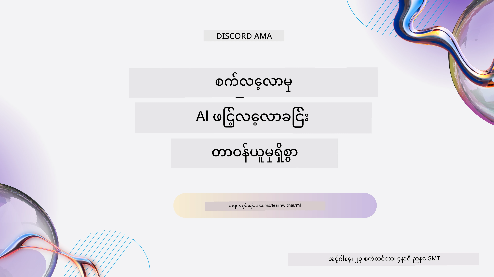
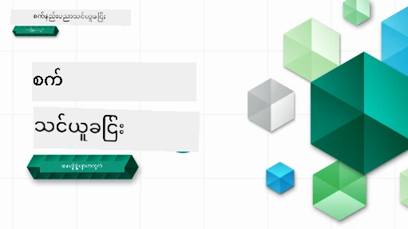

[](https://github.com/microsoft/ML-For-Beginners/blob/master/LICENSE)
[](https://GitHub.com/microsoft/ML-For-Beginners/graphs/contributors/)
[](https://GitHub.com/microsoft/ML-For-Beginners/issues/)
[](https://GitHub.com/microsoft/ML-For-Beginners/pulls/)
[](http://makeapullrequest.com)

[](https://GitHub.com/microsoft/ML-For-Beginners/watchers/)
[](https://GitHub.com/microsoft/ML-For-Beginners/network/)
[](https://GitHub.com/microsoft/ML-For-Beginners/stargazers/)

### 🌐 ဘာသာစကားအမျိုးမျိုးကို ထောက်ပံ့မှု

#### GitHub Action ဖြင့် ထောက်ပံ့သည် (အလိုအလျောက်နှင့် အမြဲတမ်းအသစ်နေ)

<!-- CO-OP TRANSLATOR LANGUAGES TABLE START -->
[Arabic](../ar/README.md) | [Bengali](../bn/README.md) | [Bulgarian](../bg/README.md) | [Burmese (Myanmar)](./README.md) | [Chinese (Simplified)](../zh-CN/README.md) | [Chinese (Traditional, Hong Kong)](../zh-HK/README.md) | [Chinese (Traditional, Macau)](../zh-MO/README.md) | [Chinese (Traditional, Taiwan)](../zh-TW/README.md) | [Croatian](../hr/README.md) | [Czech](../cs/README.md) | [Danish](../da/README.md) | [Dutch](../nl/README.md) | [Estonian](../et/README.md) | [Finnish](../fi/README.md) | [French](../fr/README.md) | [German](../de/README.md) | [Greek](../el/README.md) | [Hebrew](../he/README.md) | [Hindi](../hi/README.md) | [Hungarian](../hu/README.md) | [Indonesian](../id/README.md) | [Italian](../it/README.md) | [Japanese](../ja/README.md) | [Kannada](../kn/README.md) | [Khmer](../km/README.md) | [Korean](../ko/README.md) | [Lithuanian](../lt/README.md) | [Malay](../ms/README.md) | [Malayalam](../ml/README.md) | [Marathi](../mr/README.md) | [Nepali](../ne/README.md) | [Nigerian Pidgin](../pcm/README.md) | [Norwegian](../no/README.md) | [Persian (Farsi)](../fa/README.md) | [Polish](../pl/README.md) | [Portuguese (Brazil)](../pt-BR/README.md) | [Portuguese (Portugal)](../pt-PT/README.md) | [Punjabi (Gurmukhi)](../pa/README.md) | [Romanian](../ro/README.md) | [Russian](../ru/README.md) | [Serbian (Cyrillic)](../sr/README.md) | [Slovak](../sk/README.md) | [Slovenian](../sl/README.md) | [Spanish](../es/README.md) | [Swahili](../sw/README.md) | [Swedish](../sv/README.md) | [Tagalog (Filipino)](../tl/README.md) | [Tamil](../ta/README.md) | [Telugu](../te/README.md) | [Thai](../th/README.md) | [Turkish](../tr/README.md) | [Ukrainian](../uk/README.md) | [Urdu](../ur/README.md) | [Vietnamese](../vi/README.md)

> **တောင့်တင်းစွာ ဒေါင်းလုပ်ဆွဲရန် ပြည်တွင်းမှပင် Clone လုပ်ချင်ပါသလား?**
>
> ဤ repository တွင် ဘာသာစကား ၅၀ ကျော် ပါဝင်သောကြောင့် ဒေါင်းလုပ်အရွယ်အစား အလွန်ကြီးလာသည်။ ဘာသာပြန် မပါအောင် clone လုပ်ရန် sparse checkout ကို အသုံးပြုပါ:
>
> **Bash / macOS / Linux:**
> ```bash
> git clone --filter=blob:none --sparse https://github.com/microsoft/ML-For-Beginners.git
> cd ML-For-Beginners
> git sparse-checkout set --no-cone '/*' '!translations' '!translated_images'
> ```
>
> **CMD (Windows):**
> ```cmd
> git clone --filter=blob:none --sparse https://github.com/microsoft/ML-For-Beginners.git
> cd ML-For-Beginners
> git sparse-checkout set --no-cone "/*" "!translations" "!translated_images"
> ```
>
> ဒီနည်းလမ်းက သင့်ကို သင်တန်းအတန်းပြီးစီးဖို့လိုအပ်ချက်အားလုံးနဲ့အတူ ပိုမြန်တဲ့ ဒေါင်းလုပ်ကို ပေးပါတယ်။
<!-- CO-OP TRANSLATOR LANGUAGES TABLE END -->

#### ကျွန်ုပ်တို့၏ လူမှုအသိုင်းအဝိုင်းတွင် ပါဝင်ပါ

[](https://discord.gg/nTYy5BXMWG)

ကျွန်ုပ်တို့မှာ AI နဲ့ လေ့လာခြင်း ဆင့်ဆံရိုက်ခတ်မှု ongoing ဖြစ်နေပြီး၊ ၂၀၂၅ စက်တင်ဘာ ၁၈ ရက်မှ ၃၀ ရက်အထိ [Learn with AI Series](https://aka.ms/learnwithai/discord) မှာ ပိုမိုသိရှိပြီး ဒေတာသိပ္ပံအတွက် GitHub Copilot အသုံးပြုနည်း နည်းပြချက်များ ရရှိနိုင်သည်။



# စက်ရုပ်သင်ကြားမှုရှင်သန်မှုအတွက် သင်တန်းအစီအစဉ်

> 🌍 ကမ္ဘာတစ်၀ှမ်း ခရီးသွားပြီး ယဉ်ကျေးမှုများဖြင့် စက်ရုပ်သင်ကြားမှုကို ရှာဖွေကြပါစို့ 🌍

Microsoft ၏ Cloud Advocates များက **စက်ရုပ်သင်ကြားမှု** အကြောင်း ၁၂ ပတ်၊ ၂၆ သင်ခန်းစာ အစီအစဉ်ကို ပေးအပ်လာသည်။ ဤအစီအစဉ်တွင် Scikit-learn ကို အသုံးပြုပြီး ကလက်စစ်စက်ရုပ်သင်ကြားမှု (classic machine learning) အကြောင်း သင်ကြားမည်ဖြစ်ပြီး နက်ရှိုင်းသောသင်ကြားမှုပြုခြင်း (deep learning) သည် ကျွန်ုပ်တို့၏ [AI for Beginners' curriculum](https://aka.ms/ai4beginners) တွင် ပါဝင်ပါသည်။ ထို့အပြင် ['Data Science for Beginners' curriculum](https://aka.ms/ds4beginners) နှင့် အတူ သင်ခန်းစာများကို ပေါင်းစပ်၍ သင်ယူနိုင်ပါသည်။

ကမ္ဘာတစ်၀ှမ်းက ဒေတာများကို အသုံးပြု၍ ကလက်စစ်နည်းလမ်းများကို လေ့လာကြပါစို့။ သင်ခန်းစာတိုင်းတွင် မတိုင်မီနှင့်ပြီးစီးပြီး ဆော့ဝဲလ်၊ လမ်းညွှန်ချက်စာများ၊ ဖြေရှင်းချက်၊ အစီအစဉ်တင်ပြချက်များ ပါဝင်သည်။ ဤ ပရောဂျက်အခြေပြု သင်ကြားပုံစနစ်က သင်ယူနေစဉ် အတူတကွ တည်ဆောက်ခြင်းဖြင့် ကျွန်ုပ်များ၏ နည်းပညာအသစ်များ စိတ်ဝင်စားစေသည်။

**✍️ ကျေးဇူးအထူးတင်ရှိပါသည် - ကမ္ဘာလှည့် တာဝန်ခံများ** Jen Looper, Stephen Howell, Francesca Lazzeri, Tomomi Imura, Cassie Breviu, Dmitry Soshnikov, Chris Noring, Anirban Mukherjee, Ornella Altunyan, Ruth Yakubu နှင့် Amy Boyd

**🎨 ဂရပ်ဖစ်ရှုထောင့်ပေးသူများအားလုံးအတွက် ကျေးဇူးတင်ရှိပါသည်** Tomomi Imura, Dasani Madipalli, နှင့် Jen Looper

**🙏 Microsoft ကျောင်းသား အင်အားစုအရာရှိများ၊ သုံးသပ်သူများ နှင့် အကြောင်းအရာ ထည့်သွင်းသူများအား အထူးကျေးဇူးတင်ပါသည်**, အထူးသဖြင့် Rishit Dagli, Muhammad Sakib Khan Inan, Rohan Raj, Alexandru Petrescu, Abhishek Jaiswal, Nawrin Tabassum, Ioan Samuila, နှင့် Snigdha Agarwal

**🤩 ကျွန်ုပ်တို့၏ R သင်ခန်းစာများအတွက် Microsoft ကျောင်းသား အင်အားစု Eric Wanjau, Jasleen Sondhi, နှင့် Vidushi Gupta များအား ထပ်မံကျေးဇူးတင်ရှိပါသည်။**

# စတင်ခြင်း

အဆင့်များကို လိုက်နာပါ:
1. **Repository ကို Fork လုပ်ပါ**: ဒီစာမျက်နှာ၏ အပေါ်ညာဘက်ထောင့်ရှိ "Fork" ခလုတ်ကိုနှိပ်ပါ။
2. **Repository ကို Clone လုပ်ပါ**: `git clone https://github.com/microsoft/ML-For-Beginners.git`

> 💡 **လျင်မြန်စွာ စတင်ရန်**: Python ကို ဒေသတွင်းတွင် သတ်မှတ်မထားဘဲ browser မှ စတင်လိုပါသလား? သင်၏ fork အတွက် cloud development ပတ်ဝန်းကျင် ဖန်တီးရန် [GitHub Codespaces](https://github.com/features/codespaces) ကို အသုံးပြုပါ။ ပြာရောင် **Code** မီနူးကို ဖွင့်ပြီး **Codespaces** ကို ရွေးချယ်၍ codespace တစ်ခု ဖန်တီးပါ၊ လိုအပ်သလို သင်ခန်းစာတိုင်းတွင် လိုအပ်သော dependency များကို ထည့်ထုတ်အသုံးပြုနိုင်ပါသည်။

> [ဤသင်တန်းအတွက် အပိုဆောင်း အရင်းအမြစ်များအားလုံးကို ကျွန်ုပ်တို့၏ Microsoft Learn စုစည်းမှုထဲတွင် ရှာဖွေပါ](https://learn.microsoft.com/en-us/collections/qrqzamz1nn2wx3?WT.mc_id=academic-77952-bethanycheum)

> 🔧 **ကူညီမှုလိုပါသလား?** အထူးအခက်အခဲများ၊ သွင်းယူခြင်း၊ တပ်ဆင်မှုနှင့် သင်ခန်းစာများ အတည်ပြုခြင်းဆိုင်ရာ ဖြေရှင်းချက်များအတွက် ကျွန်ုပ်တို့၏ [ပြဿနာဖြေရှင်းလမ်းညွှန်](TROUBLESHOOTING.md) ကို ကြည့်ပါ။


**[ကျောင်းသားများ](https://aka.ms/student-page)**၊ ဤအစီအစဉ်ကို အသုံးပြုရန်အတွက် သင့် GitHub အကောင့်တွင် ဒါရိုက်တိုရီအားလုံးကို fork လုပ်ပြီး ကိုယ့်အခန်းစဉ်များကို တစ်ကိုယ်တော် သို့မဟုတ် အုပ်စုနှင့် ပြီးမြောက်အောင် လုပ်ဆောင်ပါ:

- သင်ကြားခန်းမမီ စစ်တမ်းဖြေပါ။
- သင်ခန်းစာကို ဖတ်ပြီး လှုပ်ရှားမှုများကို ပြီးမြောက်အောင် လုပ်ပြီး ကျွမ်းကျင်မှုစစ်ဆေးခြင်းများတွင် ရပ်ထား၍ သုံးသပ်ပါ။
- ဖြေရှင်းချက်ကို ထည့်သွင်းခြင်းမပြုဘဲ သင်ခန်းစာကိုနားလည်ပြီး အလုပ်များကို ဖန်တီးကြည့်ပါ။ သို့သော် အဆိုပါ ကုဒ်များကို `/solution` ဖိုင်တွင် ရရှိနိုင်သည်။
- သင်ကြားခန်းပြီးနောက် စစ်တမ်း ဖြေဆိုပါ။
- စိန်ခေါ်မှုကို ပြီးမြောက်အောင် လုပ်ပါ။
- အပ်အပ်မိန်းကို ပြီးစီးပါ။
- သင်ခန်းစာအုပ်စုတစ်ခု ပြီးစီးပြီးနောက် [ဆွေးနွေးပွဲပေါ်](https://github.com/microsoft/ML-For-Beginners/discussions) သို့ သွားပါ၊ ပြီးလျှင် သင်ခန်းစာအတက်ကို "ပြောဆိုလေ့လာပါ" ပြီး PAT rubric ကို ဖြည့်ပါ။ 'PAT' ဆိုသည်မှာ သင်ယူမှုကို တိုးတက်စေရန် သင်ဖြည့်စွက်ရသော အကဲဖြတ်မှု ရည်ညွှန်းချက်တစ်ခု ဖြစ်သည်။ တခြား PAT များကိုလည်း အားပေးသုံးသပ်နိုင်သည်။

> ပိုမိုလေ့လာလိုပါက ကျွန်ုပ်တို့၏ [Microsoft Learn](https://docs.microsoft.com/en-us/users/jenlooper-2911/collections/k7o7tg1gp306q4?WT.mc_id=academic-77952-leestott) မော်ဂျူးများနှင့် သင်ယူလမ်းကြောင်းများကို လိုက်နာဖို့ အကြံပြုပါသည်။

**ဆရာ/ဆရာမများ**, ဤအစီအစဉ်ကို အသုံးပြုမည့် နည်းလမ်းများကို ကျွန်ုပ်တို့ [အကြံဥာဏ်များ](for-teachers.md) ထည့်သွင်းထားပါသည်။

---

## ဗွီဒီယို လမ်းညွှန်များ

သင်ခန်းစာအချို့သည် အတိုချုံး ဗီဒီယိုအဖြစ်ရရှိနိုင်ပါသည်။ ထိုဗီဒီယိုများအားလုံးကို သင်ခန်းစာထဲတွင် သို့မဟုတ် [ML for Beginners playlist on the Microsoft Developer YouTube channel](https://aka.ms/ml-beginners-videos) တွင် ပုံအောက်မှ နှိပ်၍ ကြည့်နိုင်ပါသည်။

[](https://aka.ms/ml-beginners-videos)

---

## အသင်းဖွဲ့ဝင်များကို တွေ့ဆုံခြင်း

[](https://youtu.be/Tj1XWrDSYJU)

**Gif ဖြင့် ဖန်တီးသူ** [Mohit Jaisal](https://linkedin.com/in/mohitjaisal)

> 🎥 ပရောဂျက်နှင့် ဖန်တီးသူများအကြောင်း ဗီဒီယိုကို ကြည့်ရန် ပုံကိုနှိပ်ပါ!

---

## သင်ကြားပုံ

အစီအစဉ်ရေးဆွဲသောအခါ သင်ကြားပညာရပ်အောင်မြင်မှုအချက် ၂ ချက်ကို ရွေးချယ်ခဲ့သည်။ အဲဒါကတော့ ကျက်သရေရှိသော **ပရောဂျက်အခြေပြု** သင်္ချာနည်းဖြင့် ရှာဖွေခြင်းနှင့် **အကြိမ်ကြိမ်ဖြေဆိုရမည့် စစ်တမ်းများ** ပါဝင်ခြင်း တို့ဖြစ်သည်။ ထို့အပြင် အစီအစဉ်တွင် တစ်ခုတည်းသော **ခေါင်းစဥ်** ရှိသည်၊ ထိုကာလအတွင်း ဝေဖန်မှုရှိစေခြင်း။

အကြောင်းအရာကို ပရောဂျက်နှင့် ကိုက်ညီအောင်လုပ်ခြင်းဖြင့် သင်ယူသူများအတွက် စိတ်ဝင်စားစေပြီး သဘောသဘာဝ retention စနစ်တိုးတက်စေသည်။ ထို့အပြင် နည်းပညာသင်တန်း မတိုင်မီ စစ်တမ်းသည် သင်ကြားမှုအတွက် ရည်ရွယ်ချက်သတ်မှတ်ခြင်းဖြစ်ပြီး၊ သင်တန်းပြီးနောက် စစ်တမ်းသည် ပိုမိုသိမြင်မှု တိုးတက်စေသည်။ ဤအစီအစဉ်ကို အဆင်ပြေပြီး ပျော်ရွှင်စရာဖြစ်အောင် ဖန်တီးထားပြီး အပိုင်းအစအလိုက် သို့မဟုတ် ခုနှစ်ပတ်စီးရီး အတိုင်း လေ့လာနိုင်သည်။ ပရောဂျက်များသည် အစက လျှော့ချပွန်းပြီး နောက်ဆက်တွဲများတွင် မြင့်မားကာ ဆက်တင်သွယ်အလှည့် ဖြတ်သန်းမှုရှိစေသည်။ ဤအစီအစဉ်တွင် လက်တွေ့အသုံးချမှု အပိုသင်ခန်းစာတစ်ခုပါဝင်ပြီး အကယ်၍ အပို credit အဖြစ် သို့မဟုတ် ဆွေးနွေးပွဲအတွက် အခြေခံအဖြစ် အသုံးပြုနိုင်သည်။

> ကျွန်ုပ်တို့၏ [Code of Conduct](CODE_OF_CONDUCT.md), [Contributing](CONTRIBUTING.md), [Translations](..), နှင့် [Troubleshooting](TROUBLESHOOTING.md) လမ်းညွှန်ချက်များကို တွေ့နိုင်ပါသည်။ သင်၏ အကောင်းဆုံး တုံ့ပြန်ချက်များကို ကြိုဆိုပါသည်!

## သင်ခန်းစာတိုင်းတွင် ပါဝင်မှု

- ရွေးချယ်စရာ စကက်ချုပ်မှတ်စု
- ရွေးချယ်စရာ ဗွီဒီယိုထပ်ကောင်း
- ဗွီဒီယို လမ်းညွှန် (သင်ခန်းစာအချို့သာ)
- [မတိုင်မီ စစ်ပွဲဖြေဆိုမှုစစ်တမ်း](https://ff-quizzes.netlify.app/en/ml/)
- ရေးသားထားသော သင်ခန်းစာ
- ပရောဂျက်အခြေပြု သင်ခန်းစာများအတွက်၊ ပရောဂျက်ကို ဘယ်လို ဆောက်လုပ်ရမယ်ဆိုတာ အဆင့်ကတည်းက လမ်းညွှန်ချက်များ
- အသိပညာ စစ်ဆေးမှုများ
- စိန်ခေါ်မှု
- ထပ်ထည့်ဖတ်ရှုလိုက်ခြင်း
- အပ်အပ်မိန်း
- [ပြီးဆုံးသင်ခန်းစာ စစ်တမ်း](https://ff-quizzes.netlify.app/en/ml/)

> **ဘာသာစကားများအကြောင်း မှတ်ချက်**: သင်ခန်းစာများသည် Python ဖြင့် ဆန်းသစ်ရေးသားထားသော်လည်း R ဖြင့်လည်း ရနိုင်ပါသည်။ R သင်ခန်းစာတစ်ခုပြီးမြောက်ရန် `/solution` ဖိုင်တွင် R သင်ခန်းစာများကို ရှာပါ။ R Markdown ဖိုင်များ(.rmd) သည် ကိုဒ်ချုပ်များ(R သို့မဟုတ် မျိုးစုံဘာသာစကားများ) နှင့် `YAML header` တို့ကို တစ်ခန်းထဲ ပြုလုပ်ထားသော ကိုယ်တိုင်ရေးသားနိုင်သော စာရွက်စာတမ်းတစ်ခုဖြစ်သည်။ ထို့ကြောင့် ဒေတာသိပ္ပံနှင့် လုပ်ငန်းအပေါ် အကြံအစည်ဖော်ထုတ္ရေးတွင် ထူးချွန်သော ဖော်မြူလာတစ်ခုအဖြစ် ယူဆနိုင်ပြီး ကိုဒ်၊ ရလာဒ်နှင့် စွာစုစည်းချက်များကို Markdown တွင် တိုက်ရိုက်ရေးသားနိုင်သည်။ ထို့အပြင် R Markdown ကို PDF, HTML ဒါမှမဟုတ် Word ဖိုင်အဖြစ် ထုတ်ပေးနိုင်သည်။

> **စစ်မှု စာရင်းအကြောင်း မှတ်ချက်**: စစ်မှုများအားလုံးကို [Quiz App ဖိုင်](../../quiz-app) တွင် တွေ့နိုင်ပြီး စုစုပေါင်း ၅၂ ခုရှိသည်။ တစ်ခုချင်းစီတွင် မေးခွန်း ၃ ခုရှိသည်။ သင်ခန်းစာများအတွင်း ဆက်သွယ်ထားသော်လည်း quiz app ကို ဒေသတွင်းမှ တည်ဆောက်အသုံးပြုနိုင်သည်။ `quiz-app` ဖိုင်အတွင်း ညွှန်ကြားချက်များအား လိုက်နာပါ။

| Lesson Number |                             Topic                              |                   Lesson Grouping                   | Learning Objectives                                                                                                             |                                                              Linked Lesson                                                               |                        Author                        |
| :-----------: | :------------------------------------------------------------: | :-------------------------------------------------: | ------------------------------------------------------------------------------------------------------------------------------- | :--------------------------------------------------------------------------------------------------------------------------------------: | :--------------------------------------------------: |
|      01       |                စက်လေ့လာရေး အထူးအချက်များ                |      [Introduction](1-Introduction/README.md)       | စက်လေ့လာရေးနောက်ကွယ်ရှိ အခြေခံအယူအဆများကို လေ့လာပါ                                                                                |                                             [Lesson](1-Introduction/1-intro-to-ML/README.md)                                             |                       Muhammad                       |
|      02       |                စက်လေ့လာရေး၏ သမိုင်းကြောင်း                 |      [Introduction](1-Introduction/README.md)       | ဤနယ်ပယ်၏ သမိုင်းကြောင်းကို လေ့လာပါ                                                                                         |                                            [Lesson](1-Introduction/2-history-of-ML/README.md)                                            |                     Jen and Amy                      |
|      03       |                 တရားမျှတမှုနှင့် စက်လေ့လာရေး                  |      [Introduction](1-Introduction/README.md)       | စက်လေ့လာရေးနမူနာများ ဖန်တီးခြင်းနှင့် အသုံးပြုခြင်းတွင် ကျောင်းသားများ စဉ်းစားသင့်သည့် တရားမျှတမှုဆိုင်ရာ အရေးကြီးသော ဒဿနိကိစ္စများ မည်သည်များလဲ? |                                              [Lesson](1-Introduction/3-fairness/README.md)                                               |                        Tomomi                        |
|      04       |                စက်လေ့လာရေးနည်းပညာများ                 |      [Introduction](1-Introduction/README.md)       | စက်လေ့လာရေးသုတေသနလုပ်သူများသည် စက်လေ့လာရေးနမူနာများ ဖန်တီးရာတွင် မည်သည့်နည်းပညာများ အသုံးပြုပါသလဲ?                                                                       |                                          [Lesson](1-Introduction/4-techniques-of-ML/README.md)                                           |                    Chris and Jen                     |
|      05       |                   Regression အတွက် နိဒါန်း                   |        [Regression](2-Regression/README.md)         | Regression နမူနာများအတွက် Python နှင့် Scikit-learn ဖြင့် စတင်လိုက်ပါ                                                                  |         [Python](2-Regression/1-Tools/README.md) • [R](../../2-Regression/1-Tools/solution/R/lesson_1.html)         |      Jen • Eric Wanjau       |
|      06       |                အနောက်အသီးပုန်ဈေးနှုန်းများ 🎃                |        [Regression](2-Regression/README.md)         | စနစ်တကျ ကြည့်ရှုပြီး ML အတွက် ဒေတာသန့်ရှင်းရေး                                                                             |          [Python](2-Regression/2-Data/README.md) • [R](../../2-Regression/2-Data/solution/R/lesson_2.html)          |      Jen • Eric Wanjau       |
|      07       |                အနောက်အသီးပုန်ဈေးနှုန်းများ 🎃                |        [Regression](2-Regression/README.md)         | လျှပ်စစ်နှင့် polynomial regression နမူနာများ တည်ဆောက်ပါ                                                                                   |        [Python](2-Regression/3-Linear/README.md) • [R](../../2-Regression/3-Linear/solution/R/lesson_3.html)        |      Jen and Dmitry • Eric Wanjau       |
|      08       |                အနောက်အသီးပုန်ဈေးနှုန်းများ 🎃                |        [Regression](2-Regression/README.md)         | Logistic regression နမူနာ တည်ဆောက်ပါ                                                                                               |     [Python](2-Regression/4-Logistic/README.md) • [R](../../2-Regression/4-Logistic/solution/R/lesson_4.html)      |      Jen • Eric Wanjau       |
|      09       |                          ဝဘ်အက်ပ် 🔌                          |           [Web App](3-Web-App/README.md)            | သင်တန်းသားရဲ့ သင်ခန်းစာနမူနာကို အသုံးပြုရန် ဝဘ်အက်ပ် တည်ဆောက်ပါ                                                                                       |                                                 [Python](3-Web-App/1-Web-App/README.md)                                                  |                         Jen                          |
|      10       |                 classification အတွက် နိဒါန်း                 |    [Classification](4-Classification/README.md)     | သင့်ဒေတာကို သန့်ရှင်းစီစဉ်၊ ကြည့်ရှုပြီး classification အတွက် နိဒါန်း                                                            | [Python](4-Classification/1-Introduction/README.md) • [R](../../4-Classification/1-Introduction/solution/R/lesson_10.html)  | Jen and Cassie • Eric Wanjau |
|      11       |             အာရှနှင့် အိန္ဒိယအစားအစာဆိုင်များ 🍜             |    [Classification](4-Classification/README.md)     | classifiers များအတွက် နိဒါန်း                                                                                                     | [Python](4-Classification/2-Classifiers-1/README.md) • [R](../../4-Classification/2-Classifiers-1/solution/R/lesson_11.html) | Jen and Cassie • Eric Wanjau |
|      12       |             အာရှနှင့် အိန္ဒိယအစားအစာဆိုင်များ 🍜             |    [Classification](4-Classification/README.md)     | ပိုမိုတိုးတက်သော classifiers                                                                                                                | [Python](4-Classification/3-Classifiers-2/README.md) • [R](../../4-Classification/3-Classifiers-2/solution/R/lesson_12.html) | Jen and Cassie • Eric Wanjau |
|      13       |             အာရှနှင့် အိန္ဒိယအစားအစာဆိုင်များ 🍜             |    [Classification](4-Classification/README.md)     | သင့်နမူနာကို အသုံးပြုပြီး အကြံပြုဝဘ်အက်ပ် တည်ဆောက်ပါ                                                                                    |                                              [Python](4-Classification/4-Applied/README.md)                                              |                         Jen                          |
|      14       |                   clustering အတွက် နိဒါန်း                   |        [Clustering](5-Clustering/README.md)         | သင့်ဒေတာကို သန့်ရှင်းစီစဉ်၊ ကြည့်ရှုပြီး clustering အတွက် နိဒါန်း                                                                |         [Python](5-Clustering/1-Visualize/README.md) • [R](../../5-Clustering/1-Visualize/solution/R/lesson_14.html)         |      Jen • Eric Wanjau       |
|      15       |              Nigerian ဂီတအရသာများ ရှာဖွေခြင်း 🎧              |        [Clustering](5-Clustering/README.md)         | K-Means clustering နည်းလမ်းကို စူးစမ်းပါ                                                                                           |           [Python](5-Clustering/2-K-Means/README.md) • [R](../../5-Clustering/2-K-Means/solution/R/lesson_15.html)           |      Jen • Eric Wanjau       |
|      16       |        သဘာဝဘာသာစကား ဆက်သွယ်မှု အတွက် နိဒါန်း ☕️         |   [Natural language processing](6-NLP/README.md)    | ပိုမိုလွယ်ကူသော ဘော့ ဖန်တီးခြင်းဖြင့် NLP အခြေခံများကို သင်ယူပါ                                                                             |                                             [Python](6-NLP/1-Introduction-to-NLP/README.md)                                              |                       Stephen                        |
|      17       |                      ရိုးရိုး NLP အလုပ်များ ☕️                      |   [Natural language processing](6-NLP/README.md)    | ဘာသာစကား ဖွဲ့စည်းမှုများနှင့် စပ်လျဉ်းသော ပုံမှန်အလုပ်လုပ်ငန်းများကို နားလည်ခြင်းမှတဆင့် NLP အသိပညာကို ပိုမိုကြီးထွားစေပါ                          |                                                    [Python](6-NLP/2-Tasks/README.md)                                                     |                       Stephen                        |
|      18       |             ဘာသာပြန်ခြင်းနှင့် စိတ်ခံစားချက် ခွဲခြားခြင်း ♥️              |   [Natural language processing](6-NLP/README.md)    | Jane Austen နှင့်အတူ ဘာသာပြန်ခြင်းနှင့် စိတ်ခံစားချက် ခွဲခြားခြင်း                                                                             |                                            [Python](6-NLP/3-Translation-Sentiment/README.md)                                             |                       Stephen                        |
|      19       |                  ဥရောပ၏ ချစ်စရာဟိုတယ်များ ♥️                  |   [Natural language processing](6-NLP/README.md)    | ဟိုတယ်နှင့် ပတ်သက်သော မှတ်ချက်ဖြင့် စိတ်ခံစားချက် ခွဲခြားခြင်း ၁                                                                                         |                                               [Python](6-NLP/4-Hotel-Reviews-1/README.md)                                                |                       Stephen                        |
|      20       |                  ဥရောပ၏ ချစ်စရာဟိုတယ်များ ♥️                  |   [Natural language processing](6-NLP/README.md)    | ဟိုတယ်နှင့် ပတ်သက်သော မှတ်ချက်ဖြင့် စိတ်ခံစားချက် ခွဲခြားခြင်း ၂                                                                                         |                                               [Python](6-NLP/5-Hotel-Reviews-2/README.md)                                                |                       Stephen                        |
|      21       |            အချိန်လိုက် စီးရီးခန့်မှန်းခြင်းသို့ နိဒါန်း             |        [Time series](7-TimeSeries/README.md)        | အချိန်လိုက် စီးရီးခန့်မှန်းခြင်းသို့ နိဒါန်း                                                                                         |                                             [Python](7-TimeSeries/1-Introduction/README.md)                                              |                      Francesca                       |
|      22       | ⚡️ ကမ္ဘာ့ လျှပ်စစ်စွမ်းအား အသုံးပြုမှု ⚡️ - ARIMA ဖြင့် အချိန်လိုက် စီးရီးခန့်မှန်းခြင်း |        [Time series](7-TimeSeries/README.md)        | ARIMA ဖြင့် အချိန်လိုက် စီးရီးခန့်မှန်းခြင်း                                                                                              |                                                 [Python](7-TimeSeries/2-ARIMA/README.md)                                                 |                      Francesca                       |
|      23       |  ⚡️ ကမ္ဘာ့ လျှပ်စစ်စွမ်းအား အသုံးပြုမှု ⚡️ - SVR ဖြင့် အချိန်လိုက် စီးရီးခန့်မှန်းခြင်း  |        [Time series](7-TimeSeries/README.md)        | Support Vector Regressor ဖြင့် အချိန်လိုက် စီးရီးခန့်မှန်းခြင်း                                                                           |                                                  [Python](7-TimeSeries/3-SVR/README.md)                                                  |                       Anirban                        |
|      24       |             တိုးတက်မှုသင်ယူမှုသို့ နိဒါန်း             | [Reinforcement learning](8-Reinforcement/README.md) | Q-Learning ဖြင့် တိုးတက်မှုသင်ယူမှုသို့ နိဒါန်း                                                                          |                                             [Python](8-Reinforcement/1-QLearning/README.md)                                              |                        Dmitry                        |
|      25       |                 Peter ကို ဝံ့ကွက်မောင်းမှ ခုခံစေပါ! 🐺                  | [Reinforcement learning](8-Reinforcement/README.md) | သင်ယူမှုကို ပြန်လည်မြှင့်တင်ခြင်း Gym                                                                                                      |                                                [Python](8-Reinforcement/2-Gym/README.md)                                                 |                        Dmitry                        |
|  Postscript   |            လက်တွေ့ကမ္ဘာ ML ဖြစ်စဉ်များနှင့် အသုံးချမှုများ            |      [ML in the Wild](9-Real-World/README.md)       | စံနမူနာ ML ၏ စိတ်ဝင်စားဖွယ်နှင့် ထင်ရှားသော လက်တွေ့ကမ္ဘာ အသုံးချမှုများ                                                               |                                             [Lesson](9-Real-World/1-Applications/README.md)                                              |                         Team                         |
|  Postscript   |            RAI dashboard ကို အသုံးပြု၍ ML တွင် မော်ဒယ် ပြဿနာရှာဖွေခြင်း            |      [ML in the Wild](9-Real-World/README.md)       | တာဝန်ရှိ AI dashboard အစိတ်အပိုင်းများကို အသုံးပြု၍ စက်လေ့လာရေးတွင် မော်ဒယ် ပြဿနာရှာဖွေခြင်း                                                              |                                             [Lesson](9-Real-World/2-Debugging-ML-Models/README.md)                                              |                     Ruth Yakubu                      |

> [ဤသင်တန်းအတွက် အခြားအရင်းအမြစ်များအားလုံးကို ကျွန်ုပ်တို့၏ Microsoft Learn စုစည်းမှုတွင် ရှာပါ](https://learn.microsoft.com/en-us/collections/qrqzamz1nn2wx3?WT.mc_id=academic-77952-bethanycheum)

## အော့ဖ်လိုင်း လက်လှမ်းမှရရှိမှု

[Docsify](https://docsify.js.org/#/) ကို အသုံးပြု၍ ဤစာတမ်းကို အော့ဖ်လိုင်းတွင် လည်ပတ်နိုင်သည်။ ဤ repo ကို fork ပြုလုပ်၊ သင့်ဒေသစနစ်တွင် [Docsify ကို install](https://docsify.js.org/#/quickstart) ပြုလုပ်ပြီး ဤ repo ၏ အခြေစိုက်ဖိုဒါတွင် `docsify serve` ကို ရိုက်ပါ။ ဝဘ်ဆိုဒ်က သင့် localhost ၌ ပေါ့(၃၀၀၀) တွင် ဝန်ဆောင်မှုပေးမည်ဖြစ်သည်။ `localhost:3000`

## PDF များ

သင်ကြားမှုအစီအစဉ်၏ pdf ကို [ဤနေရာတွင်](https://microsoft.github.io/ML-For-Beginners/pdf/readme.pdf) တွေ့နိုင်ပါသည်။


## 🎒 အခြားသင်တန်းများ 

ကျွန်ုပ်တို့၏အဖွဲ့သည် အခြားသင်တန်းများကို ထုတ်လုပ်သည်! စစ်ဆေးကြည့်ပါ။

<!-- CO-OP TRANSLATOR OTHER COURSES START -->
### LangChain
[](https://aka.ms/langchain4j-for-beginners)
[](https://aka.ms/langchainjs-for-beginners?WT.mc_id=m365-94501-dwahlin)
[](https://github.com/microsoft/langchain-for-beginners?WT.mc_id=m365-94501-dwahlin)
---

### Azure / Edge / MCP / Agents
[](https://github.com/microsoft/AZD-for-beginners?WT.mc_id=academic-105485-koreyst)
[](https://github.com/microsoft/edgeai-for-beginners?WT.mc_id=academic-105485-koreyst)
[](https://github.com/microsoft/mcp-for-beginners?WT.mc_id=academic-105485-koreyst)
[](https://github.com/microsoft/ai-agents-for-beginners?WT.mc_id=academic-105485-koreyst)

---
 
### Generative AI စီးရီး
[](https://github.com/microsoft/generative-ai-for-beginners?WT.mc_id=academic-105485-koreyst)
[-9333EA?style=for-the-badge&labelColor=E5E7EB&color=9333EA)](https://github.com/microsoft/Generative-AI-for-beginners-dotnet?WT.mc_id=academic-105485-koreyst)
[-C084FC?style=for-the-badge&labelColor=E5E7EB&color=C084FC)](https://github.com/microsoft/generative-ai-for-beginners-java?WT.mc_id=academic-105485-koreyst)
[-E879F9?style=for-the-badge&labelColor=E5E7EB&color=E879F9)](https://github.com/microsoft/generative-ai-with-javascript?WT.mc_id=academic-105485-koreyst)

---
 
### အခြေခံ သင်ယူမှု
[](https://aka.ms/ml-beginners?WT.mc_id=academic-105485-koreyst)
[](https://aka.ms/datascience-beginners?WT.mc_id=academic-105485-koreyst)
[](https://aka.ms/ai-beginners?WT.mc_id=academic-105485-koreyst)
[](https://github.com/microsoft/Security-101?WT.mc_id=academic-96948-sayoung)
[](https://aka.ms/webdev-beginners?WT.mc_id=academic-105485-koreyst)
[](https://aka.ms/iot-beginners?WT.mc_id=academic-105485-koreyst)
[](https://github.com/microsoft/xr-development-for-beginners?WT.mc_id=academic-105485-koreyst)

---
 
### Copilot စီးရီး
[](https://aka.ms/GitHubCopilotAI?WT.mc_id=academic-105485-koreyst)
[](https://github.com/microsoft/mastering-github-copilot-for-dotnet-csharp-developers?WT.mc_id=academic-105485-koreyst)
[](https://github.com/microsoft/CopilotAdventures?WT.mc_id=academic-105485-koreyst)
<!-- CO-OP TRANSLATOR OTHER COURSES END -->

## ကူညီမှု ရယူခြင်း

စက်လေ့လာရေး သို့မဟုတ် AI အပလီကေးရှင်းများ တည်ဆောက်ရာတွင် ပိတ်တားမှုများရှိပါက သို့မဟုတ် မေးခွန်းများရှိပါက စိုးရိမ်ရန် မလိုပါ — ကူညီမှုရရှိနိုင်ပါသည်။

အခြား ကျောင်းသားများနှင့် ဖွံ့ဖြိုးသူများ နှင့် ဆွေးနွေးရန်၊ မေးခွန်းများ မေးရန်နှင့် သင်၏ အယူအဆများကို လိုက်လံမျှဝေရန် လူ့အသိုင်းအဝိုင်းတွင် ပါဝင်နိုင်ပါသည်။

- လူ့အသိုင်းအဝိုင်းတွင် ပါဝင်ပြီး မေးခွန်းများ မေးပြီး အတူတူ သင်ယူပါ
- စက်လေ့လာရေး အယူအဆများနှင့် ပရောဂျက် အကြံများကို ဆွေးနွေးပါ
- အတွေ့အကြုံရှိ ဖွံ့ဖြိုးသူများထံမှ လမ်းညွှန်မှု ရယူပါ

သြဇာဖြစ်သော လူ့အသိုင်းအဝိုင်းသည် သင့်ကျွမ်းကျင်မှုများ တိုးတက်ကောင်းမွန်စေပြီး ပြဿနာများကို မြန်မြန်ဖြေရှင်းနိုင်စေသည်။

[Microsoft Foundry Discord Community](https://discord.gg/nTYy5BXMWG)

အမှားများ၊ အခက်အခဲများ ဖြစ်ပေါ်ပါက သို့မဟုတ် တိုးတက်မှုအတွက် အကြံပြုချက်များရှိပါက မူရင်း repository တွင် **Issue** ကိစ္စဖြင့် အစီရင်ခံနိုင်ပါသည်။

ကုန်ပစ္စည်းတုံ့ပြန်ချက်များသို့မဟုတ် ရှိပြီးသား လူ့အသိုင်းအဝိုင်း တင်ပြချက်များကို သွားရောက် ရှာဖွေရန် Developer Forum ကို လည်ပတ်နိုင်ပါသည်။

[](https://aka.ms/foundry/forum)

## နောက်ထပ် သင်ယူရန် အကြံပြုချက်များ

- တစ်သင်ခန်းချင်းစီပြီးနောက် နုတ်ဘုတ်များကို ထပ်ပြန်သုံးသပ်ပါ။
- ကိုယ်တိုင် algorithm များကို ကျင့်သုံးပါ။
- သင်ယူထားသော အယူအဆများဖြင့် လက်တွေ့ ဒေတာစုစည်းမှုများကို စူးစမ်းပါ။

---

<!-- CO-OP TRANSLATOR DISCLAIMER START -->
**ပြောကြားချက်**
ဤစာတမ်းကို AI ဘာသာပြန်ဝန်ဆောင်မှု [Co-op Translator](https://github.com/Azure/co-op-translator) အသုံးပြု၍ ဘာသာပြန်ထားပါသည်။ ကျွန်ုပ်တို့သည် တိကျမှန်ကန်မှုအတွက် ကြိုးပမ်းနေသော်လည်း၊ စက်ကိရိယာဘာသာပြန်ခြင်းများတွင် အမှားများ သို့မဟုတ် မှားယွင်းချက်များ ပါဝင်နိုင်ကြောင်း သတိပြုပါရန် လိုအပ်ပါသည်။ မူလစာတမ်းကို မူရင်းဘာသာဖြင့်သာ ယုံကြည်စိတ်ချရသော အချက်အလက်အဖြစ် သတ်မှတ်သင့်သည်။ အရေးကြီးသည့် သတင်းအချက်အလက်များအတွက် ပရော်ဖက်ရှင်နယ် လူသားဘာသာပြန်သူဝန်ဆောင်မှုကို အကြံပြုပါသည်။ ဤဘာသာပြန်ချက်ကို အသုံးပြုခြင်းမှ ဖြစ်ပေါ်လာသော နားလည်မှုကွာခြားမှုများ သို့မဟုတ် မမှန်ကန်သော အသုံးပြုမှုများအတွက် ကျွန်ုပ်တို့ တာဝန်မခံပါ။
<!-- CO-OP TRANSLATOR DISCLAIMER END -->