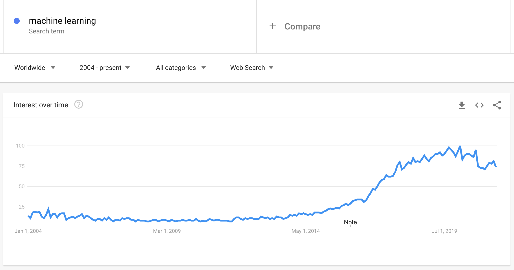

<!--
CO_OP_TRANSLATOR_METADATA:
{
  "original_hash": "73e9a7245aa57f00cd413ffd22c0ccb6",
  "translation_date": "2025-08-29T17:40:07+00:00",
  "source_file": "1-Introduction/1-intro-to-ML/README.md",
  "language_code": "ne"
}
-->
# मेसिन लर्निङको परिचय

## [पूर्व-व्याख्यान क्विज](https://gray-sand-07a10f403.1.azurestaticapps.net/quiz/1/)

---

> 🎥 माथिको तस्बिरमा क्लिक गरेर यो पाठको छोटो भिडियो हेर्नुहोस्।

शुरुआतीहरूको लागि क्लासिकल मेसिन लर्निङको यो पाठ्यक्रममा स्वागत छ! तपाईं यस विषयमा पूर्ण रूपमा नयाँ हुनुहुन्छ वा मेसिन लर्निङको कुनै क्षेत्रमा आफ्नो ज्ञान ताजा गर्न चाहनुहुन्छ भने, हामी तपाईंलाई यहाँ स्वागत गर्न पाउँदा खुसी छौं! हामी तपाईंको मेसिन लर्निङ अध्ययनको लागि एक मैत्रीपूर्ण सुरुवातको ठाउँ सिर्जना गर्न चाहन्छौं र तपाईंको [प्रतिक्रिया](https://github.com/microsoft/ML-For-Beginners/discussions)लाई मूल्यांकन, प्रतिक्रिया, र समावेश गर्न इच्छुक छौं।

> 🎥 माथिको तस्बिरमा क्लिक गरेर भिडियो हेर्नुहोस्: MIT का जोन गुट्टागले मेसिन लर्निङको परिचय दिनुहुन्छ।

---
## मेसिन लर्निङ सुरु गर्दै

यस पाठ्यक्रम सुरु गर्नु अघि, तपाईंको कम्प्युटरलाई स्थानीय रूपमा नोटबुक चलाउन तयार पार्न आवश्यक छ।

- **यी भिडियोहरू प्रयोग गरेर आफ्नो मेसिन कन्फिगर गर्नुहोस्**। आफ्नो प्रणालीमा [Python कसरी इन्स्टल गर्ने](https://youtu.be/CXZYvNRIAKM) र विकासको लागि [टेक्स्ट एडिटर सेटअप गर्ने](https://youtu.be/EU8eayHWoZg) सिक्न तलका लिंकहरू प्रयोग गर्नुहोस्।
- **Python सिक्नुहोस्**। [Python](https://docs.microsoft.com/learn/paths/python-language/?WT.mc_id=academic-77952-leestott) को आधारभूत ज्ञान हुनु सिफारिस गरिन्छ, जुन डाटा वैज्ञानिकहरूका लागि उपयोगी प्रोग्रामिङ भाषा हो र हामी यस पाठ्यक्रममा प्रयोग गर्छौं।
- **Node.js र JavaScript सिक्नुहोस्**। हामी यस पाठ्यक्रममा कहिलेकाहीँ वेब एप्स निर्माण गर्दा JavaScript प्रयोग गर्छौं, त्यसैले तपाईंले [node](https://nodejs.org) र [npm](https://www.npmjs.com/) इन्स्टल गर्नुपर्नेछ, साथै [Visual Studio Code](https://code.visualstudio.com/) पनि Python र JavaScript विकासका लागि उपलब्ध हुनुपर्छ।
- **GitHub खाता बनाउनुहोस्**। तपाईंले हामीलाई [GitHub](https://github.com) मा भेट्नुभएको हुनाले, तपाईंको खाता पहिले नै हुन सक्छ, तर नभए, एउटा खाता बनाउनुहोस् र यो पाठ्यक्रमलाई आफ्नो लागि फोर्क गर्नुहोस्। (हामीलाई एक स्टार दिन नबिर्सनुहोस् 😊)
- **Scikit-learn अन्वेषण गर्नुहोस्**। [Scikit-learn](https://scikit-learn.org/stable/user_guide.html) सँग परिचित हुनुहोस्, जुन मेसिन लर्निङ पुस्तकालयहरूको सेट हो, जसलाई हामी यी पाठहरूमा सन्दर्भ दिन्छौं।

---
## मेसिन लर्निङ के हो?

'मेसिन लर्निङ' शब्द आजको सबैभन्दा लोकप्रिय र बारम्बार प्रयोग गरिने शब्दहरूमध्ये एक हो। तपाईंले यो शब्द कम्तिमा एक पटक सुन्नुभएको हुन सक्छ, यदि तपाईं प्रविधिसँग कुनै प्रकारको परिचित हुनुहुन्छ भने, चाहे तपाईं जुनसुकै क्षेत्रमा काम गर्नुहोस्। तर, मेसिन लर्निङको यान्त्रिकी धेरै मानिसहरूका लागि रहस्यमय छ। मेसिन लर्निङको शुरुवातीका लागि, यो विषय कहिलेकाहीँ भारी लाग्न सक्छ। त्यसैले, मेसिन लर्निङ वास्तवमा के हो भन्ने बुझ्न र यसलाई व्यावहारिक उदाहरणहरू मार्फत क्रमशः सिक्न महत्त्वपूर्ण छ।

---
## हाइप कर्भ

> Google Trends ले 'मेसिन लर्निङ' शब्दको हालको 'हाइप कर्भ' देखाउँछ।

---
## एक रहस्यमय ब्रह्माण्ड

हामी एक रहस्यमय ब्रह्माण्डमा बाँचिरहेका छौं। स्टेफन हकिङ, अल्बर्ट आइन्स्टाइन, र अन्य धेरै महान वैज्ञानिकहरूले आफ्नो जीवन यस संसारका रहस्यहरू पत्ता लगाउने अर्थपूर्ण जानकारी खोज्न समर्पित गरेका छन्। यो सिक्ने मानव अवस्था हो: एउटा बच्चाले नयाँ कुरा सिक्छ र वयस्क हुँदै जाँदा आफ्नो संसारको संरचना पत्ता लगाउँछ।

---
## बच्चाको मस्तिष्क

बच्चाको मस्तिष्क र इन्द्रियहरूले आफ्नो वरपरका तथ्यहरू बुझ्छन् र जीवनका लुकेका ढाँचाहरू क्रमशः सिक्छन्, जसले बच्चालाई सिकेका ढाँचाहरू पहिचान गर्न तार्किक नियमहरू निर्माण गर्न मद्दत गर्छ। मानव मस्तिष्कको सिक्ने प्रक्रियाले मानिसलाई यो संसारको सबैभन्दा परिष्कृत जीवित प्राणी बनाउँछ। लुकेका ढाँचाहरू पत्ता लगाएर र त्यसपछि ती ढाँचाहरूमा नवीनता ल्याएर निरन्तर सिक्नुले हामीलाई हाम्रो जीवनभरि आफूलाई अझ राम्रो बनाउन सक्षम बनाउँछ। यो सिक्ने क्षमता र विकास गर्ने क्षमता [मस्तिष्कको प्लास्टिसिटी](https://www.simplypsychology.org/brain-plasticity.html) नामक अवधारणासँग सम्बन्धित छ। सतही रूपमा, हामी मानव मस्तिष्कको सिक्ने प्रक्रियाको र मेसिन लर्निङको अवधारणाहरू बीच केही प्रेरणादायक समानताहरू तान्न सक्छौं।

---
## मानव मस्तिष्क

[मानव मस्तिष्क](https://www.livescience.com/29365-human-brain.html)ले वास्तविक संसारबाट कुरा बुझ्छ, बुझिएको जानकारीलाई प्रक्रिया गर्छ, तार्किक निर्णयहरू लिन्छ, र परिस्थितिका आधारमा निश्चित कार्यहरू गर्छ। यसलाई हामी बुद्धिमानीपूर्वक व्यवहार गर्नु भन्छौं। जब हामी यो बुद्धिमानीपूर्ण व्यवहार प्रक्रियाको नक्कल मेसिनमा प्रोग्राम गर्छौं, यसलाई कृत्रिम बुद्धिमत्ता (AI) भनिन्छ।

---
## केही शब्दावली

यद्यपि यी शब्दहरू प्रायः भ्रमित गरिन्छन्, मेसिन लर्निङ (ML) कृत्रिम बुद्धिमत्ताको महत्त्वपूर्ण उपसमूह हो। **ML विशेष एल्गोरिदमहरू प्रयोग गरेर बुझिएको डाटाबाट अर्थपूर्ण जानकारी पत्ता लगाउन र लुकेका ढाँचाहरू फेला पार्न सम्बन्धित छ, जसले तार्किक निर्णय प्रक्रियालाई समर्थन गर्छ।**

---
## AI, ML, डीप लर्निङ

> AI, ML, डीप लर्निङ, र डाटा साइन्स बीचको सम्बन्ध देखाउने चित्र। [Jen Looper](https://twitter.com/jenlooper) द्वारा इन्फोग्राफिक, [यो ग्राफिक](https://softwareengineering.stackexchange.com/questions/366996/distinction-between-ai-ml-neural-networks-deep-learning-and-data-mining) बाट प्रेरित।

---
## कभर गर्नुपर्ने अवधारणाहरू

यस पाठ्यक्रममा, हामी मेसिन लर्निङका केवल आधारभूत अवधारणाहरू कभर गर्नेछौं, जुन शुरुवातीले जान्नैपर्ने हुन्छ। हामी 'क्लासिकल मेसिन लर्निङ' लाई मुख्य रूपमा Scikit-learn प्रयोग गरेर कभर गर्छौं, जुन धेरै विद्यार्थीहरूले आधारभूत कुरा सिक्न प्रयोग गर्छन्। कृत्रिम बुद्धिमत्ता वा डीप लर्निङका व्यापक अवधारणाहरू बुझ्न, मेसिन लर्निङको बलियो आधारभूत ज्ञान अपरिहार्य छ, र त्यसैले हामी यसलाई यहाँ प्रस्ताव गर्न चाहन्छौं।

---
## यस पाठ्यक्रममा तपाईंले सिक्नुहुनेछ:

- मेसिन लर्निङका आधारभूत अवधारणाहरू  
- मेसिन लर्निङको इतिहास  
- मेसिन लर्निङ र निष्पक्षता  
- रिग्रेसन मेसिन लर्निङ प्रविधिहरू  
- वर्गीकरण मेसिन लर्निङ प्रविधिहरू  
- क्लस्टरिङ मेसिन लर्निङ प्रविधिहरू  
- प्राकृतिक भाषा प्रशोधन मेसिन लर्निङ प्रविधिहरू  
- समय श्रृंखला पूर्वानुमान मेसिन लर्निङ प्रविधिहरू  
- सुदृढीकरण लर्निङ  
- मेसिन लर्निङका वास्तविक जीवनका प्रयोगहरू  

---
## हामी के कभर गर्नेछैनौं

- डीप लर्निङ  
- न्युरल नेटवर्क  
- AI  

सिकाइ अनुभवलाई अझ राम्रो बनाउन, हामी न्युरल नेटवर्क, 'डीप लर्निङ' - धेरै तह भएको मोडेल निर्माण, र AI को जटिलताहरूबाट टाढा रहनेछौं, जुन हामी अर्को पाठ्यक्रममा छलफल गर्नेछौं। हामी डाटा साइन्समा केन्द्रित अर्को पाठ्यक्रम पनि प्रस्ताव गर्नेछौं।

---
## किन मेसिन लर्निङ अध्ययन गर्ने?

सिस्टमको दृष्टिकोणबाट, मेसिन लर्निङलाई स्वचालित प्रणालीहरूको निर्माणको रूपमा परिभाषित गरिएको छ, जसले डाटाबाट लुकेका ढाँचाहरू सिक्न र बुद्धिमानीपूर्ण निर्णय लिन मद्दत पुर्‍याउँछ।

यो प्रेरणा मानव मस्तिष्कले बाह्य संसारबाट बुझ्ने डाटाका आधारमा केही कुरा कसरी सिक्छ भन्ने कुराबाट प्रेरित छ।

✅ एक मिनेट सोच्नुहोस् कि किन कुनै व्यवसायले हार्ड-कोड गरिएको नियम-आधारित इन्जिन बनाउने सट्टा मेसिन लर्निङ रणनीतिहरू प्रयोग गर्न चाहन्छ।

---
## मेसिन लर्निङका प्रयोगहरू

मेसिन लर्निङका प्रयोगहरू अहिले लगभग हरेक ठाउँमा छन्, र हाम्रो समाजमा बगिरहेको डाटाजस्तै सर्वव्यापी छन्, जुन हाम्रो स्मार्टफोन, जडित उपकरणहरू, र अन्य प्रणालीहरूले उत्पन्न गरेका छन्। अत्याधुनिक मेसिन लर्निङ एल्गोरिदमहरूको विशाल सम्भावनालाई ध्यानमा राख्दै, अनुसन्धानकर्ताहरूले बहुआयामिक र बहुविषयक वास्तविक जीवनका समस्याहरू समाधान गर्न यसको क्षमताको अन्वेषण गरेका छन्, जसले सकारात्मक परिणामहरू ल्याएको छ।

---
## लागू गरिएको मेसिन लर्निङका उदाहरणहरू

**तपाईंले मेसिन लर्निङ धेरै तरिकामा प्रयोग गर्न सक्नुहुन्छ**:

- बिरामीको मेडिकल इतिहास वा रिपोर्टबाट रोगको सम्भावना पूर्वानुमान गर्न।  
- मौसम डाटालाई उपयोग गरेर मौसम घटनाहरूको पूर्वानुमान गर्न।  
- पाठको भावना बुझ्न।  
- गलत समाचार पत्ता लगाएर प्रचार रोक्न।  

वित्त, अर्थशास्त्र, पृथ्वी विज्ञान, अन्तरिक्ष अन्वेषण, जैवचिकित्सा इन्जिनियरिङ, संज्ञानात्मक विज्ञान, र मानविकीका क्षेत्रहरूले पनि मेसिन लर्निङलाई आफ्नो क्षेत्रका कठिन, डाटा-प्रशोधन भारी समस्याहरू समाधान गर्न अनुकूल बनाएका छन्।

---
## निष्कर्ष

मेसिन लर्निङले वास्तविक संसार वा उत्पन्न डाटाबाट अर्थपूर्ण अन्तर्दृष्टि पत्ता लगाएर ढाँचाहरू पत्ता लगाउने प्रक्रियालाई स्वचालित बनाउँछ। यसले व्यवसाय, स्वास्थ्य, र वित्तीय अनुप्रयोगहरूमा, अन्य धेरै क्षेत्रमा, आफूलाई अत्यन्त मूल्यवान साबित गरेको छ।

निकट भविष्यमा, मेसिन लर्निङका आधारभूत कुरा बुझ्नु कुनै पनि क्षेत्रका मानिसहरूको लागि आवश्यक हुन गइरहेको छ, यसको व्यापक अपनत्वका कारण।

---
# 🚀 चुनौती

कागजमा वा [Excalidraw](https://excalidraw.com/) जस्ता अनलाइन एप प्रयोग गरेर, AI, ML, डीप लर्निङ, र डाटा साइन्स बीचको भिन्नताहरूको तपाईंको बुझाइको स्केच बनाउनुहोस्। यी प्रविधिहरूले समाधान गर्न सक्ने समस्याहरूका केही विचारहरू थप्नुहोस्।

# [पश्च-व्याख्यान क्विज](https://gray-sand-07a10f403.1.azurestaticapps.net/quiz/2/)

---
# समीक्षा र आत्म-अध्ययन

क्लाउडमा मेसिन लर्निङ एल्गोरिदमहरूसँग कसरी काम गर्न सकिन्छ भन्ने बारे थप जान्न, यो [लर्निङ पाथ](https://docs.microsoft.com/learn/paths/create-no-code-predictive-models-azure-machine-learning/?WT.mc_id=academic-77952-leestott) अनुसरण गर्नुहोस्।

मेसिन लर्निङका आधारभूत कुराहरूको बारेमा [लर्निङ पाथ](https://docs.microsoft.com/learn/modules/introduction-to-machine-learning/?WT.mc_id=academic-77952-leestott) लिनुहोस्।

---
# असाइनमेन्ट

[सुरु गर्नुहोस्](assignment.md)

---

**अस्वीकरण**:  
यो दस्तावेज़ AI अनुवाद सेवा [Co-op Translator](https://github.com/Azure/co-op-translator) प्रयोग गरेर अनुवाद गरिएको हो। हामी शुद्धताको लागि प्रयास गर्छौं, तर कृपया ध्यान दिनुहोस् कि स्वचालित अनुवादमा त्रुटिहरू वा अशुद्धताहरू हुन सक्छ। यसको मूल भाषा मा रहेको मूल दस्तावेज़लाई आधिकारिक स्रोत मानिनुपर्छ। महत्वपूर्ण जानकारीको लागि, व्यावसायिक मानव अनुवाद सिफारिस गरिन्छ। यस अनुवादको प्रयोगबाट उत्पन्न हुने कुनै पनि गलतफहमी वा गलत व्याख्याको लागि हामी जिम्मेवार हुने छैनौं।