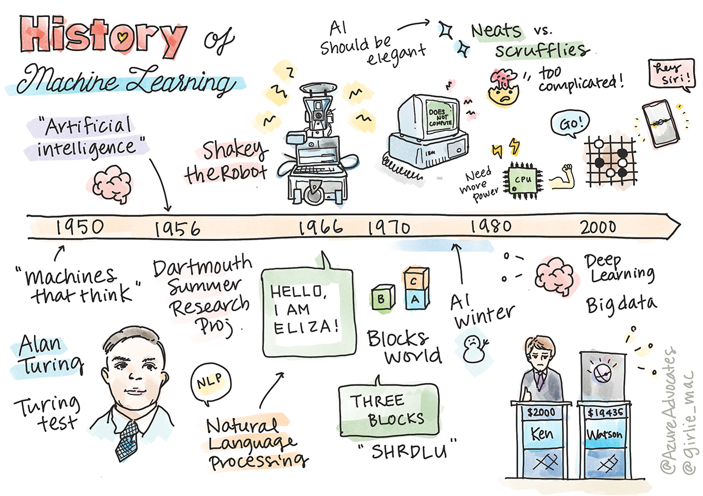

<!--
CO_OP_TRANSLATOR_METADATA:
{
  "original_hash": "b2d11df10030cacc41427a1fbc8bc8f1",
  "translation_date": "2025-08-29T17:42:35+00:00",
  "source_file": "1-Introduction/2-history-of-ML/README.md",
  "language_code": "ne"
}
-->
# मेसिन लर्निङको इतिहास

> स्केच नोट [टोमोमी इमुरा](https://www.twitter.com/girlie_mac) द्वारा

## [पाठ अघि क्विज](https://gray-sand-07a10f403.1.azurestaticapps.net/quiz/3/)

---

> 🎥 माथिको तस्बिरमा क्लिक गरेर यस पाठको छोटो भिडियो हेर्नुहोस्।

यस पाठमा, हामी मेसिन लर्निङ र कृत्रिम बुद्धिमत्ताको इतिहासका प्रमुख माइलस्टोनहरूबारे छलफल गर्नेछौं।

कृत्रिम बुद्धिमत्ता (AI) को इतिहास मेसिन लर्निङको इतिहाससँग गहिरो रूपमा जोडिएको छ, किनभने ML का एल्गोरिदम र कम्प्युटेसनल प्रगतिहरूले AI को विकासलाई सहयोग पुर्‍याएका छन्। यद्यपि यी क्षेत्रहरू १९५० को दशकमा छुट्टाछुट्टै अध्ययनका रूपमा स्थापित भए, [एल्गोरिदमिक, सांख्यिकीय, गणितीय, कम्प्युटेसनल र प्राविधिक खोजहरू](https://wikipedia.org/wiki/Timeline_of_machine_learning) यस युगभन्दा पहिले नै भएका थिए। वास्तवमा, मानिसहरूले [सयौं वर्षदेखि](https://wikipedia.org/wiki/History_of_artificial_intelligence) 'सोच्ने मेसिन' को अवधारणाबारे विचार गरिरहेका थिए।

---
## उल्लेखनीय खोजहरू

- १७६३, १८१२ [बेयस प्रमेय](https://wikipedia.org/wiki/Bayes%27_theorem) र यसको पूर्ववर्तीहरू। यो प्रमेय र यसको प्रयोगहरूले पूर्व ज्ञानको आधारमा कुनै घटनाको सम्भावना वर्णन गर्दछ।
- १८०५ [लिस्ट स्क्वायर थ्योरी](https://wikipedia.org/wiki/Least_squares) फ्रेन्च गणितज्ञ एड्रियन-मेरी लेजेन्ड्रे द्वारा। यो सिद्धान्त, जुन तपाईं हाम्रो रिग्रेसन युनिटमा सिक्नुहुनेछ, डाटा फिटिङमा सहयोग गर्दछ।
- १९१३ [मार्कोभ चेन](https://wikipedia.org/wiki/Markov_chain), जसले अघिल्लो अवस्थाको आधारमा सम्भावित घटनाहरूको क्रम वर्णन गर्दछ।
- १९५७ [पर्सेप्ट्रोन](https://wikipedia.org/wiki/Perceptron), अमेरिकी मनोवैज्ञानिक फ्र्यांक रोसेनब्लाट द्वारा आविष्कार गरिएको एक प्रकारको रेखीय वर्गीकरणकर्ता, जसले गहिरो शिक्षणमा प्रगति ल्यायो।

---

- १९६७ [नियरस्ट नेबर](https://wikipedia.org/wiki/Nearest_neighbor), मूलतः मार्गहरू नक्सा बनाउन डिजाइन गरिएको एल्गोरिदम। ML सन्दर्भमा, यो ढाँचाहरू पत्ता लगाउन प्रयोग गरिन्छ।
- १९७० [ब्याकप्रोपोगेसन](https://wikipedia.org/wiki/Backpropagation), [फिडफर्वार्ड न्यूरल नेटवर्क](https://wikipedia.org/wiki/Feedforward_neural_network) लाई तालिम दिन प्रयोग गरिन्छ।
- १९८२ [रिकरेन्ट न्यूरल नेटवर्क](https://wikipedia.org/wiki/Recurrent_neural_network), फिडफर्वार्ड न्यूरल नेटवर्कबाट व्युत्पन्न कृत्रिम न्यूरल नेटवर्कहरू, जसले समयक्रमिक ग्राफहरू सिर्जना गर्दछ।

✅ अलिकति अनुसन्धान गर्नुहोस्। ML र AI को इतिहासमा अरू कुन मितिहरू महत्त्वपूर्ण छन्?

---
## १९५०: सोच्ने मेसिनहरू

एलन ट्युरिङ, जसलाई [२०१९ मा जनताले](https://wikipedia.org/wiki/Icons:_The_Greatest_Person_of_the_20th_Century) २०औं शताब्दीको महान वैज्ञानिकको रूपमा मतदान गरेका थिए, 'सोच्न सक्ने मेसिन' को अवधारणाको जग बसाल्न मद्दत गरेको श्रेय दिइन्छ। उनले [ट्युरिङ टेस्ट](https://www.bbc.com/news/technology-18475646) सिर्जना गरेर यो अवधारणाको अनुभवजन्य प्रमाण खोज्ने प्रयास गरे, जुन तपाईं हाम्रो NLP पाठहरूमा अन्वेषण गर्नुहुनेछ।

---
## १९५६: डार्टमाउथ ग्रीष्मकालीन अनुसन्धान परियोजना

"डार्टमाउथ ग्रीष्मकालीन अनुसन्धान परियोजना कृत्रिम बुद्धिमत्ताको क्षेत्रमा एक ऐतिहासिक घटना थियो," र यहीं 'कृत्रिम बुद्धिमत्ता' शब्दको निर्माण गरियो ([स्रोत](https://250.dartmouth.edu/highlights/artificial-intelligence-ai-coined-dartmouth))।

> सिकाइ वा बुद्धिमत्ताको कुनै पनि पक्षलाई यति स्पष्ट रूपमा वर्णन गर्न सकिन्छ कि मेसिनलाई यसलाई अनुकरण गर्न बनाइन्छ।

---

नेतृत्वकर्ता, गणितका प्राध्यापक जोन म्याककार्थीले "सिकाइ वा बुद्धिमत्ताको कुनै पनि पक्षलाई यति स्पष्ट रूपमा वर्णन गर्न सकिन्छ कि मेसिनलाई यसलाई अनुकरण गर्न बनाइन्छ" भन्ने अनुमानको आधारमा अघि बढ्ने आशा राखेका थिए। सहभागीहरूमा यस क्षेत्रका अर्को प्रसिद्ध व्यक्तित्व मार्भिन मिन्स्की पनि थिए।

यो कार्यशालाले "प्रतीकात्मक विधिहरूको उदय, सीमित डोमेनमा केन्द्रित प्रणालीहरू (प्रारम्भिक विशेषज्ञ प्रणालीहरू), र निगमनात्मक प्रणालीहरू विरुद्ध प्रेरणात्मक प्रणालीहरू" जस्ता छलफलहरूलाई प्रोत्साहित गरेको श्रेय पाएको छ। ([स्रोत](https://wikipedia.org/wiki/Dartmouth_workshop))।

---
## १९५६ - १९७४: "सुनौलो वर्षहरू"

१९५० को दशकदेखि ७० को दशकको मध्यसम्म, AI ले धेरै समस्याहरू समाधान गर्न सक्छ भन्ने आशा उच्च थियो। १९६७ मा, मार्भिन मिन्स्कीले आत्मविश्वासका साथ भने, "एक पुस्ताभित्र ... 'कृत्रिम बुद्धिमत्ता' सिर्जना गर्ने समस्या धेरै हदसम्म समाधान हुनेछ।" 

प्राकृतिक भाषा प्रशोधन अनुसन्धान फस्टायो, खोजलाई परिष्कृत गरियो, र 'माइक्रो-वर्ल्ड' को अवधारणा सिर्जना गरियो, जहाँ साधारण कार्यहरू साधारण भाषा निर्देशनहरू प्रयोग गरेर पूरा गरिन्थ्यो।

---

अनुसन्धानलाई सरकारी एजेन्सीहरूले राम्रोसँग वित्त पोषण गरे, कम्प्युटेसन र एल्गोरिदममा प्रगति गरियो, र बुद्धिमान मेसिनहरूको प्रोटोटाइपहरू निर्माण गरियो। ती मेसिनहरूमा समावेश छन्:

* [शेकी रोबोट](https://wikipedia.org/wiki/Shakey_the_robot), जसले 'बुद्धिमानी' रूपमा कार्यहरू प्रदर्शन गर्ने निर्णय गर्न सक्थ्यो।

    
    > १९७२ मा शेकी

---

* एलिजा, एक प्रारम्भिक 'च्याटरबोट', मानिसहरूसँग संवाद गर्न र एक प्राथमिक 'थेरापिस्ट' को रूपमा कार्य गर्न सक्थ्यो। तपाईं NLP पाठहरूमा एलिजाबारे थप जान्नुहुनेछ।

    
    > एलिजाको एक संस्करण

---

* "ब्लक वर्ल्ड" एक माइक्रो-वर्ल्डको उदाहरण थियो, जहाँ ब्लकहरू थुपार्न र क्रमबद्ध गर्न सकिन्थ्यो, र मेसिनलाई निर्णय लिन सिकाउने प्रयोगहरू परीक्षण गरिन्थ्यो। [SHRDLU](https://wikipedia.org/wiki/SHRDLU) जस्ता पुस्तकालयहरूसँग निर्माण गरिएका प्रगतिहरूले भाषा प्रशोधनलाई अगाडि बढायो।

    

    > 🎥 माथिको तस्बिरमा क्लिक गरेर भिडियो हेर्नुहोस्: SHRDLU सँग ब्लक वर्ल्ड

---
## १९७४ - १९८०: "AI जाडो"

१९७० को दशकको मध्यसम्म, 'बुद्धिमान मेसिन' बनाउने जटिलता कम आँकलन गरिएको र उपलब्ध कम्प्युट पावरको आधारमा यसको वाचा अत्यधिक भएको स्पष्ट भयो। वित्त पोषण सुक्यो र क्षेत्रप्रति विश्वास घट्यो। केही समस्याहरू जसले विश्वासलाई असर गरे:

---
- **सीमितताहरू**। कम्प्युट पावर पर्याप्त थिएन।
- **कम्बिनेटोरियल विस्फोट**। कम्प्युटरहरूबाट बढी अपेक्षा गरिएसँगै तालिम दिनुपर्ने प्यारामिटरहरूको संख्या तीव्र रूपमा बढ्यो।
- **डाटाको अभाव**। परीक्षण, विकास, र एल्गोरिदम परिष्कृत गर्न डाटाको अभावले प्रक्रिया अवरुद्ध गर्‍यो।
- **के हामी सही प्रश्न सोधिरहेका छौं?**। सोधिएका प्रश्नहरू नै प्रश्न गर्न थालियो। अनुसन्धानकर्ताहरूले आफ्नो दृष्टिकोणको आलोचना सामना गर्न थाले:
  - ट्युरिङ परीक्षणहरूलाई 'चाइनिज रूम थ्योरी' जस्ता विचारहरूले प्रश्न गरे, जसले "डिजिटल कम्प्युटरलाई प्रोग्रामिङ गर्दा यसले भाषा बुझेजस्तो देखिन सक्छ तर वास्तविक बुझाइ उत्पादन गर्न सक्दैन" भनेको थियो। ([स्रोत](https://plato.stanford.edu/entries/chinese-room/))
  - "थेरापिस्ट" ELIZA जस्ता कृत्रिम बुद्धिमत्ताहरू समाजमा परिचय गराउने नैतिकतामाथि चुनौती दिइयो।

---

त्यसै समयमा, AI का विभिन्न विद्यालयहरू गठन हुन थाले। ["स्क्रफी" बनाम "नीट AI"](https://wikipedia.org/wiki/Neats_and_scruffies) अभ्यासहरू बीच एक विभाजन स्थापित भयो। _स्क्रफी_ प्रयोगशालाहरूले चाहिएको परिणाम प्राप्त नभएसम्म कार्यक्रमहरूलाई घण्टौंसम्म परिमार्जन गर्थे। _नीट_ प्रयोगशालाहरू "तर्क र औपचारिक समस्या समाधानमा केन्द्रित" थिए। ELIZA र SHRDLU प्रख्यात _स्क्रफी_ प्रणालीहरू थिए। १९८० को दशकमा, ML प्रणालीहरूलाई पुनरुत्पादनयोग्य बनाउन माग बढेसँगै, _नीट_ दृष्टिकोणले अग्रता लिन थाल्यो किनभने यसको परिणामहरू बढी व्याख्यायोग्य थिए।

---
## १९८० को दशक: विशेषज्ञ प्रणालीहरू

क्षेत्र बढ्दै जाँदा, यसको व्यापारिक फाइदा स्पष्ट हुँदै गयो, र १९८० को दशकमा 'विशेषज्ञ प्रणालीहरू' को प्रसार भयो। "विशेषज्ञ प्रणालीहरू कृत्रिम बुद्धिमत्ता (AI) सफ्टवेयरका पहिलो सफल रूपहरू मध्ये थिए।" ([स्रोत](https://wikipedia.org/wiki/Expert_system))।

यस प्रकारको प्रणाली वास्तवमा _हाइब्रिड_ हो, जसमा आंशिक रूपमा व्यापारिक आवश्यकताहरू परिभाषित गर्ने नियम इन्जिन र नयाँ तथ्यहरू अनुमान गर्न नियम प्रणाली प्रयोग गर्ने इन्फरेन्स इन्जिन समावेश छ।

यस युगमा न्यूरल नेटवर्कप्रति पनि बढ्दो ध्यान दिइयो।

---
## १९८७ - १९९३: AI 'चिसो'

विशेषज्ञ प्रणालीहरूको अत्यधिक विशेषज्ञताले दुर्भाग्यवश तिनीहरूलाई अत्यधिक सीमित बनायो। व्यक्तिगत कम्प्युटरहरूको उदयले यी ठूला, विशेषज्ञ, केन्द्रीकृत प्रणालीहरूसँग प्रतिस्पर्धा गर्‍यो। कम्प्युटिङको लोकतान्त्रिकरण सुरु भयो, जसले ठूलो डाटाको आधुनिक विस्फोटको बाटो खोल्यो।

---
## १९९३ - २०११

यस युगले ML र AI लाई पहिले डाटा र कम्प्युट पावरको अभावले सिर्जना गरेका केही समस्याहरू समाधान गर्न सक्षम बनायो। डाटाको मात्रा तीव्र रूपमा बढ्न थाल्यो र राम्रो र नराम्रो दुबैका लागि व्यापक रूपमा उपलब्ध भयो, विशेष गरी २००७ को आसपास स्मार्टफोनको आगमनसँगै। कम्प्युट पावर तीव्र रूपमा विस्तार भयो, र एल्गोरिदमहरू पनि विकसित भए। क्षेत्रले परिपक्वता प्राप्त गर्न थाल्यो, किनभने विगतका स्वतन्त्र दिनहरू एक साँचो अनुशासनमा परिणत हुन थाले।

---
## अहिले

आज मेसिन लर्निङ र AI ले हाम्रो जीवनका लगभग हरेक भागलाई छोएको छ। यो युगले यी एल्गोरिदमहरूको मानव जीवनमा पर्ने जोखिम र सम्भावित प्रभावहरूको सावधानीपूर्वक बुझाइको माग गर्दछ। माइक्रोसफ्टका ब्राड स्मिथले भनेझैं, "सूचना प्रविधिले गोपनीयता र अभिव्यक्तिको स्वतन्त्रता जस्ता मौलिक मानव-अधिकार संरक्षणको केन्द्रमा जाने मुद्दाहरू उठाउँछ। यी मुद्दाहरूले यी उत्पादनहरू सिर्जना गर्ने प्रविधि कम्पनीहरूको जिम्मेवारीलाई बढाउँछन्। हाम्रो दृष्टिमा, तिनीहरूले विचारशील सरकारी नियमन र स्वीकार्य प्रयोगहरूको वरिपरि मानदण्डहरूको विकासको लागि पनि आह्वान गर्छन्।" ([स्रोत](https://www.technologyreview.com/2019/12/18/102365/the-future-of-ais-impact-on-society/))।

---

भविष्यले के ल्याउँछ भन्ने हेर्न बाँकी छ, तर यी कम्प्युटर प्रणालीहरू र तिनीहरूले चलाउने सफ्टवेयर र एल्गोरिदमहरू बुझ्न महत्त्वपूर्ण छ। हामी आशा गर्दछौं कि यो पाठ्यक्रमले तपाईंलाई राम्रो बुझाइ प्राप्त गर्न मद्दत गर्नेछ ताकि तपाईं आफैं निर्णय गर्न सक्नुहुनेछ।

> 🎥 माथिको तस्बिरमा क्लिक गरेर भिडियो हेर्नुहोस्: यान लेकुनले गहिरो शिक्षणको इतिहासबारे यस व्याख्यानमा छलफल गरेका छन्

---
## 🚀चुनौती

यी ऐतिहासिक क्षणहरू मध्ये कुनै एकमा गहिरो अध्ययन गर्नुहोस् र तिनीहरूका पछाडि रहेका व्यक्तिहरूबारे थप जान्नुहोस्। त्यहाँ रोचक पात्रहरू छन्, र कुनै पनि वैज्ञानिक खोज सांस्कृतिक निर्वातमा सिर्जना गरिएको थिएन। तपाईंले के पत्ता लगाउनुहुन्छ?

## [पाठपछि क्विज](https://gray-sand-07a10f403.1.azurestaticapps.net/quiz/4/)

---
## समीक्षा र आत्म अध्ययन

यहाँ हेर्न र सुन्नका लागि केही सामग्रीहरू छन्:

[यो पोडकास्ट जहाँ एमी बोयडले AI को विकासबारे छलफल गरेकी छिन्](http://runasradio.com/Shows/Show/739)

---

## असाइनमेन्ट

[समयरेखा बनाउनुहोस्](assignment.md)

---

**अस्वीकरण**:  
यो दस्तावेज़ AI अनुवाद सेवा [Co-op Translator](https://github.com/Azure/co-op-translator) प्रयोग गरेर अनुवाद गरिएको छ। हामी शुद्धताको लागि प्रयास गर्छौं, तर कृपया ध्यान दिनुहोस् कि स्वचालित अनुवादमा त्रुटिहरू वा अशुद्धताहरू हुन सक्छ। यसको मूल भाषा मा रहेको मूल दस्तावेज़लाई आधिकारिक स्रोत मानिनुपर्छ। महत्वपूर्ण जानकारीको लागि, व्यावसायिक मानव अनुवाद सिफारिस गरिन्छ। यस अनुवादको प्रयोगबाट उत्पन्न हुने कुनै पनि गलतफहमी वा गलत व्याख्याको लागि हामी जिम्मेवार हुने छैनौं।