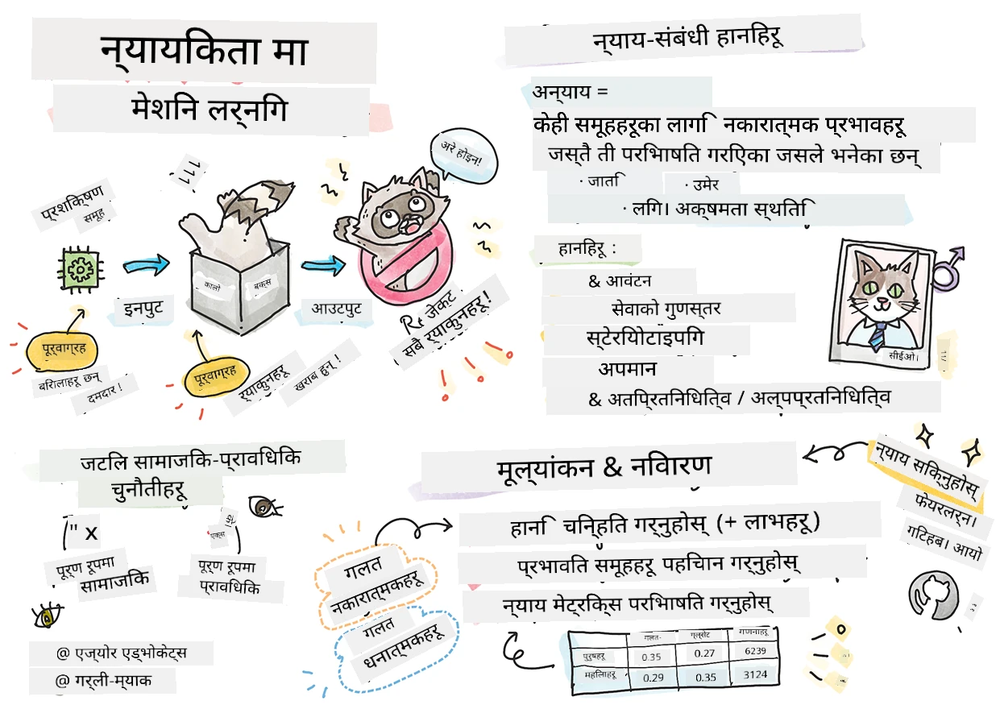

# जिम्मेवार AI सँग मेशिन लर्निङ समाधानहरू निर्माण गर्दै
 

> स्केचनोट द्वारा [टोमोमी इमुरा](https://www.twitter.com/girlie_mac)

## [पाठ अघि क्विज](https://ff-quizzes.netlify.app/en/ml/)
 
## परिचय

यस पाठ्यक्रममा, तपाईं मेशिन लर्निङले कसरी हाम्रो दैनिक जीवनलाई प्रभाव पारिरहेको छ र पार्नेछ भन्ने कुरा पत्ता लगाउन थाल्नुहुनेछ। अहिले पनि, प्रणालीहरू र मोडेलहरू दैनिक निर्णय-प्रक्रियामा संलग्न छन्, जस्तै स्वास्थ्य सेवाको रोग निदान, ऋण स्वीकृति वा ठगी पत्ता लगाउनु। त्यसैले, यी मोडेलहरूले भरपर्दो परिणाम प्रदान गर्न राम्रोसँग काम गर्नु आवश्यक छ। जस्तो कुनै सफ्टवेयर एप्लिकेशन, AI प्रणालीहरूले अपेक्षा पुरा गर्न नसक्न सक्छन् वा अवाञ्छित परिणाम दिन सक्छन्। त्यसैले AI मोडेलको व्यवहार बुझ्न र व्याख्या गर्न सक्षम हुनु आवश्यक छ।

कल्पना गर्नुहोस् कि तपाईंले यी मोडेलहरू बनाउन प्रयोग गर्ने डेटा केही जनसांख्यिकी, जस्तै जाति, लिंग, राजनीतिक दृष्टिकोण, धर्म, वा यस्ता जनसांख्यिकीमा असमान प्रतिनिधित्व गरेको अवस्था कस्तो हुन्छ। जब मोडेलको नतिजा केही जनसांख्यिकीलाई पक्षपात गरेको व्याख्या गरिन्छ भने के हुन्छ? अनुप्रयोगका लागि यसको के परिणाम होला? थपमा, जब मोडेलले हानिकारक परिणाम दिन्छ र मानिसहरूलाई नोक्सान पुर्याउँछ भने के हुन्छ? AI प्रणालीको व्यवहारका लागि को जिम्मेवार हुन्छ? यी केही प्रश्नहरू हामी यस पाठ्यक्रममा अन्वेषण गर्नेछौं।

यस पाठमा, तपाईं:

- मेशिन लर्निङमा निष्पक्षताको महत्त्व र निष्पक्षता सम्बन्धी हानिहरूको बारेमा जागरुकता बढाउनुहोस्।
- विश्वसनीयता र सुरक्षा सुनिश्चित गर्न आउट्लायर्स र अस्वाभाविक परिस्थितिहरू अन्वेषण गर्ने अभ्याससँग परिचित हुनुहोस्।
- सबैलाई समावेशी प्रणालीहरू डिजाइन गरेर सशक्त पार्ने जरुरतमा बुझाइ हासिल गर्नुहोस्।
- डेटा र मानिसहरूको गोप्यता र सुरक्षा संरक्षण गर्न कति महत्त्वपूर्ण छ अन्वेषण गर्नुहोस्।
- AI मोडेलहरूको व्यवहार व्याख्या गर्न गिलास बक्स दृष्टिकोणको महत्त्व देख्नुहोस्।
- AI प्रणालीहरूमा विश्वास निर्माण गर्न जिम्मेवारी हुनु आवश्यक कुरा मनन गर्नुहोस्।

## पूर्वापेक्षा

पूर्वापेक्षाका रूपमा कृपया "जिम्मेवार AI सिद्धान्तहरू" सिक्ने मार्ग लिनुहोस् र तलको भिडियो हेर्नुहोस्:

जिम्मेवार AI बारे थप जान्न यो [सिकाइ मार्ग](https://docs.microsoft.com/learn/modules/responsible-ai-principles/?WT.mc_id=academic-77952-leestott) पछ्याउनुहोस्।

> 🎥 माथि तस्बिरमा क्लिक गर्नुहोस् भिडियोको लागि: Microsoftको जिम्मेवार AI दृष्टिकोण

## निष्पक्षता

AI प्रणालीहरूले सबैलाई निष्पक्ष व्यवहार गर्नुपर्छ र समान समूहका मानिसहरूलाई फरक तरिकाले प्रभावित गर्नु हुँदैन। उदाहरणका लागि, जब AI प्रणालीहरूले चिकित्सा उपचार, ऋण आवेदन वा रोजगारमा मार्गनिर्देशन प्रदान गर्छन्, तिनीहरूले समान लक्षण, आर्थिक अवस्था वा व्यावसायिक योग्यताहरू भएका सबैलाई समान सिफारिश गर्नुपर्छ। हामी सबै मान्छेले आफ्नो निर्णय र कार्यहरूमा असर गर्ने पूर्वाग्रहहरू बोकेर हिँड्छौं। यी पूर्वाग्रहहरू कहिलेकाहीँ अनायासै डेटा मार्फत AI प्रणालीहरूलाई प्रभाव पार्न सक्छ। जब तपाई डेटा भित्र पूर्वाग्रह ल्याउँदै हुनुहुन्छ भन्ने कुरा सचेत रूपले जान्न गाह्रो हुन्छ।

**"अनिष्पक्षता"** भन्नाले कुनै समूह जस्तै जाति, लिंग, उमेर वा अपाङ्गताको आधारमा नकारात्मक प्रभाव वा "हानिहरू"लाई जनाउँछ। मुख्य निष्पक्षता सम्बन्धी हानिहरू यस प्रकार वर्गीकरण गर्न सकिन्छ:

- **वितरण**, उदाहरणका लागि एउटा लिंग वा जाति अर्कोभन्दा बढी पक्षपाती भएमा।
- **सेवाको गुणस्तर**। यदि तपाईंले एक विशिष्ट परिदृश्यको लागि डेटा प्रशिक्षण गर्नुभयो तर वास्तविकता बढी जटिल छ भने, यो खराब प्रदर्शन गर्ने सेवामा परिणत हुन्छ। उदाहरणका लागि, एउटा हात धुने साबुन डिस्पेन्सरले कालो छालाका मानिसहरूलाई चिन्ह्नेमा असमर्थ थियो। [स्रोत](https://gizmodo.com/why-cant-this-soap-dispenser-identify-dark-skin-1797931773)
- **अपमान**। अन्यायपूर्ण रूपमा केही वा कसैलाई आलोचना र लेबल लगाउनु। उदाहरणका लागि, छवि लेबलिङ प्रविधिले कालो छालाका मानिसहरूलाई गोरिल्लाका रूपमा गलत लेबल गरेको थियो।
- **अधिक वा कम प्रतिनिधित्व**। विचार यो हो कि कुनै समूह विशेष पेशामा देखिन्न, र जसले यस्तो प्रवर्द्धन गर्छ त्यसले हानि पुर्याउँछ।
- **स्टिरियोटाइपिङ**। कुनै समूहलाई पूर्वनिर्धारित विशेषतासँग जोड्नु। उदाहरणका लागि, अंग्रेजी र टर्किश भाषाको अनुवाद प्रणालीले लिंगसँग सम्बन्धित स्टिरियोटाइपिकल शब्दहरूका कारण गलत अनुवाद गर्न सक्छ।

> टर्किशमा अनुवाद

> फेरि अंग्रेजीमा अनुवाद

AI प्रणालीहरू डिजाइन र परीक्षण गर्दा, हामीले AI निष्पक्ष हो र पूर्वाग्राही वा भेदभावपूर्ण निर्णयहरू नगर्ने सुनिश्चित गर्नुपर्छ, जुन मानवहरूलाई पनि गर्नु निषेध गरिएको छ। AI र मेशिन लर्निङमा निष्पक्षताको ग्यारेन्टी गर्नु एक जटिल सामाजिक-प्रविधिगत चुनौती हो।

### विश्वसनीयता र सुरक्षा

विश्वास निर्माण गर्न, AI प्रणालीहरू विश्वसनीय, सुरक्षित र सामान्य तथा अप्रत्याशित अवस्थाहरूमा स्थिर हुनुपर्छ। AI प्रणालीहरूले कसरी विभिन्न परिस्थितिहरूमा व्यवहार गर्ने जानकारी हुनु महत्त्वपूर्ण छ, विशेष गरी जब तिनीहरू आउट्लायर्स हुन्छन्। AI समाधान बनाउँदा, व्यापक प्रकारका अवस्थाहरूलाई कसरी व्यवस्थापन गर्ने भन्ने कुरामा पर्याप्त ध्यान दिनुपर्छ जुन AI समाधानहरू सामना गर्न सक्छन्। उदाहरणका लागि, सेल्फ ड्राइभिङ कारले मानिसहरूको सुरक्षा प्राथमिकता राख्नुपर्छ। जसको परिणामस्वरूप, कारलाई चलाउने AI ले रात, चर्को वर्षा वा हिमपहिरो, सडक पार गर्ने बच्चाहरू, गाई-बिरालो, सडक निर्माण आदि जस्ता सम्भावित अवस्थाहरू विचार गर्नुपर्छ। कसरी AI प्रणालीले विविध अवस्थाहरूलाई विश्वसनीय र सुरक्षित रूपमा व्यवस्थापन गर्न सक्छ भन्ने कुरा डिजाइन वा परीक्षण गर्दा डाटा वैज्ञानिक वा AI विकासकर्ताले कस्तो अपेक्षा गरेका थिए भन्ने देखाउँछ।

> [🎥 भिडियोको लागि यहाँ क्लिक गर्नुहोस्: ](https://www.microsoft.com/videoplayer/embed/RE4vvIl)

### समावेशिता

AI प्रणालीहरूले सबैलाई संलग्न र सशक्त बनाउन डिजाइन गर्नुपर्छ। AI प्रणालीहरू डिजाइन र लागू गर्दा डेटा वैज्ञानिकहरू र AI विकासकर्ताहरूले प्रणालीमा सम्भावित बाधाहरू पत्ता लगाएर समाधान गर्छन् जुन अनायासै मानिसहरूलाई बहिष्कृत गर्न सक्छ। उदाहरणका लागि, विश्वभर एक अर्ब मानिसहरू अपाङ्गता भएका छन्। AI को प्रगतिको साथ, उनीहरूले दैनिक जीवनमा जानकारी र अवसरहरू सजिलै पहुँच गर्न सक्छन्। बाधाहरू समाधान गर्दा सबैका लागि लाभदायक अनुभवहरूसहित AI उत्पादनहरू नवप्रवर्तन गर्न र विकास गर्न अवसरहरू सिर्जना हुन्छन्।

> [🎥 AI मा समावेशिताको लागि यहाँ क्लिक गर्नुहोस्: ](https://www.microsoft.com/videoplayer/embed/RE4vl9v)

### सुरक्षा र गोप्यता

AI प्रणालीहरूले सुरक्षित हुनुपर्छ र मानिसहरूको गोप्यता सम्मान गर्नुपर्छ। मानिसहरूले आफ्ना गोप्यता, जानकारी वा जीवन खतरा पर्ने प्रणालीहरूमा कम विश्वास गर्छन्। मेशिन लर्निङ मोडेलहरू प्रशिक्षण गर्दा, राम्रो परिणाम निकाल्नको लागि डेटा आवश्यक पर्छ। यस क्रममा, डेटाको उत्पत्ति र अखण्डता विचार गर्नुपर्छ। उदाहरणका लागि, डेटा उपयोगकर्ता द्वारा प्रस्तुत गरिएको हो वा सार्वजनिक रूपमा उपलब्ध थियो? त्यसपछि, डेटा प्रयोग गर्दा, गोप्य जानकारीलाई सुरक्षा गर्न र आक्रमणबाट बचाउन सक्षम AI प्रणाली विकास गर्नु जरुरी छ। AI बढ्दै जाँदा, गोप्यता र महत्वपूर्ण व्यक्तिगत तथा व्यवसायिक जानकारीको सुरक्षा बढी महत्वपूर्ण र जटिल हुँदै गएको छ। गोप्यता र डेटा सुरक्षा मुद्दाहरू AI को लागि विशेष ध्यान आवश्यक पार्छन् किनकि AI प्रणालीहरूलाई सटीक र सूचित भविष्यवाणी र निर्णय गर्न डेटामा पहुँच आवश्यक हुन्छ।

> [🎥 AI मा सुरक्षा को भिडियोको लागि यहाँ क्लिक गर्नुहोस्: ](https://www.microsoft.com/videoplayer/embed/RE4voJF)

- उद्योगको रूपमा हामीले गोप्यता र सुरक्षा क्षेत्रमा महत्वपूर्ण प्रगति गरेका छौं, जुन GDPR जस्ता नियमहरूले पनि प्रेरित गरेको छ।
- तर AI प्रणालीहरूको सन्दर्भमा, प्रणालीलाई व्यक्तिगत र प्रभावकारी बनाउनको लागि बढी व्यक्तिगत डेटा आवश्यक पर्दैछ र गोप्यताको बीच तनाव स्वीकार्नुपर्छ।
- इन्टरनेटसहित जोडिएको कम्प्युटरहरूको जन्म जस्तो, AI सँग सम्बन्धित सुरक्षाका समस्याहरूमा पनि ठूलो वृद्धि हुँदैछ।
- त्यस्तै, AI ले सुरक्षामा सुधार ल्याउनमा मद्दत गरेको छ। उदाहरणका लागि, अधिकांश आधुनिक एन्टी-भाइरस स्क्यानरहरू आज AI युक्त विधिहरूले चलाउँछन्।
- हाम्रा डेटा विज्ञान प्रक्रिया नवीनतम गोप्यता र सुरक्षा अभ्यासहरूसँग सुमधुर रूपमा मेल खाने सुनिश्चित गर्न आवश्यक छ।

### पारदर्शিতা
AI प्रणालीहरू बुझ्न मिल्ने हुनुपर्छ। पारदर्शिताको महत्त्वपूर्ण अंश भनेको AI प्रणालीहरू र तिनका कम्पोनेन्टहरूको व्यवहार व्याख्या गर्नु हो। AI प्रणालीहरूको बुझाइ सुधार्नको लागि सरोकारवालाहरूले तिनले कसरी र किन काम गर्छन् भन्ने बुझ्नुपर्छ ताकि सम्भावित प्रदर्शन समस्या, सुरक्षा र गोप्यता चिन्ताहरू, पूर्वाग्रह, बहिष्कृत अभ्यासहरू वा अनपेक्षित परिणामहरू पत्ता लगाउन सकून्। हामी विश्वास गर्छौं कि AI प्रणालीहरू प्रयोग गर्नेहरूले कहिले, किन, र कसरी तिनीहरूलाई तैनाथ गर्छन् त्यसबारे इमानदार र स्पष्ट हुनुपर्छ। प्रयोग गरिएका प्रणालीहरूको सीमाहरू समेत जानकारी गराउनु आवश्यक छ। उदाहरणका लागि, एउटा बैंकले आफ्नो उपभोक्ता ऋण निर्णय समर्थन गर्न AI प्रणाली प्रयोग गर्दा, परिणामहरू परीक्षण गरी कुन डेटा प्रणालीका सिफारिशहरू प्रभावित गर्छ भन्ने बुझ्नु महत्वपूर्ण हुन्छ। सरकारले उद्योगमा AI को नियमावली सुरु गरिरहेकाले डेटा वैज्ञानिकहरू र संस्थाहरूले AI प्रणालीले नियमावली पूरा गर्छ कि गर्दैन भनेर स्पष्ट गर्नुपर्छ, विशेष गरी जब अवाञ्छित परिणाम हुन्छ।

> [🎥 AI मा पारदर्शिताको लागि यहाँ क्लिक गर्नुहोस्: ](https://www.microsoft.com/videoplayer/embed/RE4voJF)

- AI प्रणालीहरू यति जटिल हुनुका कारण, तिनीहरूको कार्य प्रणाली र नतिजा व्याख्या गर्न कठिनाइ हुन्छ।
- बुझाइको कमीले यी प्रणालीहरूलाई कसरी व्यवस्थापन, सञ्चालन र डकुमेन्ट गर्ने प्रभावित गर्दछ।
- यस बुझाइको कमीले विशेषगरी यी प्रणालीहरूले उत्पादन गर्ने नतिजाको आधारमा गरिएका निर्णयहरूलाई प्रभाव गर्छ।

### जिम्मेवारी
 
AI प्रणाली डिजाइन र तैनाथ गर्ने मानिसहरू आफ्नो प्रणाली कसरी संचालन हुन्छ त्यसको लागि जिम्मेवार हुनुपर्छ। जिम्मेवारी आवश्यकतालाई विशेष गरी अनुहार पहिचान जस्ता संवेदनशील प्रविधिहरूमा महत्त्व दिइन्छ। हालै, कानुन कार्यान्वयन संस्थाहरूले अनुहार पहिचान प्रविधिको माग बढेको छ, विशेष गरी हराएका बच्चा खोज्न प्रविधिको सम्भावना रूपमा। तर, यी प्रविधिहरू सरकारहरुले आफ्ना नागरिकहरूको आधारभूत स्वतन्त्रताहरूमाथि खतरा पुर्‍याउन प्रयोग गर्न सक्छन्, जस्तै विशिष्ट व्यक्तिहरूको निरन्तर अनुगमन गर्न सक्षम बनाएर। त्यसैले, डेटा वैज्ञानिकहरू र संस्थाहरूले आफ्नो AI प्रणालीले व्यक्तिहरू वा समाजमा पार्ने प्रभावका लागि जिम्मेवार हुनुपर्छ।

> 🎥 माथि तस्बिरमा क्लिक गर्नुहोस् भिडियोको लागि: अनुहार पहिचानमार्फत द्रुत निगरानीको चेतावनीहरू 

अन्ततः हाम्रो पुस्ताको सबैभन्दा ठूलो प्रश्नहरू मध्ये एक, जसले AI लाई समाजमा ल्याइरहेको पहिलो पुस्ता हो, के हो भने कम्प्युटरहरू मानिसहरूसँग जिम्मेवार रहिरहनेछन् र जसले कम्प्युटर डिजाइन गर्छन् तिनीहरू अरू सबैमै जिम्मेवार कसरी रहिरहनेछन्?

## प्रभाव मूल्याङ्कन

मेशिन लर्निङ मोडेल प्रशिक्षित गर्नु अघि, AI प्रणालीको उद्देश्य के हो, यसको अपेक्षित प्रयोग के हो, कहाँ लागू गरिनेछ, र को प्रणालीसँग अन्तर्क्रिया गर्नेछ भन्ने बुझ्न प्रभाव मूल्याङ्कन गर्नु महत्त्वपूर्ण छ। यी कुरा समीक्षकहरू वा परीक्षण गर्नेहरूले प्रणालीको सम्भावित जोखिम र अपेक्षित परिणामहरूको मूल्याङ्कन गर्दा ध्यान दिनु पर्ने छन्।

प्रभाव मूल्याङ्कन गर्दा ध्यान दिनु पर्ने क्षेत्रहरू:

* **व्यक्तिगतमा प्रतिकूल प्रभाव**। कुनै प्रतिबन्ध वा आवश्यकता, समर्थन नगरेको प्रयोग वा प्रणालीको प्रदर्शनमा बाधा पुर्याउने ज्ञात सीमाहरूको बारेमा सचेत हुनु आवश्यक छ ताकि प्रणालीले मानिसहरूलाई हानि पुर्याउन नपाओस्।
* **डेटा आवश्यकताहरू**। प्रणालीले डेटा कसरी र कहाँ प्रयोग गर्ने बुझ्नाले समीक्षकहरूलाई डेटा आवश्यकताहरू (जस्तै GDPR वा HIPAA नियमहरू) बारे विचार गर्न मद्दत गर्छ। साथै, डेटा स्रोत वा परिमाण प्रशिक्षणको लागि पर्याप्त छ कि छैन हेर्नुहोस्।
* **प्रभावको सारांश**। प्रणाली प्रयोग गर्दा आउन सक्ने सम्भावित हानिहरूको सूची तयार गर्नुहोस्। ML जीवनचक्रभरि समस्याहरू देखिन्छन् भने तिनीहरूलाई समाधान वा सम्बोधन गरिन्छ कि छैन पुनरावलोकन गर्नुहोस्।
* **छ मुख्य सिद्धान्तका लागि लागू हुने लक्ष्यहरू**। प्रत्येक सिद्धान्तका लक्ष्यहरू पुरा भए वा कुनै खाली ठाउँ छ कि छैन मूल्याङ्कन गर्नुहोस्।

## जिम्मेवार AI सँग डिबगिङ  

सफ्टवेयर एप्लिकेशन डिबग गर्ने झै, AI प्रणाली डिबग गर्नु यसको समस्याहरू पहिचान र समाधान गर्ने जरूरी प्रक्रिया हो। मोडेलले अपेक्षा अनुसार वा जिम्मेवार रूपमा काम नगर्न धेरै कारकहरू हुन सक्छन्। अधिकांश परम्परागत मोडेल प्रदर्शन मेट्रिक्स मोडेलको प्रदर्शनको मात्रात्मक अभिव्यक्ति मात्र हो, तर तिनीहरूले जिम्मेवार AI सिद्धान्तहरूको उल्लंघन कसरी भयो भन्ने विश्लेषण गर्न पर्याप्त छैन। थपमा, मेशिन लर्निङ मोडेल एक कालो बाकस हो जसले आफ्नो नतिजाको कारण बुझ्न र गल्ती गर्दा व्याख्या दिन कठिन बनाउँछ। यस कोर्सको पछि भागमा, हामी जिम्मेवार AI ड्यासबोर्ड प्रयोग गर्न सिक्नेछौं जसले AI प्रणालीहरू डिबग गर्न मद्दत गर्छ। ड्यासबोर्डले डेटा वैज्ञानिकहरू र AI विकासकर्तालाई को समग्र उपकरण प्रदान गर्छ जसले:

* **त्रुटि विश्लेषण**। प्रणालीको निष्पक्षता वा विश्वसनीयतामा असर गर्ने मोडेलको त्रुटि वितरण पत्ता लगाउन।
* **मोडेल अवलोकन**। डेटा समूहहरूमा मोडेल प्रदर्शनमा हुने असमानता पत्ता लगाउन।
* **डेटा विश्लेषण**। डेटा वितरण बुझ्न र निष्पक्षता, समावेशिता, र विश्वसनीयता सम्बन्धी सम्भावित पूर्वाग्रह पत्ता लगाउन।
* **मोडेल व्याख्यायोग्यता**। मोडेलका पूर्वानुमानमा के के असर गर्छ बुझ्न। यसले मोडेलको व्यवहार व्याख्या गर्न मद्दत गर्छ, जुन पारदर्शिता र जिम्मेवारीका लागि महत्त्वपूर्ण छ।

## 🚀 चुनौती 
 
हानीहरू आरम्भमा नै रोक्न, हामीले:

- प्रणालीहरूमा काम गर्ने मानिसहरूमा फरक पृष्ठभूमि र दृष्टिकोणको विविधता हुनुपर्छ।
- हाम्रो समाजको विविधता प्रतिबिम्बित गर्ने डाटासेटहरूमा लगानी गर्नुपर्छ।
- मेशिन लर्निङ जीवनचक्रभर जिम्मेवार AI पत्ता लगाउन र सुधार गर्न राम्रो विधिहरू विकास गर्नुपर्छ।

मोडेलको अविश्वसनीयता मोडेल निर्माण र प्रयोगमा कसरी देखिन्छ भन्ने वास्तविक जीवनका परिदृश्यहरू बारे सोच्नुहोस्। के अरू कुरा विचार गर्नुपर्छ?

## [पाठ पछि क्विज](https://ff-quizzes.netlify.app/en/ml/)

## समीक्षा र आत्म-अध्ययन 
 

यस पाठमा, तपाईंले मेसिन लर्निंगमा निष्पक्षता र अन्याय सम्बन्धी केहि आधारभूत अवधारणाहरू सिक्नुभएको छ।  
 
यी विषयहरूमा गहिराइमा जान यो कार्यशालामा हेर्नुहोस्: 

- जिम्मेवार AI को खोजीमा: व्यवहारमा सिद्धान्त ल्याउने कुरामा Besmira Nushi, Mehrnoosh Sameki र Amit Sharma द्वारा

> 🎥 भिडियोका लागि माथिको तस्वीरमा क्लिक गर्नुहोस्: RAI Toolbox: An open-source framework for building responsible AI Besmira Nushi, Mehrnoosh Sameki, र Amit Sharma द्वारा

साथै, पढ्नुस्: 

- माइक्रोसफ्टको RAI स्रोत केन्द्र: [Responsible AI Resources – Microsoft AI](https://www.microsoft.com/ai/responsible-ai-resources?activetab=pivot1%3aprimaryr4) 

- माइक्रोसफ्टको FATE अनुसन्धान समूह: [FATE: Fairness, Accountability, Transparency, and Ethics in AI - Microsoft Research](https://www.microsoft.com/research/theme/fate/) 

RAI Toolbox: 

- [Responsible AI Toolbox GitHub repository](https://github.com/microsoft/responsible-ai-toolbox)

Azure Machine Learning का उपकरणहरू बारेमा जान्नुस् जसले निष्पक्षता सुनिश्चित गर्छ:

- [Azure Machine Learning](https://docs.microsoft.com/azure/machine-learning/concept-fairness-ml?WT.mc_id=academic-77952-leestott) 

## असाइन्मेन्ट

[RAI Toolbox अन्वेषण गर्नुहोस्](assignment.md)

---

<!-- CO-OP TRANSLATOR DISCLAIMER START -->
**अस्वीकरण**:
यो दस्तावेज़ AI अनुवाद सेवा [Co-op Translator](https://github.com/Azure/co-op-translator) प्रयोग गरेर अनुवाद गरिएको हो। हामी सही हुन प्रयास गर्छौं, तर कृपया जानकार हुनुस् कि स्वचालित अनुवादमा त्रुटिहरू वा अशुद्धताहरू हुन सक्छन्। मूल दस्तावेज़ यसको मूल भाषामा आधिकारिक स्रोत मानिनुपर्छ। महत्वपूर्ण जानकारीका लागि व्यावसायिक मानव अनुवाद सिफारिस गरिन्छ। यस अनुवादको प्रयोगबाट उत्पन्न कुनै पनि गलत बुझाइ वा त्रुटिको लागि हामी जिम्मेवार छैनौं।
<!-- CO-OP TRANSLATOR DISCLAIMER END -->