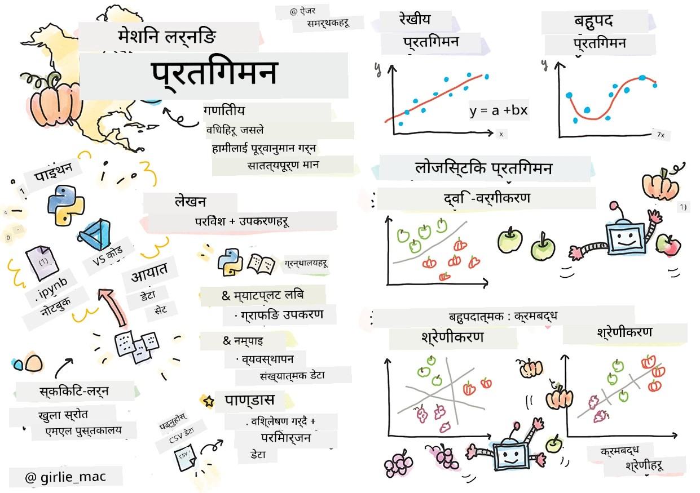
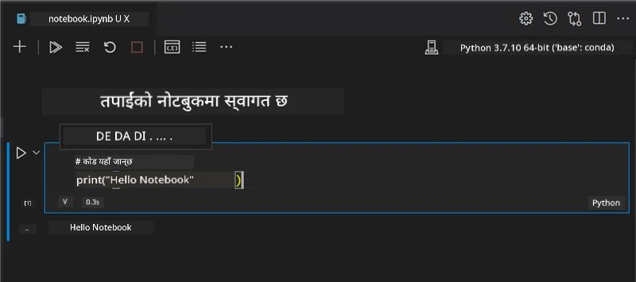
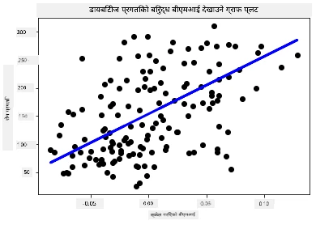

# रिग्रेसन मोडेलहरूका लागि पाइथन र स्कikit-लर्नसँग शुरू गर्नुहोस्



> स्केचनोट लेखक [Tomomi Imura](https://www.twitter.com/girlie_mac)

## [पूर्व-व्याख्यान क्विज](https://ff-quizzes.netlify.app/en/ml/)

> ### [यो पाठ R मा उपलब्ध छ!](../../../../2-Regression/1-Tools/solution/R/lesson_1.html)

## परिचय

यी चार पाठहरूमा, तपाईंले कसरी रिग्रेसन मोडेलहरू बनाउन सकिन्छ भन्ने पत्ता लगाउनुहुनेछ। हामी चाँडै यीको के लागि प्रयोग हुन्छ भन्ने कुरा छलफल गर्नेछौं। तर कुनै कुरा गर्नु अघि, प्रक्रिया सुरु गर्न सही उपकरणहरू हुनु आवश्यक छ!

यस पाठमा, तपाईंले सिक्नुहुनेछ:

- स्थानीय मेसिन लर्निङ कार्यहरूको लागि तपाईंको कम्प्युटर कन्फिगर गर्न।
- ज्युपिटर नोटबुकहरूसँग काम गर्न।
- स्कikit-लर्न प्रयोग गर्न, स्थापना सहित।
- हात-ऑन अभ्याससहित रेखीय रिग्रेसन अन्वेषण गर्न।

## स्थापना र कन्फिगरेसनहरू

[](https://youtu.be/-DfeD2k2Kj0 "शुरुआतीहरूका लागि ML - मेसिन लर्निङ मोडेलहरू बनाउनका लागि उपकरणहरू तयार पार्नुहोस्")

> 🎥 माथिको तस्बिरमा क्लिक गरेर मेसिन लर्निङको लागि तपाईंको कम्प्युटर कसरी कन्फिगर गर्ने भन्ने छोटो भिडियो हेर्नुहोस्।

1. **पाइथन स्थापना गर्नुहोस्**। सुनिश्चित गर्नुहोस् कि तपाईंको कम्प्युटरमा [Python](https://www.python.org/downloads/) स्थापना गरिएको छ। तपाईंले धेरै डेटा विज्ञान र मेसिन लर्निङ कार्यहरूका लागि पाइथन प्रयोग गर्नुहुनेछ। अधिकांश कम्प्युटर सिस्टममा पहिले नै पाइथन स्थापना हुन्छ। केही प्रयोगकर्ताका लागि सेटअप सजिलो बनाउन उपयोगी [Python Coding Packs](https://code.visualstudio.com/learn/educators/installers?WT.mc_id=academic-77952-leestott) पनि उपलब्ध छन्।

   यद्यपि केही पाइथन प्रयोगहरूले फरक संस्करणको आवश्यकता पर्न सक्छ। त्यसैले, [वर्चुअल वातावरण](https://docs.python.org/3/library/venv.html) भित्र काम गर्नु उपयोगी हुन्छ।

2. **भिजुअल स्टुडियो कोड स्थापना गर्नुहोस्**। सुनिश्चित गर्नुहोस् कि तपाईंको कम्प्युटरमा भिजुअल स्टुडियो कोड स्थापना गरिएको छ। सामान्य स्थापना गर्न यी निर्देशनहरू पछ्याउनुहोस्: [install Visual Studio Code](https://code.visualstudio.com/)। तपाईं यस कोर्समा भिजुअल स्टुडियो कोडमा पाइथन प्रयोग गर्न जाँदै हुनुहुन्छ, त्यसैले [Visual Studio Code कन्फिगर गर्न](https://docs.microsoft.com/learn/modules/python-install-vscode?WT.mc_id=academic-77952-leestott) यो अभ्यास गर्नुहोस्।

   > यो [स्किक modules](https://docs.microsoft.com/users/jenlooper-2911/collections/mp1pagggd5qrq7?WT.mc_id=academic-77952-leestott) को संग्रहमार्फत पाइथनसँग परिचित बन्नुहोस्।
   >
   > [](https://youtu.be/yyQM70vi7V8 "Visual Studio Code सँग पाइथन सेटअप गर्नुहोस्")
   >
   > 🎥 माथिको तस्बिरमा क्लिक गरेर उपयुक्त भिडियो हेर्नुहोस्: VS Code भित्र पाइथन प्रयोग गर्ने तरिका।

3. **स्कikit-लर्न स्थापना गर्नुहोस्**, यी निर्देशनहरू अनुसरण गरेर: [install instructions](https://scikit-learn.org/stable/install.html)। स्कikit-लर्न प्रयोग गर्न पाइथन 3 आवश्यक छ, त्यसैले वर्चुअल वातावरण प्रयोग गर्न सल्लाह दिइन्छ। यदि तपाईं M1 Mac मा यो पुस्तकालय स्थापना गर्दै हुनुहुन्छ भने, माथिको पृष्ठमा विशेष निर्देशनहरू छन्।

1. **ज्युपिटर नोटबुक स्थापना गर्नुहोस्**। तपाईंले [जुपिटर प्याकेज](https://pypi.org/project/jupyter/) स्थापना गर्नु आवश्यक छ।

## तपाईंको मेसिन लर्निङ लेखन वातावरण

तपाईंले आफ्नो पाइथन कोड विकास गर्न र मेसिन लर्निङ मोडेलहरू निर्माण गर्न **नोटबुकहरू** प्रयोग गर्नुहुनेछ। यस प्रकारको फाइल डेटा वैज्ञानिकहरूका लागि सामान्य उपकरण हो, र यसको पहिचान यसको suffix वा विस्तार `.ipynb` बाट हुन्छ।

नोटबुकहरू अन्तरक्रियात्मक वातावरण हुन् जसले विकासकर्ता कोड लेख्न र नोटहरू, डकुमेन्टेशन थप्न मद्दत गर्छ जुन प्रयोगात्मक वा अनुसन्धान सम्बन्धी परियोजनाहरूको लागि धेरै उपयोगी हुन्छ।

[](https://youtu.be/7E-jC8FLA2E "शुरुआतीहरूका लागि ML - रिग्रेसन मोडेलहरू बनाउन ज्युपिटर नोटबुकहरू सेटअप गर्नुहोस्")

> 🎥 माथिको तस्बिरमा क्लिक गरेर यो अभ्यासको छोटो भिडियो हेर्नुहोस्।

### अभ्यास - नोटबुकसँग काम गर्नुहोस्

यस फोल्डरमा, तपाईं _notebook.ipynb_ फाइल पाउनुहुनेछ।

1. Visual Studio Code मा _notebook.ipynb_ खोल्नुहोस्।

   एउटा ज्युपिटर सर्भर Python 3+ सँग सुरु हुनेछ। नोटबुकका केही भागहरू `run` गर्न मिल्छन्, अर्थात् कोडका टुक्राहरू। आपले प्ले बटन जस्तो देखिने आइकन चयन गरेर कोड ब्लक चलाउन सक्नुहुन्छ।

1. `md` आइकन चयन गरेर मार्कडाउन थप्नुहोस्, र तलको पाठ **# Welcome to your notebook** लेख्नुहोस्।

   त्यसपछि केही पाइथन कोड थप्नुहोस्।

1. कोड ब्लकमा **print('hello notebook')** टाइप गर्नुहोस्।
1. कोड चलाउन तीर आइकन चयन गर्नुहोस्।

   तपाईंले निम्न मुद्रित वाक्यांश देख्नु पर्नेछ:

    ```output
    hello notebook
    ```



तपाईं आफ्नो कोडसँग टिप्पणीहरू मिसाएर नोटबुकलाई स्वयं-डकुमेन्ट गर्न सक्नुहुन्छ।

✅ एक मिनेट सोच्नुहोस् कि वेब विकासकर्ताको कार्य वातावरण र डेटा वैज्ञानिकको कार्य वातावरण कत्तिको फरक हुन्छ।

## स्कikit-लर्नसँग सुरु हुँदै

अब पाइथन तपाईंको स्थानीय वातावरणमा सेटअप भइसकेको छ, र तपाईं ज्युपिटर नोटबुकसँग सहज हुनुहुन्छ, स्कikit-लर्नसँग पनि सहज हुन 시작 गरौं (`sci` लाई `science` जस्तै उच्चारण गर्नुहोस्)। स्कikit-लर्नले तपाईंलाई मेसिन लर्निङ कार्यहरू गर्न मद्दत पुर्‍याउने [विस्तृत API](https://scikit-learn.org/stable/modules/classes.html#api-ref) प्रदान गर्दछ।

तिनीहरूको [वेबसाइट](https://scikit-learn.org/stable/getting_started.html) अनुसार, "Scikit-learn खुला स्रोत मेसिन लर्निङ पुस्तकालय हो जुन सुपरभाइज्ड र अनसुपरभाइज्ड लर्निङलाई समर्थन गर्छ। यसले मोडेल फिटिंग, डेटा प्रिप्रसेसिङ, मोडेल चयन र मूल्यांकन, तथा अन्य धेरै उपयोगिताहरूका लागि विभिन्न उपकरणहरू पनि प्रदान गर्दछ।"

यस कोर्समा, तपाईंले स्कikit-लर्न र अन्य उपकरणहरू प्रयोग गरेर परम्परागत मेसिन लर्निङ कार्यहरू गर्ने मोडेलहरू निर्माण गर्नुहुनेछ। हामीले जानाजानी न्यूरल नेटवर्क र डीप लर्निङलाई समावेश गरेका छैनौं, ती हामीले आउने 'शुरुआतीहरूको लागि AI' पाठ्यक्रममा राम्रोसँग समेट्नेछौं।

स्कikit-लर्नले मोडेलहरू बनाउन र तिनीहरूको मूल्याङ्कन गर्न सजिलो बनाउँछ। यो मुख्यतया संख्यात्मक डेटा प्रयोग गर्नेमा केन्द्रित छ र सिकाइ उपकरणका रूपमा प्रयोग गर्न तयार धेरै पूर्वप्याक गरिएको डेटा सेटहरू पनि समावेश गर्दछ। यसमा विद्यार्थीहरूका लागि पूर्वनिर्मित मोडेलहरू पनि हुन्छन्। पहिले हामी पूर्वप्याक गरिएको डेटा लोड गर्ने र स्कikit-लर्नको बिल्ट-इन इस्टिमेटर प्रयोग गरेर पहिलो ML मोडेल बनाउने प्रक्रिया अन्वेषण गरौं।

## अभ्यास - तपाईंको पहिलो स्कikit-लर्न नोटबुक

> यो ट्यूटोरियल स्कikit-लर्नको वेबसाइटमा रहेको [रेखीय रिग्रेसन उदाहरण](https://scikit-learn.org/stable/auto_examples/linear_model/plot_ols.html#sphx-glr-auto-examples-linear-model-plot-ols-py)बाट प्रेरित छ।


[](https://youtu.be/2xkXL5EUpS0 "शुरुआतीहरूका लागि ML - पाइथनमा तपाईंको पहिलो रेखीय रिग्रेसन परियोजना")

> 🎥 माथिको तस्बिरमा क्लिक गरेर यो अभ्यासको छोटो भिडियो हेर्नुहोस्।

_notebook.ipynb_ फाइलमा, यस पाठसंग सम्बन्धित सबै सेलहरू खाली गर्न 'ट्र्यास क्यान' आइकन थिच्नुहोस्।

यस खण्डमा, तपाईंले डाइबिटीज सम्बन्धी सानो डेटासेट प्रयोग गर्नु हुनेछ जुन स्कikit-लर्नमा सिकाइको लागि बिल्ट-इन छ। कल्पना गर्नुहोस् तपाईंले डायबिटिक बिरामीहरूको उपचार परीक्षण गर्न चाहनुहुन्छ। मेसिन लर्निङ मोडेलहरूले ठम्याउन मद्दत गर्न सक्छन् कुन बिरामीले उपचार राम्रोसँग प्रतिक्रिया दिनेछन्, भेरिएबलहरूको संयोजनको आधारमा। धेरै आधारभूत रिग्रेसन मोडेलले पनि दृश्यात्मक रूपमा यस विषयमा जानकारी दिन सक्छ जुन तपाईंको सैद्धान्तिक क्लिनिकल ट्रायलहरूलाई व्यवस्थित गर्न मद्दत गर्नेछ।

✅ रिग्रेसन विधिहरू धेरै प्रकारका हुन्छन्, र कुन विधि छनोट गर्ने भन्ने कुरा तपाईंले खोजिरहेको उत्तरमा निर्भर गर्दछ। यदि तपाईंको लक्ष्य केहि उमेरका व्यक्तिको सम्भावित उचाइ भविष्यवाणी गर्नु हो भने, तपाईंले रेखीय रिग्रेसन प्रयोग गर्नुहुनेछ किनकि तपाईं **संख्यात्मक मान** खोज्दै हुनुहुन्छ। यदि तपाईंलाई थाहा पाउनुछ कि खाद्यप्रकार शाकाहारी हो वा होइन, तपाईं **श्रेणी निर्धारण** खोज्दै हुनुहुन्छ र त्यसका लागि लोगिस्टिक रिग्रेसन उपयुक्त हुन्छ। तपाईंले पछि लोगिस्टिक रिग्रेसन सिक्नु हुनेछ। केहि प्रश्नहरूको बारेमा सोच्नुहोस् जुन तपाईं डेटा बाट सोध्न सक्नुहुन्छ, र ती प्रश्नहरूको लागि कुन विधि उचित हुन्छ।

अब यो कार्य सुरु गरौं।

### पुस्तकालयहरू आयात गर्नुहोस्

यस कार्यका लागि हामी केही पुस्तकालयहरू आयात गर्नेछौं:

- **matplotlib**। यो एक उपयोगी [ग्राफिङ टूल](https://matplotlib.org/) हो र हामी यसलाई लाइन प्लट बनाउन प्रयोग गर्नेछौं।
- **numpy**। [numpy](https://numpy.org/doc/stable/user/whatisnumpy.html) पाइथनमा संख्यात्मक डेटा व्यवस्थापनका लागि उपयोगी लाइब्रेरी हो।
- **sklearn**। यो [स्कikit-लर्न](https://scikit-learn.org/stable/user_guide.html) लाइब्रेरी हो।

तपाईंका कार्यहरूमा सहयोग गर्न केही पुस्तकालयहरू आयात गर्नुहोस्।

1. तलको कोड टाइप गरेर आयातहरू थप्नुहोस्:

   ```python
   import matplotlib.pyplot as plt
   import numpy as np
   from sklearn import datasets, linear_model, model_selection
   ```

   माथि तपाईंले `matplotlib`, `numpy` आयात गर्दै हुनुहुन्छ र `sklearn` बाट `datasets`, `linear_model`, `model_selection` आयात गर्दै हुनुहुन्छ। `model_selection` डेटा प्रशिक्षण र परीक्षण सेटमा विभाजन गर्न प्रयोग हुन्छ।

### डायबिटीज डेटासेट

बिल्ट-इन [डायबिटीज डेटासेट](https://scikit-learn.org/stable/datasets/toy_dataset.html#diabetes-dataset)मा ४४२ नमुनाहरू छन्, जसमा १० विशेषताहरू समावेश छन्, जसमध्ये केही:

- उमेर: वर्षमा उमेर
- bmi: शरीरको मास सूचकांक
- bp: औसत रक्तचाप
- s1 tc: T-सेलहरू (सेतो रक्तकोषिका प्रकार)

✅ यस डेटासेटमा 'लिङ्ग' एक महत्वपूर्ण विशेषता भेरिएबलको रूपमा समावेश गरिएको छ जुन डायबिटीज अनुसन्धानमा महत्त्वपूर्ण छ। धेरै चिकित्सा डेटासेटहरूमा यस्ता द्विक वर्गीकरणहरू हुन्छन्। सोच्नुहोस् यस्ता वर्गीकरणहरूले जनसंख्याबाट कतिपय भागहरू उपचारबाट बाहिर पार्न सक्छन्।

अब, X र y डेटा लोड गर्नुहोस्।

> 🎓 याद गर्नुहोस्, यो सुपरभाइज्ड लर्निङ हो र हामीलाई 'y' नामक लक्ष्य चाहिन्छ।

नयाँ कोड सेलमा, `load_diabetes()` कल गरेर डायबिटीज डेटासेट लोड गर्नुहोस्। `return_X_y=True` इनपुटले संकेत गर्छ कि `X` डेटा म्याट्रिक्स हुनेछ र `y` रिग्रेसन लक्ष्य हुनेछ।

1. डेटा म्याट्रिक्सको आकार र यसको पहिलो तत्त्वलाई देखाउन प्रिन्ट कमाण्डहरू थप्नुहोस्:

    ```python
    X, y = datasets.load_diabetes(return_X_y=True)
    print(X.shape)
    print(X[0])
    ```

    तपाईंले प्रतिक्रिया स्वरूप ट्युपल पाउनुहुनेछ। तपाईंले सो ट्युपलका पहिलो दुई मानहरू क्रमश: `X` र `y` मा असाइन गर्दै हुनुहुन्छ। [ट्युपलहरूको बारेमा थप जान्नुहोस्](https://wikipedia.org/wiki/Tuple)।

    यस डेटामा ४४२ वस्तुहरू छन् जुन १० तत्त्वहरू भएको एर्रेमा आकारमा छन्:

    ```text
    (442, 10)
    [ 0.03807591  0.05068012  0.06169621  0.02187235 -0.0442235  -0.03482076
    -0.04340085 -0.00259226  0.01990842 -0.01764613]
    ```

    ✅ डेटाको रिग्रेसन लक्ष्य बिचको सम्बन्धबारे सोच्नुहोस्। रेखीय रिग्रेसनले विशेषता X र लक्ष्य भेरिएबल y बिचको सम्बन्धहरू भविष्यवाणी गर्छ। के तपाईं [टार्गेट](https://scikit-learn.org/stable/datasets/toy_dataset.html#diabetes-dataset) डायबिटीज डेटासेटको दस्तावेजमा फेला पार्न सक्नुहुन्छ? यो डेटासेटले उक्त लक्ष्यसँग के देखाउँदैछ?

2. अब डेटासेटको एउटा भाग चयन गरेर प्लट गर्न ३rd स्तम्भ चयन गर्नुहोस्। यो गर्न सबै पङ्क्तिहरू `:` प्रयोग गरी छान्न सकिन्छ, र ३rd स्तम्भ इन्डेक्स (2) द्वारा चयन गर्न सकिन्छ। प्लटिङको लागि डेटा २D एर्रेमा `reshape(n_rows, n_columns)` प्रयोग गरी परिवर्तन गर्न सकिन्छ। यदि कुनै एक पैरामीटर -1 हो भने, त्यो आयाम स्वत: गणना हुन्छ।

   ```python
   X = X[:, 2]
   X = X.reshape((-1,1))
   ```

   ✅ जुनसुकै समयमा डेटा प्रिन्ट गरेर यसको आकार जाँच्नुहोस्।

3. अब तपाईंसँग प्लट गर्न डेटा तयार भएपछि, मेशिनलाई यो डेटासेटका संख्या बीच तार्किक विभाजन निर्धारण गर्न मद्दत गर्ने देख्नुहोस्। यसको लागि, तपाईंलाई डेटा (X) र लक्ष्य (y) दुवैलाई परीक्षण र प्रशिक्षण सेटहरूमा विभाजन गर्न आवश्यक छ। स्कikit-लर्नले यो सजिलै गर्ने तरिका छ; तपाईंले परीक्षण डेटा कुनै निश्चित स्थानमा विभाजन गर्न सक्नुहुन्छ।

   ```python
   X_train, X_test, y_train, y_test = model_selection.train_test_split(X, y, test_size=0.33)
   ```

4. अब तपाईंको मोडेल प्रशिक्षणका लागि तयार हुनुहोस्! रेखीय रिग्रेसन मोडेल लोड गर्नुहोस् र आफ्नो X र y प्रशिक्षण सेटहरू प्रयोग गरी `model.fit()` प्रयोग गरेर प्रशिक्षण गर्नुहोस्:

    ```python
    model = linear_model.LinearRegression()
    model.fit(X_train, y_train)
    ```

    ✅ `model.fit()` एउटा यस्तो फङ्क्शन हो जुन तपाईं धेरै ML लाइब्रेरीहरूमा जस्तै TensorFlow मा पनि देख्नुहुनेछ।

5. त्यसपछि, परीक्षण डेटा प्रयोग गरेर भविष्यवाणी बनाउन `predict()` फङ्क्शन प्रयोग गर्नुहोस्। यसले मोडेलको डेटा समूहहरू बिच लाइन तान्न प्रयोग हुनेछ।

    ```python
    y_pred = model.predict(X_test)
    ```

6. अब डेटा प्लटमा देखाउन समय भयो। matplotlib यो कार्यका लागि धेरै उपयोगी उपकरण हो। सबै X र y परीक्षण डेटा स्क्याटरप्लट बनाएर, मोडेलका डेटा समूहहरू बिच सबैभन्दा उपयुक्त ठाउँमा भविष्यवाणीले अन्तरगत लाइन खिच्नुहोस्।

    ```python
    plt.scatter(X_test, y_test,  color='black')
    plt.plot(X_test, y_pred, color='blue', linewidth=3)
    plt.xlabel('Scaled BMIs')
    plt.ylabel('Disease Progression')
    plt.title('A Graph Plot Showing Diabetes Progression Against BMI')
    plt.show()
    ```

   


   ✅ यहाँ के हुँदैछ भनेर अलिकति सोच्नुहोस्। सिधा रेखा धेरै साना डाटा पोइन्टहरूको माथि जान्छ, तर यो ठीक के गर्दैछ? तपाईले देख्न सक्नुहुन्छ कि यो रेखा प्रयोग गरेर नयाँ, नदेखिएको डाटा पोइन्ट प्लटको y अक्षसँग कसरी सम्बन्धित हुनुपर्छ भनेर पूर्वानुमान गर्न सकिन्छ? यस मोडेलको व्यावहारिक उपयोगलाई शब्दहरूमा व्यक्त गर्न प्रयास गर्नुहोस्।

बधाई छ, तपाइँले आफ्नो पहिलो रेखीय प्रतिस्थापन मोडेल बनाउनु भयो, यससँग पूर्वानुमान गर्नुभयो, र प्लटमा प्रदर्शन गर्नुभयो!

---
## 🚀चुनौती

यो डेटासेटबाट फरक चल (variable) प्लट गर्नुहोस्। संकेत: यो लाइन सम्पादन गर्नुहोस्: `X = X[:,2]`। यस डेटासेटको लक्ष्यको आधारमा, तपाई मधुमेह रोगको प्रगतिको बारेमा के पत्ता लगाउन सक्नुहुन्छ?
## [पाठपश्चात क्विज](https://ff-quizzes.netlify.app/en/ml/)

## समीक्षा र आत्म-अध्ययन

यस ट्युटोरियलमा, तपाईले सरल रेखीय प्रतिस्थापनसँग काम गर्नुभयो, बहुविमीय वा बहुविध रेखीय प्रतिस्थापनमध्ये होइन। यी विधिहरूबीचको भिन्नता बारे अलिकति पढ्नुहोस्, वा यो [भिडियो](https://www.coursera.org/lecture/quantifying-relationships-regression-models/linear-vs-nonlinear-categorical-variables-ai2Ef) हेर्नुहोस्।

प्रतिस्थापनको अवधारणा बारे थप पढ्नुहोस् र सोच्नुहोस् कि यस प्रविधिले कस्ता प्रकारका प्रश्नहरूको उत्तर दिन सक्छ। आफ्नो बुझाइ गाढा बनाउन यो [ट्युटोरियल](https://docs.microsoft.com/learn/modules/train-evaluate-regression-models?WT.mc_id=academic-77952-leestott) लिनुहोस्।

## असाइन्मेन्ट

[फरक डेटासेट](assignment.md)

---

<!-- CO-OP TRANSLATOR DISCLAIMER START -->
**अस्वीकरण**:
यो दस्तावेज़ AI अनुवाद सेवा [Co-op Translator](https://github.com/Azure/co-op-translator) प्रयोग गरेर अनुवाद गरिएको हो। हामी सही हुन प्रयास गर्छौं, तर कृपया जानकार हुनुस् कि स्वचालित अनुवादमा त्रुटिहरू वा अशुद्धताहरू हुन सक्छन्। मूल दस्तावेज़ यसको मूल भाषामा आधिकारिक स्रोत मानिनुपर्छ। महत्वपूर्ण जानकारीका लागि व्यावसायिक मानव अनुवाद सिफारिस गरिन्छ। यस अनुवादको प्रयोगबाट उत्पन्न कुनै पनि गलत बुझाइ वा त्रुटिको लागि हामी जिम्मेवार छैनौं।
<!-- CO-OP TRANSLATOR DISCLAIMER END -->