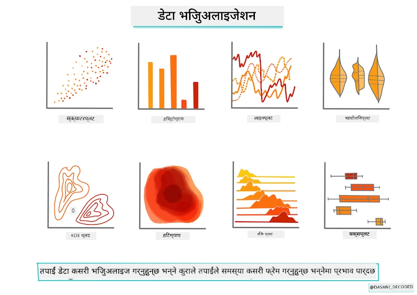
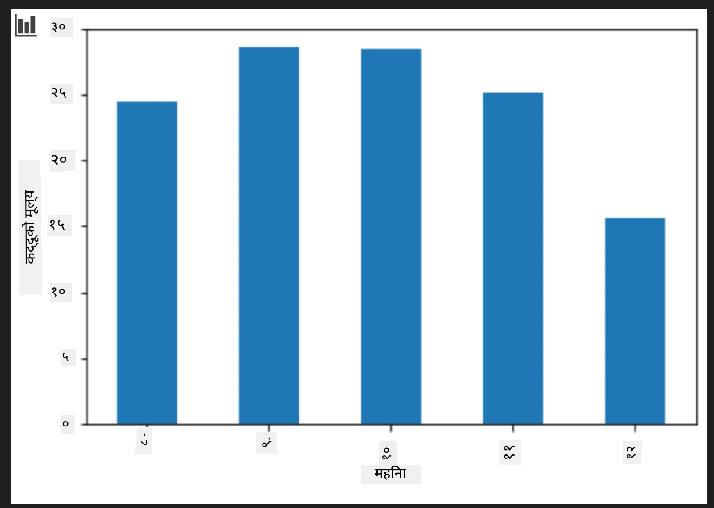
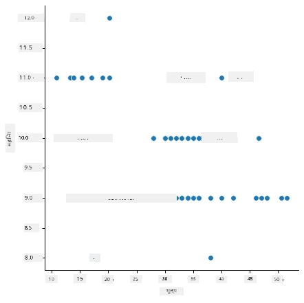
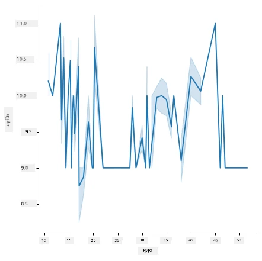
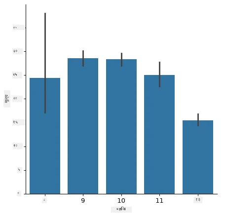
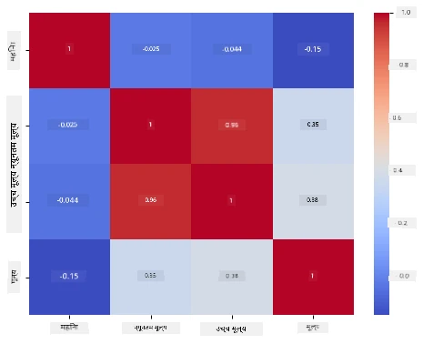

# Scikit-learn प्रयोग गरेर एउटा regression मोडेल बनाउने: डाटा तयार पार्नुहोस् र दृश्य बनाउनुहोस्



इन्फोग्राफिक द्वारा [दासानी मडिपल्ली](https://twitter.com/dasani_decoded)

## [पूर्व-व्याख्यान क्विज](https://ff-quizzes.netlify.app/en/ml/)

> ### [यो पाठ R मा उपलब्ध छ!](../../../../2-Regression/2-Data/solution/R/lesson_2.html)

## परिचय

अब जब तपाईं Scikit-learn सँग मेसिन लर्निङ मोडेल बनाउने उपकरणहरू तयार पारिसक्नुभयो, तपाईं आफ्नो डाटाबाट प्रश्न सोध्न तयार हुनुहुन्छ। डाटासँग काम गर्दा र ML समाधानहरू लागू गर्दा, आफ्नो डेटासेटको सम्भावनाहरू सही तरिकाले अनलक गर्नका लागि सही प्रश्न कसरी सोध्ने भन्ने कुरा बुझ्नु अत्यन्त महत्वपूर्ण छ।

यस पाठमा, तपाईंले सिक्नु हुने छ:

- मोडेल निर्माणको लागि आफ्नो डाटा कसरी तयार गर्ने।
- डाटा दृश्याङ्कनका लागि Matplotlib कसरी प्रयोग गर्ने।
- बढी ब्यक्तिगत डाटा दृश्याङ्कनका लागि Seaborn कसरी प्रयोग गर्ने।

## आफ्नो डाटा को सही प्रश्न सोध्नुहोस्

तपाईँले जवाफ पाउन चाहनुभएको प्रश्नले तपाईँले कुन प्रकारको ML एल्गोरिदम प्रयोग गर्ने निर्धारण गर्नेछ। र तपाईँले फिर्ता पाएको जवाफको गुणस्तर तपाईँको डाटाको प्रकृतिमा धेरै निर्भर हुनेछ।

यस पाठको लागि प्रदान गरिएको [डाटा](https://github.com/microsoft/ML-For-Beginners/blob/main/2-Regression/data/US-pumpkins.csv) हेर्नुहोस्। तपाईं यो .csv फाइल VS Code मा खोल्न सक्नुहुन्छ। एक छिटो अवलोकनले देखाउँछ कि त्यहाँ रिक्त स्थानहरू र स्ट्रिङ र संख्यात्मक डाटाको मिश्रण छ। त्यहाँ 'Package' नामक अजीब स्तम्भ पनि छ जहाँ डाटा 'sacks', 'bins' र अन्य मानहरू बीच मिश्रित छ। वास्तवमा, डाटा अलिकति अराजक छ।

[](https://youtu.be/5qGjczWTrDQ "ML for beginners - How to Analyze and Clean a Dataset")

> 🎥 यस पाठको लागि डाटा तयार गर्ने काम गरी रहेको छोटो भिडियो हेर्न माथिको तस्वीरमा क्लिक गर्नुहोस्।

वास्तवमा, पूर्ण रूपमा प्रयोग गर्न तयार गरिएका डेटासेट कडाइले पाउनु सामान्य कुरा होइन। यस पाठमा, तपाईं सामान्य Python लाइब्रेरीहरू प्रयोग गरेर कच्चा डेटासेट कसरी तयार गर्ने सिक्ने हुनुहुन्छ। तपाईंले डाटा दृश्याङ्कनका विभिन्न प्रविधिहरू पनि सिक्नुहुनेछ।

## केस अध्ययन: 'कद्दु बजार'

यस फोल्डरमा तपाईँले `data` रुट फोल्डरमा रहेको [US-pumpkins.csv](https://github.com/microsoft/ML-For-Beginners/blob/main/2-Regression/data/US-pumpkins.csv) नामको .csv फाइल फेला पार्नेछ जुन कद्दुहरूको बजारका बारेमा शहर अनुसार वर्गीकृत गरी १७५७ पङ्क्तिहरू समावेश गर्दछ। यो कच्चा डाटा संयुक्त राज्य कृषि विभागबाट वितरण गरिएको [Specialty Crops Terminal Markets Standard Reports](https://www.marketnews.usda.gov/mnp/fv-report-config-step1?type=termPrice) बाट निकालेको हो।

### डाटा तयार पार्दै

यो डाटा सार्वजनिक डोमेनमा छ। यसलाई USDA वेबसाइटबाट प्रत्येक शहरका लागि धेरै अलग फाइलहरूमा डाउनलोड गर्न सकिन्छ। धेरै अलग फाइलहरूबाट बच्न हामीले सबै शहरको डेटा एक स्प्रेडशीटमा समेटेका छौं, त्यसैले डाटा पहिले नै अलिकति _तयार_ गरिएको छ। अब डाटा नजिकबाट हेर्नेछौं।

### कद्दु डाटा - प्रारम्भिक निष्कर्षहरू

यस डाटामा तपाईंले के देख्नुभयो? तपाईंले पहिले नै देख्नुभएको छ कि त्यहाँ स्ट्रिङहरू, अंकहरू, रिक्त स्थानहरू र अर्थ लगाउनुपर्ने अजीब मानहरू मिश्रित छन्।

Regression प्रविधि प्रयोग गरेर यो डाटाबाट कुन प्रश्न सोध्न सकिन्छ? "दिइएको महिनामा बिक्रीको लागि कद्दुको मूल्य भविष्यवाणी गर्नुहोस्" कस्तो हुन्छ? डाटामा फेरि हेर्दा, कार्यका लागि आवश्यक डाटा संरचना बनाउन केही परिवर्तनहरू गर्नुपर्ने छ।
## अभ्यास - कद्दु डाटा विश्लेषण गर्नुहोस्

हामी [Pandas](https://pandas.pydata.org/) (नाम `Python Data Analysis` को लागि हो) प्रयोग गर्नेछौं, जुन डेटा आकार दिने काममा धेरै उपयोगी उपकरण हो, यस कद्दु डाटालाई विश्लेषण र तयारी गर्नका लागि।

### पहिले, हराएका मिति जाँच गर्नुहोस्

तपाईंले पहिले हराएका मिति जाँच्न कदमहरू लिनु आवश्यक हुनेछ:

१. मितिहरूलाई महिना फाराम्याटमा रूपान्तरण गर्नुहोस् (यी अमेरिकी मितिहरू हुन्, त्यसैले फारम्याट `MM/DD/YYYY` हो)।
२. नयाँ स्तम्भमा महिना निकाल्नुहोस्।

Visual Studio Code मा _notebook.ipynb_ फाइल खोल्नुहोस् र स्प्रेडशीट नयाँ Pandas डाटा फ्रेममा आयात गर्नुहोस्।

१. पहिलो पाँच पङ्क्तिहरू हेर्न `head()` फङ्सन प्रयोग गर्नुहोस्।

    ```python
    import pandas as pd
    pumpkins = pd.read_csv('../data/US-pumpkins.csv')
    pumpkins.head()
    ```

    ✅ पछिल्ला पाँच पङ्क्तिहरू हेर्न कुन फङ्सन प्रयोग गर्नुहुन्छ?

१. हालको डाटा फ्रेममा कुनै हराएको डेटा छ कि छैन जाँच गर्नुहोस्:

    ```python
    pumpkins.isnull().sum()
    ```

    केही डेटा हराएको छ, तर सायद यो यहाँको कार्यका लागि मतलब राख्दैन।

१. तपाईँको डाटा फ्रेमसँग काम गर्न सजिलो बनाउनका लागि आवश्यक स्तम्भ मात्र चयन गर्नुहोस्, `loc` फङ्सन प्रयोग गरेर जसले मूल डाटा फ्रेमबाट पङ्क्तिहरू (पहिलो प्यारामिटर) र स्तम्भहरू (दोस्रो प्यारामिटर) निकाल्छ। तलको अभिव्यक्तिमा `:` को अर्थ "सबै पङ्क्तिहरू" हो।

    ```python
    columns_to_select = ['Package', 'Low Price', 'High Price', 'Date']
    pumpkins = pumpkins.loc[:, columns_to_select]
    ```

### दोस्रो, कद्दुको औसत मूल्य निर्धारण गर्नुहोस्

दिइएको महिनामा कद्दुको औसत मूल्य कसरी निर्धारण गर्ने बारे सोच्नुहोस्। कुन स्तम्भहरू तपाईंले कार्यका लागि छनौट गर्नुहुन्छ? संकेत: तपाईंलाई ३ स्तम्भहरू चाहिन्छ।

समाधान: `Low Price` र `High Price` स्तम्भहरूको औसत लिएर नयाँ मूल्य स्तम्भ भर्नुहोस्, र मिति स्तम्भलाई केवल महिना देखाउने गरी रूपान्तरण गर्नुहोस्। सौभाग्यवश, माथिको जाँच अनुसार, मिति वा मूल्यहरूको लागि कुनै हराएको डेटा छैन।

१. औसत गणना गर्न निम्न कोड थप्नुहोस्:

    ```python
    price = (pumpkins['Low Price'] + pumpkins['High Price']) / 2

    month = pd.DatetimeIndex(pumpkins['Date']).month

    ```

   ✅ तपाईँ आफूले जाँच गर्न चाहनुभएको कुनैपनि डाटा `print(month)` प्रयोग गरेर प्रिन्ट गर्न सक्नुहुन्छ।

२. अब, आफ्नो रूपान्तरित डाटा नयाँ Pandas डाटा फ्रेममा कपी गर्नुहोस्:

    ```python
    new_pumpkins = pd.DataFrame({'Month': month, 'Package': pumpkins['Package'], 'Low Price': pumpkins['Low Price'],'High Price': pumpkins['High Price'], 'Price': price})
    ```

    आफ्नो डाटा फ्रेम प्रिन्ट गर्दा तपाईंलाई सफा, व्यवस्थित डाटासेट देखिनेछ जसमा नयाँ regression मोडेल बनाउन सकिन्छ।

### तर पर्खनुहोस्! यहाँ केही अजीब छ

यदि तपाईंले `Package` स्तम्भ हेर्नुभयो भने, कद्दुहरू धेरै विभिन्न तरिकाले बेचिन्छन्। केही '1 1/9 bushel' मापनमा, केही '1/2 bushel' मापनमा, केही प्रति कद्दु, केही प्रति पाउण्ड, र केही फरक फरक चौडाइ भएका ठूलो बक्समा बेचिन्छन्।

> कद्दुहरूलाई स्थिर रूपमा तौल्न निकै गाह्रो देखिन्छ

मूल डेटामा हेर्दा, `Unit of Sale` 'EACH' वा 'PER BIN' बराबर भएका datाहरूमा `Package` प्रकार इन्च अनुसार, बिन अनुसार, वा 'each' रहेको देखिन्छ। कद्दुहरूलाई स्थिर रूपमा तौल्न निकै गाह्रो हुन्छ, त्यसैले हामी 'bushel' स्ट्रिङ भएका कद्दुहरू मात्र चयन गरेर फिल्टर गर्नेछौं।

१. फाइलको सुरूमा, प्रारम्भिक .csv आयात अन्तर्गत फिल्टर थप्नुहोस्:

    ```python
    pumpkins = pumpkins[pumpkins['Package'].str.contains('bushel', case=True, regex=True)]
    ```

    यदि तपाईं अहिले डाटा प्रिन्ट गर्नु हुन्छ भने, तपाईंले केवल बसल अनुसारका ४१५ भन्दा बढि पङ्क्तिहरू देख्नुहुनेछ।

### तर पर्खनुहोस्! अर्को केहि गर्ने छ

के तपाईंले नोट गर्नुभयो कि बसल मात्र पङ्क्तिअनुसार फरक हुन्छ? मूल्य निर्धारणलाई सामान्य बनाउनु आवश्यक छ ताकि तपाईं बसल प्रति मूल्य देखाउन सक्नुहोस्, त्यसैले केही गणना गरी मानकीकरण गर्नुहोस्।

१. नयाँ_pumpkins डाटा फ्रेम सिर्जना गर्ने ब्लक पछि यी पङ्क्तिहरू थप्नुहोस्:

    ```python
    new_pumpkins.loc[new_pumpkins['Package'].str.contains('1 1/9'), 'Price'] = price/(1 + 1/9)

    new_pumpkins.loc[new_pumpkins['Package'].str.contains('1/2'), 'Price'] = price/(1/2)
    ```

✅ [The Spruce Eats](https://www.thespruceeats.com/how-much-is-a-bushel-1389308) अनुसार, बसलको तौल उत्पादनको प्रकारमा निर्भर हुन्छ, किनकि यो मात्रा मापन हो। "उदाहरणका लागि टमाटरको बसल supposed to weigh 56 pounds... पातहरू र हरियो पातले कम तौलमा अधिक ठाउँ ओगट्छन्, त्यसैले स्पिन्याचको बसल मात्र 20 पाउण्ड हुन्छ।" यो सबै अलि जटिल छ! बसल देखि पाउण्ड रूपान्तरण नगरी बसल अनुसार मूल्य निर्धारण गर्न छोडौं। यस कद्दु बसलहरूको अध्ययनले तपाईंको डाटाको प्रकृति बुझ्न कत्तिको महत्त्वपूर्ण छ भन्ने देखाउँछ!

अब तपाईं बसल मापनको आधारमा मूल्य निर्धारण विश्लेषण गर्न सक्नुहुन्छ। यदि तपाईं डाटा फेरि प्रिन्ट गर्नुहुन्छ, तपाईंले कसरि यो मानकीकृत भएको देख्न सक्नुहुन्छ।

✅ के तपाईंले नोट गर्नुभयो कि आधा बसलमा बेचिएका कद्दुहरू धेरै महँगो छन्? के तपाईं कारण थाहा पाउन सक्नुहुन्छ? संकेत: सानो कद्दुहरू ठूलो भन्दा धेरै महँगो हुन सक्छ, सम्भवतः किनभने ठूलो खाली पाई कद्दुले एक बसलमा धेरै कम संख्यामा कद्दुहरू समेट्छ, सानो धेरै हुन्छ।

## दृश्यांकन रणनीतिहरू

डाटा वैज्ञानिकको भूमिकाको एक भाग भनेको उनीहरूले काम गरिरहेका डाटाको गुणस्तर र प्रकृति प्रदर्शन गर्नु हो। यसका लागि, उनीहरूले प्रायः रोचक दृश्यांकनहरू, वा प्लट, ग्राफ, र चार्टहरू सिर्जना गर्छन्, जसले डाटाका विभिन्न पक्षहरू देखाउँछन्। यस तरिकाले, उनीहरूले दृश्यरूपमा सम्बन्धहरू र खाली ठाउँहरू देखाउन सक्षम हुन्छन् जुन अन्यथा भेट्न गाह्रो हुन्छ।

[](https://youtu.be/SbUkxH6IJo0 "ML for beginners - How to Visualize Data with Matplotlib")

> 🎥 यस पाठको लागि डाटा दृश्याङ्कन गर्दै गरेको छोटो भिडियो हेर्न माथिको तस्वीरमा क्लिक गर्नुहोस्।

दृश्यांकनहरूले कुन मेसिन लर्निङ प्रविधि डाटाको लागि सबैभन्दा उपयुक्त छ निर्धारण गर्नमा मद्दत गर्न सक्छ। उदाहरणका लागि, कुनै स्क्याटरप्लटले लाइनको अनुसरण गर्दै देखियो भने, यो संकेत हो कि डाटा रेखीय regression अभ्यासको लागि राम्रो उम्मेदवार हुन सक्छ।

Jupyter नोटबुकहरूमा राम्रोसँग काम गर्ने एउटा डाटा दृश्यांकन पुस्तकालय [Matplotlib](https://matplotlib.org/) हो (जुन तपाईंले अघिल्लो पाठमा पनि देख्नुभयो)।

> डाटा दृश्याङ्कनमा अझ अनुभव पाउन [यी ट्यूटोरियलहरू](https://docs.microsoft.com/learn/modules/explore-analyze-data-with-python?WT.mc_id=academic-77952-leestott) हेर्नुहोस्।

## अभ्यास - Matplotlib सँग प्रयोग गर्नुहोस्

तपाईंले हालै सिर्जना गरेको नयाँ डाटा फ्रेम प्रदर्शन गर्न केहि आधारभूत प्लटहरू बनाउन प्रयास गर्नुहोस्। आधारभूत लाइन प्लटले के देखाउनेछ?

१. फाइलको माथि, Pandas आयात मुनि Matplotlib आयात गर्नुहोस्:

    ```python
    import matplotlib.pyplot as plt
    ```

१. सम्पूर्ण नोटबुक फेरि चलाउनुहोस्।
१. नोटबुकको तल, डाटालाई बक्सको रूपमा प्लट गर्ने एउटा सेल थप्नुहोस्:

    ```python
    price = new_pumpkins.Price
    month = new_pumpkins.Month
    plt.scatter(price, month)
    plt.show()
    ```

    

    के यो उपयोगी प्लट हो? के यसमा केही तपाईंलाई अचम्म लाग्यो?

    यो त्यति उपयोगी छैन किनकि यसले तपाईंको डाटालाई दिइएको महिनामा पोइन्टहरूको फैलावटमा मात्र देखाउँछ।

### यसलाई उपयोगी बनाउनुहोस्

चार्टहरूलाई उपयोगी डाटा देखाउन, तपाईं प्रायः डाटालाई कसैले सँगठित गर्नुपर्छ। हामी यस्तो प्लट बनाउन प्रयास गरौं जहाँ y अक्षहरू महिना देखाउँछन् र डाटाले डाटा वितरण प्रदर्शन गर्दछ।

१. समूहित बार चार्ट बनाउन एउटा सेल थप्नुहोस्:

    ```python
    new_pumpkins.groupby(['Month'])['Price'].mean().plot(kind='bar')
    plt.ylabel("Pumpkin Price")
    ```

    

    यो बढी उपयोगी डाटा दृश्याङ्कन हो! यसले देखाउँछ कि कद्दुहरूको सबैभन्दा उच्च मूल्य सेप्टेम्बर र अक्टोबरमा हुन्छ। के यो तपाईंको अपेक्षामा मिल्छ? किन वा किन होइन?

## अभ्यास - Seaborn सँग प्रयोग गर्नुहोस्

Matplotlib शक्तिशाली छ, तर परिष्कृत चार्ट बनाउन धेरै कोड चाहिन्छ। [Seaborn](https://seaborn.pydata.org/) Matplotlib माथि बनेको लाइब्रेरी हो जुन सांख्यिकीय डाटा दृश्याङ्कनको लागि डिज़ाइन गरिएको हो। यसले Pandas डाटा फ्रेमसँग सिधै काम गर्छ, आकर्षक डिफल्ट शैलीहरू लागू गर्छ, र कम कोडमा सूचनात्मक प्लटहरू सिर्जना गर्न अनुमति दिन्छ। Seaborn ले Matplotlib वस्तुहरू फर्काउने भएकाले, तपाईंले पहिले सिकेका सबै Matplotlib उपकरणहरू नतिजा परिमार्जन गर्न सक्नुहुन्छ।

> यदि तपाईंले Seaborn इन्स्टल गर्नुभएको छैन भने, `pip install seaborn` संग इन्स्टल गर्नुहोस्।

१. नोटबुकको माथि, अन्य आयातहरू मुनि Seaborn आयात गर्नुहोस्। यसलाई सामान्यतः `sns` को रुपमा आयात गरिन्छ:

    ```python
    import seaborn as sns
    ```

### सम्बन्धहरू देखाउन स्क्याटर प्लटहरू

मोडेल निर्माण अघि डेटा अन्वेषणको ठूलो भाग _सम्बन्धहरू_ खोज्नु हो। [स्क्याटर प्लट](https://en.wikipedia.org/wiki/Scatter_plot) यसका लागि उत्तम उपकरणहरूमध्ये एक हो: यदि पोइन्टहरूले लाइन पछ्याउँदै देखिए भने, दुई भेरिएबलहरू सम्वन्धित हुन सक्छन्, जसले रेखीय regression मोडेल सम्भव बनाउँछ।

१. पहिले जस्तै मूल्य-देखि-महिना स्क्याटर प्लट पुनः सिर्जना गर्नुहोस्, यसपटक Seaborn को [`relplot()`](https://seaborn.pydata.org/generated/seaborn.relplot.html) (संबंधित प्लट) प्रयोग गरेर जुन तपाईंको डाटा फ्रेम स्तम्भहरूसँग सिधै काम गर्छ:

    ```python
    sns.relplot(x="Price", y="Month", data=new_pumpkins)
    ```

    

    देख्नुहोस् कसरी तपाईंले _स्तम्भ नामहरू_ र डाटा फ्रेम पास गर्नुहुन्छ, र Seaborn ले अक्ष लेबलहरू आफैं नियन्त्रित गर्छ।

२. `kind="line"` पास गरेर लाइन प्लटमा पनि स्विच गर्न सक्नुहुन्छ। Seaborn ले लाइन वरिपरि विश्वास अन्तराल देखाउन छायांकन पनि बनाउँछ:

    ```python
    sns.relplot(x="Price", y="Month", kind="line", data=new_pumpkins)
    ```

    

    यो विशेष डाटा धेरै आवाजयुक्त छ, त्यसैले लाइन प्लट सबभन्दा स्पष्ट विकल्प होइन — तर यसले देखाउँछ कि Seaborn मा चार्ट प्रकारहरू सजिलै परिवर्तन गर्न सकिन्छ।

### वितरण देखाउन बार चार्टहरू


पहिले तपाईंले म्यानुअली डाटा समूह बनाउनु भएको थियो Matplotlib को साथ बार चार्ट बनाउन। Seaborn को [`catplot()`](https://seaborn.pydata.org/generated/seaborn.catplot.html) (श्रेणीगत प्लट) तपाईंको लागि समूह बनाउने र संग्रह गर्ने काम गर्न सक्छ। पूर्वनिर्धारित रूपमा `kind="bar"` प्रत्येक श्रेणीको औसत देखाउँछ साथै विश्वास अन्तराल संकेत गर्ने कालो रेखा देखाउँछ।

1. एक महिनाको औसत मूल्यको बार चार्ट बनाउनुहोस्:

    ```python
    sns.catplot(x="Month", y="Price", data=new_pumpkins, kind="bar")
    ```

    

    यसले Matplotlib सँग तपाईंले देख्नुभएको कुरा पुष्टि गर्छ — मूल्यहरू सेप्टेम्बर र अक्टोबरमा उच्च हुन्छन् — तर Seaborn ले प्रत्येक महिनाभित्र मूल्य कति _भिन्न_ हुन्छ भन्ने पनि देखाउँछ।

### सहसम्बन्धहरू देखाउनका लागि हीटम्यापहरू

स्क्याटर प्लटहरूले एक पटकमा दुई भेरिएबलहरूको तुलना गर्छ। जब तपाईंसँग धेरै संख्यात्मक स्तम्भहरू हुन्छन्, तब [हीटम्याप](https://en.wikipedia.org/wiki/Heat_map) ले तपाइँलाई एकैचोटी हरेक स्तम्भ जोडिएको सम्बन्धको शक्ति हेर्न अनुमति दिन्छ। यो मोडेलमा के खुवाउने चुनौति गर्नु अघि सबैभन्दा बढी सहसम्बन्ध भएका विशेषताहरू पत्ता लगाउने सामान्य तरिका हो (र यसै किसिमको चार्ट पछि वर्गीकरणमा भ्रम म्याट्रिक्स देखाउन प्रयोग गरिन्छ)।

1. Pandas को साथ सहसम्बन्ध म्याट्रिक्स बनाउनुहोस्, त्यसपछि Seaborn को [`heatmap()`](https://seaborn.pydata.org/generated/seaborn.heatmap.html) प्रयोग गरी यस्तो बनाउनुहोस्। `annot=True` विकल्पले प्रत्येक सेलमा सहसम्बन्ध मानहरू प्रिन्ट गर्छ:

    ```python
    correlations = new_pumpkins[['Month', 'Low Price', 'High Price', 'Price']].corr()
    sns.heatmap(correlations, annot=True, cmap="coolwarm")
    ```

    

    `1` (वा `-1`) नजिकका मूल्यहरूले स्तम्भहरूलाई बलियो _रेखीय_ रूपमा सहसम्बन्धित जनाउँछ। ध्यान दिनुहोस् कि `Low Price` र `High Price` लगभग पूर्ण रूपमा सहसम्बन्धित छन्। अर्कोतर्फ `Month` ले मूल्यसँग केवल कमजोर रेखीय सहसम्बन्ध देखाउँछ — यद्यपि माथिको बार चार्टले सेप्टेम्बर र अक्टोबरमा स्पष्ट मौसमी शिखर देखाएको छ। यो एक महत्त्वपूर्ण पाठ हो: सहसम्बन्ध गुणांकले केवल _सिधा रेखा_ सम्बन्ध मात्र मापन गर्दछ, त्यसैले यसले मौसमी वा अन्य गैर-रेखीय ढाँचाहरू छुटाउन सक्छ। ✅ किन त्यो उपयोगी हुन्छ कि तपाईंले प्रयोग गर्न कुन स्तम्भहरू छान्नु भन्दा पहिले हीटम्याप *र* बार जस्ता चार्टहरू दुवै हेर्नु आवश्यक छ?

### Matplotlib वा Seaborn?

दुवै पुस्तकालयहरू जान्न योग्य छन्:

- **Matplotlib** ले चार्टका हरेक तत्वमा सूक्ष्म नियन्त्रण दिन्छ र लगभग सबै अन्य Python प्लटिङ पुस्तकालयहरूको आधार हो।
- **Seaborn** उच्च स्तरीय कार्यहरू र आकर्षक पूर्वनिर्धारित सेटिङहरू प्रदान गर्छ, सिधै डेटा फ्रेमहरूसँग काम गर्छ, र एक्सप्लोरेटरी डेटा विश्लेषणका लागि प्रायः छिटो हुन्छ।

एउटा सामान्य कार्यप्रवाह भनेको छिटो डाटा अन्वेषण गर्न Seaborn प्रयोग गर्नु र पछि विवरणहरू अनुकूलन गर्न Matplotlib मा जानु हो।

---

## 🚀चुनौती

Matplotlib र Seaborn ले प्रदान गर्ने विभिन्न प्रकारका भिजुअलाइजेशनहरू अन्वेषण गर्नुहोस्। कुन प्रकारहरू रिग्रेसन समस्याहरूका लागि सबैभन्दा उपयुक्त छन्?

## [पाठ पछि क्विज](https://ff-quizzes.netlify.app/en/ml/)

## समीक्षा र स्व-अध्ययन

डाटालाई दृश्यात्मक बनाउन विभिन्न तरिकाहरूलाई अवलोकन गर्नुहोस्। उपलब्ध विभिन्न पुस्तकालयहरूको सूची बनाउनुहोस् र कुन-कुन कार्यका लागि कुन सब भन्दा राम्रो हुन्छ खुलाउनुहोस्, जस्तै 2D भिजुअलाइजेशनहरू र 3D भिजुअलाइजेशनहरू। के पत्ता लगाउनु भयो?

## गृहकार्य

[भिजुअलाइजेशन अन्वेषण](assignment.md)

---

<!-- CO-OP TRANSLATOR DISCLAIMER START -->
**अस्वीकरण**:
यो दस्तावेज़ AI अनुवाद सेवा [Co-op Translator](https://github.com/Azure/co-op-translator) प्रयोग गरेर अनुवाद गरिएको हो। हामी सही हुन प्रयास गर्छौं, तर कृपया जानकार हुनुस् कि स्वचालित अनुवादमा त्रुटिहरू वा अशुद्धताहरू हुन सक्छन्। मूल दस्तावेज़ यसको मूल भाषामा आधिकारिक स्रोत मानिनुपर्छ। महत्वपूर्ण जानकारीका लागि व्यावसायिक मानव अनुवाद सिफारिस गरिन्छ। यस अनुवादको प्रयोगबाट उत्पन्न कुनै पनि गलत बुझाइ वा त्रुटिको लागि हामी जिम्मेवार छैनौं।
<!-- CO-OP TRANSLATOR DISCLAIMER END -->