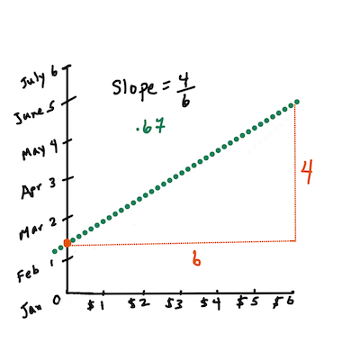

<!--
CO_OP_TRANSLATOR_METADATA:
{
  "original_hash": "2f88fbc741d792890ff2f1430fe0dae0",
  "translation_date": "2025-08-29T16:37:22+00:00",
  "source_file": "2-Regression/3-Linear/README.md",
  "language_code": "ne"
}
-->
# Scikit-learn प्रयोग गरेर रिग्रेसन मोडेल बनाउने: चार तरिकामा रिग्रेसन


> इन्फोग्राफिक: [Dasani Madipalli](https://twitter.com/dasani_decoded)
## [पाठ अघि क्विज](https://gray-sand-07a10f403.1.azurestaticapps.net/quiz/13/)

> ### [यो पाठ R मा उपलब्ध छ!](../../../../2-Regression/3-Linear/solution/R/lesson_3.html)
### परिचय 

अहिलेसम्म तपाईंले रिग्रेसन के हो भनेर बुझ्नुभएको छ, जसमा हामीले कद्दूको मूल्य निर्धारण डेटासेटबाट नमूना डेटा संकलन गरेका छौं, जुन हामीले यो पाठभर प्रयोग गर्नेछौं। तपाईंले यसलाई Matplotlib प्रयोग गरेर दृश्यात्मक रूपमा पनि हेर्नुभएको छ।

अब तपाईं मेशिन लर्निङका लागि रिग्रेसनमा गहिरो रूपमा जान तयार हुनुहुन्छ। दृश्यात्मकता डेटा बुझ्न मद्दत गर्दछ, तर मेशिन लर्निङको वास्तविक शक्ति _मोडेल प्रशिक्षण_ बाट आउँछ। मोडेलहरू ऐतिहासिक डेटा मा आधारित भएर प्रशिक्षित गरिन्छन् ताकि डेटा निर्भरता स्वचालित रूपमा समात्न सकियोस्, र तिनीहरूले नयाँ डेटा (जसलाई मोडेलले पहिले देखेको छैन) को लागि परिणामहरू भविष्यवाणी गर्न अनुमति दिन्छन्।

यस पाठमा, तपाईं दुई प्रकारका रिग्रेसनबारे थप जान्नुहुनेछ: _सामान्य रेखीय रिग्रेसन_ र _बहुपद रिग्रेसन_, साथै यी प्रविधिहरूको आधारभूत गणित। यी मोडेलहरूले हामीलाई विभिन्न इनपुट डेटाको आधारमा कद्दूको मूल्य भविष्यवाणी गर्न अनुमति दिनेछन्।

[](https://youtu.be/CRxFT8oTDMg "मेशिन लर्निङका लागि शुरुआती - रेखीय रिग्रेसन बुझ्ने")

> 🎥 माथिको छवि क्लिक गरेर रेखीय रिग्रेसनको छोटो भिडियो अवलोकन हेर्नुहोस्।

> यस पाठ्यक्रमभर, हामी न्यूनतम गणितीय ज्ञानलाई मान्यता दिन्छौं, र अन्य क्षेत्रबाट आएका विद्यार्थीहरूको लागि यसलाई पहुँचयोग्य बनाउन प्रयास गर्छौं। नोटहरू, 🧮 गणितीय संकेतहरू, रेखाचित्रहरू, र अन्य शिक्षण उपकरणहरूमा ध्यान दिनुहोस्।

### पूर्वआवश्यकता

तपाईंले अहिले सम्म कद्दूको डेटा संरचनासँग परिचित हुनुहुन्छ, जुन हामी अध्ययन गर्दैछौं। यो पाठको _notebook.ipynb_ फाइलमा यो डेटा पहिले नै लोड गरिएको र सफा गरिएको छ। फाइलमा, कद्दूको मूल्य प्रति बुसल नयाँ डेटा फ्रेममा देखाइएको छ। सुनिश्चित गर्नुहोस् कि तपाईं यी नोटबुकहरू Visual Studio Code मा चलाउन सक्नुहुन्छ।

### तयारी

याद दिलाउनका लागि, तपाईं यो डेटा लोड गर्दै हुनुहुन्छ ताकि यसबाट प्रश्न सोध्न सकियोस्।

- कद्दू किन्ने उत्तम समय कहिले हो?
- मिनिएचर कद्दूको केसको मूल्य कति अपेक्षा गर्न सकिन्छ?
- म तिनीहरूलाई आधा-बुसल टोकरीमा किन्ने कि 1 1/9 बुसल बक्समा किन्ने?
आउनुहोस्, यस डेटामा अझै गहिरो अध्ययन गरौं।

पछिल्लो पाठमा, तपाईंले Pandas डेटा फ्रेम सिर्जना गर्नुभयो र मूल डेटासेटको भागसँग यसलाई भर्नुभयो, मूल्यलाई बुसलद्वारा मानकीकरण गर्दै। तर, यसो गर्दा, तपाईंले केवल लगभग 400 डेटा पोइन्टहरू संकलन गर्न सक्नुभयो, र केवल शरद ऋतु महिनाहरूको लागि।

यस पाठको साथमा रहेको नोटबुकमा लोड गरिएको डेटा हेर्नुहोस्। डेटा लोड गरिएको छ र प्रारम्भिक स्क्याटरप्लट चार्ट गरिएको छ ताकि महिनाको डेटा देखाउन सकियोस्। सायद हामी डेटा सफा गरेर यसको प्रकृतिबारे थप विवरण प्राप्त गर्न सक्छौं।

## रेखीय रिग्रेसन रेखा

पाठ 1 मा तपाईंले सिक्नुभएको अनुसार, रेखीय रिग्रेसन अभ्यासको लक्ष्य एउटा रेखा प्लट गर्न सक्षम हुनु हो:

- **चरहरूको सम्बन्ध देखाउनुहोस्**। चरहरू बीचको सम्बन्ध देखाउनुहोस्।
- **भविष्यवाणी गर्नुहोस्**। नयाँ डेटा पोइन्ट उक्त रेखासँगको सम्बन्धमा कहाँ पर्नेछ भन्ने सटीक भविष्यवाणी गर्नुहोस्।

यो प्रकारको रेखा कोर्नको लागि **Least-Squares Regression** सामान्य हो। 'least-squares' शब्दको अर्थ हो कि रिग्रेसन रेखाको वरिपरिका सबै डेटा पोइन्टहरू वर्गाकार गरिन्छ र त्यसपछि जोडिन्छ। आदर्श रूपमा, अन्तिम योग यथासम्भव सानो हुनुपर्छ, किनकि हामी कम त्रुटिहरू चाहन्छौं, वा `least-squares`।

हामी यसो गर्छौं किनकि हामी एउटा रेखा मोडेल गर्न चाहन्छौं जसको सबै डेटा पोइन्टहरूको कुल दूरी कम होस्। हामीले तिनीहरूलाई वर्गाकार गरेर जोड्छौं किनकि हामी यसको दिशा भन्दा यसको परिमाणमा चासो राख्छौं।

> **🧮 गणित देखाउनुहोस्** 
> 
> यो रेखा, जसलाई _सबैभन्दा राम्रो फिटको रेखा_ भनिन्छ, [एक समीकरण](https://en.wikipedia.org/wiki/Simple_linear_regression) द्वारा व्यक्त गर्न सकिन्छ: 
> 
> ```
> Y = a + bX
> ```
>
> `X` 'व्याख्यात्मक चर' हो। `Y` 'निर्भर चर' हो। रेखाको ढलान `b` हो र `a` y-अवरोध हो, जसले `X = 0` हुँदा `Y` को मानलाई जनाउँछ। 
>
>
>
> पहिले, ढलान `b` गणना गर्नुहोस्। इन्फोग्राफिक: [Jen Looper](https://twitter.com/jenlooper)
>
> अर्को शब्दमा, र हाम्रो कद्दू डेटाको मूल प्रश्नलाई सन्दर्भ गर्दै: "महिनाद्वारा प्रति बुसल कद्दूको मूल्य भविष्यवाणी गर्नुहोस्", `X` मूल्यलाई जनाउँछ र `Y` बिक्रीको महिनालाई जनाउँछ। 
>
>
>
> `Y` को मान गणना गर्नुहोस्। यदि तपाईं लगभग $4 तिर्दै हुनुहुन्छ भने, यो अप्रिल हुनुपर्छ! इन्फोग्राफिक: [Jen Looper](https://twitter.com/jenlooper)
>
> रेखाको ढलान गणना गर्ने गणित, जुन y-अवरोधमा पनि निर्भर छ, `X = 0` हुँदा `Y` कहाँ स्थित छ भनेर देखाउनुपर्छ।
>
> तपाईंले [Math is Fun](https://www.mathsisfun.com/data/least-squares-regression.html) वेबसाइटमा यी मानहरूको गणना विधि अवलोकन गर्न सक्नुहुन्छ। [यो Least-squares calculator](https://www.mathsisfun.com/data/least-squares-calculator.html) पनि भ्रमण गर्नुहोस् ताकि संख्याहरूको मानहरूले रेखामा कस्तो प्रभाव पार्छ हेर्न सकियोस्।

## सम्बन्ध

अर्को शब्द बुझ्नुपर्ने भनेको **Correlation Coefficient** हो, जुन दिइएको X र Y चरहरू बीचको सम्बन्ध हो। स्क्याटरप्लट प्रयोग गरेर, तपाईंले यो गुणांक छिटो देख्न सक्नुहुन्छ। यदि प्लटमा डेटा पोइन्टहरू एक सुन्दर रेखामा छरिएका छन् भने उच्च सम्बन्ध हुन्छ, तर यदि प्लटमा डेटा पोइन्टहरू X र Y बीचमा जताततै छरिएका छन् भने कम सम्बन्ध हुन्छ।

एक राम्रो रेखीय रिग्रेसन मोडेल भनेको उच्च (1 नजिक, 0 भन्दा टाढा) Correlation Coefficient भएको मोडेल हो, Least-Squares Regression विधि प्रयोग गरेर रिग्रेसन रेखासँग।

✅ यस पाठसँगको नोटबुक चलाउनुहोस् र महिना र मूल्यको स्क्याटरप्लट हेर्नुहोस्। कद्दू बिक्रीको लागि महिना र मूल्यको सम्बन्ध स्क्याटरप्लटको दृश्य व्याख्याको आधारमा उच्च वा कम सम्बन्ध भएको देखिन्छ? यदि तपाईं `महिना` को सट्टा *वर्षको दिन* (जस्तै, वर्षको सुरुबाट दिनहरूको संख्या) जस्ता अधिक सूक्ष्म उपाय प्रयोग गर्नुहुन्छ भने के यो परिवर्तन हुन्छ?

कोडमा, हामीले डेटा सफा गरेको छौं र `new_pumpkins` नामक डेटा फ्रेम प्राप्त गरेका छौं, जुन निम्नानुसार देखिन्छ:

ID | महिना | वर्षको दिन | प्रकार | सहर | प्याकेज | न्यूनतम मूल्य | उच्चतम मूल्य | मूल्य
---|-------|-----------|---------|------|---------|-----------|------------|-------
70 | 9 | 267 | PIE TYPE | BALTIMORE | 1 1/9 bushel cartons | 15.0 | 15.0 | 13.636364
71 | 9 | 267 | PIE TYPE | BALTIMORE | 1 1/9 bushel cartons | 18.0 | 18.0 | 16.363636
72 | 10 | 274 | PIE TYPE | BALTIMORE | 1 1/9 bushel cartons | 18.0 | 18.0 | 16.363636
73 | 10 | 274 | PIE TYPE | BALTIMORE | 1 1/9 bushel cartons | 17.0 | 17.0 | 15.454545
74 | 10 | 281 | PIE TYPE | BALTIMORE | 1 1/9 bushel cartons | 15.0 | 15.0 | 13.636364

> डेटा सफा गर्ने कोड [`notebook.ipynb`](notebook.ipynb) मा उपलब्ध छ। हामीले अघिल्लो पाठमा जस्तै सफा गर्ने चरणहरू पूरा गरेका छौं, र निम्न अभिव्यक्तिको प्रयोग गरेर `DayOfYear` स्तम्भ गणना गरेका छौं:

```python
day_of_year = pd.to_datetime(pumpkins['Date']).apply(lambda dt: (dt-datetime(dt.year,1,1)).days)
```

अब तपाईंले रेखीय रिग्रेसनको गणितको समझ पाउनुभएको छ, आउनुहोस् रिग्रेसन मोडेल बनाउँ। हामी हेर्नेछौं कि कद्दूको प्याकेजहरू मध्ये कुनले उत्तम मूल्य प्रदान गर्दछ। छुट्टीको लागि कद्दूको बगैचा किन्ने कोहीले कद्दू प्याकेजहरूको खरीदलाई अनुकूलित गर्न यो जानकारी चाहन सक्छ।

## सम्बन्ध खोज्दै

[](https://youtu.be/uoRq-lW2eQo "मेशिन लर्निङका लागि शुरुआती - सम्बन्ध खोज्दै: रेखीय रिग्रेसनको कुञ्जी")

> 🎥 माथिको छवि क्लिक गरेर सम्बन्धको छोटो भिडियो अवलोकन हेर्नुहोस्।

पछिल्लो पाठबाट तपाईंले सम्भवतः विभिन्न महिनाहरूको औसत मूल्य यसरी देख्नुभएको छ:


यसले सुझाव दिन्छ कि केही सम्बन्ध हुनुपर्छ, र हामी `महिना` र `मूल्य` बीचको सम्बन्ध, वा `DayOfYear` र `मूल्य` बीचको सम्बन्ध भविष्यवाणी गर्न रेखीय रिग्रेसन मोडेल प्रशिक्षण गर्न प्रयास गर्न सक्छौं। यहाँ स्क्याटरप्लट छ, जसले पछिल्लो सम्बन्ध देखाउँछ:

 

आउनुहोस् `corr` फंक्शन प्रयोग गरेर सम्बन्ध छ कि छैन हेर्नुहोस्:

```python
print(new_pumpkins['Month'].corr(new_pumpkins['Price']))
print(new_pumpkins['DayOfYear'].corr(new_pumpkins['Price']))
```

यो देखिन्छ कि सम्बन्ध धेरै सानो छ, `महिना` द्वारा -0.15 र `DayOfMonth` द्वारा -0.17, तर अर्को महत्त्वपूर्ण सम्बन्ध हुन सक्छ। यस्तो देखिन्छ कि विभिन्न कद्दू प्रकारहरूका मूल्यहरू विभिन्न समूहहरूमा छन्। यस परिकल्पनालाई पुष्टि गर्न, आउनुहोस् प्रत्येक कद्दूको प्रकारलाई फरक रंगमा प्लट गरौं। `scatter` प्लटिङ फंक्शनमा `ax` प्यारामिटर पास गरेर हामी सबै बिन्दुहरू एउटै ग्राफमा प्लट गर्न सक्छौं:

```python
ax=None
colors = ['red','blue','green','yellow']
for i,var in enumerate(new_pumpkins['Variety'].unique()):
    df = new_pumpkins[new_pumpkins['Variety']==var]
    ax = df.plot.scatter('DayOfYear','Price',ax=ax,c=colors[i],label=var)
```

 

हाम्रो अनुसन्धानले सुझाव दिन्छ कि प्रकारले वास्तविक बिक्री मितिभन्दा समग्र मूल्यमा बढी प्रभाव पार्छ। हामी यो बार ग्राफबाट देख्न सक्छौं:

```python
new_pumpkins.groupby('Variety')['Price'].mean().plot(kind='bar')
```

 

आउनुहोस् अहिले 'pie type' कद्दूको प्रकारमा मात्र ध्यान केन्द्रित गरौं, र हेर्नुहोस् कि मितिले मूल्यमा कस्तो प्रभाव पार्छ:

```python
pie_pumpkins = new_pumpkins[new_pumpkins['Variety']=='PIE TYPE']
pie_pumpkins.plot.scatter('DayOfYear','Price') 
```
 

यदि हामी अहिले `corr` फंक्शन प्रयोग गरेर `मूल्य` र `DayOfYear` बीचको सम्बन्ध गणना गर्छौं भने, हामीले `-0.27` जस्तो केही प्राप्त गर्नेछौं - जसको अर्थ भविष्यवाणी मोडेल प्रशिक्षण गर्नुको अर्थ छ।

> रेखीय रिग्रेसन मोडेल प्रशिक्षण गर्नु अघि, यो सुनिश्चित गर्नु महत्त्वपूर्ण छ कि हाम्रो डेटा सफा छ। रेखीय रिग्रेसनले हराएका मानहरूसँग राम्रोसँग काम गर्दैन, त्यसैले सबै खाली कोषहरू हटाउनु उचित हुन्छ:

```python
pie_pumpkins.dropna(inplace=True)
pie_pumpkins.info()
```

अर्को दृष्टिकोण भनेको ती खाली मानहरूलाई सम्बन्धित स्तम्भको औसत मानले भरिदिनु हो।

## साधारण रेखीय रिग्रेसन

[](https://youtu.be/e4c_UP2fSjg "मेशिन लर्निङका लागि शुरुआती - Scikit-learn प्रयोग गरेर रेखीय र बहुपद रिग्रेसन")

> 🎥 माथिको छवि क्लिक गरेर रेखीय र बहुपद रिग्रेसनको छोटो भिडियो अवलोकन हेर्नुहोस्।

हाम्रो रेखीय रिग्रेसन मोडेल प्रशिक्षण गर्न, हामी **Scikit-learn** लाइब्रेरी प्रयोग गर्नेछौं।

```python
from sklearn.linear_model import LinearRegression
from sklearn.metrics import mean_squared_error
from sklearn.model_selection import train_test_split
```

हामी इनपुट मानहरू (features) र अपेक्षित आउटपुट (label) लाई अलग numpy arrays मा विभाजन गरेर सुरु गर्छौं:

```python
X = pie_pumpkins['DayOfYear'].to_numpy().reshape(-1,1)
y = pie_pumpkins['Price']
```

> ध्यान दिनुहोस् कि हामीले इनपुट डेटामा `reshape` प्रदर्शन गर्नुपर्‍यो ताकि रेखीय रिग्रेसन प्याकेजले यसलाई सही रूपमा बुझ्न सकियोस्। रेखीय रिग्रेसनले इनपुटको रूपमा 2D-array अपेक्षा गर्दछ, जहाँ array को प्रत्येक पङ्क्ति इनपुट features को भेक्टरसँग मेल खान्छ। हाम्रो केसमा, किनकि हामीसँग केवल एक इनपुट छ - हामीलाई आकार N×1 भएको array चाहिन्छ, जहाँ N डेटासेटको आकार हो।

त्यसपछि, हामीले डेटा प्रशिक्षण र परीक्षण डेटासेटहरूमा विभाजन गर्नुपर्छ ताकि प्रशिक्षण पछि हाम्रो मोडेललाई मान्य गर्न सकियोस्:

```python
X_train, X_test, y_train, y_test = train_test_split(X, y, test_size=0.2, random_state=0)
```

अन्ततः, वास्तविक रेखीय रिग्रेसन मोडेल प्रशिक्षण गर्न केवल दुई लाइन कोड लाग्छ। हामी `LinearRegression` वस्तु परिभाषित गर्छौं, र `fit` विधि प्रयोग गरेर यसलाई हाम्रो डेटामा फिट गर्छौं:

```python
lin_reg = LinearRegression()
lin_reg.fit(X_train,y_train)
```

`LinearRegression` वस्तु `fit` गरेपछि रिग्रेसनका सबै गुणांकहरू समावेश गर्दछ, जसलाई `.coef_` प्रोपर्टी प्रयोग गरेर पहुँच गर्न सकिन्छ। हाम्रो केसमा, केवल एक गुणांक छ, जुन `-0.017` को वरिपरि हुनुपर्छ। यसको अर्थ मूल्य समयसँगै थोरै घट्छ, तर धेरै होइन, लगभग प्रति दिन 2 सेन्ट। हामी रिग्रेसनको Y-अक्षसँगको intersection बिन्दु `lin_reg.intercept_` प्रयोग गरेर पनि पहुँच गर्न सक्छौं - यो हाम्रो केसमा लगभग `21` हुनेछ, जसले वर्षको सुरुमा मूल्य संकेत गर्दछ।

हाम्रो मोडेल कति सटीक छ हेर्नको लागि, हामी परीक्षण डेटासेटमा मूल्यहरू भविष्यवाणी गर्न सक्छौं, र त्यसपछि अपेक्षित मानहरूसँग हाम्रो भविष्यवाणीहरू कति नजिक छन् मापन गर्न सक्छौं। यो mean square error (MSE) मेट्रिक्स प्रयोग गरेर गर्न सकिन्छ, जुन अपेक्षित र भविष्यवाणी गरिएको मान बीचको सबै वर्गाकार भिन्नताहरूको औसत हो।

```python
pred = lin_reg.predict(X_test)

mse = np.sqrt(mean_squared_error(y_test,pred))
print(f'Mean error: {mse:3.3} ({mse/np.mean(pred)*100:3.3}%)')
```
हाम्रो त्रुटि लगभग २ बुँदामा देखिन्छ, जुन ~१७% हो। यो धेरै राम्रो छैन। मोडेलको गुणस्तरको अर्को सूचक **निर्धारण गुणांक** हो, जुन यसरी प्राप्त गर्न सकिन्छ:

```python
score = lin_reg.score(X_train,y_train)
print('Model determination: ', score)
```  
यदि मान ० छ भने, यसको अर्थ मोडेलले इनपुट डाटालाई ध्यानमा राख्दैन र *सबैभन्दा खराब रेखीय भविष्यवक्ता* को रूपमा कार्य गर्दछ, जुन परिणामको औसत मान मात्र हो। मान १ भएमा, हामीले सबै अपेक्षित परिणामहरू पूर्ण रूपमा भविष्यवाणी गर्न सक्छौं। हाम्रो अवस्थामा, निर्धारण गुणांक लगभग ०.०६ छ, जुन धेरै कम हो।

हामी परीक्षण डाटालाई रिग्रेसन रेखासँगै प्लट गर्न सक्छौं, जसले हाम्रो अवस्थामा रिग्रेसन कसरी काम गर्छ भन्ने राम्रोसँग देखाउँछ:

```python
plt.scatter(X_test,y_test)
plt.plot(X_test,pred)
```  


## बहुपद रिग्रेसन  

रेखीय रिग्रेसनको अर्को प्रकार बहुपद रिग्रेसन हो। कहिलेकाहीँ चरहरू बीच रेखीय सम्बन्ध हुन्छ - जस्तै, कद्दूको आयतन ठूलो भएमा मूल्य उच्च हुन्छ - तर कहिलेकाहीँ यी सम्बन्धहरू समतल वा सिधा रेखाको रूपमा प्लट गर्न सकिँदैन।  

✅ यहाँ [केही थप उदाहरणहरू](https://online.stat.psu.edu/stat501/lesson/9/9.8) छन्, जसले बहुपद रिग्रेसन प्रयोग गर्न सक्छ।  

मिति र मूल्य बीचको सम्बन्धलाई फेरि हेर्नुहोस्। के यो स्क्याटरप्लटलाई सिधा रेखाले विश्लेषण गर्नुपर्छ जस्तो देखिन्छ? के मूल्यहरू परिवर्तनशील हुन सक्दैनन्? यस्तो अवस्थामा, तपाईं बहुपद रिग्रेसन प्रयास गर्न सक्नुहुन्छ।  

✅ बहुपदहरू गणितीय अभिव्यक्तिहरू हुन्, जसमा एक वा बढी चर र गुणांकहरू समावेश हुन सक्छन्।  

बहुपद रिग्रेसनले गैर-रेखीय डाटालाई राम्रोसँग मिलाउन घुमाउरो रेखा सिर्जना गर्छ। हाम्रो अवस्थामा, यदि हामी इनपुट डाटामा `DayOfYear` को वर्ग समावेश गर्छौं भने, हामी डाटालाई पराबोलिक वक्रसँग मिलाउन सक्षम हुनेछौं, जसको न्यूनतम वर्षको कुनै निश्चित बिन्दुमा हुनेछ।  

Scikit-learn ले [pipeline API](https://scikit-learn.org/stable/modules/generated/sklearn.pipeline.make_pipeline.html?highlight=pipeline#sklearn.pipeline.make_pipeline) प्रदान गर्छ, जसले डाटा प्रशोधनका विभिन्न चरणहरूलाई संयोजन गर्न मद्दत गर्छ। **पाइपलाइन** भनेको **अनुमानकर्ताहरू** को श्रृंखला हो। हाम्रो अवस्थामा, हामी एउटा पाइपलाइन बनाउनेछौं, जसले पहिले हाम्रो मोडेलमा बहुपद विशेषताहरू थप्छ, र त्यसपछि रिग्रेसनलाई प्रशिक्षण दिन्छ:  

```python
from sklearn.preprocessing import PolynomialFeatures
from sklearn.pipeline import make_pipeline

pipeline = make_pipeline(PolynomialFeatures(2), LinearRegression())

pipeline.fit(X_train,y_train)
```  

`PolynomialFeatures(2)` प्रयोग गर्दा, यसले इनपुट डाटाबाट सबै दोस्रो-डिग्री बहुपदहरू समावेश गर्नेछ। हाम्रो अवस्थामा, यसले `DayOfYear`<sup>2</sup> मात्र समावेश गर्नेछ, तर दुई इनपुट चरहरू X र Y भएमा, यसले X<sup>2</sup>, XY र Y<sup>2</sup> थप्नेछ। यदि चाहियो भने, हामी उच्च डिग्री बहुपदहरू पनि प्रयोग गर्न सक्छौं।  

पाइपलाइनहरू `LinearRegression` वस्तु जस्तै तरिकामा प्रयोग गर्न सकिन्छ, जस्तै हामी पाइपलाइनलाई `fit` गर्न सक्छौं, र त्यसपछि `predict` प्रयोग गरेर भविष्यवाणी परिणामहरू प्राप्त गर्न सक्छौं। यहाँ परीक्षण डाटा र अनुमान वक्र देखाउने ग्राफ छ:  

  

बहुपद रिग्रेसन प्रयोग गर्दा, हामी थोरै कम MSE र उच्च निर्धारण प्राप्त गर्न सक्छौं, तर धेरै महत्त्वपूर्ण रूपमा होइन। हामीले अन्य विशेषताहरूलाई पनि ध्यानमा राख्नुपर्छ!  

> तपाईंले देख्न सक्नुहुन्छ कि कद्दूको न्यूनतम मूल्यहरू प्रायः हेलोविनको आसपास देखिन्छ। तपाईं यसलाई कसरी व्याख्या गर्नुहुन्छ?  

🎃 बधाई छ, तपाईंले एउटा मोडेल सिर्जना गर्नुभयो, जसले पाई कद्दूको मूल्य भविष्यवाणी गर्न मद्दत गर्न सक्छ। तपाईंले सम्भवतः सबै कद्दू प्रकारहरूको लागि यो प्रक्रिया दोहोर्याउन सक्नुहुन्छ, तर त्यो धेरै समय लाग्ने काम हुनेछ। अब हामी मोडेलमा कद्दूको विविधतालाई कसरी ध्यानमा राख्ने भन्ने कुरा सिक्नेछौं!  

## श्रेणीगत विशेषताहरू  

आदर्श संसारमा, हामी एउटै मोडेल प्रयोग गरेर विभिन्न कद्दू प्रकारहरूको मूल्य भविष्यवाणी गर्न सक्षम हुन चाहन्छौं। तर, `Variety` स्तम्भ `Month` जस्ता स्तम्भहरू भन्दा केही फरक छ, किनभने यसमा गैर-संख्यात्मक मानहरू छन्। यस्ता स्तम्भहरूलाई **श्रेणीगत** भनिन्छ।  

[](https://youtu.be/DYGliioIAE0 "ML for beginners - Categorical Feature Predictions with Linear Regression")  

> 🎥 माथिको छविमा क्लिक गरेर श्रेणीगत विशेषताहरू प्रयोग गर्ने छोटो भिडियो हेर्नुहोस्।  

यहाँ तपाईंले देख्न सक्नुहुन्छ कि औसत मूल्य विविधतामा कसरी निर्भर गर्दछ:  

  

विविधतालाई ध्यानमा राख्न, हामीले पहिले यसलाई संख्यात्मक रूपमा रूपान्तरण गर्नुपर्छ, वा **एन्कोड** गर्नुपर्छ। यसलाई गर्नका लागि केही तरिकाहरू छन्:  

* साधारण **संख्यात्मक एन्कोडिङ** ले विभिन्न विविधताहरूको तालिका बनाउनेछ, र त्यसपछि विविधताको नामलाई उक्त तालिकाको सूचकांकले प्रतिस्थापन गर्नेछ। यो रेखीय रिग्रेसनको लागि उत्तम विचार होइन, किनभने रेखीय रिग्रेसनले सूचकांकको वास्तविक संख्यात्मक मानलाई ध्यानमा राख्छ, र यसलाई केही गुणांकले गुणा गरेर परिणाममा थप्छ। हाम्रो अवस्थामा, सूचकांक संख्या र मूल्य बीचको सम्बन्ध स्पष्ट रूपमा रेखीय छैन, चाहे हामीले सूचकांकहरूलाई कुनै विशिष्ट तरिकामा क्रमबद्ध गरे पनि।  
* **वन-हट एन्कोडिङ** ले `Variety` स्तम्भलाई ४ फरक स्तम्भहरूले प्रतिस्थापन गर्नेछ, प्रत्येक विविधताका लागि एउटा। प्रत्येक स्तम्भले `१` समावेश गर्नेछ, यदि सम्बन्धित पङ्क्ति दिइएको विविधताको हो भने, र `०` अन्यथा। यसको अर्थ, रेखीय रिग्रेसनमा चारवटा गुणांक हुनेछन्, प्रत्येक कद्दू प्रकारको लागि, जसले "सुरुवाती मूल्य" (वा "थप मूल्य") को जिम्मेवारी लिनेछ।  

तलको कोडले विविधतालाई वन-हट एन्कोड कसरी गर्न सकिन्छ भन्ने देखाउँछ:  

```python
pd.get_dummies(new_pumpkins['Variety'])
```  

 ID | FAIRYTALE | MINIATURE | MIXED HEIRLOOM VARIETIES | PIE TYPE  
----|-----------|-----------|--------------------------|----------  
70 | 0 | 0 | 0 | 1  
71 | 0 | 0 | 0 | 1  
... | ... | ... | ... | ...  
1738 | 0 | 1 | 0 | 0  
1739 | 0 | 1 | 0 | 0  
1740 | 0 | 1 | 0 | 0  
1741 | 0 | 1 | 0 | 0  
1742 | 0 | 1 | 0 | 0  

वन-हट एन्कोड गरिएको विविधतालाई इनपुटको रूपमा प्रयोग गरेर रेखीय रिग्रेसन प्रशिक्षण दिन, हामीले `X` र `y` डाटालाई सही रूपमा आरम्भ गर्नुपर्छ:  

```python
X = pd.get_dummies(new_pumpkins['Variety'])
y = new_pumpkins['Price']
```  

बाकी कोड माथि प्रयोग गरिएको रेखीय रिग्रेसन प्रशिक्षण दिन प्रयोग गरिएको जस्तै हो। यदि तपाईंले यसलाई प्रयास गर्नुभयो भने, तपाईंले देख्नुहुनेछ कि औसत वर्ग त्रुटि लगभग उस्तै छ, तर निर्धारण गुणांक धेरै उच्च (~७७%) छ। अझ बढी सटीक भविष्यवाणीहरू प्राप्त गर्न, हामीले थप श्रेणीगत विशेषताहरू, साथै संख्यात्मक विशेषताहरू, जस्तै `Month` वा `DayOfYear` लाई ध्यानमा राख्न सक्छौं। विशेषताहरूको ठूलो एरे प्राप्त गर्न, हामी `join` प्रयोग गर्न सक्छौं:  

```python
X = pd.get_dummies(new_pumpkins['Variety']) \
        .join(new_pumpkins['Month']) \
        .join(pd.get_dummies(new_pumpkins['City'])) \
        .join(pd.get_dummies(new_pumpkins['Package']))
y = new_pumpkins['Price']
```  

यहाँ हामीले `City` र `Package` प्रकारलाई पनि ध्यानमा राखेका छौं, जसले हामीलाई MSE २.८४ (१०%) र निर्धारण ०.९४ दिन्छ!  

## सबै कुरा एकसाथ राख्दै  

सर्वश्रेष्ठ मोडेल बनाउन, हामी माथिको उदाहरणबाट संयुक्त (वन-हट एन्कोड गरिएको श्रेणीगत + संख्यात्मक) डाटा बहुपद रिग्रेसनसँग प्रयोग गर्न सक्छौं। यहाँ तपाईंको सुविधाको लागि पूर्ण कोड छ:  

```python
# set up training data
X = pd.get_dummies(new_pumpkins['Variety']) \
        .join(new_pumpkins['Month']) \
        .join(pd.get_dummies(new_pumpkins['City'])) \
        .join(pd.get_dummies(new_pumpkins['Package']))
y = new_pumpkins['Price']

# make train-test split
X_train, X_test, y_train, y_test = train_test_split(X, y, test_size=0.2, random_state=0)

# setup and train the pipeline
pipeline = make_pipeline(PolynomialFeatures(2), LinearRegression())
pipeline.fit(X_train,y_train)

# predict results for test data
pred = pipeline.predict(X_test)

# calculate MSE and determination
mse = np.sqrt(mean_squared_error(y_test,pred))
print(f'Mean error: {mse:3.3} ({mse/np.mean(pred)*100:3.3}%)')

score = pipeline.score(X_train,y_train)
print('Model determination: ', score)
```  

यसले हामीलाई लगभग ९७% को निर्धारण गुणांक र MSE=२.२३ (~८% भविष्यवाणी त्रुटि) दिन्छ।  

| मोडेल | MSE | निर्धारण |  
|-------|-----|-----------|  
| `DayOfYear` Linear | २.७७ (१७.२%) | ०.०७ |  
| `DayOfYear` Polynomial | २.७३ (१७.०%) | ०.०८ |  
| `Variety` Linear | ५.२४ (१९.७%) | ०.७७ |  
| All features Linear | २.८४ (१०.५%) | ०.९४ |  
| All features Polynomial | २.२३ (८.२५%) | ०.९७ |  

🏆 राम्रो काम! तपाईंले एक पाठमा चारवटा रिग्रेसन मोडेलहरू सिर्जना गर्नुभयो, र मोडेलको गुणस्तरलाई ९७% सम्म सुधार गर्नुभयो। रिग्रेसनको अन्तिम खण्डमा, तपाईंले श्रेणी निर्धारण गर्नका लागि Logistic Regression को बारेमा सिक्नुहुनेछ।  

---  
## 🚀 चुनौती  

यस नोटबुकमा विभिन्न चरहरू परीक्षण गर्नुहोस् र हेर्नुहोस् कि सम्बन्ध मोडेलको सटीकतासँग कसरी मेल खान्छ।  

## [पाठपछिको प्रश्नोत्तरी](https://gray-sand-07a10f403.1.azurestaticapps.net/quiz/14/)  

## समीक्षा र आत्म-अध्ययन  

यस पाठमा हामीले रेखीय रिग्रेसनको बारेमा सिक्यौं। रिग्रेसनका अन्य महत्त्वपूर्ण प्रकारहरू पनि छन्। Stepwise, Ridge, Lasso र Elasticnet प्रविधिहरूको बारेमा पढ्नुहोस्। थप सिक्नको लागि राम्रो पाठ्यक्रम [Stanford Statistical Learning course](https://online.stanford.edu/courses/sohs-ystatslearning-statistical-learning) हो।  

## असाइनमेन्ट  

[मोडेल बनाउनुहोस्](assignment.md)  

---

**अस्वीकरण**:  
यो दस्तावेज़ AI अनुवाद सेवा [Co-op Translator](https://github.com/Azure/co-op-translator) प्रयोग गरेर अनुवाद गरिएको छ। हामी यथार्थताको लागि प्रयास गर्छौं, तर कृपया ध्यान दिनुहोस् कि स्वचालित अनुवादमा त्रुटिहरू वा असमानताहरू हुन सक्छ। यसको मूल भाषा मा रहेको मूल दस्तावेज़लाई आधिकारिक स्रोत मानिनुपर्छ। महत्वपूर्ण जानकारीको लागि, व्यावसायिक मानव अनुवाद सिफारिस गरिन्छ। यस अनुवादको प्रयोगबाट उत्पन्न हुने कुनै पनि गलतफहमी वा गलत व्याख्याको लागि हामी जिम्मेवार हुने छैनौं।