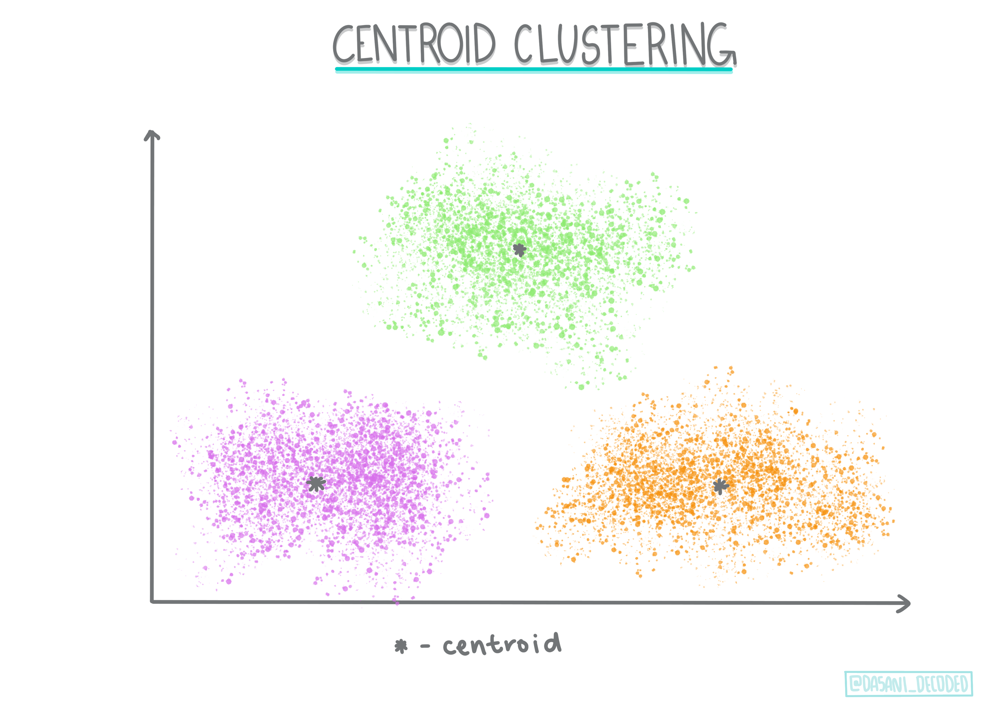
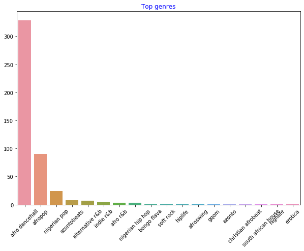
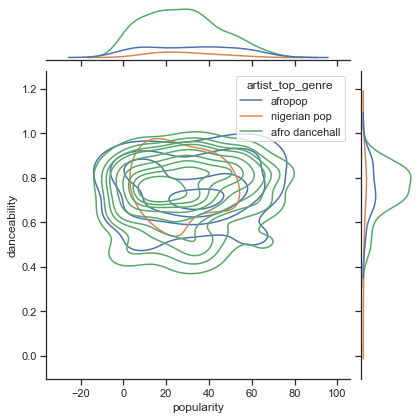

<!--
CO_OP_TRANSLATOR_METADATA:
{
  "original_hash": "0ab69b161efd7a41d325ee28b29415d7",
  "translation_date": "2025-08-29T17:11:31+00:00",
  "source_file": "5-Clustering/1-Visualize/README.md",
  "language_code": "ne"
}
-->
# क्लस्टरिङको परिचय

क्लस्टरिङ [अनसुपरभाइज्ड लर्निङ](https://wikipedia.org/wiki/Unsupervised_learning) को एक प्रकार हो, जसले मानिन्छ कि कुनै डेटासेट लेबल गरिएको छैन वा यसको इनपुटहरू पूर्वनिर्धारित आउटपुटहरूसँग मिलाइएको छैन। यसले विभिन्न एल्गोरिदमहरूको प्रयोग गरेर लेबल नगरिएको डाटालाई वर्गीकृत गर्छ र त्यसमा देखिएका ढाँचाहरूको आधारमा समूहहरू प्रदान गर्छ। 

[](https://youtu.be/ty2advRiWJM "PSquare द्वारा 'No One Like You'")

> 🎥 माथिको तस्बिरमा क्लिक गर्नुहोस् भिडियो हेर्न। क्लस्टरिङको साथ मेसिन लर्निङ अध्ययन गर्दा, केही नाइजेरियन डान्स हल ट्र्याक्सको मजा लिनुहोस् - यो PSquare को २०१४ को अत्यधिक प्रशंसित गीत हो।
## [पूर्व-व्याख्यान क्विज](https://gray-sand-07a10f403.1.azurestaticapps.net/quiz/27/)
### परिचय

[क्लस्टरिङ](https://link.springer.com/referenceworkentry/10.1007%2F978-0-387-30164-8_124) डाटा अन्वेषणका लागि धेरै उपयोगी छ। आउनुहोस्, यसले नाइजेरियन दर्शकहरूले संगीत कसरी उपभोग गर्छन् भन्ने प्रवृत्ति र ढाँचाहरू पत्ता लगाउन मद्दत गर्न सक्छ कि भनेर हेरौं।

✅ क्लस्टरिङको प्रयोगबारे सोच्न एक मिनेट लिनुहोस्। वास्तविक जीवनमा, क्लस्टरिङ तब हुन्छ जब तपाईंले लुगा धुने थुप्रो छान्नु पर्छ र आफ्नो परिवारका सदस्यहरूको लुगा छुट्याउनु पर्छ 🧦👕👖🩲। डाटा साइन्समा, क्लस्टरिङ प्रयोगकर्ताको प्राथमिकता विश्लेषण गर्दा वा कुनै लेबल नगरिएको डेटासेटको विशेषताहरू निर्धारण गर्दा हुन्छ। क्लस्टरिङ, एक हिसाबले, अस्तव्यस्ततालाई बुझ्न मद्दत गर्छ, जस्तै मोजाको दराज।

[](https://youtu.be/esmzYhuFnds "क्लस्टरिङको परिचय")

> 🎥 माथिको तस्बिरमा क्लिक गर्नुहोस् भिडियो हेर्न: MIT का जोन गुट्टागले क्लस्टरिङको परिचय दिनुहुन्छ।

व्यावसायिक सेटिङमा, क्लस्टरिङलाई बजार विभाजन निर्धारण गर्न, जस्तै कुन उमेर समूहले कुन वस्तुहरू किन्छन् भनेर पत्ता लगाउन प्रयोग गर्न सकिन्छ। अर्को प्रयोग अनियमितता पत्ता लगाउन हुन सक्छ, जस्तै क्रेडिट कार्ड लेनदेनको डेटासेटबाट ठगी पत्ता लगाउन। वा तपाईंले मेडिकल स्क्यानहरूको समूहमा ट्युमरहरू निर्धारण गर्न क्लस्टरिङ प्रयोग गर्न सक्नुहुन्छ।

✅ सोच्नुहोस्, तपाईंले बैंकिङ, ई-कमर्स, वा व्यवसाय सेटिङमा 'जंगली' क्लस्टरिङलाई कसरी सामना गर्नुभएको छ?

> 🎓 रोचक कुरा, क्लस्टर विश्लेषणको उत्पत्ति १९३० को दशकमा मानवशास्त्र र मनोविज्ञानका क्षेत्रमा भएको थियो। तपाईं कल्पना गर्न सक्नुहुन्छ, यसलाई कसरी प्रयोग गरिएको होला?

अर्को विकल्पको रूपमा, तपाईं यसलाई खोज परिणामहरूको समूह बनाउन प्रयोग गर्न सक्नुहुन्छ - जस्तै किनमेल लिङ्कहरू, तस्बिरहरू, वा समीक्षाहरू। क्लस्टरिङ उपयोगी हुन्छ जब तपाईंसँग ठूलो डेटासेट हुन्छ जसलाई तपाईं घटाउन चाहनुहुन्छ र त्यसमा थप सूक्ष्म विश्लेषण गर्न चाहनुहुन्छ, त्यसैले यो प्रविधि अन्य मोडेलहरू निर्माण गर्नु अघि डाटाबारे जान्न प्रयोग गर्न सकिन्छ।

✅ एकपटक तपाईंको डाटा क्लस्टरहरूमा व्यवस्थित भएपछि, तपाईं यसलाई क्लस्टर आइडी दिनुहुन्छ, र यो प्रविधि डेटासेटको गोपनीयता सुरक्षित गर्न उपयोगी हुन सक्छ; तपाईं क्लस्टरको अन्य पहिचानयोग्य डाटाको सट्टा क्लस्टर आइडीद्वारा डाटाको बिन्दुलाई उल्लेख गर्न सक्नुहुन्छ। तपाईं अन्य कारणहरू सोच्न सक्नुहुन्छ किन तपाईं क्लस्टर आइडीलाई क्लस्टरका अन्य तत्वहरूको सट्टा पहिचान गर्न प्रयोग गर्नुहुन्छ?

क्लस्टरिङ प्रविधिहरूको आफ्नो बुझाइलाई यस [लर्न मोड्युल](https://docs.microsoft.com/learn/modules/train-evaluate-cluster-models?WT.mc_id=academic-77952-leestott) मा गहिरो बनाउनुहोस्।
## क्लस्टरिङ सुरु गर्दै

[Scikit-learn ले क्लस्टरिङ गर्नका लागि धेरै विधिहरू](https://scikit-learn.org/stable/modules/clustering.html) प्रदान गर्दछ। तपाईंले कुन प्रकारको छनोट गर्नुहुन्छ भन्ने कुरा तपाईंको प्रयोग केसमा निर्भर गर्दछ। डक्युमेन्टेसन अनुसार, प्रत्येक विधिको विभिन्न फाइदाहरू छन्। यहाँ Scikit-learn द्वारा समर्थित विधिहरू र तिनीहरूको उपयुक्त प्रयोग केसहरूको सरल तालिका छ:

| विधिको नाम                  | प्रयोग केस                                                               |
| :--------------------------- | :--------------------------------------------------------------------- |
| K-Means                      | सामान्य उद्देश्य, इन्डक्टिभ                                             |
| Affinity propagation         | धेरै, असमान क्लस्टरहरू, इन्डक्टिभ                                       |
| Mean-shift                   | धेरै, असमान क्लस्टरहरू, इन्डक्टिभ                                       |
| Spectral clustering          | थोरै, समान क्लस्टरहरू, ट्रान्सडक्टिभ                                   |
| Ward hierarchical clustering | धेरै, बाध्य क्लस्टरहरू, ट्रान्सडक्टिभ                                   |
| Agglomerative clustering     | धेरै, बाध्य, गैर-यूक्लिडियन दूरीहरू, ट्रान्सडक्टिभ                     |
| DBSCAN                       | गैर-समतल ज्यामिति, असमान क्लस्टरहरू, ट्रान्सडक्टिभ                     |
| OPTICS                       | गैर-समतल ज्यामिति, असमान क्लस्टरहरू भिन्न घनत्वका साथ, ट्रान्सडक्टिभ |
| Gaussian mixtures            | समतल ज्यामिति, इन्डक्टिभ                                               |
| BIRCH                        | ठूलो डेटासेट बाहिरका बिन्दुहरूसँग, इन्डक्टिभ                           |

> 🎓 हामी कसरी क्लस्टरहरू बनाउँछौं भन्ने कुरा डाटाका बिन्दुहरूलाई समूहमा कसरी जम्मा गरिन्छ भन्ने कुरासँग धेरै सम्बन्धित छ। केही शब्दावली बुझौं:
>
> 🎓 ['ट्रान्सडक्टिभ' बनाम 'इन्डक्टिभ'](https://wikipedia.org/wiki/Transduction_(machine_learning))
> 
> ट्रान्सडक्टिभ इनफरेन्स अवलोकन गरिएका प्रशिक्षण केसहरूबाट प्राप्त हुन्छ जुन विशिष्ट परीक्षण केसहरूसँग नक्साङ्कन गरिन्छ। इन्डक्टिभ इनफरेन्स प्रशिक्षण केसहरूबाट प्राप्त हुन्छ जुन सामान्य नियमहरूमा नक्साङ्कन गरिन्छ र त्यसपछि मात्र परीक्षण केसहरूमा लागू गरिन्छ। 
> 
> उदाहरण: कल्पना गर्नुहोस् तपाईंको डेटासेट आंशिक रूपमा मात्र लेबल गरिएको छ। केही वस्तुहरू 'रेकर्ड्स', केही 'सीडीहरू', र केही खाली छन्। तपाईंको काम भनेको ती खाली वस्तुहरूलाई लेबल प्रदान गर्नु हो। यदि तपाईंले इन्डक्टिभ दृष्टिकोण रोज्नुभयो भने, तपाईंले 'रेकर्ड्स' र 'सीडीहरू' खोज्ने मोडेल प्रशिक्षण गर्नुहुनेछ, र ती लेबलहरूलाई तपाईंको अनलेबल गरिएको डाटामा लागू गर्नुहुनेछ। यो दृष्टिकोणले वास्तवमा 'क्यासेट्स' भएका वस्तुहरू वर्गीकृत गर्न कठिनाइ हुनेछ। ट्रान्सडक्टिभ दृष्टिकोण, अर्कोतर्फ, यस अज्ञात डाटालाई अझ प्रभावकारी रूपमा सम्हाल्छ किनभने यसले समान वस्तुहरूलाई समूहमा राख्न काम गर्छ र त्यसपछि समूहलाई लेबल प्रदान गर्छ। यस अवस्थामा, क्लस्टरहरूले 'गोल संगीत वस्तुहरू' र 'चौकोर संगीत वस्तुहरू' झल्काउन सक्छ।
> 
> 🎓 ['गैर-समतल' बनाम 'समतल' ज्यामिति](https://datascience.stackexchange.com/questions/52260/terminology-flat-geometry-in-the-context-of-clustering)
> 
> गणितीय शब्दावलीबाट व्युत्पन्न, गैर-समतल बनाम समतल ज्यामितिले बिन्दुहरू बीचको दूरीलाई 'समतल' ([यूक्लिडियन](https://wikipedia.org/wiki/Euclidean_geometry)) वा 'गैर-समतल' (गैर-यूक्लिडियन) ज्यामितीय विधिहरूद्वारा मापन गर्ने कुरा जनाउँछ। 
>
>'समतल' यस सन्दर्भमा यूक्लिडियन ज्यामिति (जसको केही भाग 'प्लेन' ज्यामिति भनेर पढाइन्छ) लाई जनाउँछ, र गैर-समतलले गैर-यूक्लिडियन ज्यामितिलाई जनाउँछ। मेसिन लर्निङसँग ज्यामितिको के सम्बन्ध? गणितमा आधारित दुई क्षेत्रका रूपमा, क्लस्टरहरूमा बिन्दुहरू बीचको दूरी मापन गर्न एउटा सामान्य तरिका हुनुपर्छ, र यो 'समतल' वा 'गैर-समतल' तरिकामा गरिन सक्छ, डाटाको प्रकृतिमा निर्भर गर्दै। [यूक्लिडियन दूरीहरू](https://wikipedia.org/wiki/Euclidean_distance) दुई बिन्दुहरू बीचको रेखा खण्डको लम्बाइको रूपमा मापन गरिन्छ। [गैर-यूक्लिडियन दूरीहरू](https://wikipedia.org/wiki/Non-Euclidean_geometry) वक्रको साथ मापन गरिन्छ। यदि तपाईंको डाटा, दृश्यात्मक रूपमा, समतलमा अवस्थित छैन जस्तो देखिन्छ, तपाईंले यसलाई सम्हाल्न विशेष एल्गोरिदम प्रयोग गर्न आवश्यक हुन सक्छ।
>

> इन्फोग्राफिक [दसानी मडिपल्ली](https://twitter.com/dasani_decoded) द्वारा
> 
> 🎓 ['दूरीहरू'](https://web.stanford.edu/class/cs345a/slides/12-clustering.pdf)
> 
> क्लस्टरहरू तिनीहरूको दूरी म्याट्रिक्सद्वारा परिभाषित गरिन्छ, जस्तै बिन्दुहरू बीचको दूरी। यो दूरी केही तरिकाहरूमा मापन गर्न सकिन्छ। यूक्लिडियन क्लस्टरहरू बिन्दु मानहरूको औसतद्वारा परिभाषित गरिन्छ, र 'सेन्ट्रोइड' वा केन्द्र बिन्दु समावेश गर्दछ। दूरीहरू त्यसैले त्यो सेन्ट्रोइडसम्मको दूरीद्वारा मापन गरिन्छ। गैर-यूक्लिडियन दूरीहरू 'क्लस्ट्रोइड्स' लाई जनाउँछ, अन्य बिन्दुहरूसँग नजिकको बिन्दु। क्लस्ट्रोइड्स विभिन्न तरिकामा परिभाषित गर्न सकिन्छ।
> 
> 🎓 ['बाध्य'](https://wikipedia.org/wiki/Constrained_clustering)
> 
> [बाध्य क्लस्टरिङ](https://web.cs.ucdavis.edu/~davidson/Publications/ICDMTutorial.pdf) ले यस अनसुपरभाइज्ड विधिमा 'सेमी-सुपरभाइज्ड' लर्निङलाई परिचय गराउँछ। बिन्दुहरू बीचको सम्बन्धलाई 'लिङ्क गर्न सकिँदैन' वा 'लिङ्क गर्नुपर्छ' भनेर झण्डा लगाइन्छ, त्यसैले डेटासेटमा केही नियमहरू लागू गरिन्छ।
>
>उदाहरण: यदि कुनै एल्गोरिदमलाई लेबल नगरिएको वा सेमी-लेबल गरिएको डाटाको ब्याचमा स्वतन्त्र रूपमा छोडियो भने, यसले उत्पादन गर्ने क्लस्टरहरूको गुणस्तर खराब हुन सक्छ। माथिको उदाहरणमा, क्लस्टरहरूले 'गोल संगीत वस्तुहरू', 'चौकोर संगीत वस्तुहरू', 'त्रिकोणीय वस्तुहरू', र 'कुकीहरू' समूह गर्न सक्छ। यदि केही बाधाहरू, वा अनुसरण गर्न नियमहरू दिइयो ("वस्तु प्लास्टिकबाट बनेको हुनुपर्छ", "वस्तुले संगीत उत्पादन गर्न सक्षम हुनुपर्छ") यसले एल्गोरिदमलाई राम्रो छनोट गर्न मद्दत गर्न सक्छ।
> 
> 🎓 'घनत्व'
> 
> 'शोरयुक्त' डाटालाई 'घना' मानिन्छ। यसको प्रत्येक क्लस्टरमा बिन्दुहरू बीचको दूरी, जाँच गर्दा, बढी वा कम घना, वा 'भीडभाड' हुन सक्छ, र यसैले यो डाटालाई उपयुक्त क्लस्टरिङ विधि प्रयोग गरेर विश्लेषण गर्न आवश्यक छ। [यो लेख](https://www.kdnuggets.com/2020/02/understanding-density-based-clustering.html) ले असमान क्लस्टर घनत्व भएको शोरयुक्त डेटासेट अन्वेषण गर्न K-Means क्लस्टरिङ बनाम HDBSCAN एल्गोरिदम प्रयोग गर्ने भिन्नता प्रदर्शन गर्दछ।

## क्लस्टरिङ एल्गोरिदमहरू

क्लस्टरिङका १०० भन्दा बढी एल्गोरिदमहरू छन्, र तिनीहरूको प्रयोग डाटाको प्रकृतिमा निर्भर गर्दछ। आउनुहोस्, केही प्रमुख एल्गोरिदमहरूको चर्चा गरौं:

- **हायरार्किकल क्लस्टरिङ**। यदि कुनै वस्तु नजिकको वस्तुसँगको नजिकको आधारमा वर्गीकृत गरिन्छ भने, क्लस्टरहरू तिनीहरूको सदस्यहरूको अन्य वस्तुहरूसँगको दूरीको आधारमा बनाइन्छ। Scikit-learn को एग्लोमरेटिभ क्लस्टरिङ हायरार्किकल हो।

   
   > इन्फोग्राफिक [दसानी मडिपल्ली](https://twitter.com/dasani_decoded) द्वारा

- **सेन्ट्रोइड क्लस्टरिङ**। यो लोकप्रिय एल्गोरिदमले 'k', वा बनाउने क्लस्टरहरूको संख्या छनोट गर्न आवश्यक छ, त्यसपछि एल्गोरिदमले क्लस्टरको केन्द्र बिन्दु निर्धारण गर्छ र त्यस बिन्दुको वरिपरि डाटा जम्मा गर्छ। [K-means क्लस्टरिङ](https://wikipedia.org/wiki/K-means_clustering) सेन्ट्रोइड क्लस्टरिङको लोकप्रिय संस्करण हो। केन्द्र नजिकको औसतद्वारा निर्धारण गरिन्छ, त्यसैले नाम।

   
   > इन्फोग्राफिक [दसानी मडिपल्ली](https://twitter.com/dasani_decoded) द्वारा

- **डिस्ट्रिब्युसन-आधारित क्लस्टरिङ**। सांख्यिकीय मोडलिङमा आधारित, डिस्ट्रिब्युसन-आधारित क्लस्टरिङले कुनै डाटा बिन्दु क्लस्टरमा पर्ने सम्भावना निर्धारण गर्छ र त्यस अनुसार यसलाई असाइन गर्छ। Gaussian मिश्रण विधिहरू यस प्रकारमा पर्छन्।

- **डेंसिटी-आधारित क्लस्टरिङ**। डाटा बिन्दुहरू तिनीहरूको घनत्वको आधारमा क्लस्टरहरूमा असाइन गरिन्छ, वा तिनीहरूको एकअर्काको वरिपरि समूह बनाउने आधारमा। समूहबाट टाढा रहेका डाटा बिन्दुहरूलाई आउट्लायर वा शोर मानिन्छ। DBSCAN, Mean-shift र OPTICS यस प्रकारका क्लस्टरिङमा पर्छन्।

- **ग्रिड-आधारित क्लस्टरिङ**। बहु-आयामिक डेटासेटहरूको लागि, ग्रिड बनाइन्छ र डाटालाई ग्रिडका कोषहरूमा विभाजन गरिन्छ, यसरी क्लस्टरहरू बनाइन्छ।

## अभ्यास - आफ्नो डाटालाई क्लस्टर गर्नुहोस्

क्लस्टरिङ प्रविधि उचित दृश्यात्मकताबाट धेरै लाभान्वित हुन्छ, त्यसैले आउनुहोस् हाम्रो संगीत डाटालाई दृश्यात्मक बनाउन सुरु गरौं। यो अभ्यासले हामीलाई यो डाटाको प्रकृतिका लागि क्लस्टरिङका कुन विधिहरू सबैभन्दा प्रभावकारी रूपमा प्रयोग गर्नुपर्छ भनेर निर्णय गर्न मद्दत गर्नेछ।

1. यस फोल्डरमा रहेको [_notebook.ipynb_](https://github.com/microsoft/ML-For-Beginners/blob/main/5-Clustering/1-Visualize/notebook.ipynb) फाइल खोल्नुहोस्।

1. राम्रो डाटा दृश्यात्मकताका लागि `Seaborn` प्याकेज आयात गर्नुहोस्।

    ```python
    !pip install seaborn
    ```

1. [_nigerian-songs.csv_](https://github.com/microsoft/ML-For-Beginners/blob/main/5-Clustering/data/nigerian-songs.csv) बाट गीत डाटा थप्नुहोस्। गीतहरूको बारेमा केही डाटासहित डेटाफ्रेम लोड गर्नुहोस्। पुस्तकालयहरू आयात गरेर र डाटा डम्प गरेर यो डाटाको अन्वेषण गर्न तयार हुनुहोस्:

    ```python
    import matplotlib.pyplot as plt
    import pandas as pd
    
    df = pd.read_csv("../data/nigerian-songs.csv")
    df.head()
    ```

    डाटाका पहिलो केही पङ्क्तिहरू जाँच गर्नुहोस्:

    |     | नाम                     | एल्बम                        | कलाकार              | कलाकारको शीर्ष विधा | रिलिज मिति | लम्बाइ | लोकप्रियता | नृत्ययोग्यता | ध्वन्यात्मकता | ऊर्जा | वाद्ययन्त्रता | जीवन्तता | आवाजको स्तर | भाषणता | टेम्पो   | समय हस्ताक्षर |
    | --- | ------------------------ | ---------------------------- | ------------------- | ---------------- | ------------ | ------ | ---------- | ------------ | ------------ | ------ | ---------------- | -------- | -------- | ----------- | ------- | -------------- |
    | 0   | Sparky                   | Mandy & The Jungle           | Cruel Santino       | alternative r&b  | 2019         | 144000 | 48         | 0.666        | 0.851        | 0.42   | 0.534            | 0.11     | -6.699   | 0.082
| 2   | LITT!                    | LITT!                        | AYLØ                | इन्डी आर&बी        | 2018         | 207758 | 40         | 0.836        | 0.272        | 0.564  | 0.000537         | 0.11     | -7.127   | 0.0424      | 130.005 | 4              |
| 3   | Confident / Feeling Cool | Enjoy Your Life              | Lady Donli          | नाइजेरियन पप       | 2019         | 175135 | 14         | 0.894        | 0.798        | 0.611  | 0.000187         | 0.0964   | -4.961   | 0.113       | 111.087 | 4              |
| 4   | wanted you               | rare.                        | Odunsi (The Engine) | अफ्रोपप            | 2018         | 152049 | 25         | 0.702        | 0.116        | 0.833  | 0.91             | 0.348    | -6.044   | 0.0447      | 105.115 | 4              |

1. `info()` प्रयोग गरेर डेटा फ्रेमको जानकारी प्राप्त गर्नुहोस्:

    ```python
    df.info()
    ```

   यसले निम्न जस्तो आउटपुट देखाउँछ:

    ```output
    <class 'pandas.core.frame.DataFrame'>
    RangeIndex: 530 entries, 0 to 529
    Data columns (total 16 columns):
     #   Column            Non-Null Count  Dtype  
    ---  ------            --------------  -----  
     0   name              530 non-null    object 
     1   album             530 non-null    object 
     2   artist            530 non-null    object 
     3   artist_top_genre  530 non-null    object 
     4   release_date      530 non-null    int64  
     5   length            530 non-null    int64  
     6   popularity        530 non-null    int64  
     7   danceability      530 non-null    float64
     8   acousticness      530 non-null    float64
     9   energy            530 non-null    float64
     10  instrumentalness  530 non-null    float64
     11  liveness          530 non-null    float64
     12  loudness          530 non-null    float64
     13  speechiness       530 non-null    float64
     14  tempo             530 non-null    float64
     15  time_signature    530 non-null    int64  
    dtypes: float64(8), int64(4), object(4)
    memory usage: 66.4+ KB
    ```

1. `isnull()` प्रयोग गरेर र यसको योगफल 0 भएको सुनिश्चित गरेर खाली मानहरूको पुनः जाँच गर्नुहोस्:

    ```python
    df.isnull().sum()
    ```

    राम्रो देखियो:

    ```output
    name                0
    album               0
    artist              0
    artist_top_genre    0
    release_date        0
    length              0
    popularity          0
    danceability        0
    acousticness        0
    energy              0
    instrumentalness    0
    liveness            0
    loudness            0
    speechiness         0
    tempo               0
    time_signature      0
    dtype: int64
    ```

1. डेटा वर्णन गर्नुहोस्:

    ```python
    df.describe()
    ```

    |       | release_date | length      | popularity | danceability | acousticness | energy   | instrumentalness | liveness | loudness  | speechiness | tempo      | time_signature |
    | ----- | ------------ | ----------- | ---------- | ------------ | ------------ | -------- | ---------------- | -------- | --------- | ----------- | ---------- | -------------- |
    | count | 530          | 530         | 530        | 530          | 530          | 530      | 530              | 530      | 530       | 530         | 530        | 530            |
    | mean  | 2015.390566  | 222298.1698 | 17.507547  | 0.741619     | 0.265412     | 0.760623 | 0.016305         | 0.147308 | -4.953011 | 0.130748    | 116.487864 | 3.986792       |
    | std   | 3.131688     | 39696.82226 | 18.992212  | 0.117522     | 0.208342     | 0.148533 | 0.090321         | 0.123588 | 2.464186  | 0.092939    | 23.518601  | 0.333701       |
    | min   | 1998         | 89488       | 0          | 0.255        | 0.000665     | 0.111    | 0                | 0.0283   | -19.362   | 0.0278      | 61.695     | 3              |
    | 25%   | 2014         | 199305      | 0          | 0.681        | 0.089525     | 0.669    | 0                | 0.07565  | -6.29875  | 0.0591      | 102.96125  | 4              |
    | 50%   | 2016         | 218509      | 13         | 0.761        | 0.2205       | 0.7845   | 0.000004         | 0.1035   | -4.5585   | 0.09795     | 112.7145   | 4              |
    | 75%   | 2017         | 242098.5    | 31         | 0.8295       | 0.403        | 0.87575  | 0.000234         | 0.164    | -3.331    | 0.177       | 125.03925  | 4              |
    | max   | 2020         | 511738      | 73         | 0.966        | 0.954        | 0.995    | 0.91             | 0.811    | 0.582     | 0.514       | 206.007    | 5              |

> 🤔 यदि हामी क्लस्टरिङसँग काम गर्दैछौं, जुन लेबल गरिएको डेटा आवश्यक नपर्ने एक अनसुपरभाइज्ड विधि हो, भने हामी किन लेबलसहितको डेटा देखाउँदैछौं? डेटा अन्वेषण चरणमा, यी उपयोगी हुन्छन्, तर क्लस्टरिङ एल्गोरिदमहरू काम गर्नका लागि आवश्यक हुँदैन। तपाईंले स्तम्भ शीर्षकहरू हटाएर डेटा स्तम्भ नम्बरद्वारा उल्लेख गर्न सक्नुहुन्छ।

डेटाको सामान्य मानहरू हेर्नुहोस्। ध्यान दिनुहोस् कि लोकप्रियता '0' हुन सक्छ, जसले कुनै र्‍याङ्किङ नभएका गीतहरू देखाउँछ। अब चाँडै ती हटाउँ।

1. बारप्लट प्रयोग गरेर सबैभन्दा लोकप्रिय विधाहरू पत्ता लगाउनुहोस्:

    ```python
    import seaborn as sns
    
    top = df['artist_top_genre'].value_counts()
    plt.figure(figsize=(10,7))
    sns.barplot(x=top[:5].index,y=top[:5].values)
    plt.xticks(rotation=45)
    plt.title('Top genres',color = 'blue')
    ```

    

✅ यदि तपाईं थप शीर्ष मानहरू हेर्न चाहनुहुन्छ भने, शीर्ष `[:5]` लाई ठूलो मानमा परिवर्तन गर्नुहोस्, वा सबै हेर्नका लागि यसलाई हटाउनुहोस्।

ध्यान दिनुहोस्, जब शीर्ष विधा 'Missing' भनेर वर्णन गरिएको छ, यसको मतलब Spotify ले यसलाई वर्गीकृत गरेको छैन, त्यसैले यसलाई हटाऔं।

1. हराएको डेटा हटाउनुहोस्:

    ```python
    df = df[df['artist_top_genre'] != 'Missing']
    top = df['artist_top_genre'].value_counts()
    plt.figure(figsize=(10,7))
    sns.barplot(x=top.index,y=top.values)
    plt.xticks(rotation=45)
    plt.title('Top genres',color = 'blue')
    ```

    अब विधाहरू पुनः जाँच गर्नुहोस्:

    

1. तीन शीर्ष विधाहरूले यो डेटासेटलाई धेरै हदसम्म हावी गर्छन्। `afro dancehall`, `afropop`, र `nigerian pop` मा ध्यान केन्द्रित गरौं, साथै 0 लोकप्रियता मान भएका कुनै पनि डेटा हटाएर डेटासेटलाई फिल्टर गरौं (यसको मतलब यो डेटासेटमा लोकप्रियतासँग वर्गीकृत गरिएको छैन र हाम्रो उद्देश्यका लागि यसलाई शोर मान्न सकिन्छ):

    ```python
    df = df[(df['artist_top_genre'] == 'afro dancehall') | (df['artist_top_genre'] == 'afropop') | (df['artist_top_genre'] == 'nigerian pop')]
    df = df[(df['popularity'] > 0)]
    top = df['artist_top_genre'].value_counts()
    plt.figure(figsize=(10,7))
    sns.barplot(x=top.index,y=top.values)
    plt.xticks(rotation=45)
    plt.title('Top genres',color = 'blue')
    ```

1. डेटा कुनै विशेष रूपमा बलियो तरिकामा सम्बन्धित छ कि छैन भनेर छिटो परीक्षण गर्नुहोस्:

    ```python
    corrmat = df.corr(numeric_only=True)
    f, ax = plt.subplots(figsize=(12, 9))
    sns.heatmap(corrmat, vmax=.8, square=True)
    ```

    

    `energy` र `loudness` बीचको मात्र बलियो सम्बन्ध छ, जुन धेरै आश्चर्यजनक छैन, किनभने ठूलो संगीत सामान्यतया धेरै ऊर्जावान हुन्छ। अन्यथा, सम्बन्धहरू तुलनात्मक रूपमा कमजोर छन्। यो डेटा क्लस्टरिङ एल्गोरिदमले के बनाउन सक्छ भन्ने हेर्न रोचक हुनेछ।

    > 🎓 ध्यान दिनुहोस् कि सम्बन्धले कारणलाई जनाउँदैन! हामीसँग सम्बन्धको प्रमाण छ तर कारणको प्रमाण छैन। [यो रमाइलो वेबसाइट](https://tylervigen.com/spurious-correlations) ले यस बुँदालाई जोड दिन केही दृश्यहरू प्रदान गर्दछ।

के यो डेटासेटमा गीतको लोकप्रियता र नृत्ययोग्यतामा कुनै अभिसरण छ? FacetGrid ले देखाउँछ कि त्यहाँ केन्द्रित वृतहरू छन्, विधा जे भए पनि। के यो हुन सक्छ कि नाइजेरियन रुचिहरू यस विधाका लागि नृत्ययोग्यताको निश्चित स्तरमा अभिसरण गर्छन्?

✅ विभिन्न डेटा बिन्दुहरू (energy, loudness, speechiness) र थप वा फरक संगीत विधाहरू प्रयास गर्नुहोस्। तपाईं के पत्ता लगाउन सक्नुहुन्छ? `df.describe()` तालिकालाई हेर्नुहोस् डेटा बिन्दुहरूको सामान्य फैलावट हेर्न।

### अभ्यास - डेटा वितरण

के यी तीन विधाहरू नृत्ययोग्यताको धारणा अनुसार, लोकप्रियतामा महत्त्वपूर्ण रूपमा फरक छन्?

1. लोकप्रियता र नृत्ययोग्यताको लागि शीर्ष तीन विधाहरूको डेटा वितरण जाँच गर्नुहोस्:

    ```python
    sns.set_theme(style="ticks")
    
    g = sns.jointplot(
        data=df,
        x="popularity", y="danceability", hue="artist_top_genre",
        kind="kde",
    )
    ```

    तपाईंले केन्द्रित वृतहरू पत्ता लगाउन सक्नुहुन्छ, जसले बिन्दुहरूको वितरण देखाउँछ।

    > 🎓 ध्यान दिनुहोस् कि यो उदाहरणले KDE (Kernel Density Estimate) ग्राफ प्रयोग गर्दछ, जसले डेटा निरन्तर सम्भाव्यता घनत्व वक्र प्रयोग गरेर प्रतिनिधित्व गर्दछ। यसले धेरै वितरणहरूसँग काम गर्दा डेटा व्याख्या गर्न अनुमति दिन्छ।

    सामान्यतया, तीन विधाहरू लोकप्रियता र नृत्ययोग्यताको सन्दर्भमा ढिलोसँग मिल्दोजुल्दो देखिन्छन्। यो ढिलो-सम्बद्ध डेटामा क्लस्टर निर्धारण गर्नु चुनौतीपूर्ण हुनेछ:

    

1. स्क्याटर प्लट बनाउनुहोस्:

    ```python
    sns.FacetGrid(df, hue="artist_top_genre", height=5) \
       .map(plt.scatter, "popularity", "danceability") \
       .add_legend()
    ```

    उही अक्षहरूको स्क्याटरप्लटले अभिसरणको समान ढाँचा देखाउँछ।

    

सामान्यतया, क्लस्टरिङको लागि, तपाईं डेटा क्लस्टरहरू देखाउन स्क्याटरप्लटहरू प्रयोग गर्न सक्नुहुन्छ, त्यसैले यो प्रकारको भिजुअलाइजेसनमा निपुण हुनु धेरै उपयोगी छ। अर्को पाठमा, हामी यस फिल्टर गरिएको डेटा लिनेछौं र यस डेटामा रोचक तरिकामा ओभरल्याप गर्ने समूहहरू पत्ता लगाउन k-means क्लस्टरिङ प्रयोग गर्नेछौं।

---

## 🚀 चुनौती

अर्को पाठको तयारीका लागि, तपाईंले उत्पादन वातावरणमा पत्ता लगाउन र प्रयोग गर्न सक्ने विभिन्न क्लस्टरिङ एल्गोरिदमहरूको बारेमा चार्ट बनाउनुहोस्। क्लस्टरिङले कुन प्रकारका समस्याहरू समाधान गर्न खोजिरहेको छ?

## [पाठपछिको क्विज](https://gray-sand-07a10f403.1.azurestaticapps.net/quiz/28/)

## समीक्षा र आत्म-अध्ययन

क्लस्टरिङ एल्गोरिदमहरू लागू गर्नु अघि, जस्तै हामीले सिकेका छौं, तपाईंको डेटासेटको प्रकृति बुझ्नु राम्रो विचार हो। यस विषयमा थप पढ्नुहोस् [यहाँ](https://www.kdnuggets.com/2019/10/right-clustering-algorithm.html)।

[यो उपयोगी लेख](https://www.freecodecamp.org/news/8-clustering-algorithms-in-machine-learning-that-all-data-scientists-should-know/) ले विभिन्न डेटा आकारहरू दिइएको विभिन्न क्लस्टरिङ एल्गोरिदमहरू कसरी व्यवहार गर्छन् भनेर तपाईंलाई देखाउँछ।

## असाइनमेन्ट

[क्लस्टरिङका लागि अन्य भिजुअलाइजेसनहरूको अनुसन्धान गर्नुहोस्](assignment.md)

---

**अस्वीकरण**:  
यो दस्तावेज़ AI अनुवाद सेवा [Co-op Translator](https://github.com/Azure/co-op-translator) प्रयोग गरेर अनुवाद गरिएको छ। हामी यथार्थताको लागि प्रयास गर्छौं, तर कृपया ध्यान दिनुहोस् कि स्वचालित अनुवादहरूमा त्रुटि वा अशुद्धता हुन सक्छ। यसको मूल भाषामा रहेको मूल दस्तावेज़लाई आधिकारिक स्रोत मानिनुपर्छ। महत्वपूर्ण जानकारीको लागि, व्यावसायिक मानव अनुवाद सिफारिस गरिन्छ। यस अनुवादको प्रयोगबाट उत्पन्न हुने कुनै पनि गलतफहमी वा गलत व्याख्याको लागि हामी जिम्मेवार हुने छैनौं।