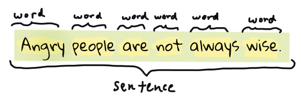

<!--
CO_OP_TRANSLATOR_METADATA:
{
  "original_hash": "6534e145d52a3890590d27be75386e5d",
  "translation_date": "2025-08-29T18:19:51+00:00",
  "source_file": "6-NLP/2-Tasks/README.md",
  "language_code": "ne"
}
-->
# सामान्य प्राकृतिक भाषा प्रशोधन कार्यहरू र प्रविधिहरू

प्रायः *प्राकृतिक भाषा प्रशोधन* कार्यहरूको लागि, प्रशोधन गर्नुपर्ने पाठलाई टुक्र्याउन, जाँच गर्न, र परिणामहरू नियमहरू र डाटा सेटहरूसँग भण्डारण वा क्रस रेफरेन्स गर्न आवश्यक हुन्छ। यी कार्यहरूले प्रोग्रामरलाई पाठमा शब्दहरूको _अर्थ_, _उद्देश्य_, वा केवल _आवृत्ति_ प्राप्त गर्न अनुमति दिन्छ।

## [पाठ अघि क्विज](https://gray-sand-07a10f403.1.azurestaticapps.net/quiz/33/)

आउनुहोस्, पाठ प्रशोधनमा प्रयोग गरिने सामान्य प्रविधिहरू पत्ता लगाऔं। मेशिन लर्निङसँग मिलेर, यी प्रविधिहरूले ठूलो मात्रामा पाठलाई प्रभावकारी रूपमा विश्लेषण गर्न मद्दत गर्छ। तर, यी कार्यहरूमा मेशिन लर्निङ लागू गर्नु अघि, प्राकृतिक भाषा प्रशोधन विशेषज्ञले सामना गर्ने समस्याहरू बुझौं।

## NLP मा सामान्य कार्यहरू

तपाईंले काम गरिरहेको पाठलाई विश्लेषण गर्न विभिन्न तरिकाहरू छन्। तपाईंले केही कार्यहरू गर्न सक्नुहुन्छ, र ती कार्यहरू मार्फत पाठको समझ प्राप्त गर्न र निष्कर्ष निकाल्न सक्नुहुन्छ। सामान्यतया, यी कार्यहरू क्रमबद्ध रूपमा गरिन्छ।

### टोकनाइजेशन

शायद अधिकांश NLP एल्गोरिदमले गर्नुपर्ने पहिलो काम भनेको पाठलाई टोकनहरू, वा शब्दहरूमा विभाजन गर्नु हो। यो सरल लाग्न सक्छ, तर विराम चिन्ह र विभिन्न भाषाहरूको शब्द र वाक्य सीमाहरूलाई ध्यानमा राख्नुपर्ने हुँदा यो जटिल हुन सक्छ। तपाईंले सीमांकन निर्धारण गर्न विभिन्न विधिहरू प्रयोग गर्नुपर्ने हुन सक्छ।


> **Pride and Prejudice** बाट वाक्य टोकनाइज गर्दै। [Jen Looper](https://twitter.com/jenlooper) द्वारा इन्फोग्राफिक।

### एम्बेडिङहरू

[शब्द एम्बेडिङहरू](https://wikipedia.org/wiki/Word_embedding) तपाईंको पाठ डाटालाई संख्यात्मक रूपमा रूपान्तरण गर्ने तरिका हो। एम्बेडिङहरू यसरी गरिन्छ कि समान अर्थ भएका वा सँगै प्रयोग गरिएका शब्दहरू समूहमा आउँछन्।


> "I have the highest respect for your nerves, they are my old friends." - **Pride and Prejudice** बाट वाक्यको शब्द एम्बेडिङ। [Jen Looper](https://twitter.com/jenlooper) द्वारा इन्फोग्राफिक।

✅ [यो रोचक उपकरण](https://projector.tensorflow.org/) प्रयोग गरेर शब्द एम्बेडिङहरूमा प्रयोग गर्नुहोस्। कुनै शब्दमा क्लिक गर्दा समान शब्दहरूको समूह देखिन्छ: 'toy' 'disney', 'lego', 'playstation', र 'console' सँग समूहमा आउँछ।

### पार्सिङ र पार्ट-अफ-स्पीच ट्यागिङ

टोकनाइज गरिएको प्रत्येक शब्दलाई पार्ट-अफ-स्पीच (जस्तै, नाउन, भर्ब, वा एड्जेक्टिभ) को रूपमा ट्याग गर्न सकिन्छ। वाक्य `the quick red fox jumped over the lazy brown dog` लाई POS ट्यागिङ गर्दा fox = नाउन, jumped = भर्ब हुन सक्छ।


> **Pride and Prejudice** बाट वाक्य पार्स गर्दै। [Jen Looper](https://twitter.com/jenlooper) द्वारा इन्फोग्राफिक।

पार्सिङ भनेको वाक्यमा कुन शब्दहरू एकअर्कासँग सम्बन्धित छन् भनेर चिन्ने प्रक्रिया हो - उदाहरणका लागि `the quick red fox jumped` एड्जेक्टिभ-नाउन-भर्ब अनुक्रम हो जुन `lazy brown dog` अनुक्रमबाट अलग छ।

### शब्द र वाक्यांश आवृत्तिहरू

ठूलो पाठको विश्लेषण गर्दा प्रत्येक शब्द वा रुचिको वाक्यांशको शब्दकोश निर्माण गर्नु र यसको आवृत्ति कति पटक देखा पर्छ भनेर गणना गर्नु उपयोगी प्रक्रिया हो। वाक्यांश `the quick red fox jumped over the lazy brown dog` मा `the` को शब्द आवृत्ति 2 छ।

आउनुहोस्, शब्द आवृत्ति गणना गर्ने उदाहरण पाठ हेरौं। Rudyard Kipling को कविता **The Winners** मा निम्न श्लोक समावेश छ:

```output
What the moral? Who rides may read.
When the night is thick and the tracks are blind
A friend at a pinch is a friend, indeed,
But a fool to wait for the laggard behind.
Down to Gehenna or up to the Throne,
He travels the fastest who travels alone.
```

जसरी वाक्यांश आवृत्तिहरू केस इन्सेन्सिटिभ वा केस सेन्सिटिभ हुन सक्छ, वाक्यांश `a friend` को आवृत्ति 2 छ, `the` को आवृत्ति 6 छ, र `travels` को आवृत्ति 2 छ।

### एन-ग्रामहरू

पाठलाई निश्चित लम्बाइको शब्दहरूको अनुक्रममा विभाजन गर्न सकिन्छ, एकल शब्द (युनिग्राम), दुई शब्द (बाइग्राम), तीन शब्द (ट्राइग्राम) वा कुनै पनि संख्या (एन-ग्राम)।

उदाहरणका लागि, `the quick red fox jumped over the lazy brown dog` लाई एन-ग्राम स्कोर 2 मा विभाजन गर्दा निम्न एन-ग्रामहरू प्राप्त हुन्छन्:

1. the quick  
2. quick red  
3. red fox  
4. fox jumped  
5. jumped over  
6. over the  
7. the lazy  
8. lazy brown  
9. brown dog  

यसलाई वाक्यमा स्लाइडिङ बक्सको रूपमा देखाउन सजिलो हुन सक्छ। यहाँ 3 शब्दको एन-ग्रामको लागि छ, प्रत्येक वाक्यमा एन-ग्रामलाई **बोल्ड** गरिएको छ:

1.   <u>**the quick red**</u> fox jumped over the lazy brown dog  
2.   the **<u>quick red fox</u>** jumped over the lazy brown dog  
3.   the quick **<u>red fox jumped</u>** over the lazy brown dog  
4.   the quick red **<u>fox jumped over</u>** the lazy brown dog  
5.   the quick red fox **<u>jumped over the</u>** lazy brown dog  
6.   the quick red fox jumped **<u>over the lazy</u>** brown dog  
7.   the quick red fox jumped over <u>**the lazy brown**</u> dog  
8.   the quick red fox jumped over the **<u>lazy brown dog</u>**  


> एन-ग्राम मान 3: [Jen Looper](https://twitter.com/jenlooper) द्वारा इन्फोग्राफिक।

### नाउन वाक्यांश निकाल्ने

प्रायः वाक्यहरूमा एउटा नाउन हुन्छ जुन वाक्यको विषय वा वस्तु हो। अंग्रेजीमा, यो प्रायः 'a', 'an', वा 'the' ले पहिचान गर्न सकिन्छ। वाक्यको अर्थ बुझ्न प्रयास गर्दा 'नाउन वाक्यांश निकाल्ने' NLP मा सामान्य कार्य हो।

✅ वाक्य "I cannot fix on the hour, or the spot, or the look or the words, which laid the foundation. It is too long ago. I was in the middle before I knew that I had begun." मा नाउन वाक्यांशहरू पहिचान गर्न सक्नुहुन्छ?

वाक्य `the quick red fox jumped over the lazy brown dog` मा 2 नाउन वाक्यांशहरू छन्: **quick red fox** र **lazy brown dog**।

### भावना विश्लेषण

वाक्य वा पाठलाई *सकारात्मक* वा *नकारात्मक* कति छ भनेर विश्लेषण गर्न सकिन्छ। भावना *पोलारिटी* र *वस्तुनिष्ठता/विषयवस्तुता* मा मापन गरिन्छ। पोलारिटी -1.0 देखि 1.0 (नकारात्मकदेखि सकारात्मक) र 0.0 देखि 1.0 (अधिकतम वस्तुनिष्ठदेखि अधिकतम विषयवस्तु) मा मापन गरिन्छ।

✅ पछि तपाईंले मेशिन लर्निङ प्रयोग गरेर भावना निर्धारण गर्ने विभिन्न तरिकाहरू सिक्नुहुनेछ, तर एउटा तरिका भनेको मानव विशेषज्ञले सकारात्मक वा नकारात्मक वर्गीकृत गरेका शब्द र वाक्यांशहरूको सूची बनाउनु हो र त्यस मोडेललाई पाठमा लागू गरेर पोलारिटी स्कोर गणना गर्नु हो। के तपाईं देख्न सक्नुहुन्छ कि यो केही परिस्थितिमा कसरी काम गर्छ र अन्यमा कम प्रभावकारी हुन्छ?

### इन्फ्लेक्सन

इन्फ्लेक्सनले तपाईंलाई शब्दको एकवचन वा बहुवचन प्राप्त गर्न सक्षम बनाउँछ।

### लेमाटाइजेशन

*लेमा* भनेको शब्दहरूको सेटको मूल वा मुख्य शब्द हो, उदाहरणका लागि *flew*, *flies*, *flying* को लेमा *fly* हो।

त्यसैगरी, NLP अनुसन्धानकर्ताका लागि उपयोगी डाटाबेसहरू उपलब्ध छन्, विशेष गरी:

### वर्डनेट

[WordNet](https://wordnet.princeton.edu/) शब्दहरू, पर्यायवाची, विपरीतार्थक, र विभिन्न भाषाहरूका प्रत्येक शब्दको धेरै अन्य विवरणहरूको डाटाबेस हो। अनुवाद, स्पेल चेकर, वा कुनै पनि प्रकारको भाषा उपकरण निर्माण गर्दा यो अत्यन्त उपयोगी छ।

## NLP पुस्तकालयहरू

सौभाग्यवश, तपाईंले यी प्रविधिहरू आफैं निर्माण गर्नुपर्दैन, किनकि उत्कृष्ट Python पुस्तकालयहरू उपलब्ध छन् जसले प्राकृतिक भाषा प्रशोधन वा मेशिन लर्निङमा विशेषज्ञ नभएका विकासकर्ताहरूलाई धेरै पहुँचयोग्य बनाउँछ। आगामी पाठहरूमा यीको थप उदाहरणहरू समावेश छन्, तर यहाँ तपाईंलाई अर्को कार्यमा मद्दत गर्न केही उपयोगी उदाहरणहरू सिकाइन्छ।

### अभ्यास - `TextBlob` पुस्तकालय प्रयोग गर्दै

आउनुहोस्, TextBlob नामक पुस्तकालय प्रयोग गरौं किनकि यसमा यस्ता कार्यहरू समाधान गर्न उपयोगी API हरू समावेश छन्। TextBlob "[NLTK](https://nltk.org) र [pattern](https://github.com/clips/pattern) को विशाल काधमा उभिन्छ, र दुवैसँग राम्रोसँग काम गर्छ।" यसको API मा धेरै मेशिन लर्निङ समावेश छ।

> नोट: TextBlob को उपयोगी [Quick Start](https://textblob.readthedocs.io/en/dev/quickstart.html#quickstart) गाइड अनुभवी Python विकासकर्ताहरूका लागि सिफारिस गरिएको छ।

नाउन वाक्यांशहरू पहिचान गर्ने प्रयास गर्दा, TextBlob ले नाउन वाक्यांशहरू फेला पार्न विभिन्न विकल्पहरू प्रदान गर्दछ।

1. `ConllExtractor` हेर्नुहोस्।

    ```python
    from textblob import TextBlob
    from textblob.np_extractors import ConllExtractor
    # import and create a Conll extractor to use later 
    extractor = ConllExtractor()
    
    # later when you need a noun phrase extractor:
    user_input = input("> ")
    user_input_blob = TextBlob(user_input, np_extractor=extractor)  # note non-default extractor specified
    np = user_input_blob.noun_phrases                                    
    ```

    > यहाँ के भइरहेको छ? [ConllExtractor](https://textblob.readthedocs.io/en/dev/api_reference.html?highlight=Conll#textblob.en.np_extractors.ConllExtractor) "एक नाउन वाक्यांश एक्स्ट्र्याक्टर हो जसले ConLL-2000 प्रशिक्षण कर्पसको साथ प्रशिक्षित चंक पार्सिङ प्रयोग गर्दछ।" ConLL-2000 Computational Natural Language Learning को 2000 सम्मेलनलाई जनाउँछ। प्रत्येक वर्ष सम्मेलनले एक जटिल NLP समस्यालाई समाधान गर्न कार्यशाला आयोजना गर्‍यो, र 2000 मा यो नाउन चंकिङ थियो। एक मोडेल Wall Street Journal मा प्रशिक्षित गरिएको थियो, "सेक्शन 15-18 लाई प्रशिक्षण डाटा (211727 टोकन) र सेक्शन 20 लाई परीक्षण डाटा (47377 टोकन) को रूपमा प्रयोग गर्दै।" तपाईंले प्रयोग गरिएका प्रक्रियाहरू [यहाँ](https://www.clips.uantwerpen.be/conll2000/chunking/) र [परिणामहरू](https://ifarm.nl/erikt/research/np-chunking.html) हेर्न सक्नुहुन्छ।

### चुनौती - NLP प्रयोग गरेर तपाईंको बोट सुधार गर्दै

अघिल्लो पाठमा तपाईंले एकदम सरल Q&A बोट निर्माण गर्नुभयो। अब, तपाईंले Marvin लाई अलि बढी सहानुभूतिपूर्ण बनाउनुहुनेछ जसले तपाईंको इनपुटको भावना विश्लेषण गर्छ र त्यस अनुसार प्रतिक्रिया दिन्छ। तपाईंले `noun_phrase` पनि पहिचान गर्नुपर्नेछ र त्यस विषयमा थप इनपुट सोध्नुपर्नेछ।

तपाईंको बोट निर्माण गर्दा चरणहरू:

1. प्रयोगकर्तालाई बोटसँग कसरी अन्तरक्रिया गर्ने भनेर निर्देशन प्रिन्ट गर्नुहोस्।  
2. लूप सुरु गर्नुहोस्।  
   1. प्रयोगकर्ता इनपुट स्वीकार गर्नुहोस्।  
   2. यदि प्रयोगकर्ताले बाहिर जान सोधेको छ भने, बाहिर जानुहोस्।  
   3. प्रयोगकर्ता इनपुट प्रशोधन गर्नुहोस् र उपयुक्त भावना प्रतिक्रिया निर्धारण गर्नुहोस्।  
   4. यदि भावना मा नाउन वाक्यांश पत्ता लाग्छ भने, त्यसलाई बहुवचन बनाउनुहोस् र त्यस विषयमा थप इनपुट सोध्नुहोस्।  
   5. प्रतिक्रिया प्रिन्ट गर्नुहोस्।  
3. चरण 2 मा फर्कनुहोस्।  

TextBlob प्रयोग गरेर भावना निर्धारण गर्न कोड स्निपेट यहाँ छ। नोट गर्नुहोस् कि केवल चार *ग्रेडिएन्टहरू* छन् (तपाईं चाहनुहुन्छ भने थप बनाउन सक्नुहुन्छ):

```python
if user_input_blob.polarity <= -0.5:
  response = "Oh dear, that sounds bad. "
elif user_input_blob.polarity <= 0:
  response = "Hmm, that's not great. "
elif user_input_blob.polarity <= 0.5:
  response = "Well, that sounds positive. "
elif user_input_blob.polarity <= 1:
  response = "Wow, that sounds great. "
```

नमूना आउटपुट यहाँ छ (प्रयोगकर्ता इनपुट > बाट सुरु हुने लाइनहरूमा छ):

```output
Hello, I am Marvin, the friendly robot.
You can end this conversation at any time by typing 'bye'
After typing each answer, press 'enter'
How are you today?
> I am ok
Well, that sounds positive. Can you tell me more?
> I went for a walk and saw a lovely cat
Well, that sounds positive. Can you tell me more about lovely cats?
> cats are the best. But I also have a cool dog
Wow, that sounds great. Can you tell me more about cool dogs?
> I have an old hounddog but he is sick
Hmm, that's not great. Can you tell me more about old hounddogs?
> bye
It was nice talking to you, goodbye!
```

कार्यको सम्भावित समाधान [यहाँ](https://github.com/microsoft/ML-For-Beginners/blob/main/6-NLP/2-Tasks/solution/bot.py) छ।

✅ ज्ञान जाँच

1. के तपाईं सोच्नुहुन्छ कि सहानुभूतिपूर्ण प्रतिक्रियाहरूले कसैलाई बोटले वास्तवमै उनीहरूलाई बुझ्यो भनेर 'छल' गर्न सक्छ?  
2. के नाउन वाक्यांश पहिचान गर्दा बोटलाई 'विश्वसनीय' बनाउँछ?  
3. वाक्यबाट 'नाउन वाक्यांश' निकाल्नु उपयोगी किन हुन्छ?  

---

अघिल्लो ज्ञान जाँचमा बोट कार्यान्वयन गर्नुहोस् र यसलाई साथीमा परीक्षण गर्नुहोस्। के यसले उनीहरूलाई छल गर्न सक्छ? के तपाईं आफ्नो बोटलाई अझ 'विश्वसनीय' बनाउन सक्नुहुन्छ?

## 🚀 चुनौती

अघिल्लो ज्ञान जाँचमा कार्य लिनुहोस् र यसलाई कार्यान्वयन गर्ने प्रयास गर्नुहोस्। बोटलाई साथीमा परीक्षण गर्नुहोस्। के यसले उनीहरूलाई छल गर्न सक्छ? के तपाईं आफ्नो बोटलाई अझ 'विश्वसनीय' बनाउन सक्नुहुन्छ?

## [पाठ पछि क्विज](https://gray-sand-07a10f403.1.azurestaticapps.net/quiz/34/)

## समीक्षा र आत्म अध्ययन

अगामी केही पाठहरूमा तपाईं भावना विश्लेषणको बारेमा थप जान्नुहुनेछ। [KDNuggets](https://www.kdnuggets.com/tag/nlp) मा लेखहरू जस्ता रोचक प्रविधिहरू अनुसन्धान गर्नुहोस्।

## असाइनमेन्ट 

[बोटलाई कुरा गर्न बनाउनुहोस्](assignment.md)

---

**अस्वीकरण**:  
यो दस्तावेज़ AI अनुवाद सेवा [Co-op Translator](https://github.com/Azure/co-op-translator) प्रयोग गरेर अनुवाद गरिएको छ। हामी शुद्धताको लागि प्रयास गर्छौं, तर कृपया ध्यान दिनुहोस् कि स्वचालित अनुवादहरूमा त्रुटि वा अशुद्धता हुन सक्छ। यसको मूल भाषा मा रहेको मूल दस्तावेज़लाई आधिकारिक स्रोत मानिनुपर्छ। महत्वपूर्ण जानकारीको लागि, व्यावसायिक मानव अनुवाद सिफारिस गरिन्छ। यस अनुवादको प्रयोगबाट उत्पन्न हुने कुनै पनि गलतफहमी वा गलत व्याख्याको लागि हामी जिम्मेवार हुने छैनौं।