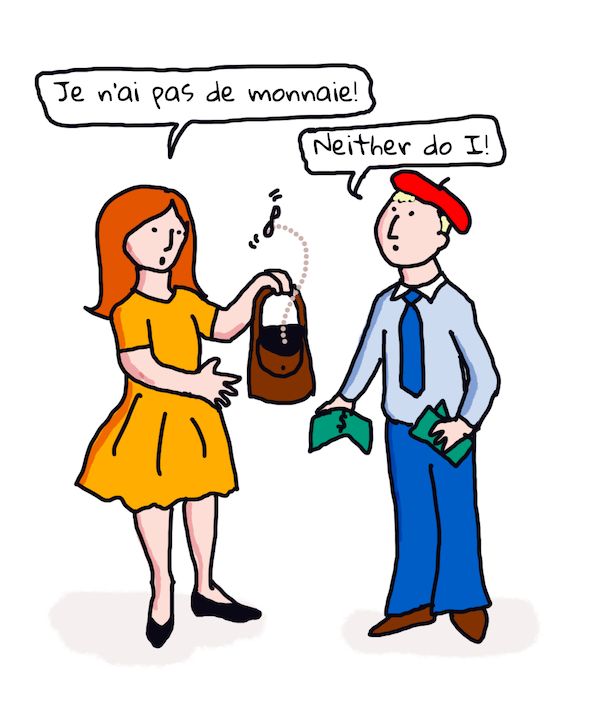

<!--
CO_OP_TRANSLATOR_METADATA:
{
  "original_hash": "6396d5d8617572cd2ac1de74fb0deb22",
  "translation_date": "2025-08-29T18:33:57+00:00",
  "source_file": "6-NLP/3-Translation-Sentiment/README.md",
  "language_code": "ne"
}
-->
# अनुवाद र भावना विश्लेषण मेसिन लर्निङसँग

अघिल्लो पाठहरूमा तपाईंले `TextBlob` प्रयोग गरेर एउटा आधारभूत बोट कसरी निर्माण गर्ने भनेर सिक्नुभयो, जुन पुस्तकालयले नामवाचक वाक्यांश निकाल्नेजस्ता आधारभूत NLP कार्यहरू गर्न मेसिन लर्निङलाई पर्दा पछाडि प्रयोग गर्छ। कम्प्युटेशनल भाषाविज्ञानको अर्को महत्त्वपूर्ण चुनौती भनेको एउटा बोलीचाली वा लेखिएको भाषाबाट अर्को भाषामा वाक्यको सही _अनुवाद_ गर्नु हो।

## [पाठपूर्व प्रश्नोत्तरी](https://gray-sand-07a10f403.1.azurestaticapps.net/quiz/35/)

अनुवाद एकदमै कठिन समस्या हो, किनभने संसारमा हजारौं भाषाहरू छन् र प्रत्येकको व्याकरण नियमहरू फरक हुन सक्छ। एउटा दृष्टिकोण भनेको एउटा भाषाको औपचारिक व्याकरण नियमहरूलाई, जस्तै अंग्रेजी, भाषामा निर्भर नभएको संरचनामा रूपान्तरण गर्नु हो, र त्यसपछि अर्को भाषामा अनुवाद गर्नु हो। यस दृष्टिकोणले निम्न चरणहरू समेट्छ:

1. **पहिचान**। इनपुट भाषाका शब्दहरूलाई नाम, क्रिया आदि भनेर चिन्हित गर्नु।
2. **अनुवाद सिर्जना गर्नुहोस्**। लक्ष्य भाषाको ढाँचामा प्रत्येक शब्दको प्रत्यक्ष अनुवाद उत्पादन गर्नु।

### उदाहरण वाक्य, अंग्रेजीबाट आयरिशमा

'अंग्रेजी'मा, वाक्य _I feel happy_ तीन शब्दहरूमा हुन्छ:

- **विषय** (I)
- **क्रिया** (feel)
- **विशेषण** (happy)

तर, 'आयरिश' भाषामा, त्यही वाक्यको व्याकरण संरचना धेरै फरक छ - "*happy*" वा "*sad*" जस्ता भावनाहरूलाई तपाईंमाथि *छ* भनेर व्यक्त गरिन्छ।

अंग्रेजी वाक्यांश `I feel happy` आयरिशमा `Tá athas orm` हुन्छ। *शाब्दिक* अनुवाद `Happy is upon me` हुनेछ।

आयरिश बोल्ने व्यक्तिले अंग्रेजीमा अनुवाद गर्दा `I feel happy` भन्छ, `Happy is upon me` होइन, किनभने उनीहरूले वाक्यको अर्थ बुझ्छन्, शब्द र वाक्य संरचना फरक भए पनि।

आयरिशमा वाक्यको औपचारिक क्रम यस्तो छ:

- **क्रिया** (Tá वा is)
- **विशेषण** (athas, वा happy)
- **विषय** (orm, वा upon me)

## अनुवाद

एउटा साधारण अनुवाद कार्यक्रमले वाक्य संरचनालाई बेवास्ता गर्दै केवल शब्दहरू अनुवाद गर्न सक्छ।

✅ यदि तपाईंले वयस्कको रूपमा दोस्रो (वा तेस्रो वा थप) भाषा सिक्नुभएको छ भने, तपाईंले आफ्नो मातृभाषामा सोचेर, एउटा शब्दलाई अर्को भाषामा अनुवाद गरेर, र त्यसपछि आफ्नो अनुवाद बोल्न सुरु गर्नुभएको हुन सक्छ। यो नै साधारण अनुवाद कम्प्युटर कार्यक्रमहरूले गर्ने जस्तै हो। यो चरण पार गर्न र धाराप्रवाह बन्न महत्त्वपूर्ण छ!

साधारण अनुवादले खराब (र कहिलेकाहीँ हास्यास्पद) अनुवादहरू जन्माउँछ: `I feel happy` आयरिशमा शाब्दिक रूपमा `Mise bhraitheann athas` मा अनुवाद हुन्छ। यसको अर्थ (शाब्दिक रूपमा) `me feel happy` हो र यो मान्य आयरिश वाक्य होइन। अंग्रेजी र आयरिश दुई नजिकका टापुहरूमा बोलिने भाषाहरू भए पनि, तिनीहरू व्याकरण संरचनामा धेरै फरक छन्।

> तपाईं आयरिश भाषिक परम्पराहरूको बारेमा [यो भिडियो](https://www.youtube.com/watch?v=mRIaLSdRMMs) जस्ता केही भिडियोहरू हेर्न सक्नुहुन्छ।

### मेसिन लर्निङ दृष्टिकोणहरू

अहिलेसम्म, तपाईंले प्राकृतिक भाषा प्रशोधनको औपचारिक नियम दृष्टिकोणको बारेमा सिक्नुभएको छ। अर्को दृष्टिकोण भनेको शब्दहरूको अर्थलाई बेवास्ता गर्नु हो, र _यसको सट्टा ढाँचाहरू पत्ता लगाउन मेसिन लर्निङ प्रयोग गर्नु हो।_ यदि तपाईंसँग धेरै पाठ (एक *corpus*) वा पाठहरू (*corpora*) मूल र लक्ष्य भाषामा छन् भने यो अनुवादमा काम गर्न सक्छ।

उदाहरणका लागि, *Pride and Prejudice* को केसलाई विचार गर्नुहोस्, जुन 1813 मा जेन अस्टेनद्वारा लेखिएको एक प्रसिद्ध अंग्रेजी उपन्यास हो। यदि तपाईंले यो पुस्तकलाई अंग्रेजीमा र *फ्रेन्च*मा मानव अनुवादमा परामर्श गर्नुभयो भने, तपाईंले एउटा भाषामा भएका वाक्यांशहरूलाई अर्को भाषामा _idiomatically_ अनुवाद गरिएको पत्ता लगाउन सक्नुहुन्छ। तपाईंले यो केही समयपछि गर्नुहुनेछ।

उदाहरणका लागि, जब अंग्रेजी वाक्यांश `I have no money` लाई फ्रेन्चमा शाब्दिक रूपमा अनुवाद गरिन्छ, यो `Je n'ai pas de monnaie` हुन सक्छ। "Monnaie" फ्रेन्चको एक जटिल 'false cognate' हो, किनभने 'money' र 'monnaie' समानार्थी छैनन्। मानवले गर्न सक्ने राम्रो अनुवाद `Je n'ai pas d'argent` हुनेछ, किनभने यसले तपाईंसँग पैसा छैन भन्ने अर्थलाई राम्रोसँग व्यक्त गर्छ (बरु 'loose change' जसको अर्थ 'monnaie' हो)।



> छवि [Jen Looper](https://twitter.com/jenlooper) द्वारा

यदि कुनै ML मोडेलसँग दुवै भाषाका विशेषज्ञ मानव वक्ताहरूले पहिले अनुवाद गरेका पाठहरू पर्याप्त छन् भने, यसले पाठहरूमा सामान्य ढाँचाहरू पहिचान गरेर अनुवादको शुद्धता सुधार गर्न सक्छ।

### अभ्यास - अनुवाद

तपाईं वाक्यहरू अनुवाद गर्न `TextBlob` प्रयोग गर्न सक्नुहुन्छ। **Pride and Prejudice** को प्रसिद्ध पहिलो लाइन प्रयास गर्नुहोस्:

```python
from textblob import TextBlob

blob = TextBlob(
    "It is a truth universally acknowledged, that a single man in possession of a good fortune, must be in want of a wife!"
)
print(blob.translate(to="fr"))

```

`TextBlob` ले अनुवाद राम्रोसँग गर्छ: "C'est une vérité universellement reconnue, qu'un homme célibataire en possession d'une bonne fortune doit avoir besoin d'une femme!". 

यो तर्क गर्न सकिन्छ कि TextBlob को अनुवाद वास्तवमा 1932 मा V. Leconte र Ch. Pressoir द्वारा गरिएको फ्रेन्च अनुवादभन्दा धेरै सटीक छ:

"C'est une vérité universelle qu'un célibataire pourvu d'une belle fortune doit avoir envie de se marier, et, si peu que l'on sache de son sentiment à cet egard, lorsqu'il arrive dans une nouvelle résidence, cette idée est si bien fixée dans l'esprit de ses voisins qu'ils le considèrent sur-le-champ comme la propriété légitime de l'une ou l'autre de leurs filles."

यस अवस्थामा, ML द्वारा सूचित अनुवादले मानव अनुवादकलाई भन्दा राम्रो काम गर्छ, जसले 'स्पष्टता' को लागि अनावश्यक रूपमा मूल लेखकको शब्दहरू थपिरहेको छ।

> यहाँ के भइरहेको छ? र TextBlob अनुवादमा किन यति राम्रो छ? खैर, पर्दा पछाडि, यो Google Translate प्रयोग गर्दैछ, एक परिष्कृत AI जसले लाखौं वाक्यांशहरूलाई विश्लेषण गर्न र कार्यको लागि उत्तम स्ट्रिङहरू भविष्यवाणी गर्न सक्षम छ। यहाँ केही म्यानुअल भइरहेको छैन र तपाईंलाई `blob.translate` प्रयोग गर्न इन्टरनेट कनेक्शन आवश्यक छ।

✅ केही थप वाक्यहरू प्रयास गर्नुहोस्। कुन राम्रो छ, ML वा मानव अनुवाद? कुन अवस्थामा?

## भावना विश्लेषण

मेसिन लर्निङले राम्रोसँग काम गर्न सक्ने अर्को क्षेत्र भनेको भावना विश्लेषण हो। भावना विश्लेषणको गैर-ML दृष्टिकोण भनेको 'सकारात्मक' र 'नकारात्मक' शब्द र वाक्यांशहरू पहिचान गर्नु हो। त्यसपछि, नयाँ पाठ दिइएमा, सकारात्मक, नकारात्मक र तटस्थ शब्दहरूको कुल मान गणना गरेर समग्र भावना पहिचान गर्नु हो। 

यो दृष्टिकोण सजिलै छलिन्छ, जस्तै तपाईंले Marvin कार्यमा देख्नुभएको हुन सक्छ - वाक्य `Great, that was a wonderful waste of time, I'm glad we are lost on this dark road` व्यंग्यात्मक, नकारात्मक भावना वाक्य हो, तर साधारण एल्गोरिदमले 'great', 'wonderful', 'glad' लाई सकारात्मक र 'waste', 'lost' र 'dark' लाई नकारात्मक रूपमा पत्ता लगाउँछ। यी विरोधाभासी शब्दहरूले समग्र भावनालाई प्रभावित गर्छ।

✅ एकछिन रोक्नुहोस् र हामी मानव वक्ताहरूले व्यंग्य कसरी व्यक्त गर्छौं भनेर सोच्नुहोस्। स्वरको उतारचढावले ठूलो भूमिका खेल्छ। वाक्यांश "Well, that film was awesome" लाई विभिन्न तरिकामा भन्न प्रयास गर्नुहोस् र तपाईंको स्वरले अर्थ कसरी व्यक्त गर्छ भनेर पत्ता लगाउनुहोस्।

### ML दृष्टिकोणहरू

ML दृष्टिकोण भनेको नकारात्मक र सकारात्मक पाठहरूको म्यानुअल रूपमा सङ्कलन गर्नु हो - ट्वीटहरू, वा फिल्म समीक्षाहरू, वा कुनै पनि जहाँ मानवले स्कोर *र* लेखिएको राय दिएको छ। त्यसपछि NLP प्रविधिहरू राय र स्कोरहरूमा लागू गर्न सकिन्छ, ताकि ढाँचाहरू देखा पर्छन् (उदाहरणका लागि, सकारात्मक फिल्म समीक्षाहरूमा 'Oscar worthy' वाक्यांश नकारात्मक फिल्म समीक्षाहरूभन्दा बढी हुन्छ, वा सकारात्मक रेस्टुरेन्ट समीक्षाहरूमा 'gourmet' 'disgusting' भन्दा धेरै हुन्छ)।

> ⚖️ **उदाहरण**: यदि तपाईं कुनै राजनीतिज्ञको कार्यालयमा काम गर्नुहुन्छ र कुनै नयाँ कानुन छलफल भइरहेको छ भने, नागरिकहरूले कार्यालयमा समर्थन गर्ने वा विशेष नयाँ कानुनको विरुद्धमा इमेल लेख्न सक्छन्। मानौं तपाईंलाई इमेलहरू पढेर तिनीहरूलाई २ थुप्रोमा वर्गीकृत गर्ने जिम्मा दिइएको छ, *पक्षमा* र *विरुद्धमा*। यदि धेरै इमेलहरू भए, तपाईं तिनीहरू सबै पढ्न प्रयास गर्दा अभिभूत हुन सक्नुहुन्छ। यदि एउटा बोटले तिनीहरू सबै पढ्न, बुझ्न र प्रत्येक इमेल कुन थुप्रोमा पर्छ भनेर भन्न सक्थ्यो भने कस्तो हुन्थ्यो? 
> 
> यो प्राप्त गर्ने एउटा तरिका भनेको मेसिन लर्निङ प्रयोग गर्नु हो। तपाईंले मोडेललाई *विरुद्धमा* इमेलहरूको एक भाग र *पक्षमा* इमेलहरूको एक भागसँग प्रशिक्षण दिनुहुनेछ। मोडेलले विरुद्ध पक्ष र पक्ष पक्षसँग वाक्यांश र शब्दहरूलाई सम्बन्धित गर्न झुकाव राख्नेछ, *तर यसले कुनै पनि सामग्री बुझ्ने छैन*, केवल निश्चित शब्दहरू र ढाँचाहरू *विरुद्धमा* वा *पक्षमा* इमेलमा देखा पर्ने सम्भावना बढी छ। तपाईंले यसलाई केही इमेलहरूसँग परीक्षण गर्न सक्नुहुन्छ जुन तपाईंले मोडेललाई प्रशिक्षण दिन प्रयोग गर्नुभएको थिएन, र यसले तपाईंले जस्तै निष्कर्षमा पुग्छ कि छैन भनेर हेर्न सक्नुहुन्छ। त्यसपछि, एकपटक तपाईं मोडेलको शुद्धताबाट सन्तुष्ट भएपछि, तपाईंले भविष्यका इमेलहरू प्रत्येक पढ्न नपरी प्रशोधन गर्न सक्नुहुन्छ।

✅ के यो प्रक्रिया तपाईंले अघिल्लो पाठहरूमा प्रयोग गरेका प्रक्रियाहरू जस्तै लाग्छ?

## अभ्यास - भावनात्मक वाक्यहरू

भावना *ध्रुवीयता* -1 देखि 1 मा मापन गरिन्छ, जसको अर्थ -1 सबैभन्दा नकारात्मक भावना हो, र 1 सबैभन्दा सकारात्मक। भावना 0 - 1 स्कोरसँग वस्तुनिष्ठता (0) र व्यक्तिपरकता (1) को लागि पनि मापन गरिन्छ।

जेन अस्टेनको *Pride and Prejudice* लाई फेरि हेर्नुहोस्। पाठ यहाँ [Project Gutenberg](https://www.gutenberg.org/files/1342/1342-h/1342-h.htm) मा उपलब्ध छ। तलको नमूनाले पुस्तकको पहिलो र अन्तिम वाक्यहरूको भावना विश्लेषण गर्ने र यसको भावना ध्रुवीयता र व्यक्तिपरकता/वस्तुनिष्ठता स्कोर प्रदर्शन गर्ने छोटो कार्यक्रम देखाउँछ।

तपाईंले `TextBlob` पुस्तकालय (माथि वर्णन गरिएको) प्रयोग गरेर निम्न कार्यमा `sentiment` निर्धारण गर्नुपर्छ (तपाईंले आफ्नै भावना गणक लेख्न आवश्यक छैन)।

```python
from textblob import TextBlob

quote1 = """It is a truth universally acknowledged, that a single man in possession of a good fortune, must be in want of a wife."""

quote2 = """Darcy, as well as Elizabeth, really loved them; and they were both ever sensible of the warmest gratitude towards the persons who, by bringing her into Derbyshire, had been the means of uniting them."""

sentiment1 = TextBlob(quote1).sentiment
sentiment2 = TextBlob(quote2).sentiment

print(quote1 + " has a sentiment of " + str(sentiment1))
print(quote2 + " has a sentiment of " + str(sentiment2))
```

तपाईंले निम्न आउटपुट देख्नुहुन्छ:

```output
It is a truth universally acknowledged, that a single man in possession of a good fortune, must be in want # of a wife. has a sentiment of Sentiment(polarity=0.20952380952380953, subjectivity=0.27142857142857146)

Darcy, as well as Elizabeth, really loved them; and they were
     both ever sensible of the warmest gratitude towards the persons
      who, by bringing her into Derbyshire, had been the means of
      uniting them. has a sentiment of Sentiment(polarity=0.7, subjectivity=0.8)
```

## चुनौती - भावना ध्रुवीयता जाँच गर्नुहोस्

तपाईंको कार्य भनेको भावना ध्रुवीयता प्रयोग गरेर निर्धारण गर्नु हो कि *Pride and Prejudice* मा पूर्ण रूपमा सकारात्मक वाक्यहरू पूर्ण रूपमा नकारात्मक वाक्यहरूभन्दा बढी छन्। यस कार्यका लागि, तपाईंले ध्रुवीयता स्कोर 1 वा -1 लाई पूर्ण रूपमा सकारात्मक वा नकारात्मक मान्न सक्नुहुन्छ।

**चरणहरू:**

1. [Pride and Prejudice](https://www.gutenberg.org/files/1342/1342-h/1342-h.htm) को प्रतिलिपि Project Gutenberg बाट .txt फाइलको रूपमा डाउनलोड गर्नुहोस्। फाइलको सुरुवात र अन्त्यमा रहेको मेटाडाटा हटाउनुहोस्, केवल मूल पाठ छोडेर।
2. Python मा फाइल खोल्नुहोस् र सामग्रीलाई स्ट्रिङको रूपमा निकाल्नुहोस्।
3. पुस्तक स्ट्रिङ प्रयोग गरेर TextBlob सिर्जना गर्नुहोस्।
4. पुस्तकको प्रत्येक वाक्यलाई लूपमा विश्लेषण गर्नुहोस्।
   1. यदि ध्रुवीयता 1 वा -1 छ भने वाक्यलाई सकारात्मक वा नकारात्मक सन्देशहरूको सूचीमा भण्डारण गर्नुहोस्।
5. अन्त्यमा, सबै सकारात्मक वाक्यहरू र नकारात्मक वाक्यहरू (अलग-अलग) र प्रत्येकको संख्या प्रिन्ट गर्नुहोस्।

यहाँ एउटा नमूना [समाधान](https://github.com/microsoft/ML-For-Beginners/blob/main/6-NLP/3-Translation-Sentiment/solution/notebook.ipynb) छ।

✅ ज्ञान जाँच

1. भावना वाक्यमा प्रयोग भएका शब्दहरूमा आधारित छ, तर के कोडले शब्दहरू *बुझ्छ*?
2. के तपाईंलाई भावना ध्रुवीयता सही लाग्छ, वा अन्य शब्दमा, के तपाईं स्कोरहरूसँग *सहमत* हुनुहुन्छ?
   1. विशेष गरी, के तपाईं निम्न वाक्यहरूको पूर्ण रूपमा **सकारात्मक** ध्रुवीयतासँग सहमत हुनुहुन्छ वा असहमत हुनुहुन्छ?
      * “What an excellent father you have, girls!” said she, when the door was shut.
      * “Your examination of Mr. Darcy is over, I presume,” said Miss Bingley; “and pray what is the result?” “I am perfectly convinced by it that Mr. Darcy has no defect.
      * How wonderfully these sort of things occur!
      * I have the greatest dislike in the world to that sort of thing.
      * Charlotte is an excellent manager, I dare say.
      * “This is delightful indeed!
      * I am so happy!
      * Your idea of the ponies is delightful.
   2. निम्न ३ वाक्यहरूलाई पूर्ण रूपमा सकारात्मक भावना स्कोर गरिएको थियो, तर नजिकबाट पढ्दा, ती सकारात्मक वाक्यहरू होइनन्। भावना विश्लेषणले ती सकारात्मक वाक्यहरू किन ठान्यो?
      * Happy shall I be, when his stay at Netherfield is over!” “I wish I could say anything to comfort you,” replied Elizabeth; “but it is wholly out of my power.
      * If I could but see you as happy!
      * Our distress, my dear Lizzy, is very great.
   3. के तपाईं निम्न वाक्यहरूको पूर्ण रूपमा **नकारात्मक** ध्रुवीयतासँग सहमत हुनुहुन्छ वा असहमत हुनुहुन्छ?
      - Everybody is disgusted with his pride.
      - “I should like to know how he behaves among strangers.” “You shall hear then—but prepare yourself for something very dreadful.
      - The pause was to Elizabeth’s feelings dreadful.
      - It would be dreadful!

✅ जेन अस्टेनका कुनै पनि प्रशंसकलाई थाहा छ कि उनले प्रायः आफ्ना पुस्तकहरू अंग्रेजी रीजेन्सी समाजका हास्यास्पद पक्षहरूको आलोचना गर्न प्रयोग गर्छिन्। *Pride and Prejudice* की मुख्य पात्र एलिजाबेथ बेनेट (लेखक जस्तै) एक कुशल सामाजिक पर्यवेक्षक हुन् र उनको भाषा प्रायः गहिरो अर्थपूर्ण हुन्छ। यहाँसम्म कि मिस्टर डार्सी (कथाको प्रेम पात्र) ले पनि एलिजाबेथको खेलकुदपूर्ण र चिढ्याउने भाषाको प्रयोगलाई नोट गर्छन्: "I have had the pleasure of your acquaintance long enough to know that you find great enjoyment in occasionally professing opinions which in fact are not your own."

---

## 🚀 चुनौती

के तपाईं Marvin लाई अझ राम्रो बनाउन प्रयोगकर्ताको इनपुटबाट अन्य विशेषताहरू निकाल्न सक्नुहुन्छ?

## [पाठपछिको प्रश्नोत्तरी](https://gray-sand-07a10f403.1.azurestaticapps.net/quiz/36/)

## समीक्षा र आत्म-अध्ययन
पाठबाट भावना निकाल्ने धेरै तरिकाहरू छन्। यस प्रविधिको प्रयोग गर्ने व्यवसायिक अनुप्रयोगहरूको बारेमा सोच्नुहोस्। यसले कसरी गलत हुन सक्छ भन्ने कुरा पनि विचार गर्नुहोस्। भावना विश्लेषण गर्ने परिष्कृत उद्यम-तयार प्रणालीहरूको बारेमा थप पढ्नुहोस् जस्तै [Azure Text Analysis](https://docs.microsoft.com/azure/cognitive-services/Text-Analytics/how-tos/text-analytics-how-to-sentiment-analysis?tabs=version-3-1?WT.mc_id=academic-77952-leestott)। माथिका Pride and Prejudice का केही वाक्यहरू परीक्षण गर्नुहोस् र यसले सूक्ष्मता पत्ता लगाउन सक्छ कि सक्दैन हेर्नुहोस्।

## असाइनमेन्ट 

[Poetic license](assignment.md)

---

**अस्वीकरण**:  
यो दस्तावेज़ AI अनुवाद सेवा [Co-op Translator](https://github.com/Azure/co-op-translator) प्रयोग गरेर अनुवाद गरिएको छ। हामी शुद्धताको लागि प्रयास गर्छौं, तर कृपया ध्यान दिनुहोस् कि स्वचालित अनुवादमा त्रुटिहरू वा अशुद्धताहरू हुन सक्छ। यसको मूल भाषा मा रहेको मूल दस्तावेज़लाई आधिकारिक स्रोत मानिनुपर्छ। महत्वपूर्ण जानकारीको लागि, व्यावसायिक मानव अनुवाद सिफारिस गरिन्छ। यस अनुवादको प्रयोगबाट उत्पन्न हुने कुनै पनि गलतफहमी वा गलत व्याख्याको लागि हामी जिम्मेवार हुने छैनौं।