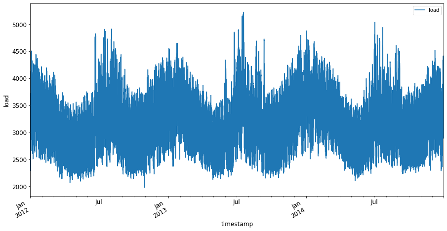

<!--
CO_OP_TRANSLATOR_METADATA:
{
  "original_hash": "3150d40f36a77857316ecaed5f31e856",
  "translation_date": "2025-08-29T17:02:34+00:00",
  "source_file": "7-TimeSeries/1-Introduction/README.md",
  "language_code": "ne"
}
-->
# समय श्रृंखला पूर्वानुमानको परिचय


> स्केच नोट: [टोमोमी इमुरा](https://www.twitter.com/girlie_mac)

यस पाठ र अर्को पाठमा, तपाईं समय श्रृंखला पूर्वानुमानको बारेमा केही सिक्नुहुनेछ, जुन एक रोचक र मूल्यवान मेसिन लर्निङ वैज्ञानिकको ज्ञानको हिस्सा हो, तर अन्य विषयहरूभन्दा अलि कम परिचित छ। समय श्रृंखला पूर्वानुमान एक प्रकारको 'क्रिस्टल बल' जस्तै हो: मूल्य जस्तो कुनै चरको विगतको प्रदर्शनको आधारमा, तपाईं यसको भविष्यको सम्भावित मूल्यको भविष्यवाणी गर्न सक्नुहुन्छ।

[](https://youtu.be/cBojo1hsHiI "समय श्रृंखला पूर्वानुमानको परिचय")

> 🎥 माथिको तस्बिरमा क्लिक गरेर समय श्रृंखला पूर्वानुमानको बारेमा भिडियो हेर्नुहोस्

## [पाठ अघि क्विज](https://gray-sand-07a10f403.1.azurestaticapps.net/quiz/41/)

यो एउटा उपयोगी र रोचक क्षेत्र हो जसले व्यवसायलाई वास्तविक मूल्य दिन्छ, किनभने यसको मूल्य निर्धारण, भण्डारण, र आपूर्ति श्रृंखला समस्याहरूमा प्रत्यक्ष प्रयोग हुन्छ। गहिरो सिकाइ प्रविधिहरूले भविष्यको प्रदर्शनलाई अझ राम्रोसँग भविष्यवाणी गर्न थप जानकारी प्राप्त गर्न प्रयोग गर्न थालिएको भए पनि, समय श्रृंखला पूर्वानुमान अझै पनि क्लासिक मेसिन लर्निङ प्रविधिहरूद्वारा धेरै सूचित क्षेत्र हो।

> पेन स्टेटको उपयोगी समय श्रृंखला पाठ्यक्रम [यहाँ](https://online.stat.psu.edu/stat510/lesson/1) फेला पार्न सकिन्छ।

## परिचय

मानौं तपाईंले स्मार्ट पार्किङ मिटरहरूको एउटा समूह व्यवस्थापन गर्नुहुन्छ, जसले समयसँगै तिनीहरूको प्रयोग र अवधि सम्बन्धी डेटा प्रदान गर्दछ।

> के तपाईं मिटरको विगतको प्रदर्शनको आधारमा, आपूर्ति र मागको नियम अनुसार यसको भविष्यको मूल्य भविष्यवाणी गर्न सक्नुहुन्छ?

तपाईंको लक्ष्य प्राप्त गर्न कहिले कार्य गर्नुपर्छ भन्ने कुरा सही रूपमा भविष्यवाणी गर्नु समय श्रृंखला पूर्वानुमानद्वारा समाधान गर्न सकिने चुनौती हो। व्यस्त समयमा पार्किङ स्थान खोज्दै गर्दा बढी शुल्क तिर्नु पर्ने कुरा मानिसहरूलाई खुसी बनाउने छैन, तर यो सडक सफा गर्न राजस्व उत्पन्न गर्ने निश्चित उपाय हुनेछ!

अब, समय श्रृंखला एल्गोरिदमका केही प्रकारहरू अन्वेषण गरौं र केही डेटा सफा र तयार गर्न नोटबुक सुरु गरौं। तपाईंले विश्लेषण गर्ने डेटा GEFCom2014 पूर्वानुमान प्रतियोगिताबाट लिइएको हो। यसमा २०१२ देखि २०१४ सम्मको ३ वर्षको घण्टाको आधारमा बिजुली लोड र तापक्रमको मानहरू समावेश छन्। बिजुली लोड र तापक्रमको ऐतिहासिक ढाँचाहरूलाई ध्यानमा राख्दै, तपाईं बिजुली लोडको भविष्यको मानहरूको भविष्यवाणी गर्न सक्नुहुन्छ।

यस उदाहरणमा, तपाईंले केवल ऐतिहासिक लोड डेटा प्रयोग गरेर एक समय चरण अगाडि भविष्यवाणी गर्न सिक्नुहुनेछ। तर सुरु गर्नु अघि, पर्दा पछाडि के भइरहेको छ भन्ने कुरा बुझ्नु उपयोगी हुन्छ।

## केही परिभाषाहरू

'समय श्रृंखला' भन्ने शब्द सुन्दा, तपाईंले यसलाई विभिन्न सन्दर्भहरूमा प्रयोग भएको बुझ्न आवश्यक छ।

🎓 **समय श्रृंखला**

गणितमा, "समय श्रृंखला भनेको समयको क्रममा अनुक्रमित (वा सूचीबद्ध वा ग्राफ गरिएको) डेटा बिन्दुहरूको श्रृंखला हो। प्रायः, समय श्रृंखला भनेको समयको समान अन्तरालमा लिइएको अनुक्रम हो।" समय श्रृंखलाको उदाहरण भनेको [डाउ जोन्स औद्योगिक औसत](https://wikipedia.org/wiki/Time_series) को दैनिक बन्द मूल्य हो। समय श्रृंखला प्लट र सांख्यिकीय मोडेलिङको प्रयोग प्रायः सिग्नल प्रोसेसिङ, मौसम पूर्वानुमान, भूकम्प भविष्यवाणी, र अन्य क्षेत्रहरूमा गरिन्छ, जहाँ घटनाहरू हुन्छन् र डेटा बिन्दुहरू समयसँगै प्लट गर्न सकिन्छ।

🎓 **समय श्रृंखला विश्लेषण**

समय श्रृंखला विश्लेषण भनेको माथि उल्लिखित समय श्रृंखला डेटा विश्लेषण हो। समय श्रृंखला डेटा फरक-फरक रूप लिन सक्छ, जस्तै 'अवरोधित समय श्रृंखला', जसले अवरोधक घटनाको अघि र पछि समय श्रृंखलाको विकासमा ढाँचाहरू पत्ता लगाउँछ। समय श्रृंखलाको लागि आवश्यक विश्लेषण, डेटा प्रकृतिमा निर्भर गर्दछ। समय श्रृंखला डेटा आफैंले संख्याहरू वा वर्णहरूको श्रृंखलाको रूपमा रूप लिन सक्छ।

विश्लेषण गर्नका लागि विभिन्न विधिहरू प्रयोग गरिन्छ, जस्तै फ्रिक्वेन्सी-डोमेन र टाइम-डोमेन, रेखीय र गैर-रेखीय, र अन्य। [थप जान्नुहोस्](https://www.itl.nist.gov/div898/handbook/pmc/section4/pmc4.htm) यस प्रकारको डेटा विश्लेषण गर्ने धेरै तरिकाहरूको बारेमा।

🎓 **समय श्रृंखला पूर्वानुमान**

समय श्रृंखला पूर्वानुमान भनेको विगतमा संकलित डेटा द्वारा देखाइएका ढाँचाहरूको आधारमा भविष्यका मानहरूको भविष्यवाणी गर्न मोडेलको प्रयोग हो। समय श्रृंखला डेटा अन्वेषण गर्न रिग्रेसन मोडेलहरू प्रयोग गर्न सम्भव भए पनि, समय सूचकांकहरूलाई प्लटमा x चरको रूपमा प्रयोग गरेर, यस्तो डेटा विशेष प्रकारका मोडेलहरू प्रयोग गरेर विश्लेषण गर्न उत्तम हुन्छ।

समय श्रृंखला डेटा भनेको क्रमबद्ध अवलोकनहरूको सूची हो, जुन रेखीय रिग्रेसनद्वारा विश्लेषण गर्न सकिने डेटा जस्तो हुँदैन। सबैभन्दा सामान्य मोडेल ARIMA हो, जसको अर्थ "ऑटोरेग्रेसिभ इन्टिग्रेटेड मुभिङ एभरेज" हो।

[ARIMA मोडेलहरू](https://online.stat.psu.edu/stat510/lesson/1/1.1) "श्रृंखलाको वर्तमान मानलाई विगतका मानहरू र विगतका भविष्यवाणी त्रुटिहरूसँग सम्बन्धित गर्दछ।" यी मोडेलहरू समय-डोमेन डेटा विश्लेषण गर्न सबैभन्दा उपयुक्त हुन्छन्, जहाँ डेटा समयसँगै क्रमबद्ध हुन्छ।

> ARIMA मोडेलका विभिन्न प्रकारहरू छन्, जुन तपाईं [यहाँ](https://people.duke.edu/~rnau/411arim.htm) सिक्न सक्नुहुन्छ र अर्को पाठमा तपाईंले यसबारे थप जान्नुहुनेछ।

अर्को पाठमा, तपाईं [Univariate Time Series](https://itl.nist.gov/div898/handbook/pmc/section4/pmc44.htm) प्रयोग गरेर ARIMA मोडेल निर्माण गर्नुहुनेछ, जसले समयसँगै आफ्नो मान परिवर्तन गर्ने एक चरमा ध्यान केन्द्रित गर्दछ। यस्तो प्रकारको डेटाको उदाहरण [यो डेटासेट](https://itl.nist.gov/div898/handbook/pmc/section4/pmc4411.htm) हो, जसले Mauna Loa Observatory मा मासिक CO2 एकाग्रता रेकर्ड गर्दछ:

|  CO2   | YearMonth | Year  | Month |
| :----: | :-------: | :---: | :---: |
| 330.62 |  1975.04  | 1975  |   1   |
| 331.40 |  1975.13  | 1975  |   2   |
| 331.87 |  1975.21  | 1975  |   3   |
| 333.18 |  1975.29  | 1975  |   4   |
| 333.92 |  1975.38  | 1975  |   5   |
| 333.43 |  1975.46  | 1975  |   6   |
| 331.85 |  1975.54  | 1975  |   7   |
| 330.01 |  1975.63  | 1975  |   8   |
| 328.51 |  1975.71  | 1975  |   9   |
| 328.41 |  1975.79  | 1975  |  10   |
| 329.25 |  1975.88  | 1975  |  11   |
| 330.97 |  1975.96  | 1975  |  12   |

✅ यस डेटासेटमा समयसँगै परिवर्तन हुने चर पहिचान गर्नुहोस्।

## समय श्रृंखला डेटाका विशेषताहरू विचार गर्न

समय श्रृंखला डेटा हेर्दा, तपाईंले यसमा [केही विशेषताहरू](https://online.stat.psu.edu/stat510/lesson/1/1.1) देख्न सक्नुहुन्छ, जसलाई तपाईंले यसको ढाँचाहरू राम्रोसँग बुझ्नका लागि ध्यान दिन र कम गर्न आवश्यक पर्छ। यदि तपाईं समय श्रृंखला डेटालाई सम्भावित रूपमा 'सिग्नल' प्रदान गर्ने रूपमा विचार गर्नुहुन्छ, जसलाई तपाईं विश्लेषण गर्न चाहनुहुन्छ, यी विशेषताहरूलाई 'हल्ला' मान्न सकिन्छ। तपाईंले प्रायः केही सांख्यिकीय प्रविधिहरू प्रयोग गरेर यस 'हल्ला' लाई कम गर्न आवश्यक पर्छ।

यहाँ समय श्रृंखलासँग काम गर्न जान्नुपर्ने केही अवधारणाहरू छन्:

🎓 **प्रवृत्ति (Trends)**

प्रवृत्ति भनेको समयसँगै मापन गर्न सकिने वृद्धि र कमी हो। [थप पढ्नुहोस्](https://machinelearningmastery.com/time-series-trends-in-python)। समय श्रृंखलाको सन्दर्भमा, यो कसरी प्रयोग गर्ने र, आवश्यक परेमा, समय श्रृंखलाबाट प्रवृत्तिहरू हटाउने बारे हो।

🎓 **[मौसमीपन (Seasonality)](https://machinelearningmastery.com/time-series-seasonality-with-python/)**

मौसमीपन भनेको आवधिक उतारचढाव हो, जस्तै छुट्टीको समयमा बिक्रीमा पर्ने प्रभाव। [हेर्नुहोस्](https://itl.nist.gov/div898/handbook/pmc/section4/pmc443.htm) कसरी विभिन्न प्रकारका प्लटहरूले डेटामा मौसमीपन देखाउँछन्।

🎓 **असामान्य मान (Outliers)**

असामान्य मान भनेको मानक डेटा भिन्नताबाट धेरै टाढा हुने मान हो।

🎓 **दीर्घकालीन चक्र (Long-run cycle)**

मौसमीपनबाट स्वतन्त्र, डेटाले दीर्घकालीन चक्र देखाउन सक्छ, जस्तै एक वर्षभन्दा लामो समयसम्म चल्ने आर्थिक मन्दी।

🎓 **निरन्तर भिन्नता (Constant variance)**

समयसँगै, केही डेटाले दिन र रातको ऊर्जा प्रयोगजस्तै निरन्तर उतारचढाव देखाउँछ।

🎓 **अचानक परिवर्तन (Abrupt changes)**

डेटाले अचानक परिवर्तन देखाउन सक्छ, जसलाई थप विश्लेषण आवश्यक पर्न सक्छ। उदाहरणका लागि, COVID का कारण व्यवसायहरू अचानक बन्द हुँदा डेटामा परिवर्तन आएको थियो।

✅ [यहाँ](https://www.kaggle.com/kashnitsky/topic-9-part-1-time-series-analysis-in-python) दैनिक इन-गेम मुद्रा खर्चको केही वर्षको समय श्रृंखला प्लट छ। के तपाईं माथि सूचीबद्ध विशेषताहरू मध्ये कुनै पनि यस डेटामा पहिचान गर्न सक्नुहुन्छ?


## अभ्यास - बिजुली प्रयोग डेटा सुरु गर्दै

आउनुहोस्, विगतको प्रयोगलाई ध्यानमा राख्दै भविष्यको बिजुली प्रयोगको भविष्यवाणी गर्न समय श्रृंखला मोडेल सिर्जना गर्न सुरु गरौं।

> यस उदाहरणमा प्रयोग गरिएको डेटा GEFCom2014 पूर्वानुमान प्रतियोगिताबाट लिइएको हो। यसमा २०१२ देखि २०१४ सम्मको ३ वर्षको घण्टाको आधारमा बिजुली लोड र तापक्रमको मानहरू समावेश छन्।
>
> ताओ हङ, पियरे पिन्सन, शु फ्यान, हमिद्रेजा जारेइपोर, अल्बर्टो ट्रोक्कोली र रोब जे. हाइन्डम्यान, "सम्भावित ऊर्जा पूर्वानुमान: ग्लोबल ऊर्जा पूर्वानुमान प्रतियोगिता २०१४ र त्यसपछि", अन्तर्राष्ट्रिय पूर्वानुमान पत्रिका, खण्ड ३२, संख्या ३, पृष्ठ ८९६-९१३, जुलाई-सेप्टेम्बर, २०१६।

1. यस पाठको `working` फोल्डरमा, _notebook.ipynb_ फाइल खोल्नुहोस्। डेटा लोड गर्न र दृश्यात्मक बनाउन मद्दत गर्ने पुस्तकालयहरू थपेर सुरु गर्नुहोस्:

    ```python
    import os
    import matplotlib.pyplot as plt
    from common.utils import load_data
    %matplotlib inline
    ```

    ध्यान दिनुहोस्, तपाईंले समावेश गरिएको `common` फोल्डरबाट फाइलहरू प्रयोग गर्दै हुनुहुन्छ, जसले तपाईंको वातावरण सेटअप गर्दछ र डेटा डाउनलोड गर्न ह्यान्डल गर्दछ।

2. त्यसपछि, `load_data()` र `head()` कल गरेर डेटा फ्रेमको रूपमा जाँच गर्नुहोस्:

    ```python
    data_dir = './data'
    energy = load_data(data_dir)[['load']]
    energy.head()
    ```

    तपाईंले देख्न सक्नुहुन्छ कि त्यहाँ मिति र लोड प्रतिनिधित्व गर्ने दुई स्तम्भहरू छन्:

    |                     |  load  |
    | :-----------------: | :----: |
    | 2012-01-01 00:00:00 | 2698.0 |
    | 2012-01-01 01:00:00 | 2558.0 |
    | 2012-01-01 02:00:00 | 2444.0 |
    | 2012-01-01 03:00:00 | 2402.0 |
    | 2012-01-01 04:00:00 | 2403.0 |

3. अब, `plot()` कल गरेर डेटा प्लट गर्नुहोस्:

    ```python
    energy.plot(y='load', subplots=True, figsize=(15, 8), fontsize=12)
    plt.xlabel('timestamp', fontsize=12)
    plt.ylabel('load', fontsize=12)
    plt.show()
    ```

    

4. अब, २०१४ को जुलाईको पहिलो हप्ता प्लट गर्नुहोस्, `energy` मा `[from date]: [to date]` ढाँचामा इनपुट प्रदान गरेर:

    ```python
    energy['2014-07-01':'2014-07-07'].plot(y='load', subplots=True, figsize=(15, 8), fontsize=12)
    plt.xlabel('timestamp', fontsize=12)
    plt.ylabel('load', fontsize=12)
    plt.show()
    ```

    

    एक सुन्दर प्लट! यी प्लटहरू हेर्नुहोस् र माथि सूचीबद्ध विशेषताहरू मध्ये कुनै पनि डेटामा पहिचान गर्न सक्नुहुन्छ कि भनेर हेर्नुहोस्। डेटा दृश्यात्मक गरेर हामी के निष्कर्ष निकाल्न सक्छौं?

अर्को पाठमा, तपाईं ARIMA मोडेल सिर्जना गरेर केही पूर्वानुमान बनाउनुहुनेछ।

---

## 🚀 चुनौती

तपाईंले सोच्न सक्ने सबै उद्योग र अनुसन्धानका क्षेत्रहरूको सूची बनाउनुहोस्, जसले समय श्रृंखला पूर्वानुमानबाट फाइदा लिन सक्छ। के तपाईं यी प्रविधिहरूको प्रयोग कलामा, अर्थशास्त्रमा, पारिस्थितिकीमा, खुद्रा व्यापारमा, उद्योगमा, वित्तमा, वा अन्यत्र गर्न सकिने कुनै अनुप्रयोग सोच्न सक्नुहुन्छ?

## [पाठ पछि क्विज](https://gray-sand-07a10f403.1.azurestaticapps.net/quiz/42/)

## समीक्षा र आत्म-अध्ययन

यद्यपि हामी यहाँ कभर गर्ने छैनौं, न्यूरल नेटवर्कहरू कहिलेकाहीँ समय श्रृंखला पूर्वानुमानका क्लासिक विधिहरूलाई सुधार गर्न प्रयोग गरिन्छ। [यस लेखमा](https://medium.com/microsoftazure/neural-networks-for-forecasting-financial-and-economic-time-series-6aca370ff412) तिनीहरूको बारेमा थप पढ्नुहोस्।

## असाइनमेन्ट

[थप समय श्रृंखला दृश्यात्मक गर्नुहोस्](assignment.md)

---

**अस्वीकरण**:  
यो दस्तावेज़ AI अनुवाद सेवा [Co-op Translator](https://github.com/Azure/co-op-translator) प्रयोग गरेर अनुवाद गरिएको हो। हामी शुद्धताको लागि प्रयास गर्छौं, तर कृपया ध्यान दिनुहोस् कि स्वचालित अनुवादमा त्रुटिहरू वा अशुद्धताहरू हुन सक्छ। यसको मूल भाषा मा रहेको मूल दस्तावेज़लाई आधिकारिक स्रोत मानिनुपर्छ। महत्वपूर्ण जानकारीको लागि, व्यावसायिक मानव अनुवाद सिफारिस गरिन्छ। यस अनुवादको प्रयोगबाट उत्पन्न हुने कुनै पनि गलतफहमी वा गलत व्याख्याको लागि हामी जिम्मेवार हुने छैनौं।