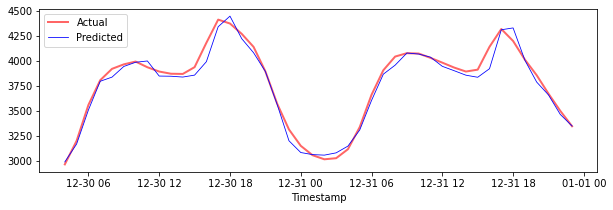

<!--
CO_OP_TRANSLATOR_METADATA:
{
  "original_hash": "f80e513b3279869e7661e3190cc83076",
  "translation_date": "2025-08-29T17:06:19+00:00",
  "source_file": "7-TimeSeries/3-SVR/README.md",
  "language_code": "ne"
}
-->
# समर्थन भेक्टर रिग्रेसरको साथ समय श्रृंखला पूर्वानुमान

अघिल्लो पाठमा, तपाईंले ARIMA मोडेल प्रयोग गरेर समय श्रृंखला भविष्यवाणी कसरी गर्ने भनेर सिक्नुभयो। अब तपाईं समर्थन भेक्टर रिग्रेसर मोडेल हेर्नेछौं, जुन निरन्तर डेटा भविष्यवाणी गर्न प्रयोग गरिने रिग्रेसर मोडेल हो।

## [पाठ अघि क्विज](https://gray-sand-07a10f403.1.azurestaticapps.net/quiz/51/) 

## परिचय

यस पाठमा, तपाईंले [**SVM**: **S**upport **V**ector **M**achine](https://en.wikipedia.org/wiki/Support-vector_machine) को प्रयोग गरेर रिग्रेसनका लागि मोडेल निर्माण गर्ने विशिष्ट तरिका पत्ता लगाउनुहुनेछ, जसलाई **SVR: Support Vector Regressor** भनिन्छ।

### समय श्रृंखलाको सन्दर्भमा SVR [^1]

समय श्रृंखला भविष्यवाणीमा SVR को महत्त्व बुझ्नुअघि, तपाईंले जान्नुपर्ने केही महत्त्वपूर्ण अवधारणाहरू यहाँ छन्:

- **रिग्रेसन:** सुपरभाइज्ड लर्निङ प्रविधि जसले दिइएको इनपुट सेटबाट निरन्तर मानहरू भविष्यवाणी गर्दछ। विचार भनेको फिचर स्पेसमा अधिकतम डेटा पोइन्टहरू भएको वक्र (वा रेखा) फिट गर्नु हो। [थप जानकारीको लागि यहाँ क्लिक गर्नुहोस्](https://en.wikipedia.org/wiki/Regression_analysis)।
- **समर्थन भेक्टर मेसिन (SVM):** सुपरभाइज्ड मेसिन लर्निङ मोडेलको प्रकार, जुन वर्गीकरण, रिग्रेसन र आउटलायर डिटेक्सनका लागि प्रयोग गरिन्छ। मोडेल फिचर स्पेसमा हाइपरप्लेन हो, जुन वर्गीकरणको अवस्थामा सीमा र रिग्रेसनको अवस्थामा उत्तम फिट रेखाको रूपमा कार्य गर्दछ। SVM मा, सामान्यतया केर्नेल फङ्सन प्रयोग गरिन्छ जसले डेटासेटलाई उच्च आयामको स्पेसमा रूपान्तरण गर्दछ ताकि तिनीहरू सजिलै छुट्याउन सकिन्छ। [SVM को बारेमा थप जानकारीको लागि यहाँ क्लिक गर्नुहोस्](https://en.wikipedia.org/wiki/Support-vector_machine)।
- **समर्थन भेक्टर रिग्रेसर (SVR):** SVM को प्रकार, जसले अधिकतम डेटा पोइन्टहरू भएको उत्तम फिट रेखा (SVM को अवस्थामा हाइपरप्लेन) पत्ता लगाउँछ।

### किन SVR? [^1]

अन्तिम पाठमा तपाईंले ARIMA को बारेमा सिक्नुभयो, जुन समय श्रृंखला डेटा पूर्वानुमान गर्न धेरै सफल सांख्यिकीय रेखीय विधि हो। तर, धेरै अवस्थामा, समय श्रृंखला डेटा *गैर-रेखीयता* हुन्छ, जसलाई रेखीय मोडेलहरूले म्याप गर्न सक्दैन। यस्ता अवस्थामा, रिग्रेसन कार्यहरूको लागि डेटा भित्रको गैर-रेखीयता विचार गर्न SVM को क्षमता SVR लाई समय श्रृंखला पूर्वानुमानमा सफल बनाउँछ।

## अभ्यास - SVR मोडेल निर्माण गर्नुहोस्

डेटा तयारीका लागि पहिलो केही चरणहरू [ARIMA](https://github.com/microsoft/ML-For-Beginners/tree/main/7-TimeSeries/2-ARIMA) को अघिल्लो पाठको जस्तै छन्।

यस पाठको [_/working_](https://github.com/microsoft/ML-For-Beginners/tree/main/7-TimeSeries/3-SVR/working) फोल्डर खोल्नुहोस् र [_notebook.ipynb_](https://github.com/microsoft/ML-For-Beginners/blob/main/7-TimeSeries/3-SVR/working/notebook.ipynb) फाइल फेला पार्नुहोस्।[^2]

1. नोटबुक चलाउनुहोस् र आवश्यक लाइब्रेरीहरू आयात गर्नुहोस्: [^2]

   ```python
   import sys
   sys.path.append('../../')
   ```

   ```python
   import os
   import warnings
   import matplotlib.pyplot as plt
   import numpy as np
   import pandas as pd
   import datetime as dt
   import math
   
   from sklearn.svm import SVR
   from sklearn.preprocessing import MinMaxScaler
   from common.utils import load_data, mape
   ```

2. `/data/energy.csv` फाइलबाट डेटा पाण्डास डाटाफ्रेममा लोड गर्नुहोस् र हेर्नुहोस्: [^2]

   ```python
   energy = load_data('../../data')[['load']]
   ```

3. जनवरी 2012 देखि डिसेम्बर 2014 सम्मको सबै उपलब्ध ऊर्जा डेटा प्लट गर्नुहोस्: [^2]

   ```python
   energy.plot(y='load', subplots=True, figsize=(15, 8), fontsize=12)
   plt.xlabel('timestamp', fontsize=12)
   plt.ylabel('load', fontsize=12)
   plt.show()
   ```

   

   अब, हामी हाम्रो SVR मोडेल निर्माण गर्नेछौं।

### प्रशिक्षण र परीक्षण डेटासेटहरू सिर्जना गर्नुहोस्

अब तपाईंको डेटा लोड भएको छ, त्यसैले तपाईं यसलाई ट्रेन र टेस्ट सेटहरूमा छुट्याउन सक्नुहुन्छ। त्यसपछि तपाईंले डेटा पुन:आकार दिनुहुनेछ ताकि समय-चरण आधारित डेटासेट सिर्जना गर्न सकियोस्, जुन SVR को लागि आवश्यक हुनेछ। तपाईंले आफ्नो मोडेललाई ट्रेन सेटमा प्रशिक्षण दिनुहुनेछ। मोडेलले प्रशिक्षण समाप्त गरेपछि, तपाईंले यसको सटीकता प्रशिक्षण सेट, परीक्षण सेट र त्यसपछि पूर्ण डेटासेटमा मूल्याङ्कन गर्नुहुनेछ ताकि समग्र प्रदर्शन देख्न सकियोस्। तपाईंले सुनिश्चित गर्नुपर्छ कि परीक्षण सेटले प्रशिक्षण सेटको पछिल्लो समय अवधि समेट्छ ताकि मोडेलले भविष्यको समय अवधिबाट जानकारी प्राप्त नगरोस् [^2] (*ओभरफिटिङ* भनिने स्थिति)।

1. सेप्टेम्बर 1 देखि अक्टोबर 31, 2014 सम्मको दुई महिनाको अवधि प्रशिक्षण सेटमा छुट्याउनुहोस्। परीक्षण सेटले नोभेम्बर 1 देखि डिसेम्बर 31, 2014 सम्मको दुई महिनाको अवधि समेट्नेछ: [^2]

   ```python
   train_start_dt = '2014-11-01 00:00:00'
   test_start_dt = '2014-12-30 00:00:00'
   ```

2. भिन्नताहरू दृश्यात्मक बनाउनुहोस्: [^2]

   ```python
   energy[(energy.index < test_start_dt) & (energy.index >= train_start_dt)][['load']].rename(columns={'load':'train'}) \
       .join(energy[test_start_dt:][['load']].rename(columns={'load':'test'}), how='outer') \
       .plot(y=['train', 'test'], figsize=(15, 8), fontsize=12)
   plt.xlabel('timestamp', fontsize=12)
   plt.ylabel('load', fontsize=12)
   plt.show()
   ```

   

### प्रशिक्षणका लागि डेटा तयार गर्नुहोस्

अब, तपाईंले आफ्नो डेटा प्रशिक्षणका लागि तयार गर्न फिल्टरिङ र स्केलिङ गर्नुपर्नेछ। तपाईंको डेटासेटलाई आवश्यक समय अवधि र स्तम्भहरू मात्र समावेश गर्न फिल्टर गर्नुहोस्, र स्केलिङ गरेर डेटा 0,1 को अन्तरालमा प्रक्षेपण गर्नुहोस्।

1. मूल डेटासेटलाई फिल्टर गरेर मात्र आवश्यक समय अवधि र स्तम्भ 'लोड' र मिति समावेश गर्नुहोस्: [^2]

   ```python
   train = energy.copy()[(energy.index >= train_start_dt) & (energy.index < test_start_dt)][['load']]
   test = energy.copy()[energy.index >= test_start_dt][['load']]
   
   print('Training data shape: ', train.shape)
   print('Test data shape: ', test.shape)
   ```

   ```output
   Training data shape:  (1416, 1)
   Test data shape:  (48, 1)
   ```
   
2. प्रशिक्षण डेटा स्केल गरेर (0, 1) को दायरामा ल्याउनुहोस्: [^2]

   ```python
   scaler = MinMaxScaler()
   train['load'] = scaler.fit_transform(train)
   ```
   
4. अब, परीक्षण डेटा स्केल गर्नुहोस्: [^2]

   ```python
   test['load'] = scaler.transform(test)
   ```

### समय-चरणको साथ डेटा सिर्जना गर्नुहोस् [^1]

SVR को लागि, तपाईंले इनपुट डेटा `[batch, timesteps]` को रूपमा रूपान्तरण गर्नुहुन्छ। त्यसैले, तपाईंले विद्यमान `train_data` र `test_data` लाई पुन:आकार दिनुहुन्छ ताकि त्यहाँ नयाँ आयाम हो, जुन समय-चरणलाई जनाउँछ।

```python
# Converting to numpy arrays
train_data = train.values
test_data = test.values
```

यस उदाहरणका लागि, हामी `timesteps = 5` लिन्छौं। त्यसैले, मोडेलका इनपुटहरू पहिलो 4 समय-चरणका लागि डेटा हुन्, र आउटपुट 5औं समय-चरणका लागि डेटा हुनेछ।

```python
timesteps=5
```

प्रशिक्षण डेटा 2D टेन्सरमा रूपान्तरण गर्दै:

```python
train_data_timesteps=np.array([[j for j in train_data[i:i+timesteps]] for i in range(0,len(train_data)-timesteps+1)])[:,:,0]
train_data_timesteps.shape
```

```output
(1412, 5)
```

परीक्षण डेटा 2D टेन्सरमा रूपान्तरण गर्दै:

```python
test_data_timesteps=np.array([[j for j in test_data[i:i+timesteps]] for i in range(0,len(test_data)-timesteps+1)])[:,:,0]
test_data_timesteps.shape
```

```output
(44, 5)
```

प्रशिक्षण र परीक्षण डेटा बाट इनपुट र आउटपुट चयन गर्दै:

```python
x_train, y_train = train_data_timesteps[:,:timesteps-1],train_data_timesteps[:,[timesteps-1]]
x_test, y_test = test_data_timesteps[:,:timesteps-1],test_data_timesteps[:,[timesteps-1]]

print(x_train.shape, y_train.shape)
print(x_test.shape, y_test.shape)
```

```output
(1412, 4) (1412, 1)
(44, 4) (44, 1)
```

### SVR कार्यान्वयन गर्नुहोस् [^1]

अब, SVR कार्यान्वयन गर्ने समय हो। यस कार्यान्वयनको बारेमा थप पढ्न, तपाईं [यो दस्तावेज](https://scikit-learn.org/stable/modules/generated/sklearn.svm.SVR.html) सन्दर्भ गर्न सक्नुहुन्छ। हाम्रो कार्यान्वयनका लागि, हामी यी चरणहरू अनुसरण गर्छौं:

  1. `SVR()` कल गरेर र मोडेल हाइपरप्यारामिटरहरू: केर्नेल, गामा, c र एप्सिलन पास गरेर मोडेल परिभाषित गर्नुहोस्।
  2. `fit()` फङ्सन कल गरेर प्रशिक्षण डेटा तयार गर्नुहोस्।
  3. `predict()` फङ्सन कल गरेर भविष्यवाणी गर्नुहोस्।

अब हामी SVR मोडेल सिर्जना गर्छौं। यहाँ हामी [RBF केर्नेल](https://scikit-learn.org/stable/modules/svm.html#parameters-of-the-rbf-kernel) प्रयोग गर्छौं, र हाइपरप्यारामिटरहरू गामा, C र एप्सिलनलाई क्रमशः 0.5, 10 र 0.05 सेट गर्छौं।

```python
model = SVR(kernel='rbf',gamma=0.5, C=10, epsilon = 0.05)
```

#### प्रशिक्षण डेटा मा मोडेल फिट गर्नुहोस् [^1]

```python
model.fit(x_train, y_train[:,0])
```

```output
SVR(C=10, cache_size=200, coef0=0.0, degree=3, epsilon=0.05, gamma=0.5,
    kernel='rbf', max_iter=-1, shrinking=True, tol=0.001, verbose=False)
```

#### मोडेल भविष्यवाणी गर्नुहोस् [^1]

```python
y_train_pred = model.predict(x_train).reshape(-1,1)
y_test_pred = model.predict(x_test).reshape(-1,1)

print(y_train_pred.shape, y_test_pred.shape)
```

```output
(1412, 1) (44, 1)
```

तपाईंले आफ्नो SVR निर्माण गर्नुभयो! अब हामी यसलाई मूल्याङ्कन गर्न आवश्यक छ।

### आफ्नो मोडेल मूल्याङ्कन गर्नुहोस् [^1]

मूल्याङ्कनका लागि, पहिलोमा हामी डेटालाई हाम्रो मूल स्केलमा फर्काउँछौं। त्यसपछि, प्रदर्शन जाँच गर्न, हामी मूल र भविष्यवाणी गरिएको समय श्रृंखला प्लट बनाउँछौं, र MAPE परिणाम पनि प्रिन्ट गर्छौं।

भविष्यवाणी गरिएको र मूल आउटपुट स्केल गर्नुहोस्:

```python
# Scaling the predictions
y_train_pred = scaler.inverse_transform(y_train_pred)
y_test_pred = scaler.inverse_transform(y_test_pred)

print(len(y_train_pred), len(y_test_pred))
```

```python
# Scaling the original values
y_train = scaler.inverse_transform(y_train)
y_test = scaler.inverse_transform(y_test)

print(len(y_train), len(y_test))
```

#### प्रशिक्षण र परीक्षण डेटा मा मोडेल प्रदर्शन जाँच गर्नुहोस् [^1]

हामी डेटासेटबाट टाइमस्ट्याम्पहरू निकाल्छौं ताकि हाम्रो प्लटको x-अक्षमा देखाउन सकियोस्। ध्यान दिनुहोस् कि हामी पहिलो ```timesteps-1``` मानहरूलाई पहिलो आउटपुटको लागि इनपुटको रूपमा प्रयोग गर्दैछौं, त्यसैले आउटपुटको टाइमस्ट्याम्पहरू त्यसपछि सुरु हुनेछ।

```python
train_timestamps = energy[(energy.index < test_start_dt) & (energy.index >= train_start_dt)].index[timesteps-1:]
test_timestamps = energy[test_start_dt:].index[timesteps-1:]

print(len(train_timestamps), len(test_timestamps))
```

```output
1412 44
```

प्रशिक्षण डेटा को लागि भविष्यवाणी प्लट गर्नुहोस्:

```python
plt.figure(figsize=(25,6))
plt.plot(train_timestamps, y_train, color = 'red', linewidth=2.0, alpha = 0.6)
plt.plot(train_timestamps, y_train_pred, color = 'blue', linewidth=0.8)
plt.legend(['Actual','Predicted'])
plt.xlabel('Timestamp')
plt.title("Training data prediction")
plt.show()
```


प्रशिक्षण डेटा को लागि MAPE प्रिन्ट गर्नुहोस्

```python
print('MAPE for training data: ', mape(y_train_pred, y_train)*100, '%')
```

```output
MAPE for training data: 1.7195710200875551 %
```

परीक्षण डेटा को लागि भविष्यवाणी प्लट गर्नुहोस्

```python
plt.figure(figsize=(10,3))
plt.plot(test_timestamps, y_test, color = 'red', linewidth=2.0, alpha = 0.6)
plt.plot(test_timestamps, y_test_pred, color = 'blue', linewidth=0.8)
plt.legend(['Actual','Predicted'])
plt.xlabel('Timestamp')
plt.show()
```



परीक्षण डेटा को लागि MAPE प्रिन्ट गर्नुहोस्

```python
print('MAPE for testing data: ', mape(y_test_pred, y_test)*100, '%')
```

```output
MAPE for testing data:  1.2623790187854018 %
```

🏆 तपाईंको परीक्षण डेटासेटमा धेरै राम्रो परिणाम छ!

### पूर्ण डेटासेटमा मोडेल प्रदर्शन जाँच गर्नुहोस् [^1]

```python
# Extracting load values as numpy array
data = energy.copy().values

# Scaling
data = scaler.transform(data)

# Transforming to 2D tensor as per model input requirement
data_timesteps=np.array([[j for j in data[i:i+timesteps]] for i in range(0,len(data)-timesteps+1)])[:,:,0]
print("Tensor shape: ", data_timesteps.shape)

# Selecting inputs and outputs from data
X, Y = data_timesteps[:,:timesteps-1],data_timesteps[:,[timesteps-1]]
print("X shape: ", X.shape,"\nY shape: ", Y.shape)
```

```output
Tensor shape:  (26300, 5)
X shape:  (26300, 4) 
Y shape:  (26300, 1)
```

```python
# Make model predictions
Y_pred = model.predict(X).reshape(-1,1)

# Inverse scale and reshape
Y_pred = scaler.inverse_transform(Y_pred)
Y = scaler.inverse_transform(Y)
```

```python
plt.figure(figsize=(30,8))
plt.plot(Y, color = 'red', linewidth=2.0, alpha = 0.6)
plt.plot(Y_pred, color = 'blue', linewidth=0.8)
plt.legend(['Actual','Predicted'])
plt.xlabel('Timestamp')
plt.show()
```


```python
print('MAPE: ', mape(Y_pred, Y)*100, '%')
```

```output
MAPE:  2.0572089029888656 %
```

🏆 धेरै राम्रो प्लटहरू, राम्रो सटीकता भएको मोडेल देखाउँदै। राम्रो काम!

---

## 🚀चुनौती

- मोडेल निर्माण गर्दा हाइपरप्यारामिटरहरू (गामा, C, एप्सिलन) समायोजन गर्ने प्रयास गर्नुहोस् र परीक्षण डेटा मा मूल्याङ्कन गरेर कुन सेटले उत्तम परिणाम दिन्छ हेर्नुहोस्। यी हाइपरप्यारामिटरहरूको बारेमा थप जान्न, तपाईं [यो दस्तावेज](https://scikit-learn.org/stable/modules/svm.html#parameters-of-the-rbf-kernel) सन्दर्भ गर्न सक्नुहुन्छ। 
- मोडेलका लागि विभिन्न केर्नेल फङ्सनहरू प्रयोग गर्ने प्रयास गर्नुहोस् र तिनीहरूको प्रदर्शन डेटासेटमा विश्लेषण गर्नुहोस्। सहायक दस्तावेज [यहाँ](https://scikit-learn.org/stable/modules/svm.html#kernel-functions) फेला पार्न सकिन्छ।
- मोडेलले भविष्यवाणी गर्न हेर्न `timesteps` का विभिन्न मानहरू प्रयोग गर्ने प्रयास गर्नुहोस्।

## [पाठ पछि क्विज](https://gray-sand-07a10f403.1.azurestaticapps.net/quiz/52/)

## समीक्षा र आत्म अध्ययन

यो पाठ SVR को समय श्रृंखला पूर्वानुमानको लागि प्रयोगको परिचय दिनको लागि थियो। SVR को बारेमा थप पढ्न, तपाईं [यो ब्लग](https://www.analyticsvidhya.com/blog/2020/03/support-vector-regression-tutorial-for-machine-learning/) सन्दर्भ गर्न सक्नुहुन्छ। यो [scikit-learn मा दस्तावेज](https://scikit-learn.org/stable/modules/svm.html) ले सामान्य रूपमा SVM, [SVRs](https://scikit-learn.org/stable/modules/svm.html#regression) र अन्य कार्यान्वयन विवरणहरू जस्तै विभिन्न [केर्नेल फङ्सनहरू](https://scikit-learn.org/stable/modules/svm.html#kernel-functions) जुन प्रयोग गर्न सकिन्छ, र तिनीहरूको प्यारामिटरहरूको बारेमा व्यापक व्याख्या प्रदान गर्दछ।

## असाइनमेन्ट

[नयाँ SVR मोडेल](assignment.md)

## श्रेय

[^1]: यस खण्डको पाठ, कोड र आउटपुट [@AnirbanMukherjeeXD](https://github.com/AnirbanMukherjeeXD) द्वारा योगदान गरिएको थियो।
[^2]: यस खण्डको पाठ, कोड र आउटपुट [ARIMA](https://github.com/microsoft/ML-For-Beginners/tree/main/7-TimeSeries/2-ARIMA) बाट लिइएको थियो।

---

**अस्वीकरण**:  
यो दस्तावेज़ AI अनुवाद सेवा [Co-op Translator](https://github.com/Azure/co-op-translator) प्रयोग गरेर अनुवाद गरिएको हो। हामी शुद्धताको लागि प्रयास गर्छौं, तर कृपया ध्यान दिनुहोस् कि स्वचालित अनुवादहरूमा त्रुटि वा अशुद्धता हुन सक्छ। यसको मूल भाषा मा रहेको मूल दस्तावेज़लाई आधिकारिक स्रोत मानिनुपर्छ। महत्वपूर्ण जानकारीको लागि, व्यावसायिक मानव अनुवाद सिफारिस गरिन्छ। यस अनुवादको प्रयोगबाट उत्पन्न हुने कुनै पनि गलतफहमी वा गलत व्याख्याको लागि हामी जिम्मेवार हुने छैनौं।