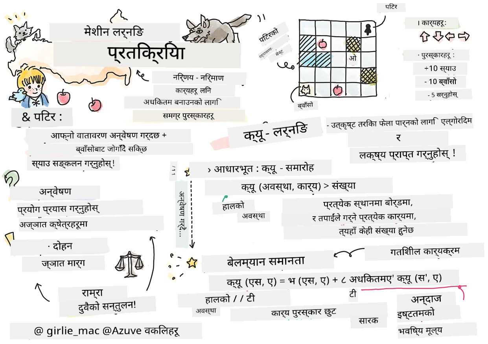
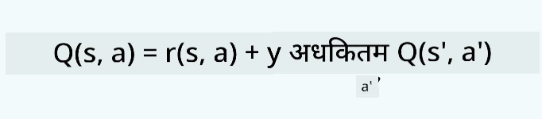
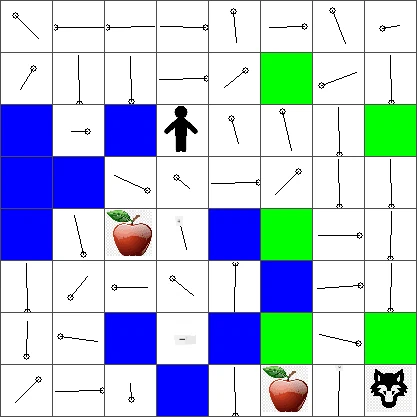

# सुदृढीकरण शिक्षण र Q-शिक्षणमा परिचय


> स्केचनोट द्वारा [तोमоми इमुरा](https://www.twitter.com/girlie_mac)

सुदृढीकरण शिक्षणमा तीन महत्वपूर्ण अवधारणाहरू छन्: एजेन्ट, केही अवस्थाहरू, र प्रत्येक अवस्थाको लागि क्रियाहरूको सेट। निर्दिष्ट अवस्थामा कुनै क्रिया कार्यान्वयन गरेर, एजेन्टलाई इनाम दिन्छ। फेरि कल्पना गर्नुहोस् कम्प्युटर खेल सुपर मारियो। तपाईँ मारियो हुनुहुन्छ, खेलको स्तरमा, खाल्डो किनारामा उभिएको। माथि एउटा सिक्का छ। तपाईँ मारियो हुनु, खेलको स्तरमा, कुनै विशेष स्थितिमा ... त्यो तपाईंको अवस्था हो। दायाँतर्फ एक कदम चाल्नु (एक क्रिया) ले तपाईंलाई किनारामा पु-याउँछ, जसले तपाईंलाई न्यून अंक दिन्छ। यद्यपि, जम्प बटन थिच्दा तपाईंले अंक पाउनुहुन्छ र जीवित रहन सक्नुहुन्छ। त्यो सकारात्मक नतिजा हो र त्यसले तपाईंलाई सकारात्मक अंक पुरस्कार दिन्छ।

सुदृढीकरण शिक्षण र एक सिमुलेटर (खेल) को प्रयोग गरेर, तपाईंले कसरी खेल खेल्ने सिक्न सक्नुहुन्छ ताकि जिवित रहन र सकेसम्म धेरै अंक प्राप्त गर्न सकियोस्।

[](https://www.youtube.com/watch?v=lDq_en8RNOo)

> 🎥 माथिको तस्बिरमा क्लिक गरी दिमित्रे सुदृढीकरण शिक्षणमा छलफल सुन्नुहोस्

## [पाठअघि प्रश्नोत्तरी](https://ff-quizzes.netlify.app/en/ml/)

## आवश्यकताहरू र सेटअप

यस पाठमा, हामी पाइथनमा केही कोडसँग प्रयोग गर्नेछौं। तपाईंले यो पाठको जुपिटर नोटबुक कोड तपाईंको कम्प्युटरमा वा क्लाउडमा कुनै स्थानमा चलाउन सक्षम हुनु पर्नेछ।

तपाईं [पाठ नोटबुक](https://github.com/microsoft/ML-For-Beginners/blob/main/8-Reinforcement/1-QLearning/notebook.ipynb) खोल्न सक्नुहुन्छ र यो पाठसँग सँगै जान सक्नुहुन्छ।

> **सूचना:** यदि तपाईं यो कोड क्लाउडबाट खोलिरहनुभएको छ भने, तपाईंले पनि [`rlboard.py`](https://github.com/microsoft/ML-For-Beginners/blob/main/8-Reinforcement/1-QLearning/rlboard.py) फाइल ल्याउनुपर्नेछ, जुन नोटबुक कोडमा प्रयोग हुन्छ। यसलाई नोटबुकसँगैको फोल्डरमा राख्नुहोस्।

## परिचय

यस पाठमा, हामी **[पिटर र भेड़िया](https://en.wikipedia.org/wiki/Peter_and_the_Wolf)** को संसार खोज्नेछौं, जसलाई रूसी संग्राहक [सेर्गेइ प्रोकोफीभ](https://en.wikipedia.org/wiki/Sergei_Prokofiev) ले संगीतात्मक परी कथा बाट प्रेरणा लिएको हो। हामी **सुदृढीकरण शिक्षण** प्रयोग गर्नेछौं पिटरलाई आफ्नो वातावरण अन्वेषण गरी मिठा स्याउहरू सङ्कलन गर्ने र भेड़ियासँग टक्कर नलाग्ने बनाउन।

**सुदृढीकरण शिक्षण** (RL) एउटा सिकाइ प्रविधि हो जसले हामीलाई एउटा **एजेन्ट** को सर्वश्रेष्ठ व्यवहार सिक्न अनुमति दिन्छ, कुनै **पर्यावरण** मा धेरै प्रयोग गरेर। यस पर्यावरणमा एजेन्टको केही **लक्ष्य** हुनुपर्दछ, जुन **इनाम कार्य** द्वारा परिभाषित हुन्छ।

## वातावरण

सरलताका लागि, हामी पिटरको संसारलाई चौकोर बोर्डको `width` x `height` आकारमा मान्न सक्छौं, यसरी:


यस बोर्डका प्रत्येक कोष्ठकले यस मध्ये कुनै पर्न सक्छ:

* **माटो**, जसमा पिटर र अन्य जीवहरु हिड्न सक्छन्।
* **पानी**, जसमा तपाईं पक्कै हिड्न सक्नुहुन्न।
* **रुख** वा **घाँस**, जहाँ तपाईं आराम गर्न सक्नुहुन्छ।
* **स्याउ**, जुन पिटरले आफूलाई खान दिन खोज्ने वस्तु हो।
* **भेड़िया**, जुन खतरनाक छ र जोगिनु पर्छ।

एउटा अलग पाइथन मोड्युल छ, [`rlboard.py`](https://github.com/microsoft/ML-For-Beginners/blob/main/8-Reinforcement/1-QLearning/rlboard.py), जसमा यस वातावरणसँग काम गर्ने कोड छ। किनभने यस कोड बुझ्न हाम्रो अवधारणाका लागि आवश्यक छैन, हामी यस मोड्युललाई आयात गरी नमुना बोर्ड बनाउन प्रयोग गर्नेछौं (कोड ब्लक 1):

```python
from rlboard import *

width, height = 8,8
m = Board(width,height)
m.randomize(seed=13)
m.plot()
```

यो कोडले माथिको जस्तो वातावरणको चित्र प्रिन्ट गर्नेछ।

## क्रियाहरू र नीति

हाम्रो उदाहरणमा, पिटरको लक्ष्य स्याउ भेट्नु हुनेछ, भेड़िया र अन्य बाधाहरूबाट बच्ने तरिकाले। त्यसका लागि, उनी बेसिक रूपमा घुम्दै हिँडिरहनेछन् जबसम्म स्याउ भेटिदैन।

त्यसकारण, कुनै पनि स्थानमा, उनी तलका क्रियाहरू मध्ये एक छान्न सक्छन्: माथि, तल, बायाँ र दायाँ।

ती क्रियाहरूलाई हामी शब्दकोश स्वरूप परिभाषित गर्नेछौं र तिनीहरूलाई सम्बन्धित निर्देशाङ्क परिवर्तनका जोडीहरूसँग नक्साङ्कन गर्नेछौं। उदाहरणका लागि, दायाँ सर्नु (`R`) लाई `(1,0)` जोडीको रूपमा राख्नेछौं। (कोड ब्लक 2):

```python
actions = { "U" : (0,-1), "D" : (0,1), "L" : (-1,0), "R" : (1,0) }
action_idx = { a : i for i,a in enumerate(actions.keys()) }
```

संक्षेपमा, यस परिदृश्यको रणनीति र लक्ष्य यस प्रकार छ:

- **रणनीति**, हाम्रो एजेन्ट (पिटर) को एक भनिने **नीति** द्वारा परिभाषित छ। नीति एउटा कार्य हो जसले कुनै पनि दिनेको अवस्थामा क्रिया फर्काउँछ। हाम्रो मामलामा, समस्याको अवस्था बोर्ड द्वारा प्रतिनिधित्व गरिएको छ, खेलाडीको वर्तमान स्थान सहित।

- **लक्ष्य**, सुदृढीकरण शिक्षणको लक्ष्य अन्ततः राम्रो नीति सिक्नु हो जसले समस्या कुशलतापूर्वक समाधान गर्न सकियोस। यद्यपि, एक आधारभूत रुपमा, हामी सबैभन्दा सरल नीतिलाई विचार गर्न सक्छौं जुन **र्याण्डम वाक** हो।

## र्याण्डम वाक

पहिले हामी हाम्रो समस्या र्याण्डम वाक रणनीतिलाई कार्यान्वयन गरेर समाधान गर्नेछौं। र्याण्डम वाकमा, हामी अनुमति पाएका क्रियाहरूबाट अर्को क्रिया यादृच्छिक रूपमा चयन गर्नेछौं, जबसम्म स्याउसम्म पुग्दैनौं (कोड ब्लक 3)।

1. तलको कोडले र्याण्डम वाक कार्यान्वयन गर्न:

    ```python
    def random_policy(m):
        return random.choice(list(actions))
    
    def walk(m,policy,start_position=None):
        n = 0 # कदमहरूको संख्या
        # प्रारम्भिक स्थान सेट गर्नुहोस्
        if start_position:
            m.human = start_position 
        else:
            m.random_start()
        while True:
            if m.at() == Board.Cell.apple:
                return n # सफलता!
            if m.at() in [Board.Cell.wolf, Board.Cell.water]:
                return -1 # ब्वाँसोले खाएको वा डुब्नु भएको
            while True:
                a = actions[policy(m)]
                new_pos = m.move_pos(m.human,a)
                if m.is_valid(new_pos) and m.at(new_pos)!=Board.Cell.water:
                    m.move(a) # वास्तविक आन्दोलन गर्नुहोस्
                    break
            n+=1
    
    walk(m,random_policy)
    ```

    `walk` लाई कल गर्दा सम्बन्धित मार्गको लम्बाइ फर्किनुपर्छ, जुन एक पटकदेखि अर्को पटक फरक हुन सक्छ।

1. चलाओ  तपाईँले walk प्रयोग गरेर धेरै पटक (जस्तै, 100 पटक), र प्राप्त तथ्यांकहरू प्रिन्ट गर्नुहोस् (कोड ब्लक 4):

    ```python
    def print_statistics(policy):
        s,w,n = 0,0,0
        for _ in range(100):
            z = walk(m,policy)
            if z<0:
                w+=1
            else:
                s += z
                n += 1
        print(f"Average path length = {s/n}, eaten by wolf: {w} times")
    
    print_statistics(random_policy)
    ```

    ध्यान दिनुहोस कि एउटा पथको औसत लम्बाइ करिब 30-40 चरण हुन्छ, जुन धेरै हो, ध्यानमा राखेर कि सबैभन्दा नजिकको स्याउसम्मको औसत दूरी करिब 5-6 कदम छ।

    तपाईं र्याण्डम वाक अवधिमा पिटरको चाल कस्तो छ देख्न सक्नुहुन्छ:

    

## पुरस्कार कार्य

हाम्रो नीतिलाई अझ बुद्धिमानी बनाउन, हामी बुझ्नुपर्ने हुन्छ कि कुन चालहरू अरूको भन्दा "राम्रो" छन्। यसको लागि हामीले हाम्रो लक्ष्य परिभाषित गर्नुपर्ने हुन्छ।

लक्ष्यलाई एउटा **इनाम कार्य** मा परिभाषित गर्न सकिन्छ, जसले प्रत्येक अवस्थाको लागि केही स्कोर मान फर्काउँछ। संख्या जति ठूलो हुन्छ, त्यो इनाम कार्य उति राम्रो हो। (कोड ब्लक 5)

```python
move_reward = -0.1
goal_reward = 10
end_reward = -10

def reward(m,pos=None):
    pos = pos or m.human
    if not m.is_valid(pos):
        return end_reward
    x = m.at(pos)
    if x==Board.Cell.water or x == Board.Cell.wolf:
        return end_reward
    if x==Board.Cell.apple:
        return goal_reward
    return move_reward
```

पुरस्कार कार्यहरूको रोचक कुरा भनेको अधिकांश अवस्थामा, *हामीलाई खेलको अन्त्यमा मात्र पर्याप्त पुरस्कार दिइन्छ*। यसको अर्थ हाम्रो एल्गोरिदमले कसरी पनि "राम्रो" कदमहरू सम्झनुपर्छ जुन अन्त्यमा सकारात्मक इनाम ल्याउँछन्, र ती महत्त्व बढाउनुपर्छ। त्यस्तै, सबै नतिजा नराम्रो पर्ने चालहरूलाई निरुत्साहित गर्नुपर्छ।

## Q-शिक्षण

यहाँ छलफल गरिने एल्गोरिथ्मलाई **Q-शिक्षण** भनिन्छ। यसमा, नीति एउटा कार्य (वा डेटा संरचना) द्वारा परिभाषित हुन्छ जसलाई **Q-टेबल** भनिन्छ। यसले प्रत्येक अवस्थाको प्रत्येक क्रियाको "राम्रोपना" रेकर्ड गर्छ।

यसलाई Q-टेबल भनिन्छ किनभने प्रायः यसलाई एउटा तालिका वा बहु-आयामी एरेको रूपमा प्रतिनिधित्व गर्न सजिलो हुन्छ। हाम्रो बोर्ड `width` x `height` आकारको हुँदा हामी Q-टेबललाई numpy एरे प्रयोग गरेर `width` x `height` x `len(actions)` आकारमा प्रतिनिधित्व गर्न सक्छौं: (कोड ब्लक 6)

```python
Q = np.ones((width,height,len(actions)),dtype=np.float)*1.0/len(actions)
```

ध्यान दिनुहोस् कि हामीले सबै Q-टेबल मानहरूलाई समान मान दिइरहेका छौं, हाम्रो अवस्थामा - 0.25। यसले "र्याण्डम वाक" नीतिलाई जनाउँछ, किनभने हरेक अवस्थाका क्रियाहरू समान राम्रो हुन्छन्। हामी `plot` कार्यमा Q-टेबल पास गरेर बोर्डमा तालिका देखाउन सक्छौं: `m.plot(Q)`.


प्रत्येक कोष्ठकको केन्द्रमा एउटा "तीर" हुन्छ जुन सर्न मन लाग्ने दिशा देखाउँछ। सबै दिशा बराबर हुँदा, बिन्दु देखाइन्छ।

अब हामी सिमुलेशन चलाएर हाम्रो वातावरण अन्वेषण गर्नुपर्छ र Q-टेबल मानहरूको राम्रो वितरण सिक्नुपर्छ, जसले स्याउ पुग्ने बाटो छिटो फेला पार्न मद्दत गर्नेछ।

## Q-शिक्षणको सार: बेल्म्यान समीकरण

सर्न थाल्दा, प्रत्येक क्रियाको सम्बन्धित पुरस्कार हुन्छ, अर्थात् हामी सैद्धान्तिक रूपमा सबैभन्दा बढी तत्काल पुरस्कारका आधारमा अर्को क्रिया चयन गर्न सक्छौं। तर धेरै अवस्थाहरूमा, चालले हाम्रो स्याउ पुग्ने लक्ष्य पूरा गर्दैन, त्यसैले हामी तुरुन्त निर्णय गर्न सक्दैनौं कुन दिशा राम्रो हो।

> याद राख्नुहोस् कि तत्काल नतिजा महत्वपूर्ण छैन, तर अन्तिम नतिजा हो, जुन हामी सिमुलेशनको अन्त्यमा पाउनेछौं।

ढिलाइ गरिएको पुरस्कारलाई ध्यानमा राख्न, हामीले **[डायनामिक प्रोग्रामिङ](https://en.wikipedia.org/wiki/Dynamic_programming)** सिद्धान्तहरू प्रयोग गर्नुपर्छ, जसले हाम्रो समस्यालाई पुनरावृत्तिमूलक रूपमा सोच्न अनुमति दिन्छ।

मानौं हामी अहिले अवस्था *s* मा छौं, र अर्को अवस्था *s'* मा सर्न चाहन्छौं। यसले हामीलाई तुरुन्तै पुरस्कार *r(s,a)* प्राप्त हुनेछ, जुन इनाम कार्यले परिभाषित गर्छ, साथै केही भविष्यको पुरस्कार पनि हुनेछ। यदि हाम्रो Q-टेबलले प्रत्येक क्रियाको "आकर्षकता" सही रूपमा देखाउँछ भने, अवस्था *s'* मा हामी त्यो क्रिया *a'* छान्नेछौं जसको *Q(s',a')* मान सबैभन्दा उच्च हुन्छ। त्यसैले, अवस्था *s* मा पाउन सकिने सबैभन्दा राम्रो सम्भावित भावी पुरस्कार `max`<sub>a'</sub>*Q(s',a')* हुनेछ (यहाँ अधिकतम सबै सम्भावित क्रियाहरू *a'* मा गणना हुन्छ)।

यसले Q-टेबलको मान गणना गर्नको लागि **बेल्म्यान सूत्र** दिन्छ, जुन अवस्था *s* र क्रिया *a* को लागि हो:



यहाँ γ भनिने को छूट कारक हो जसले वर्तमान पुरस्कारलाई भविष्य पुरस्कारको तुलनामा कति प्राथमिकता दिने निर्धारण गर्छ।

## सिकाइ एल्गोरिथ्म

माथिको समीकरण अनुसार, हामी अब हाम्रो सिकाइ एल्गोरिथ्मको छद्म कोड लेख्न सक्छौं:

* सबै अवस्थाहरू र क्रियाहरूका लागि योगात्मक संख्याहरूले Q-टेबल Q सुरु गर्नुहोस्
* सिकाइ दर α ← 1 सेट गर्नुहोस्
* धेरै पटक सिमुलेशन दोहोर्याउनुहोस्
   1. यादृच्छिक स्थानबाट सुरु गर्नुहोस्
   1. दोहोर्याउनुहोस्
        1. अवस्था *s* मा एउटा क्रिया *a* चयन गर्नुहोस्
        2. नयाँ अवस्था *s'* मा सर्ने क्रिया कार्यान्वयन गर्नुहोस्
        3. यदि खेलको अन्त्य अवस्था भेटियो वा कुल पुरस्कार धेरै थोरै छ भने - सिमुलेशनबाट बाहिर निस्कनुहोस्  
        4. नयाँ अवस्थामा पुरस्कार *r* गणना गर्नुहोस्
        5. बेल्म्यान समीकरण अनुसार Q-कार्य अपडेट गर्नुहोस्: *Q(s,a)* ← *(1-α)Q(s,a)+α(r+γ max<sub>a'</sub>Q(s',a'))*
        6. *s* ← *s'*
        7. कुल पुरस्कार अपडेट गर्नुहोस् र α घटाउनुहोस्।

## उपयोग गर्ने बनाम अन्वेषण गर्ने

माथिको एल्गोरिथ्ममा, हामीले २.१ मा क्रिया चयन कसरी गर्ने भनी निर्दिष्ट गरेका छैनौं। यदि हामी क्रियालाई यादृच्छिक रूपमा छान्छौं भने, हामी वातावरणलाई यादृच्छिक रूपमा अन्वेषण गर्नेछौं, र हामी प्रायः धेरै पटक मर्न सक्छौं साथै त्यस्ता क्षेत्रहरू पनि अन्वेषण गर्नेछौं जहाँ सामान्यतः जाँदैनौं। अर्को तरिका भनेको पहिले देखि थाहा भएका Q-टेबल मानहरूलाई **उपयोग** गरेर, सबैभन्दा उत्कृष्ट क्रिया (उच्च Q-टेबल मान भएको) चयन गर्नु हो। तर योले हामीलाई अन्य अवस्थाहरू अन्वेषणबाट रोक्छ, र सम्भावित समाधान नपाउनसक्ने सम्भावना बढ्छ।

त्यसैले, सर्वोत्तम तरिका भनेको अन्वेषण र उपयोग बीच सन्तुलन कायम गर्नु हो। यो स्टेट *s* मा क्रिया चयन गर्न Q-टेबलका मानसँग अनुपातिक सम्भावनाहरू प्रयोग गरेर गर्न सकिन्छ। सुरुमै, जब Q-टेबलका सबै मान एकसमान हुन्छन्, यसले यादृच्छिक चयनको जस्तो हुन्छ, तर जति हामी हाम्रो वातावरण सिक्छौं, हामी उत्तम मार्ग पछ्याउने सम्भावना बढी हुन्छ र एजेन्टलाई कहिलेकाहीं अन्वेषण गर्ने बाटो अपनाउन अनुमति दिन्छौं।

## पाइथन कार्यान्वयन

हामी अब सिकाइ एल्गोरिथ्म कार्यान्वयन गर्न तयार छौं। त्यस अघि, हामीलाई एउटा यस्तो कार्य पनि चाहिन्छ जसले Q-टेबलमा भएका कुनै पनि संख्याहरूलाई सम्बन्धित क्रियाहरूको सम्भावनाहरूमा रूपान्तरण गर्नेछ।

1. `probs()` नामको कार्य बनाउनुहोस्:

    ```python
    def probs(v,eps=1e-4):
        v = v-v.min()+eps
        v = v/v.sum()
        return v
    ```

    शुरुवाती अवस्थामा सबै भेक्टर कम्पोनेन्टहरू समान हुँदा शून्यले भाग काटिन नदिन केही `eps` थपेका छौं।

यो सिकाइ एल्गोरिथ्म ५००० प्रयोगहरू (epochs) को माध्यमबाट चलाउनुहोस्: (कोड ब्लक 8)
```python
    for epoch in range(5000):
    
        # प्रारम्भिक बिन्दु छान्नुहोस्
        m.random_start()
        
        # यात्रा सुरु गर्नुहोस्
        n=0
        cum_reward = 0
        while True:
            x,y = m.human
            v = probs(Q[x,y])
            a = random.choices(list(actions),weights=v)[0]
            dpos = actions[a]
            m.move(dpos,check_correctness=False) # हामी खेलाडीलाई बोर्ड बाहिर जान अनुमति दिन्छौं, जसले एपिसोड समाप्त गर्दछ
            r = reward(m)
            cum_reward += r
            if r==end_reward or cum_reward < -1000:
                lpath.append(n)
                break
            alpha = np.exp(-n / 10e5)
            gamma = 0.5
            ai = action_idx[a]
            Q[x,y,ai] = (1 - alpha) * Q[x,y,ai] + alpha * (r + gamma * Q[x+dpos[0], y+dpos[1]].max())
            n+=1
```

एल्गोरिथ्म चलाएपछि, Q-टेबल भ्याक्टरहरूमा भएका मानहरू अपडेट हुनेछ जसले हरेक चरणमा फरक क्रियाहरूको आकर्षकता परिभाषित गर्नेछन्। हामी Q-टेबल हेर्न कोशिस गर्न सक्छौं, प्रत्येक कोष्ठकमा एउटा भेक्टर तयार पारेर जुन आन्दोलनको उचित दिशातर्फ संकेत गर्नेछ। सरलताका लागि, हामी साना वृत्तहरू चित्रित गर्छौं तीरको सट्टा।



## नीतिको जाँच

किनभने Q-टेबल प्रत्येक अवस्थाको प्रत्येक क्रियाको "आकर्षकता" सूचीबद्ध गर्छ, हामी यसलाई हाम्रो संसारमा कुशल नेभिगेशन परिभाषित गर्न सजिलै प्रयोग गर्न सक्छौं। सजिलो अवस्थामा, हामी सबैभन्दा उच्च Q-टेबल मान भएको क्रियालाई चयन गर्न सक्छौं: (कोड ब्लक 9)

```python
def qpolicy_strict(m):
        x,y = m.human
        v = probs(Q[x,y])
        a = list(actions)[np.argmax(v)]
        return a

walk(m,qpolicy_strict)
```


> माथिको कोडलाई धेरै पटक प्रयास गर्दा, कहिलेकाहीं यसले "अटकिरहेको" देख्न सकिन्छ, र तपाईंलाई नोटबुकमा STOP बटन थिचेर यसलाई रोक्न आवश्यक पर्छ। यो त्यस्तो अवस्था हुन सक्छ जब दुईवटा अवस्था हरु आपसमा अप्टिमल Q-Value को सन्दर्भमा "सङ्केत" गर्छन्, जस अवस्थामा एजेन्टहरू ती अवस्थाहरू बीच अनन्तकाल सम्म घुमिरहन्छन्।

## 🚀चुनौती

> **कार्य १:** `walk` फङ्क्शनलाई यसरी संशोधन गर्नुहोस् कि पथको अधिकतम लम्बाई निश्चित चरणहरूको सङ्ख्यामा (जस्तै, १००) सीमित होस्, र माथिको कोड कहिलेकाहीं यो मान फर्काउँदै गरेको देख्नुहोस्।

> **कार्य २:** `walk` फङ्क्शनलाई यसरी संशोधन गर्नुहोस् कि यसले पहिले सम्म पुगेका स्थानमा फिर्ता नजाओस्। यसले `walk` लाई लूपिङ हुनबाट रोक्नेछ, तर एजेन्ट अझै त्यस्तो स्थानमा "फसेर" रहन सक्छ जहाँबाट बाटो छुट्न सक्दैन।

## मार्गनिर्देशन

एउटा राम्रो मार्गनिर्देशन नीति भनेको हामीले प्रशिक्षणको क्रममा प्रयोग गरेको नीति हो, जुन शोषण र अन्वेषण दुवैलाई संयोजन गर्छ। यस नीतिमा, हामी प्रत्येक क्रियालाई निश्चित सम्भावनासँग छनौट गर्नेछौं, जो Q-Table का मानहरू सँग अनुपातमा हुन्छ। यो रणनीतिले एजेन्टलाई पहिले नै अन्वेषण गरिसकेको स्थानमा फिर्ता जान लग्न सक्छ, तर, तलको कोडबाट देख्न सकिन्छ, यसले चाहिएको स्थानमा धेरै छोटो औसत पथ दिएको छ (याद गर्नुहोस् कि `print_statistics` सिमुलेशन १०० पटक चलाउँछ): (कोड ब्लक १०)

```python
def qpolicy(m):
        x,y = m.human
        v = probs(Q[x,y])
        a = random.choices(list(actions),weights=v)[0]
        return a

print_statistics(qpolicy)
```

यस कोडलाई चलाएपछि, तपाईंले पहिले भन्दा धेरै सानो औसत पथ लम्बाइ प्राप्त गर्नु पर्नेछ, ३-६ को दायरा भित्र।

## सिकाइ प्रक्रिया अन्वेषण

जस्तो हामीले भनेका छौं, सिकाइ प्रक्रिया समस्या क्षेत्रको संरचनाबारे प्राप्त ज्ञानको अन्वेषण र शोषण बीचको सन्तुलन हो। हामीले देखेका छौं कि सिकाइका परिणामहरू (एजेन्टलाई लक्ष्यसम्म छोटो पथ फेला पार्न मद्दत गर्ने क्षमता) सुधार भएका छन्, तर सिकाइ प्रक्रियाको क्रममा औसत पथ लम्बाइ कसरी व्यवहार गर्छ भन्ने अवलोकन गर्नु पनि रोचक छ:


सिकाइहरू यस प्रकार सारांशित गर्न सकिन्छ:

- **औसत पथ लम्बाइ बढ्छ**। यहाँ जुन हामी देख्छौं त्यो हो सुरुमा औसत पथ लम्बाइ बढ्छ। यो सम्भवतः त्यसैले हो कि हामीलाई वातावरणको बारेमा केही थाहा नभएको अवस्थामा हामी खराब अवस्थाहरू, जस्तै पानी वा ब्वाँसोमा फस्न सक्छौं। जति धेरै जानकार हुन्छौं र त्यो ज्ञान प्रयोग गर्न थाल्छौं, हामी वातावरणलाई लामो समयसम्म अन्वेषण गर्न सक्छौं, तर अझै हामीलाई स्याउ कहाँ छन् भनेर राम्ररी थाहा हुँदैन।

- **अझ सिकेपछि पथ लम्बाइ घट्छ**। पर्याप्त सिकेपछि, एजेन्टका लागि लक्ष्य प्राप्ति सजिलो हुन्छ, र पथ लम्बाइ घट्न थाल्छ। यद्यपि, हामी अझै अन्वेषणका लागि खुला छौं, त्यसैले हामी प्रायः सबैभन्दा राम्रो बाटोबाट विचलित भई नयाँ विकल्पहरू अन्वेषण गर्छौं, जसले पथलाई ऑप्टिमलभन्दा लामो बनाउँछ।

- **लम्बाइ आकस्मिक रूपमा बढ्छ**। यस ग्राफमा हामीले अर्को कुरा पनि देख्छौं कि कुनै समय लम्बाइ अचानक बढ्छ। यसले प्रक्रियाको यादृच्छिक स्वभावलाई जनाउँछ, र हामी कहिलेकाहीं Q-Table को गुणांकहरूलाई नयाँ मानहरूसँग पुनःलेखन गरी "खराब" बनाउन सक्छौं। यो आदर्श रूपमा सिकाइ दर घटाएर कम गर्नुपर्छ (उदाहरणका लागि, प्रशिक्षणको अन्त्यतिर हामी Q-Table मानहरूलाई सानो मानले मात्र समायोजन गर्छौं)।

कुल मिलाएर, यो स्मरण राख्न महत्वपूर्ण छ कि सिकाइ प्रक्रियाको सफलता र गुणस्तर धेरै हदसम्म प्यारेमिटरहरूमा निर्भर गर्दछ, जस्तै सिकाइ दर, सिकाइ दरको ह्रास, र छुट कारक। ती प्रायः **हाइपरप्यारामिटरहरू** भनिन्छ, जसलाई प्रशिक्षण क्रममा अनुकूलित गरिएका **प्यारामिटरहरू** (जस्तै Q-Table का गुणांकहरू) बाट फरक पार्न। उत्कृष्ट हाइपरप्यारामिटर मूल्यहरू खोज्न सक्ने प्रक्रियालाई **हाइपरप्यारामिटर अप्टिमाइजेशन** भनिन्छ, र यो एउटा अलग विषय हो।

## [पोस्ट-लेक्चर क्विज](https://ff-quizzes.netlify.app/en/ml/)

## असाइनमेन्ट 
[अझ यथार्थपरक विश्व](assignment.md)

---

<!-- CO-OP TRANSLATOR DISCLAIMER START -->
**अस्वीकरण**:
यो दस्तावेज़ AI अनुवाद सेवा [Co-op Translator](https://github.com/Azure/co-op-translator) प्रयोग गरेर अनुवाद गरिएको हो। हामी सही हुन प्रयास गर्छौं, तर कृपया जानकार हुनुस् कि स्वचालित अनुवादमा त्रुटिहरू वा अशुद्धताहरू हुन सक्छन्। मूल दस्तावेज़ यसको मूल भाषामा आधिकारिक स्रोत मानिनुपर्छ। महत्वपूर्ण जानकारीका लागि व्यावसायिक मानव अनुवाद सिफारिस गरिन्छ। यस अनुवादको प्रयोगबाट उत्पन्न कुनै पनि गलत बुझाइ वा त्रुटिको लागि हामी जिम्मेवार छैनौं।
<!-- CO-OP TRANSLATOR DISCLAIMER END -->