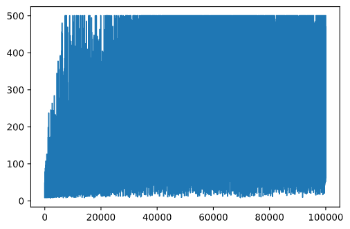

<!--
CO_OP_TRANSLATOR_METADATA:
{
  "original_hash": "9660fbd80845c59c15715cb418cd6e23",
  "translation_date": "2025-08-29T18:15:18+00:00",
  "source_file": "8-Reinforcement/2-Gym/README.md",
  "language_code": "ne"
}
-->
## कार्टपोल स्केटिङ

अघिल्लो पाठमा हामीले समाधान गरेको समस्या खेलौना जस्तो देखिन सक्छ, तर यो वास्तविक जीवनका समस्याहरूमा पनि लागू हुन्छ। धेरै वास्तविक समस्याहरू पनि यस्तै प्रकृतिका हुन्छन् - जस्तै चेस वा गो खेल्न। यी समस्याहरू समान छन्, किनभने हामीसँग पनि नियमहरू भएको बोर्ड र **डिस्क्रिट अवस्था** हुन्छ।

## [पाठ अघि क्विज](https://gray-sand-07a10f403.1.azurestaticapps.net/quiz/47/)

## परिचय

यस पाठमा हामी Q-Learning का सिद्धान्तहरूलाई **कन्टिन्युअस स्टेट** भएको समस्यामा लागू गर्नेछौं, अर्थात् यस्तो अवस्था जुन एक वा धेरै वास्तविक संख्याहरूले परिभाषित गर्छ। हामी निम्न समस्यामा काम गर्नेछौं:

> **समस्या**: यदि पिटरले ब्वाँसाबाट भाग्न चाहन्छ भने, उसले छिटो चल्न सक्नुपर्छ। हामी हेर्नेछौं कि पिटरले Q-Learning प्रयोग गरेर स्केटिङ, विशेष गरी सन्तुलन राख्न कसरी सिक्न सक्छ।


> पिटर र उसका साथीहरूले ब्वाँसाबाट भाग्न सिर्जनात्मक उपाय अपनाउँछन्! चित्र: [जेन लूपर](https://twitter.com/jenlooper)

हामी सन्तुलनको एक सरल संस्करण प्रयोग गर्नेछौं जसलाई **कार्टपोल** समस्या भनिन्छ। कार्टपोल संसारमा, हामीसँग एउटा तेर्सो स्लाइडर छ, जसले बायाँ वा दायाँ सर्न सक्छ, र लक्ष्य स्लाइडरको माथि ठाडो पोललाई सन्तुलनमा राख्नु हो।

## आवश्यकताहरू

यस पाठमा, हामी **OpenAI Gym** नामक पुस्तकालय प्रयोग गर्नेछौं, जसले विभिन्न **परिवेशहरू** अनुकरण गर्न मद्दत गर्छ। तपाईं यो पाठको कोड स्थानीय रूपमा (जस्तै Visual Studio Code बाट) चलाउन सक्नुहुन्छ, जसमा अनुकरण नयाँ झ्यालमा खुल्छ। अनलाइन कोड चलाउँदा, तपाईंले कोडमा केही परिमार्जन गर्नुपर्ने हुन सक्छ, जस्तै [यहाँ](https://towardsdatascience.com/rendering-openai-gym-envs-on-binder-and-google-colab-536f99391cc7) वर्णन गरिएको छ।

## OpenAI Gym

अघिल्लो पाठमा, खेलका नियमहरू र अवस्था `Board` वर्गद्वारा परिभाषित गरिएको थियो, जुन हामीले आफैंले बनाएका थियौं। यहाँ हामी एक विशेष **अनुकरण परिवेश** प्रयोग गर्नेछौं, जसले सन्तुलन पोलको भौतिकी अनुकरण गर्नेछ। प्रबलन शिक्षण एल्गोरिदमहरू प्रशिक्षणका लागि सबैभन्दा लोकप्रिय अनुकरण परिवेशहरूमध्ये एक [Gym](https://gym.openai.com/) हो, जसलाई [OpenAI](https://openai.com/) ले मर्मत गर्छ। यस जिमको प्रयोग गरेर हामी कार्टपोल अनुकरणदेखि एटारी खेलसम्मका विभिन्न **परिवेशहरू** सिर्जना गर्न सक्छौं।

> **नोट**: OpenAI Gym मा उपलब्ध अन्य परिवेशहरू [यहाँ](https://gym.openai.com/envs/#classic_control) हेर्न सक्नुहुन्छ।

पहिले, जिम स्थापना गरौं र आवश्यक पुस्तकालयहरू आयात गरौं (कोड ब्लक 1):

```python
import sys
!{sys.executable} -m pip install gym 

import gym
import matplotlib.pyplot as plt
import numpy as np
import random
```

## अभ्यास - कार्टपोल परिवेश सुरु गर्नुहोस्

कार्टपोल सन्तुलन समस्यामा काम गर्न, हामीले सम्बन्धित परिवेश सुरु गर्नुपर्छ। प्रत्येक परिवेशसँग निम्न हुन्छ:

- **अवलोकन स्थान**: यसले परिवेशबाट प्राप्त हुने जानकारीको संरचना परिभाषित गर्छ। कार्टपोल समस्यामा, हामी पोलको स्थिति, वेग र अन्य केही मानहरू प्राप्त गर्छौं।

- **कार्य स्थान**: यसले सम्भावित कार्यहरू परिभाषित गर्छ। हाम्रो अवस्थामा, कार्य स्थान डिस्क्रिट छ, र दुई कार्यहरू समावेश छन् - **बायाँ** र **दायाँ**। (कोड ब्लक 2)

1. सुरु गर्न, निम्न कोड टाइप गर्नुहोस्:

    ```python
    env = gym.make("CartPole-v1")
    print(env.action_space)
    print(env.observation_space)
    print(env.action_space.sample())
    ```

परिवेश कसरी काम गर्छ हेर्न, 100 चरणहरूको लागि सानो अनुकरण चलाऔं। प्रत्येक चरणमा, हामीले एउटा कार्य प्रदान गर्नुपर्छ - यस अनुकरणमा हामी `action_space` बाट यादृच्छिक रूपमा कार्य चयन गर्छौं।

1. तलको कोड चलाउनुहोस् र यसले के परिणाम दिन्छ हेर्नुहोस्।

    ✅ यो कोड स्थानीय Python स्थापना मा चलाउनु राम्रो हुन्छ! (कोड ब्लक 3)

    ```python
    env.reset()
    
    for i in range(100):
       env.render()
       env.step(env.action_space.sample())
    env.close()
    ```

    तपाईंले निम्न जस्तो केही देख्नुहुनेछ:

    

1. अनुकरणको क्रममा, हामीले कसरी कार्य गर्ने निर्णय गर्न अवलोकनहरू प्राप्त गर्नुपर्छ। वास्तवमा, `step` कार्यले हालको अवलोकनहरू, पुरस्कार कार्य, र `done` झण्डा फिर्ता गर्छ, जसले अनुकरण जारी राख्न उपयुक्त छ कि छैन भनेर जनाउँछ: (कोड ब्लक 4)

    ```python
    env.reset()
    
    done = False
    while not done:
       env.render()
       obs, rew, done, info = env.step(env.action_space.sample())
       print(f"{obs} -> {rew}")
    env.close()
    ```

    तपाईंले नोटबुकको आउटपुटमा निम्न जस्तो केही देख्नुहुनेछ:

    ```text
    [ 0.03403272 -0.24301182  0.02669811  0.2895829 ] -> 1.0
    [ 0.02917248 -0.04828055  0.03248977  0.00543839] -> 1.0
    [ 0.02820687  0.14636075  0.03259854 -0.27681916] -> 1.0
    [ 0.03113408  0.34100283  0.02706215 -0.55904489] -> 1.0
    [ 0.03795414  0.53573468  0.01588125 -0.84308041] -> 1.0
    ...
    [ 0.17299878  0.15868546 -0.20754175 -0.55975453] -> 1.0
    [ 0.17617249  0.35602306 -0.21873684 -0.90998894] -> 1.0
    ```

    अनुकरणको प्रत्येक चरणमा फिर्ता गरिने अवलोकन भेक्टरमा निम्न मानहरू समावेश छन्:
    - कार्टको स्थिति
    - कार्टको वेग
    - पोलको कोण
    - पोलको घुमाउने दर

1. ती संख्याहरूको न्यूनतम र अधिकतम मान प्राप्त गर्नुहोस्: (कोड ब्लक 5)

    ```python
    print(env.observation_space.low)
    print(env.observation_space.high)
    ```

    तपाईंले यो पनि देख्न सक्नुहुन्छ कि प्रत्येक अनुकरण चरणमा पुरस्कार मान सधैं 1 हुन्छ। यसको कारण हाम्रो लक्ष्य यथासम्भव लामो समयसम्म बाँच्नु हो, अर्थात् पोललाई ठाडो स्थितिमा लामो समयसम्म राख्नु।

    ✅ वास्तवमा, यदि हामी 100 लगातार प्रयासहरूमा 195 को औसत पुरस्कार प्राप्त गर्न सफल हुन्छौं भने कार्टपोल अनुकरण समाधान भएको मानिन्छ।

## अवस्था डिस्क्रिटाइजेसन

Q-Learning मा, हामीले Q-Table निर्माण गर्नुपर्छ, जसले प्रत्येक अवस्थामा के गर्ने भनेर परिभाषित गर्छ। यो गर्नका लागि, अवस्था **डिस्क्रिट** हुनुपर्छ, अर्थात् यसमा सीमित संख्याका डिस्क्रिट मानहरू समावेश हुनुपर्छ। त्यसैले, हामीले कुनै प्रकारले हाम्रो अवलोकनहरूलाई **डिस्क्रिटाइज** गर्नुपर्छ, तिनीहरूलाई सीमित अवस्थाहरूको सेटमा म्याप गर्दै।

यसका लागि केही तरिकाहरू छन्:

- **बिनहरूमा विभाजन गर्नुहोस्**। यदि हामीलाई कुनै मानको अन्तराल थाहा छ भने, हामी यसलाई केही **बिनहरू** मा विभाजन गर्न सक्छौं, र त्यसपछि मानलाई त्यस बिन नम्बरले प्रतिस्थापन गर्न सक्छौं। यो numpy को [`digitize`](https://numpy.org/doc/stable/reference/generated/numpy.digitize.html) विधि प्रयोग गरेर गर्न सकिन्छ। यस अवस्थामा, हामीलाई अवस्थाको आकार थाहा हुनेछ, किनभने यो डिजिटलाइजेसनका लागि चयन गरिएको बिनहरूको संख्यामा निर्भर गर्दछ।

✅ हामी रेखीय अन्तरपोलसन प्रयोग गरेर मानहरूलाई केही सीमित अन्तराल (जस्तै, -20 देखि 20) मा ल्याउन सक्छौं, र त्यसपछि ती संख्याहरूलाई गोल गरेर पूर्णांकमा रूपान्तरण गर्न सक्छौं। यसले अवस्थाको आकारमा थोरै नियन्त्रण दिन्छ, विशेष गरी यदि हामीलाई इनपुट मानहरूको ठ्याक्कै दायरा थाहा छैन भने। उदाहरणका लागि, हाम्रो अवस्थामा 4 मध्ये 2 मानहरूको माथिल्लो/तल्लो सीमा छैन, जसले असीमित अवस्थाहरूको परिणाम दिन सक्छ।

हाम्रो उदाहरणमा, हामी दोस्रो दृष्टिकोण अपनाउनेछौं। तपाईंले पछि देख्न सक्नुहुनेछ, अपरिभाषित माथिल्लो/तल्लो सीमाहरू भए पनि, ती मानहरू विरलै निश्चित सीमित अन्तराल बाहिर जान्छन्, त्यसैले ती चरम मानहरू भएका अवस्थाहरू धेरै दुर्लभ हुनेछन्।

1. यहाँ एउटा कार्य छ, जसले हाम्रो मोडेलबाट अवलोकन लिन्छ र 4 पूर्णांक मानहरूको टपल उत्पादन गर्छ: (कोड ब्लक 6)

    ```python
    def discretize(x):
        return tuple((x/np.array([0.25, 0.25, 0.01, 0.1])).astype(np.int))
    ```

1. बिनहरू प्रयोग गरेर अर्को डिस्क्रिटाइजेसन विधि पनि अन्वेषण गरौं: (कोड ब्लक 7)

    ```python
    def create_bins(i,num):
        return np.arange(num+1)*(i[1]-i[0])/num+i[0]
    
    print("Sample bins for interval (-5,5) with 10 bins\n",create_bins((-5,5),10))
    
    ints = [(-5,5),(-2,2),(-0.5,0.5),(-2,2)] # intervals of values for each parameter
    nbins = [20,20,10,10] # number of bins for each parameter
    bins = [create_bins(ints[i],nbins[i]) for i in range(4)]
    
    def discretize_bins(x):
        return tuple(np.digitize(x[i],bins[i]) for i in range(4))
    ```

1. अब सानो अनुकरण चलाऔं र ती डिस्क्रिट परिवेश मानहरू अवलोकन गरौं। `discretize` र `discretize_bins` दुवै प्रयास गर्न स्वतन्त्र महसुस गर्नुहोस् र कुनै भिन्नता छ कि छैन हेर्नुहोस्।

    ✅ `discretize_bins` ले बिन नम्बर फिर्ता गर्छ, जुन 0-आधारित हुन्छ। त्यसैले इनपुट भेरिएबलको मान 0 को वरिपरि हुँदा यसले अन्तरालको बीचको नम्बर (10) फिर्ता गर्छ। `discretize` मा, हामीले आउटपुट मानहरूको दायराको बारेमा ध्यान दिएनौं, तिनीहरूलाई नकारात्मक हुन अनुमति दिँदै, त्यसैले अवस्था मानहरू सरेका छैनन्, र 0 ले 0 लाई प्रतिनिधित्व गर्छ। (कोड ब्लक 8)

    ```python
    env.reset()
    
    done = False
    while not done:
       #env.render()
       obs, rew, done, info = env.step(env.action_space.sample())
       #print(discretize_bins(obs))
       print(discretize(obs))
    env.close()
    ```

    ✅ यदि तपाईं परिवेश कसरी कार्यान्वयन हुन्छ हेर्न चाहनुहुन्छ भने `env.render` बाट सुरु हुने लाइन अनकमेण्ट गर्नुहोस्। अन्यथा, तपाईं यसलाई पृष्ठभूमिमा कार्यान्वयन गर्न सक्नुहुन्छ, जुन छिटो हुन्छ। हामी Q-Learning प्रक्रियाको क्रममा यो "अदृश्य" कार्यान्वयन प्रयोग गर्नेछौं।

## Q-Table को संरचना

अघिल्लो पाठमा, अवस्था 0 देखि 8 सम्मका दुई संख्याहरूको साधारण जोडी थियो, र त्यसैले Q-Table लाई 8x8x2 आकारको numpy टेन्सरद्वारा प्रतिनिधित्व गर्नु सुविधाजनक थियो। यदि हामी बिन डिस्क्रिटाइजेसन प्रयोग गर्छौं भने, हाम्रो अवस्था भेक्टरको आकार पनि थाहा हुन्छ, त्यसैले हामी उस्तै दृष्टिकोण प्रयोग गर्न सक्छौं र अवस्थालाई 20x20x10x10x2 आकारको एरेद्वारा प्रतिनिधित्व गर्न सक्छौं (यहाँ 2 कार्य स्थानको आयाम हो, र पहिलो आयामहरू अवलोकन स्थानमा प्रयोग गरिएका प्रत्येक प्यारामिटरका लागि चयन गरिएको बिनहरूको संख्यालाई प्रतिनिधित्व गर्छ)।

तर, कहिलेकाहीं अवलोकन स्थानको ठ्याक्कै आयामहरू थाहा हुँदैन। `discretize` कार्यको अवस्थामा, हामी कहिल्यै पक्का हुन सक्दैनौं कि हाम्रो अवस्था निश्चित सीमाभित्र रहन्छ, किनभने केही मूल मानहरू सीमित छैनन्। त्यसैले, हामी अलि फरक दृष्टिकोण अपनाउनेछौं र Q-Table लाई डिक्सनरीद्वारा प्रतिनिधित्व गर्नेछौं।

1. जोडी *(state, action)* लाई डिक्सनरी कुञ्जीको रूपमा प्रयोग गर्नुहोस्, र मान Q-Table प्रविष्टिको मानसँग सम्बन्धित हुनेछ। (कोड ब्लक 9)

    ```python
    Q = {}
    actions = (0,1)
    
    def qvalues(state):
        return [Q.get((state,a),0) for a in actions]
    ```

    यहाँ हामीले `qvalues()` नामक कार्य पनि परिभाषित गरेका छौं, जसले Q-Table का मानहरूको सूची फिर्ता गर्छ, जुन दिइएको अवस्थाका लागि सबै सम्भावित कार्यहरूसँग सम्बन्धित हुन्छ। यदि प्रविष्टि Q-Table मा उपस्थित छैन भने, हामी डिफल्ट मानको रूपमा 0 फिर्ता गर्नेछौं।

## Q-Learning सुरु गरौं

अब हामी पिटरलाई सन्तुलन सिकाउन तयार छौं!

1. पहिले, केही हाइपरप्यारामिटरहरू सेट गरौं: (कोड ब्लक 10)

    ```python
    # hyperparameters
    alpha = 0.3
    gamma = 0.9
    epsilon = 0.90
    ```

    यहाँ, `alpha` **लर्निङ दर** हो, जसले प्रत्येक चरणमा Q-Table का हालका मानहरूलाई कति हदसम्म समायोजन गर्नुपर्छ भनेर परिभाषित गर्छ। अघिल्लो पाठमा हामीले 1 बाट सुरु गरेका थियौं, र त्यसपछि `alpha` लाई प्रशिक्षणको क्रममा कम मानहरूमा घटाएका थियौं। यस उदाहरणमा, हामी यसलाई स्थिर राख्नेछौं, र तपाईं पछि `alpha` मानहरू समायोजन गरेर प्रयोग गर्न सक्नुहुन्छ।

    `gamma` **डिस्काउन्ट फ्याक्टर** हो, जसले भविष्यको पुरस्कारलाई हालको पुरस्कारभन्दा कति प्राथमिकता दिनुपर्छ भनेर देखाउँछ।

    `epsilon` **अन्वेषण/शोषण कारक** हो, जसले अन्वेषणलाई शोषणभन्दा प्राथमिकता दिनुपर्छ कि छैन भनेर निर्धारण गर्छ। हाम्रो एल्गोरिदममा, हामी `epsilon` प्रतिशत अवस्थामा Q-Table मानहरू अनुसार अर्को कार्य चयन गर्नेछौं, र बाँकी अवस्थामा हामी यादृच्छिक कार्य कार्यान्वयन गर्नेछौं। यसले हामीलाई पहिले कहिल्यै नदेखिएको खोज स्थानका क्षेत्रहरू अन्वेषण गर्न अनुमति दिनेछ।

    ✅ सन्तुलनको सन्दर्भमा - यादृच्छिक कार्य (अन्वेषण) चयन गर्नु भनेको गलत दिशामा यादृच्छिक धक्का जस्तै हुनेछ, र पोलले ती "गल्तीहरू" बाट सन्तुलन पुनःप्राप्त गर्न सिक्नुपर्नेछ।

### एल्गोरिदम सुधार गर्नुहोस्

हामी अघिल्लो पाठको एल्गोरिदममा दुई सुधारहरू पनि गर्न सक्छौं:

- **औसत संचयी पुरस्कार गणना गर्नुहोस्**, धेरै अनुकरणहरूमा। हामी प्रत्येक 5000 पुनरावृत्तिमा प्रगति प्रिन्ट गर्नेछौं, र हामी हाम्रो संचयी पुरस्कारलाई त्यस अवधिको औसत निकाल्नेछौं। यसको मतलब, यदि हामीले 195 भन्दा बढी अंक प्राप्त गर्यौं भने - हामीले समस्या समाधान भएको मान्न सक्छौं, त्यो पनि आवश्यकताभन्दा उच्च गुणस्तरमा।

- **अधिकतम औसत संचयी परिणाम गणना गर्नुहोस्**, `Qmax`, र हामी प्रशिक्षणको क्रममा देखिएको सबैभन्दा राम्रो मोडेलसँग सम्बन्धित Q-Table भण्डारण गर्नेछौं। जब तपाईं प्रशिक्षण चलाउनुहुन्छ, तपाईंले देख्नुहुनेछ कि कहिलेकाहीं औसत संचयी परिणाम घट्न थाल्छ, र हामीले Q-Table का ती मानहरू राख्न चाहन्छौं, जुन प्रशिक्षणको क्रममा देखिएको सबैभन्दा राम्रो मोडेलसँग सम्बन्धित हुन्छ।

1. प्रत्येक अनुकरणमा संचयी पुरस्कारहरू `rewards` भेक्टरमा सङ्कलन गर्नुहोस्, पछि प्लटिङका लागि। (कोड ब्लक 11)

    ```python
    def probs(v,eps=1e-4):
        v = v-v.min()+eps
        v = v/v.sum()
        return v
    
    Qmax = 0
    cum_rewards = []
    rewards = []
    for epoch in range(100000):
        obs = env.reset()
        done = False
        cum_reward=0
        # == do the simulation ==
        while not done:
            s = discretize(obs)
            if random.random()<epsilon:
                # exploitation - chose the action according to Q-Table probabilities
                v = probs(np.array(qvalues(s)))
                a = random.choices(actions,weights=v)[0]
            else:
                # exploration - randomly chose the action
                a = np.random.randint(env.action_space.n)
    
            obs, rew, done, info = env.step(a)
            cum_reward+=rew
            ns = discretize(obs)
            Q[(s,a)] = (1 - alpha) * Q.get((s,a),0) + alpha * (rew + gamma * max(qvalues(ns)))
        cum_rewards.append(cum_reward)
        rewards.append(cum_reward)
        # == Periodically print results and calculate average reward ==
        if epoch%5000==0:
            print(f"{epoch}: {np.average(cum_rewards)}, alpha={alpha}, epsilon={epsilon}")
            if np.average(cum_rewards) > Qmax:
                Qmax = np.average(cum_rewards)
                Qbest = Q
            cum_rewards=[]
    ```

तपाईंले ती परिणामहरूबाट के देख्न सक्नुहुन्छ:

- **हाम्रो लक्ष्य नजिक**। हामी 100+ लगातार अनुकरणहरूको लागि 195 संचयी पुरस्कार प्राप्त गर्ने लक्ष्यमा धेरै नजिक छौं, वा हामीले वास्तवमा यो प्राप्त गरिसक्यौं! यदि हामीले साना सङ्ख्याहरू प्राप्त गर्यौं भने पनि, हामी अझै थाहा पाउँदैनौं, किनभने हामी 5000 रनहरूको औसत निकाल्छौं, र औपचारिक मापदण्डमा केवल 100 रन आवश्यक छ।

- **पुरस्कार घट्न थाल्छ**। कहिलेकाहीं पुरस्कार घट्न थाल्छ, जसको मतलब हामीले Q-Table मा पहिले सिकेका मानहरूलाई बिगार्न सक्छौं, जसले स्थिति झन् खराब बनाउँछ।

यो अवलोकन अझ स्पष्ट रूपमा देखिन्छ यदि हामी प्रशिक्षण प्रगति प्लट गर्छौं।

## प्रशिक्षण प्रगति प्लटिङ

प्रशिक्षणको क्रममा, हामीले प्रत्येक पुनरावृत्तिमा संचयी पुरस्कार मानलाई `rewards` भेक्टरमा सङ्कलन गरेका छौं। यो पुनरावृत्ति सङ्ख्याको विरुद्ध प्लट गर्दा यसरी देखिन्छ:

```python
plt.plot(rewards)
```



यस ग्राफबाट केही भन्न सम्भव छैन, किनभने स्टोकास्टिक प्रशिक्षण प्रक्रियाको प्रकृतिका कारण प्रशिक्षण सत्रहरूको लम्बाइ धेरै फरक हुन्छ। यस ग्राफलाई अझ अर्थपूर्ण बनाउन, हामी 100 जस्तै प्रयोगहरूको श्रृङ्खलामा **चलिरहेको औसत** गणना गर्न सक्छौं। यो `np.convolve` प्रयोग गरेर सजिलै गर्न सकिन्छ: (कोड ब्लक 12)

```python
def running_average(x,window):
    return np.convolve(x,np.ones(window)/window,mode='valid')

plt.plot(running_average(rewards,100))
```


## हाइपरप्यारामिटरहरू फरक पार्दै

प्रशिक्षणलाई अझ स्थिर बनाउन, प्रशिक्षणको क्रममा केही हाइपरप्यारामिटरहरू समायोजन गर्नु उचित हुन्छ। विशेष गरी:

- **लर्निङ दरका लागि**, `alpha`, हामी 1 नजिकका मानहरूबाट सुरु गर्न सक्छौं, र त्यसपछि यो प्यारामिटर घटाउँदै जान सक्छौं। समयसँगै, हामी Q-Table मा राम्रो सम्भाव्यता मानहरू प्राप्त गर्दै जानेछौं, र त्यसैले हामीले तिनीहरूलाई थोरै समायोजन गर्नुपर्छ, र नयाँ मानहरूसँग पूर्ण रूपमा ओभरराइट गर्नु हुँदैन।

- **epsilon बढाउनुहोस्**। हामीले `epsilon` लाई बिस्तारै बढाउन चाहन सक्छौं, ताकि कम अन्वेषण र बढी शोषण गर्न सकियोस्। सायद `epsilon` को कम मानबाट सुरु गरेर, र लगभग 1 सम्म बढाउनु उचित हुन्छ।
> **कार्य १**: हाइपरप्यारामिटरका मानहरू परिवर्तन गरेर खेल्नुहोस् र उच्च क्युमुलेटिभ इनाम प्राप्त गर्न सक्नुहुन्छ कि हेर्नुहोस्। के तपाईं १९५ भन्दा माथि प्राप्त गर्दै हुनुहुन्छ?
> **कार्य २**: समस्यालाई औपचारिक रूपमा समाधान गर्न, तपाईंले १०० लगातार रनहरूमा १९५ औसत इनाम प्राप्त गर्नुपर्नेछ। प्रशिक्षणको क्रममा यो मापन गर्नुहोस् र सुनिश्चित गर्नुहोस् कि तपाईंले समस्यालाई औपचारिक रूपमा समाधान गर्नुभएको छ!

## नतिजा कार्यान्वयनमा हेर्दै

यो हेर्न रोचक हुनेछ कि प्रशिक्षित मोडेल कसरी व्यवहार गर्छ। आउनुहोस्, सिमुलेशन चलाउँछौं र प्रशिक्षणको समयमा जस्तै कार्य चयन रणनीति अनुसरण गरौं, Q-Table मा सम्भाव्यता वितरण अनुसार नमूना लिई: (कोड ब्लक १३)

```python
obs = env.reset()
done = False
while not done:
   s = discretize(obs)
   env.render()
   v = probs(np.array(qvalues(s)))
   a = random.choices(actions,weights=v)[0]
   obs,_,done,_ = env.step(a)
env.close()
```

तपाईंले यस प्रकारको केही देख्नुहुनेछ:


---

## 🚀चुनौती

> **कार्य ३**: यहाँ, हामी Q-Table को अन्तिम प्रतिलिपि प्रयोग गरिरहेका थियौं, जुन सधैं उत्तम नहुन सक्छ। सम्झनुहोस् कि हामीले सबैभन्दा राम्रो प्रदर्शन गर्ने Q-Table लाई `Qbest` भेरिएबलमा भण्डारण गरेका छौं! `Qbest` लाई `Q` मा प्रतिलिपि गरेर, त्यही उदाहरण प्रयास गर्नुहोस् र के फरक देखिन्छ कि भनेर हेर्नुहोस्।

> **कार्य ४**: यहाँ हामी प्रत्येक चरणमा सबैभन्दा राम्रो कार्य चयन गरिरहेका थिएनौं, बरु सम्बन्धित सम्भाव्यता वितरणसँग नमूना लिइरहेका थियौं। के यो सधैं Q-Table को उच्चतम मान भएको सबैभन्दा राम्रो कार्य चयन गर्न अधिक उपयुक्त हुनेछ? यो `np.argmax` फंक्शन प्रयोग गरेर, Q-Table को उच्चतम मानसँग सम्बन्धित कार्य नम्बर पत्ता लगाउन सकिन्छ। यो रणनीति कार्यान्वयन गर्नुहोस् र यसले सन्तुलन सुधार गर्छ कि भनेर हेर्नुहोस्।

## [पोस्ट-व्याख्यान क्विज](https://gray-sand-07a10f403.1.azurestaticapps.net/quiz/48/)

## असाइनमेन्ट
[माउन्टेन कारलाई प्रशिक्षण दिनुहोस्](assignment.md)

## निष्कर्ष

हामीले अब एजेन्टहरूलाई राम्रो नतिजा प्राप्त गर्न कसरी प्रशिक्षण दिने भनेर सिकेका छौं, केवल तिनीहरूलाई खेलको इच्छित अवस्थालाई परिभाषित गर्ने इनाम फंक्शन प्रदान गरेर, र तिनीहरूलाई खोज स्थानलाई बुद्धिमानीपूर्वक अन्वेषण गर्ने अवसर दिएर। हामीले Q-Learning एल्गोरिदमलाई छुट्टै र निरन्तर वातावरणहरूको अवस्थामा सफलतापूर्वक लागू गरेका छौं, तर छुट्टै कार्यहरूसँग।

यो पनि अध्ययन गर्नु महत्त्वपूर्ण छ कि कार्य अवस्था पनि निरन्तर हुँदा, र अवलोकन स्थान धेरै जटिल हुँदा, जस्तै Atari खेलको स्क्रिनबाट छवि। यस्ता समस्याहरूमा हामी प्रायः राम्रो नतिजा प्राप्त गर्न थप शक्तिशाली मेसिन लर्निङ प्रविधिहरू, जस्तै न्यूरल नेटवर्कहरू, प्रयोग गर्न आवश्यक पर्छ। ती थप उन्नत विषयवस्तुहरू हाम्रो आगामी उन्नत AI पाठ्यक्रमको विषयवस्तु हुन्।

---

**अस्वीकरण**:  
यो दस्तावेज़ AI अनुवाद सेवा [Co-op Translator](https://github.com/Azure/co-op-translator) प्रयोग गरी अनुवाद गरिएको हो। हामी यथासम्भव सटीकता सुनिश्चित गर्न प्रयास गर्छौं, तर कृपया ध्यान दिनुहोस् कि स्वचालित अनुवादहरूमा त्रुटि वा अशुद्धता हुन सक्छ। यसको मूल भाषामा रहेको मूल दस्तावेज़लाई आधिकारिक स्रोत मानिनुपर्छ। महत्त्वपूर्ण जानकारीका लागि, व्यावसायिक मानव अनुवाद सिफारिस गरिन्छ। यस अनुवादको प्रयोगबाट उत्पन्न हुने कुनै पनि गलतफहमी वा गलत व्याख्याका लागि हामी जिम्मेवार हुने छैनौं।  