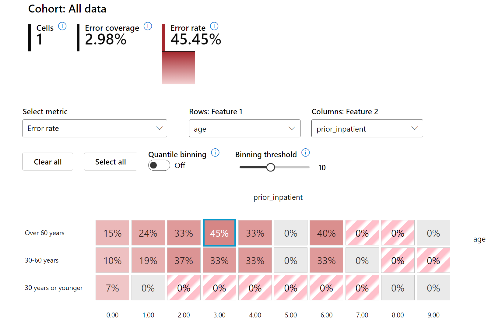

<!--
CO_OP_TRANSLATOR_METADATA:
{
  "original_hash": "ba0f6e1019351351c8ee4c92867b6a0b",
  "translation_date": "2025-08-29T17:26:22+00:00",
  "source_file": "9-Real-World/2-Debugging-ML-Models/README.md",
  "language_code": "ne"
}
-->
# पोस्टस्क्रिप्ट: जिम्मेवार AI ड्यासबोर्ड कम्पोनेन्टहरू प्रयोग गरेर मेसिन लर्निङ मोडेल डिबगिङ

## [पूर्व-व्याख्यान क्विज](https://gray-sand-07a10f403.1.azurestaticapps.net/quiz/5/)

## परिचय

मेसिन लर्निङले हाम्रो दैनिक जीवनलाई प्रभाव पार्छ। AI स्वास्थ्य सेवा, वित्त, शिक्षा, र रोजगारी जस्ता क्षेत्रहरूमा प्रवेश गर्दैछ, जसले हाम्रो व्यक्तिगत जीवन र समाजलाई असर गर्छ। उदाहरणका लागि, स्वास्थ्य सेवा निदान वा ठगी पत्ता लगाउने जस्ता दैनिक निर्णय प्रक्रियामा प्रणाली र मोडेलहरू संलग्न छन्। यसका परिणामस्वरूप, AI को प्रगतिहरू र यसको तीव्र अपनत्वसँगै समाजका अपेक्षाहरू विकसित हुँदै गएका छन्, र सरकारहरूले AI समाधानहरूलाई नियमन गर्न थालेका छन्। त्यसैले, यी मोडेलहरूलाई सबैका लागि निष्पक्ष, भरपर्दो, समावेशी, पारदर्शी, र उत्तरदायी परिणामहरू प्रदान गर्न विश्लेषण गर्नु महत्त्वपूर्ण छ।

यस पाठ्यक्रममा, हामी व्यावहारिक उपकरणहरूको अध्ययन गर्नेछौं जसले मोडेलमा जिम्मेवार AI सम्बन्धी समस्या छ कि छैन भनेर मूल्याङ्कन गर्न मद्दत गर्छ। परम्परागत मेसिन लर्निङ डिबगिङ प्रविधिहरू प्रायः मात्रात्मक गणनाहरूमा आधारित हुन्छन्, जस्तै समग्र सटीकता वा औसत त्रुटि हानि। कल्पना गर्नुहोस्, तपाईंले प्रयोग गरेको डाटामा कुनै जनसांख्यिकीय समूह (जस्तै जाति, लिङ्ग, राजनीतिक दृष्टिकोण, धर्म) को कमी छ भने के हुन्छ? वा कुनै जनसांख्यिकीय समूहलाई असमान रूपमा प्रतिनिधित्व गरिन्छ भने? यस्तो अवस्थामा मोडेलको परिणामले केही समूहलाई प्राथमिकता दिन सक्छ, जसले निष्पक्षता, समावेशिता, वा भरपर्दो परिणामहरूमा समस्या ल्याउन सक्छ। अर्को चुनौती भनेको मेसिन लर्निङ मोडेलहरूलाई "ब्ल्याक बक्स" मानिन्छ, जसले मोडेलको भविष्यवाणीलाई के चलाउँछ भन्ने बुझ्न र व्याख्या गर्न गाह्रो बनाउँछ। यी सबै चुनौतीहरू डाटा वैज्ञानिक र AI विकासकर्ताहरूले सामना गर्छन् जब उनीहरूसँग मोडेलको निष्पक्षता वा विश्वासनीयता मूल्याङ्कन गर्न पर्याप्त उपकरण हुँदैन।

यस पाठमा, तपाईंले आफ्नो मोडेल डिबग गर्न निम्न विधिहरू सिक्नुहुनेछ:

- **त्रुटि विश्लेषण**: डाटाको कुन भागमा मोडेलको त्रुटि दर उच्च छ भनेर पत्ता लगाउनुहोस्।
- **मोडेल अवलोकन**: विभिन्न डाटा समूहहरूमा मोडेलको प्रदर्शन मेट्रिक्सको तुलना गर्नुहोस्।
- **डाटा विश्लेषण**: डाटाको कुनै समूहलाई बढी वा कम प्रतिनिधित्व गरिएको छ कि छैन भनेर जाँच गर्नुहोस्।
- **फिचर महत्त्व**: मोडेलको भविष्यवाणीलाई कुन फिचरहरूले विश्वव्यापी वा स्थानीय स्तरमा प्रभाव पार्छ भनेर बुझ्नुहोस्।

## पूर्वआवश्यकता

पूर्वआवश्यकताका रूपमा, कृपया [विकासकर्ताहरूका लागि जिम्मेवार AI उपकरणहरू](https://www.microsoft.com/ai/ai-lab-responsible-ai-dashboard) पुनरावलोकन गर्नुहोस्।

> 

## त्रुटि विश्लेषण

परम्परागत मोडेल प्रदर्शन मेट्रिक्सहरू प्रायः सही र गलत भविष्यवाणीहरूको आधारमा गणना गरिन्छ। उदाहरणका लागि, यदि कुनै मोडेल ८९% सटीक छ र त्रुटि हानि ०.००१ छ भने, यो राम्रो प्रदर्शन मान्न सकिन्छ। तर, त्रुटिहरू डाटासेटमा समान रूपमा वितरित नहुन सक्छन्। तपाईंले ८९% सटीकता पाउन सक्नुहुन्छ, तर डाटाको कुनै क्षेत्रहरूमा मोडेल ४२% समय असफल भइरहेको हुन सक्छ। यस्तो असफलताले निष्पक्षता वा भरपर्दो परिणामहरूमा समस्या ल्याउन सक्छ। त्यसैले, मोडेलले राम्रो प्रदर्शन गरेको क्षेत्र र खराब प्रदर्शन गरेको क्षेत्र बुझ्न महत्त्वपूर्ण छ। 

RAI ड्यासबोर्डको त्रुटि विश्लेषण कम्पोनेन्टले विभिन्न समूहहरूमा मोडेलको असफलता कसरी वितरित छ भनेर ट्री भिजुअलाइजेसनमार्फत देखाउँछ। यसले डाटासेटमा उच्च त्रुटि दर भएका क्षेत्रहरू पत्ता लगाउन मद्दत गर्छ। 

उपयोगकर्ताहरूले डाटाको समूहहरू बनाएर विश्लेषण गर्न सक्छन्। यसले मोडेलले एक समूहमा राम्रो प्रदर्शन गरेको तर अर्कोमा किन त्रुटि गरिरहेको छ भनेर बुझ्न मद्दत गर्छ। 

ट्री म्यापमा रातो रंगको गाढा छायाले समस्या क्षेत्रहरू चाँडै पत्ता लगाउन मद्दत गर्छ। 

हिट म्याप पनि त्रुटि दर विश्लेषण गर्न प्रयोग गर्न सकिन्छ। 

त्रुटि विश्लेषण प्रयोग गर्नुहोस् जब तपाईंलाई चाहिन्छ:

* डाटासेट र विभिन्न फिचर आयामहरूमा मोडेल असफलता कसरी वितरित छ भनेर गहिरो रूपमा बुझ्न।
* समग्र प्रदर्शन मेट्रिक्सलाई तोडेर त्रुटिपूर्ण समूहहरू पत्ता लगाउन।

## मोडेल अवलोकन

मेसिन लर्निङ मोडेलको प्रदर्शन मूल्याङ्कन गर्न यसको व्यवहारको समग्र बुझाइ आवश्यक छ। यो त्रुटि दर, सटीकता, रिकल, प्रिसिजन, वा MAE (मिन एब्सोल्युट एरर) जस्ता धेरै मेट्रिक्सहरूको समीक्षा गरेर प्राप्त गर्न सकिन्छ। 

RAI ड्यासबोर्डको मोडेल अवलोकन कम्पोनेन्टले प्रदर्शन मेट्रिक्सहरूको तुलना गर्न र विभिन्न समूहहरूमा मोडेलको व्यवहार विश्लेषण गर्न मद्दत गर्छ। 

यो कम्पोनेन्टले प्रयोगकर्ताहरूलाई विशिष्ट फिचरहरूमा आधारित समूहहरू अलग गर्न र अनियमितताहरू पत्ता लगाउन अनुमति दिन्छ। 

मोडेल अवलोकन कम्पोनेन्टले दुई प्रकारका असमानता मेट्रिक्सलाई समर्थन गर्छ:

**मोडेल प्रदर्शनमा असमानता**: यी मेट्रिक्सले विभिन्न समूहहरूमा प्रदर्शन मेट्रिक्सको भिन्नता गणना गर्छ। 

**चयन दरमा असमानता**: यसले समूहहरूमा चयन दर (अनुकूल भविष्यवाणी) को भिन्नता देखाउँछ। 

## डाटा विश्लेषण

> "यदि तपाईंले डाटालाई पर्याप्त यातना दिनुभयो भने, यसले कुनै पनि कुरा स्वीकार्छ।" - रोनाल्ड कोस

यो भनाइ अतिशयोक्तिपूर्ण लाग्न सक्छ, तर डाटालाई कुनै पनि निष्कर्ष समर्थन गर्न हेरफेर गर्न सकिन्छ। कहिलेकाहीँ यस्तो हेरफेर अनजानेमा हुन्छ। 

डाटा विश्लेषण कम्पोनेन्टले डाटासेटमा बढी वा कम प्रतिनिधित्व भएका क्षेत्रहरू पत्ता लगाउन मद्दत गर्छ। 

डाटा विश्लेषण प्रयोग गर्नुहोस् जब तपाईंलाई चाहिन्छ:

* विभिन्न समूहहरूमा डाटाको वितरण बुझ्न।
* निष्पक्षता, त्रुटि विश्लेषण, र कारणहरूको सम्बन्धमा पत्ता लगाइएका समस्याहरूको कारण डाटाको वितरण हो कि होइन भनेर निर्धारण गर्न।

## मोडेल व्याख्यात्मकता

मेसिन लर्निङ मोडेलहरू प्रायः "ब्ल्याक बक्स" मानिन्छ। मोडेलको भविष्यवाणीलाई कुन फिचरहरूले प्रभाव पार्छ भन्ने बुझ्न गाह्रो हुन सक्छ। 

RAI ड्यासबोर्डको फिचर महत्त्व कम्पोनेन्टले मोडेलको भविष्यवाणीलाई कुन फिचरहरूले प्रभाव पार्छ भनेर बुझ्न मद्दत गर्छ। 

फिचर महत्त्व प्रयोग गर्नुहोस् जब तपाईंलाई चाहिन्छ:

* मोडेलको भविष्यवाणी कत्तिको विश्वासयोग्य छ भनेर निर्धारण गर्न।
* मोडेलको निर्णयमा प्रयोगकर्ताको विश्वास निर्माण गर्न।
* नियामक अडिट पूरा गर्न।

## निष्कर्ष

RAI ड्यासबोर्डका सबै कम्पोनेन्टहरू व्यावहारिक उपकरणहरू हुन् जसले समाजका लागि कम हानिकारक र बढी विश्वासयोग्य मेसिन लर्निङ मोडेलहरू निर्माण गर्न मद्दत गर्छ। यसले मानव अधिकारको रक्षा, जीवनका अवसरहरूमा केही समूहलाई विभेद नगर्ने, र शारीरिक वा मानसिक चोटपटकको जोखिम कम गर्न मद्दत गर्छ। 

केही सम्भावित हानिहरू यस प्रकार वर्गीकृत गर्न सकिन्छ:

- **वितरण**: यदि कुनै लिङ्ग वा जातिलाई प्राथमिकता दिइन्छ भने।
- **सेवाको गुणस्तर**: यदि डाटालाई एक विशिष्ट परिदृश्यका लागि मात्र तालिम दिइन्छ भने, तर वास्तविकता धेरै जटिल छ।
- **रुढीवादी सोच**: कुनै समूहलाई पूर्वनिर्धारित विशेषतासँग जोड्नु।
- **अपमान**: कुनै कुरा वा व्यक्तिलाई अन्यायपूर्ण रूपमा आलोचना गर्नु।
- **अधिक वा कम प्रतिनिधित्व**। यो विचार हो कि कुनै निश्चित समूहलाई कुनै निश्चित पेशामा देखिँदैन, र कुनै पनि सेवा वा कार्य जसले यसलाई निरन्तर प्रवर्द्धन गर्छ, त्यसले हानि पुर्‍याइरहेको छ।

### Azure RAI ड्यासबोर्ड

[Azure RAI ड्यासबोर्ड](https://learn.microsoft.com/en-us/azure/machine-learning/concept-responsible-ai-dashboard?WT.mc_id=aiml-90525-ruyakubu) खुला स्रोत उपकरणहरूमा आधारित छ, जुन प्रमुख शैक्षिक संस्थाहरू र संगठनहरूले विकास गरेका हुन्, जसमा Microsoft पनि समावेश छ। यी उपकरणहरूले डेटा वैज्ञानिकहरू र AI विकासकर्ताहरूलाई मोडेलको व्यवहार राम्रोसँग बुझ्न, र AI मोडेलहरूबाट उत्पन्न हुने अवाञ्छित समस्याहरू पत्ता लगाउन र समाधान गर्न मद्दत गर्छ।

- RAI ड्यासबोर्डका विभिन्न कम्पोनेन्टहरू कसरी प्रयोग गर्ने भनेर [डक्स](https://learn.microsoft.com/en-us/azure/machine-learning/how-to-responsible-ai-dashboard?WT.mc_id=aiml-90525-ruyakubu) हेरेर सिक्नुहोस्।

- Azure Machine Learning मा थप जिम्मेवार AI परिदृश्यहरूको डिबगिङका लागि केही RAI ड्यासबोर्ड [नमूना नोटबुकहरू](https://github.com/Azure/RAI-vNext-Preview/tree/main/examples/notebooks) हेर्नुहोस्।

---
## 🚀 चुनौती

पहिले नै सांख्यिकीय वा डेटा पूर्वाग्रहहरू प्रवेश गर्न नदिनका लागि, हामीले निम्न गर्नुपर्छ:

- प्रणालीमा काम गर्ने व्यक्तिहरूको पृष्ठभूमि र दृष्टिकोणमा विविधता सुनिश्चित गर्नुहोस्  
- हाम्रो समाजको विविधतालाई प्रतिबिम्बित गर्ने डेटासेटहरूमा लगानी गर्नुहोस्  
- पूर्वाग्रह देखा परेमा पत्ता लगाउने र सुधार गर्ने राम्रो विधिहरू विकास गर्नुहोस्  

मोडेल निर्माण र प्रयोगमा अन्याय स्पष्ट देखिने वास्तविक जीवनका परिदृश्यहरूको बारेमा सोच्नुहोस्। अरू के विचार गर्नुपर्छ?

## [पोस्ट-लेक्चर क्विज](https://gray-sand-07a10f403.1.azurestaticapps.net/quiz/6/)
## समीक्षा र आत्म-अध्ययन

यस पाठमा, तपाईंले मेसिन लर्निङमा जिम्मेवार AI समावेश गर्ने केही व्यावहारिक उपकरणहरू सिक्नुभएको छ।

यी विषयहरूमा अझ गहिरो रूपमा जानको लागि यो कार्यशाला हेर्नुहोस्:

- जिम्मेवार AI ड्यासबोर्ड: व्यवहारमा RAI सञ्चालनका लागि एक-स्टप समाधान, Besmira Nushi र Mehrnoosh Sameki द्वारा

> 🎥 माथिको छविमा क्लिक गर्नुहोस् भिडियोका लागि: जिम्मेवार AI ड्यासबोर्ड: व्यवहारमा RAI सञ्चालनका लागि एक-स्टप समाधान, Besmira Nushi र Mehrnoosh Sameki द्वारा

जिम्मेवार AI र अझ विश्वासयोग्य मोडेलहरू निर्माण गर्ने तरिकाहरू सिक्न निम्न सामग्रीहरूको सन्दर्भ लिनुहोस्:

- ML मोडेलहरू डिबग गर्न Microsoft का RAI ड्यासबोर्ड उपकरणहरू: [जिम्मेवार AI उपकरण स्रोतहरू](https://aka.ms/rai-dashboard)

- जिम्मेवार AI टूलकिट अन्वेषण गर्नुहोस्: [Github](https://github.com/microsoft/responsible-ai-toolbox)

- Microsoft को RAI स्रोत केन्द्र: [जिम्मेवार AI स्रोतहरू – Microsoft AI](https://www.microsoft.com/ai/responsible-ai-resources?activetab=pivot1%3aprimaryr4)

- Microsoft को FATE अनुसन्धान समूह: [FATE: AI मा निष्पक्षता, उत्तरदायित्व, पारदर्शिता, र नैतिकता - Microsoft Research](https://www.microsoft.com/research/theme/fate/)

## असाइनमेन्ट

[RAI ड्यासबोर्ड अन्वेषण गर्नुहोस्](assignment.md)

---

**अस्वीकरण**:  
यो दस्तावेज़ AI अनुवाद सेवा [Co-op Translator](https://github.com/Azure/co-op-translator) प्रयोग गरेर अनुवाद गरिएको छ। हामी शुद्धताको लागि प्रयास गर्छौं, तर कृपया ध्यान दिनुहोस् कि स्वचालित अनुवादमा त्रुटिहरू वा अशुद्धताहरू हुन सक्छ। यसको मूल भाषा मा रहेको मूल दस्तावेज़लाई आधिकारिक स्रोत मानिनुपर्छ। महत्वपूर्ण जानकारीको लागि, व्यावसायिक मानव अनुवाद सिफारिस गरिन्छ। यस अनुवादको प्रयोगबाट उत्पन्न हुने कुनै पनि गलतफहमी वा गलत व्याख्याको लागि हामी जिम्मेवार हुने छैनौं।