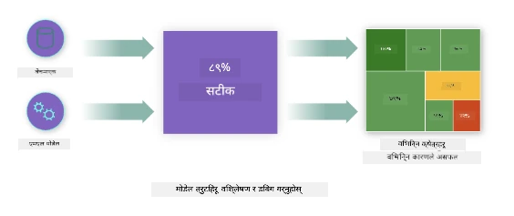
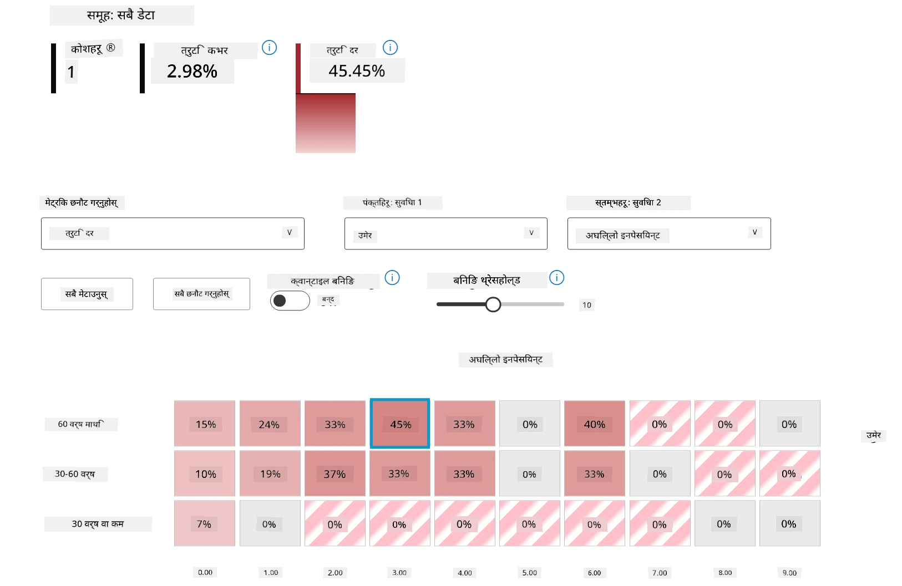
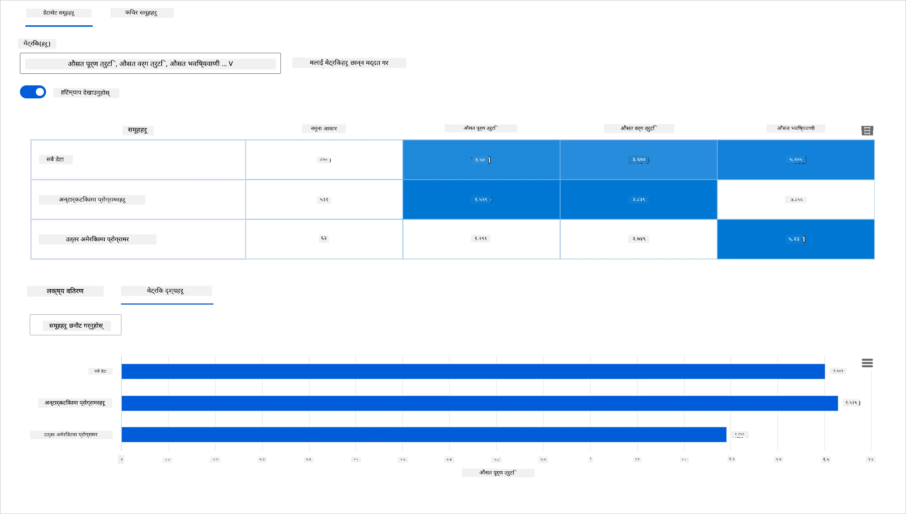
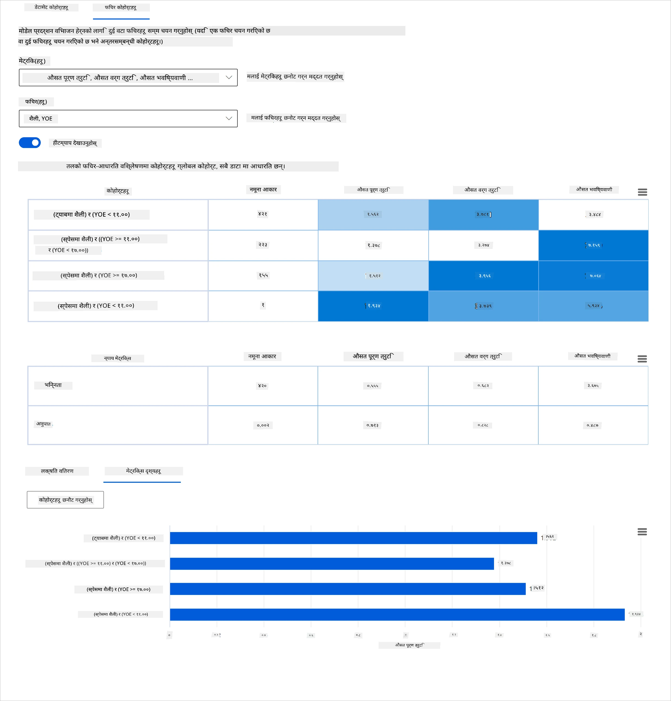
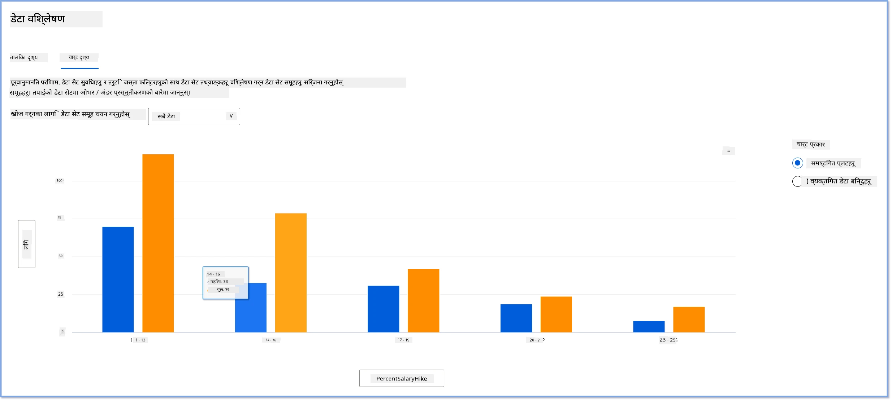
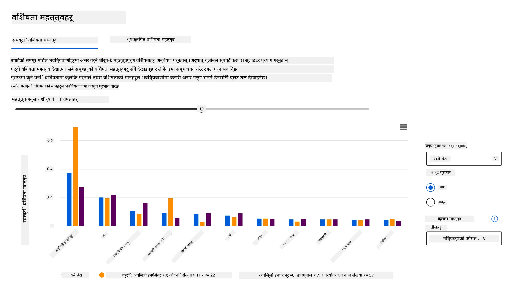
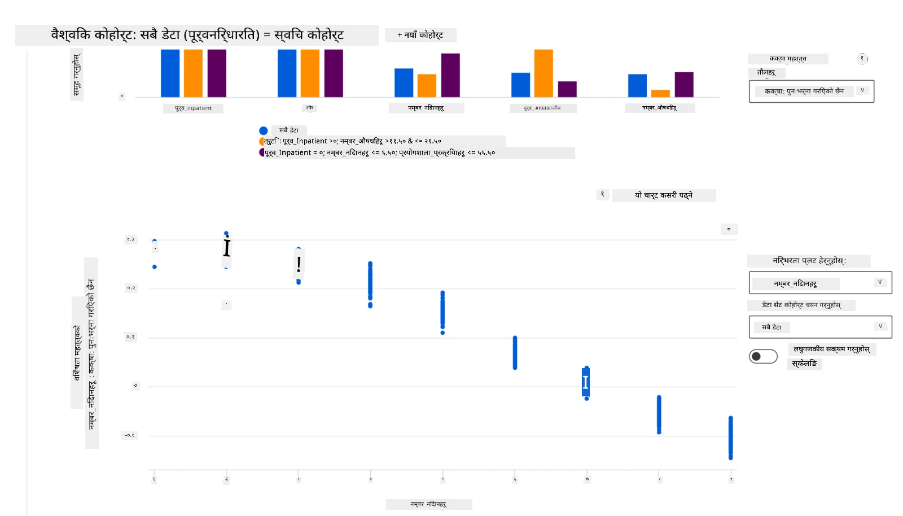

# पोष्टस्क्रिप्ट: जिम्मेवार AI ड्यासबोर्ड कम्पोनेन्टहरूको उपयोग गरी मेसिन लर्निङमा मोडल डिबगिङ
 

## [पाठ अघि क्विज](https://ff-quizzes.netlify.app/en/ml/)
 
## परिचय

मेसिन लर्निङले हाम्रो दैनिक जीवनमा प्रभाव पार्दछ। AI हामीलाई व्यक्तिगत तथा समाजको रूपमा प्रभाव पार्ने सबैभन्दा महत्वपूर्ण प्रणालीहरूमा मार्ग बनाउँदैछ, स्वास्थ्य सेवा, वित्तीय सेवा, शिक्षा, र रोजगारदेखि। उदाहरणका लागि, प्रणाली र मोडेलहरू दैनिक निर्णय-निर्माण कार्यहरूमा संलग्न छन्, जस्तै स्वास्थ्य सेवा निदान वा धोखाधडी पत्ता लगाउने। नतिजाको रूपमा, AI मा प्रगति र यसको तिव्र अपनत्वले सामाजिक अपेक्षाहरू विकास भइरहेका छन् र यसको जवाफ स्वरूप नियमहरू बढिरहेका छन्। हामी निरन्तर यी क्षेत्रहरू देख्छौं जहाँ AI प्रणालीहरूले अपेक्षाहरू पूरा गर्न नसक्दछन्; तिनीहरूले नयाँ चुनौतीहरू उठाउँछन्; र सरकारले AI समाधानहरूलाई नियमन गर्न सुरु गरेको छ। त्यसैले, यी मोडेलहरूलाई सबैका लागि न्यायपूर्ण, भरपर्दो, समावेशी, पारदर्शी, र जवाफदेही परिणामहरू दिनका लागि विश्लेषण गर्नु महत्त्वपूर्ण छ।

यस पाठ्यक्रममा, हामी व्यावहारिक उपकरणहरू हेर्नेछौं जसले मोडलमा जिम्मेवार AI का समस्याहरू छ कि छैन जाँच्न सक्छ। परम्परागत मेसिन लर्निङ डिबगिङ प्रविधिहरू सामान्यतया संख्यात्मक गणनाहरूमा आधारित हुन्छन् जस्तै समग्र सटीकता वा औसत त्रुटि हानि। कल्पना गर्नुहोस् जब तपाईं प्रयोग गरिरहेको डेटामा केही जातीयता, लिंग, राजनीतिक दृष्टिकोण, धर्म जस्ता जनसांख्यिकीयहरू अभाव छ वा असमान रूपमा प्रतिनिधित्व गरिएको छ भने के हुन सक्छ। के हुन्छ जब मोडलको आउटपुट केहि जनसांख्यिकीयलाई प्राथमिकता दिने गरी व्याख्या गरिन्छ? यसले संवेदनशील विशेषता समूहहरूको अत्यधिक वा कम प्रतिनिधित्वलाई जन्म दिन सक्छ जसले मोडेलबाट न्याय, समावेशीता, वा भरपर्दो समस्या निम्त्याउँछ। अर्को पक्ष, मेसिन लर्निङ मोडेलहरूलाई ब्ल्याक बक्स मानिन्छ, जसले मोडेलको भविष्यवाणी के द्वारा परिचालित छ बुझ्न र व्याख्या गर्न गाह्रो बनाउँछ। यी सबै चुनौतीहरू डाटा वैज्ञानिक र AI विकासकर्ताहरूले सामना गर्छन् जब उनीहरूसँग मोडलको न्याय वा विश्वसनीयता मूल्यांकन गर्न पर्याप्त उपकरण हुँदैन।

यस पाठमा, तपाईंले तलका उपकरणहरूसँग आफ्नो मोडल डिबग गर्ने तरिका सिक्नु हुनेछ:

-	**त्रुटि विश्लेषण**: तपाईंको डेटा वितरणमा मोडललाई उच्च त्रुटि दर कहाँ छ पहिचान गर्नुहोस्।
-	**मोडेल अवलोकन**: विभिन्न डेटा समूहहरूमा तुलनात्मक विश्लेषण गरेर मोडेलको प्रदर्शन मेट्रिक्समा भिन्नता पत्ता लगाउनुहोस्।
-	**डेटा विश्लेषण**: तपाईंको डेटा कहाँ अत्यधिक वा कम प्रतिनिधित्व हुन सक्छ जाँच गरेर मोडेलले कुनै एक जनसांख्यिकीयलाई प्राथमिकता दिने तरिका पत्ता लगाउनुहोस्।
-	**विशेषता महत्व**: कुन विशेषताहरूले तपाईंको मोडलका भविष्यवाणिहरूलाई विश्वव्यापी वा स्थानीय स्तरमा संचालित गरिरहेका छन् बुझ्नुहोस्।

## पूर्वाधार

पूर्वाधारको रूपमा, कृपया समीक्षा गर्नुहोस् [जिम्मेवार AI विकासकर्ता उपकरणहरू](https://www.microsoft.com/ai/ai-lab-responsible-ai-dashboard)।

> 

## त्रुटि विश्लेषण

परम्परागत मोडल प्रदर्शन मेट्रिक्सहरू प्रायः सही र गलत भविष्यवाणीहरूको आधारमा गणना गरिन्छ। उदाहरणका लागि, मोडल ८९% समय सटीक छ र त्रुटि हानि ०.००१ छ भन्ने निर्धारण राम्रो प्रदर्शन मानिन्छ। त्रुटिहरू सामान्यतः तपाईंको आधारभूत डेटासेटमा समान रूपमा वितरित हुँदैनन्। तपाईंले ८९% मोडल सटीकता पाउनसक्नुहुन्छ तर पत्ता लगाउनसक्नुहुन्छ कि मोडल केही डेटा भूभागहरूमा ४२% समय असफल हुन्छ। यी असफलताको ढाँचाहरूले केही डेटा समूहमा न्याय वा भरपर्दो समस्या निम्त्याउन सक्छ। मोडलले राम्रो वा खराब प्रदर्शन गरिरहेको क्षेत्रहरू बुझ्नु आवश्यक छ। त्यस्ता डेटा क्षेत्रहरू जहाँ मोडलमा धेरै अशुद्धि हुन्छ, त्यहाँ महत्वपूर्ण डेटा जनसांख्यिकीय हुन सक्छ।  

RAI ड्यासबोर्डमा त्रुटि विश्लेषण कम्पोनेन्टले विभिन्न समूहहरूमा मोडेल असफलता कसरी वितरण गरिएको छ भनी वृक्ष दृश्यशैलीमा देखाउँछ। यसले तपाईंको डेटासेटमा ठूलो त्रुटि दर भएका विशेषता वा क्षेत्रहरू पहिचान गर्न मद्दत गर्छ। मोडेलका अधिकांश अशुद्धिहरू कहाँबाट आउँछन् हेरेर, तपाईँ जरा कारण अनुसन्धान गर्न सुरु गर्न सक्नुहुन्छ। तपाईं विश्लेषण गर्न डेटा समूहहरू पनि बनाउन सक्नुहुन्छ। यी डेटा समूहहरूले डिबगिङ प्रक्रियामा मद्दत गर्छन् किनभने मोडेलको प्रदर्शन एक समूहमा राम्रो छ तर अर्कोमा गलत छ भनेर बुझ्न।

वृक्ष नक्सामा दृश्य संकेतहरूले समस्या क्षेत्र छिटो पत्ता लगाउन मद्दत गर्छ। उदाहरणका लागि, वृक्ष नोडको गाढा रातो छायाँले त्रुटि दर उच्च छ जनाउँछ।  

हीट म्याप अर्को दृश्यता सुविधा हो जसले प्रयोगकर्ताहरूलाई एक वा दुई विशेषता प्रयोग गरी पूरा डेटासेट वा समूहहरूमा मोडेल त्रुटिहरूको कारण खोज्न मद्दत पुर्‍याउँछ।

त्रुटि विश्लेषण निम्न अवस्थामा प्रयोग गर्नुहोस्:

* मोडेल असफलताहरू कसरी डेटासेट र विभिन्न इनपुट र विशेषता आयामहरूमा वितरण छन् गहिरो रूपमा बुझ्न।
* समग्र प्रदर्शन मेट्रिक्सहरू तोड्नु र स्वतः गलत समूहहरू फेला पार्नु जसले लक्षित समाधान कदमहरूलाई जानकारी दिन्छ।

## मोडल अवलोकन

मेसिन लर्निङ मोडलको प्रदर्शन मूल्यांकन गर्दा यसको व्यवहारको समग्र बुझाइ हुनु आवश्यक छ। यो त्रुटि दर, सटीकता, रिक्याल, प्रेसिजन, वा MAE (मिन एब्सोल्युट एरर) जस्ता एक भन्दा बढी मेट्रिक्स समीक्षा गरेर प्राप्त गर्न सकिन्छ जसले प्रदर्शन मेट्रिक्सहरू बीच भिन्नता पत्ता लगाउँछ। एक प्रदर्शन मेट्रिक राम्रो देखिए पनि अर्को मेट्रिकमा अशुद्धिहरू देख्न सकिन्छ। साथै, सम्पूर्ण डेटासेट वा समूहहरूमा भिन्नता तुलना गर्दा मोडेल कुन ठाउँमा राम्रो गरिरहेको छ वा छैन थाहा हुन्छ। यो विशेष गरी संवेदनशील बनाम असंवेदनशील विशेषताहरू (जस्तै, बिरामीको जात, लिंग, उमेर) बीच मोडेलको प्रदर्शन हेर्न महत्वपूर्ण छ जसले सम्भावित अन्याय पत्ता लगाउन मद्दत गर्दछ। उदाहरणका लागि, संवेदनशील विशेषता भएको समूहमा मोडेल बढी अशुद्ध छ भने सम्भावित अन्याय देखाउन सक्छ। 

RAI ड्यासबोर्डको मोडल अवलोकन कम्पोनेन्टले केवल समूहमा डेटा प्रतिनिधित्वको प्रदर्शन विश्लेषण गर्ने मात्र होइन, विभिन्न समूहहरूको बीचमा मोडेलको व्यवहार तुलना गर्ने क्षमता पनि दिन्छ।

कम्पोनेन्टको विशेषता-आधारित विश्लेषणले प्रयोगकर्तालाई कुनै विशेष विशेषताभित्र डेटा उपसमूहहरूमा सङ्कुचित भएर ग्रानुलर स्तरमा विसंगतिहरू पहिचान गर्न सक्षम बनाउँछ। उदाहरणका लागि, ड्यासबोर्डमा प्रयोगकर्ताले छनोट गरेको विशेषता (जस्तै, *"time_in_hospital < 3"* या *"time_in_hospital >= 7"*) को लागि स्वतः समूहहरू सिर्जना गर्ने इन्टेलिजेन्स हुन्छ। यसले ठूलो डेटा समूहबाट कुनै विशेष विशेषतालाई अलग गर्ने र मोडेलका गलत परिणामहरू तर्फ के प्रभाव पारेको छ हेर्न मद्दत गर्दछ।

मोडल अवलोकन कम्पोनेन्टले दुई प्रकारका भिन्नता मेट्रिक्स समर्थन गर्छ:

**मोडेल प्रदर्शनमा भिन्नता**: यी मेट्रिक्सहरूले चयनित प्रदर्शन मेट्रिकको मानको भिन्नता (अन्तर) उपसमूहहरूमा गणना गर्छन्। केही उदाहरणहरू:

* सटीकता दरमा भिन्नता
* त्रुटि दरमा भिन्नता
* प्रेसिजनमा भिन्नता
* रिक्यालमा भिन्नता
* औसत पूर्ण त्रुटि (MAE) मा भिन्नता

**चयन दरमा भिन्नता**: यो मेट्रिकले उपसमूहहरूमा चयन दर (सकारात्मक भविष्यवाणी) को भिन्नता समावेश गर्छ। एक उदाहरण हो ऋण अनुमोदन दरमा भिन्नता। चयन दर भनेको प्रत्येक वर्गमा १ (द्वैध वर्गीकरणमा) को रूपमा वर्गीकृत डेटा पोइन्टहरूको अंश वा भविष्यवाणी मानहरूको वितरण (रेग्रेशनमा) को सङ्ख्या हो।

## डेटा विश्लेषण

> "यदि तपाईं डेटा धेरै चोटि त्रास दिनुहुन्छ भने, यो जुनसुकै कुरा स्वीकार्छ" - Ronald Coase

यो कथन अतिनाटक जस्तो सुनिन्छ, तर यो सत्य छ कि डेटा कुनै पनि निष्कर्ष समर्थन गर्न हेरफेर गर्न सकिन्छ। यस्तो हेरफेर कहिलेकाहीं अनजानेमा हुन्छ। हामी सबैमा पक्षपात हुन्छ, र कहिले हामी डेटा मा पक्षपात परिचय गराइरहेका छौं भन्ने सजग रुपमा थाहा पाउन गाह्रो हुन्छ। AI र मेसिन लर्निङमा न्याय सुनिश्चित गर्नु चुनौतीपूर्ण कार्य हो। 

परम्परागत मोडल प्रदर्शन मेट्रिक्सका लागि डेटा ठूलो अन्धकार क्षेत्र हो। तपाईंसँग उच्च सटीकता हुन सक्छ, तर यो जहिल्यै तपाईंको डेटासेटको आधारभूत पक्षपातलाई प्रतिबिम्बित गर्दैन। उदाहरणको लागि, यदि कुनै कम्पनीमा कार्यरत कर्मचारीहरूमध्ये २७% महिला कार्यकारी स्तरमा छन् र ७३% पुरुष, तब यस्तो डेटामा प्रशिक्षित AI मोडेल वरिष्ठ स्तरको रोजगारका लागि मुख्यतया पुरुष लक्षित विज्ञापन गर्न सक्छ। डेटामा यो असन्तुलनले मोडेलको भविष्यवाणीलाई एक लिंगलाई प्राथमिकता दिन प्रवृत्त गराएको छ। यसले AI मोडेलमा लिंग पक्षपातको न्यायको समस्या उदांगो बनाउँछ।  

RAI ड्यासबोर्डमा डेटा विश्लेषण कम्पोनेन्टले डेटासेटमा अत्यधिक वा कम प्रतिनिधित्व भएका क्षेत्रहरू पत्ता लगाउन मद्दत गर्छ। यसले प्रयोगकर्तालाई त्रुटि र न्यायसम्बन्धी समस्याहरू उत्पन्न गर्ने डेटा असन्तुलन वा विशिष्ट डेटा समूहको अभावको कारण निदान गर्न सक्षम बनाउँछ। यसले प्रयोगकर्तालाई भविष्यवाणी र वास्तविक परिणामहरू, त्रुटि समूहहरू, र विशेष विशेषताहरूको आधारमा डेटासेटहरू दृश्यात्मक रूपमा देखाउन अनुमति दिन्छ। कहिलेकाहीं कम प्रतिनिधित्व भएका डेटा समूह पत्ता लगाउँदा मोडेल राम्रो सिक्दै नसकेको पनि देखिन्छ, त्यसैले ती उच्च अशुद्धिहरू हुन्छन्। डेटा पक्षपात भएको मोडेल केवल न्यायसम्बन्धी समस्या मात्र होइन तर मोडेल समावेशी वा भरपर्दो छैन भन्ने संकेत हो।

डेटा विश्लेषण तब प्रयोग गर्नुहोस् जब तपाईं:

* विभिन्न फिल्टरहरू चयन गरेर आफ्नो डेटासेट तथ्यांकहरू अन्वेषण गर्न चाहनुहुन्छ जसले तपाईंको डेटा विभिन्न आयामहरूमा (समूहहरूमा) टुक्र्याउँछ।
* आफ्नो डेटासेटको वितरण विभिन्न समूहहरू र विशेषता समूहहरूमा कसरी छ बुझ्न चाहनुहुन्छ।
* आफ्नो समूह, त्रुटि विश्लेषण, र कारण-प्रभाव सम्बन्धी अनुसन्धान (अन्य ड्यासबोर्ड कम्पोनेन्टहरूबाट प्राप्त) तपाईँको डेटासेटको वितरणकै कारण हो कि होइन थाहा पाउन चाहनुहुन्छ।
* प्रतिनिधित्व समस्याहरू, लेबल आवाज, विशेषता आवाज, लेबल पक्षपात, र यसका समान कारणले आएका त्रुटिहरू कम गर्न थप डेटा सङ्कलन कहाँ गर्नुपर्ने निर्णय गर्न चाहनुहुन्छ।

## मोडेल व्याख्याशीलता

मेसिन लर्निङ मोडेलहरू प्रायः ब्ल्याक बक्स जस्तै हुन्छन्। कुन मुख्य डेटा विशेषताहरूले मोडेलको भविष्यवाणी चलाउँछन् बुझ्न चुनौतीपूर्ण हुन्छ। मोडेलले किन निश्चित भविष्यवाणी गरेको छ भन्ने पारदर्शिता दिनु महत्त्वपूर्ण छ। उदाहरणका लागि, यदि AI प्रणालीले डायबिटिज भएका बिरामीलाई ३० दिनभित्र पुनः अस्पताल भर्ना हुनसक्ने जोखिम अनुमान गर्छ भने यसले आफ्नो भविष्यवाणीसम्म पुग्न प्रयोग गरिएको सहायक डाटा प्रदान गर्न सक्नुपर्छ। सहायक डेटा संकेतकहरूले चिकित्सक वा अस्पतालहरूलाई सूचित निर्णय लिन पारदर्शिता दिन्छ। साथै, मोडेलले किन भविष्यवाणी गरेको छ भनेर व्याख्या गर्न सक्नु स्वास्थ्य नियमहरूको आधिकारिक जवाफदेहितामा मद्दत गर्दछ। जब तपाईं मानिसहरूको जीवनमा प्रभाव पार्ने तरिकाले मेसिन लर्निङ मोडेलहरू प्रयोग गर्दै हुनुहुन्छ, मोडेलको व्यवहार केले प्रभावित गरिरहेको छ बुझ्न र व्याख्या गर्न आवश्यक छ। मोडेल व्याख्या र व्याख्याशीलता यस्ता प्रश्नहरूको जवाफ दिन्छ जस्तै:

* मोडेल डिबगिङ: मेरो मोडलले किन यो गल्ती गर्यो? मैले कसरी सुधार गर्ने?
* मानव-AI सहकार्य: म कसरी मोडेलका निर्णयहरू बुझ्ने र विश्वास गर्ने?
* नियम पालना: मेरो मोडलले कानुनी आवश्यकता पूरा गर्छ कि गर्दैन?

RAI ड्यासबोर्डको विशेषता महत्व कम्पोनेन्टले तपाईंलाई मोडलको डिबगिङ गर्ने र मोडलले कसरी भविष्यवाणी गर्छ comprehensive बुझ्न मद्दत गर्छ। यो मेसिन लर्निङ व्यवसायी तथा निर्णय-निर्माताहरूलाई पनि मोडल व्यवहारमा प्रभाव पार्ने विशेषताहरू स्पष्ट गर्न र प्रमाणित गर्न उपयोगी उपकरण हो जुन नियम पालना सुनिश्चित गर्न सहयोगी छ। प्रयोगकर्ताहरूले विश्वव्यापी र स्थानीय व्याख्याहरू खोज्न सक्छन् जसले कुन विशेषताले मोडलको भविष्यवाणी चलाएको हो पत्ता लगाउन मद्दत गर्छ। विश्वव्यापी व्याख्याहरूले मोडलको समग्र भविष्यवाणीलाई प्रभावित गर्ने शीर्ष विशेषताहरू सूचीबद्ध गर्छ। स्थानीय व्याख्याहरूले व्यक्तिगत केसका लागि मोडलले भविष्यवाणी किन गर्‍यो देखाउँछ। स्थानीय व्याख्याहरूको मूल्याङ्कन गरि एक विशिष्ट केस डिबग वा अडिट गर्न सकिन्छ जसले किन मोडलले सटीक वा अशुद्ध भविष्यवाणी गर्‍यो बुझ्न सजिलो बनाउँछ। 

* विश्वव्यापी व्याख्या: उदाहरणका लागि, डायबिटिज अस्पताल पुनः भर्ना मोडलको सामान्य व्यवहारलाई कुन विशेषताले असर गरिरहेको छ?
* स्थानीय व्याख्या: उदाहरणका लागि, किन ६० वर्षभन्दा माथि डायबेटिक बिरामी जसलाई पहिले अस्पताल भर्ना गरिएको थियो ३० दिनभित्र पुनः अस्पतालमा भर्ना वा नतिको भविष्यवाणी गरिएको?

विभिन्न समूहहरूमा मोडलको प्रदर्शन परीक्षण गर्ने डिबगिङ प्रक्रियामा, विशेषता महत्वले समूहहरूमा एउटा विशेषताले कस्तो प्रभाव पारिरहेको छ देखाउँछ। यो मोडलको गलत भविष्यवाणी गर्नमा विशेषताले कत्तिको प्रभावकारी छ पत्ता लगाउँदा विसंगति प्रकट गर्न मद्दत गर्छ। यदि कुनै मोडेलले गलत भविष्यवाणी गर्‍यो भने, यस कम्पोनेन्टले तपाईंलाई विशेषता वा विशेषता मानहरू चिन्न मद्दत गर्छ जुन भविष्यवाणीको कारण भए। यसले केवल डिबगिङमै होइन, auditing अवस्थामा पारदर्शिता र जवाफदेहिता पनि प्रदान गर्छ। अन्त्यमा, कम्पोनेन्टले तपाईंलाई न्यायसम्बन्धी समस्या पत्ता लगाउन मद्दत गर्छ। उदाहरणका लागि, यदि संवेदनशील विशेषता जस्तै जातीयता वा लिंगले मोडलको भविष्यवाणीमा धेरै प्रभाव पारिरहेको छ भने, यो जातीय वा लिंग पक्षपातको संकेत हुन सक्छ।

व्याख्याशीलता तब प्रयोग गर्नुहोस् जब तपाईं:

* तपाईंको AI प्रणालीका भविष्यवाणीहरू कति भरपर्दो छन् बुझ्न चाहनुहुन्छ र कुन विशेषता भविष्यवाणीहरूका लागि सबैभन्दा महत्वपूर्ण छ जान्न चाहनुहुन्छ।
* पहिले मोडललाई बुझेर डिबगिङ गर्ने तरिका अपनाउन चाहनुहुन्छ र मोडलले स्वस्थ विशेषता प्रयोग गरिरहेको छ वा केवल गलत सम्बन्धहरूमा निर्भर छ भनी पत्ता लगाउन चाहनुहुन्छ।
* सम्भावित अन्यायका स्रोतहरू पत्ता लगाउन चाहनुहुन्छ कि मोडल संवेदनशील विशेषताहरूमा आधारित छ वा तीसँग धेरै सम्बन्धित अन्य विशेषतामा आधारित छ।
* प्रयोगकर्ताको मोडल निर्णयहरूमा विश्वास बनाउन चाहनुहुन्छ भने स्थानीय व्याख्या उत्पादन गरेर उनीहरूको परिणाम देखाउन।
* AI प्रणालीको नियम पालना अडिट पूरा गर्न चाहनुहुन्छ ताकि मोडेलहरूको मान्यता र मानवमा मोडेल निर्णयहरूको प्रभाव निगरानी गर्न सकियोस्।

## निष्कर्ष

सबै RAI ड्यासबोर्ड कम्पोनेन्टहरू व्यावहारिक उपकरणहरू हुन् जसले तपाईंलाई कम हानिकारक र सामाजिक रूपमा अधिक भरोसायोग्य मेसिन लर्निङ मोडेलहरू बनाउने मद्दत गर्छ। यसले मानव अधिकारमा खतरा रोकथाम सुधार्छ; जीवनका अवसरहरूमा केहि समूहहरूलाई भेदभाव वा बहिष्कार नगर्न मद्दत गर्छ; र भौतिक वा मानसिक चोटको जोखिम घटाउँछ। यसले मोडेलका निर्णयहरूमा विश्वास बनाउन पनि मद्दत गर्दछ स्थानीय व्याख्याहरू उत्पादन गरेर तिनीहरूको परिणाम देखाउने। सम्भावित हानिहरूलाई यसरी वर्गीकरण गर्न सकिन्छ:

- **विनियोजन**, यदि कुनै लिंग वा जातीयता अर्कोसँग तुलना गर्दा प्राथमिकता दिइएको छ भने।
- **सेवाको गुणस्तर**। तपाईंले कुनै विशेष परिप्रेक्ष्यमा डेटा तालिम दिनुभयो तर वास्तविकता धेरै जटिल छ भने, यसले कमजोर सेवा प्रदर्शन गराउँछ।
- **रूपक लगाउने**। कुनै समूहलाई पूर्वनिर्धारित विशेषतासँग जोड्ने।

- **अपमान**। कुनै वस्तु वा व्यक्तिलाई अन्यायपूर्ण रूपमा आलोचना गर्ने र लेबल लगाउने।
- **अधिक वा कम प्रतिनिधित्व**। विचार भनेको कुनै निश्चित समूहलाई कुनै विशिष्ट पेशामा नदेखिने, र कुनै सेवा वा कार्य जसले यसलाई प्रवर्द्धन गरिरहन्छ त्यो हानिकारक हुन्छ।

### Azure RAI ड्यासबोर्ड
 
[Azure RAI ड्यासबोर्ड](https://learn.microsoft.com/en-us/azure/machine-learning/concept-responsible-ai-dashboard?WT.mc_id=aiml-90525-ruyakubu) खुला स्रोत उपकरणहरूमा आधारित छ जुन अग्रणी शैक्षिक संस्था र संगठनहरूले विकास गरेका छन्, जसमा Microsoft पनि शामिल छ, जसले डाटा वैज्ञानिक र AI विकासकर्ताहरूलाई मोडेल व्यवहारलाई राम्रोसँग बुझेका छन्, अवाञ्छित समस्या पत्ता लगाउन र कम गर्न सहयोग पुर्याउँछन्।

- विभिन्न कम्पोनेन्टहरूको प्रयोग कसरी गर्ने भन्ने सिक्नको लागि RAI ड्यासबोर्डका [कागजातहरू](https://learn.microsoft.com/en-us/azure/machine-learning/how-to-responsible-ai-dashboard?WT.mc_id=aiml-90525-ruyakubu) हेर्नुहोस्।

- Azure Machine Learning मा जिम्मेवार AI परिदृश्यहरू डिबग गर्नका लागि RAI ड्यासबोर्डका केही [नमूना नोटबुकहरू](https://github.com/Azure/RAI-vNext-Preview/tree/main/examples/notebooks) हेर्नुहोस्। 
  
---
## 🚀 चुनौती 
 
सांख्यिकीय वा डाटा पक्षपात पहिलो स्थानमा प्रवेश हुनबाट रोक्न हामीले: 

- प्रणालीहरूमा काम गर्ने मानिसहरूबीच विविध पृष्ठभूमि र दृष्टिकोणहरू हुनुपर्छ 
- हाम्रो समाजको विविधतालाई प्रतिबिम्बित गर्ने डाटासेटहरूमा लगानी गर्नुपर्छ 
- पक्षपात देखापरेमा त्यसलाई पत्ता लगाउने र सुधार गर्ने बेहतर तरिकाहरू विकास गर्नुपर्छ 

वास्तविक जीवनका अवस्थाहरू जहाँ मोडेल निर्माण र उपयोगमा अन्याय स्पष्ट हुन्छ सोच्नुहोस्। हामीले के थप ध्यान दिनुपर्छ? 

## [पाठ पछि क्विज](https://ff-quizzes.netlify.app/en/ml/)
## समीक्षा र आत्म-अध्ययन 
 
यस पाठमा, तपाईंले जिम्मेवार AI लाई मेशिन लर्निङमा समावेश गर्ने केहि व्यावहारिक उपकरणहरू सिक्नुभएको छ।  

विषयहरूमा अझ गहिराइमा जान यस कार्यशाला हेर्नुहोस्: 

- जिम्मेवार AI ड्यासबोर्ड: अभ्यासमा RAI सञ्चालन गर्न एक-स्टप पसल, प्रस्तुतकर्ता Besmira Nushi र Mehrnoosh Sameki

> 🎥 माथिको चित्रमा क्लिक गर्नुहोस् भिडियोको लागि: जिम्मेवार AI ड्यासबोर्ड: अभ्यासमा RAI सञ्चालन गर्न एक-स्टप पसल, प्रस्तुतकर्ता Besmira Nushi र Mehrnoosh Sameki
 
अझ बढी जिम्मेवार AI र कस्तो गरी विश्वसनीय मोडेलहरू बनाउने बारेमा जान्न निम्न सामग्रीहरू सन्दर्भ गर्नुहोस्: 

- माइक्रोसफ्टको RAI ड्यासबोर्ड उपकरणहरू ML मोडेलहरू डिबग गर्न: [Responsible AI tools resources](https://aka.ms/rai-dashboard)

- जिम्मेवार AI टूलकिट अन्वेषण गर्नुहोस्: [Github](https://github.com/microsoft/responsible-ai-toolbox)

- माइक्रोसफ्टको RAI स्रोत केन्द्र: [Responsible AI Resources – Microsoft AI](https://www.microsoft.com/ai/responsible-ai-resources?activetab=pivot1%3aprimaryr4) 

- माइक्रोसफ्टको FATE अनुसन्धान समूह: [FATE: Fairness, Accountability, Transparency, and Ethics in AI - Microsoft Research](https://www.microsoft.com/research/theme/fate/) 

## असाइनमेन्ट

[RAI ड्यासबोर्ड अन्वेषण गर्नुहोस्](assignment.md)

---

<!-- CO-OP TRANSLATOR DISCLAIMER START -->
**अस्वीकरण**:
यो दस्तावेज़ AI अनुवाद सेवा [Co-op Translator](https://github.com/Azure/co-op-translator) प्रयोग गरेर अनुवाद गरिएको हो। हामी सही हुन प्रयास गर्छौं, तर कृपया जानकार हुनुस् कि स्वचालित अनुवादमा त्रुटिहरू वा अशुद्धताहरू हुन सक्छन्। मूल दस्तावेज़ यसको मूल भाषामा आधिकारिक स्रोत मानिनुपर्छ। महत्वपूर्ण जानकारीका लागि व्यावसायिक मानव अनुवाद सिफारिस गरिन्छ। यस अनुवादको प्रयोगबाट उत्पन्न कुनै पनि गलत बुझाइ वा त्रुटिको लागि हामी जिम्मेवार छैनौं।
<!-- CO-OP TRANSLATOR DISCLAIMER END -->