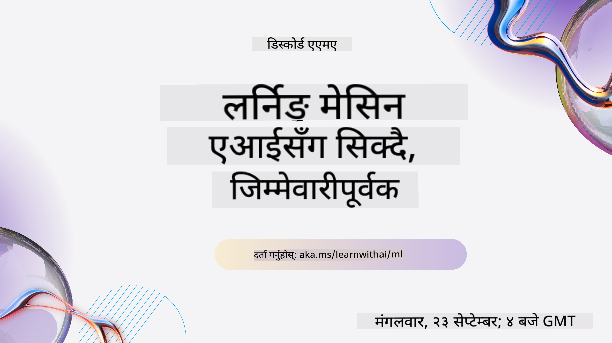
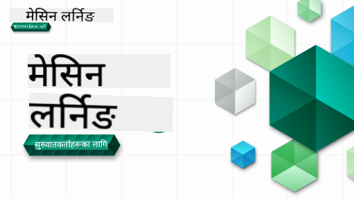

<!--
CO_OP_TRANSLATOR_METADATA:
{
  "original_hash": "a54f98da7bbee99ddc62a9e490eef7dc",
  "translation_date": "2025-09-29T21:52:36+00:00",
  "source_file": "README.md",
  "language_code": "ne"
}
-->

### 🌐 बहुभाषी समर्थन

#### GitHub Action मार्फत समर्थित (स्वचालित र सधैं अद्यावधिक)

[French](../fr/README.md) | [Spanish](../es/README.md) | [German](../de/README.md) | [Russian](../ru/README.md) | [Arabic](../ar/README.md) | [Persian (Farsi)](../fa/README.md) | [Urdu](../ur/README.md) | [Chinese (Simplified)](../zh/README.md) | [Chinese (Traditional, Macau)](../mo/README.md) | [Chinese (Traditional, Hong Kong)](../hk/README.md) | [Chinese (Traditional, Taiwan)](../tw/README.md) | [Japanese](../ja/README.md) | [Korean](../ko/README.md) | [Hindi](../hi/README.md) | [Bengali](../bn/README.md) | [Marathi](../mr/README.md) | [Nepali](./README.md) | [Punjabi (Gurmukhi)](../pa/README.md) | [Portuguese (Portugal)](../pt/README.md) | [Portuguese (Brazil)](../br/README.md) | [Italian](../it/README.md) | [Polish](../pl/README.md) | [Turkish](../tr/README.md) | [Greek](../el/README.md) | [Thai](../th/README.md) | [Swedish](../sv/README.md) | [Danish](../da/README.md) | [Norwegian](../no/README.md) | [Finnish](../fi/README.md) | [Dutch](../nl/README.md) | [Hebrew](../he/README.md) | [Vietnamese](../vi/README.md) | [Indonesian](../id/README.md) | [Malay](../ms/README.md) | [Tagalog (Filipino)](../tl/README.md) | [Swahili](../sw/README.md) | [Hungarian](../hu/README.md) | [Czech](../cs/README.md) | [Slovak](../sk/README.md) | [Romanian](../ro/README.md) | [Bulgarian](../bg/README.md) | [Serbian (Cyrillic)](../sr/README.md) | [Croatian](../hr/README.md) | [Slovenian](../sl/README.md) | [Ukrainian](../uk/README.md) | [Burmese (Myanmar)](../my/README.md)

 #### हाम्रो समुदायमा सामेल हुनुहोस्

हामीसँग AI सिक्ने Discord शृंखला चलिरहेको छ। थप जान्न र हामीसँग [Learn with AI Series](https://aka.ms/learnwithai/discord) मा १८ - ३० सेप्टेम्बर, २०२५ सम्म सामेल हुनुहोस्। तपाईंले डेटा साइन्सका लागि GitHub Copilot प्रयोग गर्ने टिप्स र ट्रिक्स पाउनुहुनेछ।

# सुरुवातकर्ताहरूका लागि मेसिन लर्निङ - एक पाठ्यक्रम

> 🌍 विश्व संस्कृतिहरूको माध्यमबाट मेसिन लर्निङको अन्वेषण गर्दै विश्वभर यात्रा गर्नुहोस् 🌍

Microsoft का Cloud Advocates ले **मेसिन लर्निङ** सम्बन्धी १२ हप्ताको, २६ पाठको पाठ्यक्रम प्रस्तुत गर्न पाउँदा खुसी छन्। यस पाठ्यक्रममा, तपाईंले प्रायः **क्लासिक मेसिन लर्निङ** भनेर चिनिने विषयबारे सिक्नुहुनेछ, मुख्यतया Scikit-learn लाई पुस्तकालयको रूपमा प्रयोग गर्दै र गहिरो सिकाइलाई टाढा राख्दै, जुन हाम्रो [AI for Beginners' पाठ्यक्रम](https://aka.ms/ai4beginners) मा समेटिएको छ। यी पाठहरूलाई हाम्रो ['Data Science for Beginners' पाठ्यक्रम](https://aka.ms/ds4beginners) सँग जोड्नुहोस्।

हामीसँग विश्वभर यात्रा गर्नुहोस् जब हामी यी क्लासिक प्रविधिहरूलाई विश्वका विभिन्न क्षेत्रहरूबाट डेटा लागू गर्छौं। प्रत्येक पाठमा पाठ अघि र पछि क्विजहरू, पाठ पूरा गर्नका लागि लिखित निर्देशनहरू, समाधान, असाइनमेन्ट, र थप समावेश छन्। हाम्रो परियोजना-आधारित शिक्षाशास्त्रले तपाईंलाई निर्माण गर्दै सिक्न अनुमति दिन्छ, नयाँ सीपहरू 'टिक्न' को लागि प्रमाणित तरिका।

**✍️ हाम्रो लेखकहरूलाई हार्दिक धन्यवाद** Jen Looper, Stephen Howell, Francesca Lazzeri, Tomomi Imura, Cassie Breviu, Dmitry Soshnikov, Chris Noring, Anirban Mukherjee, Ornella Altunyan, Ruth Yakubu र Amy Boyd

**🎨 हाम्रो चित्रकारहरूलाई पनि धन्यवाद** Tomomi Imura, Dasani Madipalli, र Jen Looper

**🙏 विशेष धन्यवाद 🙏 हाम्रो Microsoft Student Ambassador लेखकहरू, समीक्षकहरू, र सामग्री योगदानकर्ताहरूलाई**, विशेष गरी Rishit Dagli, Muhammad Sakib Khan Inan, Rohan Raj, Alexandru Petrescu, Abhishek Jaiswal, Nawrin Tabassum, Ioan Samuila, र Snigdha Agarwal

**🤩 अतिरिक्त आभार Microsoft Student Ambassadors Eric Wanjau, Jasleen Sondhi, र Vidushi Gupta लाई हाम्रो R पाठहरूको लागि!**

# सुरु गर्दै

यी चरणहरू पालना गर्नुहोस्:
1. **Repository Fork गर्नुहोस्**: यस पृष्ठको माथि-दायाँ कुनामा रहेको "Fork" बटनमा क्लिक गर्नुहोस्।
2. **Repository Clone गर्नुहोस्**:   `git clone https://github.com/microsoft/ML-For-Beginners.git`

> [यस पाठ्यक्रमका लागि सबै अतिरिक्त स्रोतहरू हाम्रो Microsoft Learn संग्रहमा फेला पार्नुहोस्](https://learn.microsoft.com/en-us/collections/qrqzamz1nn2wx3?WT.mc_id=academic-77952-bethanycheum)

**[विद्यार्थीहरू](https://aka.ms/student-page)**, यो पाठ्यक्रम प्रयोग गर्न, सम्पूर्ण रिपोजिटरीलाई आफ्नो GitHub खातामा फोर्क गर्नुहोस् र अभ्यासहरू आफैं वा समूहसँग पूरा गर्नुहोस्:

- पाठ अघि क्विजबाट सुरु गर्नुहोस्।
- पाठ पढ्नुहोस् र गतिविधिहरू पूरा गर्नुहोस्, प्रत्येक ज्ञान जाँचमा रोक्दै र विचार गर्दै।
- पाठहरू बुझेर परियोजनाहरू सिर्जना गर्न प्रयास गर्नुहोस् समाधान कोड चलाउनुभन्दा; तर त्यो कोड प्रत्येक परियोजना-उन्मुख पाठको `/solution` फोल्डरहरूमा उपलब्ध छ।
- पाठ पछि क्विज लिनुहोस्।
- चुनौती पूरा गर्नुहोस्।
- असाइनमेन्ट पूरा गर्नुहोस्।
- पाठ समूह पूरा गरेपछि, [Discussion Board](https://github.com/microsoft/ML-For-Beginners/discussions) मा जानुहोस् र "सार्वजनिक रूपमा सिक्नुहोस्" उपयुक्त PAT रब्रीक भरेर। 'PAT' भनेको प्रगति मूल्यांकन उपकरण हो जुन तपाईंले आफ्नो सिकाइलाई अगाडि बढाउन रब्रीक भर्नुहुन्छ। तपाईं अन्य PAT हरूमा प्रतिक्रिया दिन सक्नुहुन्छ ताकि हामी सँगै सिक्न सकौं।

> थप अध्ययनको लागि, हामी यी [Microsoft Learn](https://docs.microsoft.com/en-us/users/jenlooper-2911/collections/k7o7tg1gp306q4?WT.mc_id=academic-77952-leestott) मोड्युलहरू र सिकाइ मार्गहरू अनुसरण गर्न सिफारिस गर्छौं।

**शिक्षकहरू**, हामीले यो पाठ्यक्रम कसरी प्रयोग गर्ने भन्ने बारेमा केही सुझावहरू [समावेश गरेका छौं](for-teachers.md)।

---

## भिडियो वाकथ्रूहरू

केही पाठहरू छोटो भिडियोको रूपमा उपलब्ध छन्। तपाईं यी सबै पाठहरूमा इनलाइन फेला पार्न सक्नुहुन्छ, वा [Microsoft Developer YouTube च्यानलमा ML for Beginners प्लेलिस्ट](https://aka.ms/ml-beginners-videos) मा क्लिक गरेर तलको छवि हेर्न सक्नुहुन्छ।

---

## टोलीलाई भेट्नुहोस्

**Gif द्वारा** [Mohit Jaisal](https://linkedin.com/in/mohitjaisal)

> 🎥 माथिको छविमा क्लिक गर्नुहोस् परियोजना र यसलाई सिर्जना गर्ने व्यक्तिहरूको बारेमा भिडियो हेर्न!

---

## शिक्षाशास्त्र

हामीले यो पाठ्यक्रम निर्माण गर्दा दुई शिक्षाशास्त्रीय सिद्धान्तहरू रोजेका छौं: सुनिश्चित गर्नु कि यो **परियोजना-आधारित** हो र यसमा **बारम्बार क्विजहरू** समावेश छन्। साथै, यो पाठ्यक्रममा एक सामान्य **थिम** छ जसले यसलाई एकता दिन्छ।

सामग्री परियोजनाहरूसँग मेल खाने सुनिश्चित गरेर, प्रक्रिया विद्यार्थीहरूका लागि थप आकर्षक बनाइन्छ र अवधारणाहरूको प्रतिधारण बढाइन्छ। साथै, कक्षाको अघि कम-जोखिमको क्विजले विद्यार्थीलाई विषय सिक्नको लागि उद्देश्य सेट गर्छ, जबकि कक्षापछि दोस्रो क्विजले थप प्रतिधारण सुनिश्चित गर्छ। यो पाठ्यक्रम लचिलो र रमाइलो बनाउन डिजाइन गरिएको हो र पूर्ण वा आंशिक रूपमा लिन सकिन्छ। परियोजनाहरू साना सुरु हुन्छन् र १२ हप्ताको चक्रको अन्त्यसम्ममा क्रमशः जटिल बन्छन्। यो पाठ्यक्रममा ML को वास्तविक संसार अनुप्रयोगहरूमा पोस्टस्क्रिप्ट पनि समावेश छ, जुन अतिरिक्त क्रेडिटको रूपमा वा छलफलको आधारको रूपमा प्रयोग गर्न सकिन्छ।

> हाम्रो [Code of Conduct](CODE_OF_CONDUCT.md), [Contributing](CONTRIBUTING.md), र [Translation](TRANSLATIONS.md) दिशानिर्देशहरू फेला पार्नुहोस्। हामी तपाईंको रचनात्मक प्रतिक्रिया स्वागत गर्दछौं!

## प्रत्येक पाठमा समावेश छ

- वैकल्पिक स्केच नोट
- वैकल्पिक पूरक भिडियो
- भिडियो वाकथ्रू (केही पाठहरू मात्र)
- [पाठ अघि वार्मअप क्विज](https://ff-quizzes.netlify.app/en/ml/)
- लिखित पाठ
- परियोजना-आधारित पाठहरूको लागि, परियोजना कसरी निर्माण गर्ने भन्ने चरण-दर-चरण मार्गदर्शन
- ज्ञान जाँचहरू
- एक चुनौती
- पूरक पढाइ
- असाइनमेन्ट
- [पाठ पछि क्विज](https://ff-quizzes.netlify.app/en/ml/)

> **भाषाहरूको बारेमा नोट**: यी पाठहरू मुख्यतया Python मा लेखिएका छन्, तर धेरै R मा पनि उपलब्ध छन्। R पाठ पूरा गर्न, `/solution` फोल्डरमा जानुहोस् र R पाठहरू खोज्नुहोस्। तिनीहरूमा .rmd एक्सटेन्सन समावेश छ जसले **R Markdown** फाइललाई प्रतिनिधित्व गर्छ, जुन `Markdown document` मा `code chunks` (R वा अन्य भाषाहरूको) र `YAML header` (PDF जस्ता आउटपुटहरूलाई ढाँचाबद्ध गर्न मार्गदर्शन गर्ने) को संयोजनको रूपमा परिभाषित गर्न सकिन्छ। यसरी, यो डेटा साइन्सको लागि उदाहरणीय लेखन फ्रेमवर्कको रूपमा सेवा गर्दछ किनकि यसले तपाईंलाई आफ्नो कोड, यसको आउटपुट, र तपाईंको विचारहरूलाई Markdown मा लेख्न अनुमति दिन्छ। साथै, R Markdown कागजातहरू PDF, HTML, वा Word जस्ता आउटपुट ढाँचाहरूमा प्रस्तुत गर्न सकिन्छ।

> **क्विजहरूको बारेमा नोट**: सबै क्विजहरू [Quiz App फोल्डर](../../quiz-app) मा समावेश छन्, कुल ५२ क्विजहरू तीन प्रश्नहरू सहित। तिनीहरू पाठहरू भित्र लिंक गरिएका छन् तर क्विज एपलाई स्थानीय रूपमा चलाउन सकिन्छ; `quiz-app` फोल्डरमा निर्देशनहरू पालना गरेर स्थानीय रूपमा होस्ट गर्नुहोस् वा Azure मा तैनात गर्नुहोस्।

| पाठ संख्या |                             विषय                              |                   पाठ समूह                   | सिक्ने उद्देश्य                                                                                                             |                                                              लिंक गरिएको पाठ                                                               |                        लेखक                        |
| :-----------: | :------------------------------------------------------------: | :-------------------------------------------------: | ------------------------------------------------------------------------------------------------------------------------------- | :--------------------------------------------------------------------------------------------------------------------------------------: | :--------------------------------------------------: |
|      01       |                मेसिन लर्निङको परिचय                |      [परिचय](1-Introduction/README.md)       | मेसिन लर्निङको आधारभूत अवधारणाहरू सिक्नुहोस्                                                                                |                                             [पाठ](1-Introduction/1-intro-to-ML/README.md)                                             |                       Muhammad                       |
|      02       |                मेसिन लर्निङको इतिहास                 |      [परिचय](1-Introduction/README.md)       | यस क्षेत्रको अन्तर्निहित इतिहास सिक्नुहोस्                                                                                         |                                            [पाठ](1-Introduction/2-history-of-ML/README.md)                                            |                     Jen र Amy                      |
|      03       |                 निष्पक्षता र मेसिन लर्निङ                  |      [Introduction](1-Introduction/README.md)       | मेसिन लर्निङ मोडेल निर्माण र प्रयोग गर्दा विद्यार्थीहरूले निष्पक्षताको वरिपरि रहेका महत्वपूर्ण दार्शनिक मुद्दाहरू के विचार गर्नुपर्छ? |                                              [Lesson](1-Introduction/3-fairness/README.md)                                               |                        Tomomi                        |
|      04       |                मेसिन लर्निङका प्रविधिहरू                 |      [Introduction](1-Introduction/README.md)       | मेसिन लर्निङ अनुसन्धानकर्ताहरूले मोडेल निर्माण गर्न कुन प्रविधिहरू प्रयोग गर्छन्?                                                                       |                                          [Lesson](1-Introduction/4-techniques-of-ML/README.md)                                           |                    Chris and Jen                     |
|      05       |                   रिग्रेसनको परिचय                   |        [Regression](2-Regression/README.md)         | रिग्रेसन मोडेलहरूको लागि Python र Scikit-learn प्रयोग गर्न सुरु गर्नुहोस्                                                                  |         [Python](2-Regression/1-Tools/README.md) • [R](../../2-Regression/1-Tools/solution/R/lesson_1.html)         |      Jen • Eric Wanjau       |
|      06       |                उत्तर अमेरिकी कद्दूको मूल्य 🎃                |        [Regression](2-Regression/README.md)         | मेसिन लर्निङको तयारीका लागि डेटा दृश्यात्मकता र सफा गर्नुहोस्                                                                                  |          [Python](2-Regression/2-Data/README.md) • [R](../../2-Regression/2-Data/solution/R/lesson_2.html)          |      Jen • Eric Wanjau       |
|      07       |                उत्तर अमेरिकी कद्दूको मूल्य 🎃                |        [Regression](2-Regression/README.md)         | रेखीय र बहुपद रिग्रेसन मोडेल निर्माण गर्नुहोस्                                                                                   |        [Python](2-Regression/3-Linear/README.md) • [R](../../2-Regression/3-Linear/solution/R/lesson_3.html)        |      Jen and Dmitry • Eric Wanjau       |
|      08       |                उत्तर अमेरिकी कद्दूको मूल्य 🎃                |        [Regression](2-Regression/README.md)         | एक लजिस्टिक रिग्रेसन मोडेल निर्माण गर्नुहोस्                                                                                               |     [Python](2-Regression/4-Logistic/README.md) • [R](../../2-Regression/4-Logistic/solution/R/lesson_4.html)      |      Jen • Eric Wanjau       |
|      09       |                          वेब एप्लिकेशन 🔌                          |           [Web App](3-Web-App/README.md)            | तपाईंको प्रशिक्षित मोडेल प्रयोग गर्न एक वेब एप्लिकेशन निर्माण गर्नुहोस्                                                                                       |                                                 [Python](3-Web-App/1-Web-App/README.md)                                                  |                         Jen                          |
|      10       |                 वर्गीकरणको परिचय                 |    [Classification](4-Classification/README.md)     | तपाईंको डेटा सफा गर्नुहोस्, तयारी गर्नुहोस्, र दृश्यात्मकता गर्नुहोस्; वर्गीकरणको परिचय                                                            | [Python](4-Classification/1-Introduction/README.md) • [R](../../4-Classification/1-Introduction/solution/R/lesson_10.html)  | Jen and Cassie • Eric Wanjau |
|      11       |             स्वादिष्ट एशियाली र भारतीय परिकार 🍜             |    [Classification](4-Classification/README.md)     | वर्गीकरणकर्ताहरूको परिचय                                                                                                     | [Python](4-Classification/2-Classifiers-1/README.md) • [R](../../4-Classification/2-Classifiers-1/solution/R/lesson_11.html) | Jen and Cassie • Eric Wanjau |
|      12       |             स्वादिष्ट एशियाली र भारतीय परिकार 🍜             |    [Classification](4-Classification/README.md)     | थप वर्गीकरणकर्ताहरू                                                                                                                | [Python](4-Classification/3-Classifiers-2/README.md) • [R](../../4-Classification/3-Classifiers-2/solution/R/lesson_12.html) | Jen and Cassie • Eric Wanjau |
|      13       |             स्वादिष्ट एशियाली र भारतीय परिकार 🍜             |    [Classification](4-Classification/README.md)     | तपाईंको मोडेल प्रयोग गरेर एक सिफारिस वेब एप्लिकेशन निर्माण गर्नुहोस्                                                                                    |                                              [Python](4-Classification/4-Applied/README.md)                                              |                         Jen                          |
|      14       |                   क्लस्टरिङको परिचय                   |        [Clustering](5-Clustering/README.md)         | तपाईंको डेटा सफा गर्नुहोस्, तयारी गर्नुहोस्, र दृश्यात्मकता गर्नुहोस्; क्लस्टरिङको परिचय                                                                |         [Python](5-Clustering/1-Visualize/README.md) • [R](../../5-Clustering/1-Visualize/solution/R/lesson_14.html)         |      Jen • Eric Wanjau       |
|      15       |              नाइजेरियाली संगीतको रुचि अन्वेषण 🎧              |        [Clustering](5-Clustering/README.md)         | K-Means क्लस्टरिङ विधि अन्वेषण गर्नुहोस्                                                                                           |           [Python](5-Clustering/2-K-Means/README.md) • [R](../../5-Clustering/2-K-Means/solution/R/lesson_15.html)           |      Jen • Eric Wanjau       |
|      16       |        प्राकृतिक भाषा प्रशोधनको परिचय ☕️         |   [Natural language processing](6-NLP/README.md)    | एक साधारण बोट निर्माण गरेर NLP को आधारभूत कुरा सिक्नुहोस्                                                                             |                                             [Python](6-NLP/1-Introduction-to-NLP/README.md)                                              |                       Stephen                        |
|      17       |                      सामान्य NLP कार्यहरू ☕️                      |   [Natural language processing](6-NLP/README.md)    | भाषागत संरचनाहरूको सामना गर्दा आवश्यक सामान्य कार्यहरू बुझेर तपाईंको NLP ज्ञानलाई गहिरो बनाउनुहोस्                          |                                                    [Python](6-NLP/2-Tasks/README.md)                                                     |                       Stephen                        |
|      18       |             अनुवाद र भावना विश्लेषण ♥️              |   [Natural language processing](6-NLP/README.md)    | Jane Austen को साथ अनुवाद र भावना विश्लेषण                                                                             |                                            [Python](6-NLP/3-Translation-Sentiment/README.md)                                             |                       Stephen                        |
|      19       |                  युरोपका रोमान्टिक होटलहरू ♥️                  |   [Natural language processing](6-NLP/README.md)    | होटल समीक्षाहरूको साथ भावना विश्लेषण 1                                                                                         |                                               [Python](6-NLP/4-Hotel-Reviews-1/README.md)                                                |                       Stephen                        |
|      20       |                  युरोपका रोमान्टिक होटलहरू ♥️                  |   [Natural language processing](6-NLP/README.md)    | होटल समीक्षाहरूको साथ भावना विश्लेषण 2                                                                                         |                                               [Python](6-NLP/5-Hotel-Reviews-2/README.md)                                                |                       Stephen                        |
|      21       |            समय श्रृंखला पूर्वानुमानको परिचय             |        [Time series](7-TimeSeries/README.md)        | समय श्रृंखला पूर्वानुमानको परिचय                                                                                         |                                             [Python](7-TimeSeries/1-Introduction/README.md)                                              |                      Francesca                       |
|      22       | ⚡️ विश्व ऊर्जा प्रयोग ⚡️ - ARIMA को साथ समय श्रृंखला पूर्वानुमान |        [Time series](7-TimeSeries/README.md)        | ARIMA को साथ समय श्रृंखला पूर्वानुमान                                                                                              |                                                 [Python](7-TimeSeries/2-ARIMA/README.md)                                                 |                      Francesca                       |
|      23       |  ⚡️ विश्व ऊर्जा प्रयोग ⚡️ - SVR को साथ समय श्रृंखला पूर्वानुमान  |        [Time series](7-TimeSeries/README.md)        | Support Vector Regressor को साथ समय श्रृंखला पूर्वानुमान                                                                           |                                                  [Python](7-TimeSeries/3-SVR/README.md)                                                  |                       Anirban                        |
|      24       |             सुदृढीकरण शिक्षाको परिचय             | [Reinforcement learning](8-Reinforcement/README.md) | Q-Learning को साथ सुदृढीकरण शिक्षाको परिचय                                                                          |                                             [Python](8-Reinforcement/1-QLearning/README.md)                                              |                        Dmitry                        |
|      25       |                 पिटरलाई भेँडिया बाट बचाउनुहोस्! 🐺                  | [Reinforcement learning](8-Reinforcement/README.md) | सुदृढीकरण शिक्षाको जिम                                                                                                      |                                                [Python](8-Reinforcement/2-Gym/README.md)                                                 |                        Dmitry                        |
|  Postscript   |            वास्तविक संसारका मेसिन लर्निङ परिदृश्य र अनुप्रयोग            |      [ML in the Wild](9-Real-World/README.md)       | शास्त्रीय मेसिन लर्निङका रोचक र खुलासा गर्ने वास्तविक संसारका अनुप्रयोग                                                               |                                             [Lesson](9-Real-World/1-Applications/README.md)                                              |                         Team                         |
|  Postscript   |            RAI ड्यासबोर्ड प्रयोग गरेर मेसिन लर्निङ मोडेल डिबग          |      [ML in the Wild](9-Real-World/README.md)       | जिम्मेवार AI ड्यासबोर्ड कम्पोनेन्टहरू प्रयोग गरेर मेसिन लर्निङ मोडेल डिबग                                                              |                                             [Lesson](9-Real-World/2-Debugging-ML-Models/README.md)                                              |                         Ruth Yakubu                       |

> [यस पाठ्यक्रमका थप स्रोतहरू हाम्रो Microsoft Learn संग्रहमा फेला पार्नुहोस्](https://learn.microsoft.com/en-us/collections/qrqzamz1nn2wx3?WT.mc_id=academic-77952-bethanycheum)

## अफलाइन पहुँच

तपाईं [Docsify](https://docsify.js.org/#/) प्रयोग गरेर यो दस्तावेज अफलाइन चलाउन सक्नुहुन्छ। यो रिपोजिटरीलाई फोर्क गर्नुहोस्, तपाईंको स्थानीय मेसिनमा [Docsify स्थापना गर्नुहोस्](https://docsify.js.org/#/quickstart), र त्यसपछि यो रिपोजिटरीको मूल फोल्डरमा `docsify serve` टाइप गर्नुहोस्। वेबसाइट तपाईंको localhost मा पोर्ट 3000 मा सेवा गरिनेछ: `localhost:3000`।

## PDFs

लिङ्कहरू सहित पाठ्यक्रमको PDF [यहाँ](https://microsoft.github.io/ML-For-Beginners/pdf/readme.pdf) फेला पार्नुहोस्।

## 🎒 अन्य पाठ्यक्रमहरू 

हाम्रो टोलीले अन्य पाठ्यक्रमहरू उत्पादन गर्दछ! हेर्नुहोस्:

- [Edge AI for Beginners](https://aka.ms/edgeai-for-beginners)
- [AI Agents for Beginners](https://aka.ms/ai-agents-beginners)
- [Generative AI for Beginners](https://aka.ms/genai-beginners)
- [Generative AI for Beginners .NET](https://github.com/microsoft/Generative-AI-for-beginners-dotnet)
- [Generative AI with JavaScript](https://github.com/microsoft/generative-ai-with-javascript)
- [Generative AI with Java](https://github.com/microsoft/Generative-AI-for-beginners-java)
- [AI for Beginners](https://aka.ms/ai-beginners)
- [Data Science for Beginners](https://aka.ms/datascience-beginners)
- [ML for Beginners](https://aka.ms/ml-beginners)
- [Cybersecurity for Beginners](https://github.com/microsoft/Security-101) 
- [Web Dev for Beginners](https://aka.ms/webdev-beginners)
- [IoT for Beginners](https://aka.ms/iot-beginners)
- [XR Development for Beginners](https://github.com/microsoft/xr-development-for-beginners)
- [Mastering GitHub Copilot for Paired Programming](https://github.com/microsoft/Mastering-GitHub-Copilot-for-Paired-Programming)
- [Mastering GitHub Copilot for C#/.NET Developers](https://github.com/microsoft/mastering-github-copilot-for-dotnet-csharp-developers)
- [Choose Your Own Copilot Adventure](https://github.com/microsoft/CopilotAdventures)

---

**अस्वीकरण**:  
यो दस्तावेज़ AI अनुवाद सेवा [Co-op Translator](https://github.com/Azure/co-op-translator) प्रयोग गरेर अनुवाद गरिएको हो। हामी यथासम्भव शुद्धता सुनिश्चित गर्न प्रयास गर्छौं, तर कृपया ध्यान दिनुहोस् कि स्वचालित अनुवादमा त्रुटिहरू वा अशुद्धताहरू हुन सक्छ। मूल दस्तावेज़ यसको मातृभाषामा आधिकारिक स्रोत मानिनुपर्छ। महत्वपूर्ण जानकारीको लागि, व्यावसायिक मानव अनुवाद सिफारिस गरिन्छ। यस अनुवादको प्रयोगबाट उत्पन्न हुने कुनै पनि गलतफहमी वा गलत व्याख्याको लागि हामी जिम्मेवार हुनेछैनौं।