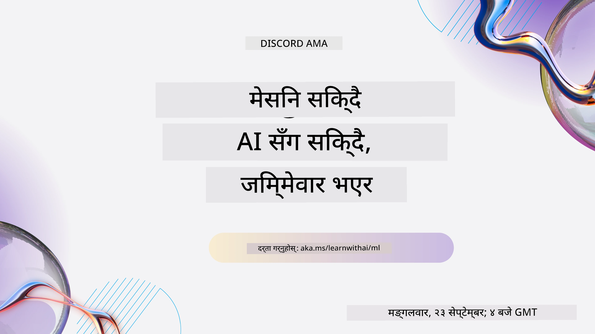
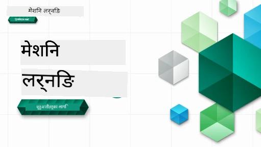

<!--
CO_OP_TRANSLATOR_METADATA:
{
  "original_hash": "ec8385130a8239ad9d827175126a0722",
  "translation_date": "2026-01-01T11:16:08+00:00",
  "source_file": "README.md",
  "language_code": "ne"
}
-->

### 🌐 बहुभाषी समर्थन

#### GitHub Action मार्फत समर्थन गरिएको (स्वचालित र सधैं अद्यावधिक)

<!-- CO-OP TRANSLATOR LANGUAGES TABLE START -->
[अरबी](../ar/README.md) | [बंगाली](../bn/README.md) | [बुल्गेरियाली](../bg/README.md) | [बर्मी (म्यानमार)](../my/README.md) | [चिनियाँ (सरलीकृत)](../zh/README.md) | [चिनियाँ (परम्परागत, हङकङ)](../hk/README.md) | [चिनियाँ (परम्परागत, मकाउ)](../mo/README.md) | [चिनियाँ (परम्परागत, ताइवान)](../tw/README.md) | [क्रोएशियाली](../hr/README.md) | [चेक](../cs/README.md) | [डेनिश](../da/README.md) | [डच](../nl/README.md) | [एस्टोनियन](../et/README.md) | [फिनिश](../fi/README.md) | [फ्रेन्च](../fr/README.md) | [जर्मन](../de/README.md) | [ग्रीक](../el/README.md) | [हिब्रू](../he/README.md) | [हिन्दी](../hi/README.md) | [हंगेरीय](../hu/README.md) | [इन्डोनेशियाली](../id/README.md) | [इटालियन](../it/README.md) | [जापानी](../ja/README.md) | [कन्नड](../kn/README.md) | [कोरियाली](../ko/README.md) | [लिथुआनियाली](../lt/README.md) | [मलय](../ms/README.md) | [मलयालम](../ml/README.md) | [मराठी](../mr/README.md) | [नेपाली](./README.md) | [नाइजेरियन पिजिन](../pcm/README.md) | [नर्वे](../no/README.md) | [फारसी (फारसी)](../fa/README.md) | [पोलिश](../pl/README.md) | [पोर्चुगाली (ब्राजिल)](../br/README.md) | [पोर्चुगाली (पुर्तगाल)](../pt/README.md) | [पञ्जाबी (गुरमुखी)](../pa/README.md) | [रोमानियन](../ro/README.md) | [रूसी](../ru/README.md) | [सर्बियाली (सिरिलिक)](../sr/README.md) | [स्लोभाक](../sk/README.md) | [स्लोभेनियाली](../sl/README.md) | [स्पेनिश](../es/README.md) | [स्वाहिली](../sw/README.md) | [स्वीडिश](../sv/README.md) | [टागालॉग (फिलिपिनो)](../tl/README.md) | [तमिल](../ta/README.md) | [तेलुगु](../te/README.md) | [थाई](../th/README.md) | [टर्किश](../tr/README.md) | [युक्रेनी](../uk/README.md) | [उर्दु](../ur/README.md) | [भियतनामी](../vi/README.md)
<!-- CO-OP TRANSLATOR LANGUAGES TABLE END -->

#### हाम्रो समुदायमा सहभागी हुनुहोस्

हामीसँग Discord मा "AI सँग सिक्ने" सिरिज जारी छ, थप जानकारीका लागि र हामीसँग जोडिनुहोस् [Learn with AI Series](https://aka.ms/learnwithai/discord) मा जुन 18 - 30 सेप्टेम्बर, 2025 सम्म हुनेछ। तपाईंले GitHub Copilot लाई डाटा साइन्सको लागि प्रयोग गर्ने टिप्स र ट्रिक्स पाउनुहुनेछ।

# Machine Learning for Beginners - एक पाठ्यक्रम

> 🌍 विश्व संस्कृतिहरूको माध्यमबाट मेसिन लर्निङ अन्वेषण गर्दै संसारभर यात्रा गर्नुहोस् 🌍

Microsoft का Cloud Advocates हरूले 12 हप्ते, 26-पाठको पाठ्यक्रम प्रस्तुत गर्न पाउँदा खुशी छौं जुन पूर्ण रूपमा **Machine Learning** सम्बन्धित छ। यस पाठ्यक्रममा, तपाईंले कहिलेकाहीं "क्लासिक मेसिन लर्निङ" भनिने विषयबस्तु सिक्नुहुनेछ, जसमा मुख्य रूपमा Scikit-learn लाई लाइब्रेरीको रूपमा प्रयोग गरिन्छ र डिप लर्निङबाट टाढा राखिन्छ, जुन हाम्रो [AI for Beginners' curriculum](https://aka.ms/ai4beginners) मा समेटिएको छ। यी पाठहरूलाई हाम्रो ['Data Science for Beginners' curriculum](https://aka.ms/ds4beginners) सँग भी जोड्न सकिन्छ।

हामीसँगै संसारभर यात्रा गर्नुहोस् जब हामी यी क्लासिक प्रविधिहरूलाई विश्वका विभिन्न क्षेत्रका डाटामा लागू गर्छौं। हरेक पाठमा प्रि-र पोस्ट-लसन क्विज, लेखिएको निर्देशनहरू, समाधान, असाइनमेन्ट, र बढी समावेश छ। हाम्रो प्रोजेक्ट-आधारित शिक्षणले तपाईंलाई बनाउँदै सिक्न मद्दत गर्छ, जुन नयाँ सीपहरू टिकाउन प्रभावकारी तरिका हो।

**✍️ हाम्रो लेखकहरूलाई हार्दिक धन्यवाद** Jen Looper, Stephen Howell, Francesca Lazzeri, Tomomi Imura, Cassie Breviu, Dmitry Soshnikov, Chris Noring, Anirban Mukherjee, Ornella Altunyan, Ruth Yakubu र Amy Boyd

**🎨 हाम्रो इलस्ट्रेटरहरूलाई पनि धन्यवाद** Tomomi Imura, Dasani Madipalli, र Jen Looper

**🙏 विशेष धन्यवाद 🙏 हाम्रा Microsoft Student Ambassador लेख, समीक्षक, र सामग्री योगदानकर्ताहरूलाई**, विशेष गरी Rishit Dagli, Muhammad Sakib Khan Inan, Rohan Raj, Alexandru Petrescu, Abhishek Jaiswal, Nawrin Tabassum, Ioan Samuila, र Snigdha Agarwal

**🤩 अतिरिक्त कृतज्ञता Microsoft Student Ambassadors Eric Wanjau, Jasleen Sondhi, र Vidushi Gupta लाई हाम्रा R पाठहरूको लागि!**

# सुरु गर्नुहोस्

यी चरणहरू पालना गर्नुहोस्:
1. **रिपोजिटरी फोर्क गर्नुहोस्**: यस पृष्ठको माथि-दायाँ कुनामा रहेको "Fork" बटनमा क्लिक गर्नुहोस्।
2. **रिपोजिटरी क्लोन गर्नुहोस्**:   `git clone https://github.com/microsoft/ML-For-Beginners.git`

> [यस पाठ्यक्रमका लागि सबै अतिरिक्त स्रोतहरू हाम्रो Microsoft Learn संग्रहमा पत्ता लगाउनुहोस्](https://learn.microsoft.com/en-us/collections/qrqzamz1nn2wx3?WT.mc_id=academic-77952-bethanycheum)

> 🔧 **मद्दत चाहिन्छ?** स्थापन, सेटअप, र पाठहरू चलाउँदा सामान्य समस्याहरूको समाधानका लागि हाम्रा [Troubleshooting Guide](TROUBLESHOOTING.md) जाँच गर्नुहोस्।

**[विद्यार्थीहरू](https://aka.ms/student-page)**, यो पाठ्यक्रम प्रयोग गर्नका लागि, सम्पूर्ण रिपो आफ्नो GitHub खातामा फोर्क गर्नुहोस् र अभ्यासहरू व्यक्तिगत रूपमा वा समूहसँग पूरा गर्नुहोस्:

- प्रारम्भमा प्रि-लेक्चर क्विज लिइराख्नुहोस्।
- व्याख्या पढ्नुहोस् र गतिविधिहरू पूरा गर्नुहोस्, प्रत्येक ज्ञान जाँचमा रोकिएर सोच्नुहोस्।
- समाधान कोड चलाउने भन्दा सिकाइ बुझेर प्रोजेक्टहरू सिर्जना गर्न प्रयास गर्नुहोस्; तथापि त्यो कोड प्रत्येक प्रोजेक्ट-उन्मुख पाठमा `/solution` फोल्डरहरूमा उपलब्ध छ।
- पोस्ट-लेक्चर क्विज लिनुहोस्।
- चुनौती पूरा गर्नुहोस्।
- असाइनमेन्ट पूरा गर्नुहोस्।
- पाठ समूह पूरा गरेपछि, [Discussion Board](https://github.com/microsoft/ML-For-Beginners/discussions) भ्रमण गरी सान्दर्भिक PAT रूब्रिक भरी "आवाजमा सिक्नुहोस्"। 'PAT' एक Progress Assessment Tool हो जुन तपाईंले सिकाइ अगाडि बढाउन भर्ने रूब्रिक हो। तपाईंले अरू PAT हरूमा प्रतिक्रिया पनि दिन सक्नुहुन्छ ताकि हामी सँगै सिक्न सक्छौं।

> थप अध्ययनका लागि, हामीले यी [Microsoft Learn](https://docs.microsoft.com/en-us/users/jenlooper-2911/collections/k7o7tg1gp306q4?WT.mc_id=academic-77952-leestott) मोड्युलहरू र सिकाइ मार्गहरू अनुसरण गर्न सिफारिस गर्दछौं।

**शिक्षकहरू**, यस पाठ्यक्रम प्रयोग गर्ने बारे हामीले केही [सुझावहरू समावेश गरेका छौं](for-teachers.md)।

---

## भिडियो वाकथ्रुहरू

केही पाठहरू छोटो रूपका भिडियोमा उपलब्ध छन्। यी सबै तपाईंलाई पाठहरू भित्रै देख्न सकिन्छ, वा [ML for Beginners प्लेलिष्टमा Microsoft Developer YouTube च्यानलमा](https://aka.ms/ml-beginners-videos) तलको तस्वीर क्लिक गरेर हेर्न सक्नुहुन्छ।

---

## टिमलाई भेट्नुहोस्

**गिफ द्वारा** [Mohit Jaisal](https://linkedin.com/in/mohitjaisal)

> 🎥 प्रोजेक्ट र यसलाई सिर्जना गर्ने टोलीबारेको भिडियोका लागि माथिको चित्रमा क्लिक गर्नुहोस्!

---

## शिक्षण पद्धति

हामीले यो पाठ्यक्रम निर्माण गर्दा दुई शिक्षण सम्बन्धी सिद्घान्त छानेका छौं: यसलाई व्यावहारिक, **प्रोजेक्ट-आधारित** बनाउने र यसमा **बारम्बार क्विजहरू** समावेश गर्ने। थप रूपमा, यस पाठ्यक्रमलाई एक साझा **थिम** दिई यसको समेकन सुनिश्चित गरिएको छ।

सामग्री प्रोजेक्टसँग मेल खाने गरी सुनिश्चित गर्दा विद्यार्थीहरूको लागि प्रक्रिया बढी आकर्षक हुन्छ र अवधारणाहरूको धारण क्षमता बढ्छ। साथै, कक्षाको अघि एक कम जोखिमको क्विजले विद्यार्थीको सिकाइ तर्फको लक्ष्य निर्धारण गर्छ भने कक्षापछि दोस्रो क्विजले थप धारण सुनिश्चित गर्छ। यो पाठ्यक्रम लचकदार र रमाइलो हुने गरी डिजाइन गरिएको छ र पूरै वा अंशमा लिन सकिन्छ। प्रोजेक्टहरू साना बाट सुरु हुन्छन् र 12 हप्ते चक्रको अन्त्यतिर बढ्दै जटिल बन्छन्। यस पाठ्यक्रमले एमएलका वास्तविक-विश्व प्रयोगहरूमा पोस्टस्क्रिप्ट पनि समावेश गर्दछ, जुन अतिरिक्त क्रेडिट वा छलफलको आधारको रूपमा प्रयोग गर्न सकिन्छ।

> हाम्रो [Code of Conduct](CODE_OF_CONDUCT.md), [Contributing](CONTRIBUTING.md), [Translation](TRANSLATIONS.md), र [Troubleshooting](TROUBLESHOOTING.md) दिशानिर्देशहरू पत्ता लगाउनुहोस्। हामी तपाईंको रचनात्मक प्रतिक्रिया स्वागत गर्दछौं!

## प्रत्येक पाठमा समावेश छ

- वैकल्पिक स्केचनोट
- वैकल्पिक पूरक भिडियो
- भिडियो वाकथ्रु (केही पाठहरूमा मात्र)
- [प्रि-लेक्चर वर्मअप क्विज](https://ff-quizzes.netlify.app/en/ml/)
- लेखिएको पाठ
- प्रोजेक्ट-आधारित पाठहरूको लागि, प्रोजेक्ट कसरी बनाउने भन्ने चरण-दर-चरण मार्गदर्शन
- ज्ञान जाँचहरू
- एउटा चुनौती
- पूरक पढाइ
- असाइनमेन्ट
- [पोस्ट-लेक्चर क्विज](https://ff-quizzes.netlify.app/en/ml/)

> **भाषाहरूको बारेमा एक टिप्पणी**: यी पाठहरू मुख्य रूपमा Python मा लेखिएका छन्, तर धेरै पाठहरू R मा पनि उपलब्ध छन्। R पाठ पूरा गर्नका लागि `/solution` फोल्डरमा गएर R पाठहरू खोज्नुहोस्। तीमा `.rmd` एक्सटेन्सन हुन्छ जुन **R Markdown** फाइल प्रतिनिधित्व गर्छ जुन सरलताले `code chunks` (R वा अन्य भाषाका) र `YAML header` (जसले PDF जस्ता आउटपुट कसरी ढाँचाबद्ध गर्ने भनेर मार्गनिर्देशन गर्छ) लाई `Markdown document` मा एम्बेड गरेको रूपमा परिभाषित गर्न सकिन्छ। यसरी, यो डाटा साइन्सका लागि एक उत्कृष्ट लेखकिङ फ्रेमवर्कको रूपमा काम गर्छ किनकि यसले तपाईंलाई तपाईंको कोड, त्यसको आउटपुट, र तपाईंका विचारहरू Markdown मा लेख्न मिल्ने गरी संयोजन गर्न अनुमति दिन्छ। थप रूपमा, R Markdown दस्तावेजहरू PDF, HTML, वा Word जस्ता आउटपुट ढाँचाहरूमा रन्डर गर्न सकिन्छ।

> **क्विजहरूबारे एक टिप्पणी**: सबै क्विजहरू [Quiz App फोल्डर](../../quiz-app) भित्र समावेश छन्, कुल 52 क्विजहरू जुन प्रत्येकमा तीन प्रश्नहरू छन्। तिनीहरू पाठहरूबाट लिङ्क गरिएका छन् तर क्विज एप स्थानीय रूपमा चलाउन सकिन्छ; स्थानीय रूपमा होस्ट वा Azure मा डिप्लोय गर्नका लागि `quiz-app` फोल्डरमा दिइएका निर्देशनहरू पालन गर्नुहोस्।

| पाठ संख्या |                             विषय                              |                   पाठ समूह                   | अध्ययन लक्ष्यहरू                                                                                                             |                                                              लिङ्क गरिएको पाठ                                                               |                        लेखक                        |
| :-----------: | :------------------------------------------------------------: | :-------------------------------------------------: | ------------------------------------------------------------------------------------------------------------------------------- | :--------------------------------------------------------------------------------------------------------------------------------------: | :--------------------------------------------------: |
|      01       |                मेसिन लर्निङ परिचय                |      [परिचय](1-Introduction/README.md)       | मेसिन लर्निङको आधारभूत अवधारणाहरू सिक्नुहोस्                                                                                |                                             [पाठ](1-Introduction/1-intro-to-ML/README.md)                                             |                       Muhammad                       |
|      02       |                मेसिन लर्निङको इतिहास                 |      [परिचय](1-Introduction/README.md)       | यस क्षेत्रको इतिहास बारे जान्नुहोस्                                                                                         |                                            [पाठ](1-Introduction/2-history-of-ML/README.md)                                            |                     Jen and Amy                      |
|      03       |                 निष्पक्षता र मेसिन लर्निङ                  |      [परिचय](1-Introduction/README.md)       | मोडेल बनाउँदा र लागू गर्दा विद्यार्थीहरूले विचार गर्नुपर्ने निष्पक्षता सम्बन्धी के महत्वपूर्ण दार्शनिक मुद्दाहरू छन्? |                                              [पाठ](1-Introduction/3-fairness/README.md)                                               |                        Tomomi                        |
|      04       |                मेसिन लर्निङका प्रविधिहरू                 |      [परिचय](1-Introduction/README.md)       | एमएल अनुसन्धानकर्ताहरूले ML मोडेल बनाउन कुन प्रविधिहरू प्रयोग गर्छन्?                                                                       |                                          [पाठ](1-Introduction/4-techniques-of-ML/README.md)                                           |                    Chris and Jen                     |
|      05       |                   रिग्रेसन परिचय                   |        [रिग्रेसन](2-Regression/README.md)         | रिग्रेसन मोडेलहरूका लागि Python र Scikit-learn सँग सुरूवात गर्नुहोस्                                                                  |         [Python](2-Regression/1-Tools/README.md) • [R](../../2-Regression/1-Tools/solution/R/lesson_1.html)         |      Jen • Eric Wanjau       |
|      06       |                उत्तर अमेरिकी कद्दू मूल्यहरू 🎃                |        [रिग्रेसन](2-Regression/README.md)         | ML को तयारीका लागि डेटा भिजुअलाइज र सफा गर्नुहोस्                                                                                  |          [Python](2-Regression/2-Data/README.md) • [R](../../2-Regression/2-Data/solution/R/lesson_2.html)          |      Jen • Eric Wanjau       |
|      07       |                उत्तर अमेरिकी कद्दू मूल्यहरू 🎃                |        [रिग्रेसन](2-Regression/README.md)         | रेखीय र बहुपद रिग्रेसन मोडेलहरू निर्माण गर्नुहोस्                                                                                   |        [Python](2-Regression/3-Linear/README.md) • [R](../../2-Regression/3-Linear/solution/R/lesson_3.html)        |      Jen and Dmitry • Eric Wanjau       |
|      08       |                उत्तर अमेरिकी कद्दू मूल्यहरू 🎃                |        [रिग्रेसन](2-Regression/README.md)         | लजिस्टिक रिग्रेसन मोडेल निर्माण गर्नुहोस्                                                                                               |     [Python](2-Regression/4-Logistic/README.md) • [R](../../2-Regression/4-Logistic/solution/R/lesson_4.html)      |      Jen • Eric Wanjau       |
|      09       |                          एक वेब एप 🔌                          |           [वेब एप](3-Web-App/README.md)            | तपाईंले तालिम दिएको मोडेल प्रयोग गर्न वेब एप बनाउनुहोस्                                                                                       |                                                 [Python](3-Web-App/1-Web-App/README.md)                                                  |                         Jen                          |
|      10       |                 वर्गीकरण परिचय                 |    [वर्गीकरण](4-Classification/README.md)     | आफ्नो डेटा सफा, तयारी, र भिजुअलाइज गर्नुहोस्; वर्गीकरणमा परिचय                                                            | [Python](4-Classification/1-Introduction/README.md) • [R](../../4-Classification/1-Introduction/solution/R/lesson_10.html)  | Jen and Cassie • Eric Wanjau |
|      11       |             स्वादिलो एसियाली र भारतीय परिकारहरू 🍜             |    [वर्गीकरण](4-Classification/README.md)     | क्लासिफायरहरूको परिचय                                                                                                     | [Python](4-Classification/2-Classifiers-1/README.md) • [R](../../4-Classification/2-Classifiers-1/solution/R/lesson_11.html) | Jen and Cassie • Eric Wanjau |
|      12       |             स्वादिलो एसियाली र भारतीय परिकारहरू 🍜             |    [वर्गीकरण](4-Classification/README.md)     | थप क्लासिफायरहरू                                                                                                                | [Python](4-Classification/3-Classifiers-2/README.md) • [R](../../4-Classification/3-Classifiers-2/solution/R/lesson_12.html) | Jen and Cassie • Eric Wanjau |
|      13       |             स्वादिलो एसियाली र भारतीय परिकारहरू 🍜             |    [वर्गीकरण](4-Classification/README.md)     | आफ्नो मोडेल प्रयोग गरेर सिफारिस गर्ने वेब एप बनाउनुहोस्                                                                                    |                                              [Python](4-Classification/4-Applied/README.md)                                              |                         Jen                          |
|      14       |                   क्लस्टरिङ परिचय                   |        [क्लस्टरिङ](5-Clustering/README.md)         | आफ्नो डेटा सफा, तयारी, र भिजुअलाइज गर्नुहोस्; क्लस्टरिङमा परिचय                                                                |         [Python](5-Clustering/1-Visualize/README.md) • [R](../../5-Clustering/1-Visualize/solution/R/lesson_14.html)         |      Jen • Eric Wanjau       |
|      15       |              नाइजीरियाली संगीतका रुचिहरू अन्वेषण 🎧              |        [क्लस्टरिङ](5-Clustering/README.md)         | K-Means क्लस्टरिङ विधि अन्वेषण गर्नुहोस्                                                                                           |           [Python](5-Clustering/2-K-Means/README.md) • [R](../../5-Clustering/2-K-Means/solution/R/lesson_15.html)           |      Jen • Eric Wanjau       |
|      16       |        प्राकृतिक भाषा प्रशोधनमा परिचय ☕️         |   [प्राकृतिक भाषा प्रशोधन](6-NLP/README.md)    | एक सानो बोट बनाउँदै NLP का आधारहरू सिक्नुहोस्                                                                             |                                             [Python](6-NLP/1-Introduction-to-NLP/README.md)                                              |                       Stephen                        |
|      17       |                      सामान्य NLP कार्यहरू ☕️                      |   [प्राकृतिक भाषा प्रशोधन](6-NLP/README.md)    | भाषिक संरचनासँग व्यवहार गर्दा आवश्यक सामान्य कार्यहरू बुझेर आफ्नो NLP ज्ञानलाई गहिरो बनाउनुहोस्                          |                                                    [Python](6-NLP/2-Tasks/README.md)                                                     |                       Stephen                        |
|      18       |             अनुवाद र भावना विश्लेषण ♥️              |   [प्राकृतिक भाषा प्रशोधन](6-NLP/README.md)    | जेने ऑस्टेनसँग अनुवाद र भावना विश्लेषण                                                                             |                                            [Python](6-NLP/3-Translation-Sentiment/README.md)                                             |                       Stephen                        |
|      19       |                  युरोपका रोमान्टिक होटलहरू ♥️                  |   [प्राकृतिक भाषा प्रशोधन](6-NLP/README.md)    | होटल समीक्षाहरू प्रयोग गरी भावना विश्लेषण 1                                                                                         |                                               [Python](6-NLP/4-Hotel-Reviews-1/README.md)                                                |                       Stephen                        |
|      20       |                  युरोपका रोमान्टिक होटलहरू ♥️                  |   [प्राकृतिक भाषा प्रशोधन](6-NLP/README.md)    | होटल समीक्षाहरू प्रयोग गरी भावना विश्लेषण 2                                                                                         |                                               [Python](6-NLP/5-Hotel-Reviews-2/README.md)                                                |                       Stephen                        |
|      21       |            टाइम सिरिज पूर्वानुमानमा परिचय             |        [टाइम सिरिज](7-TimeSeries/README.md)        | टाइम सिरिज पूर्वानुमानमा परिचय                                                                                         |                                             [Python](7-TimeSeries/1-Introduction/README.md)                                              |                      Francesca                       |
|      22       | ⚡️ विश्व बिजुली प्रयोग ⚡️ - ARIMA सँग टाइम सिरिज पूर्वानुमान |        [टाइम सिरिज](7-TimeSeries/README.md)        | ARIMA सँग टाइम सिरिज पूर्वानुमान                                                                                              |                                                 [Python](7-TimeSeries/2-ARIMA/README.md)                                                 |                      Francesca                       |
|      23       |  ⚡️ विश्व बिजुली प्रयोग ⚡️ - SVR सँग टाइम सिरिज पूर्वानुमान  |        [टाइम सिरिज](7-TimeSeries/README.md)        | Support Vector Regressor सँग टाइम सिरिज पूर्वानुमान                                                                           |                                                  [Python](7-TimeSeries/3-SVR/README.md)                                                  |                       Anirban                        |
|      24       |             रिइन्फोर्समेन्ट लर्निङमा परिचय             | [रिइन्फोर्समेन्ट लर्निङ](8-Reinforcement/README.md) | Q-Learning सँग रिइन्फोर्समेन्ट लर्निङमा परिचय                                                                          |                                             [Python](8-Reinforcement/1-QLearning/README.md)                                              |                        Dmitry                        |
|      25       |                 पिटरलाई ब्वाँसोबाट बचाउन मद्दत गर्नुहोस्! 🐺                  | [रिइन्फोर्समेन्ट लर्निङ](8-Reinforcement/README.md) | रिइन्फोर्समेन्ट लर्निङ जिम                                                                                                      |                                                [Python](8-Reinforcement/2-Gym/README.md)                                                 |                        Dmitry                        |
|  Postscript   |            वास्तविक संसारका ML परिदृश्य र अनुप्रयोगहरू            |      [वास्तविक संसारमा ML](9-Real-World/README.md)       | क्लासिकल ML का रोचक र प्रदर्शन गर्ने वास्तविक संसारका अनुप्रयोगहरू                                                               |                                             [पाठ](9-Real-World/1-Applications/README.md)                                              |                         Team                         |
|  Postscript   |            RAI ड्यासबोर्ड प्रयोग गरी ML मा मोडेल डिबगिङ          |      [वास्तविक संसारमा ML](9-Real-World/README.md)       | Responsible AI ड्यासबोर्ड कम्पोनेन्टहरू प्रयोग गरी मेशिन लर्निङमा मोडेल डिबगिङ                                                              |                                             [पाठ](9-Real-World/2-Debugging-ML-Models/README.md)                                              |                         Ruth Yakubu                       |

> [यस कोर्सका थप सबै स्रोतहरू हाम्रो Microsoft Learn सङ्ग्रहमा फेला पार्नुहोस्](https://learn.microsoft.com/en-us/collections/qrqzamz1nn2wx3?WT.mc_id=academic-77952-bethanycheum)

## अफलाइन पहुँच

You can run this documentation offline by using [Docsify](https://docsify.js.org/#/). Fork this repo, [install Docsify](https://docsify.js.org/#/quickstart) on your local machine, and then in the root folder of this repo, type `docsify serve`. The website will be served on port 3000 on your localhost: `localhost:3000`.

## PDFहरू

लिङ्कहरूसहितको पाठ्यक्रमको PDF [यहाँ](https://microsoft.github.io/ML-For-Beginners/pdf/readme.pdf) फेला पार्नुहोस्।

## 🎒 अन्य पाठ्यक्रमहरू 

हाम्रो टोलीले अन्य पाठ्यक्रमहरू उत्पादन गर्छ! हेर्नुहोस्:

<!-- CO-OP TRANSLATOR OTHER COURSES START -->
### LangChain

---

### Azure / Edge / MCP / Agents

---
 
### जनरेटिभ AI श्रृंखला

[-9333EA?style=for-the-badge&labelColor=E5E7EB&color=9333EA)](https://github.com/microsoft/Generative-AI-for-beginners-dotnet?WT.mc_id=academic-105485-koreyst)
[-C084FC?style=for-the-badge&labelColor=E5E7EB&color=C084FC)](https://github.com/microsoft/generative-ai-for-beginners-java?WT.mc_id=academic-105485-koreyst)
[-E879F9?style=for-the-badge&labelColor=E5E7EB&color=E879F9)](https://github.com/microsoft/generative-ai-with-javascript?WT.mc_id=academic-105485-koreyst)

---
 
### मुख्य सिकाइ

---
 
### Copilot श्रृंखला

<!-- CO-OP TRANSLATOR OTHER COURSES END -->

## मद्दत पाउनुहोस्

यदि तपाईं अड्किनुहुन्छ वा AI एपहरू निर्माण गर्दा कुनै प्रश्नहरू छन् भने। MCP सम्बन्धी छलफलहरूमा सहपाठी सिक्नेहरू र अनुभवी विकासकर्ताहरूमा सामेल हुनुहोस्। यो एक सहयोगी समुदाय हो जहाँ प्रश्नहरू स्वागतयोग्य छन् र ज्ञान स्वतन्त्र रूपमा साझा गरिन्छ।

यदि तपाईंको उत्पादन सम्बन्धी प्रतिक्रिया वा निर्माणको क्रममा त्रुटिहरू छन् भने भ्रमण गर्नुहोस्:

---

<!-- CO-OP TRANSLATOR DISCLAIMER START -->
अस्वीकरण:
यो दस्तावेज AI अनुवाद सेवा [Co-op Translator](https://github.com/Azure/co-op-translator) प्रयोग गरेर अनुवाद गरिएको हो। हामी सटीकताको लागि प्रयासरत छौं, तर कृपया ध्यान दिनुहोस् कि स्वचालित अनुवादमा त्रुटि वा अशुद्धता हुनसक्छ। मूल दस्तावेजलाई यसको मातृभाषामा नै अधिकारिक स्रोत मान्नुपर्छ। महत्वपूर्ण जानकारीको लागि, व्यावसायिक मानव अनुवाद सिफारिस गरिन्छ। यस अनुवादको प्रयोगबाट उत्पन्न हुने कुनै पनि गलतफहमी वा गलत व्याख्याका लागि हामी जिम्मेवार छैनौं।
<!-- CO-OP TRANSLATOR DISCLAIMER END -->