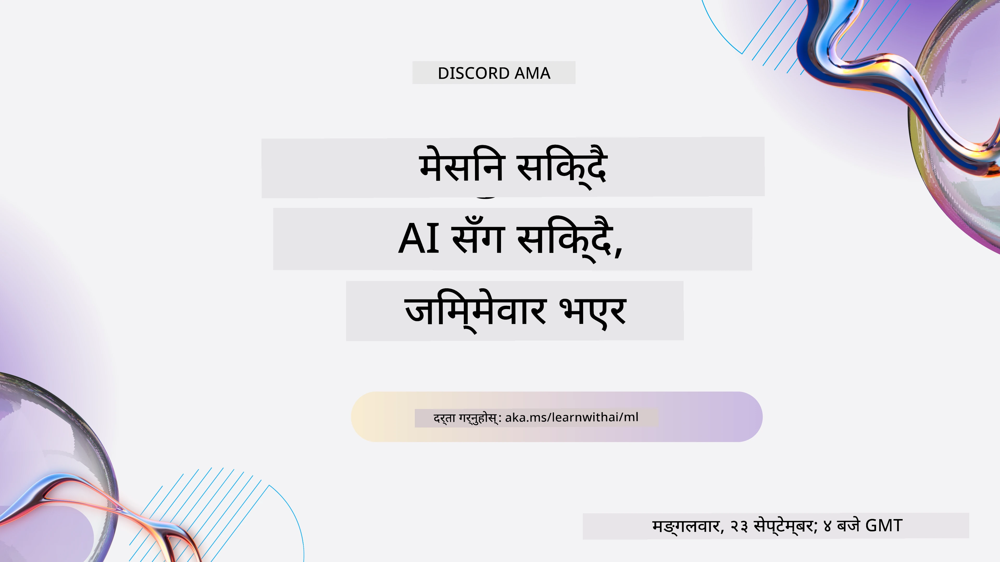
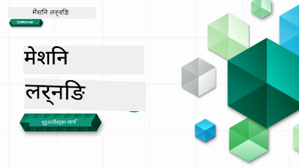

[](https://github.com/microsoft/ML-For-Beginners/blob/master/LICENSE)
[](https://GitHub.com/microsoft/ML-For-Beginners/graphs/contributors/)
[](https://GitHub.com/microsoft/ML-For-Beginners/issues/)
[](https://GitHub.com/microsoft/ML-For-Beginners/pulls/)
[](http://makeapullrequest.com)

[](https://GitHub.com/microsoft/ML-For-Beginners/watchers/)
[](https://GitHub.com/microsoft/ML-For-Beginners/network/)
[](https://GitHub.com/microsoft/ML-For-Beginners/stargazers/)

### 🌐 बहुभाषिक समर्थन

#### GitHub Action मार्फत समर्थन गरिएको (स्वचालित र सधैं अद्यावधिक)

<!-- CO-OP TRANSLATOR LANGUAGES TABLE START -->
[Arabic](../ar/README.md) | [Bengali](../bn/README.md) | [Bulgarian](../bg/README.md) | [Burmese (Myanmar)](../my/README.md) | [Chinese (Simplified)](../zh-CN/README.md) | [Chinese (Traditional, Hong Kong)](../zh-HK/README.md) | [Chinese (Traditional, Macau)](../zh-MO/README.md) | [Chinese (Traditional, Taiwan)](../zh-TW/README.md) | [Croatian](../hr/README.md) | [Czech](../cs/README.md) | [Danish](../da/README.md) | [Dutch](../nl/README.md) | [Estonian](../et/README.md) | [Finnish](../fi/README.md) | [French](../fr/README.md) | [German](../de/README.md) | [Greek](../el/README.md) | [Hebrew](../he/README.md) | [Hindi](../hi/README.md) | [Hungarian](../hu/README.md) | [Indonesian](../id/README.md) | [Italian](../it/README.md) | [Japanese](../ja/README.md) | [Kannada](../kn/README.md) | [Khmer](../km/README.md) | [Korean](../ko/README.md) | [Lithuanian](../lt/README.md) | [Malay](../ms/README.md) | [Malayalam](../ml/README.md) | [Marathi](../mr/README.md) | [Nepali](./README.md) | [Nigerian Pidgin](../pcm/README.md) | [Norwegian](../no/README.md) | [Persian (Farsi)](../fa/README.md) | [Polish](../pl/README.md) | [Portuguese (Brazil)](../pt-BR/README.md) | [Portuguese (Portugal)](../pt-PT/README.md) | [Punjabi (Gurmukhi)](../pa/README.md) | [Romanian](../ro/README.md) | [Russian](../ru/README.md) | [Serbian (Cyrillic)](../sr/README.md) | [Slovak](../sk/README.md) | [Slovenian](../sl/README.md) | [Spanish](../es/README.md) | [Swahili](../sw/README.md) | [Swedish](../sv/README.md) | [Tagalog (Filipino)](../tl/README.md) | [Tamil](../ta/README.md) | [Telugu](../te/README.md) | [Thai](../th/README.md) | [Turkish](../tr/README.md) | [Ukrainian](../uk/README.md) | [Urdu](../ur/README.md) | [Vietnamese](../vi/README.md)

> **स्थानीय रूपले क्लोन गर्न चाहनुहुन्छ?**
>
> यो रिपोजिटोरीमा ५०+ भाषा अनुवादहरू समावेश छन् जसले डाउनलोड साइजलाई महत्त्वपूर्ण रूपमा बढाउँछ। अनुवादहरू बिना क्लोन गर्न, sparse checkout प्रयोग गर्नुहोस्:
>
> **Bash / macOS / Linux:**
> ```bash
> git clone --filter=blob:none --sparse https://github.com/microsoft/ML-For-Beginners.git
> cd ML-For-Beginners
> git sparse-checkout set --no-cone '/*' '!translations' '!translated_images'
> ```
>
> **CMD (Windows):**
> ```cmd
> git clone --filter=blob:none --sparse https://github.com/microsoft/ML-For-Beginners.git
> cd ML-For-Beginners
> git sparse-checkout set --no-cone "/*" "!translations" "!translated_images"
> ```
>
> यसले तपाईंलाई कोर्स पूरा गर्न आवश्यक सबै कुरा धेरै छिटो डाउनलोडको साथ उपलब्ध गराउँछ।
<!-- CO-OP TRANSLATOR LANGUAGES TABLE END -->

#### हाम्रो समुदायमा सामेल हुनुहोस्

[](https://discord.gg/nTYy5BXMWG)

हामीसँग डिस्कोर्डमा एआईसँग सिक्ने श्रृंखला चलिरहेको छ, थप जान्न र सामेल हुन [Learn with AI Series](https://aka.ms/learnwithai/discord) मा १८ - ३० सेप्टेम्बर, २०२५ सम्म। तपाईंलाई डेटा विज्ञानका लागि GitHub Copilot प्रयोग गर्ने सुझाव र तरिका प्राप्त हुनेछ।



# शुरुवातकर्ताहरूका लागि मेसिन लर्निङ - एक पाठ्यक्रम

> 🌍 हामी विश्वका संस्कृतिहरूको माध्यमले मेसिन लर्निङ अन्वेषण गर्दै विश्व यात्रा गरिरहेका छौं 🌍

माइक्रोसफ्टका क्लाउड अधिवक्ताहरूले १२ हप्ता, २६ पाठको पाठ्यक्रम प्रस्तुत गर्न पाउँदा खुशी छन् जुन पूर्ण रूपमा **मेसिन लर्निङ** सम्बन्धी छ। यस पाठ्यक्रममा, तपाईंले कहिलेकाहीं भनिने **परम्परागत मेसिन लर्निङ** सिक्नु हुनेछ, प्राथमिक रूपमा Scikit-learn लाई पुस्तकालयको रूपमा प्रयोग गर्दै र गहिरो अध्ययनबाट बच्दै, जुन हाम्रो [शुरुवातकर्ताहरूका लागि एआई पाठ्यक्रम](https://aka.ms/ai4beginners) मा समेटिएको छ। यी पाठहरूलाई हाम्रो ['डाटा विज्ञानका लागि शुरुवातकर्ताहरू' पाठ्यक्रम](https://aka.ms/ds4beginners) सँग सँगै पाल्नुहोस्।

संसारभरका विभिन्न क्षेत्रहरूको डाटामा यी परम्परागत प्रविधिहरूलाई लागू गर्दै हामीसँग यात्रा गर्नुहोस्। प्रत्येक पाठमा पूर्व- र पश्चात-परीक्षणहरू, लेखिएको निर्देशनहरू, समाधानहरू, कार्यहरू, र थप कुरा समावेश छ। हाम्रो परियोजना-आधारित शिक्षणशैलीले तपाईंलाई निर्माण गर्दागर्दै सिक्न अनुमति दिन्छ, जुन नयाँ सीपहरूलाई 'टिकाउँदा' प्रमाणित विधि हो।

**✍️ हाम्रा लेखकहरूलाई हार्दिक धन्यवाद** Jen Looper, Stephen Howell, Francesca Lazzeri, Tomomi Imura, Cassie Breviu, Dmitry Soshnikov, Chris Noring, Anirban Mukherjee, Ornella Altunyan, Ruth Yakubu र Amy Boyd

**🎨 हाम्रा चित्रकारहरूलाई पनि धन्यवाद** Tomomi Imura, Dasani Madipalli, र Jen Looper

**🙏 विशेष धन्यवाद 🙏 हाम्रा माइक्रोसफ्ट विद्यार्थी राजदूत लेखकहरू, समीक्षकहरू, र सामग्री योगदानकर्ताहरूलाई**, विशेष गरी Rishit Dagli, Muhammad Sakib Khan Inan, Rohan Raj, Alexandru Petrescu, Abhishek Jaiswal, Nawrin Tabassum, Ioan Samuila, र Snigdha Agarwal

**🤩 हाम्रो R पाठहरूका लागि Microsoft विद्यार्थी राजदूत Eric Wanjau, Jasleen Sondhi, र Vidushi Gupta लाई अतिरिक्त कृतज्ञता!**

# सुरु गर्दै

यी चरणहरू पछ्याउनुहोस्:
1. **रिपोजिटोरी फोर्क गर्नुहोस्**: यस पृष्ठको माथिल्लो-दायाँ कुनामा रहेको "Fork" बटनमा क्लिक गर्नुहोस्।
2. **रिपोजिटोरी क्लोन गर्नुहोस्**:   `git clone https://github.com/microsoft/ML-For-Beginners.git`

> 💡 **छिटो सुरु सुझाव:** स्थानीय रूपमा Python सेटअप नगरी ब्राउजरमा सुरु गर्न चाहनुहुन्छ? [GitHub Codespaces](https://github.com/features/codespaces) प्रयोग गरेर आफ्नो फोर्कको लागि क्लाउड विकास वातावरण सिर्जना गर्नुहोस्। हरियो **Code** मेनु खोल्नुहोस्, **Codespaces** छान्नुहोस्, र एउटा codespace सिर्जना गर्नुहोस्; आवश्यक परे प्रत्येक पाठको आवश्यक निर्भरताहरू भित्र स्थापित गर्नुहोस्।

> [यस कोर्सका सबै अतिरिक्त स्रोतहरू हाम्रो Microsoft Learn संग्रहमा भेट्नुहोस्](https://learn.microsoft.com/en-us/collections/qrqzamz1nn2wx3?WT.mc_id=academic-77952-bethanycheum)

> 🔧 **मद्दत चाहिन्छ?** स्थापना, सेटअप र पाठहरू चलाउन सम्बन्धित सामान्य समस्याहरूका समाधानका लागि हाम्रो [समाधान निर्देशन](TROUBLESHOOTING.md) हेर्नुहोस्।


**[विद्यार्थीहरू](https://aka.ms/student-page)**, यस पाठ्यक्रमलाई प्रयोग गर्न, पुरै रिपो आफ्नो GitHub खातामा फोर्क गरी अभ्यासहरू आफैँ वा समूहमा पूरा गर्नुहोस्:

- पूर्व-पाठ क्विजबाट सुरु गर्नुहोस्।
- व्याख्यान पढ्नुहोस् र गतिविधिहरू पूरा गर्नुहोस्, हरेक ज्ञान परीक्षणमा रोकिएर सोच्नुहोस्।
- समाधान कोड चलाउनुभन्दा पाठहरू बुझेर परियोजनाहरू सिर्जना गर्ने प्रयास गर्नुहोस्; यो कोड प्रत्येक परियोजना-आधारित पाठको `/solution` फोल्डरमा उपलब्ध छ।
- पश्चात-पाठ क्विज लिनुहोस्।
- चुनौती पूरा गर्नुहोस्।
- कार्य पूरा गर्नुहोस्।
- पाठ समूह पूरा गरेपछि, [डिस्कसन बोर्ड](https://github.com/microsoft/ML-For-Beginners/discussions) भ्रमण गरी उपयुक्त PAT रुब्रिक भर्नुहोस् र 'आवाजमा सिक्नुहोस्'। 'PAT' भनेको प्रगति मूल्यांकन उपकरण हो जसले तपाईंको सिकाइलाई बढावा दिनको लागि भर्ने रुब्रिक हो। तपाईंले अरू PAT हरूमा पनि प्रतिक्रिया दिन सक्नुहुन्छ ताकि हामी सँगै सिक्न सकौँ।

> थप अध्ययनको लागि, यी [Microsoft Learn](https://docs.microsoft.com/en-us/users/jenlooper-2911/collections/k7o7tg1gp306q4?WT.mc_id=academic-77952-leestott) मोड्युल र सिकाइ मार्गहरू अनुसरण गर्न सिफारिस गर्दछौं।

**शिक्षकहरू**, हामीले यस पाठ्यक्रमलाई कसरी प्रयोग गर्ने बारे [केही सुझावहरू](for-teachers.md) समावेश गरेका छौं।

---

## भिडियो मार्गदर्शनहरू

केही पाठहरू छोटो भिडियोको रूपमा उपलब्ध छन्। तपाईं यी पाठहरूभित्रै सबैलाई भेट्टाउन सक्नुहुन्छ, वा [Microsoft Developer YouTube च्यानलको ML for Beginners प्लेइलिस्ट](https://aka.ms/ml-beginners-videos) मा तल रहेको छविमा क्लिक गरेर हेर्न सक्नुहुन्छ।

[](https://aka.ms/ml-beginners-videos)

---

## टोलीसँग भेटघाट

[](https://youtu.be/Tj1XWrDSYJU)

**Gif द्वारा** [Mohit Jaisal](https://linkedin.com/in/mohitjaisal)

> 🎥 परियोजना र यसलाई सिर्जना गर्ने व्यक्तिहरूको बारेमा भिडियो हेर्न माथि रहेको छविमा क्लिक गर्नुहोस्!

---

## शिक्षणशैली

हामीले यस पाठ्यक्रम निर्माण गर्दा दुइटा शिक्षण सिद्धान्त चुनेका छौं: यो प्रायोगात्मक **परियोजना-आधारित** हुनुपर्ने र यसमा **बारम्बार क्विजहरू** हुनुपर्ने। थप रूपमा, यस पाठ्यक्रममा एक सामान्य **थिम** हुन्छ जसले यसलाई एकताको भावना दिन्छ।

सामग्री परियोजनासँग मेल खाने सुनिश्चित गरेर, प्रक्रिया विद्यार्थीहरूका लागि बढी जादुई हुन्छ र अवधारणाहरूको स्मृति बढ्छ। कक्षाको अघि कम जोखिमयुक्त क्विजले विद्यार्थीलाई विषय सिक्न प्रयासको उद्देश्य सेट गर्छ भने, कक्षापछि दोस्रो क्विजले थप सम्झना सुनिश्चित गर्छ। यो पाठ्यक्रम लचकदार र रमाइलो हुने गरी डिजाइन गरिएको छ र पूरै वा आंशिक रूपमा लिन सकिन्छ। परियोजनाहरू साना हुँदै क्रमशः बढ्दो जटिल हुन्छन् १२ हप्ते चक्रको अन्त्यमा। यस पाठ्यक्रममा मेसिन लर्निङका वास्तविक विश्व प्रयोगहरूमा एउटा पोस्टस्क्रिप्ट पनि समावेश छ, जुन अतिरिक्त क्रेडिट वा छलफलको आधारको रूपमा प्रयोग गर्न सकिन्छ।

> हाम्रो [आचार संहिता](CODE_OF_CONDUCT.md), [योगदान गर्ने तरिका](CONTRIBUTING.md), [अनुवादहरू](..), र [समस्या समाधान](TROUBLESHOOTING.md) मार्गनिर्देशनहरू पनि हेर्नुहोस्। हामी तपाईंको रचनात्मक प्रतिक्रिया स्वागत गर्छौं!

## प्रत्येक पाठ समावेश गर्दछ

- वैकल्पिक स्केचनोट
- वैकल्पिक पूरक भिडियो
- भिडियो मार्गदर्शन (केही पाठहरूका लागि मात्र)
- [पाठ पूर्व तातो परीक्षण](https://ff-quizzes.netlify.app/en/ml/)
- लेखिएको पाठ
- परियोजना-आधारित पाठहरूका लागि परियोजना निर्माण गर्ने चरण-द्वारा-चरण मार्गनिर्देशनहरू
- ज्ञान परीक्षणहरू
- एउटा चुनौती
- पूरक पढाइ
- कार्य
- [पाठ पश्चात क्विज](https://ff-quizzes.netlify.app/en/ml/)

> **भाषाहरूको सम्बन्धमा नोट**: यी पाठहरू मुख्य रूपमा Python मा लेखिएका छन्, तर धेरै R मा पनि उपलब्ध छन्। R पाठ पूरा गर्न, `/solution` फोल्डरमा जानुहोस् र R पाठहरूको खोजी गर्नुहोस्। तिनीहरूमा .rmd एक्सटेन्सन हुन्छ जुन **R Markdown** फाइल हो जसलाई सरल रूपमा `code chunks` (R वा अन्य भाषाहरूका) र `YAML हेडर` (PDF जस्ता आउटपुट कसरी ढाँचाबद्ध गर्ने भनेर निर्देशन दिने) संलग्न गरिएको `Markdown कागजात` को रूपमा परिभाषित गर्न सकिन्छ। यसैले, यो डेटा विज्ञानका लागि आदर्श लेखक फ्रेमवर्क हो किनभने यसले तपाईंलाई कोड, यसको आउटपुट र विचारहरूलाई Markdown मा लेखेर संयोजन गर्न अनुमति दिन्छ। थप रूपमा, R Markdown कागजातहरूलाई PDF, HTML, वा Word जस्ता आउटपुट ढाँचाहरूमा परिणत गर्न सकिन्छ।

> **क्विजहरूका सम्बन्धमा नोट**: सबै क्विजहरू [Quiz App फोल्डर](../../quiz-app) मा छन्, कुल ५२ क्विजहरू प्रत्येकमा तीन प्रश्नहरू सहित। यिनीहरू पाठहरूबाट लिंक गरिएका छन् तर क्विज एप्स स्थानीय रूपमा चलाउन सकिन्छ; स्थानीय होस्टिङ्ग वा Azure मा डिप्लोय गर्न `quiz-app` फोल्डरमा निर्देशनहरू पछ्याउनुहोस्।

| पाठ संख्या |                             विषय                              |                   पाठ समूह                   | सिकाइ उद्देश्यहरू                                                                                                             |                                                              लिंक गरिएका पाठ                                                               |                        लेखक                        |
| :-----------: | :------------------------------------------------------------: | :-------------------------------------------------: | ------------------------------------------------------------------------------------------------------------------------------- | :--------------------------------------------------------------------------------------------------------------------------------------: | :--------------------------------------------------: |
|      01       |                मेशिन लर्निङ परिचय                |      [Introduction](1-Introduction/README.md)       | मेशिन लर्निङको आधारभूत अवधारणाहरू सिक्नुहोस्                                                                                |                                             [Lesson](1-Introduction/1-intro-to-ML/README.md)                                             |                       Muhammad                       |
|      02       |                मेशिन लर्निङको इतिहास                 |      [Introduction](1-Introduction/README.md)       | यो क्षेत्रमा रहेको इतिहास जान्नुहोस्                                                                                         |                                            [Lesson](1-Introduction/2-history-of-ML/README.md)                                            |                     Jen and Amy                      |
|      03       |                 निष्पक्षता र मेशिन लर्निङ                  |      [Introduction](1-Introduction/README.md)       | मेशिन लर्निङ मोडेलहरू निर्माण गर्दा र लागू गर्दा विद्यार्थीहरूले विचार गर्नुपर्ने महत्वपूर्ण दार्शनिक मुद्दाहरू के हुन्? |                                              [Lesson](1-Introduction/3-fairness/README.md)                                               |                        Tomomi                        |
|      04       |                मेशिन लर्निङका प्रविधिहरू                 |      [Introduction](1-Introduction/README.md)       | मेशिन लर्निङ अनुसन्धानकर्ताहरूले मोडेल बनाउन कस्ता प्रविधिहरू प्रयोग गर्छन्?                                                                       |                                          [Lesson](1-Introduction/4-techniques-of-ML/README.md)                                           |                    Chris and Jen                     |
|      05       |                   Regression परिचय                   |        [Regression](2-Regression/README.md)         | रिग्रेसन मोडेलका लागि Python र Scikit-learn प्रयोग गरेर सुरु गर्नुहोस्                                                                  |         [Python](2-Regression/1-Tools/README.md) • [R](../../2-Regression/1-Tools/solution/R/lesson_1.html)         |      Jen • Eric Wanjau       |
|      06       |                उत्तर अमेरिकी कद्दू मूल्यहरू 🎃                |        [Regression](2-Regression/README.md)         | मेशिन लर्निङको तयारीका लागि डाटा दृश्यावलोकन र सफा गर्नुहोस्                                                                                  |          [Python](2-Regression/2-Data/README.md) • [R](../../2-Regression/2-Data/solution/R/lesson_2.html)          |      Jen • Eric Wanjau       |
|      07       |                उत्तर अमेरिकी कद्दू मूल्यहरू 🎃                |        [Regression](2-Regression/README.md)         | रेखीय र बहुपद रिग्रेसन मोडेलहरू बनाउनुहोस्                                                                                   |        [Python](2-Regression/3-Linear/README.md) • [R](../../2-Regression/3-Linear/solution/R/lesson_3.html)        |      Jen and Dmitry • Eric Wanjau       |
|      08       |                उत्तर अमेरिकी कद्दू मूल्यहरू 🎃                |        [Regression](2-Regression/README.md)         | लगिस्टिक रिग्रेसन मोडेल बनाउनुहोस्                                                                                               |     [Python](2-Regression/4-Logistic/README.md) • [R](../../2-Regression/4-Logistic/solution/R/lesson_4.html)      |      Jen • Eric Wanjau       |
|      09       |                          वेब एप्लिकेशन 🔌                          |           [Web App](3-Web-App/README.md)            | तपाईंले तालिम लिएको मोडेल प्रयोग गर्न वेब एप्लिकेशन बनाउनुहोस्                                                                                       |                                                 [Python](3-Web-App/1-Web-App/README.md)                                                  |                         Jen                          |
|      10       |                 वर्गीकरण परिचय                 |    [Classification](4-Classification/README.md)     | तपाईंको डाटा सफा, तयारी, र दृश्यावलोकन गर्नुहोस्; वर्गीकरण परिचय                                                            | [Python](4-Classification/1-Introduction/README.md) • [R](../../4-Classification/1-Introduction/solution/R/lesson_10.html)  | Jen and Cassie • Eric Wanjau |
|      11       |             स्वादिष्ट एसियाली र भारतीय व्यंजनहरू 🍜             |    [Classification](4-Classification/README.md)     | वर्गीकरणकर्ताहरूको परिचय                                                                                                     | [Python](4-Classification/2-Classifiers-1/README.md) • [R](../../4-Classification/2-Classifiers-1/solution/R/lesson_11.html) | Jen and Cassie • Eric Wanjau |
|      12       |             स्वादिष्ट एसियाली र भारतीय व्यंजनहरू 🍜             |    [Classification](4-Classification/README.md)     | थप वर्गीकरणकर्ताहरू                                                                                                                | [Python](4-Classification/3-Classifiers-2/README.md) • [R](../../4-Classification/3-Classifiers-2/solution/R/lesson_12.html) | Jen and Cassie • Eric Wanjau |
|      13       |             स्वादिष्ट एसियाली र भारतीय व्यंजनहरू 🍜             |    [Classification](4-Classification/README.md)     | तपाईंको मोडेल प्रयोग गरेर सिफारिस गर्ने वेब एप्लिकेशन बनाउनुहोस्                                                                                    |                                              [Python](4-Classification/4-Applied/README.md)                                              |                         Jen                          |
|      14       |                   क्लस्टरिङ परिचय                   |        [Clustering](5-Clustering/README.md)         | तपाईंको डाटा सफा, तयारी, र दृश्यावलोकन गर्नुहोस्; क्लस्टरिङ परिचय                                                                |         [Python](5-Clustering/1-Visualize/README.md) • [R](../../5-Clustering/1-Visualize/solution/R/lesson_14.html)         |      Jen • Eric Wanjau       |
|      15       |              नाइजेरियाली संगीत रुचिहरू अन्वेषण 🎧              |        [Clustering](5-Clustering/README.md)         | K-Means क्लस्टरिङ विधि अन्वेषण गर्नुहोस्                                                                                           |           [Python](5-Clustering/2-K-Means/README.md) • [R](../../5-Clustering/2-K-Means/solution/R/lesson_15.html)           |      Jen • Eric Wanjau       |
|      16       |        प्राकृतिक भाषा प्रसंस्करण परिचय ☕️         |   [Natural language processing](6-NLP/README.md)    | सरल बोट निर्माण गरेर NLP का आधारभूत कुरा सिक्नुहोस्                                                                             |                                             [Python](6-NLP/1-Introduction-to-NLP/README.md)                                              |                       Stephen                        |
|      17       |                      सामान्य NLP कार्यहरू ☕️                      |   [Natural language processing](6-NLP/README.md)    | भाषा संरचनाहरूको साथ व्यवहार गर्दा आवश्यक सामान्य कार्यहरू बुझेर तपाईंको NLP ज्ञान गहिरो बनाउनुहोस्                          |                                                    [Python](6-NLP/2-Tasks/README.md)                                                     |                       Stephen                        |
|      18       |             अनुवाद र भावना विश्लेषण ♥️              |   [Natural language processing](6-NLP/README.md)    | Jane Austen सँग अनुवाद र भावना विश्लेषण                                                                             |                                            [Python](6-NLP/3-Translation-Sentiment/README.md)                                             |                       Stephen                        |
|      19       |                  युरोपका रोमाञ्चक होटेलहरू ♥️                  |   [Natural language processing](6-NLP/README.md)    | होटेल समीक्षा संग भावना विश्लेषण 1                                                                                         |                                               [Python](6-NLP/4-Hotel-Reviews-1/README.md)                                                |                       Stephen                        |
|      20       |                  युरोपका रोमाञ्चक होटेलहरू ♥️                  |   [Natural language processing](6-NLP/README.md)    | होटेल समीक्षा संग भावना विश्लेषण 2                                                                                         |                                               [Python](6-NLP/5-Hotel-Reviews-2/README.md)                                                |                       Stephen                        |
|      21       |            समय शृंखला पूर्वानुमान परिचय             |        [Time series](7-TimeSeries/README.md)        | समय शृंखला पूर्वानुमान परिचय                                                                                         |                                             [Python](7-TimeSeries/1-Introduction/README.md)                                              |                      Francesca                       |
|      22       | ⚡️ विश्व विद्युत प्रयोग ⚡️ - ARIMA सँग समय शृंखला पूर्वानुमान |        [Time series](7-TimeSeries/README.md)        | ARIMA सँग समय शृंखला पूर्वानुमान                                                                                              |                                                 [Python](7-TimeSeries/2-ARIMA/README.md)                                                 |                      Francesca                       |
|      23       |  ⚡️ विश्व विद्युत प्रयोग ⚡️ - SVR सँग समय शृंखला पूर्वानुमान  |        [Time series](7-TimeSeries/README.md)        | Support Vector Regressor सँग समय शृंखला पूर्वानुमान                                                                           |                                                  [Python](7-TimeSeries/3-SVR/README.md)                                                  |                       Anirban                        |
|      24       |             पुनःसशक्तीकरण सिकाइको परिचय             | [Reinforcement learning](8-Reinforcement/README.md) | Q-Learning सहित पुनःसशक्तीकरण सिकाइको परिचय                                                                          |                                             [Python](8-Reinforcement/1-QLearning/README.md)                                              |                        Dmitry                        |
|      25       |                 Peter लाई भेडियाबाट जोगाउन मद्दत गर्नुहोस्! 🐺                  | [Reinforcement learning](8-Reinforcement/README.md) | पुनःसशक्तीकरण सिकाइ जिम                                                                                                      |                                                [Python](8-Reinforcement/2-Gym/README.md)                                                 |                        Dmitry                        |
|  Postscript   |            वास्तविक संसारका ML परिदृश्यहरू र अनुप्रयोगहरू            |      [ML in the Wild](9-Real-World/README.md)       | क्लासिक ML का रोचक र खुलासे गर्ने वास्तविक संसारका अनुप्रयोगहरू                                                               |                                             [Lesson](9-Real-World/1-Applications/README.md)                                              |                         Team                         |
|  Postscript   |            RAI ड्यासबोर्ड प्रयोग गरेर ML मा मोडेल डिबगिङ            |      [ML in the Wild](9-Real-World/README.md)       | जिम्मेवार AI ड्यासबोर्ड कम्पोनेन्टहरू प्रयोग गरेर मेशिन लर्निङमा मोडेल डिबगिङ                                                              |                                             [Lesson](9-Real-World/2-Debugging-ML-Models/README.md)                                              |                     Ruth Yakubu                      |

> [यस कोर्सका लागि सबै थप स्रोतहरू हाम्रो Microsoft Learn संग्रहमा खोज्नुहोस्](https://learn.microsoft.com/en-us/collections/qrqzamz1nn2wx3?WT.mc_id=academic-77952-bethanycheum)

## अफलाइन पहुँच

तपाईं [Docsify](https://docsify.js.org/#/) प्रयोग गरेर यो दस्तावेजीकरण अफलाइन चलाउन सक्नुहुन्छ। यस रेपो फोर्क गर्नुहोस्, आफ्नो स्थानीय मेसिनमा [Docsify स्थापना गर्नुहोस्](https://docsify.js.org/#/quickstart), अनि यो रेपको मूल फोल्डरमा `docsify serve` टाइप गर्नुहोस्। वेबसाइट तपाईंको localhost मा पोर्ट 3000 मा सेवा हुनेछ: `localhost:3000`.

## PDF हरू

पाठ्यक्रमको लिंकसहित PDF यहाँ पाउन सकिन्छ [यहाँ](https://microsoft.github.io/ML-For-Beginners/pdf/readme.pdf)।


## 🎒 अन्य कोर्सहरू 

हाम्रो टिमले अन्य कोर्सहरू उत्पादन गर्छ! हेर्नुहोस्:

<!-- CO-OP TRANSLATOR OTHER COURSES START -->
### LangChain
[](https://aka.ms/langchain4j-for-beginners)
[](https://aka.ms/langchainjs-for-beginners?WT.mc_id=m365-94501-dwahlin)
[](https://github.com/microsoft/langchain-for-beginners?WT.mc_id=m365-94501-dwahlin)
---

### Azure / Edge / MCP / Agents
[](https://github.com/microsoft/AZD-for-beginners?WT.mc_id=academic-105485-koreyst)
[](https://github.com/microsoft/edgeai-for-beginners?WT.mc_id=academic-105485-koreyst)
[](https://github.com/microsoft/mcp-for-beginners?WT.mc_id=academic-105485-koreyst)
[](https://github.com/microsoft/ai-agents-for-beginners?WT.mc_id=academic-105485-koreyst)

---
 
### Generative AI श्रृंखला
[](https://github.com/microsoft/generative-ai-for-beginners?WT.mc_id=academic-105485-koreyst)
[-9333EA?style=for-the-badge&labelColor=E5E7EB&color=9333EA)](https://github.com/microsoft/Generative-AI-for-beginners-dotnet?WT.mc_id=academic-105485-koreyst)
[-C084FC?style=for-the-badge&labelColor=E5E7EB&color=C084FC)](https://github.com/microsoft/generative-ai-for-beginners-java?WT.mc_id=academic-105485-koreyst)
[-E879F9?style=for-the-badge&labelColor=E5E7EB&color=E879F9)](https://github.com/microsoft/generative-ai-with-javascript?WT.mc_id=academic-105485-koreyst)

---
 
### कोर सिकाइ
[](https://aka.ms/ml-beginners?WT.mc_id=academic-105485-koreyst)
[](https://aka.ms/datascience-beginners?WT.mc_id=academic-105485-koreyst)
[](https://aka.ms/ai-beginners?WT.mc_id=academic-105485-koreyst)
[](https://github.com/microsoft/Security-101?WT.mc_id=academic-96948-sayoung)
[](https://aka.ms/webdev-beginners?WT.mc_id=academic-105485-koreyst)
[](https://aka.ms/iot-beginners?WT.mc_id=academic-105485-koreyst)
[](https://github.com/microsoft/xr-development-for-beginners?WT.mc_id=academic-105485-koreyst)

---
 
### कोपाइलट श्रृंखला
[](https://aka.ms/GitHubCopilotAI?WT.mc_id=academic-105485-koreyst)
[](https://github.com/microsoft/mastering-github-copilot-for-dotnet-csharp-developers?WT.mc_id=academic-105485-koreyst)
[](https://github.com/microsoft/CopilotAdventures?WT.mc_id=academic-105485-koreyst)
<!-- CO-OP TRANSLATOR OTHER COURSES END -->

## सहायता पाउने तरिका

यदि तपाईं मेशिन लर्निङ सिक्दा वा AI अनुप्रयोगहरू बनाउँदा अड्किनुभयो वा प्रश्नहरू भएमा चिन्ता नगरौं — सहयोग उपलब्ध छ।

तपाईं अरू विद्यार्थीहरू र विकासकर्ताहरूसँग छलफलमा सामेल हुन सक्नुहुन्छ, प्रश्न सोध्न सक्नुहुन्छ, र समुदायसँग आफ्ना विचारहरू साझा गर्न सक्नुहुन्छ।

- प्रश्न सोध्न र अरूहरूसँग सिक्न समुदायमा सामेल हुनुहोस्
- मेशिन लर्निङ अवधारणाहरू र परियोजना विचारहरू छलफल गर्नुहोस्
- अनुभवी विकासकर्ताहरूबाट मार्गनिर्देशन पाउनुहोस्

एक समर्थनकारी समुदाय तपाईँका कौशलहरू विकास गर्न र समस्याहरू छिटो समाधान गर्न महान तरिका हो।

[Microsoft Foundry Discord Community](https://discord.gg/nTYy5BXMWG)

यदि तपाईंले बगहरू, त्रुटिहरू भेट्नुभयो वा सुधारका सुझावहरू छ भने, तपाईं यस रिपोजिटरीमा **Issue** खोल्न सक्नुहुन्छ ताकि समस्या रिपोर्ट होस्।

उत्पादन फिडब्याकका लागि वा समुदायका पोस्टहरू खोज्न, विकासकर्ता फोरममा जानुहोस्:

[](https://aka.ms/foundry/forum)

## थप सिकाइका सुझावहरू

- प्रत्येक पाठपश्चात नोटबुकहरूलाई समीक्षा गर्नुहोस् राम्रो बुझ्नका लागि।
- आफ्नैले एल्गोरिदमहरू कार्यान्वयन गर्ने अभ्यास गर्नुहोस्।
- सिकेका अवधारणाहरू प्रयोग गरी वास्तविक विश्व डाटासेटहरू अन्वेषण गर्नुहोस्।

---

<!-- CO-OP TRANSLATOR DISCLAIMER START -->
**अस्वीकरण**:
यो दस्तावेज़ AI अनुवाद सेवा [Co-op Translator](https://github.com/Azure/co-op-translator) प्रयोग गरेर अनुवाद गरिएको हो। हामी सही हुन प्रयास गर्छौं, तर कृपया जानकार हुनुस् कि स्वचालित अनुवादमा त्रुटिहरू वा अशुद्धताहरू हुन सक्छन्। मूल दस्तावेज़ यसको मूल भाषामा आधिकारिक स्रोत मानिनुपर्छ। महत्वपूर्ण जानकारीका लागि व्यावसायिक मानव अनुवाद सिफारिस गरिन्छ। यस अनुवादको प्रयोगबाट उत्पन्न कुनै पनि गलत बुझाइ वा त्रुटिको लागि हामी जिम्मेवार छैनौं।
<!-- CO-OP TRANSLATOR DISCLAIMER END -->