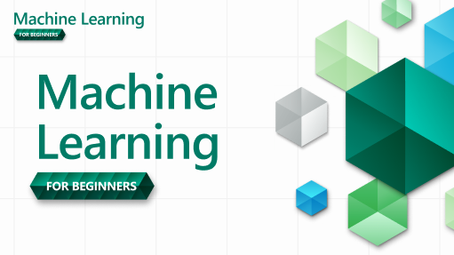

<!--
CO_OP_TRANSLATOR_METADATA:
{
  "original_hash": "0e6380999b08813a492200ca2e3bbf11",
  "translation_date": "2025-08-29T16:28:34+00:00",
  "source_file": "README.md",
  "language_code": "ne"
}
-->
  
  
  
  
  

  
  
  

### 🌐 बहुभाषी समर्थन

#### GitHub Action मार्फत समर्थित (स्वचालित र सधैं अद्यावधिक)

[French](../fr/README.md) | [Spanish](../es/README.md) | [German](../de/README.md) | [Russian](../ru/README.md) | [Arabic](../ar/README.md) | [Persian (Farsi)](../fa/README.md) | [Urdu](../ur/README.md) | [Chinese (Simplified)](../zh/README.md) | [Chinese (Traditional, Macau)](../mo/README.md) | [Chinese (Traditional, Hong Kong)](../hk/README.md) | [Chinese (Traditional, Taiwan)](../tw/README.md) | [Japanese](../ja/README.md) | [Korean](../ko/README.md) | [Hindi](../hi/README.md) | [Bengali](../bn/README.md) | [Marathi](../mr/README.md) | [Nepali](./README.md) | [Punjabi (Gurmukhi)](../pa/README.md) | [Portuguese (Portugal)](../pt/README.md) | [Portuguese (Brazil)](../br/README.md) | [Italian](../it/README.md) | [Polish](../pl/README.md) | [Turkish](../tr/README.md) | [Greek](../el/README.md) | [Thai](../th/README.md) | [Swedish](../sv/README.md) | [Danish](../da/README.md) | [Norwegian](../no/README.md) | [Finnish](../fi/README.md) | [Dutch](../nl/README.md) | [Hebrew](../he/README.md) | [Vietnamese](../vi/README.md) | [Indonesian](../id/README.md) | [Malay](../ms/README.md) | [Tagalog (Filipino)](../tl/README.md) | [Swahili](../sw/README.md) | [Hungarian](../hu/README.md) | [Czech](../cs/README.md) | [Slovak](../sk/README.md) | [Romanian](../ro/README.md) | [Bulgarian](../bg/README.md) | [Serbian (Cyrillic)](../sr/README.md) | [Croatian](../hr/README.md) | [Slovenian](../sl/README.md) | [Ukrainian](../uk/README.md) | [Burmese (Myanmar)](../my/README.md)  

#### समुदायमा सामेल हुनुहोस्

  

# मेसिन लर्निङको लागि शुरुआतीहरू - पाठ्यक्रम

> 🌍 विश्व संस्कृतिहरूको माध्यमबाट मेसिन लर्निङको अन्वेषण गर्दै 🌍  

Microsoft का Cloud Advocates ले **मेसिन लर्निङ** सम्बन्धी १२ हप्ताको, २६ पाठहरूको पाठ्यक्रम प्रस्तुत गर्न पाउँदा खुशी छन्। यस पाठ्यक्रममा, तपाईंले प्रायः Scikit-learn लाई पुस्तकालयको रूपमा प्रयोग गर्दै **क्लासिक मेसिन लर्निङ** भनेर चिनिने विषयको बारेमा सिक्नुहुनेछ। गहिरो सिकाइ (Deep Learning) भने हाम्रो [AI for Beginners' पाठ्यक्रम](https://aka.ms/ai4beginners) मा समेटिएको छ। यसलाई हाम्रो ['Data Science for Beginners' पाठ्यक्रम](https://aka.ms/ds4beginners) सँग पनि जोड्न सकिन्छ।  

हामीसँग विश्वभर यात्रा गर्नुहोस्, जहाँ हामी यी क्लासिक प्रविधिहरूलाई विभिन्न क्षेत्रहरूको डाटामा लागू गर्छौं। प्रत्येक पाठमा पाठ अघि र पछि क्विजहरू, लेखिएको निर्देशनहरू, समाधान, असाइनमेन्ट, र थप सामग्री समावेश छन्। हाम्रो परियोजना-आधारित शिक्षण विधिले तपाईंलाई निर्माण गर्दै सिक्न अनुमति दिन्छ, नयाँ सीपहरूलाई स्थायी बनाउन प्रमाणित विधि।  

**✍️ हाम्रो लेखकहरूलाई हार्दिक धन्यवाद** Jen Looper, Stephen Howell, Francesca Lazzeri, Tomomi Imura, Cassie Breviu, Dmitry Soshnikov, Chris Noring, Anirban Mukherjee, Ornella Altunyan, Ruth Yakubu र Amy Boyd  

**🎨 हाम्रो चित्रकारहरूलाई पनि धन्यवाद** Tomomi Imura, Dasani Madipalli, र Jen Looper  

**🙏 विशेष धन्यवाद 🙏 Microsoft Student Ambassador लेखकहरू, समीक्षकहरू, र सामग्री योगदानकर्ताहरूलाई**, विशेष गरी Rishit Dagli, Muhammad Sakib Khan Inan, Rohan Raj, Alexandru Petrescu, Abhishek Jaiswal, Nawrin Tabassum, Ioan Samuila, र Snigdha Agarwal  

**🤩 अतिरिक्त आभार Microsoft Student Ambassadors Eric Wanjau, Jasleen Sondhi, र Vidushi Gupta लाई हाम्रो R पाठहरूको लागि!**  

# सुरु गर्दै

यी चरणहरू पालना गर्नुहोस्:  
1. **रिपोजिटरीलाई Fork गर्नुहोस्**: यस पृष्ठको माथि-दायाँ कुनामा रहेको "Fork" बटनमा क्लिक गर्नुहोस्।  
2. **रिपोजिटरीलाई Clone गर्नुहोस्**: `git clone https://github.com/microsoft/ML-For-Beginners.git`  

> [यस पाठ्यक्रमका थप स्रोतहरू Microsoft Learn संग्रहमा फेला पार्नुहोस्](https://learn.microsoft.com/en-us/collections/qrqzamz1nn2wx3?WT.mc_id=academic-77952-bethanycheum)  

**[विद्यार्थीहरू](https://aka.ms/student-page)**, यस पाठ्यक्रमलाई प्रयोग गर्न, सम्पूर्ण रिपोजिटरीलाई आफ्नो GitHub खातामा Fork गर्नुहोस् र अभ्यासहरू व्यक्तिगत रूपमा वा समूहमा पूरा गर्नुहोस्:  

- पाठ अघि क्विजबाट सुरु गर्नुहोस्।  
- पाठ पढ्नुहोस् र गतिविधिहरू पूरा गर्नुहोस्, प्रत्येक ज्ञान जाँचमा रोक्दै र विचार गर्दै।  
- पाठहरू बुझेर परियोजनाहरू सिर्जना गर्न प्रयास गर्नुहोस्, समाधान कोड चलाउनुभन्दा; तर त्यो कोड `/solution` फोल्डरहरूमा उपलब्ध छ।  
- पाठ पछि क्विज लिनुहोस्।  
- चुनौती पूरा गर्नुहोस्।  
- असाइनमेन्ट पूरा गर्नुहोस्।  
- पाठ समूह पूरा गरेपछि, [Discussion Board](https://github.com/microsoft/ML-For-Beginners/discussions) मा जानुहोस् र "सार्वजनिक रूपमा सिक्नुहोस्" उपयुक्त PAT रब्रीक भरेर। PAT भनेको प्रगति मूल्यांकन उपकरण हो जसले तपाईंको सिकाइलाई अगाडि बढाउन मद्दत गर्दछ। तपाईं अन्य PAT हरूमा प्रतिक्रिया दिन सक्नुहुन्छ ताकि हामी सँगै सिक्न सकौं।  

> थप अध्ययनको लागि, यी [Microsoft Learn](https://docs.microsoft.com/en-us/users/jenlooper-2911/collections/k7o7tg1gp306q4?WT.mc_id=academic-77952-leestott) मोड्युलहरू र सिकाइ मार्गहरू पालना गर्न सिफारिस गरिन्छ।  

**शिक्षकहरू**, हामीले [केही सुझावहरू समावेश गरेका छौं](for-teachers.md) यस पाठ्यक्रमलाई कसरी प्रयोग गर्ने।  

---

## भिडियो वाकथ्रूहरू

केही पाठहरू छोटो भिडियोको रूपमा उपलब्ध छन्। यी सबै पाठहरूमा इन-लाइन फेला पार्न सकिन्छ, वा [Microsoft Developer YouTube च्यानलमा ML for Beginners प्लेलिस्ट](https://aka.ms/ml-beginners-videos) मा क्लिक गरेर।  

  

---

## टिमलाई भेट्नुहोस्

  

**Gif द्वारा** [Mohit Jaisal](https://linkedin.com/in/mohitjaisal)  

> 🎥 माथिको छवि क्लिक गरेर परियोजना र यसलाई सिर्जना गर्ने व्यक्तिहरूको बारेमा भिडियो हेर्नुहोस्!  

---

## शिक्षण विधि

हामीले यो पाठ्यक्रम निर्माण गर्दा दुई शिक्षण विधिहरू रोजेका छौं: यसलाई **परियोजना-आधारित** बनाउने र **बारम्बार क्विजहरू** समावेश गर्ने। साथै, यस पाठ्यक्रममा एक सामान्य **थिम** छ जसले यसलाई एकता प्रदान गर्दछ।  

सुनिश्चित गरेर कि सामग्री परियोजनाहरूसँग मेल खान्छ, प्रक्रिया विद्यार्थीहरूका लागि थप आकर्षक बनाइन्छ र अवधारणाहरूको सम्झना बढाइन्छ। साथै, कक्षाको अघि कम-जोखिम क्विजले विद्यार्थीलाई विषय सिक्न प्रेरित गर्छ, जबकि कक्षापछि दोस्रो क्विजले थप सम्झना सुनिश्चित गर्छ। यो पाठ्यक्रम लचिलो र रमाइलो बनाउन डिजाइन गरिएको हो र पूर्ण वा आंशिक रूपमा लिन सकिन्छ। परियोजनाहरू साना हुँदै सुरु हुन्छन् र १२ हप्ताको चक्रको अन्त्यसम्ममा क्रमशः जटिल बन्छन्। यस पाठ्यक्रममा ML को वास्तविक-विश्व अनुप्रयोगहरूको बारेमा एक परिशिष्ट पनि समावेश छ, जसलाई अतिरिक्त क्रेडिटको रूपमा वा छलफलको आधारको रूपमा प्रयोग गर्न सकिन्छ।  

> हाम्रो [Code of Conduct](CODE_OF_CONDUCT.md), [Contributing](CONTRIBUTING.md), र [Translation](TRANSLATIONS.md) दिशानिर्देशहरू फेला पार्नुहोस्। हामी तपाईंको रचनात्मक प्रतिक्रिया स्वागत गर्दछौं!  

## प्रत्येक पाठमा समावेश छ

- वैकल्पिक स्केच नोट  
- वैकल्पिक पूरक भिडियो  
- भिडियो वाकथ्रू (केही पाठहरू मात्र)  
- पाठ अघि वार्मअप क्विज  
- लेखिएको पाठ  
- परियोजना-आधारित पाठहरूको लागि, परियोजना निर्माण गर्ने चरण-दर-चरण मार्गदर्शन  
- ज्ञान जाँच  
- चुनौती  
- पूरक पढाइ  
- असाइनमेन्ट  
- पाठ पछि क्विज  

> **भाषाहरूको बारेमा नोट**: यी पाठहरू मुख्य रूपमा Python मा लेखिएका छन्, तर धेरै R मा पनि उपलब्ध छन्। R पाठ पूरा गर्न, `/solution` फोल्डरमा जानुहोस् र R पाठहरू खोज्नुहोस्। तिनीहरूमा `.rmd` एक्सटेन्सन हुन्छ, जसले **R Markdown** फाइललाई प्रतिनिधित्व गर्छ। यसलाई `कोड चंकहरू` (R वा अन्य भाषाहरूका) र `YAML हेडर` (PDF जस्ता आउटपुटहरूलाई ढाँचाबद्ध गर्न मार्गदर्शन गर्ने) लाई `Markdown दस्तावेज` मा समावेश गर्ने रूपमा परिभाषित गर्न सकिन्छ। यसले तपाईंलाई आफ्नो कोड, यसको आउटपुट, र तपाईंका विचारहरू Markdown मा लेख्न अनुमति दिन्छ।  

> **क्विजहरूको बारेमा नोट**: सबै क्विजहरू [Quiz App फोल्डर](../../quiz-app) मा समावेश छन्, कुल ५२ क्विजहरू तीन प्रश्नहरू सहित। तिनीहरू पाठहरूबाट लिंक गरिएका छन् तर क्विज एपलाई स्थानीय रूपमा चलाउन सकिन्छ; `quiz-app` फोल्डरमा निर्देशन पालना गरेर स्थानीय रूपमा होस्ट गर्नुहोस् वा Azure मा तैनात गर्नुहोस्।  

| पाठ संख्या |                             विषय                              |                   पाठ समूह                   | सिकाइ उद्देश्य                                                                                                             |                                                              लिंक गरिएको पाठ                                                               |                        लेखक                        |  
| :-----------: | :------------------------------------------------------------: | :-------------------------------------------------: | ------------------------------------------------------------------------------------------------------------------------------- | :--------------------------------------------------------------------------------------------------------------------------------------: | :--------------------------------------------------: |  
|      01       |                मेसिन लर्निङको परिचय                |      [परिचय](1-Introduction/README.md)       | मेसिन लर्निङको आधारभूत अवधारणाहरू सिक्नुहोस्                                                                                |                                             [पाठ](1-Introduction/1-intro-to-ML/README.md)                                             |                       Muhammad                       |  
|      02       |                मेसिन लर्निङको इतिहास                 |      [परिचय](1-Introduction/README.md)       | यस क्षेत्रको अन्तर्निहित इतिहास सिक्नुहोस्                                                                                         |                                            [पाठ](1-Introduction/2-history-of-ML/README.md)                                            |                     Jen र Amy                      |  
|      03       |                 मेसिन लर्निङमा निष्पक्षता                  |      [परिचय](1-Introduction/README.md)       | विद्यार्थीहरूले ML मोडेलहरू निर्माण र लागू गर्दा विचार गर्नुपर्ने निष्पक्षता सम्बन्धी महत्त्वपूर्ण दार्शनिक मुद्दाहरू के हुन्? |                                              [पाठ](1-Introduction/3-fairness/README.md)                                               |                        Tomomi                        |  
|      04       |                मेसिन लर्निङका प्रविधिहरू                 |      [परिचय](1-Introduction/README.md)       | ML अनुसन्धानकर्ताहरूले ML मोडेलहरू निर्माण गर्न के प्रविधिहरू प्रयोग गर्छन्?                                                                       |                                          [पाठ](1-Introduction/4-techniques-of-ML/README.md)                                           |                    Chris र Jen                     |  
|      05       |                   रिग्रेसनको परिचय                   |        [Regression](2-Regression/README.md)         | रिग्रेसन मोडेलहरूको लागि Python र Scikit-learn को साथ सुरु गर्नुहोस्                                                                  |         
<ul><li>[Python](2-Regression/1-Tools/README.md)</li><li>[R](../../2-Regression/1-Tools/solution/R/lesson_1.html)</li></ul>         |      <ul><li>Jen</li><li>Eric Wanjau</li></ul>       |
|      06       |                उत्तर अमेरिकी कद्दूको मूल्य 🎃                |        [Regression](2-Regression/README.md)         | मेसिन लर्निङको तयारीका लागि डेटा भिजुअलाइज र सफा गर्नुहोस्                                                                                  |          <ul><li>[Python](2-Regression/2-Data/README.md)</li><li>[R](../../2-Regression/2-Data/solution/R/lesson_2.html)</li></ul>          |      <ul><li>Jen</li><li>Eric Wanjau</li></ul>       |
|      07       |                उत्तर अमेरिकी कद्दूको मूल्य 🎃                |        [Regression](2-Regression/README.md)         | रेखीय र बहुपद रिग्रेसन मोडेलहरू निर्माण गर्नुहोस्                                                                                   |        <ul><li>[Python](2-Regression/3-Linear/README.md)</li><li>[R](../../2-Regression/3-Linear/solution/R/lesson_3.html)</li></ul>        |      <ul><li>Jen and Dmitry</li><li>Eric Wanjau</li></ul>       |
|      08       |                उत्तर अमेरिकी कद्दूको मूल्य 🎃                |        [Regression](2-Regression/README.md)         | एक लजिस्टिक रिग्रेसन मोडेल निर्माण गर्नुहोस्                                                                                               |     <ul><li>[Python](2-Regression/4-Logistic/README.md) </li><li>[R](../../2-Regression/4-Logistic/solution/R/lesson_4.html)</li></ul>      |      <ul><li>Jen</li><li>Eric Wanjau</li></ul>       |
|      09       |                          वेब एप्लिकेसन 🔌                          |           [Web App](3-Web-App/README.md)            | तपाईंको प्रशिक्षित मोडेल प्रयोग गर्नको लागि वेब एप्लिकेसन निर्माण गर्नुहोस्                                                                                       |                                                 [Python](3-Web-App/1-Web-App/README.md)                                                  |                         Jen                          |
|      10       |                 वर्गीकरणको परिचय                 |    [Classification](4-Classification/README.md)     | तपाईंको डेटा सफा, तयार, र भिजुअलाइज गर्नुहोस्; वर्गीकरणको परिचय                                                            | <ul><li> [Python](4-Classification/1-Introduction/README.md) </li><li>[R](../../4-Classification/1-Introduction/solution/R/lesson_10.html)  | <ul><li>Jen and Cassie</li><li>Eric Wanjau</li></ul> |
|      11       |             स्वादिष्ट एशियाली र भारतीय परिकार 🍜             |    [Classification](4-Classification/README.md)     | वर्गीकरणकर्ताहरूको परिचय                                                                                                     | <ul><li> [Python](4-Classification/2-Classifiers-1/README.md)</li><li>[R](../../4-Classification/2-Classifiers-1/solution/R/lesson_11.html) | <ul><li>Jen and Cassie</li><li>Eric Wanjau</li></ul> |
|      12       |             स्वादिष्ट एशियाली र भारतीय परिकार 🍜             |    [Classification](4-Classification/README.md)     | थप वर्गीकरणकर्ताहरू                                                                                                                | <ul><li> [Python](4-Classification/3-Classifiers-2/README.md)</li><li>[R](../../4-Classification/3-Classifiers-2/solution/R/lesson_12.html) | <ul><li>Jen and Cassie</li><li>Eric Wanjau</li></ul> |
|      13       |             स्वादिष्ट एशियाली र भारतीय परिकार 🍜             |    [Classification](4-Classification/README.md)     | तपाईंको मोडेल प्रयोग गरेर सिफारिस गर्ने वेब एप्लिकेसन निर्माण गर्नुहोस्                                                                                    |                                              [Python](4-Classification/4-Applied/README.md)                                              |                         Jen                          |
|      14       |                   क्लस्टरिङको परिचय                   |        [Clustering](5-Clustering/README.md)         | तपाईंको डेटा सफा, तयार, र भिजुअलाइज गर्नुहोस्; क्लस्टरिङको परिचय                                                                |         <ul><li> [Python](5-Clustering/1-Visualize/README.md)</li><li>[R](../../5-Clustering/1-Visualize/solution/R/lesson_14.html)         |      <ul><li>Jen</li><li>Eric Wanjau</li></ul>       |
|      15       |              नाइजेरियाली संगीत स्वादहरूको अन्वेषण 🎧              |        [Clustering](5-Clustering/README.md)         | K-Means क्लस्टरिङ विधिको अन्वेषण                                                                                           |           <ul><li> [Python](5-Clustering/2-K-Means/README.md)</li><li>[R](../../5-Clustering/2-K-Means/solution/R/lesson_15.html)           |      <ul><li>Jen</li><li>Eric Wanjau</li></ul>       |
|      16       |        प्राकृतिक भाषा प्रशोधनको परिचय ☕️         |   [Natural language processing](6-NLP/README.md)    | साधारण बोट निर्माण गरेर NLP को आधारभूत कुरा सिक्नुहोस्                                                                             |                                             [Python](6-NLP/1-Introduction-to-NLP/README.md)                                              |                       Stephen                        |
|      17       |                      सामान्य NLP कार्यहरू ☕️                      |   [Natural language processing](6-NLP/README.md)    | भाषाको संरचनासँग सम्बन्धित सामान्य कार्यहरू बुझेर NLP ज्ञानलाई गहिरो बनाउनुहोस्                          |                                                    [Python](6-NLP/2-Tasks/README.md)                                                     |                       Stephen                        |
|      18       |             अनुवाद र भावना विश्लेषण ♥️              |   [Natural language processing](6-NLP/README.md)    | Jane Austen को साथ अनुवाद र भावना विश्लेषण                                                                             |                                            [Python](6-NLP/3-Translation-Sentiment/README.md)                                             |                       Stephen                        |
|      19       |                  युरोपका रोमान्टिक होटलहरू ♥️                  |   [Natural language processing](6-NLP/README.md)    | होटल समीक्षाहरूको साथ भावना विश्लेषण १                                                                                         |                                               [Python](6-NLP/4-Hotel-Reviews-1/README.md)                                                |                       Stephen                        |
|      20       |                  युरोपका रोमान्टिक होटलहरू ♥️                  |   [Natural language processing](6-NLP/README.md)    | होटल समीक्षाहरूको साथ भावना विश्लेषण २                                                                                         |                                               [Python](6-NLP/5-Hotel-Reviews-2/README.md)                                                |                       Stephen                        |
|      21       |            समय श्रृंखला पूर्वानुमानको परिचय             |        [Time series](7-TimeSeries/README.md)        | समय श्रृंखला पूर्वानुमानको परिचय                                                                                         |                                             [Python](7-TimeSeries/1-Introduction/README.md)                                              |                      Francesca                       |
|      22       | ⚡️ विश्व ऊर्जा प्रयोग ⚡️ - ARIMA को साथ समय श्रृंखला पूर्वानुमान |        [Time series](7-TimeSeries/README.md)        | ARIMA को साथ समय श्रृंखला पूर्वानुमान                                                                                              |                                                 [Python](7-TimeSeries/2-ARIMA/README.md)                                                 |                      Francesca                       |
|      23       |  ⚡️ विश्व ऊर्जा प्रयोग ⚡️ - SVR को साथ समय श्रृंखला पूर्वानुमान  |        [Time series](7-TimeSeries/README.md)        | Support Vector Regressor को साथ समय श्रृंखला पूर्वानुमान                                                                           |                                                  [Python](7-TimeSeries/3-SVR/README.md)                                                  |                       Anirban                        |
|      24       |             सुदृढीकरण शिक्षणको परिचय             | [Reinforcement learning](8-Reinforcement/README.md) | Q-Learning को साथ सुदृढीकरण शिक्षणको परिचय                                                                          |                                             [Python](8-Reinforcement/1-QLearning/README.md)                                              |                        Dmitry                        |
|      25       |                 पिटरलाई ब्वाँसोबाट बचाउनुहोस्! 🐺                  | [Reinforcement learning](8-Reinforcement/README.md) | सुदृढीकरण शिक्षण जिम                                                                                                      |                                                [Python](8-Reinforcement/2-Gym/README.md)                                                 |                        Dmitry                        |
|  Postscript   |            वास्तविक संसारका ML परिदृश्य र अनुप्रयोगहरू            |      [ML in the Wild](9-Real-World/README.md)       | शास्त्रीय ML का रोचक र खुलासा गर्ने वास्तविक संसारका अनुप्रयोगहरू                                                               |                                             [Lesson](9-Real-World/1-Applications/README.md)                                              |                         Team                         |
|  Postscript   |            RAI ड्यासबोर्ड प्रयोग गरेर ML मोडेल डिबगिङ          |      [ML in the Wild](9-Real-World/README.md)       | जिम्मेवार AI ड्यासबोर्ड कम्पोनेन्टहरू प्रयोग गरेर मेसिन लर्निङ मोडेल डिबगिङ                                                              |                                             [Lesson](9-Real-World/2-Debugging-ML-Models/README.md)                                              |                         Ruth Yakubu                       |

> [यस पाठ्यक्रमका सबै अतिरिक्त स्रोतहरू हाम्रो Microsoft Learn संग्रहमा फेला पार्नुहोस्](https://learn.microsoft.com/en-us/collections/qrqzamz1nn2wx3?WT.mc_id=academic-77952-bethanycheum)

## अफलाइन पहुँच

तपाईं [Docsify](https://docsify.js.org/#/) प्रयोग गरेर यो डकुमेन्टेसन अफलाइन चलाउन सक्नुहुन्छ। यो रिपो फोर्क गर्नुहोस्, तपाईंको स्थानीय मेसिनमा [Docsify स्थापना गर्नुहोस्](https://docsify.js.org/#/quickstart), र त्यसपछि यो रिपोको रुट फोल्डरमा `docsify serve` टाइप गर्नुहोस्। वेबसाइट तपाईंको localhost मा पोर्ट 3000 मा सर्भ हुनेछ: `localhost:3000`।

## PDFs

लिङ्कसहितको पाठ्यक्रमको PDF [यहाँ](https://microsoft.github.io/ML-For-Beginners/pdf/readme.pdf) फेला पार्नुहोस्।

## 🎒 अन्य पाठ्यक्रमहरू 

हाम्रो टोलीले अन्य पाठ्यक्रमहरू पनि उत्पादन गर्दछ! हेर्नुहोस्:

- [Generative AI for Beginners](https://aka.ms/genai-beginners)
- [Generative AI for Beginners .NET](https://github.com/microsoft/Generative-AI-for-beginners-dotnet)
- [Generative AI with JavaScript](https://github.com/microsoft/generative-ai-with-javascript)
- [Generative AI with Java](https://github.com/microsoft/Generative-AI-for-beginners-java)
- [AI for Beginners](https://aka.ms/ai-beginners)
- [Data Science for Beginners](https://aka.ms/datascience-beginners)
- [ML for Beginners](https://aka.ms/ml-beginners)
- [Cybersecurity for Beginners](https://github.com/microsoft/Security-101) 
- [Web Dev for Beginners](https://aka.ms/webdev-beginners)
- [IoT for Beginners](https://aka.ms/iot-beginners)
- [XR Development for Beginners](https://github.com/microsoft/xr-development-for-beginners)
- [Mastering GitHub Copilot for Paired Programming](https://github.com/microsoft/Mastering-GitHub-Copilot-for-Paired-Programming)
- [Mastering GitHub Copilot for C#/.NET Developers](https://github.com/microsoft/mastering-github-copilot-for-dotnet-csharp-developers)
- [Choose Your Own Copilot Adventure](https://github.com/microsoft/CopilotAdventures)

---

**अस्वीकरण**:  
यो दस्तावेज़ AI अनुवाद सेवा [Co-op Translator](https://github.com/Azure/co-op-translator) प्रयोग गरेर अनुवाद गरिएको छ। हामी शुद्धताको लागि प्रयास गर्छौं, तर कृपया ध्यान दिनुहोस् कि स्वचालित अनुवादहरूमा त्रुटि वा अशुद्धता हुन सक्छ। यसको मूल भाषामा रहेको मूल दस्तावेज़लाई आधिकारिक स्रोत मानिनुपर्छ। महत्वपूर्ण जानकारीको लागि, व्यावसायिक मानव अनुवाद सिफारिस गरिन्छ। यस अनुवादको प्रयोगबाट उत्पन्न हुने कुनै पनि गलतफहमी वा गलत व्याख्याको लागि हामी जिम्मेवार हुने छैनौं।