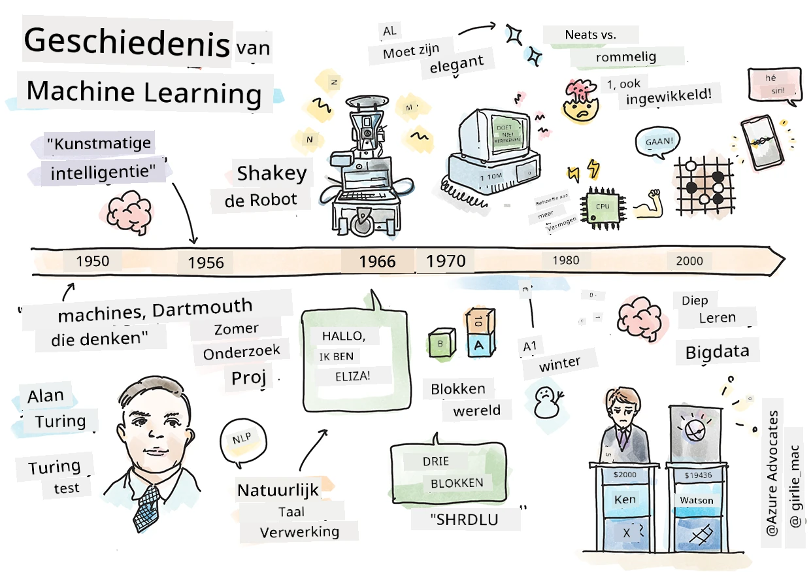
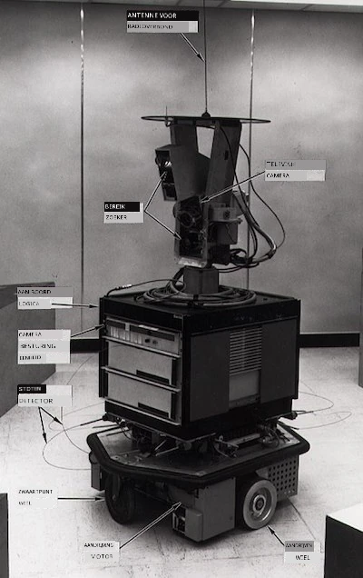
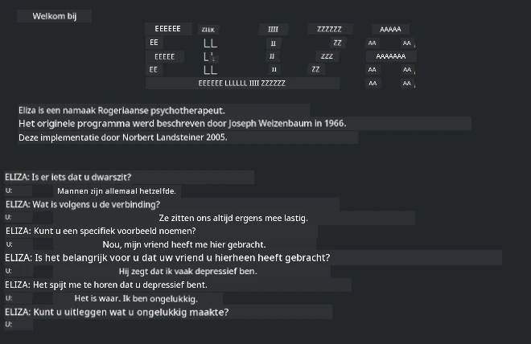

# Geschiedenis van machine learning

> Sketchnote door [Tomomi Imura](https://www.twitter.com/girlie_mac)

## [Pre-college quiz](https://ff-quizzes.netlify.app/en/ml/)

---

> 🎥 Klik op de afbeelding hierboven voor een korte video waarin deze les wordt doorgenomen.

In deze les doorlopen we de belangrijkste mijlpalen in de geschiedenis van machine learning en kunstmatige intelligentie.

De geschiedenis van kunstmatige intelligentie (AI) als vakgebied is verweven met de geschiedenis van machine learning, omdat de algoritmen en computationele ontwikkelingen die aan ML ten grondslag liggen, bijdroegen aan de ontwikkeling van AI. Het is nuttig te onthouden dat, terwijl deze vakgebieden als afzonderlijke onderzoeksgebieden in de jaren 1950 begonnen te kristalliseren, belangrijke [algoritmische, statistische, wiskundige, computationele en technische ontdekkingen](https://wikipedia.org/wiki/Timeline_of_machine_learning) deze periode voorafgingen en overlappen. Mensen hebben al [honderden jaren](https://wikipedia.org/wiki/History_of_artificial_intelligence) over deze vragen nagedacht: dit artikel bespreekt de historische intellectuele fundamenten van het idee van een 'denkende machine'.

---
## Opmerkelijke ontdekkingen

- 1763, 1812 [Bayesiaanse Theorema](https://wikipedia.org/wiki/Bayes%27_theorem) en zijn voorgangers. Dit theorema en de toepassingen ervan liggen ten grondslag aan inferentie, die de waarschijnlijkheid van een gebeurtenis op basis van voorafgaande kennis beschrijft.
- 1805 [Methode van de kleinste kwadraten](https://wikipedia.org/wiki/Least_squares) door de Franse wiskundige Adrien-Marie Legendre. Deze theorie, die je zult leren in onze Regressie-eenheid, helpt bij het passend maken van gegevens.
- 1913 [Markov-ketens](https://wikipedia.org/wiki/Markov_chain), genoemd naar de Russische wiskundige Andrey Markov, worden gebruikt om een reeks mogelijke gebeurtenissen te beschrijven op basis van een vorige toestand.
- 1957 [Perceptron](https://wikipedia.org/wiki/Perceptron) is een type lineaire classifier uitgevonden door de Amerikaanse psycholoog Frank Rosenblatt die ten grondslag ligt aan vooruitgang in deep learning.

---

- 1967 [Dichtstbijzijnde buur](https://wikipedia.org/wiki/Nearest_neighbor) is een algoritme dat oorspronkelijk werd ontworpen om routes in kaart te brengen. In een ML-context wordt het gebruikt om patronen te detecteren.
- 1970 [Backpropagation](https://wikipedia.org/wiki/Backpropagation) wordt gebruikt om [feedforward neurale netwerken](https://wikipedia.org/wiki/Feedforward_neural_network) te trainen.
- 1982 [Terugkerende neurale netwerken](https://wikipedia.org/wiki/Recurrent_neural_network) zijn kunstmatige neurale netwerken die zijn afgeleid van feedforward neurale netwerken die temporele grafieken creëren.

✅ Doe wat onderzoek. Welke andere data springen eruit als belangrijke mijlpalen in de geschiedenis van ML en AI?

---
## 1950: Machines die denken

Alan Turing, een werkelijk opmerkelijk persoon die [door het publiek in 2019](https://wikipedia.org/wiki/Icons:_The_Greatest_Person_of_the_20th_Century) werd gekozen tot de grootste wetenschapper van de 20e eeuw, wordt erkend voor het helpen leggen van de basis voor het concept van een 'machine die kan denken.' Hij worstelde met tegenstanders en zijn eigen behoefte aan empirisch bewijs van dit concept, deels door het creëren van de [Turing-test](https://www.bbc.com/news/technology-18475646), die je zult verkennen in onze NLP-lessen.

---
## 1956: Dartmouth Summer Research Project

"Het Dartmouth Summer Research Project over kunstmatige intelligentie was een baanbrekend evenement voor kunstmatige intelligentie als vakgebied," en het was hier dat de term 'kunstmatige intelligentie' werd bedacht ([bron](https://250.dartmouth.edu/highlights/artificial-intelligence-ai-coined-dartmouth)).

> Elk aspect van leren of een ander kenmerk van intelligentie kan in principe zo nauwkeurig beschreven worden dat een machine het kan nabootsen.

---

De hoofdonderzoeker, wiskundeprofessor John McCarthy, hoopte "op basis van de veronderstelling door te gaan dat elk aspect van leren of een ander kenmerk van intelligentie in principe zo nauwkeurig kan worden beschreven dat een machine het kan nabootsen." Onder de deelnemers bevond zich een andere grootheid op het gebied, Marvin Minsky.

De workshop wordt gecrediteerd voor het initieren en aanmoedigen van verschillende discussies, waaronder "de opkomst van symbolische methoden, systemen gericht op beperkte domeinen (vroege expertsystemen) en deductieve systemen versus inductieve systemen." ([bron](https://wikipedia.org/wiki/Dartmouth_workshop)).

---
## 1956 - 1974: "De gouden jaren"

Vanaf de jaren 1950 tot halverwege de jaren '70 was het optimisme groot dat AI veel problemen zou kunnen oplossen. In 1967 stelde Marvin Minsky vol vertrouwen dat "Binnen een generatie ... het probleem van het creëren van 'kunstmatige intelligentie' grotendeels zal zijn opgelost." (Minsky, Marvin (1967), Computation: Finite and Infinite Machines, Englewood Cliffs, N.J.: Prentice-Hall)

Onderzoek naar natuurlijke taalverwerking bloeide, zoeken werd verfijnd en krachtiger, en het concept van 'micro-werelden' werd gecreëerd, waarbij eenvoudige taken werden uitgevoerd met gewone taalopdrachten.

---

Onderzoek werd goed gefinancierd door overheidsinstanties, er werden vooruitgangen geboekt in berekeningen en algoritmen, en prototypes van intelligente machines werden gebouwd. Enkele van deze machines zijn onder andere:

* [Shakey the robot](https://wikipedia.org/wiki/Shakey_the_robot), die kon manoeuvreren en beslissen hoe taken 'intelligent' uit te voeren.

    
    > Shakey in 1972

---

* Eliza, een vroege 'chatterbot', kon met mensen converseren en fungeren als een primitieve 'therapeut'. Je leert meer over Eliza in de NLP-lessen.

    
    > Een versie van Eliza, een chatbot

---

* "Blocks world" was een voorbeeld van een micro-wereld waar blokken gestapeld en gesorteerd konden worden en experimenten in het leren van besluitvorming door machines konden worden getest. Vooruitgangen gebouwd met bibliotheken zoals [SHRDLU](https://wikipedia.org/wiki/SHRDLU) hielpen taalverwerking vooruit te brengen.

    

    > 🎥 Klik op de afbeelding hierboven voor een video: Blocks world met SHRDLU

---
## 1974 - 1980: "AI Winter"

Halverwege de jaren 1970 werd duidelijk dat de complexiteit van het maken van 'intelligente machines' was onderschat en dat de belofte ervan, gezien de beschikbare rekenkracht, was overdreven. De financiering droogde op en het vertrouwen in het vakgebied nam af. Enkele factoren die het vertrouwen beïnvloedden, waren onder andere:
---
- **Beperkingen**. De rekenkracht was te beperkt.
- **Combinatoire explosie**. Het aantal parameters dat getraind moest worden groeide exponentieel naarmate er meer van computers werd gevraagd, zonder dat de rekenkracht en capaciteit evenredig toenamen.
- **Gebrek aan data**. Het gebrek aan data bemoeilijkte het proces van testen, ontwikkelen en verfijnen van algoritmen.
- **Stellen we de juiste vragen?**. De vragen zelf begonnen in twijfel getrokken te worden. Onderzoekers kregen kritiek op hun benaderingen:
  - De Turing-testen kwamen onder vraag te staan via onder andere de 'Chinese Kamer-theorie' die stelde dat "programmeren van een digitale computer het lijkt alsof die taal begrijpt maar het geen echt begrip kan produceren." ([bron](https://plato.stanford.edu/entries/chinese-room/))
  - De ethiek van het introduceren van kunstmatige intelligenties zoals de "therapeut" ELIZA in de samenleving werd ter discussie gesteld.

---

Tegelijkertijd begonnen verschillende AI-denkrichtingen zich te vormen. Een tweedeling ontstond tussen ["slordige" en "nette AI"](https://wikipedia.org/wiki/Neats_and_scruffies) praktijken. _Slordige_ labs sleutelden uren aan programma's tot ze de gewenste resultaten hadden. _Nette_ labs "concentreerden zich op logica en formele probleemoplossing". ELIZA en SHRDLU waren bekende _slordige_ systemen. In de jaren 1980, toen de vraag ontstond om ML-systemen reproduceerbaar te maken, kreeg de _nette_ benadering geleidelijk de voorkeur omdat de resultaten daarvan beter uitlegbaar zijn.

---
## Jaren 1980 Expertsystemen

Naarmate het vakgebied groeide, werd het nut voor het bedrijfsleven duidelijker, en in de jaren 1980 nam ook de verspreiding van 'expertsystemen' toe. "Expertsystemen waren onder de eerste echt succesvolle vormen van kunstmatige intelligentie (AI) software." ([bron](https://wikipedia.org/wiki/Expert_system)).

Dit type systeem is eigenlijk _hybride_, deels bestaande uit een regelsysteem dat zakelijke vereisten definieert, en een inferentiesysteem dat het regelsysteem gebruikte om nieuwe feiten af te leiden.

In dit tijdperk was er ook toenemende aandacht voor neurale netwerken.

---
## 1987 - 1993: AI 'pauze'

De verspreiding van gespecialiseerd expertsysteem-hardware had het ongelukkige effect dat het te gespecialiseerd werd. De opkomst van personal computers concurreerde ook met deze grote, gespecialiseerde, gecentraliseerde systemen. De democratisering van computing was begonnen en legde uiteindelijk het fundament voor de moderne explosie van big data.

---
## 1993 - 2011

Deze periode markeerde een nieuw tijdperk voor ML en AI waarin ze enkele problemen konden oplossen die eerder waren veroorzaakt door een gebrek aan data en rekenkracht. De hoeveelheid data begon snel toe te nemen en breder beschikbaar te worden, voor beter en slechter, vooral met de opkomst van de smartphone rond 2007. De rekenkracht nam exponentieel toe en de algoritmen evolueerden mee. Het vakgebied begon volwassen te worden na de wilde dagen van vroeger.

---
## Nu

Tegenwoordig raken machine learning en AI bijna elk aspect van ons leven. Dit tijdperk vraagt om een zorgvuldige afweging van de risico's en potentiële effecten van deze algoritmen op menselijke levens. Zoals Brad Smith van Microsoft heeft gezegd: "Informatietechnologie roept kwesties op die gaan over fundamentele mensenrechtenbeschermingen zoals privacy en vrijheid van meningsuiting. Deze kwesties vergroten de verantwoordelijkheid voor technologiebedrijven die deze producten creëren. Wij vinden ook dat het thoughtful overheidsregulatie en de ontwikkeling van normen rond aanvaardbare toepassingen vraagt." ([bron](https://www.technologyreview.com/2019/12/18/102365/the-future-of-ais-impact-on-society/)).

---

Het is nog onduidelijk wat de toekomst brengt, maar het is belangrijk deze computersystemen en de software en algoritmen die ze gebruiken te begrijpen. We hopen dat dit curriculum je helpt een beter begrip te krijgen zodat je zelf kunt beslissen.

> 🎥 Klik op de afbeelding hierboven voor een video: Yann LeCun bespreekt de geschiedenis van deep learning in deze lezing

---
## 🚀Uitdaging

Duik in een van deze historische momenten en leer meer over de mensen erachter. Er zijn fascinerende figuren en geen enkele wetenschappelijke ontdekking is ooit in een cultureel vacuüm ontstaan. Wat ontdek jij?

## [Post-college quiz](https://ff-quizzes.netlify.app/en/ml/)

---
## Herziening & Zelfstudie

Hier zijn items om naar te luisteren en te kijken:

[Deze podcast waarin Amy Boyd de evolutie van AI bespreekt](http://runasradio.com/Shows/Show/739)

---

## Opdracht

[Maak een tijdlijn](assignment.md)

---

<!-- CO-OP TRANSLATOR DISCLAIMER START -->
**Disclaimer**:
Dit document is vertaald met behulp van de AI vertaaldienst [Co-op Translator](https://github.com/Azure/co-op-translator). Hoewel we streven naar nauwkeurigheid, dient u er rekening mee te houden dat geautomatiseerde vertalingen fouten of onnauwkeurigheden kunnen bevatten. Het originele document in de oorspronkelijke taal moet worden beschouwd als de gezaghebbende bron. Voor kritieke informatie wordt professionele menselijke vertaling aanbevolen. Wij zijn niet aansprakelijk voor eventuele misverstanden of verkeerde interpretaties die voortvloeien uit het gebruik van deze vertaling.
<!-- CO-OP TRANSLATOR DISCLAIMER END -->