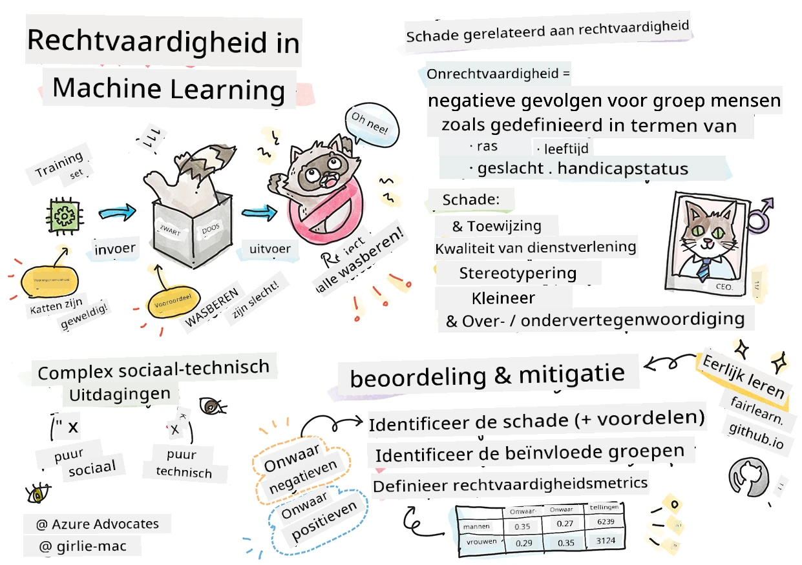

# Het bouwen van Machine Learning-oplossingen met verantwoordelijke AI
 

> Schetsnotitie door [Tomomi Imura](https://www.twitter.com/girlie_mac)

## [Voor-college quiz](https://ff-quizzes.netlify.app/en/ml/)
 
## Introductie

In dit lesprogramma begin je te ontdekken hoe machine learning onze dagelijkse levens kan en doet beïnvloeden. Zelfs nu al zijn systemen en modellen betrokken bij dagelijkse besluitvormingstaken, zoals diagnoses in de gezondheidszorg, leninggoedkeuringen of het opsporen van fraude. Het is dus belangrijk dat deze modellen goed functioneren om uitkomsten te bereiken die betrouwbaar zijn. Net als bij elke softwaretoepassing zullen AI-systemen verwachtingen niet altijd waarmaken of een ongewenst resultaat geven. Daarom is het essentieel om het gedrag van een AI-model te kunnen begrijpen en uitleggen.

Stel je voor wat er kan gebeuren als de data die je gebruikt om deze modellen te bouwen bepaalde demografische groepen mist, zoals ras, geslacht, politieke opvatting, religie, of die dergelijke groepen onevenredig vertegenwoordigt. Wat als de output van het model zo wordt geïnterpreteerd dat deze sommige demografische groepen bevoordeelt? Wat zijn de gevolgen voor de toepassing? Bovendien, wat gebeurt er wanneer het model een nadelige uitkomst heeft en schadelijk is voor mensen? Wie is verantwoordelijk voor het gedrag van het AI-systeem? Dit zijn enkele vragen die we in dit lesprogramma zullen verkennen.

In deze les zul je:

- Je bewust maken van het belang van eerlijkheid in machine learning en de aan eerlijkheid gerelateerde schaden.
- Vertrouwd raken met de praktijk van het onderzoeken van outliers en ongebruikelijke scenario’s om betrouwbaarheid en veiligheid te waarborgen.
- Inzicht krijgen in de noodzaak om iedereen te versterken door inclusieve systemen te ontwerpen.
- Verkennen hoe belangrijk het is om de privacy en veiligheid van data en mensen te beschermen.
- Het belang zien van een open aanpak om het gedrag van AI-modellen uit te leggen.
- Bewust zijn van hoe verantwoordelijkheid essentieel is om vertrouwen in AI-systemen op te bouwen.

## Vereiste voorkennis

Als vereiste, doorloop je het Leertraject "Principes van Verantwoordelijke AI" en bekijk je de onderstaande video over dit onderwerp:

Leer meer over Verantwoordelijke AI door dit [Leertraject](https://docs.microsoft.com/learn/modules/responsible-ai-principles/?WT.mc_id=academic-77952-leestott) te volgen.

> 🎥 Klik op de afbeelding hierboven voor een video: Microsofts Benadering van Verantwoordelijke AI

## Eerlijkheid

AI-systemen moeten iedereen eerlijk behandelen en voorkomen dat vergelijkbare groepen mensen op verschillende manieren worden beïnvloed. Bijvoorbeeld, wanneer AI-systemen richtlijnen geven over medische behandelingen, leningaanvragen of werkgelegenheid, moeten ze aan iedereen met vergelijkbare symptomen, financiële omstandigheden of professionele kwalificaties dezelfde aanbevelingen doen. Wij mensen dragen allen aangeboren vooroordelen mee die onze beslissingen en acties beïnvloeden. Deze vooroordelen kunnen zichtbaar zijn in de data die we gebruiken om AI-systemen te trainen. Dergelijke manipulatie kan soms onbedoeld gebeuren. Het is vaak moeilijk bewust te weten wanneer je vooringenomenheid in data introduceert.

**“Oneerlijkheid”** omvat negatieve effecten, of “schade”, voor een groep mensen, bijvoorbeeld gedefinieerd op basis van ras, geslacht, leeftijd of handicapstatus. De belangrijkste aan eerlijkheid gerelateerde schaden kunnen worden ingedeeld als:

- **Toewijzing**, als bijvoorbeeld een geslacht of etniciteit boven een ander wordt bevoordeeld.
- **Kwaliteit van dienstverlening**. Als je data traint voor één specifiek scenario maar de werkelijkheid veel complexer is, leidt dat tot een slecht presterende dienst. Bijvoorbeeld een handzeepdispenser die mensen met een donkere huid niet lijkt te kunnen detecteren. [Referentie](https://gizmodo.com/why-cant-this-soap-dispenser-identify-dark-skin-1797931773)
- **Beschimpen**. Onrechtvaardig iets of iemand bekritiseren en labelen. Bijvoorbeeld, een technologie voor beeldherkenning die berucht is omdat die beelden van mensen met een donkere huid als gorilla’s labelde.
- **Over- of ondervertegenwoordiging**. Het idee is dat een bepaalde groep niet wordt gezien in een bepaald beroep, en elke dienst of functie die dat promoot draagt bij aan schade.
- **Stereotypering**. Een bepaalde groep associëren met vooropgezette eigenschappen. Bijvoorbeeld, een vertaalsysteem tussen Engels en Turks kan onnauwkeurigheden bevatten door stereotypische associaties met geslacht.

> vertaling naar Turks

> vertaling terug naar Engels

Bij het ontwerpen en testen van AI-systemen moeten we ervoor zorgen dat AI eerlijk is en niet geprogrammeerd is om bevooroordeelde of discriminerende beslissingen te nemen, iets wat mensen ook niet mogen doen. Het garanderen van eerlijkheid in AI en machine learning blijft een complexe sociotechnische uitdaging.

### Betrouwbaarheid en veiligheid

Om vertrouwen op te bouwen, moeten AI-systemen betrouwbaar, veilig en consistent zijn onder normale en onvoorziene omstandigheden. Het is belangrijk om te weten hoe AI-systemen zich in verschillende situaties gedragen, vooral bij outliers. Bij het bouwen van AI-oplossingen moet er veel aandacht zijn voor het omgaan met een grote diversiteit aan omstandigheden die de AI-oplossingen kunnen tegenkomen. Bijvoorbeeld, een zelfrijdende auto moet de veiligheid van mensen als hoogste prioriteit hebben. Daardoor moet de AI van de auto alle mogelijke scenario’s overwegen, zoals nacht, onweersbuien of sneeuwstormen, kinderen die de straat oversteken, huisdieren, wegwerkzaamheden enzovoorts. Hoe goed een AI-systeem een breed scala aan omstandigheden op betrouwbare en veilige wijze kan behandelen, weerspiegelt het niveau van anticipatie van de data scientist of AI-ontwikkelaar tijdens het ontwerp en testen van het systeem.

> [🎥 Klik hier voor een video: ](https://www.microsoft.com/videoplayer/embed/RE4vvIl)

### Inclusiviteit

AI-systemen moeten zo worden ontworpen dat ze iedereen betrekken en versterken. Bij het ontwerpen en implementeren van AI-systemen identificeren en adresseren datawetenschappers en AI-ontwikkelaars potentiële barrières in het systeem die mensen onbedoeld kunnen uitsluiten. Er zijn bijvoorbeeld 1 miljard mensen met een handicap wereldwijd. Met de vooruitgang van AI kunnen ze gemakkelijker toegang krijgen tot een breed scala aan informatie en kansen in hun dagelijks leven. Door barrières weg te nemen, creëren we kansen om te innoveren en AI-producten te ontwikkelen met betere ervaringen die iedereen ten goede komen.

> [🎥 Klik hier voor een video: inclusiviteit in AI](https://www.microsoft.com/videoplayer/embed/RE4vl9v)

### Beveiliging en privacy

AI-systemen moeten veilig zijn en de privacy van mensen respecteren. Mensen hebben minder vertrouwen in systemen die hun privacy, informatie of leven in gevaar brengen. Bij het trainen van machine learning modellen vertrouwen we op data om de beste resultaten te leveren. Daarbij moet rekening worden gehouden met de herkomst van de data en de integriteit ervan. Bijvoorbeeld, is de data door gebruikers ingediend of is het openbaar beschikbaar? Vervolgens is het cruciaal om bij het werken met data AI-systemen te ontwikkelen die vertrouwelijke informatie kunnen beschermen en bestand zijn tegen aanvallen. Naarmate AI meer voorkomt, wordt het steeds belangrijker en complexer om privacy te beschermen en belangrijke persoonlijke en bedrijfsinformatie te beveiligen. Privacy- en dataveiligheidskwesties vergen speciale aandacht bij AI omdat toegang tot data essentieel is voor AI-systemen om nauwkeurige en geïnformeerde voorspellingen en beslissingen over mensen te maken.

> [🎥 Klik hier voor een video: beveiliging in AI](https://www.microsoft.com/videoplayer/embed/RE4voJF)

- Als industrie hebben we aanzienlijke vooruitgang geboekt op het gebied van privacy en beveiliging, mede aangedreven door regelgeving zoals de AVG (Algemene Verordening Gegevensbescherming).
- Toch moeten we bij AI-systemen erkennen dat er een spanning bestaat tussen de behoefte aan meer persoonlijke data om systemen persoonlijker en effectiever te maken – en privacy.
- Net als bij de komst van verbonden computers met het internet, zien we ook een grote toename van beveiligingsproblemen gerelateerd aan AI.
- Tegelijkertijd wordt AI gebruikt om beveiliging te verbeteren. Bijvoorbeeld, de meeste moderne antivirus scanners worden tegenwoordig aangestuurd door AI-heuristieken.
- We moeten ervoor zorgen dat onze Data Science-processen harmonieus samengaan met de nieuwste privacy- en beveiligingspraktijken.

### Transparantie
AI-systemen moeten begrijpelijk zijn. Een cruciaal onderdeel van transparantie is het uitleggen van het gedrag van AI-systemen en hun componenten. Het verbeteren van het begrip van AI-systemen vereist dat belanghebbenden begrijpen hoe en waarom ze functioneren, zodat ze potentiële prestatieproblemen, veiligheids- en privacyzorgen, vooroordelen, uitsluitingspraktijken of onbedoelde uitkomsten kunnen identificeren. Wij vinden ook dat degenen die AI-systemen gebruiken eerlijk en open moeten zijn over wanneer, waarom en hoe ze ervoor kiezen die te implementeren. En over de beperkingen van de systemen die ze gebruiken. Bijvoorbeeld, als een bank een AI-systeem gebruikt om zijn consumentenleningsbeslissingen te ondersteunen, is het belangrijk de uitkomsten te onderzoeken en te begrijpen welke data de aanbevelingen van het systeem beïnvloeden. Overheden beginnen AI industriebreed te reguleren, dus datawetenschappers en organisaties moeten uitleggen of een AI-systeem aan de regelgeving voldoet, vooral als er een ongewenste uitkomst is.

> [🎥 Klik hier voor een video: transparantie in AI](https://www.microsoft.com/videoplayer/embed/RE4voJF)

- Omdat AI-systemen zo complex zijn, is het moeilijk om te begrijpen hoe ze werken en de resultaten te interpreteren.
- Dit gebrek aan begrip beïnvloedt de manier waarop deze systemen worden beheerd, in productie worden genomen en worden gedocumenteerd.
- Dit gebrek aan begrip beïnvloedt vooral de beslissingen die worden genomen op basis van de uitkomsten van deze systemen.

### Verantwoordingsplicht
 
De mensen die AI-systemen ontwerpen en inzetten moeten verantwoordelijk zijn voor hoe hun systemen functioneren. De behoefte aan verantwoordelijkheid is vooral cruciaal bij gevoelige technologieën zoals gezichtsherkenning. Onlangs is er een groeiende vraag naar gezichtsherkenningstechnologie, vooral van wetshandhavingsorganisaties die de potentie van de technologie zien bij toepassingen als het vinden van vermiste kinderen. Deze technologieën zouden echter ook kunnen worden gebruikt door een overheid om fundamentele vrijheden van hun burgers in gevaar te brengen, bijvoorbeeld door voortdurende surveillance van specifieke personen mogelijk te maken. Daarom moeten datawetenschappers en organisaties verantwoordelijk zijn voor de impact van hun AI-systeem op individuen of de samenleving.

> 🎥 Klik op de afbeelding hierboven voor een video: Waarschuwingen voor massale surveillance via gezichtsherkenning

Uiteindelijk is een van de grootste vragen voor onze generatie, als de eerste generatie die AI in de samenleving brengt, hoe we kunnen waarborgen dat computers verantwoordelijk blijven tegenover mensen en hoe we kunnen garanderen dat de mensen die computers ontwerpen verantwoordelijk blijven tegenover iedereen.

## Impactbeoordeling

Voor het trainen van een machine learning model is het belangrijk een impactbeoordeling uit te voeren om het doel van het AI-systeem te begrijpen; wat het beoogde gebruik is; waar het wordt ingezet; en wie er met het systeem zal communiceren. Dit is nuttig voor beoordelaars of testers die het systeem evalueren, zodat zij weten welke factoren in acht genomen moeten worden bij het identificeren van potentiële risico’s en verwachte gevolgen.

De volgende aandachtsgebieden zijn belangrijk bij het uitvoeren van een impactbeoordeling:

* **Nadelige impact op individuen**. Bewust zijn van beperkingen of vereisten, ongeoorloofd gebruik of bekende beperkingen die het systeem bij de prestaties belemmeren, is essentieel om te voorkomen dat het systeem op een manier wordt gebruikt die schade kan veroorzaken aan individuen.
* **Data vereisten**. Begrijpen hoe en waar het systeem data zal gebruiken stelt beoordelaars in staat om op de hoogte te zijn van eventuele datavereisten waar je rekening mee moet houden (bijv. AVG of HIPAA regelgeving). Daarnaast moet worden onderzocht of de bron of hoeveelheid data voldoende is voor training.
* **Samenvatting van impact**. Verzamel een lijst met mogelijke schaden die kunnen ontstaan door het gebruik van het systeem. Tijdens de gehele ML levenscyclus moet worden bekeken of de geïdentificeerde problemen worden gemitigeerd of aangepakt.
* **Toepasselijke doelstellingen** voor elk van de zes kernprincipes. Beoordeel of de doelstellingen van elk principe worden gehaald en of er hiaten zijn.

## Debuggen met verantwoordelijke AI

Net als bij debuggen van een softwareapplicatie is het debuggen van een AI-systeem een noodzakelijk proces om problemen in het systeem te identificeren en op te lossen. Er zijn veel factoren die kunnen beïnvloeden dat een model niet presteert zoals verwacht of verantwoord. De meeste traditionele modelprestatiemaatstaven zijn kwantitatieve totalen van de prestatie van een model, die onvoldoende zijn om te analyseren hoe een model de principes van verantwoordelijke AI schendt. Bovendien is een machine learning model een black box, wat het moeilijk maakt te begrijpen wat het resultaat drijft of uitleg te geven wanneer het een fout maakt. Later in deze cursus leren we hoe de Responsible AI dashboard kan worden gebruikt om AI-systemen te debuggen. Het dashboard biedt een holistisch instrument voor datawetenschappers en AI-ontwikkelaars om:

* **Foutanalyse**. Om de foutverdeling van het model te identificeren die de eerlijkheid of betrouwbaarheid van het systeem kan beïnvloeden.
* **Model overzicht**. Om te ontdekken waar er verschillen zijn in de prestaties van het model over data cohorts.
* **Data analyse**. Om de data distributie te begrijpen en mogelijke vooringenomenheid in de data te identificeren die kunnen leiden tot problemen met eerlijkheid, inclusiviteit en betrouwbaarheid.
* **Model interpreteerbaarheid**. Om te begrijpen wat de voorspellingen van het model beïnvloedt of drijft. Dit helpt bij het uitleggen van het gedrag van het model, wat belangrijk is voor transparantie en verantwoordelijkheid.

## 🚀 Uitdaging
 
Om te voorkomen dat schade wordt veroorzaakt, zouden we:

- een diversiteit aan achtergronden en perspectieven moeten hebben bij de mensen die aan systemen werken.
- investeren in datasets die de diversiteit van onze samenleving weerspiegelen.
- betere methoden moeten ontwikkelen gedurende de hele machine learning levenscyclus om verantwoordelijke AI te detecteren en te corrigeren wanneer het voorkomt.

Denk na over scenario’s uit het echte leven waarin de onbetrouwbaarheid van een model duidelijk is tijdens het bouwen en gebruiken van modellen. Wat zouden we nog meer moeten overwegen?

## [Na-college quiz](https://ff-quizzes.netlify.app/en/ml/)

## Review & Zelfstudie
 

In deze les heb je enkele basisprincipes geleerd van de concepten eerlijkheid en oneerlijkheid in machine learning.  
 
Bekijk deze workshop om dieper in de onderwerpen te duiken: 

- In de zoektocht naar verantwoordelijke AI: Principes in praktijk brengen door Besmira Nushi, Mehrnoosh Sameki en Amit Sharma

> 🎥 Klik op de afbeelding hierboven voor een video: RAI Toolbox: An open-source framework for building responsible AI door Besmira Nushi, Mehrnoosh Sameki, en Amit Sharma

Lees ook: 

- Microsoft’s RAI resource center: [Responsible AI Resources – Microsoft AI](https://www.microsoft.com/ai/responsible-ai-resources?activetab=pivot1%3aprimaryr4) 

- Microsoft’s FATE research group: [FATE: Fairness, Accountability, Transparency, and Ethics in AI - Microsoft Research](https://www.microsoft.com/research/theme/fate/) 

RAI Toolbox: 

- [Responsible AI Toolbox GitHub repository](https://github.com/microsoft/responsible-ai-toolbox)

Lees over Azure Machine Learning's tools om eerlijkheid te waarborgen:

- [Azure Machine Learning](https://docs.microsoft.com/azure/machine-learning/concept-fairness-ml?WT.mc_id=academic-77952-leestott) 

## Opdracht

[Verken RAI Toolbox](assignment.md)

---

<!-- CO-OP TRANSLATOR DISCLAIMER START -->
**Disclaimer**:
Dit document is vertaald met behulp van de AI vertaaldienst [Co-op Translator](https://github.com/Azure/co-op-translator). Hoewel we streven naar nauwkeurigheid, dient u er rekening mee te houden dat geautomatiseerde vertalingen fouten of onnauwkeurigheden kunnen bevatten. Het originele document in de oorspronkelijke taal moet worden beschouwd als de gezaghebbende bron. Voor kritieke informatie wordt professionele menselijke vertaling aanbevolen. Wij zijn niet aansprakelijk voor eventuele misverstanden of verkeerde interpretaties die voortvloeien uit het gebruik van deze vertaling.
<!-- CO-OP TRANSLATOR DISCLAIMER END -->