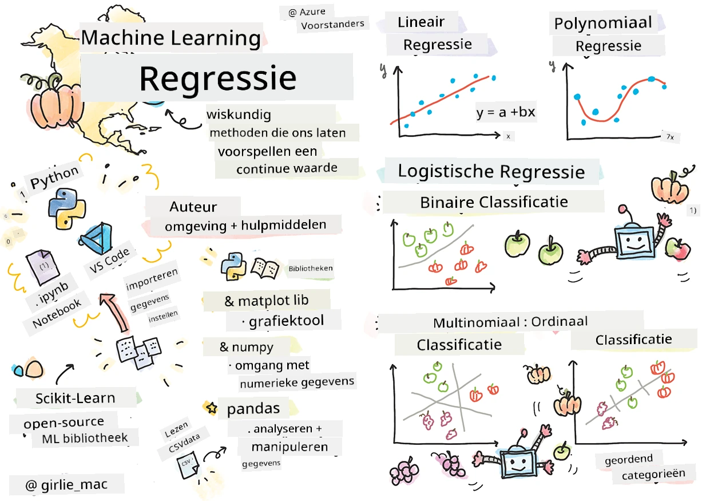
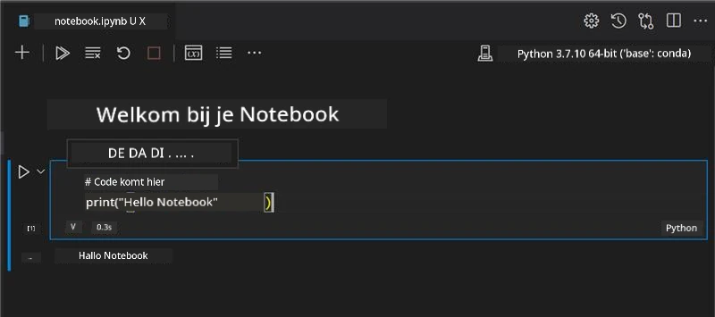
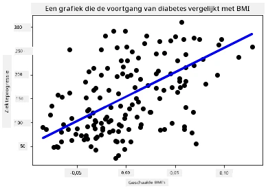

# Aan de slag met Python en Scikit-learn voor regressiemodellen



> Sketchnote door [Tomomi Imura](https://www.twitter.com/girlie_mac)

## [Pre-lezing quiz](https://ff-quizzes.netlify.app/en/ml/)

> ### [Deze les is ook beschikbaar in R!](../../../../2-Regression/1-Tools/solution/R/lesson_1.html)

## Introductie

In deze vier lessen ontdek je hoe je regressiemodellen bouwt. We zullen binnenkort bespreken waar deze voor dienen. Maar voordat je iets doet, zorg ervoor dat je de juiste tools klaar hebt staan om aan het proces te beginnen!

In deze les leer je hoe je:

- Je computer configureert voor lokale machine learning taken.
- Werkt met Jupyter Notebooks.
- Scikit-learn gebruikt, inclusief installatie.
- Lineaire regressie onderzoekt via een praktische oefening.

## Installaties en configuraties

[](https://youtu.be/-DfeD2k2Kj0 "ML voor beginners - Stel je tools klaar om Machine Learning modellen te bouwen")

> 🎥 Klik op de afbeelding hierboven voor een korte video waarin wordt uitgelegd hoe je je computer configureert voor ML.

1. **Installeer Python**. Zorg ervoor dat [Python](https://www.python.org/downloads/) op je computer is geïnstalleerd. Je zult Python voor veel data science en machine learning taken gebruiken. De meeste computersystemen hebben al een Python-installatie. Er zijn ook handige [Python Coding Packs](https://code.visualstudio.com/learn/educators/installers?WT.mc_id=academic-77952-leestott) beschikbaar om de installatie voor sommige gebruikers te vergemakkelijken.

   Sommige toepassingen van Python vereisen echter een specifieke versie van de software, terwijl andere een andere versie nodig hebben. Daarom is het handig om binnen een [virtuele omgeving](https://docs.python.org/3/library/venv.html) te werken.

2. **Installeer Visual Studio Code**. Zorg dat je Visual Studio Code op je computer hebt geïnstalleerd. Volg deze instructies om [Visual Studio Code te installeren](https://code.visualstudio.com/) voor de basisinstallatie. Je gaat in deze cursus Python gebruiken in Visual Studio Code, dus het is handig om te leren hoe je [Visual Studio Code configureert](https://docs.microsoft.com/learn/modules/python-install-vscode?WT.mc_id=academic-77952-leestott) voor Python-ontwikkeling.

   > Maak je vertrouwd met Python door deze verzameling van [Learn modules](https://docs.microsoft.com/users/jenlooper-2911/collections/mp1pagggd5qrq7?WT.mc_id=academic-77952-leestott) door te lopen
   >
   > [](https://youtu.be/yyQM70vi7V8 "Python instellen met Visual Studio Code")
   >
   > 🎥 Klik op de afbeelding hierboven voor een video: Python gebruiken binnen VS Code.

3. **Installeer Scikit-learn** door [deze instructies](https://scikit-learn.org/stable/install.html) te volgen. Omdat je moet zorgen dat je Python 3 gebruikt, wordt aanbevolen een virtuele omgeving te gebruiken. Let op, als je deze bibliotheek op een M1 Mac installeert, staan er speciale instructies op de gelinkte pagina.

1. **Installeer Jupyter Notebook**. Je moet het [Jupyter-pakket installeren](https://pypi.org/project/jupyter/).

## Je ML-ontwikkelomgeving

Je gaat **notebooks** gebruiken om je Python-code te ontwikkelen en machine learning modellen te maken. Dit type bestand is een veelgebruikt hulpmiddel voor datawetenschappers en ze zijn te herkennen aan hun achtervoegsel of extensie `.ipynb`.

Notebooks zijn een interactieve omgeving die de ontwikkelaar toestaat om zowel code te schrijven als aantekeningen te maken en documentatie rond de code te schrijven, wat erg handig is voor experimentele of onderzoeksgerichte projecten.

[](https://youtu.be/7E-jC8FLA2E "ML voor beginners - Stel Jupyter Notebooks in om met regressiemodellen te beginnen")

> 🎥 Klik op de afbeelding hierboven voor een korte video waarin deze oefening wordt doorlopen.

### Oefening - werk met een notebook

In deze map vind je het bestand _notebook.ipynb_.

1. Open _notebook.ipynb_ in Visual Studio Code.

   Een Jupyter-server zal starten met Python 3+ actief. Je vindt delen van de notebook die je kunt `runnen`, stukjes code. Je kunt een codeblok uitvoeren door te klikken op het icoon dat eruitziet als een play-knop.

1. Selecteer het `md`-icoon en voeg wat markdown toe, en de volgende tekst **# Welkom in je notebook**.

   Voeg vervolgens wat Python-code toe.

1. Typ **print('hello notebook')** in het codeblok.
1. Selecteer de pijl om de code uit te voeren.

   Je zou het volgende geprinte statement moeten zien:

    ```output
    hello notebook
    ```



Je kunt je code afwisselen met commentaar om zo de notebook zelf te documenteren.

✅ Denk eens na over hoe verschillend de werkomgeving van een webontwikkelaar is ten opzichte van die van een datawetenschapper.

## Aan de slag met Scikit-learn

Nu Python is geïnstalleerd in je lokale omgeving en je comfortabel bent met Jupyter Notebooks, laten we ook vertrouwd raken met Scikit-learn (uitgesproken als `sci` zoals in `science`). Scikit-learn biedt een [uitgebreide API](https://scikit-learn.org/stable/modules/classes.html#api-ref) om je te helpen bij ML-taken.

Volgens hun [website](https://scikit-learn.org/stable/getting_started.html) is "Scikit-learn een open source machine learning bibliotheek die zowel supervised als unsupervised learning ondersteunt. Het biedt ook diverse tools voor model fitting, datavoorbewerking, modelselectie en evaluatie, en vele andere hulpmiddelen."

In deze cursus gebruik je Scikit-learn en andere tools om machine learning modellen te bouwen voor wat wij 'traditionele machine learning' taken noemen. We hebben bewust neurale netwerken en deep learning buiten beschouwing gelaten, aangezien deze beter worden behandeld in onze komende 'AI voor Beginners' curriculum.

Scikit-learn maakt het eenvoudig om modellen te bouwen en te evalueren voor gebruik. Het richt zich voornamelijk op het werken met numerieke data en bevat verschillende kant-en-klare datasets als leermaterialen. Het bevat ook voorgebouwde modellen die studenten kunnen uitproberen. Laten we het proces verkennen van het laden van voorverpakte data en het gebruiken van een ingebouwde estimator om het eerste ML-model met Scikit-learn te maken met wat basisdata.

## Oefening - je eerste Scikit-learn notebook

> Deze tutorial is geïnspireerd op het [lineaire regressie voorbeeld](https://scikit-learn.org/stable/auto_examples/linear_model/plot_ols.html#sphx-glr-auto-examples-linear-model-plot-ols-py) op de website van Scikit-learn.


[](https://youtu.be/2xkXL5EUpS0 "ML voor beginners - Je eerste lineaire regressieproject in Python")

> 🎥 Klik op de afbeelding hierboven voor een korte video waarin deze oefening wordt doorlopen.

In het _notebook.ipynb_-bestand dat bij deze les hoort, maak je alle cellen leeg door op het 'prullenbak'-icoon te drukken.

In deze sectie werk je met een kleine dataset over diabetes, die ingebouwd is in Scikit-learn voor leerdoeleinden. Stel je voor dat je een behandeling voor diabetespatiënten wilt testen. Machine Learning modellen kunnen je helpen bepalen welke patiënten beter op de behandeling zouden reageren, op basis van combinaties van variabelen. Zelfs een heel eenvoudig regressiemodel kan, zodra het gevisualiseerd is, informatie tonen over variabelen die je kunnen helpen je theoretische klinische proeven te organiseren.

✅ Er zijn veel soorten regressiemethoden, en welke je kiest hangt af van het antwoord dat je zoekt. Wil je bijvoorbeeld de waarschijnlijke lengte voorspellen voor een persoon van een bepaalde leeftijd, dan gebruik je lineaire regressie, omdat je op zoek bent naar een **numerieke waarde**. Ben je geïnteresseerd in het ontdekken of een type keuken als veganistisch beschouwd moet worden, dan zoek je een **categorie-toewijzing** en gebruik je logistische regressie. Daar leer je later meer over. Denk eens na over vragen die je aan data kunt stellen en welke van deze methoden daar het meest geschikt voor zou zijn.

Laten we aan deze taak beginnen.

### Bibliotheken importeren

Voor deze taak importeren we enkele bibliotheken:

- **matplotlib**. Het is een handig [grafiekhulpmiddel](https://matplotlib.org/) en we gebruiken het om een lijngrafiek te maken.
- **numpy**. [numpy](https://numpy.org/doc/stable/user/whatisnumpy.html) is een nuttige bibliotheek voor het omgaan met numerieke data in Python.
- **sklearn**. Dit is de [Scikit-learn](https://scikit-learn.org/stable/user_guide.html) bibliotheek.

Importeer enkele bibliotheken om je taken te helpen uitvoeren.

1. Voeg de imports toe door de volgende code te typen:

   ```python
   import matplotlib.pyplot as plt
   import numpy as np
   from sklearn import datasets, linear_model, model_selection
   ```

   Boven importeer je `matplotlib`, `numpy` en je importeert `datasets`, `linear_model` en `model_selection` uit `sklearn`. `model_selection` wordt gebruikt om data te splitsen in trainings- en testsets.

### De diabetes dataset

De ingebouwde [diabetes dataset](https://scikit-learn.org/stable/datasets/toy_dataset.html#diabetes-dataset) bevat 442 datapunten over diabetes, met 10 kenmerkenvariabelen, waarvan enkele zijn:

- leeftijd: leeftijd in jaren
- bmi: body mass index
- bp: gemiddelde bloeddruk
- s1 tc: T-cellen (een type witte bloedcellen)

✅ Deze dataset bevat het concept 'geslacht' als een kenmerkvariabele die belangrijk is voor onderzoek naar diabetes. Veel medische datasets bevatten dit soort binaire classificaties. Denk eens na over hoe dergelijke categorisaties sommige delen van een bevolking zouden kunnen uitsluiten van behandelingen.

Laad nu de X- en y-data in.

> 🎓 Onthoud, dit is supervised learning, en we hebben een benoemde 'y' target nodig.

Laad in een nieuwe codecel de diabetes dataset door `load_diabetes()` aan te roepen. De invoer `return_X_y=True` geeft aan dat `X` een datamatrix zal zijn en `y` het regressiedoel.

1. Voeg wat printcommando's toe om de vorm van de datamatrix en het eerste element te tonen:

    ```python
    X, y = datasets.load_diabetes(return_X_y=True)
    print(X.shape)
    print(X[0])
    ```

    Wat je terugkrijgt als antwoord is een tuple. Wat je doet is de twee eerste waarden van de tuple toewijzen aan respectievelijk `X` en `y`. Leer meer [over tuples](https://wikipedia.org/wiki/Tuple).

    Je kunt zien dat deze data 442 items bevat die zijn gevormd als arrays van 10 elementen:

    ```text
    (442, 10)
    [ 0.03807591  0.05068012  0.06169621  0.02187235 -0.0442235  -0.03482076
    -0.04340085 -0.00259226  0.01990842 -0.01764613]
    ```

    ✅ Denk eens na over de relatie tussen de data en het regressiedoel. Lineaire regressie voorspelt relaties tussen kenmerk X en doelvariabele y. Kun je het [doel](https://scikit-learn.org/stable/datasets/toy_dataset.html#diabetes-dataset) voor de diabetes dataset in de documentatie vinden? Wat laat deze dataset zien, gezien dat doel?

2. Selecteer vervolgens een deel van deze dataset om te plotten door de 3e kolom van de dataset te kiezen. Je kunt dit doen door met het `:`-operator alle rijen te selecteren en dan de 3e kolom te selecteren met index (2). Je kunt de data ook herschikken naar een 2D-array, wat nodig is voor plotten, door `reshape(n_rows, n_columns)` te gebruiken. Als één van de parameters -1 is, wordt die dimensie automatisch berekend.

   ```python
   X = X[:, 2]
   X = X.reshape((-1,1))
   ```

   ✅ Print op elk moment de data om de vorm te controleren.

3. Nu je data klaar is om geplot te worden, kun je kijken of een machine kan helpen een logische scheiding te bepalen tussen de getallen in deze dataset. Om dit te doen, moet je zowel de data (X) als het doel (y) splitsen in test- en trainingsets. Scikit-learn heeft hier een eenvoudige manier voor; je kunt je testdata op een gegeven punt splitsen.

   ```python
   X_train, X_test, y_train, y_test = model_selection.train_test_split(X, y, test_size=0.33)
   ```

4. Nu ben je klaar om je model te trainen! Laad het lineaire regressiemodel en train het met je X en y trainingssets via `model.fit()`:

    ```python
    model = linear_model.LinearRegression()
    model.fit(X_train, y_train)
    ```

    ✅ `model.fit()` is een functie die je in veel ML-bibliotheken zoals TensorFlow zult zien

5. Maak daarna een voorspelling met de testdata, met de functie `predict()`. Dit wordt gebruikt om de lijn te tekenen tussen de datagroepen

    ```python
    y_pred = model.predict(X_test)
    ```

6. Nu is het tijd om de data te tonen in een grafiek. Matplotlib is een erg handig hulpmiddel hiervoor. Maak een spreidingsdiagram van alle X- en y-testdata, en gebruik de voorspelling om een lijn te tekenen op de meest geschikte plek, tussen de model-data-groepen.

    ```python
    plt.scatter(X_test, y_test,  color='black')
    plt.plot(X_test, y_pred, color='blue', linewidth=3)
    plt.xlabel('Scaled BMIs')
    plt.ylabel('Disease Progression')
    plt.title('A Graph Plot Showing Diabetes Progression Against BMI')
    plt.show()
    ```

   


   ✅ Denk even na over wat hier gebeurt. Er loopt een rechte lijn door veel kleine datapunten, maar wat doet die lijn precies? Zie je hoe je deze lijn zou kunnen gebruiken om te voorspellen waar een nieuw, onbekend datapunt zou moeten passen in relatie tot de y-as van de plot? Probeer in woorden te vatten wat het praktische gebruik van dit model is.

Gefeliciteerd, je hebt je eerste lineaire regressiemodel gebouwd, een voorspelling ermee gemaakt, en deze weergegeven in een plot!

---
## 🚀Uitdaging

Plot een andere variabele uit deze dataset. Tip: bewerk deze regel: `X = X[:,2]`. Gezien het doel van deze dataset, wat kun je ontdekken over de progressie van diabetes als ziekte?
## [Quiz na de les](https://ff-quizzes.netlify.app/en/ml/)

## Review & Zelfstudie

In deze tutorial werkte je met eenvoudige lineaire regressie, in plaats van univariate of meervoudige lineaire regressie. Lees wat over de verschillen tussen deze methoden, of bekijk [deze video](https://www.coursera.org/lecture/quantifying-relationships-regression-models/linear-vs-nonlinear-categorical-variables-ai2Ef)

Lees meer over het concept regressie en denk na over wat voor soort vragen met deze techniek beantwoord kunnen worden. Volg deze [tutorial](https://docs.microsoft.com/learn/modules/train-evaluate-regression-models?WT.mc_id=academic-77952-leestott) om je begrip te verdiepen.

## Opdracht

[Een andere dataset](assignment.md)

---

<!-- CO-OP TRANSLATOR DISCLAIMER START -->
**Disclaimer**:
Dit document is vertaald met behulp van de AI vertaaldienst [Co-op Translator](https://github.com/Azure/co-op-translator). Hoewel we streven naar nauwkeurigheid, dient u er rekening mee te houden dat geautomatiseerde vertalingen fouten of onnauwkeurigheden kunnen bevatten. Het originele document in de oorspronkelijke taal moet worden beschouwd als de gezaghebbende bron. Voor kritieke informatie wordt professionele menselijke vertaling aanbevolen. Wij zijn niet aansprakelijk voor eventuele misverstanden of verkeerde interpretaties die voortvloeien uit het gebruik van deze vertaling.
<!-- CO-OP TRANSLATOR DISCLAIMER END -->