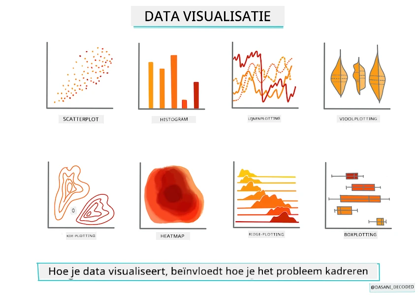
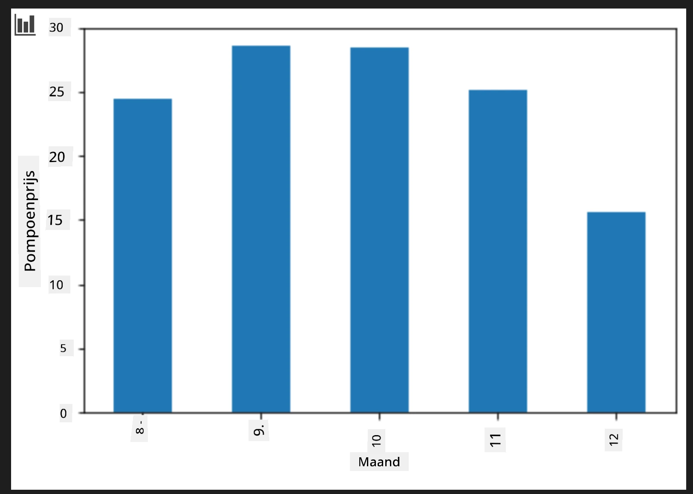
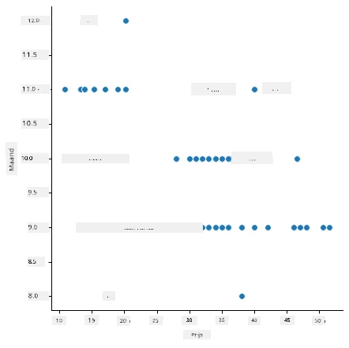
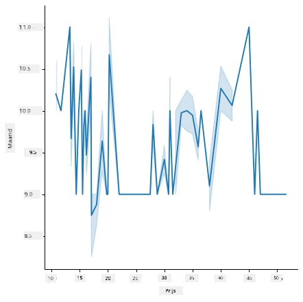
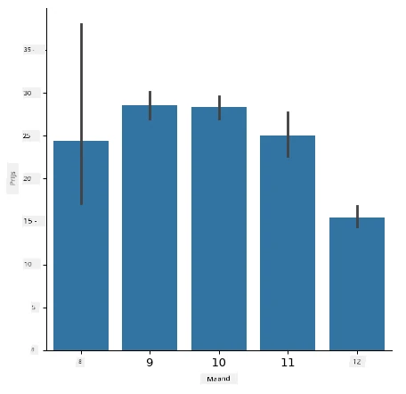
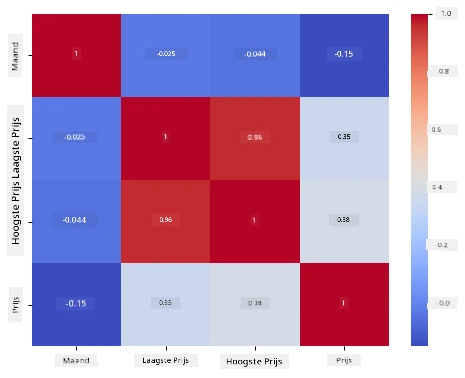

# Bouw een regressiemodel met Scikit-learn: data voorbereiden en visualiseren



Infographic door [Dasani Madipalli](https://twitter.com/dasani_decoded)

## [Pre-college quiz](https://ff-quizzes.netlify.app/en/ml/)

> ### [Deze les is ook beschikbaar in R!](../../../../2-Regression/2-Data/solution/R/lesson_2.html)

## Inleiding

Nu je de tools hebt geïnstalleerd die je nodig hebt om te beginnen met machine learning modelbouw in Scikit-learn, ben je klaar om vragen te stellen aan je data. Terwijl je met data werkt en ML-oplossingen toepast, is het heel belangrijk om te weten hoe je de juiste vraag stelt om het potentieel van je dataset goed te benutten.

In deze les leer je:

- Hoe je je data voorbereidt voor modelbouw.
- Hoe je Matplotlib gebruikt voor datavisualisatie.
- Hoe je Seaborn gebruikt voor expressievere datavisualisatie.

## Stel de juiste vraag aan je data

De vraag die je beantwoord wilt krijgen bepaalt welk type ML-algoritmen je zult gebruiken. En de kwaliteit van het antwoord dat je terugkrijgt hangt sterk af van de aard van je data.

Bekijk eens de [data](https://github.com/microsoft/ML-For-Beginners/blob/main/2-Regression/data/US-pumpkins.csv) die bij deze les hoort. Je kunt dit .csv-bestand openen in VS Code. Een snelle blik laat meteen zien dat er lege velden en een mix van tekst en numerieke gegevens zijn. Er is ook een vreemde kolom genaamd 'Package' waar de data een mix is van 'sacks', 'bins' en andere waarden. De data is eigenlijk een beetje rommelig.

[](https://youtu.be/5qGjczWTrDQ "ML voor beginners - Hoe een dataset te analyseren en schoon te maken")

> 🎥 Klik op de afbeelding hierboven voor een korte video over het voorbereiden van de data voor deze les.

Het is niet heel gebruikelijk dat je een dataset krijgt die direct klaar is voor gebruik om een ML-model van te maken. In deze les leer je hoe je een ruwe dataset kunt voorbereiden met standaard Python-bibliotheken. Je leert ook verschillende technieken om de data te visualiseren.

## Casestudy: 'de pompoenmarkt'

In deze map vind je een .csv-bestand in de hoofdmap `data` genaamd [US-pumpkins.csv](https://github.com/microsoft/ML-For-Beginners/blob/main/2-Regression/data/US-pumpkins.csv) met 1757 regels data over de markt voor pompoenen, gegroepeerd per stad. Dit is ruwe data afkomstig van de [Specialty Crops Terminal Markets Standard Reports](https://www.marketnews.usda.gov/mnp/fv-report-config-step1?type=termPrice) verspreid door het Amerikaanse Ministerie van Landbouw.

### Data voorbereiden

Deze data is publiek domein. Het kan per stad in veel losse bestanden van de USDA-website worden gedownload. Om niet te veel losse bestanden te hebben, hebben we alle staddata samengevoegd in één spreadsheet, daarmee hebben we de data dus al een beetje _voorbereid_. Laten we nu de data eens nader bekijken.

### De pompoendata - eerste conclusies

Wat valt je op aan deze data? Je hebt al gezien dat er een mix is van teksten, cijfers, lege plekken en vreemde waarden die je moet begrijpen.

Welke vraag kun je aan deze data stellen met een regressietechniek? Wat dacht je van "Voorspel de prijs van een pompoen die te koop is in een bepaalde maand"? Als je nog eens naar de data kijkt, moet je enkele aanpassingen doen om de datastructuur geschikt te maken voor deze taak.
## Oefening - analyseer de pompoendata

Laten we [Pandas](https://pandas.pydata.org/) gebruiken, (de naam staat voor `Python Data Analysis`), een handig hulpmiddel voor het vormgeven van data, om deze pompoendata te analyseren en voor te bereiden.

### Controleer eerst op ontbrekende datums

Je moet eerst stappen zetten om te controleren op ontbrekende datums:

1. Zet de datums om naar een maandformaat (dit zijn Amerikaanse datums, de notatie is `MM/DD/YYYY`).
2. Haal de maand uit de datum en zet dit in een nieuwe kolom.

Open het bestand _notebook.ipynb_ in Visual Studio Code en importeer de spreadsheet in een nieuwe Pandas dataframe.

1. Gebruik de `head()` functie om de eerste vijf rijen te bekijken.

    ```python
    import pandas as pd
    pumpkins = pd.read_csv('../data/US-pumpkins.csv')
    pumpkins.head()
    ```

    ✅ Welke functie zou je gebruiken om de laatste vijf rijen te bekijken?

1. Controleer of er ontbrekende data is in de huidige dataframe:

    ```python
    pumpkins.isnull().sum()
    ```

    Er is data ontbreekt, maar misschien is dat niet erg voor de taak die je wilt doen.

1. Om het werken met je dataframe makkelijker te maken, selecteer alleen de kolommen die je nodig hebt, met de `loc` functie die uit de originele dataframe een groep rijen (als eerste parameter) en kolommen (als tweede parameter) haalt. In het voorbeeld hieronder betekent `:` "alle rijen".

    ```python
    columns_to_select = ['Package', 'Low Price', 'High Price', 'Date']
    pumpkins = pumpkins.loc[:, columns_to_select]
    ```

### Bepaal vervolgens de gemiddelde prijs van een pompoen

Denk na over hoe je de gemiddelde prijs van een pompoen in een bepaalde maand kunt bepalen. Welke kolommen heb je daarvoor nodig? Tip: je hebt er 3 nodig.

Oplossing: neem het gemiddelde van de kolommen `Low Price` en `High Price` om een nieuwe kolom Price te vullen, en zet de kolom Date om zodat alleen de maand staat. Gelukkig, zoals hierboven gecheckt, ontbreken er geen datums of prijzen.

1. Voeg deze code toe om het gemiddelde te berekenen:

    ```python
    price = (pumpkins['Low Price'] + pumpkins['High Price']) / 2

    month = pd.DatetimeIndex(pumpkins['Date']).month

    ```

   ✅ Voel je vrij om data te printen met `print(month)` om het te controleren.

2. Kopieer je geconverteerde data naar een nieuwe Pandas dataframe:

    ```python
    new_pumpkins = pd.DataFrame({'Month': month, 'Package': pumpkins['Package'], 'Low Price': pumpkins['Low Price'],'High Price': pumpkins['High Price'], 'Price': price})
    ```

    Als je deze dataframe print, zie je een schone, nette dataset waarop je je regressiemodel kunt bouwen.

### Maar wacht! Hier is iets vreemds

Als je kijkt naar de `Package` kolom, zie je dat pompoenen in allerlei soorten verpakkingen verkocht worden. Sommige worden verkocht in '1 1/9 bushel' maten, sommige in '1/2 bushel' maten, sommige per pompoen, sommige per pond, en sommige in grote dozen met verschillende breedtes.

> Pompoenen lijken erg moeilijk consistent te wegen.

Als je dieper in de originele data duikt, is het interessant dat alles met `Unit of Sale` 'EACH' of 'PER BIN' ook het `Package` type per inch, per bin, of 'each' heeft. Pompoenen zijn kennelijk erg lastig om consistent te wegen, dus we gaan ze filteren door alleen pompoenen te selecteren met de string 'bushel' in de `Package` kolom.

1. Voeg bovenaan het bestand onder de CSV-import een filter toe:

    ```python
    pumpkins = pumpkins[pumpkins['Package'].str.contains('bushel', case=True, regex=True)]
    ```

    Als je nu de data print, zie je dat je nu ongeveer 415 regels met pompoenen per bushel krijgt.

### Maar wacht! Er is nog iets te doen

Heb je gemerkt dat het aantal bushel per regel verschilt? Je moet de prijzen normaliseren zodat je de prijs per bushel laat zien; doe daarom wat rekenwerk om dit te standaardiseren.

1. Voeg deze regels toe na de code die de new_pumpkins dataframe maakt:

    ```python
    new_pumpkins.loc[new_pumpkins['Package'].str.contains('1 1/9'), 'Price'] = price/(1 + 1/9)

    new_pumpkins.loc[new_pumpkins['Package'].str.contains('1/2'), 'Price'] = price/(1/2)
    ```

✅ Volgens [The Spruce Eats](https://www.thespruceeats.com/how-much-is-a-bushel-1389308) hangt het gewicht van een bushel af van het soort product, want het is een volumemaat. "Een bushel tomaten weegt bijvoorbeeld 56 pond... Bladeren en groente nemen meer ruimte in, maar wegen minder, dus een bushel spinazie weegt slechts 20 pond." Het is allemaal vrij ingewikkeld! We doen geen poging een bushel naar pond conversie te maken, maar prijzen puur per bushel. Deze studie over bushels pompoenen toont wel aan hoe belangrijk het is om de aard van je data goed te begrijpen!

Nu kun je de prijs per eenheid analyseren gebaseerd op hun bushel-maat. Als je de data nogmaals print, zie je dat het gestandaardiseerd is.

✅ Heb je gemerkt dat pompoenen per half bushel erg duur zijn? Kun je bedenken waarom? Tip: kleine pompoenen zijn veel prijziger dan grote, waarschijnlijk omdat er meer kleine pompoenen in een bushel passen, gezien de ongebruikte ruimte die één grote holle pompoen inneemt.

## Visualisatiestrategieën

Een deel van het werk van een data scientist is het aantonen van de kwaliteit en aard van de data waarmee ze werken. Daartoe maken ze vaak interessante visualisaties, ofwel grafieken, diagrammen en charts die verschillende aspecten van de data laten zien. Zo kunnen ze visueel relaties en gaten tonen die anders moeilijk te ontdekken zijn.

[](https://youtu.be/SbUkxH6IJo0 "ML voor beginners - Hoe data visualiseren met Matplotlib")

> 🎥 Klik op de afbeelding hierboven voor een korte video over het visualiseren van data voor deze les.

Visualisaties kunnen ook helpen bepalen welke machine learning techniek het best bij de data past. Een scatterplot die een lijn volgt, bijvoorbeeld, geeft aan dat de data goed geschikt is voor een lineaire regressie.

Een datavisualisatiebibliotheek die goed werkt in Jupyter notebooks is [Matplotlib](https://matplotlib.org/) (die je ook al in de vorige les zag).

> Verwerf meer ervaring met datavisualisatie via [deze tutorials](https://docs.microsoft.com/learn/modules/explore-analyze-data-with-python?WT.mc_id=academic-77952-leestott).

## Oefening - experimenteer met Matplotlib

Probeer eenvoudige grafieken te maken om de nieuwe dataframe die je zojuist hebt gemaakt weer te geven. Wat zou een basis lijngrafiek laten zien?

1. Importeer Matplotlib bovenaan het bestand, onder de Pandas import:

    ```python
    import matplotlib.pyplot as plt
    ```

1. Voer het hele notebook opnieuw uit om te verversen.
1. Voeg onderaan het notebook een cel toe om de data als boxplot te maken:

    ```python
    price = new_pumpkins.Price
    month = new_pumpkins.Month
    plt.scatter(price, month)
    plt.show()
    ```

    

    Is dit een nuttige grafiek? Verrast je iets eraan?

    Het is niet bijzonder nuttig, want het toont alleen je data verspreid in de maanden.

### Maak het nuttig

Om inzichtelijke grafieken te krijgen, moet je meestal de gegevens groeperen. Laten we proberen een grafiek te maken waarbij de y-as de maanden laat zien, en de data de verdeling ervan toont.

1. Voeg een cel toe om een gegroepeerde staafgrafiek te maken:

    ```python
    new_pumpkins.groupby(['Month'])['Price'].mean().plot(kind='bar')
    plt.ylabel("Pumpkin Price")
    ```

    

    Dit is een nuttigere datavisualisatie! Het lijkt erop dat de hoogste prijs voor pompoenen optreedt in september en oktober. Komt dit overeen met je verwachting? Waarom wel of niet?

## Oefening - experimenteer met Seaborn

Matplotlib is krachtig, maar het kan veel code vragen om een gepolijste grafiek te maken. [Seaborn](https://seaborn.pydata.org/) is een bibliotheek gebouwd _bovenop_ Matplotlib, ontworpen voor statistische datavisualisatie. Het werkt direct met Pandas dataframes, hanteert aantrekkelijke standaardstijlen en maakt het mogelijk informatieve grafieken met veel minder code te maken. Omdat Seaborn Matplotlib-objecten teruggeeft, kun je nog steeds alles wat je van Matplotlib weet gebruiken om het resultaat aan te passen.

> Als je Seaborn nog niet geïnstalleerd hebt, installeer het dan met `pip install seaborn`.

1. Importeer Seaborn bovenaan het notebook, onder de andere imports. Het wordt conventioneel geïmporteerd als `sns`:

    ```python
    import seaborn as sns
    ```

### Scatterplots om relaties te tonen

Een groot deel van het verkennen van data vóór het bouwen van een model is het zoeken naar _relaties_ tussen variabelen. Een [scatterplot](https://nl.wikipedia.org/wiki/Scatterplot_(grafiek)) is daarvoor een van de beste hulpmiddelen: als de punten op een lijn lijken te vallen, zijn de twee variabelen mogelijk gecorreleerd, wat een goed teken is dat een lineair regressiemodel kan werken.

1. Maak de prijs-tot-maand scatterplot opnieuw, dit keer met Seaborns [`relplot()`](https://seaborn.pydata.org/generated/seaborn.relplot.html) (relationele plot), die direct met je dataframekolommen werkt:

    ```python
    sns.relplot(x="Price", y="Month", data=new_pumpkins)
    ```

    

    Let op hoe je de _kolomnamen_ en de dataframe doorgeeft, en Seaborn regelt automatisch de aslabels.

2. Je kunt overschakelen naar een lijngrafiek door `kind="line"` door te geven. Seaborn tekent zelfs een schaduwband die het betrouwbaarheidsinterval rond de lijn toont:

    ```python
    sns.relplot(x="Price", y="Month", kind="line", data=new_pumpkins)
    ```

    

    Deze data is vrij ruisend, dus een lijngrafiek is hier niet de duidelijkste keuze — maar het laat zien hoe makkelijk je in Seaborn van grafiektype kunt wisselen.

### Staafgrafieken om verdelingen te tonen


Eerder groepeerde je de gegevens handmatig om een staafdiagram te maken met Matplotlib. Seaborns [`catplot()`](https://seaborn.pydata.org/generated/seaborn.catplot.html) (categorische plot) kan de groepering en aggregatie voor je doen. Standaard toont `kind="bar"` het gemiddelde van elke categorie samen met een zwarte lijn die het betrouwbaarheidsinterval aangeeft.

1. Maak een staafdiagram van de gemiddelde prijs per maand:

    ```python
    sns.catplot(x="Month", y="Price", data=new_pumpkins, kind="bar")
    ```

    

    Dit bevestigt wat je al zag met Matplotlib — prijzen pieken rond september en oktober — maar Seaborn visualiseert ook hoeveel de prijs _varieert_ binnen elke maand.

### Heatmaps om correlaties te tonen

Scatterplots vergelijken telkens twee variabelen. Wanneer je meerdere numerieke kolommen hebt, laat een [heatmap](https://en.wikipedia.org/wiki/Heat_map) je de sterkte van de relatie tussen _elk_ paar kolommen tegelijk zien. Dit is een gebruikelijke manier om te zien welke kenmerken het meest gecorreleerd zijn voordat je kiest wat je in een model stopt (en hetzelfde soort grafiek wordt later gebruikt om verwarringsmatrices in classificatie weer te geven).

1. Bouw een correlatiematrix met Pandas en teken deze daarna met Seaborns [`heatmap()`](https://seaborn.pydata.org/generated/seaborn.heatmap.html). De optie `annot=True` toont de correlatiewaarden in elke cel:

    ```python
    correlations = new_pumpkins[['Month', 'Low Price', 'High Price', 'Price']].corr()
    sns.heatmap(correlations, annot=True, cmap="coolwarm")
    ```

    

    Waarden dichtbij `1` (of `-1`) betekenen dat de kolommen sterk _lineair_ gecorreleerd zijn. Merk op hoe `Low Price` en `High Price` bijna perfect gecorreleerd zijn. `Month` daarentegen toont slechts een zwakke lineaire correlatie met de prijs — ook al onthulde het staafdiagram hierboven een duidelijke seizoenspiek in september en oktober. Dat is een belangrijke les: de correlatiecoëfficiënt meet alleen _rechte-lijn_ relaties, dus kan seizoensgebonden of anderszins niet-lineaire patronen missen. ✅ Waarom is het nuttig om zowel een heatmap *als* grafieken zoals het staafdiagram te bekijken voordat je beslist welke kolommen je gebruikt?

### Matplotlib of Seaborn?

Beide bibliotheken zijn de moeite waard om te kennen:

- **Matplotlib** geeft je fijne controle over elk element van een grafiek en is de basis waar bijna elke andere Python-plotbibliotheek op bouwt.
- **Seaborn** biedt hoger-niveau functies en aantrekkelijke standaardinstellingen voor statistische grafieken, werkt rechtstreeks met dataframes, en is vaak sneller voor verkennende data-analyse.

Een gangbare werkwijze is om Seaborn te gebruiken om snel je data te verkennen en daarna naar Matplotlib te schakelen als je de details moet aanpassen.

---

## 🚀Uitdaging

Verken de verschillende soorten visualisaties die Matplotlib en Seaborn bieden. Welke types zijn het meest geschikt voor regressieproblemen?

## [Quiz na de lezing](https://ff-quizzes.netlify.app/en/ml/)

## Review & Zelfstudie

Bekijk de vele manieren om data te visualiseren. Maak een lijst van de beschikbare bibliotheken en noteer welke het beste zijn voor bepaalde soorten taken, bijvoorbeeld 2D-visualisaties versus 3D-visualisaties. Wat ontdek je?

## Opdracht

[Verkenning van visualisatie](assignment.md)

---

<!-- CO-OP TRANSLATOR DISCLAIMER START -->
**Disclaimer**:
Dit document is vertaald met behulp van de AI vertaaldienst [Co-op Translator](https://github.com/Azure/co-op-translator). Hoewel we streven naar nauwkeurigheid, dient u er rekening mee te houden dat geautomatiseerde vertalingen fouten of onnauwkeurigheden kunnen bevatten. Het originele document in de oorspronkelijke taal moet worden beschouwd als de gezaghebbende bron. Voor kritieke informatie wordt professionele menselijke vertaling aanbevolen. Wij zijn niet aansprakelijk voor eventuele misverstanden of verkeerde interpretaties die voortvloeien uit het gebruik van deze vertaling.
<!-- CO-OP TRANSLATOR DISCLAIMER END -->