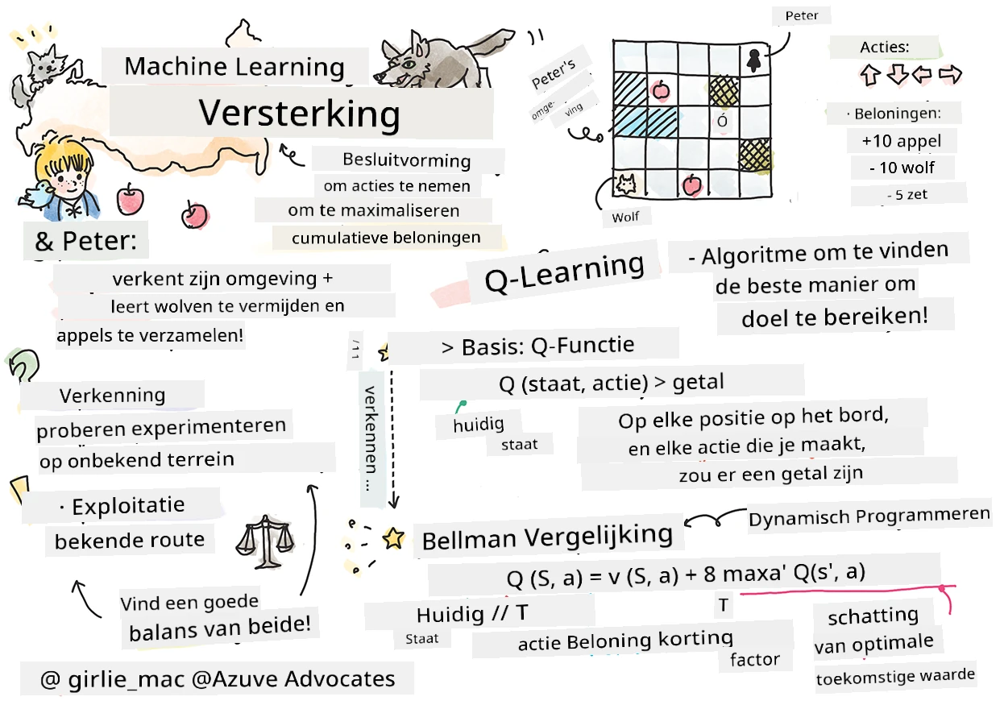

# Introductie tot Reinforcement Learning en Q-Learning


> Sketchnote door [Tomomi Imura](https://www.twitter.com/girlie_mac)

Reinforcement learning omvat drie belangrijke concepten: de agent, enkele toestanden, en een set acties per toestand. Door een actie uit te voeren in een bepaalde toestand, krijgt de agent een beloning. Stel je opnieuw het computerspel Super Mario voor. Jij bent Mario, je bevindt je in een spellevel, staand naast een afgrond. Boven je is een munt. Jij bent Mario, in een spellevel, op een specifieke positie ... dat is jouw toestand. Een stap naar rechts zetten (een actie) zou je over de rand doen vallen, en dat zou je een lage numerieke score geven. Maar als je op de springknop drukt, scoor je een punt en blijf je in leven. Dat is een positieve uitkomst en zou je een positieve numerieke score moeten opleveren.

Door gebruik te maken van reinforcement learning en een simulator (het spel), kun je leren hoe je het spel speelt om de beloning te maximaliseren, namelijk in leven blijven en zoveel mogelijk punten scoren.

[](https://www.youtube.com/watch?v=lDq_en8RNOo)

> 🎥 Klik op de afbeelding hierboven om Dmitry over Reinforcement Learning te horen praten

## [Pre-college quiz](https://ff-quizzes.netlify.app/en/ml/)

## Vereisten en Setup

In deze les gaan we experimenteren met code in Python. Je zou in staat moeten zijn om de Jupyter Notebook-code van deze les uit te voeren, hetzij op je computer, hetzij ergens in de cloud.

Je kunt [de lesnotebook openen](https://github.com/microsoft/ML-For-Beginners/blob/main/8-Reinforcement/1-QLearning/notebook.ipynb) en deze les doorlopen om te bouwen.

> **Opmerking:** Als je deze code vanuit de cloud opent, moet je ook het bestand [`rlboard.py`](https://github.com/microsoft/ML-For-Beginners/blob/main/8-Reinforcement/1-QLearning/rlboard.py) ophalen, dat in de notebookcode wordt gebruikt. Voeg het toe aan dezelfde map als de notebook.

## Introductie

In deze les verkennen we de wereld van **[Peter en de Wolf](https://en.wikipedia.org/wiki/Peter_and_the_Wolf)**, geïnspireerd door een muzikaal sprookje van een Russische componist, [Sergei Prokofiev](https://en.wikipedia.org/wiki/Sergei_Prokofiev). We zullen **Reinforcement Learning** gebruiken om Peter zijn omgeving te laten verkennen, smakelijke appels te verzamelen en de wolf te vermijden.

**Reinforcement Learning** (RL) is een leertechniek die ons in staat stelt optimaal gedrag van een **agent** in een bepaalde **omgeving** te leren door veel experimenten uit te voeren. Een agent in deze omgeving zou een **doel** moeten hebben, gedefinieerd door een **beloningsfunctie**.

## De omgeving

Voor de eenvoud nemen we aan dat de wereld van Peter een vierkant bord is van grootte `breedte` x `hoogte`, zoals dit:


Elke cel in dit bord kan zijn:

* **grond**, waarop Peter en andere wezens kunnen lopen.
* **water**, waarop je uiteraard niet kunt lopen.
* een **boom** of **gras**, een plek waar je kunt rusten.
* een **appel**, die iets vertegenwoordigt dat Peter graag vindt om zichzelf te voeden.
* een **wolf**, die gevaarlijk is en vermeden moet worden.

Er is een aparte Python-module, [`rlboard.py`](https://github.com/microsoft/ML-For-Beginners/blob/main/8-Reinforcement/1-QLearning/rlboard.py), die de code bevat om met deze omgeving te werken. Omdat deze code niet belangrijk is voor het begrijpen van onze concepten, importeren we de module en gebruiken deze om het voorbeeldbord te maken (codeblok 1):

```python
from rlboard import *

width, height = 8,8
m = Board(width,height)
m.randomize(seed=13)
m.plot()
```

Deze code zou een afbeelding van de omgeving moeten printen die lijkt op de bovenstaande.

## Acties en beleid

In ons voorbeeld zou Peters doel zijn om een appel te vinden, terwijl hij de wolf en andere obstakels vermijdt. Hiervoor kan hij in principe rondlopen totdat hij een appel vindt.

Daarom kan hij op elke positie kiezen tussen een van de volgende acties: omhoog, omlaag, links en rechts.

We definiëren deze acties als een woordenboek en koppelen ze aan paren van bijbehorende coördinatenveranderingen. Bijvoorbeeld, naar rechts bewegen (`R`) komt overeen met het paar `(1,0)`. (codeblok 2):

```python
actions = { "U" : (0,-1), "D" : (0,1), "L" : (-1,0), "R" : (1,0) }
action_idx = { a : i for i,a in enumerate(actions.keys()) }
```

Samengevat zijn de strategie en het doel van dit scenario als volgt:

- **De strategie**, van onze agent (Peter) wordt gedefinieerd door een zogenaamde **policy**. Een policy is een functie die de actie retourneert bij een gegeven toestand. In ons geval wordt de toestand van het probleem gerepresenteerd door het bord, inclusief de huidige positie van de speler.

- **Het doel** van reinforcement learning is uiteindelijk een goede policy te leren die ons in staat stelt het probleem efficiënt op te lossen. Als uitgangspunt nemen we de eenvoudigste policy, genaamd **random walk**.

## Random walk

Laten we ons probleem eerst oplossen door een random walk strategie te implementeren. Bij random walk kiezen we willekeurig de volgende actie uit de toegestane acties, totdat we de appel bereiken (codeblok 3).

1. Implementeer de random walk met onderstaande code:

    ```python
    def random_policy(m):
        return random.choice(list(actions))
    
    def walk(m,policy,start_position=None):
        n = 0 # aantal stappen
        # stel beginpositie in
        if start_position:
            m.human = start_position 
        else:
            m.random_start()
        while True:
            if m.at() == Board.Cell.apple:
                return n # succes!
            if m.at() in [Board.Cell.wolf, Board.Cell.water]:
                return -1 # opgegeten door wolf of verdronken
            while True:
                a = actions[policy(m)]
                new_pos = m.move_pos(m.human,a)
                if m.is_valid(new_pos) and m.at(new_pos)!=Board.Cell.water:
                    m.move(a) # voer de daadwerkelijke beweging uit
                    break
            n+=1
    
    walk(m,random_policy)
    ```

    De aanroep naar `walk` zou de lengte van het bijbehorende pad moeten teruggeven, wat per uitvoering kan variëren.

1. Voer het loopexperiment een aantal keer uit (zeg 100), en print de resulterende statistieken (codeblok 4):

    ```python
    def print_statistics(policy):
        s,w,n = 0,0,0
        for _ in range(100):
            z = walk(m,policy)
            if z<0:
                w+=1
            else:
                s += z
                n += 1
        print(f"Average path length = {s/n}, eaten by wolf: {w} times")
    
    print_statistics(random_policy)
    ```

    Merk op dat de gemiddelde lengte van een pad rond de 30-40 stappen ligt, wat vrij veel is, gezien het feit dat de gemiddelde afstand naar de dichtstbijzijnde appel ongeveer 5-6 stappen is.

    Je kunt ook zien hoe Peters beweging eruitziet tijdens de random walk:

    

## Beloningsfunctie

Om onze policy intelligenter te maken, moeten we begrijpen welke zetten "beter" zijn dan andere. Hiervoor moeten we ons doel definiëren.

Het doel kan worden gedefinieerd in termen van een **beloningsfunctie**, die voor elke toestand een scorewaarde teruggeeft. Hoe hoger het getal, hoe beter de beloningsfunctie. (codeblok 5)

```python
move_reward = -0.1
goal_reward = 10
end_reward = -10

def reward(m,pos=None):
    pos = pos or m.human
    if not m.is_valid(pos):
        return end_reward
    x = m.at(pos)
    if x==Board.Cell.water or x == Board.Cell.wolf:
        return end_reward
    if x==Board.Cell.apple:
        return goal_reward
    return move_reward
```

Een interessant aspect van beloningsfuncties is dat in de meeste gevallen *we slechts een substantiële beloning krijgen aan het einde van het spel*. Dit betekent dat ons algoritme op de een of andere manier "goede" stappen die leiden tot een positieve beloning aan het einde moet onthouden en hun belang moet vergroten. Op dezelfde manier moeten alle zetten die tot slechte resultaten leiden worden ontmoedigd.

## Q-Learning

Een algoritme dat we hier zullen bespreken heet **Q-Learning**. Hierbij wordt de policy gedefinieerd door een functie (of datastructuur) genaamd een **Q-Table**. Deze registreert de "goede" waarde van elke actie in een gegeven toestand.

Het wordt Q-Table genoemd omdat het vaak handig is om het te representeren als een tabel, of een multidimensionale array. Omdat ons bord dimensies `breedte` x `hoogte` heeft, kunnen we de Q-Table representeren met een numpy array met vorm `breedte` x `hoogte` x `len(actions)`: (codeblok 6)

```python
Q = np.ones((width,height,len(actions)),dtype=np.float)*1.0/len(actions)
```

Merk op dat we alle waarden van de Q-Table initialiseren met een gelijke waarde, in ons geval - 0.25. Dit komt overeen met de "random walk" policy, omdat alle zetten in elke toestand even goed zijn. We kunnen de Q-Table doorgeven aan de functie `plot` om de tabel op het bord te visualiseren: `m.plot(Q)`.


In het midden van elke cel bevindt zich een "pijl" die de voorkeurrichting van beweging aangeeft. Omdat alle richtingen gelijk zijn, wordt er een stip getoond.

Nu moeten we de simulatie uitvoeren, onze omgeving verkennen, en een betere verdeling van Q-Table waarden leren, die ons in staat stelt het pad naar de appel veel sneller te vinden.

## Essentie van Q-Learning: Bellman Vergelijking

Zodra we beginnen te bewegen, zal elke actie een bijbehorende beloning hebben, d.w.z. we kunnen theoretisch de volgende actie selecteren op basis van de hoogste onmiddellijke beloning. Maar in de meeste toestanden zal de zet ons doel om de appel te bereiken niet behalen, en kunnen we niet direct beslissen welke richting beter is.

> Onthoud dat het niet het onmiddellijke resultaat is dat telt, maar het uiteindelijke resultaat, dat we verkrijgen aan het einde van de simulatie.

Om rekening te houden met deze vertraagde beloning, moeten we de principes van **[dynamische programmering](https://en.wikipedia.org/wiki/Dynamic_programming)** gebruiken, die ons in staat stellen om het probleem recursief te benaderen.

Stel dat we nu in toestand *s* zijn, en we willen naar de volgende toestand *s'* gaan. Door dit te doen ontvangen we de onmiddellijke beloning *r(s,a)*, gedefinieerd door de beloningsfunctie, plus een toekomstige beloning. Als we veronderstellen dat onze Q-Table correct de "aantrekkelijkheid" van elke actie weerspiegelt, dan kiezen we in toestand *s'* een actie *a* die overeenkomt met de maximale waarde van *Q(s',a')*. Zo wordt de beste mogelijke toekomstige beloning die we in toestand *s* kunnen krijgen gedefinieerd als `max`<sub>a'</sub>*Q(s',a')* (maximaal hier wordt berekend over alle mogelijke acties *a'* in toestand *s'*).

Dit geeft de **Bellman-formule** om de waarde van de Q-Table in toestand *s*, gegeven actie *a*, te berekenen:


Hier is γ de zogenaamde **discount factor** die bepaalt in welke mate je de huidige beloning moet prefereerden boven de toekomstige beloning en omgekeerd.

## Leeralgoritme

Gegeven bovenstaande vergelijking, kunnen we nu pseudocode schrijven voor ons leeralgoritme:

* Initialiseer Q-Table Q met gelijke waarden voor alle toestanden en acties
* Stel leersnelheid α ← 1 in
* Herhaal simulatie vele keren
   1. Start op een willekeurige positie
   1. Herhaal
        1. Selecteer een actie *a* in toestand *s*
        2. Voer actie uit door naar nieuwe toestand *s'* te gaan
        3. Als het einde-van-spel conditie is bereikt, of totale beloning te klein is - verlaat simulatie  
        4. Bereken beloning *r* in de nieuwe toestand
        5. Update Q-Functie volgens Bellman vergelijking: *Q(s,a)* ← *(1-α)Q(s,a)+α(r+γ max<sub>a'</sub>Q(s',a'))*
        6. *s* ← *s'*
        7. Update de totale beloning en verlaag α.

## Exploit vs. explore

In bovenstaande algoritme hebben we niet gespecificeerd hoe we precies een actie moeten kiezen bij stap 2.1. Als we de actie willekeurig kiezen, zullen we de omgeving willekeurig **verkennen**, en is het vrij waarschijnlijk dat we vaak zullen sterven en gebieden ontdekken waar we normaal niet zouden komen. Een alternatief is om de Q-Table waarden al te **exploitën** die we al kennen, en daarom de beste actie (met hogere Q-Table waarde) te kiezen in toestand *s*. Dit voorkomt echter dat we andere toestanden verkennen, en het is waarschijnlijk dat we de optimale oplossing niet zullen vinden.

Dus is de beste aanpak om een balans te vinden tussen exploratie en exploitatie. Dit kan gedaan worden door de actie in toestand *s* te kiezen met waarschijnlijkheden evenredig aan de waarden in de Q-Table. Aan het begin, wanneer alle Q-Table waarden gelijk zijn, komt dit overeen met een willekeurige selectie, maar naarmate we meer leren over onze omgeving, zullen we waarschijnlijk meer de optimale route volgen terwijl we de agent af en toe toestaan het onontdekte pad te kiezen.

## Python implementatie

We zijn nu klaar om het leeralgoritme te implementeren. Voordat we dat doen, hebben we ook een functie nodig die willekeurige getallen in de Q-Table omzet in een vector van waarschijnlijkheden voor de bijbehorende acties.

1. Maak een functie `probs()`:

    ```python
    def probs(v,eps=1e-4):
        v = v-v.min()+eps
        v = v/v.sum()
        return v
    ```

    We voegen een paar `eps` toe aan de oorspronkelijke vector om deling door 0 te voorkomen in het begin, wanneer alle componenten van de vector identiek zijn.

Voer het leeralgoritme uit met 5000 experimenten, ook wel **epochs** genoemd: (codeblok 8)
```python
    for epoch in range(5000):
    
        # Kies beginpunt
        m.random_start()
        
        # Begin met reizen
        n=0
        cum_reward = 0
        while True:
            x,y = m.human
            v = probs(Q[x,y])
            a = random.choices(list(actions),weights=v)[0]
            dpos = actions[a]
            m.move(dpos,check_correctness=False) # we staan de speler toe zich buiten het bord te verplaatsen, wat de aflevering beëindigt
            r = reward(m)
            cum_reward += r
            if r==end_reward or cum_reward < -1000:
                lpath.append(n)
                break
            alpha = np.exp(-n / 10e5)
            gamma = 0.5
            ai = action_idx[a]
            Q[x,y,ai] = (1 - alpha) * Q[x,y,ai] + alpha * (r + gamma * Q[x+dpos[0], y+dpos[1]].max())
            n+=1
```

Na het uitvoeren van dit algoritme zou de Q-Table geüpdatet moeten zijn met waarden die de aantrekkelijkheid van verschillende acties in elke stap definiëren. We kunnen proberen de Q-Table te visualiseren door een vector te tekenen in elke cel die in de gewenste bewegingsrichting wijst. Voor eenvoud tekenen we een kleine cirkel in plaats van een pijlpunt.


## Het beleid controleren

Omdat de Q-Table de "aantrekkelijkheid" van elke actie in elke toestand weergeeft, is het vrij eenvoudig om deze te gebruiken voor efficiënte navigatie in onze wereld. In het eenvoudigste geval kunnen we de actie kiezen die overeenkomt met de hoogste Q-Table waarde: (codeblok 9)

```python
def qpolicy_strict(m):
        x,y = m.human
        v = probs(Q[x,y])
        a = list(actions)[np.argmax(v)]
        return a

walk(m,qpolicy_strict)
```


> Als je de bovenstaande code meerdere keren probeert, merk je misschien dat het soms "hangt" en dat je op de STOP-knop in het notebook moet drukken om het te onderbreken. Dit gebeurt omdat er situaties kunnen zijn waarin twee toestanden "naar elkaar wijzen" in termen van optimale Q-waarde, waardoor de agent uiteindelijk tussen die toestanden blijft bewegen zonder einde.

## 🚀Uitdaging

> **Taak 1:** Pas de `walk`-functie aan om de maximale lengte van het pad te beperken tot een bepaald aantal stappen (zeg 100), en bekijk hoe de bovenstaande code deze waarde van tijd tot tijd retourneert.

> **Taak 2:** Pas de `walk`-functie aan zodat deze niet teruggaat naar plaatsen waar hij al eerder is geweest. Dit voorkomt dat `walk` blijft rondlopen, maar de agent kan wel nog steeds "gevangen" raken op een plek waaruit hij niet kan ontsnappen.

## Navigatie

Een beter navigatiebeleid zou het beleid zijn dat we tijdens training gebruikten, dat exploitatie en exploratie combineert. Bij dit beleid selecteren we elke actie met een bepaalde waarschijnlijkheid, evenredig aan de waarden in de Q-Table. Deze strategie kan er nog steeds toe leiden dat de agent terugkeert naar een positie die hij al onderzocht heeft, maar zoals je kunt zien in de onderstaande code, resulteert het in een erg korte gemiddelde route naar de gewenste locatie (onthoud dat `print_statistics` de simulatie 100 keer uitvoert): (code block 10)

```python
def qpolicy(m):
        x,y = m.human
        v = probs(Q[x,y])
        a = random.choices(list(actions),weights=v)[0]
        return a

print_statistics(qpolicy)
```

Na het uitvoeren van deze code zou je een veel kortere gemiddelde padlengte moeten krijgen dan eerder, binnen het bereik van 3-6.

## Onderzoek naar het leerproces

Zoals we hebben genoemd, is het leerproces een balans tussen exploratie en exploitatie van opgedane kennis over de structuur van de probleemruimte. We hebben gezien dat de leerresultaten (het vermogen van een agent om een kort pad naar het doel te vinden) zijn verbeterd, maar het is ook interessant om te observeren hoe de gemiddelde padlengte zich gedraagt tijdens het leerproces:


De leerpunten kunnen worden samengevat als:

- **De gemiddelde padlengte neemt toe**. Wat we hier zien is dat in het begin de gemiddelde padlengte toeneemt. Dit komt waarschijnlijk doordat wanneer we niets weten van de omgeving, we gemakkelijk vast kunnen komen te zitten in slechte toestanden, zoals water of wolf. Naarmate we meer leren en deze kennis toepassen, kunnen we de omgeving langer verkennen, maar we weten nog niet goed waar de appels liggen.

- **Padlengte neemt af naarmate we meer leren**. Zodra we genoeg geleerd hebben, wordt het voor de agent makkelijker om het doel te bereiken, en begint de padlengte te dalen. We staan echter nog open voor exploratie, dus we wijken vaak af van het beste pad en verkennen nieuwe opties, waardoor het pad langer wordt dan optimaal.

- **Lengte neemt plotseling toe**. Wat we ook in deze grafiek zien is dat de lengte op een gegeven moment abrupt toenam. Dit wijst op het stochastische karakter van het proces, en dat we op een gegeven moment de Q-Table-waarden kunnen "bederven" doordat we ze overschrijven met nieuwe waarden. Dit zou idealiter moeten worden beperkt door het verlagen van het leerpercentage (bijvoorbeeld, tegen het einde van de training passen we de Q-Table-waarden slechts licht aan).

Over het algemeen is het belangrijk te onthouden dat het succes en de kwaliteit van het leerproces sterk afhangen van parameters zoals het leerpercentage, afname van het leerpercentage, en de discontovoet. Deze worden vaak **hyperparameters** genoemd, ter onderscheid van **parameters**, die we optimaliseren tijdens het trainen (bijvoorbeeld de Q-Table-waarden). Het proces van het vinden van de beste hyperparameterwaarden heet **hyperparameteroptimalisatie**, en verdient een apart onderwerp.

## [Quiz na de lezing](https://ff-quizzes.netlify.app/en/ml/)

## Opdracht
[Een meer realistische wereld](assignment.md)

---

<!-- CO-OP TRANSLATOR DISCLAIMER START -->
**Disclaimer**:
Dit document is vertaald met behulp van de AI vertaaldienst [Co-op Translator](https://github.com/Azure/co-op-translator). Hoewel we streven naar nauwkeurigheid, dient u er rekening mee te houden dat geautomatiseerde vertalingen fouten of onnauwkeurigheden kunnen bevatten. Het originele document in de oorspronkelijke taal moet worden beschouwd als de gezaghebbende bron. Voor kritieke informatie wordt professionele menselijke vertaling aanbevolen. Wij zijn niet aansprakelijk voor eventuele misverstanden of verkeerde interpretaties die voortvloeien uit het gebruik van deze vertaling.
<!-- CO-OP TRANSLATOR DISCLAIMER END -->