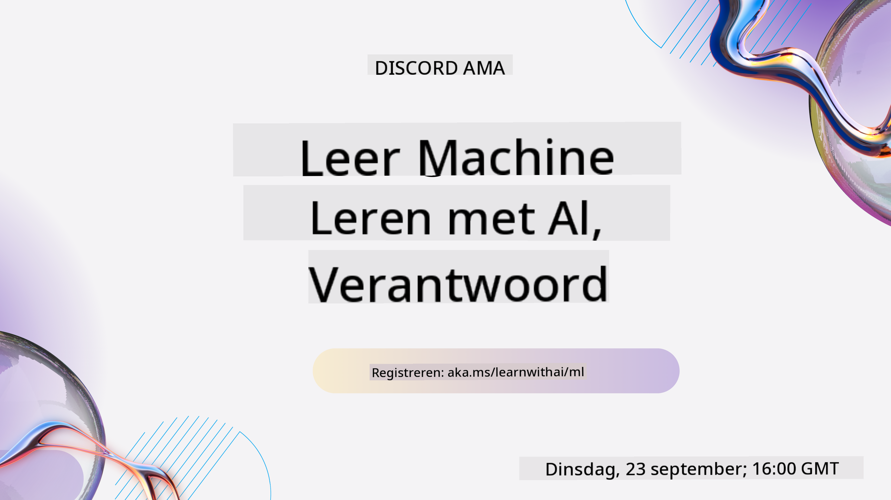
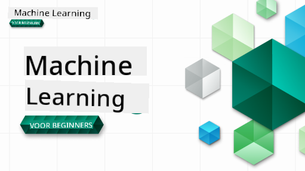

<!--
CO_OP_TRANSLATOR_METADATA:
{
  "original_hash": "7a13afb3674838f557d61f8d67e4d5f8",
  "translation_date": "2025-10-24T09:14:00+00:00",
  "source_file": "README.md",
  "language_code": "nl"
}
-->

### 🌐 Ondersteuning voor meerdere talen

#### Ondersteund via GitHub Action (Automatisch & Altijd Actueel)

<!-- CO-OP TRANSLATOR LANGUAGES TABLE START -->
[Arabisch](../ar/README.md) | [Bengaals](../bn/README.md) | [Bulgaars](../bg/README.md) | [Birmaans (Myanmar)](../my/README.md) | [Chinees (Vereenvoudigd)](../zh/README.md) | [Chinees (Traditioneel, Hong Kong)](../hk/README.md) | [Chinees (Traditioneel, Macau)](../mo/README.md) | [Chinees (Traditioneel, Taiwan)](../tw/README.md) | [Kroatisch](../hr/README.md) | [Tsjechisch](../cs/README.md) | [Deens](../da/README.md) | [Nederlands](./README.md) | [Ests](../et/README.md) | [Fins](../fi/README.md) | [Frans](../fr/README.md) | [Duits](../de/README.md) | [Grieks](../el/README.md) | [Hebreeuws](../he/README.md) | [Hindi](../hi/README.md) | [Hongaars](../hu/README.md) | [Indonesisch](../id/README.md) | [Italiaans](../it/README.md) | [Japans](../ja/README.md) | [Koreaans](../ko/README.md) | [Litouws](../lt/README.md) | [Maleis](../ms/README.md) | [Marathi](../mr/README.md) | [Nepalees](../ne/README.md) | [Noors](../no/README.md) | [Perzisch (Farsi)](../fa/README.md) | [Pools](../pl/README.md) | [Portugees (Brazilië)](../br/README.md) | [Portugees (Portugal)](../pt/README.md) | [Punjabi (Gurmukhi)](../pa/README.md) | [Roemeens](../ro/README.md) | [Russisch](../ru/README.md) | [Servisch (Cyrillisch)](../sr/README.md) | [Slowaaks](../sk/README.md) | [Sloveens](../sl/README.md) | [Spaans](../es/README.md) | [Swahili](../sw/README.md) | [Zweeds](../sv/README.md) | [Tagalog (Filipijns)](../tl/README.md) | [Tamil](../ta/README.md) | [Thais](../th/README.md) | [Turks](../tr/README.md) | [Oekraïens](../uk/README.md) | [Urdu](../ur/README.md) | [Vietnamees](../vi/README.md)
<!-- CO-OP TRANSLATOR LANGUAGES TABLE END -->

#### Word lid van onze community

We hebben een doorlopende Discord-serie over leren met AI. Leer meer en doe mee met ons [Learn with AI Series](https://aka.ms/learnwithai/discord) van 18 - 30 september 2025. Je krijgt tips en trucs over het gebruik van GitHub Copilot voor Data Science.

# Machine Learning voor Beginners - Een Curriculum

> 🌍 Reis de wereld rond terwijl we Machine Learning verkennen aan de hand van wereldculturen 🌍

Cloud Advocates bij Microsoft zijn verheugd om een 12-weekse, 26-lessen curriculum aan te bieden over **Machine Learning**. In dit curriculum leer je over wat soms **klassieke machine learning** wordt genoemd, waarbij voornamelijk Scikit-learn als bibliotheek wordt gebruikt en deep learning wordt vermeden, wat wordt behandeld in ons [AI for Beginners' curriculum](https://aka.ms/ai4beginners). Combineer deze lessen ook met ons ['Data Science for Beginners' curriculum](https://aka.ms/ds4beginners)!

Reis met ons de wereld rond terwijl we deze klassieke technieken toepassen op gegevens uit verschillende delen van de wereld. Elke les bevat quizzen voor en na de les, geschreven instructies om de les te voltooien, een oplossing, een opdracht en meer. Onze projectgerichte aanpak stelt je in staat om te leren door te bouwen, een bewezen manier om nieuwe vaardigheden te laten beklijven.

**✍️ Hartelijk dank aan onze auteurs** Jen Looper, Stephen Howell, Francesca Lazzeri, Tomomi Imura, Cassie Breviu, Dmitry Soshnikov, Chris Noring, Anirban Mukherjee, Ornella Altunyan, Ruth Yakubu en Amy Boyd

**🎨 Ook dank aan onze illustratoren** Tomomi Imura, Dasani Madipalli en Jen Looper

**🙏 Speciale dank 🙏 aan onze Microsoft Student Ambassador auteurs, reviewers en inhoudsbijdragers**, met name Rishit Dagli, Muhammad Sakib Khan Inan, Rohan Raj, Alexandru Petrescu, Abhishek Jaiswal, Nawrin Tabassum, Ioan Samuila en Snigdha Agarwal

**🤩 Extra dank aan Microsoft Student Ambassadors Eric Wanjau, Jasleen Sondhi en Vidushi Gupta voor onze R-lessen!**

# Aan de slag

Volg deze stappen:
1. **Fork de repository**: Klik op de knop "Fork" rechtsboven op deze pagina.
2. **Clone de repository**:   `git clone https://github.com/microsoft/ML-For-Beginners.git`

> [vind alle aanvullende bronnen voor deze cursus in onze Microsoft Learn collectie](https://learn.microsoft.com/en-us/collections/qrqzamz1nn2wx3?WT.mc_id=academic-77952-bethanycheum)

> 🔧 **Hulp nodig?** Bekijk onze [Probleemoplossingsgids](TROUBLESHOOTING.md) voor oplossingen voor veelvoorkomende problemen met installatie, configuratie en het uitvoeren van lessen.

**[Studenten](https://aka.ms/student-page)**, om dit curriculum te gebruiken, fork de hele repo naar je eigen GitHub-account en voltooi de oefeningen zelf of met een groep:

- Begin met een quiz voorafgaand aan de les.
- Lees de les en voltooi de activiteiten, pauzeer en reflecteer bij elke kenniscontrole.
- Probeer de projecten te maken door de lessen te begrijpen in plaats van de oplossingscode uit te voeren; die code is echter beschikbaar in de `/solution` mappen in elke projectgerichte les.
- Maak de quiz na de les.
- Voltooi de uitdaging.
- Voltooi de opdracht.
- Na het voltooien van een lesgroep, bezoek het [Discussiebord](https://github.com/microsoft/ML-For-Beginners/discussions) en "leer hardop" door de juiste PAT-rubric in te vullen. Een 'PAT' is een Progress Assessment Tool, een rubric die je invult om je leerproces te bevorderen. Je kunt ook reageren op andere PATs zodat we samen kunnen leren.

> Voor verdere studie raden we aan om deze [Microsoft Learn](https://docs.microsoft.com/en-us/users/jenlooper-2911/collections/k7o7tg1gp306q4?WT.mc_id=academic-77952-leestott) modules en leerpaden te volgen.

**Docenten**, we hebben [enkele suggesties opgenomen](for-teachers.md) over hoe u dit curriculum kunt gebruiken.

---

## Video walkthroughs

Sommige lessen zijn beschikbaar als korte video's. Je kunt ze allemaal in de lessen vinden, of op de [ML for Beginners playlist op het Microsoft Developer YouTube-kanaal](https://aka.ms/ml-beginners-videos) door op de afbeelding hieronder te klikken.

---

## Ontmoet het team

**Gif door** [Mohit Jaisal](https://linkedin.com/in/mohitjaisal)

> 🎥 Klik op de afbeelding hierboven voor een video over het project en de mensen die het hebben gemaakt!

---

## Pedagogiek

We hebben twee pedagogische principes gekozen bij het bouwen van dit curriculum: ervoor zorgen dat het hands-on **projectgericht** is en dat het **frequente quizzen** bevat. Daarnaast heeft dit curriculum een gemeenschappelijk **thema** om het samenhangend te maken.

Door ervoor te zorgen dat de inhoud aansluit bij projecten, wordt het proces boeiender voor studenten en wordt het begrip van concepten versterkt. Bovendien zet een quiz met lage inzet voorafgaand aan een les de intentie van de student om een onderwerp te leren, terwijl een tweede quiz na de les zorgt voor verdere retentie. Dit curriculum is ontworpen om flexibel en leuk te zijn en kan in zijn geheel of gedeeltelijk worden gevolgd. De projecten beginnen klein en worden steeds complexer tegen het einde van de 12-weekse cyclus. Dit curriculum bevat ook een naschrift over toepassingen van ML in de echte wereld, dat kan worden gebruikt als extra krediet of als basis voor discussie.

> Vind onze [Gedragscode](CODE_OF_CONDUCT.md), [Bijdragen](CONTRIBUTING.md), [Vertaling](TRANSLATIONS.md), en [Probleemoplossing](TROUBLESHOOTING.md) richtlijnen. We verwelkomen je constructieve feedback!

## Elke les bevat

- optionele sketchnote
- optionele aanvullende video
- video walkthrough (alleen sommige lessen)
- [quiz voorafgaand aan de les](https://ff-quizzes.netlify.app/en/ml/)
- geschreven les
- voor projectgerichte lessen, stapsgewijze gidsen over hoe het project te bouwen
- kenniscontroles
- een uitdaging
- aanvullende literatuur
- opdracht
- [quiz na de les](https://ff-quizzes.netlify.app/en/ml/)

> **Een opmerking over talen**: Deze lessen zijn voornamelijk geschreven in Python, maar veel zijn ook beschikbaar in R. Om een R-les te voltooien, ga naar de `/solution` map en zoek naar R-lessen. Ze bevatten een .rmd extensie die een **R Markdown** bestand vertegenwoordigt, wat eenvoudig kan worden gedefinieerd als een combinatie van `code chunks` (van R of andere talen) en een `YAML header` (die aangeeft hoe outputs zoals PDF moeten worden geformatteerd) in een `Markdown document`. Als zodanig dient het als een voorbeeldig authoring framework voor data science, omdat het je in staat stelt je code, de output ervan en je gedachten te combineren door ze in Markdown op te schrijven. Bovendien kunnen R Markdown documenten worden gerenderd naar outputformaten zoals PDF, HTML of Word.

> **Een opmerking over quizzen**: Alle quizzen zijn opgenomen in de [Quiz App map](../../quiz-app), voor in totaal 52 quizzen van drie vragen elk. Ze zijn gelinkt vanuit de lessen, maar de quiz-app kan lokaal worden uitgevoerd; volg de instructies in de `quiz-app` map om lokaal te hosten of te implementeren op Azure.

| Lesnummer |                             Onderwerp                              |                   Lesgroep                   | Leerdoelen                                                                                                             |                                                              Gelinkte les                                                               |                        Auteur                        |
| :-----------: | :------------------------------------------------------------: | :-------------------------------------------------: | ------------------------------------------------------------------------------------------------------------------------------- | :--------------------------------------------------------------------------------------------------------------------------------------: | :--------------------------------------------------: |
|      01       |                Introductie tot machine learning                |      [Introductie](1-Introduction/README.md)       | Leer de basisconcepten achter machine learning                                                                                 |                                             [Les](1-Introduction/1-intro-to-ML/README.md)                                             |                       Muhammad                       |
|      02       |                De geschiedenis van machine learning            |      [Introductie](1-Introduction/README.md)       | Leer de geschiedenis achter dit vakgebied                                                                                      |                                            [Les](1-Introduction/2-history-of-ML/README.md)                                            |                     Jen en Amy                      |
|      03       |                 Eerlijkheid en machine learning                |      [Introductie](1-Introduction/README.md)       | Wat zijn de belangrijke filosofische kwesties rondom eerlijkheid die studenten moeten overwegen bij het bouwen en toepassen van ML-modellen? |                                              [Les](1-Introduction/3-fairness/README.md)                                               |                        Tomomi                        |
|      04       |                Technieken voor machine learning                |      [Introductie](1-Introduction/README.md)       | Welke technieken gebruiken ML-onderzoekers om ML-modellen te bouwen?                                                           |                                          [Les](1-Introduction/4-techniques-of-ML/README.md)                                           |                    Chris en Jen                     |
|      05       |                   Introductie tot regressie                    |        [Regressie](2-Regression/README.md)         | Begin met Python en Scikit-learn voor regressiemodellen                                                                        |         [Python](2-Regression/1-Tools/README.md) • [R](../../2-Regression/1-Tools/solution/R/lesson_1.html)         |      Jen • Eric Wanjau       |
|      06       |                Noord-Amerikaanse pompoenprijzen 🎃             |        [Regressie](2-Regression/README.md)         | Visualiseer en maak gegevens schoon ter voorbereiding op ML                                                                     |          [Python](2-Regression/2-Data/README.md) • [R](../../2-Regression/2-Data/solution/R/lesson_2.html)          |      Jen • Eric Wanjau       |
|      07       |                Noord-Amerikaanse pompoenprijzen 🎃             |        [Regressie](2-Regression/README.md)         | Bouw lineaire en polynomiale regressiemodellen                                                                                 |        [Python](2-Regression/3-Linear/README.md) • [R](../../2-Regression/3-Linear/solution/R/lesson_3.html)        |      Jen en Dmitry • Eric Wanjau       |
|      08       |                Noord-Amerikaanse pompoenprijzen 🎃             |        [Regressie](2-Regression/README.md)         | Bouw een logistisch regressiemodel                                                                                            |     [Python](2-Regression/4-Logistic/README.md) • [R](../../2-Regression/4-Logistic/solution/R/lesson_4.html)      |      Jen • Eric Wanjau       |
|      09       |                          Een webapp 🔌                         |           [Webapp](3-Web-App/README.md)            | Bouw een webapp om je getrainde model te gebruiken                                                                             |                                                 [Python](3-Web-App/1-Web-App/README.md)                                                  |                         Jen                          |
|      10       |                 Introductie tot classificatie                  |    [Classificatie](4-Classification/README.md)     | Maak je gegevens schoon, bereid ze voor en visualiseer ze; introductie tot classificatie                                       | [Python](4-Classification/1-Introduction/README.md) • [R](../../4-Classification/1-Introduction/solution/R/lesson_10.html)  | Jen en Cassie • Eric Wanjau |
|      11       |             Heerlijke Aziatische en Indiase gerechten 🍜       |    [Classificatie](4-Classification/README.md)     | Introductie tot classifiers                                                                                                    | [Python](4-Classification/2-Classifiers-1/README.md) • [R](../../4-Classification/2-Classifiers-1/solution/R/lesson_11.html) | Jen en Cassie • Eric Wanjau |
|      12       |             Heerlijke Aziatische en Indiase gerechten 🍜       |    [Classificatie](4-Classification/README.md)     | Meer classifiers                                                                                                               | [Python](4-Classification/3-Classifiers-2/README.md) • [R](../../4-Classification/3-Classifiers-2/solution/R/lesson_12.html) | Jen en Cassie • Eric Wanjau |
|      13       |             Heerlijke Aziatische en Indiase gerechten 🍜       |    [Classificatie](4-Classification/README.md)     | Bouw een aanbevelingswebapp met je model                                                                                       |                                              [Python](4-Classification/4-Applied/README.md)                                              |                         Jen                          |
|      14       |                   Introductie tot clustering                   |        [Clustering](5-Clustering/README.md)         | Maak je gegevens schoon, bereid ze voor en visualiseer ze; introductie tot clustering                                          |         [Python](5-Clustering/1-Visualize/README.md) • [R](../../5-Clustering/1-Visualize/solution/R/lesson_14.html)         |      Jen • Eric Wanjau       |
|      15       |              Verken Nigeriaanse muzieksmaken 🎧                |        [Clustering](5-Clustering/README.md)         | Verken de K-Means clustering methode                                                                                           |           [Python](5-Clustering/2-K-Means/README.md) • [R](../../5-Clustering/2-K-Means/solution/R/lesson_15.html)           |      Jen • Eric Wanjau       |
|      16       |        Introductie tot natuurlijke taalverwerking ☕️          |   [Natuurlijke taalverwerking](6-NLP/README.md)    | Leer de basisprincipes van NLP door een eenvoudige bot te bouwen                                                               |                                             [Python](6-NLP/1-Introduction-to-NLP/README.md)                                              |                       Stephen                        |
|      17       |                      Veelvoorkomende NLP-taken ☕️             |   [Natuurlijke taalverwerking](6-NLP/README.md)    | Verdiep je NLP-kennis door veelvoorkomende taken te begrijpen die nodig zijn bij het omgaan met taalstructuren                 |                                                    [Python](6-NLP/2-Tasks/README.md)                                                     |                       Stephen                        |
|      18       |             Vertaling en sentimentanalyse ♥️                   |   [Natuurlijke taalverwerking](6-NLP/README.md)    | Vertaling en sentimentanalyse met Jane Austen                                                                                  |                                            [Python](6-NLP/3-Translation-Sentiment/README.md)                                             |                       Stephen                        |
|      19       |                  Romantische hotels in Europa ♥️              |   [Natuurlijke taalverwerking](6-NLP/README.md)    | Sentimentanalyse met hotelrecensies 1                                                                                          |                                               [Python](6-NLP/4-Hotel-Reviews-1/README.md)                                                |                       Stephen                        |
|      20       |                  Romantische hotels in Europa ♥️              |   [Natuurlijke taalverwerking](6-NLP/README.md)    | Sentimentanalyse met hotelrecensies 2                                                                                          |                                               [Python](6-NLP/5-Hotel-Reviews-2/README.md)                                                |                       Stephen                        |
|      21       |            Introductie tot tijdreeksvoorspelling              |        [Tijdreeks](7-TimeSeries/README.md)         | Introductie tot tijdreeksvoorspelling                                                                                          |                                             [Python](7-TimeSeries/1-Introduction/README.md)                                              |                      Francesca                       |
|      22       | ⚡️ Wereldwijd energieverbruik ⚡️ - tijdreeksvoorspelling met ARIMA |        [Tijdreeks](7-TimeSeries/README.md)         | Tijdreeksvoorspelling met ARIMA                                                                                                |                                                 [Python](7-TimeSeries/2-ARIMA/README.md)                                                 |                      Francesca                       |
|      23       |  ⚡️ Wereldwijd energieverbruik ⚡️ - tijdreeksvoorspelling met SVR  |        [Tijdreeks](7-TimeSeries/README.md)         | Tijdreeksvoorspelling met Support Vector Regressor                                                                             |                                                  [Python](7-TimeSeries/3-SVR/README.md)                                                  |                       Anirban                        |
|      24       |             Introductie tot reinforcement learning            | [Reinforcement learning](8-Reinforcement/README.md) | Introductie tot reinforcement learning met Q-Learning                                                                          |                                             [Python](8-Reinforcement/1-QLearning/README.md)                                              |                        Dmitry                        |
|      25       |                 Help Peter de wolf te ontwijken! 🐺           | [Reinforcement learning](8-Reinforcement/README.md) | Reinforcement learning Gym                                                                                                     |                                                [Python](8-Reinforcement/2-Gym/README.md)                                                 |                        Dmitry                        |
|  Postscript   |            Real-world ML-scenario's en toepassingen           |      [ML in de praktijk](9-Real-World/README.md)   | Interessante en onthullende toepassingen van klassieke ML in de echte wereld                                                   |                                             [Les](9-Real-World/1-Applications/README.md)                                              |                         Team                         |
|  Postscript   |            Modeldebugging in ML met RAI-dashboard             |      [ML in de praktijk](9-Real-World/README.md)   | Modeldebugging in Machine Learning met Responsible AI-dashboardcomponenten                                                    |                                             [Les](9-Real-World/2-Debugging-ML-Models/README.md)                                              |                         Ruth Yakubu                       |

> [vind alle aanvullende bronnen voor deze cursus in onze Microsoft Learn-collectie](https://learn.microsoft.com/en-us/collections/qrqzamz1nn2wx3?WT.mc_id=academic-77952-bethanycheum)

## Offline toegang

Je kunt deze documentatie offline gebruiken met [Docsify](https://docsify.js.org/#/). Fork deze repo, [installeer Docsify](https://docsify.js.org/#/quickstart) op je lokale machine, en typ vervolgens in de hoofdmap van deze repo `docsify serve`. De website wordt geserveerd op poort 3000 op je localhost: `localhost:3000`.

## PDF's

Vind een pdf van het curriculum met links [hier](https://microsoft.github.io/ML-For-Beginners/pdf/readme.pdf).

## 🎒 Andere cursussen 

Ons team maakt ook andere cursussen! Bekijk:

<!-- CO-OP TRANSLATOR OTHER COURSES START -->
### Azure / Edge / MCP / Agents

---
 
### Generatieve AI-serie

[-9333EA?style=for-the-badge&labelColor=E5E7EB&color=9333EA)](https://github.com/microsoft/Generative-AI-for-beginners-dotnet?WT.mc_id=academic-105485-koreyst)
[-C084FC?style=for-the-badge&labelColor=E5E7EB&color=C084FC)](https://github.com/microsoft/generative-ai-for-beginners-java?WT.mc_id=academic-105485-koreyst)
[-E879F9?style=for-the-badge&labelColor=E5E7EB&color=E879F9)](https://github.com/microsoft/generative-ai-with-javascript?WT.mc_id=academic-105485-koreyst)

---
 
### Kernleren
  
  
  
  
  
  
  

---

### Copilot Serie  
  
  
  

## Hulp krijgen  

Als je vastloopt of vragen hebt over het bouwen van AI-apps, sluit je aan bij:  

  

Als je feedback hebt over producten of fouten tegenkomt tijdens het bouwen, bezoek dan:  

  

---

**Disclaimer**:  
Dit document is vertaald met behulp van de AI-vertalingsservice [Co-op Translator](https://github.com/Azure/co-op-translator). Hoewel we streven naar nauwkeurigheid, dient u zich ervan bewust te zijn dat geautomatiseerde vertalingen fouten of onnauwkeurigheden kunnen bevatten. Het originele document in de oorspronkelijke taal moet worden beschouwd als de gezaghebbende bron. Voor kritieke informatie wordt professionele menselijke vertaling aanbevolen. Wij zijn niet aansprakelijk voor eventuele misverstanden of verkeerde interpretaties die voortvloeien uit het gebruik van deze vertaling.