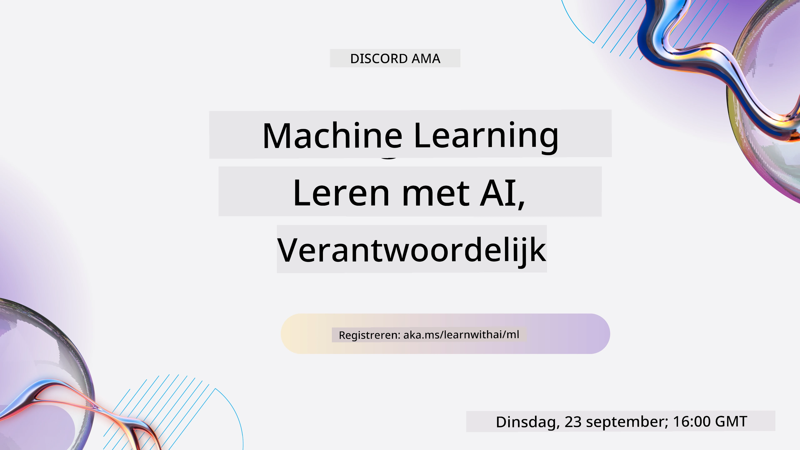
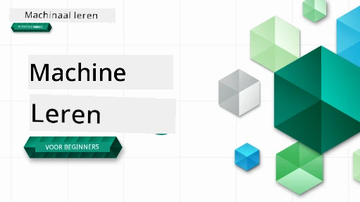

[](https://github.com/microsoft/ML-For-Beginners/blob/master/LICENSE)
[](https://GitHub.com/microsoft/ML-For-Beginners/graphs/contributors/)
[](https://GitHub.com/microsoft/ML-For-Beginners/issues/)
[](https://GitHub.com/microsoft/ML-For-Beginners/pulls/)
[](http://makeapullrequest.com)

[](https://GitHub.com/microsoft/ML-For-Beginners/watchers/)
[](https://GitHub.com/microsoft/ML-For-Beginners/network/)
[](https://GitHub.com/microsoft/ML-For-Beginners/stargazers/)

### 🌐 Meertalige ondersteuning

#### Ondersteund via GitHub Action (Geautomatiseerd & Altijd Up-to-Date)

<!-- CO-OP TRANSLATOR LANGUAGES TABLE START -->
[Arabisch](../ar/README.md) | [Bengaals](../bn/README.md) | [Bulgaars](../bg/README.md) | [Birmees (Myanmar)](../my/README.md) | [Chinees (Vereenvoudigd)](../zh-CN/README.md) | [Chinees (Traditioneel, Hong Kong)](../zh-HK/README.md) | [Chinees (Traditioneel, Macau)](../zh-MO/README.md) | [Chinees (Traditioneel, Taiwan)](../zh-TW/README.md) | [Kroatisch](../hr/README.md) | [Tsjechisch](../cs/README.md) | [Deens](../da/README.md) | [Nederlands](./README.md) | [Ests](../et/README.md) | [Fins](../fi/README.md) | [Frans](../fr/README.md) | [Duits](../de/README.md) | [Grieks](../el/README.md) | [Hebreeuws](../he/README.md) | [Hindi](../hi/README.md) | [Hongaars](../hu/README.md) | [Indonesisch](../id/README.md) | [Italiaans](../it/README.md) | [Japans](../ja/README.md) | [Kannada](../kn/README.md) | [Khmer](../km/README.md) | [Koreaans](../ko/README.md) | [Litouws](../lt/README.md) | [Maleis](../ms/README.md) | [Malayalam](../ml/README.md) | [Marathi](../mr/README.md) | [Nepalees](../ne/README.md) | [Nigeriaans Pidgin](../pcm/README.md) | [Noors](../no/README.md) | [Perzisch (Farsi)](../fa/README.md) | [Pools](../pl/README.md) | [Portugees (Brazilië)](../pt-BR/README.md) | [Portugees (Portugal)](../pt-PT/README.md) | [Punjabi (Gurmukhi)](../pa/README.md) | [Roemeens](../ro/README.md) | [Russisch](../ru/README.md) | [Servisch (Cyrillisch)](../sr/README.md) | [Slowaaks](../sk/README.md) | [Sloveens](../sl/README.md) | [Spaans](../es/README.md) | [Swahili](../sw/README.md) | [Zweeds](../sv/README.md) | [Tagalog (Filipijns)](../tl/README.md) | [Tamil](../ta/README.md) | [Telugu](../te/README.md) | [Thais](../th/README.md) | [Turks](../tr/README.md) | [Oekraïens](../uk/README.md) | [Urdu](../ur/README.md) | [Vietnamees](../vi/README.md)

> **Liever lokaal klonen?**
>
> Deze repository bevat meer dan 50 vertalingen, wat de downloadgrootte aanzienlijk vergroot. Om zonder vertalingen te klonen, gebruik je sparse checkout:
>
> **Bash / macOS / Linux:**
> ```bash
> git clone --filter=blob:none --sparse https://github.com/microsoft/ML-For-Beginners.git
> cd ML-For-Beginners
> git sparse-checkout set --no-cone '/*' '!translations' '!translated_images'
> ```
>
> **CMD (Windows):**
> ```cmd
> git clone --filter=blob:none --sparse https://github.com/microsoft/ML-For-Beginners.git
> cd ML-For-Beginners
> git sparse-checkout set --no-cone "/*" "!translations" "!translated_images"
> ```
>
> Dit geeft je alles wat je nodig hebt om de cursus te voltooien met een veel snellere download.
<!-- CO-OP TRANSLATOR LANGUAGES TABLE END -->

#### Word lid van onze community

[](https://discord.gg/nTYy5BXMWG)

We hebben een lopende Discord-serie 'Leren met AI', leer meer en doe mee bij [Learn with AI Series](https://aka.ms/learnwithai/discord) van 18 - 30 september 2025. Je krijgt tips en trucs over het gebruik van GitHub Copilot voor Data Science.



# Machine Learning voor Beginners - Een Curriculum

> 🌍 Reis de wereld rond terwijl we Machine Learning verkennen via wereldculturen 🌍

Cloud Advocates bij Microsoft bieden een 12-weekse, 26-lessen curriculum over **Machine Learning**. In dit curriculum leer je wat soms **klassieke machine learning** wordt genoemd, waarbij vooral Scikit-learn als bibliotheek wordt gebruikt en diepe leertechnieken worden vermeden, die behandeld worden in ons [AI voor Beginners-curriculum](https://aka.ms/ai4beginners). Combineer deze lessen ook met ons ['Data Science voor Beginners'-curriculum](https://aka.ms/ds4beginners)!

Reis met ons mee de wereld rond terwijl we deze klassieke technieken toepassen op data uit veel gebieden van de wereld. Elke les bevat vooraf- en nabeschouwende quizzes, schriftelijke instructies om de les te voltooien, een oplossing, een opdracht en meer. Onze projectgebaseerde pedagogie laat je leren terwijl je bouwt, een bewezen manier om nieuwe vaardigheden te laten beklijven.

**✍️ Hartelijke dank aan onze auteurs** Jen Looper, Stephen Howell, Francesca Lazzeri, Tomomi Imura, Cassie Breviu, Dmitry Soshnikov, Chris Noring, Anirban Mukherjee, Ornella Altunyan, Ruth Yakubu en Amy Boyd

**🎨 Dank aan onze illustratoren** Tomomi Imura, Dasani Madipalli en Jen Looper

**🙏 Speciale dank 🙏 aan onze Microsoft Student Ambassador auteurs, beoordelaars en contentbijdragers**, met name Rishit Dagli, Muhammad Sakib Khan Inan, Rohan Raj, Alexandru Petrescu, Abhishek Jaiswal, Nawrin Tabassum, Ioan Samuila en Snigdha Agarwal

**🤩 Extra dank aan Microsoft Student Ambassadors Eric Wanjau, Jasleen Sondhi en Vidushi Gupta voor onze R-lessen!**

# Aan de slag

Volg deze stappen:
1. **Fork de repository**: Klik op de knop "Fork" rechtsboven op deze pagina.
2. **Clone de repository**:   `git clone https://github.com/microsoft/ML-For-Beginners.git`

> 💡 **Snelle start tip:** Wil je in een browser beginnen zonder Python lokaal in te stellen? Gebruik [GitHub Codespaces](https://github.com/features/codespaces) om een cloud-ontwikkelomgeving voor je fork te maken. Open het groene **Code** menu, selecteer **Codespaces**, en maak een codespace; installeer de benodigde dependencies van elke les binnen deze omgeving naar behoefte.

> [vind alle aanvullende bronnen voor deze cursus in onze Microsoft Learn-collectie](https://learn.microsoft.com/en-us/collections/qrqzamz1nn2wx3?WT.mc_id=academic-77952-bethanycheum)

> 🔧 **Hulp nodig?** Bekijk onze [Probleemoplossingsgids](TROUBLESHOOTING.md) voor oplossingen van veelvoorkomende problemen met installeren, opzetten en lesuitvoering.


**[Studenten](https://aka.ms/student-page)**, om dit curriculum te gebruiken, fork je de hele repo naar je eigen GitHub-account en maak je de oefeningen alleen of in een groep:

- Begin met een quiz voorafgaand aan de les.
- Lees de les en voltooi de activiteiten, pauzeer en reflecteer bij elke kennisscheck.
- Probeer de projecten te maken door de lessen te begrijpen in plaats van de oplossingcode te gebruiken; die code is echter beschikbaar in de `/solution` mappen bij elke projectgerichte les.
- Maak de quiz na de les.
- Voltooi de challenge.
- Maak de opdracht af.
- Na het voltooien van een lesgroep, bezoek het [Discussieforum](https://github.com/microsoft/ML-For-Beginners/discussions) en "leer hardop" door de relevante PAT-rubriek in te vullen. Een 'PAT' is een voortgangsevaluatie-instrument dat je helpt je leren verder te ontwikkelen. Je kunt ook reageren op andere PAT's zodat we samen kunnen leren.

> Voor verdere studie raden we aan deze [Microsoft Learn](https://docs.microsoft.com/en-us/users/jenlooper-2911/collections/k7o7tg1gp306q4?WT.mc_id=academic-77952-leestott) modules en leerroutes te volgen.

**Docenten**, we hebben [enkele suggesties toegevoegd](for-teachers.md) over het gebruik van dit curriculum.

---

## Video walkthroughs

Sommige lessen zijn beschikbaar als korte video's. Je vindt ze allemaal ingebed in de lessen of op de [ML for Beginners-afspeellijst op het Microsoft Developer YouTube-kanaal](https://aka.ms/ml-beginners-videos) door op de afbeelding hieronder te klikken.

[](https://aka.ms/ml-beginners-videos)

---

## Ontmoet het team

[](https://youtu.be/Tj1XWrDSYJU)

**Gif door** [Mohit Jaisal](https://linkedin.com/in/mohitjaisal)

> 🎥 Klik op de afbeelding hierboven voor een video over het project en de mensen die het hebben gemaakt!

---

## Pedagogiek

We hebben bij het bouwen van dit curriculum twee pedagogische principes gekozen: zorgen dat het praktisch en **projectgebaseerd** is en dat het **frequente quizzes** bevat. Bovendien heeft dit curriculum een gemeenschappelijk **thema** om samenhang te geven.

Door ervoor te zorgen dat de inhoud aansluit bij projecten, wordt het proces boeiender voor studenten en wordt het begrip van concepten versterkt. Daarnaast zet een quiz met lage druk vóór de les de intentie van de student op leren, terwijl een tweede quiz na de les verdere retentie garandeert. Dit curriculum is ontworpen om flexibel en leuk te zijn en kan volledig of gedeeltelijk worden gevolgd. De projecten beginnen klein en worden steeds complexer tegen het einde van de 12-weekse cyclus. Dit curriculum bevat ook een naschrift over toepassingen in de echte wereld van ML, die gebruikt kan worden als extra krediet of als basis voor discussie.

> Vind onze [Gedragscode](CODE_OF_CONDUCT.md), [Bijdragen](CONTRIBUTING.md), [Vertalingen](..) en [Probleemoplossing](TROUBLESHOOTING.md) richtlijnen. Wij verwelkomen je opbouwende feedback!

## Elke les bevat

- optionele schetsnotitie
- optionele aanvullende video
- video walkthrough (alleen sommige lessen)
- [quiz ter voorbereiding op de les](https://ff-quizzes.netlify.app/en/ml/)
- schriftelijke les
- voor projectgebaseerde lessen, stapsgewijze handleidingen om het project te bouwen
- kennisschecks
- een challenge
- aanvullende leesstof
- opdracht
- [quiz na de les](https://ff-quizzes.netlify.app/en/ml/)

> **Een opmerking over talen**: Deze lessen zijn voornamelijk in Python geschreven, maar veel zijn ook beschikbaar in R. Om een R-les te voltooien, ga naar de `/solution` map en zoek naar R-lessen. Ze bevatten een .rmd extensie die staat voor een **R Markdown** bestand, wat eenvoudig gedefinieerd kan worden als een embedding van `code chunks` (van R of andere talen) en een `YAML-header` (die aangeeft hoe outputformaten zoals PDF worden opgemaakt) in een `Markdown-document`. Als zodanig dient het als een uitstekend auteurssysteem voor data science omdat het je toelaat je code, output en gedachten te combineren door deze in Markdown te schrijven. Bovendien kunnen R Markdown-documenten worden omgezet naar outputformaten als PDF, HTML of Word.

> **Een opmerking over quizzes**: Alle quizzes bevinden zich in de [Quiz App map](../../quiz-app), met in totaal 52 quizzes van elk drie vragen. Ze zijn gekoppeld vanuit de lessen, maar de quiz app kan lokaal worden uitgevoerd; volg de instructies in de `quiz-app` map om lokaal te hosten of te publiceren naar Azure.

| Lesnummer |                             Onderwerp                              |                   Lessen Groepering                   | Leerdoelen                                                                                                             |                                                              Gekoppelde Les                                                               |                        Auteur                        |
| :-----------: | :------------------------------------------------------------: | :-------------------------------------------------: | ------------------------------------------------------------------------------------------------------------------------------- | :--------------------------------------------------------------------------------------------------------------------------------------: | :--------------------------------------------------: |
|      01       |                Introductie tot machine learning                |      [Introduction](1-Introduction/README.md)       | Leer de basisconcepten achter machine learning                                                                                |                                             [Lesson](1-Introduction/1-intro-to-ML/README.md)                                             |                       Muhammad                       |
|      02       |                De geschiedenis van machine learning            |      [Introduction](1-Introduction/README.md)       | Leer de geschiedenis achter dit vakgebied                                                                                      |                                            [Lesson](1-Introduction/2-history-of-ML/README.md)                                            |                     Jen en Amy                      |
|      03       |                 Eerlijkheid en machine learning                 |      [Introduction](1-Introduction/README.md)       | Wat zijn de belangrijke filosofische kwesties rond eerlijkheid die studenten moeten overwegen bij het bouwen en toepassen van ML-modellen? |                                              [Lesson](1-Introduction/3-fairness/README.md)                                               |                        Tomomi                        |
|      04       |                Technieken voor machine learning                 |      [Introduction](1-Introduction/README.md)       | Welke technieken gebruiken ML-onderzoekers om ML-modellen te bouwen?                                                           |                                          [Lesson](1-Introduction/4-techniques-of-ML/README.md)                                           |                    Chris en Jen                     |
|      05       |                   Introductie tot regressie                    |        [Regression](2-Regression/README.md)         | Begin met Python en Scikit-learn voor regressiemodellen                                                                       |         [Python](2-Regression/1-Tools/README.md) • [R](../../2-Regression/1-Tools/solution/R/lesson_1.html)         |      Jen • Eric Wanjau       |
|      06       |                Noord-Amerikaanse pompoenprijzen 🎃             |        [Regression](2-Regression/README.md)         | Visualiseer en maak data schoon ter voorbereiding op ML                                                                        |          [Python](2-Regression/2-Data/README.md) • [R](../../2-Regression/2-Data/solution/R/lesson_2.html)          |      Jen • Eric Wanjau       |
|      07       |                Noord-Amerikaanse pompoenprijzen 🎃             |        [Regression](2-Regression/README.md)         | Bouw lineaire en polynomiale regressiemodellen                                                                                |        [Python](2-Regression/3-Linear/README.md) • [R](../../2-Regression/3-Linear/solution/R/lesson_3.html)        |      Jen en Dmitry • Eric Wanjau       |
|      08       |                Noord-Amerikaanse pompoenprijzen 🎃             |        [Regression](2-Regression/README.md)         | Bouw een logistisch regressiemodel                                                                                            |     [Python](2-Regression/4-Logistic/README.md) • [R](../../2-Regression/4-Logistic/solution/R/lesson_4.html)      |      Jen • Eric Wanjau       |
|      09       |                          Een webapp 🔌                          |           [Web App](3-Web-App/README.md)            | Bouw een webapp om je getrainde model te gebruiken                                                                             |                                                 [Python](3-Web-App/1-Web-App/README.md)                                                  |                         Jen                          |
|      10       |                 Introductie tot classificatie                   |    [Classification](4-Classification/README.md)     | Maak je data schoon, bereid het voor en visualiseer; introductie tot classificatie                                             | [Python](4-Classification/1-Introduction/README.md) • [R](../../4-Classification/1-Introduction/solution/R/lesson_10.html)  | Jen en Cassie • Eric Wanjau |
|      11       |             Heerlijke Aziatische en Indiase keukens 🍜          |    [Classification](4-Classification/README.md)     | Introductie tot classifiers                                                                                                     | [Python](4-Classification/2-Classifiers-1/README.md) • [R](../../4-Classification/2-Classifiers-1/solution/R/lesson_11.html) | Jen en Cassie • Eric Wanjau |
|      12       |             Heerlijke Aziatische en Indiase keukens 🍜          |    [Classification](4-Classification/README.md)     | Meer classifiers                                                                                                                | [Python](4-Classification/3-Classifiers-2/README.md) • [R](../../4-Classification/3-Classifiers-2/solution/R/lesson_12.html) | Jen en Cassie • Eric Wanjau |
|      13       |             Heerlijke Aziatische en Indiase keukens 🍜          |    [Classification](4-Classification/README.md)     | Bouw een aanbevelings-webapp met je model                                                                                       |                                              [Python](4-Classification/4-Applied/README.md)                                              |                         Jen                          |
|      14       |                   Introductie tot clustering                     |        [Clustering](5-Clustering/README.md)         | Maak je data schoon, bereid het voor en visualiseer; introductie tot clustering                                                |         [Python](5-Clustering/1-Visualize/README.md) • [R](../../5-Clustering/1-Visualize/solution/R/lesson_14.html)         |      Jen • Eric Wanjau       |
|      15       |              Verkenning van Nigeriaanse muzikale smaken 🎧      |        [Clustering](5-Clustering/README.md)         | Verken de K-Means clusteringmethode                                                                                            |           [Python](5-Clustering/2-K-Means/README.md) • [R](../../5-Clustering/2-K-Means/solution/R/lesson_15.html)           |      Jen • Eric Wanjau       |
|      16       |        Introductie tot natuurlijke taalverwerking ☕️            |   [Natural language processing](6-NLP/README.md)    | Leer de basis van NLP door het bouwen van een eenvoudige bot                                                                   |                                             [Python](6-NLP/1-Introduction-to-NLP/README.md)                                              |                       Stephen                        |
|      17       |                      Veelvoorkomende NLP-taken ☕️               |   [Natural language processing](6-NLP/README.md)    | Verdiep je NLP-kennis door het begrijpen van veelvoorkomende taken bij het omgaan met taalsystemen                              |                                                    [Python](6-NLP/2-Tasks/README.md)                                                     |                       Stephen                        |
|      18       |             Vertaling en sentimentanalyse ♥️                    |   [Natural language processing](6-NLP/README.md)    | Vertaling en sentimentanalyse met Jane Austen                                                                                  |                                            [Python](6-NLP/3-Translation-Sentiment/README.md)                                             |                       Stephen                        |
|      19       |                  Romantische hotels van Europa ♥️               |   [Natural language processing](6-NLP/README.md)    | Sentimentanalyse met hotelrecensies 1                                                                                          |                                               [Python](6-NLP/4-Hotel-Reviews-1/README.md)                                                |                       Stephen                        |
|      20       |                  Romantische hotels van Europa ♥️               |   [Natural language processing](6-NLP/README.md)    | Sentimentanalyse met hotelrecensies 2                                                                                          |                                               [Python](6-NLP/5-Hotel-Reviews-2/README.md)                                                |                       Stephen                        |
|      21       |            Introductie tot tijdreeksvoorspelling               |        [Time series](7-TimeSeries/README.md)        | Introductie tot tijdreeksvoorspelling                                                                                        |                                             [Python](7-TimeSeries/1-Introduction/README.md)                                              |                      Francesca                       |
|      22       | ⚡️ Wereldwijde stroomverbruik ⚡️ - tijdreeksvoorspelling met ARIMA |        [Time series](7-TimeSeries/README.md)        | Tijdreeksvoorspelling met ARIMA                                                                                                 |                                                 [Python](7-TimeSeries/2-ARIMA/README.md)                                                 |                      Francesca                       |
|      23       |  ⚡️ Wereldwijde stroomverbruik ⚡️ - tijdreeksvoorspelling met SVR  |        [Time series](7-TimeSeries/README.md)        | Tijdreeksvoorspelling met Support Vector Regressor                                                                            |                                                  [Python](7-TimeSeries/3-SVR/README.md)                                                  |                       Anirban                        |
|      24       |             Introductie tot versterkend leren                   | [Reinforcement learning](8-Reinforcement/README.md) | Introductie tot versterkend leren met Q-Learning                                                                               |                                             [Python](8-Reinforcement/1-QLearning/README.md)                                              |                        Dmitry                        |
|      25       |                 Help Peter de wolf te vermijden! 🐺            | [Reinforcement learning](8-Reinforcement/README.md) | Reinforcement learning Gym                                                                                                     |                                                [Python](8-Reinforcement/2-Gym/README.md)                                                 |                        Dmitry                        |
|  Naschrift   |            Praktijkvoorbeelden en toepassingen van ML           |      [ML in the Wild](9-Real-World/README.md)       | Interessante en onthullende toepassingen uit de praktijk van klassieke ML                                                       |                                             [Lesson](9-Real-World/1-Applications/README.md)                                              |                         Team                         |
|  Naschrift   |            Modeldebugging in ML met behulp van de RAI-dashboard            |      [ML in the Wild](9-Real-World/README.md)       | Modeldebugging in Machine Learning met Responsible AI dashboardcomponenten                                                     |                                             [Lesson](9-Real-World/2-Debugging-ML-Models/README.md)                                              |                     Ruth Yakubu                      |

> [vind alle aanvullende bronnen voor deze cursus in onze Microsoft Learn-collectie](https://learn.microsoft.com/en-us/collections/qrqzamz1nn2wx3?WT.mc_id=academic-77952-bethanycheum)

## Offline toegang

Je kunt deze documentatie offline gebruiken met [Docsify](https://docsify.js.org/#/). Fork deze repo, [installeer Docsify](https://docsify.js.org/#/quickstart) op je lokale machine, en typ dan in de hoofdmap van deze repo `docsify serve`. De website wordt geserveerd op poort 3000 op je localhost: `localhost:3000`.

## PDF’s

Vind een pdf van het curriculum met links [hier](https://microsoft.github.io/ML-For-Beginners/pdf/readme.pdf).


## 🎒 Andere cursussen 

Ons team maakt ook andere cursussen! Bekijk:

<!-- CO-OP TRANSLATOR OTHER COURSES START -->
### LangChain
[](https://aka.ms/langchain4j-for-beginners)
[](https://aka.ms/langchainjs-for-beginners?WT.mc_id=m365-94501-dwahlin)
[](https://github.com/microsoft/langchain-for-beginners?WT.mc_id=m365-94501-dwahlin)
---

### Azure / Edge / MCP / Agents
[](https://github.com/microsoft/AZD-for-beginners?WT.mc_id=academic-105485-koreyst)
[](https://github.com/microsoft/edgeai-for-beginners?WT.mc_id=academic-105485-koreyst)
[](https://github.com/microsoft/mcp-for-beginners?WT.mc_id=academic-105485-koreyst)
[](https://github.com/microsoft/ai-agents-for-beginners?WT.mc_id=academic-105485-koreyst)

---
 
### Generative AI-serie
[](https://github.com/microsoft/generative-ai-for-beginners?WT.mc_id=academic-105485-koreyst)
[-9333EA?style=for-the-badge&labelColor=E5E7EB&color=9333EA)](https://github.com/microsoft/Generative-AI-for-beginners-dotnet?WT.mc_id=academic-105485-koreyst)
[-C084FC?style=for-the-badge&labelColor=E5E7EB&color=C084FC)](https://github.com/microsoft/generative-ai-for-beginners-java?WT.mc_id=academic-105485-koreyst)
[-E879F9?style=for-the-badge&labelColor=E5E7EB&color=E879F9)](https://github.com/microsoft/generative-ai-with-javascript?WT.mc_id=academic-105485-koreyst)

---
 
### Kernleren
[](https://aka.ms/ml-beginners?WT.mc_id=academic-105485-koreyst)
[](https://aka.ms/datascience-beginners?WT.mc_id=academic-105485-koreyst)
[](https://aka.ms/ai-beginners?WT.mc_id=academic-105485-koreyst)
[](https://github.com/microsoft/Security-101?WT.mc_id=academic-96948-sayoung)
[](https://aka.ms/webdev-beginners?WT.mc_id=academic-105485-koreyst)
[](https://aka.ms/iot-beginners?WT.mc_id=academic-105485-koreyst)
[](https://github.com/microsoft/xr-development-for-beginners?WT.mc_id=academic-105485-koreyst)

---
 
### Copilot-serie
[](https://aka.ms/GitHubCopilotAI?WT.mc_id=academic-105485-koreyst)
[](https://github.com/microsoft/mastering-github-copilot-for-dotnet-csharp-developers?WT.mc_id=academic-105485-koreyst)
[](https://github.com/microsoft/CopilotAdventures?WT.mc_id=academic-105485-koreyst)
<!-- CO-OP TRANSLATOR OTHER COURSES END -->

## Hulp krijgen

Als je vastloopt of vragen hebt tijdens het leren van Machine Learning of het bouwen van AI-toepassingen, geen zorgen — er is hulp beschikbaar.

Je kunt deelnemen aan discussies met andere lerenden en ontwikkelaars, vragen stellen en je ideeën delen met de community.

- Word lid van de community om vragen te stellen en samen te leren
- Bespreek Machine Learning concepten en projectideeën
- Krijg begeleiding van ervaren ontwikkelaars

Een ondersteunende community is een geweldige manier om je vaardigheden te verbeteren en problemen sneller op te lossen.

[Microsoft Foundry Discord-community](https://discord.gg/nTYy5BXMWG)

Als je bugs, fouten tegenkomt of suggesties hebt voor verbeteringen, kun je ook een **Issue** openen in deze repository om het probleem te melden.

Voor productfeedback of om bestaande communityposts te doorzoeken, bezoek het Developer Forum:

[](https://aka.ms/foundry/forum)

## Extra leertips

- Bekijk notitieboeken na elke les voor beter begrip.
- Oefen met het zelf implementeren van algoritmen.
- Verken echte datasets met de geleerde concepten.

---

<!-- CO-OP TRANSLATOR DISCLAIMER START -->
**Disclaimer**:
Dit document is vertaald met behulp van de AI vertaaldienst [Co-op Translator](https://github.com/Azure/co-op-translator). Hoewel we streven naar nauwkeurigheid, dient u er rekening mee te houden dat geautomatiseerde vertalingen fouten of onnauwkeurigheden kunnen bevatten. Het originele document in de oorspronkelijke taal moet worden beschouwd als de gezaghebbende bron. Voor kritieke informatie wordt professionele menselijke vertaling aanbevolen. Wij zijn niet aansprakelijk voor eventuele misverstanden of verkeerde interpretaties die voortvloeien uit het gebruik van deze vertaling.
<!-- CO-OP TRANSLATOR DISCLAIMER END -->