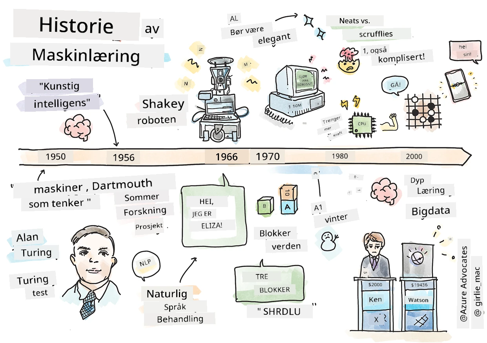
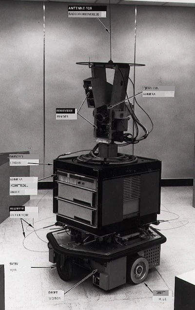
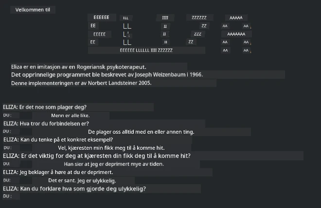

# Historien om maskinlæring

> Sketchnote av [Tomomi Imura](https://www.twitter.com/girlie_mac)

## [Quiz før forelesning](https://ff-quizzes.netlify.app/en/ml/)

---

> 🎥 Klikk på bildet ovenfor for en kort video som går gjennom denne leksjonen.

I denne leksjonen skal vi gå gjennom de viktigste milepælene i historien om maskinlæring og kunstig intelligens.

Historien om kunstig intelligens (AI) som fagområde er sammenvevd med historien om maskinlæring, ettersom algoritmene og de beregningsmessige fremskrittene som ligger til grunn for ML bidro til utviklingen av AI. Det er nyttig å huske at mens disse feltene som egne undersøkelsesområder begynte å krystallisere seg på 1950-tallet, forutgikk og overlappet viktige [algoritmiske, statistiske, matematiske, beregningsmessige og tekniske oppdagelser](https://wikipedia.org/wiki/Timeline_of_machine_learning) denne epoken. Faktisk har folk tenkt på disse spørsmålene i [hundrevis av år](https://wikipedia.org/wiki/History_of_artificial_intelligence): denne artikkelen diskuterer de historiske intellektuelle grunnlagene for ideen om en 'tenkende maskin.'

---
## Viktige oppdagelser

- 1763, 1812 [Betinget sannsynlighetsteorem](https://wikipedia.org/wiki/Bayes%27_theorem) og dets forgjengere. Dette teoremet og dets anvendelser ligger til grunn for inferens, og beskriver sannsynligheten for at en hendelse inntreffer basert på tidligere kunnskap.
- 1805 [Minste kvadraters metode](https://wikipedia.org/wiki/Least_squares) av den franske matematikeren Adrien-Marie Legendre. Denne metoden, som du vil lære om i vår regressjonsenhet, hjelper til med passform av data.
- 1913 [Markov-kjeder](https://wikipedia.org/wiki/Markov_chain), oppkalt etter den russiske matematikeren Andrey Markov, brukes til å beskrive en sekvens av mulige hendelser basert på en tidligere tilstand.
- 1957 [Perceptron](https://wikipedia.org/wiki/Perceptron) er en type lineær klassifikator oppfunnet av den amerikanske psykologen Frank Rosenblatt som ligger til grunn for fremskritt innen dyp læring.

---

- 1967 [Nærmeste nabo](https://wikipedia.org/wiki/Nearest_neighbor) er en algoritme opprinnelig utformet for kartlegging av ruter. I en ML-kontekst brukes den for å oppdage mønstre.
- 1970 [Tilbakepropagering](https://wikipedia.org/wiki/Backpropagation) brukes til å trene [feedforward nevrale nettverk](https://wikipedia.org/wiki/Feedforward_neural_network).
- 1982 [Rekurrente nevrale nettverk](https://wikipedia.org/wiki/Recurrent_neural_network) er kunstige nevrale nettverk avledet fra feedforward nevrale nettverk som skaper tidsmessige grafer.

✅ Gjør litt research. Hvilke andre datoer skiller seg ut som avgjørende i historien om ML og AI?

---
## 1950: Maskiner som tenker

Alan Turing, en virkelig bemerkelsesverdig person som ble kåret [av offentligheten i 2019](https://wikipedia.org/wiki/Icons:_The_Greatest_Person_of_the_20th_Century) til århundrets fremste vitenskapsmann, krediteres for å ha bidratt til grunnlaget for konseptet 'maskin som kan tenke.' Han kjempet mot motstandere og sitt eget behov for empirisk bevis for dette konseptet delvis ved å skape [Turing-testen](https://www.bbc.com/news/technology-18475646), som du vil utforske i våre NLP-leksjoner.

---
## 1956: Dartmouth sommerforskningsprosjekt

"Dartmouth sommerforskningsprosjekt om kunstig intelligens var en banebrytende begivenhet for kunstig intelligens som fagfelt," og det var her begrepet 'kunstig intelligens' ble myntet ([kilde](https://250.dartmouth.edu/highlights/artificial-intelligence-ai-coined-dartmouth)).

> Hvert aspekt av læring eller enhver annen egenskap ved intelligens kan i prinsippet beskrives så nøyaktig at en maskin kan lages for å simulere det.

---

Hovedforskeren, matematikprofessor John McCarthy, håpet "å gå videre på grunnlag av antakelsen om at hvert aspekt ved læring eller enhver annen egenskap ved intelligens i prinsippet kan beskrives så nøyaktig at en maskin kan lages for å simulere det." Deltakerne inkluderte en annen fremtredende skikkelse innen feltet, Marvin Minsky.

Verkstedet krediteres for å ha igangsatt og oppmuntret flere diskusjoner, inkludert "fremveksten av symbolske metoder, systemer fokusert på begrensede domener (tidlige ekspertsystemer), og deduktive systemer vs. induktive systemer." ([kilde](https://wikipedia.org/wiki/Dartmouth_workshop)).

---
## 1956 - 1974: "De gyldne årene"

Fra 1950-tallet til midten av 1970-tallet var optimismen høy med håp om at AI kunne løse mange problemer. I 1967 uttalte Marvin Minsky selvsikkert: "Innen en generasjon ... vil problemet med å skape 'kunstig intelligens' i stor grad være løst." (Minsky, Marvin (1967), Computation: Finite and Infinite Machines, Englewood Cliffs, N.J.: Prentice-Hall)

Forskning innen naturlig språkprosessering blomstret, søk ble raffinert og gjort mer kraftfullt, og konseptet 'mikroverdener' ble skapt, hvor enkle oppgaver ble fullført ved hjelp av enkle språkkommandoer.

---

Forskningen var godt finansiert av offentlige etater, det ble gjort fremskritt innen beregning og algoritmer, og prototyper av intelligente maskiner ble bygget. Noen av disse maskinene inkluderer:

* [Shakey roboten](https://wikipedia.org/wiki/Shakey_the_robot), som kunne manøvrere og avgjøre hvordan oppgaver skulle utføres 'intelligent'.

    
    > Shakey i 1972

---

* Eliza, en tidlig 'chatterbot', kunne føre samtaler med folk og fungere som en primitiv 'terapeut'. Du vil lære mer om Eliza i NLP-leksjonene.

    
    > En versjon av Eliza, en chatbot

---

* "Blocks world" var et eksempel på en mikroverden hvor klosser kunne stables og sorteres, og eksperimenter med å lære maskiner å ta beslutninger kunne testes. Fremskritt bygget med biblioteker som [SHRDLU](https://wikipedia.org/wiki/SHRDLU) hjalp med å drive språkprosessering fremover.

    

    > 🎥 Klikk på bildet ovenfor for en video: Blocks world med SHRDLU

---
## 1974 - 1980: "AI-vinteren"

Rundt midten av 1970-tallet ble det klart at kompleksiteten med å lage 'intelligente maskiner' hadde blitt undervurdert og at løftene, gitt den tilgjengelige regnekraften, var overdrevet. Finansieringen tørket ut og tilliten til feltet sank. Noen av problemene som påvirket tilliten inkluderte:
---
- **Begrensninger**. Beregningskraften var for begrenset.
- **Kombinatorisk eksplosjon**. Mengden parametere som måtte trenes økte eksponentielt ettersom mer ble krevd av datamaskiner, uten en parallell utvikling i regnekraft og kapabilitet.
- **Mangel på data**. Det var mangel på data som hindret prosessen med å teste, utvikle og forbedre algoritmer.
- **Spør vi de riktige spørsmålene?**. Selve spørsmålene som ble stilt begynte å bli stilt spørsmål ved. Forskere begynte å motta kritikk for sine tilnærminger:
  - Turing-testene ble betvilt ved hjelp av blant annet 'kinesiske rom-teorien' som postulerte at, "programmering av en digital datamaskin kan få den til å framstå som om den forstår språk, men kan ikke produsere ekte forståelse." ([kilde](https://plato.stanford.edu/entries/chinese-room/))
  - Etikken ved å introdusere kunstige intelligenser som 'terapeuten' ELIZA i samfunnet ble utfordret.

---

Samtidig begynte ulike AI-skoler å dannes. En dikotomi ble etablert mellom ["rotete" vs. "ryddig AI"](https://wikipedia.org/wiki/Neats_and_scruffies) praksiser. _Rotete_ laboratorier finjusterte programmer i timevis til de oppnådde ønskede resultater. _Ryddige_ laboratorier "fokuserte på logikk og formell problemløsning". ELIZA og SHRDLU var kjente _rotete_ systemer. På 1980-tallet, da etterspørselen etter reproducerbare ML-systemer vokste, tok _ryddig_ tilnærming gradvis over siden resultatene er mer forklarbare.

---
## 1980-tallet Ekspertsystemer

Etter hvert som feltet vokste, ble det tydeligere hva fordelene for næringslivet var, og på 1980-tallet ble også spredningen av 'ekspertsystemer' tydelig. "Ekspertsystemer var blant de første virkelig vellykkede formene for kunstig intelligens (AI) programvare." ([kilde](https://wikipedia.org/wiki/Expert_system)).

Denne typen system er faktisk _hybrid_, bestående delvis av en reglermotor som definerer forretningskrav, og en inferensmotor som brukte regelsystemet for å utlede nye fakta.

Denne epoken så også økende fokus på nevrale nettverk.

---
## 1987 - 1993: AI ‘Chill’

Spredningen av spesialisert eksperthardware hadde den ulykkelige effekten av å bli for spesialisert. Fremveksten av personlige datamaskiner konkurrerte også med disse store, spesialiserte, sentraliserte systemene. Demokratiseringen av databehandling hadde begynt, og den la til slutt grunnlaget for den moderne eksplosjonen av store datamengder.

---
## 1993 - 2011

Denne epoken så en ny æra for ML og AI som kunne løse noen av problemene som tidligere var forårsaket av mangel på data og regnekraft. Mengden data begynte å øke raskt og bli mer vidt tilgjengelig, for bedre og verre, særlig med fremveksten av smarttelefonen rundt 2007. Regnekraften vokste eksponentielt, og algoritmene utviklet seg parallelt. Feltet begynte å modne ettersom de frie dagene fra tidligere begynte å krystallisere seg til en ekte disiplin.

---
## Nå

I dag berører maskinlæring og AI nesten alle deler av livene våre. Denne epoken krever nøye forståelse av risikene og potensielle effekter disse algoritmene har på menneskeliv. Som Microsofts Brad Smith har uttalt, "Informasjonsteknologi reiser spørsmål som går til kjernen av grunnleggende menneskerettighetsbeskyttelser som personvern og ytringsfrihet. Disse spørsmålene øker ansvaret for teknologiselskaper som skaper disse produktene. Etter vår mening krever de også gjennomtenkt regulering fra myndigheter og utvikling av normer rundt akseptabel bruk" ([kilde](https://www.technologyreview.com/2019/12/18/102365/the-future-of-ais-impact-on-society/)).

---

Det gjenstår å se hva framtiden bringer, men det er viktig å forstå disse datasystemene og programvaren og algoritmene som driver dem. Vi håper at denne læreplanen vil hjelpe deg å få bedre forståelse slik at du kan ta dine egne valg.

> 🎥 Klikk på bildet ovenfor for en video: Yann LeCun diskuterer historien om dyp læring i denne forelesningen

---
## 🚀Utfordring

Grav i ett av disse historiske øyeblikkene og lær mer om menneskene bak dem. Det finnes fascinerende karakterer, og ingen vitenskapelig oppdagelse har noensinne blitt skapt i et kulturelt vakuum. Hva oppdager du?

## [Quiz etter forelesning](https://ff-quizzes.netlify.app/en/ml/)

---
## Gjennomgang & Selvstudium

Her er elementer å se og høre på:

[Denne podcasten hvor Amy Boyd diskuterer utviklingen av AI](http://runasradio.com/Shows/Show/739)

---

## Oppgave

[Lag en tidslinje](assignment.md)

---

<!-- CO-OP TRANSLATOR DISCLAIMER START -->
**Ansvarsfraskrivelse**:
Dette dokumentet er oversatt ved hjelp av AI-oversettelsestjenesten [Co-op Translator](https://github.com/Azure/co-op-translator). Selv om vi streber etter nøyaktighet, vær oppmerksom på at automatiske oversettelser kan inneholde feil eller unøyaktigheter. Det opprinnelige dokumentet på originalspråket skal betraktes som den autoritative kilden. For kritisk informasjon anbefales profesjonell menneskelig oversettelse. Vi er ikke ansvarlige for eventuelle misforståelser eller feiltolkninger som oppstår ved bruk av denne oversettelsen.
<!-- CO-OP TRANSLATOR DISCLAIMER END -->