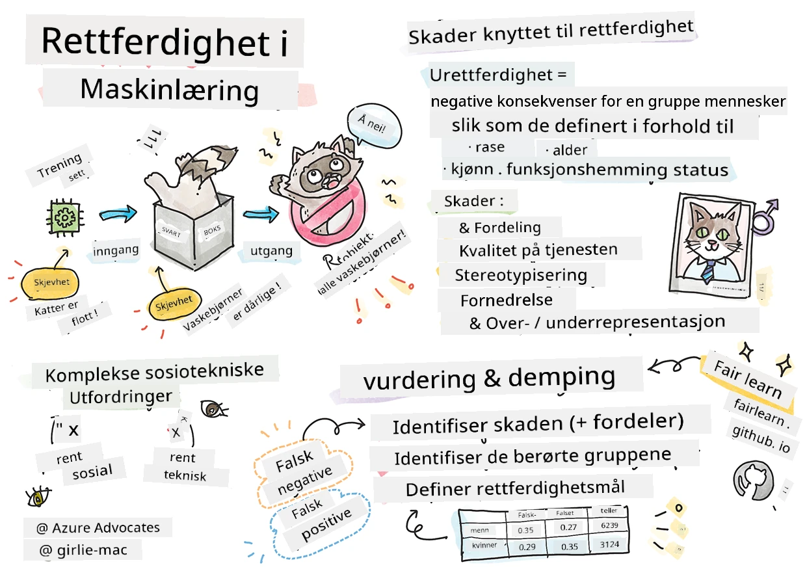
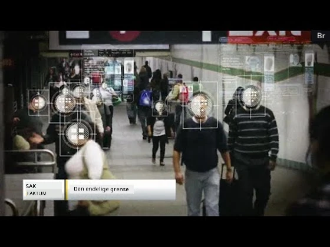

# Bygge maskinlæringsløsninger med ansvarlig KI
 

> Sketchnote av [Tomomi Imura](https://www.twitter.com/girlie_mac)

## [Quiz før forelesningen](https://ff-quizzes.netlify.app/en/ml/)
 
## Introduksjon

I dette pensumet vil du begynne å oppdage hvordan maskinlæring kan og påvirker vårt dagligliv. Allerede nå er systemer og modeller involvert i daglige beslutningsoppgaver, som helseforebyggende diagnoser, lånbehandling eller oppdagelse av svindel. Derfor er det viktig at disse modellene fungerer godt for å gi pålitelige resultater. Som med enhver programvareapplikasjon vil KI-systemer kunne skuffe eller gi uønskede resultater. Derfor er det essensielt å kunne forstå og forklare oppførselen til en KI-modell.

Tenk på hva som kan skje når dataene du bruker til å bygge disse modellene mangler visse demografiske grupper, som rase, kjønn, politisk syn, religion, eller overrepresenterer slike grupper. Hva skjer når modellens output tolkes som favorisering av en demografisk gruppe? Hva er konsekvensen for applikasjonen? I tillegg, hva skjer når modellen gir et uheldig utfall og skader mennesker? Hvem har ansvaret for KI-systemenes oppførsel? Dette er noen av spørsmålene vi vil utforske i dette pensumet.

I denne leksjonen vil du:

- Øke bevisstheten om viktigheten av rettferdighet i maskinlæring og skader knyttet til rettferdighet.
- Bli kjent med praksisen med å utforske avvik og uvanlige scenarioer for å sikre pålitelighet og sikkerhet.
- Få forståelse for behovet for å styrke alle ved å designe inkluderende systemer.
- Utforske hvor viktig det er å beskytte personvern og sikkerhet for data og mennesker.
- Se viktigheten av en «glassboks»-tilnærming for å forklare oppførselen til KI-modeller.
- Være bevisst på hvordan ansvarlighet er essensielt for å bygge tillit til KI-systemer.

## Forutsetninger

Som en forutsetning, vennligst følg læringsstien "Ansvarlige prinsipper for KI" og se videoen nedenfor om temaet:

Lær mer om ansvarlig KI ved å følge denne [Læringsstien](https://docs.microsoft.com/learn/modules/responsible-ai-principles/?WT.mc_id=academic-77952-leestott)

> 🎥 Klikk på bildet over for en video: Microsofts tilnærming til ansvarlig KI

## Rettferdighet

KI-systemer bør behandle alle rettferdig og unngå å påvirke like grupper av mennesker på forskjellige måter. For eksempel, når KI-systemer gir veiledning om medisinsk behandling, lånesøknader eller ansettelse, bør de gi de samme anbefalingene til alle med lignende symptomer, økonomiske situasjon eller faglige kvalifikasjoner. Hver og en av oss bærer med oss arvede skjevheter som påvirker våre beslutninger og handlinger. Disse skjevhetene kan være synlige i dataene vi bruker til å trene KI-systemer. Slike skjevheter kan noen ganger oppstå utilsiktet. Det er ofte vanskelig bevisst å vite når man introduserer skjevhet i data.

**«Urettferdighet»** omfatter negative konsekvenser, eller «skader», for en gruppe mennesker, slik som de definert ut ifra rase, kjønn, alder eller funksjonshemming. Hovedtyper av skader knyttet til rettferdighet kan klassifiseres som:

- **Fordeling**, hvis for eksempel kjønn eller etnisitet favoriseres fremfor en annen.
- **Kvalitet på tjenesten**. Hvis dataene er trent for én spesifikk situasjon, men virkeligheten er mye mer kompleks, fører det til en dårlig tjeneste. For eksempel, en håndsåpedispenser som ikke kunne registrere personer med mørk hud. [Referanse](https://gizmodo.com/why-cant-this-soap-dispenser-identify-dark-skin-1797931773)
- **Fordømmelse**. Å urettferdig kritisere og merke noe eller noen. For eksempel etiketterte en bildeteknologi beryktet bilder av mørkhudede personer som gorillaer.
- **Over- eller underrepresentasjon**. Tanken er at en viss gruppe ikke sees i et yrke, og enhver tjeneste eller funksjon som opprettholder dette, bidrar til skade.
- **Stereotypier**. Å knytte en gitt gruppe til forhåndstildelte kjennetegn. For eksempel kan en språköversettelsestjeneste mellom engelsk og tyrkisk ha unøyaktigheter på grunn av ord med stereotype kjønnsforeninger.

> oversettelse til tyrkisk

> oversettelse tilbake til engelsk

Når vi designer og tester KI-systemer, må vi sikre at KI er rettferdig og ikke programmert til å ta skjeve eller diskriminerende beslutninger, som også mennesker er forbudt å gjøre. Å garantere rettferdighet i KI og maskinlæring forblir en kompleks sosioteknisk utfordring.

### Pålitelighet og sikkerhet

For å bygge tillit må KI-systemene være pålitelige, sikre og konsistente under normale og uventede forhold. Det er viktig å vite hvordan KI-systemer vil oppføre seg i ulike situasjoner, spesielt når det gjelder avvik. Når man bygger KI-løsninger, må det legges betydelig fokus på hvordan man håndterer et bredt spekter av omstendigheter som KI-løsningene kan møte. For eksempel må en selvkjørende bil sette menneskers sikkerhet som høyeste prioritet. Som et resultat må KI som driver bilen vurdere alle mulige scenarioer som bilen kan møte, som natt, tordenvær eller snøstormer, barn som løper over gaten, kjæledyr, veiarbeid osv. Hvor godt et KI-system kan håndtere et bredt spekter av forhold pålitelig og trygt reflekterer hvor godt datavitenskapsmannen eller utvikleren har forutsett dette under design eller testing av systemet.

> [🎥 Klikk her for en video: ](https://www.microsoft.com/videoplayer/embed/RE4vvIl)

### Inkludering

KI-systemer bør designes for å engasjere og styrke alle. Når datavitenskapsfolk og KI-utviklere designer og implementerer KI-systemer, identifiserer og adresserer de potensielle barrierer i systemet som utilsiktet kan utelukke mennesker. For eksempel er det 1 milliard mennesker med funksjonshemninger i verden. Med fremskritt innen KI kan de lettere få tilgang til et bredt spekter av informasjon og muligheter i hverdagen. Ved å adressere barrierene skapes muligheter for å innovere og utvikle KI-produkter med bedre opplevelser som gagner alle.

> [🎥 Klikk her for en video: inkludering i KI](https://www.microsoft.com/videoplayer/embed/RE4vl9v)

### Sikkerhet og personvern

KI-systemer bør være trygge og respektere menneskers personvern. Folk har mindre tillit til systemer som setter deres personvern, informasjon eller liv i fare. Når vi trener maskinlæringsmodeller, er vi avhengige av data for å produsere de beste resultatene. I så måte må datakildens opprinnelse og integritet vurderes. For eksempel, var dataene brukersendte eller offentlig tilgjengelige? Videre, under arbeid med data, er det avgjørende å utvikle KI-systemer som kan beskytte konfidensiell informasjon og motstå angrep. Etter hvert som KI blir mer utbredt, blir det stadig viktigere og mer komplekst å beskytte personvern og sikre viktige personlige og forretningsmessige opplysninger. Personvern og datasikkerhet krever spesielt nøye oppmerksomhet for KI fordi tilgang til data er essensielt for at KI-systemer kan lage nøyaktige og informerte prediksjoner og beslutninger om mennesker.

> [🎥 Klikk her for en video: sikkerhet i KI](https://www.microsoft.com/videoplayer/embed/RE4voJF)

- Som bransje har vi gjort betydelige fremskritt innen personvern og sikkerhet, drevet i stor grad av regelverk som GDPR (General Data Protection Regulation).
- Likevel må vi med KI-systemer erkjenne spenningen mellom behovet for mer personlig data for å gjøre systemene mer personlige og effektive – og personvern.
- Akkurat som med internettets fødsel og kobling av datamaskiner, ser vi en stor økning i sikkerhetsutfordringer knyttet til KI.
- Samtidig har vi sett at KI brukes til å forbedre sikkerheten. For eksempel drives de fleste moderne antivirus-skannere i dag av KI-heuristikker.
- Vi må sikre at våre datavitenskapsprosesser harmonerer med de nyeste praksisene for personvern og sikkerhet.

### Åpenhet
KI-systemer bør være forståelige. En avgjørende del av transparens er å forklare oppførselen til KI-systemer og deres komponenter. For å bedre forståelsen av KI-systemer må interessenter forstå hvordan og hvorfor de fungerer slik, slik at de kan identifisere potensielle ytelsesproblemer, sikkerhets- og personvernbekymringer, skjevheter, ekskluderende praksiser eller utilsiktede konsekvenser. Vi mener også at de som bruker KI-systemer bør være ærlige og åpne om når, hvorfor og hvordan de velger å sette dem i drift, samt systemenes begrensninger. For eksempel, hvis en bank bruker et KI-system for å støtte sine beslutninger om forbrukerlån, er det viktig å undersøke resultatene og forstå hvilke data som påvirker systemets anbefalinger. Regjeringer begynner å regulere KI på tvers av bransjer, så datavitenskapsfolk og organisasjoner må forklare om et KI-system oppfyller regulatoriske krav, spesielt ved uønskede utfall.

> [🎥 Klikk her for en video: åpenhet i KI](https://www.microsoft.com/videoplayer/embed/RE4voJF)

- Fordi KI-systemer er så komplekse, er det vanskelig å forstå hvordan de fungerer og tolke resultatene.
- Denne mangelen på forståelse påvirker hvordan disse systemene styres, operasjonaliseres og dokumenteres.
- Enda viktigere påvirker denne mangelen på forståelse beslutningene som tas basert på resultatene disse systemene produserer.

### Ansvarlighet
 
Personene som designer og setter i drift KI-systemer må være ansvarlige for hvordan systemene opererer. Behovet for ansvarlighet er spesielt viktig ved sensitive teknologier som ansiktsgjenkjenning. Nylig har det vært økende etterspørsel etter ansiktsgjenkjenningsteknologi, spesielt fra politiorganisasjoner som ser teknologien som nyttig for å finne savnede barn. Men disse teknologiene kan potensielt brukes av en regjering til å sette innbyggernes grunnleggende friheter i fare, for eksempel ved å muliggjøre kontinuerlig overvåkning av spesifikke individer. Derfor må datavitenskapsfolk og organisasjoner ta ansvar for hvordan deres KI-system påvirker individer eller samfunnet.

> 🎥 Klikk på bildet over for en video: Advarsler om masseovervåkning gjennom ansiktsgjenkjenning 

Til syvende og sist er et av de største spørsmålene for vår generasjon, som den første generasjonen som bringer KI ut i samfunnet, hvordan sikre at datamaskiner forblir ansvarlige overfor mennesker og hvordan sikre at de som designer datamaskiner forblir ansvarlige overfor alle andre.

## Konsekvensvurdering

Før man trener en maskinlæringsmodell, er det viktig å utføre en konsekvensvurdering for å forstå formålet med KI-systemet; hva den tiltenkte bruken er; hvor det skal tas i bruk; og hvem som skal interagere med systemet. Dette er nyttig for evaluatorer eller testere som skal gjennomgå systemet for å vite hvilke faktorer de må ta hensyn til når de identifiserer potensielle risikoer og forventede konsekvenser.

Følgende områder bør fokuseres på ved gjennomføring av en konsekvensvurdering:

* **Advers effekt på enkeltpersoner**. Å være bevisst eventuelle restriksjoner eller krav, uoffisiell bruk eller kjente begrensninger som hindrer systemets ytelse, er avgjørende for å sikre at systemet ikke brukes på en måte som kan skade personer.
* **Datakrav**. Å forstå hvordan og hvor systemet vil bruke data gir evaluatorer mulighet til å utforske eventuelle datakrav du må være oppmerksom på (f.eks. GDPR eller HIPAA). Videre bør det undersøkes om datakilden eller mengden data er tilstrekkelig for trening.
* **Sammendrag av konsekvenser**. Lag en liste over potensielle skader som kan oppstå ved bruk av systemet. Gjennom ML-livssyklusen bør det vurderes om de identifiserte problemene er mitigert eller adressert.
* **Gjeldende mål** for hver av de seks kjerneprinsippene. Vurder om målene for hvert prinsipp er oppnådd og om det er eventuelle gap.

## Feilsøking med ansvarlig KI

På samme måte som ved feilsøking i en programvareapplikasjon, er feilsøking av et KI-system en nødvendig prosess for å identifisere og løse problemer i systemet. Mange faktorer kan påvirke at en modell ikke presterer som forventet eller ansvarlig. De fleste tradisjonelle modellprestasjon-målinger er kvantitative aggregater av modellens ytelse, noe som ikke er tilstrekkelig til å analysere hvordan en modell bryter de ansvarlige KI-prinsippene. Dessuten er en maskinlæringsmodell en svart boks som gjør det vanskelig å forstå hva som driver utfallet eller gi forklaring når den gjør en feil. Senere i dette kurset vil vi lære hvordan vi kan bruke Ansvarlig KI-dashbordet for å hjelpe med feilsøking av KI-systemer. Dashbordet gir et helhetlig verktøy for datavitenskapsfolk og KI-utviklere for å utføre:

* **Feilanalyse**. For å identifisere feildistribusjonen til modellen som kan påvirke systemets rettferdighet eller pålitelighet.
* **Modelloversikt**. For å oppdage hvor det finnes forskjeller i modellens ytelse på tvers av datakohorter.
* **Dataanalyse**. For å forstå datadistribusjonen og identifisere potensiell skjevhet i data som kan føre til problemer med rettferdighet, inkludering og pålitelighet.
* **Modellforklarbarhet**. For å forstå hva som påvirker eller innvirker på modellens prediksjoner. Dette hjelper med å forklare modellens oppførsel, noe som er viktig for åpenhet og ansvarlighet.

## 🚀 Utfordring
 
For å forhindre at skader oppstår i utgangspunktet, bør vi:

- ha mangfold i bakgrunn og perspektiver blant de som jobber med systemer
- investere i datasett som reflekterer mangfoldet i samfunnet vårt
- utvikle bedre metoder gjennom hele maskinlæringslivssyklusen for å oppdage og rette opp i ansvarlig KI når det oppstår

Tenk på reelle scenarioer der en modells upålitelighet er tydelig i modellbygging og bruk. Hva mer bør vi vurdere?

## [Quiz etter forelesningen](https://ff-quizzes.netlify.app/en/ml/)

## Gjennomgang & Selvstudium
 

I denne leksjonen har du lært noen grunnleggende begreper om rettferdighet og urettferdighet i maskinlæring.  
 
Se denne workshopen for å fordype deg i temaene: 

- I jakten på ansvarlig AI: Å bringe prinsipper til praksis av Besmira Nushi, Mehrnoosh Sameki og Amit Sharma

> 🎥 Klikk på bildet over for en video: RAI Toolbox: Et åpen kildekode-rammeverk for bygging av ansvarlig AI av Besmira Nushi, Mehrnoosh Sameki og Amit Sharma

Les også: 

- Microsofts RAI ressurs senter: [Responsible AI Resources – Microsoft AI](https://www.microsoft.com/ai/responsible-ai-resources?activetab=pivot1%3aprimaryr4) 

- Microsofts FATE forskningsgruppe: [FATE: Fairness, Accountability, Transparency, and Ethics in AI - Microsoft Research](https://www.microsoft.com/research/theme/fate/) 

RAI Toolbox: 

- [Responsible AI Toolbox GitHub-repositorium](https://github.com/microsoft/responsible-ai-toolbox)

Les om Azure Machine Learnings verktøy for å sikre rettferdighet:

- [Azure Machine Learning](https://docs.microsoft.com/azure/machine-learning/concept-fairness-ml?WT.mc_id=academic-77952-leestott) 

## Oppgave

[Utforsk RAI Toolbox](assignment.md)

---

<!-- CO-OP TRANSLATOR DISCLAIMER START -->
**Ansvarsfraskrivelse**:
Dette dokumentet er oversatt ved hjelp av AI-oversettelsestjenesten [Co-op Translator](https://github.com/Azure/co-op-translator). Selv om vi streber etter nøyaktighet, vær oppmerksom på at automatiske oversettelser kan inneholde feil eller unøyaktigheter. Det opprinnelige dokumentet på originalspråket skal betraktes som den autoritative kilden. For kritisk informasjon anbefales profesjonell menneskelig oversettelse. Vi er ikke ansvarlige for eventuelle misforståelser eller feiltolkninger som oppstår ved bruk av denne oversettelsen.
<!-- CO-OP TRANSLATOR DISCLAIMER END -->