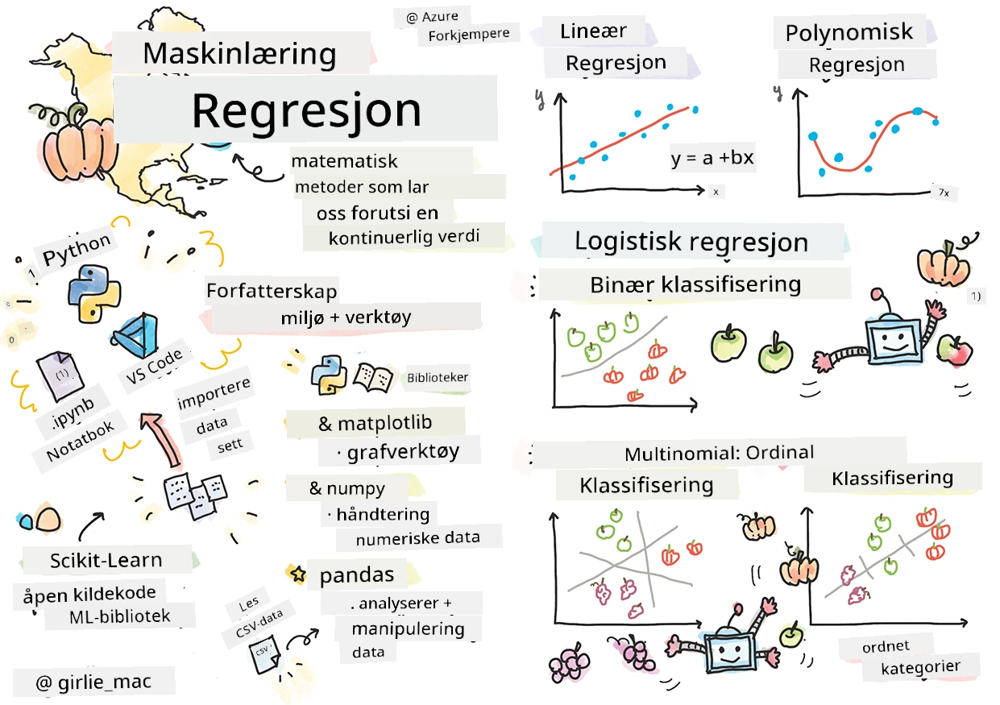
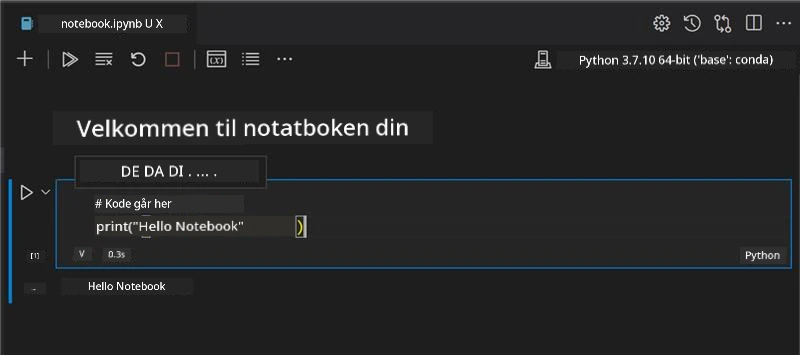
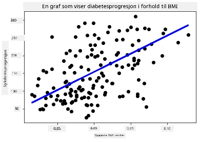

# Kom i gang med Python og Scikit-learn for regresjonsmodeller



> Sketchnote av [Tomomi Imura](https://www.twitter.com/girlie_mac)

## [Quiz før forelesning](https://ff-quizzes.netlify.app/en/ml/)

> ### [Denne leksjonen finnes også i R!](../../../../2-Regression/1-Tools/solution/R/lesson_1.html)

## Innledning

I disse fire leksjonene vil du lære hvordan du bygger regresjonsmodeller. Vi vil snart diskutere hva disse brukes til. Men før du gjør noe som helst, sørg for at du har de riktige verktøyene på plass for å starte prosessen!

I denne leksjonen vil du lære hvordan du:

- Konfigurerer datamaskinen din for lokale maskinlæringsoppgaver.
- Arbeider med Jupyter Notebooks.
- Bruker Scikit-learn, inkludert installasjon.
- Utforsker lineær regresjon med en praktisk øvelse.

## Installasjoner og konfigurasjoner

[](https://youtu.be/-DfeD2k2Kj0 "ML for nybegynnere - Sett opp verktøyene dine klare til å bygge maskinlæringsmodeller")

> 🎥 Klikk på bildet over for en kort video som viser hvordan du konfigurerer datamaskinen for ML.

1. **Installer Python**. Sørg for at [Python](https://www.python.org/downloads/) er installert på datamaskinen din. Du vil bruke Python til mange data science- og maskinlæringoppgaver. De fleste datasystemer har allerede Python installert. Det finnes nyttige [Python-kodepakker](https://code.visualstudio.com/learn/educators/installers?WT.mc_id=academic-77952-leestott) tilgjengelig også, for å lette oppsettet for noen brukere.

   Noen bruksområder av Python krever imidlertid én versjon av programvaren, mens andre krever en annen versjon. Derfor er det nyttig å jobbe i et [virtuelt miljø](https://docs.python.org/3/library/venv.html).

2. **Installer Visual Studio Code**. Pass på at du har Visual Studio Code installert på datamaskinen din. Følg disse instruksjonene for å [installere Visual Studio Code](https://code.visualstudio.com/) for en grunnleggende installasjon. Du kommer til å bruke Python i Visual Studio Code i dette kurset, så det kan være lurt å friske opp hvordan du [konfigurerer Visual Studio Code](https://docs.microsoft.com/learn/modules/python-install-vscode?WT.mc_id=academic-77952-leestott) for Python-utvikling.

   > Bli komfortabel med Python ved å gå gjennom denne samlingen av [Læringsmoduler](https://docs.microsoft.com/users/jenlooper-2911/collections/mp1pagggd5qrq7?WT.mc_id=academic-77952-leestott)
   >
   > [](https://youtu.be/yyQM70vi7V8 "Sett opp Python med Visual Studio Code")
   >
   > 🎥 Klikk på bildet over for en video: bruk av Python i VS Code.

3. **Installer Scikit-learn**, ved å følge [disse instruksjonene](https://scikit-learn.org/stable/install.html). Siden du må sørge for at du bruker Python 3, anbefales det at du bruker et virtuelt miljø. Merk at hvis du installerer dette biblioteket på en M1 Mac, finnes det spesielle instruksjoner på den lenkede siden.

1. **Installer Jupyter Notebook**. Du må [installere Jupyter-pakken](https://pypi.org/project/jupyter/).

## Ditt ML-forfattermiljø

Du skal bruke **notebooks** for å utvikle Python-koden din og lage maskinlæringsmodeller. Denne typen fil er et vanlig verktøy for dataforskere, og kan kjennes igjen på suffikset eller filendelsen `.ipynb`.

Notebooks er et interaktivt miljø som lar utvikleren både kode og legge til notater og skrive dokumentasjon rundt koden, noe som er svært nyttig for eksperimentelle- eller forskningsorienterte prosjekter.

[](https://youtu.be/7E-jC8FLA2E "ML for nybegynnere - Sett opp Jupyter Notebooks for å begynne å bygge regresjonsmodeller")

> 🎥 Klikk på bildet over for en kort video som viser denne øvelsen.

### Øvelse - arbeid med en notebook

I denne mappen finner du filen _notebook.ipynb_.

1. Åpne _notebook.ipynb_ i Visual Studio Code.

   En Jupyter-server vil starte med Python 3+ aktivert. Du vil finne områder i notatboken som kan `kjøres`, kodesnutter. Du kan kjøre en kodeblokk ved å velge ikonet som ser ut som en avspillingsknapp.

1. Velg `md`-ikonet og legg til litt markdown, og teksten **# Velkommen til din notebook**.

   Deretter legger du til noe Python-kode.

1. Skriv **print('hello notebook')** i kodeblokken.
1. Velg pilen for å kjøre koden.

   Du skal nå se den utskrevne setningen:

    ```output
    hello notebook
    ```



Du kan veksle mellom kode og kommentarer for å dokumentere notatboken din.

✅ Tenk et øyeblikk over hvor forskjellig arbeidsmiljø en webutvikler har sammenlignet med en dataforsker.

## Komme i gang med Scikit-learn

Nå som Python er satt opp i ditt lokale miljø, og du er komfortabel med Jupyter Notebooks, la oss bli like komfortable med Scikit-learn (uttales `sci` som i `science`). Scikit-learn tilbyr et [utstrakt API](https://scikit-learn.org/stable/modules/classes.html#api-ref) som hjelper deg med å utføre ML-oppgaver.

Ifølge deres [nettsted](https://scikit-learn.org/stable/getting_started.html), "Scikit-learn er et open source maskinlæringsbibliotek som støtter veiledet og ikke-veiledet læring. Det tilbyr også verktøy for modellanpassning, databehandling, modellseleksjon og evaluering, og mange andre nyttige funksjoner."

I dette kurset vil du bruke Scikit-learn og andre verktøy for å bygge maskinlæringsmodeller som utfører det vi kaller 'tradisjonelle maskinlærings'-oppgaver. Vi har med vilje unngått nevrale nettverk og dyp læring, da disse dekkes bedre i vårt kommende 'AI for nybegynnere'-kurs.

Scikit-learn gjør det enkelt å bygge modeller og evaluere dem for bruk. Det fokuserer i hovedsak på numeriske data og inneholder flere ferdiglagde datasett som verktøy for læring. Det inkluderer også forhåndsbygde modeller for studenter å prøve. La oss utforske prosessen med å laste forhåndspakkede data og bruke en innebygd estimator — en første ML-modell med Scikit-learn med enkel data.

## Øvelse - din første Scikit-learn notebook

> Denne veiledningen er inspirert av [lineær regresjons-eksempelet](https://scikit-learn.org/stable/auto_examples/linear_model/plot_ols.html#sphx-glr-auto-examples-linear-model-plot-ols-py) på Scikit-learns nettsted.


[](https://youtu.be/2xkXL5EUpS0 "ML for nybegynnere - Ditt første lineære regresjonsprosjekt i Python")

> 🎥 Klikk på bildet over for en kort video som viser denne øvelsen.

I filen _notebook.ipynb_ til denne leksjonen, tøm alle cellene ved å trykke på 'søppelbøtte'-ikonet.

I denne seksjonen vil du arbeide med et lite datasett om diabetes som er innebygd i Scikit-learn for læringsformål. Tenk deg at du ønsket å teste en behandling for diabetikere. Maskinlæringsmodeller kan hjelpe deg å finne ut hvilke pasienter som vil respondere best på behandlingen, basert på kombinasjoner av variabler. Selv en veldig enkel regresjonsmodell, når den visualiseres, kan gi informasjon om variabler som kan hjelpe deg å organisere dine teoretiske kliniske studier.

✅ Det finnes mange typer regresjonsmetoder, og hvilken du velger avhenger av hvilket svar du søker. Hvis du ønsker å forutsi sannsynlig høyde for en person i en bestemt alder, bruker du lineær regresjon, fordi du søker en **numerisk verdi**. Om du er interessert i å finne ut om en type matlaging skal regnes som vegansk eller ikke, søker du en **kategori-tilordning**, så du bruker logistisk regresjon. Du vil lære mer om logistisk regresjon senere. Tenk litt på spørsmål du kan stille til data, og hvilken av disse metodene som ville være mest passende.

La oss sette i gang med denne oppgaven.

### Importere biblioteker

For denne oppgaven vil vi importere noen biblioteker:

- **matplotlib**. Det er et nyttig [grafikkverktøy](https://matplotlib.org/) og vi vil bruke det til å lage en linjegraf.
- **numpy**. [numpy](https://numpy.org/doc/stable/user/whatisnumpy.html) er et nyttig bibliotek for å håndtere numeriske data i Python.
- **sklearn**. Dette er [Scikit-learn](https://scikit-learn.org/stable/user_guide.html)-biblioteket.

Importer noen biblioteker som hjelper deg med oppgavene.

1. Legg til importene ved å skrive følgende kode:

   ```python
   import matplotlib.pyplot as plt
   import numpy as np
   from sklearn import datasets, linear_model, model_selection
   ```

   Ovenfor importerer du `matplotlib`, `numpy` og du importerer `datasets`, `linear_model` og `model_selection` fra `sklearn`. `model_selection` brukes for å dele data i trenings- og testsett.

### Diabetes-datasettet

Det innebygde [diabetes-datasettet](https://scikit-learn.org/stable/datasets/toy_dataset.html#diabetes-dataset) inkluderer 442 datapunkter om diabetes, med 10 egenskapsvariabler, hvor noen inkluderer:

- alder: alder i år
- bmi: kroppsmasseindeks
- bp: gjennomsnittlig blodtrykk
- s1 tc: T-celler (en type hvite blodceller)

✅ Dette datasettet inkluderer begrepet 'kjønn' som en egenskapsvariabel som er viktig i diabetesforskning. Mange medisinske datasett inkluderer denne typen binær klassifisering. Tenk litt på hvordan slike kategoriseringer kan ekskludere deler av befolkningen fra behandlinger.

Nå laster vi inn X- og y-dataene.

> 🎓 Husk, dette er veiledet læring, og vi trenger et navngitt 'y'-mål.

I en ny kodecelle, last diabetes-datasettet ved å kalle `load_diabetes()`. Inndataen `return_X_y=True` signaliserer at `X` vil være en datamatris, og `y` vil være regresjonsmålet.

1. Legg til noen print-kommandoer for å vise formen på datamatrisen og dens første element:

    ```python
    X, y = datasets.load_diabetes(return_X_y=True)
    print(X.shape)
    print(X[0])
    ```

    Det du får tilbake som svar, er en tuple. Det du gjør er å tildele de to første verdiene fra tuplen til henholdsvis `X` og `y`. Les mer [om tuples](https://wikipedia.org/wiki/Tuple).

    Du kan se at dette datasettet har 442 elementer formet som arrays med 10 elementer:

    ```text
    (442, 10)
    [ 0.03807591  0.05068012  0.06169621  0.02187235 -0.0442235  -0.03482076
    -0.04340085 -0.00259226  0.01990842 -0.01764613]
    ```

    ✅ Tenk litt over sammenhengen mellom dataene og regresjonsmålet. Lineær regresjon forutsier sammenhenger mellom egenskap X og målvariabel y. Kan du finne [målet](https://scikit-learn.org/stable/datasets/toy_dataset.html#diabetes-dataset) for diabetes-datasettet i dokumentasjonen? Hva demonstrerer dette datasettet, gitt målet?

2. Deretter velger du en del av dette datasettet å plotte ved å velge den 3. kolonnen av datasettet. Du kan gjøre dette ved å bruke `:`-operatoren for å velge alle rader, og deretter velge 3. kolonne med indeksen (2). Du kan også endre formen på dataene til å være en 2D-array - slik som kreves for plotting - ved hjelp av `reshape(n_rows, n_columns)`. Om en av parameterne er -1, regnes den tilsvarende dimensjonen automatisk ut.

   ```python
   X = X[:, 2]
   X = X.reshape((-1,1))
   ```

   ✅ Når som helst, print ut dataene for å sjekke formen.

3. Når du har data klare for plotting, kan du se om en maskin kan hjelpe til med å bestemme en logisk oppdeling mellom tallene i dette datasettet. For å gjøre dette må du splitte både data (X) og mål (y) i test- og treningssett. Scikit-learn har en enkel måte å gjøre dette på; du kan dele testdata på et gitt punkt.

   ```python
   X_train, X_test, y_train, y_test = model_selection.train_test_split(X, y, test_size=0.33)
   ```

4. Nå er du klar til å trene modellen din! Last inn lineær regresjonsmodell og tren den med dine X- og y-treningssett ved bruk av `model.fit()`:

    ```python
    model = linear_model.LinearRegression()
    model.fit(X_train, y_train)
    ```

    ✅ `model.fit()` er en funksjon du vil se i mange ML-biblioteker som TensorFlow

5. Lag så en prediksjon ved bruk av testdata, med funksjonen `predict()`. Dette brukes for å tegne linjen mellom datagruppene.

    ```python
    y_pred = model.predict(X_test)
    ```

6. Nå er det tid til å vise dataene i et plott. Matplotlib er et svært nyttig verktøy for denne oppgaven. Lag et spredningsplott av alle X- og y-testdata, og bruk prediksjonen til å tegne en linje på det mest passende stedet, mellom modellens datagruppene.

    ```python
    plt.scatter(X_test, y_test,  color='black')
    plt.plot(X_test, y_pred, color='blue', linewidth=3)
    plt.xlabel('Scaled BMIs')
    plt.ylabel('Disease Progression')
    plt.title('A Graph Plot Showing Diabetes Progression Against BMI')
    plt.show()
    ```

   


   ✅ Tenk litt på hva som skjer her. En rett linje går gjennom mange små datapunkter, men hva gjør den egentlig? Kan du se hvordan du skal kunne bruke denne linjen til å forutsi hvor et nytt, usett datapunkt bør passe i forhold til plottets y-akse? Prøv å sette ord på den praktiske bruken av denne modellen.

Gratulerer, du har bygget din første lineære regresjonsmodell, laget en prediksjon med den, og vist den i et plott!

---
## 🚀Utfordring

Plott en annen variabel fra dette datasettet. Tips: rediger denne linjen: `X = X[:,2]`. Gitt målet i dette datasettet, hva klarer du å oppdage om utviklingen av diabetes som sykdom?
## [Quiz etter forelesningen](https://ff-quizzes.netlify.app/en/ml/)

## Gjennomgang & Selvstudium

I denne veiledningen jobbet du med enkel lineær regresjon, snarere enn univariat eller multippel lineær regresjon. Les litt om forskjellene mellom disse metodene, eller ta en titt på [denne videoen](https://www.coursera.org/lecture/quantifying-relationships-regression-models/linear-vs-nonlinear-categorical-variables-ai2Ef)

Les mer om konseptet regresjon og tenk over hvilke typer spørsmål som kan besvares med denne teknikken. Ta denne [veiledningen](https://docs.microsoft.com/learn/modules/train-evaluate-regression-models?WT.mc_id=academic-77952-leestott) for å utdype forståelsen din.

## Oppgave

[Et annet datasett](assignment.md)

---

<!-- CO-OP TRANSLATOR DISCLAIMER START -->
**Ansvarsfraskrivelse**:
Dette dokumentet er oversatt ved hjelp av AI-oversettelsestjenesten [Co-op Translator](https://github.com/Azure/co-op-translator). Selv om vi streber etter nøyaktighet, vær oppmerksom på at automatiske oversettelser kan inneholde feil eller unøyaktigheter. Det opprinnelige dokumentet på originalspråket skal betraktes som den autoritative kilden. For kritisk informasjon anbefales profesjonell menneskelig oversettelse. Vi er ikke ansvarlige for eventuelle misforståelser eller feiltolkninger som oppstår ved bruk av denne oversettelsen.
<!-- CO-OP TRANSLATOR DISCLAIMER END -->