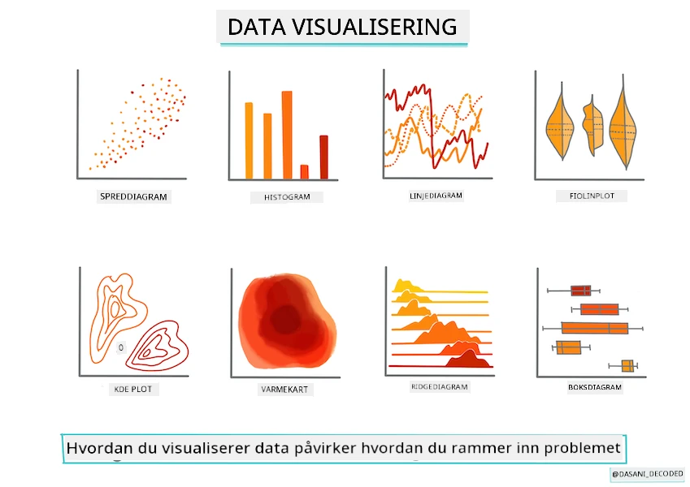
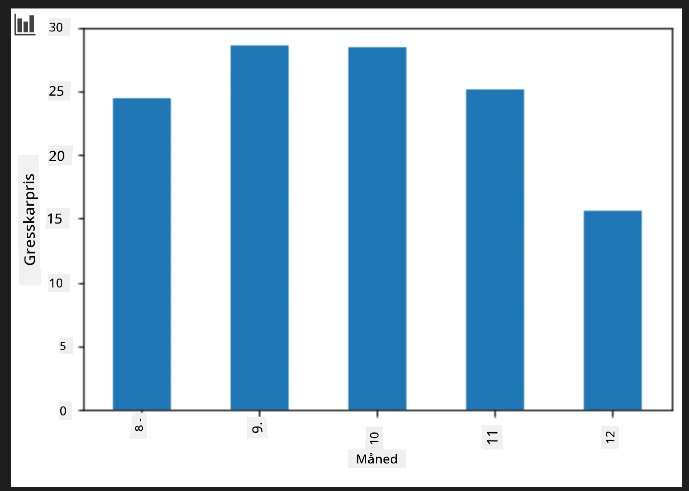
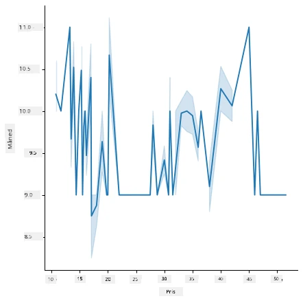
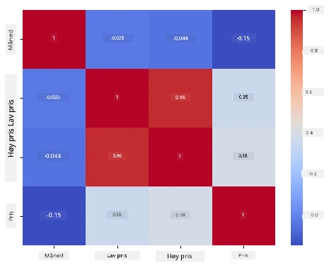

# Bygg en regresjonsmodell med Scikit-learn: forbered og visualiser data



Infografikk av [Dasani Madipalli](https://twitter.com/dasani_decoded)

## [Pre-forelesningsquiz](https://ff-quizzes.netlify.app/en/ml/)

> ### [Denne leksjonen er tilgjengelig på R!](../../../../2-Regression/2-Data/solution/R/lesson_2.html)

## Introduksjon

Nå som du er satt opp med verktøyene du trenger for å begynne med maskinlæringsmodellbygging med Scikit-learn, er du klar til å begynne å stille spørsmål til dataene dine. Når du jobber med data og anvender ML-løsninger, er det veldig viktig å forstå hvordan du stiller de riktige spørsmålene for å ordentlig låse opp potensialet i datasettet ditt.

I denne leksjonen vil du lære:

- Hvordan forberede dataene dine for modellbygging.
- Hvordan bruke Matplotlib for datavisualisering.
- Hvordan bruke Seaborn for mer uttrykksfull datavisualisering.

## Å stille det rette spørsmålet til dataene dine

Spørsmålet du trenger svar på vil avgjøre hvilken type ML-algoritmer du vil benytte. Og kvaliteten på svaret du får tilbake vil være sterkt avhengig av arten til dataene dine.

Ta en titt på [dataene](https://github.com/microsoft/ML-For-Beginners/blob/main/2-Regression/data/US-pumpkins.csv) som er gitt til denne leksjonen. Du kan åpne denne .csv-filen i VS Code. En rask gjennomgang viser umiddelbart at det finnes tomme felt og en blanding av tekst og numeriske data. Det er også en merkelig kolonne kalt 'Package' der dataene er en blanding av 'sacks', 'bins' og andre verdier. Dataene er altså litt rotete.

[](https://youtu.be/5qGjczWTrDQ "ML for nybegynnere - Hvordan analysere og rydde et datasett")

> 🎥 Klikk på bildet over for en kort video som går gjennom forberedelse av dataene for denne leksjonen.

Det er faktisk ikke veldig vanlig å få et datasett som er helt klart til bruk for å lage en ML-modell rett ut av boksen. I denne leksjonen vil du lære hvordan du forbereder et rått datasett ved å bruke standard Python-biblioteker. Du vil også lære forskjellige teknikker for å visualisere dataene.

## Casestudie: 'gresskarmarkedet'

I denne mappen finner du en .csv-fil i rotmappen `data` kalt [US-pumpkins.csv](https://github.com/microsoft/ML-For-Beginners/blob/main/2-Regression/data/US-pumpkins.csv) som inneholder 1757 linjer med data om markedet for gresskar, sortert etter by. Dette er rådata hentet fra [Specialty Crops Terminal Markets Standard Reports](https://www.marketnews.usda.gov/mnp/fv-report-config-step1?type=termPrice) distribuert av United States Department of Agriculture.

### Forberedelse av data

Disse dataene er i det offentlige domene. De kan lastes ned i mange separate filer, per by, fra USDA-nettsiden. For å unngå for mange separate filer har vi slått sammen all bydata til ett regneark, så vi har allerede _forberedt_ dataene litt. La oss nå se nærmere på dataene.

### Gresskar-dataene - tidlige konklusjoner

Hva legger du merke til med disse dataene? Du har allerede sett at det er en blanding av tekst, tall, tomme felt og merkelige verdier som du må få mening i.

Hvilket spørsmål kan du stille til disse dataene med en regresjonsteknikk? Hva med "Forutsi prisen på et gresskar for salg i en gitt måned". Ser man igjen på dataene, er det noen endringer du må gjøre for å skape datastrukturen som er nødvendig for oppgaven.
## Øvelse - analyser gresskardata

La oss bruke [Pandas](https://pandas.pydata.org/), (navnet står for `Python Data Analysis`), et verktøy som er veldig nyttig for å forme data, for å analysere og forberede disse gresskardataene.

### Først, sjekk for manglende datoer

Du må først ta grep for å sjekke om det mangler datoer:

1. Konverter datoene til måned-format (dette er amerikanske datoer, så formatet er `MM/DD/YYYY`).
2. Ekstraher måneden til en ny kolonne.

Åpne filen _notebook.ipynb_ i Visual Studio Code og importer regnearket til en ny Pandas-dataframe.

1. Bruk `head()`-funksjonen for å se de første fem radene.

    ```python
    import pandas as pd
    pumpkins = pd.read_csv('../data/US-pumpkins.csv')
    pumpkins.head()
    ```

    ✅ Hvilken funksjon vil du bruke for å vise de siste fem radene?

1. Sjekk om det finnes manglende data i den nåværende dataframe:

    ```python
    pumpkins.isnull().sum()
    ```

    Det finnes manglende data, men kanskje det ikke spiller noen rolle for oppgaven.

1. For å gjøre dataframen lettere å jobbe med, velg kun kolonnene du trenger, ved å bruke `loc`-funksjonen som tar ut en gruppe rader (ført som første parameter) og kolonner (ført som andre parameter) fra den opprinnelige dataframen. Uttrykket `:` her betyr "alle rader".

    ```python
    columns_to_select = ['Package', 'Low Price', 'High Price', 'Date']
    pumpkins = pumpkins.loc[:, columns_to_select]
    ```

### For det andre, bestem gjennomsnittsprisen på gresskar

Tenk på hvordan du kan bestemme gjennomsnittsprisen på et gresskar i en gitt måned. Hvilke kolonner vil du velge for denne oppgaven? Hint: du vil trenge 3 kolonner.

Løsning: ta gjennomsnittet av kolonnene `Low Price` og `High Price` for å fylle ut en ny Pris-kolonne, og konverter Dato-kolonnen slik at den kun viser måneden. Heldigvis, ifølge sjekken ovenfor, mangler det ikke data for datoer eller priser.

1. For å beregne gjennomsnittet, legg til følgende kode:

    ```python
    price = (pumpkins['Low Price'] + pumpkins['High Price']) / 2

    month = pd.DatetimeIndex(pumpkins['Date']).month

    ```

   ✅ Føl deg fri til å printe data du vil sjekke med `print(month)`.

2. Nå, kopier de konverterte dataene til en fersk Pandas-dataframe:

    ```python
    new_pumpkins = pd.DataFrame({'Month': month, 'Package': pumpkins['Package'], 'Low Price': pumpkins['Low Price'],'High Price': pumpkins['High Price'], 'Price': price})
    ```

    Å printe ut dataframen vil vise deg et rent, ryddig datasett som du kan bygge din nye regresjonsmodell på.

### Men vent! Det er noe merkelig her

Hvis du ser på `Package`-kolonnen, selges gresskar i mange forskjellige konfigurasjoner. Noen selges i '1 1/9 bushel' mål, noen i '1/2 bushel' mål, noen per gresskar, noen per pund, og noen i store kasser med varierende bredder.

> Gresskar virker veldig vanskelige å veie konsistent

Ser man nærmere på originaldataene, er det interessant at alt med `Unit of Sale` lik 'EACH' eller 'PER BIN' også har `Package`-typen per tomme, per bin, eller 'each'. Gresskar virker veldig vanskelige å veie konsistent, så la oss filtrere de ved kun å velge gresskar med teksten 'bushel' i `Package`-kolonnen.

1. Legg til et filter øverst i filen, under den første .csv-importen:

    ```python
    pumpkins = pumpkins[pumpkins['Package'].str.contains('bushel', case=True, regex=True)]
    ```

    Hvis du printer dataene nå, ser du at du kun får ca 415 rader med data som inneholder gresskar målt i bushels.

### Men vent! Det er en ting til å gjøre

Merket du at bushelfeltet varierer per rad? Du må normalisere prisene slik at de vises per bushel, så gjør litt matematikk for å standardisere dette.

1. Legg til disse linjene etter blokken som lager new_pumpkins dataframen:

    ```python
    new_pumpkins.loc[new_pumpkins['Package'].str.contains('1 1/9'), 'Price'] = price/(1 + 1/9)

    new_pumpkins.loc[new_pumpkins['Package'].str.contains('1/2'), 'Price'] = price/(1/2)
    ```

✅ Ifølge [The Spruce Eats](https://www.thespruceeats.com/how-much-is-a-bushel-1389308), avhenger vekten til en bushel av typen produkt, siden det er et volum-mål. "En bushel tomater, for eksempel, skal veie 56 pounds... Blader og grønnsaker tar opp mer plass med mindre vekt, så en bushel spinat veier kun 20 pounds." Det er ganske komplisert! La oss ikke bry oss med å konvertere fra bushel til pund, og i stedet prise per bushel. All denne studeringen av bushels med gresskar viser hvor viktig det er å forstå naturen til dataene dine!

Nå kan du analysere prisingen per enhet basert på bushelmålingen. Hvis du printer ut dataene enda en gang, kan du se hvordan de er standardisert.

✅ La du merke til at gresskar solgt per halv bushel er veldig dyre? Kan du finne ut hvorfor? Hint: små gresskar er mye dyrere enn store, sannsynligvis fordi det er mange flere av dem per bushel, gitt plassen som er ubrukt av ett stort hulrommelig pai-gresskar.

## Visualiseringsstrategier

En del av rollen som dataforsker er å demonstrere kvaliteten og arten av dataene de jobber med. For å gjøre dette lager de ofte interessante visualiseringer, eller plott, grafer og diagrammer, som viser ulike aspekter ved dataene. På denne måten kan de visuelt vise forhold og hull som ellers er vanskelige å oppdage.

[](https://youtu.be/SbUkxH6IJo0 "ML for nybegynnere - Hvordan visualisere data med Matplotlib")

> 🎥 Klikk på bildet over for en kort video som går gjennom visualiseringen av dataene for denne leksjonen.

Visualiseringer kan også hjelpe til med å bestemme hvilken maskinlæringsteknikk som passer best for dataene. Et spredningsdiagram som ser ut til å følge en linje, indikerer for eksempel at dataene er en god kandidat for en lineær regresjonsøvelse.

Et datavisualiseringsbibliotek som fungerer bra i Jupyter-notebooks er [Matplotlib](https://matplotlib.org/) (som du også så i forrige leksjon).

> Få mer erfaring med datavisualisering i [disse veiledningene](https://docs.microsoft.com/learn/modules/explore-analyze-data-with-python?WT.mc_id=academic-77952-leestott).

## Øvelse - prøv deg med Matplotlib

Prøv å lage noen grunnleggende plott for å vise den nye dataframen du nettopp opprettet. Hva ville et enkelt linjediagram vise?

1. Importer Matplotlib øverst i filen, under import av Pandas:

    ```python
    import matplotlib.pyplot as plt
    ```

1. Kjør hele notebooken på nytt for å oppdatere.
1. Legg til en celle nederst i notebooken for å plotte dataene som en boks:

    ```python
    price = new_pumpkins.Price
    month = new_pumpkins.Month
    plt.scatter(price, month)
    plt.show()
    ```

    

    Er dette et nyttig diagram? Overrasker noe deg med det?

    Det er ikke spesielt nyttig da alt det gjør er å vise dataene dine som en spredning av punkter i en gitt måned.

### Gjør det nyttig

For å få diagrammer til å vise nyttig data må du vanligvis gruppere dataene på en eller annen måte. La oss prøve å lage et plott hvor y-aksen viser månedene og dataene viser fordelingen av data.

1. Legg til en celle for å lage et gruppert stolpediagram:

    ```python
    new_pumpkins.groupby(['Month'])['Price'].mean().plot(kind='bar')
    plt.ylabel("Pumpkin Price")
    ```

    

    Dette er en mer nyttig datavisualisering! Det ser ut til å indikere at høyeste pris for gresskar skjer i september og oktober. Stemmer dette med dine forventninger? Hvorfor eller hvorfor ikke?

## Øvelse - prøv deg med Seaborn

Matplotlib er kraftig, men det kan kreve mye kode å produsere et polert diagram. [Seaborn](https://seaborn.pydata.org/) er et bibliotek bygget _oppe på_ Matplotlib som er designet for statistisk datavisualisering. Det fungerer direkte med Pandas-dataframes, bruker attraktive standardstiler, og lar deg lage informative plott med mye mindre kode. Fordi Seaborn returnerer Matplotlib-objekter, kan du fortsatt bruke alt du allerede vet om Matplotlib for å finjustere resultatet.

> Hvis du ikke allerede har Seaborn installert, installer det med `pip install seaborn`.

1. Importer Seaborn øverst i notebooken, under de andre importene. Det er vanlig å importere det som `sns`:

    ```python
    import seaborn as sns
    ```

### Spredningsplott for å vise sammenhenger

En stor del av å utforske data før man bygger en modell, er å se etter _sammenhenger_ mellom variabler. Et [spredningsdiagram](https://en.wikipedia.org/wiki/Scatter_plot) er et av de beste verktøyene for dette: hvis punktene ser ut til å følge en linje, kan de to variablene være korrelert, noe som er et godt tegn på at en lineær regresjonsmodell kan fungere.

1. Lag på nytt spredningsplottet fra før som viser pris til måned, denne gangen using Seaborns [`relplot()`](https://seaborn.pydata.org/generated/seaborn.relplot.html) (relasjonsplot), som jobber direkte med kolonnene i dataframen:

    ```python
    sns.relplot(x="Price", y="Month", data=new_pumpkins)
    ```

    

    Legg merke til hvordan du sender inn _kolonnenavnene_ og dataframen, og Seaborn ordner med akseetikettene for deg.

2. Du kan bytte til et linjediagram ved å sende `kind="line"`. Seaborn tegner til og med et skyggebelte som viser konfidensintervallet rundt linjen:

    ```python
    sns.relplot(x="Price", y="Month", kind="line", data=new_pumpkins)
    ```

    

    Dette spesielle datasettet er ganske støyete, så et linjediagram er ikke det tydeligste valget her – men det viser hvor enkelt du kan bytte diagramtype i Seaborn.

### Stolpediagrammer for å vise fordelinger


Tidligere grupperte du dataene manuelt for å lage et stolpediagram med Matplotlib. Seaborns [`catplot()`](https://seaborn.pydata.org/generated/seaborn.catplot.html) (kategorisk diagram) kan gjøre gruppering og aggregering for deg. Som standard viser `kind="bar"` gjennomsnittet for hver kategori sammen med en svart linje som indikerer konfidensintervallet.

1. Lag et stolpediagram av gjennomsnittspris per måned:

    ```python
    sns.catplot(x="Month", y="Price", data=new_pumpkins, kind="bar")
    ```

    

    Dette bekrefter det du så med Matplotlib — prisene topper seg rundt september og oktober — men Seaborn visualiserer også hvor mye prisen _varierer_ innenfor hver måned.

### Varmekart for å vise korrelasjoner

Spredningsdiagrammer sammenligner to variabler om gangen. Når du har flere numeriske kolonner, lar et [varmekart](https://en.wikipedia.org/wiki/Heat_map) deg se styrken på sammenhengen mellom _hvert_ par av kolonner samtidig. Dette er en vanlig måte å oppdage hvilke funksjoner som er mest korrelert før du velger hva du skal bruke i en modell (og samme type diagram brukes senere til å vise forvirringsmatriser i klassifisering).

1. Bygg en korrelasjonsmatrise med Pandas, og tegn den deretter med Seaborns [`heatmap()`](https://seaborn.pydata.org/generated/seaborn.heatmap.html). `annot=True`-alternativet skriver ut korrelasjonsverdiene i hver celle:

    ```python
    correlations = new_pumpkins[['Month', 'Low Price', 'High Price', 'Price']].corr()
    sns.heatmap(correlations, annot=True, cmap="coolwarm")
    ```

    

    Verdier nær `1` (eller `-1`) betyr at kolonnene er sterkt _lineært_ korrelert. Legg merke til hvordan `Low Price` og `High Price` er nesten perfekt korrelert. `Month` viser derimot bare en svak lineær korrelasjon med pris — selv om stolpediagrammet over avslørte en tydelig sesongmessig topp i september og oktober. Det er en viktig lærdom: korrelasjonskoeffisienten måler kun _rettlinjede_ sammenhenger, så den kan overse sesongbaserte eller andre ikke-lineære mønstre. ✅ Hvorfor er det nyttig å se både et varmekart *og* diagrammer som stolpediagrammet før man bestemmer seg for hvilke kolonner man skal bruke?

### Matplotlib eller Seaborn?

Begge bibliotekene er verdt å kjenne til:

- **Matplotlib** gir deg detaljert kontroll over hvert element i et diagram og er grunnlaget de fleste andre Python-plottebiblioteker bygger på.
- **Seaborn** tilbyr funksjoner på høyere nivå og attraktive standardinnstillinger for statistiske diagrammer, fungerer direkte med dataframes, og er ofte raskere for utforskende dataanalyse.

En vanlig arbeidsflyt er å bruke Seaborn for raskt å utforske dataene dine, og deretter gå over til Matplotlib når du trenger å tilpasse detaljer.

---

## 🚀Utfordring

Utforsk de forskjellige typene visualisering som Matplotlib og Seaborn tilbyr. Hvilke typer passer best for regresjonsproblemer?

## [Quiz etter forelesning](https://ff-quizzes.netlify.app/en/ml/)

## Gjennomgang og selvstudium

Se på de mange måtene å visualisere data på. Lag en liste over de ulike bibliotekene som finnes, og noter hvilke som er best for gitte typer oppgaver, for eksempel 2D-visualiseringer vs. 3D-visualiseringer. Hva oppdager du?

## Oppgave

[Utforske visualisering](assignment.md)

---

<!-- CO-OP TRANSLATOR DISCLAIMER START -->
**Ansvarsfraskrivelse**:
Dette dokumentet er oversatt ved hjelp av AI-oversettelsestjenesten [Co-op Translator](https://github.com/Azure/co-op-translator). Selv om vi streber etter nøyaktighet, vær oppmerksom på at automatiske oversettelser kan inneholde feil eller unøyaktigheter. Det opprinnelige dokumentet på originalspråket skal betraktes som den autoritative kilden. For kritisk informasjon anbefales profesjonell menneskelig oversettelse. Vi er ikke ansvarlige for eventuelle misforståelser eller feiltolkninger som oppstår ved bruk av denne oversettelsen.
<!-- CO-OP TRANSLATOR DISCLAIMER END -->