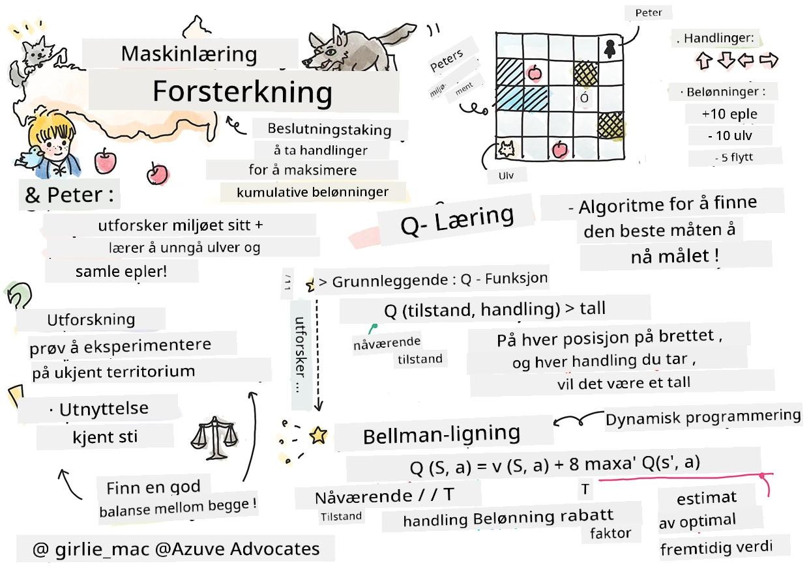

# Introduksjon til forsterkende læring og Q-læring


> Sketchnote av [Tomomi Imura](https://www.twitter.com/girlie_mac)

Forsterkende læring involverer tre viktige konsepter: agenten, noen tilstander, og et sett med handlinger per tilstand. Ved å utføre en handling i en spesifisert tilstand, gis agenten en belønning. Forestill deg igjen dataspillet Super Mario. Du er Mario, du er i et spillnivå, stående ved kanten av en klippe. Over deg er det en mynt. Du som Mario, i et spillnivå, på en spesifikk posisjon ... det er din tilstand. Å ta et steg til høyre (en handling) vil føre deg over kanten, og det vil gi deg en lav poengsum. Men, å trykke på hopp-knappen vil la deg score et poeng og du vil forbli i live. Det er et positivt utfall, og det burde gi deg en positiv numerisk poengsum.

Ved å bruke forsterkende læring og en simulator (spillet), kan du lære hvordan du spiller spillet for å maksimere belønningen, som er å holde deg i live og score så mange poeng som mulig.

[](https://www.youtube.com/watch?v=lDq_en8RNOo)

> 🎥 Klikk på bildet over for å høre Dmitry diskutere forsterkende læring

## [Før-forelesningsquiz](https://ff-quizzes.netlify.app/en/ml/)

## Forutsetninger og oppsett

I denne leksjonen skal vi eksperimentere med noe kode i Python. Du bør kunne kjøre Jupyter Notebook-koden fra denne leksjonen, enten på din egen datamaskin eller et sted i skyen.

Du kan åpne [leksjonsnotatboken](https://github.com/microsoft/ML-For-Beginners/blob/main/8-Reinforcement/1-QLearning/notebook.ipynb) og gå gjennom denne leksjonen for å bygge.

> **Merk:** Hvis du åpner denne koden fra skyen, må du også hente [`rlboard.py`](https://github.com/microsoft/ML-For-Beginners/blob/main/8-Reinforcement/1-QLearning/rlboard.py) filen, som brukes i notatbok-koden. Legg den i samme katalog som notatboken.

## Introduksjon

I denne leksjonen skal vi utforske verden av **[Peter og ulven](https://en.wikipedia.org/wiki/Peter_and_the_Wolf)**, inspirert av et musikalsk eventyr av en russisk komponist, [Sergei Prokofiev](https://en.wikipedia.org/wiki/Sergei_Prokofiev). Vi skal bruke **forsterkende læring** for å la Peter utforske miljøet sitt, samle deilige epler og unngå å møte ulven.

**Forsterkende læring** (RL) er en læringsteknikk som gjør oss i stand til å lære optimal oppførsel av en **agent** i et **miljø** ved å kjøre mange eksperimenter. En agent i dette miljøet skal ha et **mål**, definert av en **belønningsfunksjon**.

## Miljøet

For enkelhets skyld, la oss anta at Peters verden er et kvadratisk brett av størrelse `width` x `height`, som dette:


Hver celle i dette brettet kan enten være:

* **bakke**, som Peter og andre skapninger kan gå på.
* **vann**, som du tydeligvis ikke kan gå på.
* et **tre** eller **gress**, et sted hvor du kan hvile.
* et **eple**, som representerer noe Peter ville bli glad for å finne for å mate seg selv.
* en **ulv**, som er farlig og bør unngås.

Det finnes en separat Python-modul, [`rlboard.py`](https://github.com/microsoft/ML-For-Beginners/blob/main/8-Reinforcement/1-QLearning/rlboard.py), som inneholder koden for å jobbe med dette miljøet. Fordi denne koden ikke er viktig for å forstå konseptene våre, skal vi importere modulen og bruke den til å lage eksempelbrettet (kodeblokk 1):

```python
from rlboard import *

width, height = 8,8
m = Board(width,height)
m.randomize(seed=13)
m.plot()
```

Denne koden skal skrive ut et bilde av miljøet som ligner på det ovenfor.

## Handlinger og policy

I vårt eksempel ville Peters mål være å finne et eple, samtidig som han unngår ulven og andre hindringer. For å gjøre dette kan han i det vesentlige gå rundt til han finner et eple.

Derfor kan han på enhver posisjon velge mellom følgende handlinger: opp, ned, venstre og høyre.

Vi skal definere disse handlingene som en ordbok, og kartlegge dem til par av tilsvarende koordinatendringer. For eksempel vil det å bevege seg til høyre (`R`) tilsvare et par `(1,0)`. (kodeblokk 2):

```python
actions = { "U" : (0,-1), "D" : (0,1), "L" : (-1,0), "R" : (1,0) }
action_idx = { a : i for i,a in enumerate(actions.keys()) }
```

For å oppsummere, strategien og målet for dette scenarioet er som følger:

- **Strategien**, for vår agent (Peter) er definert av en såkalt **policy**. En policy er en funksjon som returnerer handlingen i enhver gitt tilstand. I vårt tilfelle representeres problemets tilstand av brettet, inkludert spillerens nåværende posisjon.

- **Målet**, med forsterkende læring er å til slutt lære en god policy som lar oss løse problemet effektivt. Men som et utgangspunkt, la oss vurdere den enkleste policyen kalt **tilfeldig gange**.

## Tilfeldig gange

La oss først løse problemet vårt ved å implementere en strategi for tilfeldig gange. Med tilfeldig gange vil vi tilfeldig velge neste handling fra de tillatte handlingene, til vi når eplet (kodeblokk 3).

1. Implementer tilfeldig gange med koden nedenfor:

    ```python
    def random_policy(m):
        return random.choice(list(actions))
    
    def walk(m,policy,start_position=None):
        n = 0 # antall skritt
        # sett startposisjon
        if start_position:
            m.human = start_position 
        else:
            m.random_start()
        while True:
            if m.at() == Board.Cell.apple:
                return n # suksess!
            if m.at() in [Board.Cell.wolf, Board.Cell.water]:
                return -1 # spist av ulv eller druknet
            while True:
                a = actions[policy(m)]
                new_pos = m.move_pos(m.human,a)
                if m.is_valid(new_pos) and m.at(new_pos)!=Board.Cell.water:
                    m.move(a) # utfør selve flyttingen
                    break
            n+=1
    
    walk(m,random_policy)
    ```

    Kallet til `walk` skal returnere lengden på den tilsvarende veien, som kan variere fra en kjøring til en annen.

1. Kjør gang-eksperimentet flere ganger (for eksempel 100), og skriv ut de resulterende statistikkene (kodeblokk 4):

    ```python
    def print_statistics(policy):
        s,w,n = 0,0,0
        for _ in range(100):
            z = walk(m,policy)
            if z<0:
                w+=1
            else:
                s += z
                n += 1
        print(f"Average path length = {s/n}, eaten by wolf: {w} times")
    
    print_statistics(random_policy)
    ```

    Merk at gjennomsnittlig lengde på en rute er rundt 30-40 steg, noe som er ganske mye, gitt at gjennomsnittsavstanden til nærmeste eple er rundt 5-6 steg.

    Du kan også se hvordan Peters bevegelser ser ut under den tilfeldige gangen:

    

## Belønningsfunksjon

For å gjøre policyen vår mer intelligent, må vi forstå hvilke trekk som er "bedre" enn andre. For å gjøre dette må vi definere målet vårt.

Målet kan defineres i form av en **belønningsfunksjon**, som returnerer en poengsum for hver tilstand. Jo høyere tallet er, desto bedre er belønningsfunksjonen. (kodeblokk 5)

```python
move_reward = -0.1
goal_reward = 10
end_reward = -10

def reward(m,pos=None):
    pos = pos or m.human
    if not m.is_valid(pos):
        return end_reward
    x = m.at(pos)
    if x==Board.Cell.water or x == Board.Cell.wolf:
        return end_reward
    if x==Board.Cell.apple:
        return goal_reward
    return move_reward
```

En interessant ting med belønningsfunksjoner er at i de fleste tilfeller *får vi kun en betydelig belønning ved slutten av spillet*. Det betyr at algoritmen vår på en måte må huske "gode" steg som fører til positiv belønning til slutt, og øke viktigheten av dem. Tilsvarende bør alle trekk som leder til dårlige resultater frarådes.

## Q-læring

En algoritme vi skal diskutere her kalles **Q-læring**. I denne algoritmen defineres policyen av en funksjon (eller en datastruktur) kalt en **Q-tabell**. Den registrerer "godheten" til hver handling i en gitt tilstand.

Den kalles Q-tabell fordi det ofte er praktisk å representere den som en tabell, eller et multidimensjonalt matrise. Siden brettet vårt har dimensjoner `width` x `height`, kan vi representere Q-tabellen som et numpy-array med form `width` x `height` x `len(actions)`: (kodeblokk 6)

```python
Q = np.ones((width,height,len(actions)),dtype=np.float)*1.0/len(actions)
```

Merk at vi initialiserer alle verdiene i Q-tabellen med samme verdi, i vårt tilfelle - 0.25. Dette tilsvarer "tilfeldig gange"-policyen, fordi alle trekk i hver tilstand er like gode. Vi kan sende Q-tabellen til `plot` funksjonen for å visualisere tabellen på brettet: `m.plot(Q)`.


I midten av hver celle er det en "pil" som indikerer den foretrukne bevegelsesretningen. Siden alle retninger er like, vises et punkt.

Nå må vi kjøre simuleringen, utforske miljøet vårt og lære en bedre fordeling av Q-tabellverdier, som lar oss finne veien til eplet mye raskere.

## Kjernen i Q-læring: Bellman-ligning

Når vi begynner å bevege oss, vil hver handling ha en tilsvarende belønning, dvs. vi kan teoretisk velge neste handling basert på høyest umiddelbar belønning. Men i de fleste tilstander vil ikke trekket oppnå vårt mål om å nå eplet, og derfor kan vi ikke umiddelbart avgjøre hvilken retning som er best.

> Husk at det ikke er det umiddelbare resultatet som betyr noe, men heller det endelige resultatet, som vi får ved slutten av simuleringen.

For å ta hensyn til denne forsinkede belønningen må vi bruke prinsippene i **[dynamisk programmering](https://en.wikipedia.org/wiki/Dynamic_programming)**, som lar oss tenke på problemet vårt rekursivt.

La oss anta at vi nå er i tilstand *s*, og vi vil bevege oss til neste tilstand *s'*. Ved å gjøre dette vil vi motta den umiddelbare belønningen *r(s,a)*, definert av belønningsfunksjonen, pluss noe fremtidig belønning. Hvis vi antar at Q-tabellen vår korrekt reflekterer "attraktiviteten" til hver handling, vil vi i tilstand *s'* velge en handling *a* som tilsvarer maksimumsverdien av *Q(s',a')*. Dermed vil den beste mulige fremtidige belønningen vi kan få i tilstand *s* bli definert som `max`<sub>a'</sub>*Q(s',a')* (maksimum her beregnes over alle mulige handlinger *a'* i tilstand *s'*).

Dette gir den **Bellman-formelen** for å beregne verdien i Q-tabellen i tilstand *s*, gitt handling *a*:


Her er γ den såkalte **diskonteringsfaktoren** som bestemmer i hvilken grad du bør foretrekke nåværende belønning fremfor fremtidig belønning, og omvendt.

## Læringsalgoritme

Gitt ligningen over kan vi nå skrive pseudokode for læringsalgoritmen vår:

* Initialiser Q-tabellen Q med like tall for alle tilstander og handlinger
* Sett læringsrate α ← 1
* Gjenta simuleringen mange ganger
   1. Start på en tilfeldig posisjon
   1. Gjenta
        1. Velg en handling *a* i tilstand *s*
        2. Utfør handling ved å gå til en ny tilstand *s'*
        3. Hvis vi møter slutten-av-spillet-betingelsen, eller total belønning er for lav - avslutt simuleringen  
        4. Beregn belønningen *r* i den nye tilstanden
        5. Oppdater Q-funksjonen i henhold til Bellman-ligningen: *Q(s,a)* ← *(1-α)Q(s,a)+α(r+γ max<sub>a'</sub>Q(s',a'))*
        6. *s* ← *s'*
        7. Oppdater total belønning og reduser α.

## Utnytte vs utforske

I algoritmen ovenfor spesifiserte vi ikke nøyaktig hvordan vi burde velge handlingen i steg 2.1. Hvis vi velger handlingen tilfeldig, vil vi tilfeldig **utforske** miljøet, og vi har ganske stor sannsynlighet for å dø ofte samt utforske områder hvor vi normalt ikke ville gått. Et alternativt tilnærming er å **utnytte** verdiene i Q-tabellen som vi allerede kjenner, og dermed velge den beste handlingen (med høyest Q-verdi) i tilstand *s*. Dette vil imidlertid forhindre oss fra å utforske andre tilstander, og det er sannsynlig at vi ikke finner den optimale løsningen.

Derfor er den beste tilnærmingen å finne en balanse mellom utforskning og utnyttelse. Dette kan gjøres ved å velge en handling i tilstand *s* med sannsynlighet proporsjonal med verdiene i Q-tabellen. I begynnelsen, når alle Q-verdiene er like, vil dette tilsvare et tilfeldig valg, men etter hvert som vi lærer mer om miljøet vårt, vil vi sannsynligvis følge den optimale ruten samtidig som agenten av og til får velge en uutforsket vei.

## Implementering i Python

Vi er nå klare til å implementere læringsalgoritmen. Før vi gjør det, trenger vi også en funksjon som konverterer vilkårlige tall i Q-tabellen til en sannsynlighetsvektor for de tilsvarende handlingene.

1. Lag en funksjon `probs()`:

    ```python
    def probs(v,eps=1e-4):
        v = v-v.min()+eps
        v = v/v.sum()
        return v
    ```

    Vi legger til noen `eps` til den originale vektoren for å unngå divisjon med 0 i starten, når alle komponentene i vektoren er identiske.

Kjør læringsalgoritmen gjennom 5000 eksperimenter, også kalt **epoker**: (kodeblokk 8)
```python
    for epoch in range(5000):
    
        # Velg startpunkt
        m.random_start()
        
        # Begynn å reise
        n=0
        cum_reward = 0
        while True:
            x,y = m.human
            v = probs(Q[x,y])
            a = random.choices(list(actions),weights=v)[0]
            dpos = actions[a]
            m.move(dpos,check_correctness=False) # vi tillater spilleren å bevege seg utenfor brettet, noe som avslutter episoden
            r = reward(m)
            cum_reward += r
            if r==end_reward or cum_reward < -1000:
                lpath.append(n)
                break
            alpha = np.exp(-n / 10e5)
            gamma = 0.5
            ai = action_idx[a]
            Q[x,y,ai] = (1 - alpha) * Q[x,y,ai] + alpha * (r + gamma * Q[x+dpos[0], y+dpos[1]].max())
            n+=1
```

Etter at denne algoritmen er kjørt, skal Q-tabellen være oppdatert med verdier som definerer attraktiviteten til ulike handlinger på hvert steg. Vi kan prøve å visualisere Q-tabellen ved å tegne en vektor i hver celle som peker i ønsket bevegelsesretning. For enkelhetens skyld tegner vi en liten sirkel i stedet for en pilspiss.


## Sjekke policyen

Siden Q-tabellen viser "attraktiviteten" til hver handling i hver tilstand, er det ganske enkelt å bruke den til effektiv navigasjon i vår verden. I den enkleste versjonen kan vi velge den handlingen som tilsvarer den høyeste Q-verdien: (kodeblokk 9)

```python
def qpolicy_strict(m):
        x,y = m.human
        v = probs(Q[x,y])
        a = list(actions)[np.argmax(v)]
        return a

walk(m,qpolicy_strict)
```


> Hvis du prøver koden over flere ganger, kan du legge merke til at den noen ganger "henger", og du må trykke på STOPP-knappen i notatboken for å avbryte den. Dette skjer fordi det kan oppstå situasjoner der to tilstander "peker" på hverandre når det gjelder optimal Q-verdi, og i så fall ender agenten opp med å bevege seg mellom disse tilstandene på ubestemt tid.

## 🚀Utfordring

> **Oppgave 1:** Endre `walk`-funksjonen slik at den begrenser maksimal lengde på stien til et visst antall steg (si 100), og se hvordan koden over returnerer denne verdien fra tid til annen.

> **Oppgave 2:** Endre `walk`-funksjonen slik at den ikke går tilbake til steder den tidligere har vært. Dette vil forhindre at `walk` havner i en løkke, men agenten kan fortsatt ende opp "fanget" på et sted den ikke klarer å unnslippe fra.

## Navigasjon

En bedre navigasjonspolicy vil være den vi brukte under trening, som kombinerer utnyttelse og utforskning. I denne policyen velger vi hver handling med en viss sannsynlighet, proporsjonal med verdiene i Q-tabellen. Denne strategien kan fortsatt føre til at agenten returnerer til en posisjon den allerede har utforsket, men som du kan se fra koden nedenfor, resulterer det i en veldig kort gjennomsnittlig sti til ønsket lokasjon (husk at `print_statistics` kjører simuleringen 100 ganger): (kodeblokk 10)

```python
def qpolicy(m):
        x,y = m.human
        v = probs(Q[x,y])
        a = random.choices(list(actions),weights=v)[0]
        return a

print_statistics(qpolicy)
```

Etter å ha kjørt denne koden, bør du få en mye mindre gjennomsnittlig stilengde enn før, i området 3-6.

## Undersøke læringsprosessen

Som vi har nevnt, er læringsprosessen en balanse mellom utforskning og utnyttelse av oppnådd kunnskap om strukturen i problemrommet. Vi har sett at resultatene av læring (evnen til å hjelpe en agent med å finne en kort vei til målet) har blitt bedre, men det er også interessant å observere hvordan gjennomsnittlig stilengde utvikler seg under læringsprosessen:


Lærdommene kan oppsummeres som:

- **Gjennomsnittlig stilengde øker**. Det vi ser her er at først øker gjennomsnittlig stilengde. Dette skyldes sannsynligvis at når vi ikke vet noe om miljøet, er det sannsynlig at vi blir fanget i dårlige tilstander, som vann eller ulv. Når vi lærer mer og begynner å bruke denne kunnskapen, kan vi utforske miljøet lenger, men vi vet fortsatt ikke godt hvor eplene er.

- **Stilengden avtar etter hvert som vi lærer mer**. Når vi har lært nok, blir det enklere for agenten å nå målet, og stilengden begynner å avta. Men vi er fortsatt åpne for utforskning, så vi avviker ofte fra den beste veien for å utforske nye muligheter, noe som gjør stien lengre enn optimal.

- **Lengden øker brått**. Det vi også ser på denne grafen, er at lengden på et tidspunkt økte brått. Dette indikerer prosessens stokastiske natur, og at vi på et tidspunkt kan "ødelegge" Q-tabellkoeffisientene ved å overskrive dem med nye verdier. Dette bør ideelt sett minimeres ved å redusere læringsraten (for eksempel mot slutten av treningen justerer vi kun Q-tabellverdiene med små verdier).

Generelt er det viktig å huske at suksess og kvalitet på læringsprosessen avhenger betydelig av parametere som læringsrate, nedgang i læringsrate og diskonteringsfaktor. Disse kalles ofte **hyperparametere** for å skille dem fra **parametere**, som vi optimerer under trening (for eksempel Q-tabellkoeffisienter). Prosessen med å finne de beste hyperparameterverdiene kalles **hyperparameteroptimalisering**, og det fortjener et eget tema.

## [Post-forelesningsquiz](https://ff-quizzes.netlify.app/en/ml/)

## Oppgave 
[En mer realistisk verden](assignment.md)

---

<!-- CO-OP TRANSLATOR DISCLAIMER START -->
**Ansvarsfraskrivelse**:
Dette dokumentet er oversatt ved hjelp av AI-oversettelsestjenesten [Co-op Translator](https://github.com/Azure/co-op-translator). Selv om vi streber etter nøyaktighet, vær oppmerksom på at automatiske oversettelser kan inneholde feil eller unøyaktigheter. Det opprinnelige dokumentet på originalspråket skal betraktes som den autoritative kilden. For kritisk informasjon anbefales profesjonell menneskelig oversettelse. Vi er ikke ansvarlige for eventuelle misforståelser eller feiltolkninger som oppstår ved bruk av denne oversettelsen.
<!-- CO-OP TRANSLATOR DISCLAIMER END -->