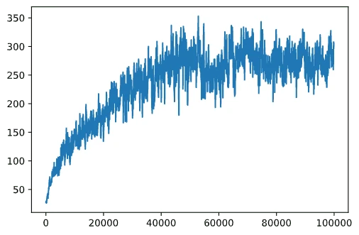

# CartPole Skating

Problemet vi har løst i forrige leksjon kan virke som et lekent problem, ikke virkelig anvendelig for virkelige scenarier. Dette er ikke tilfelle, fordi mange virkelige problemer også deler dette scenariet – inkludert å spille Sjakk eller Go. De er like fordi vi også har et brett med gitte regler og en **diskret tilstand**.

## [Pre-forelesningsquiz](https://ff-quizzes.netlify.app/en/ml/)

## Introduksjon

I denne leksjonen vil vi anvende de samme prinsippene for Q-Learning på et problem med **kontinuerlig tilstand**, dvs. en tilstand som gis av ett eller flere reelle tall. Vi vil ta for oss følgende problem:

> **Problem**: Hvis Peter vil komme seg bort fra ulven, må han kunne bevege seg raskere. Vi skal se hvordan Peter kan lære å skøyte, spesielt å holde balansen, ved bruk av Q-Learning.


> Peter og vennene hans blir kreative for å slippe unna ulven! Bilde av [Jen Looper](https://twitter.com/jenlooper)

Vi vil bruke en forenklet versjon av balansering kjent som et **CartPole**-problem. I cartpole-verden har vi en horisontal skyveplanke som kan beveges til venstre eller høyre, og målet er å balansere en vertikal stang på toppen av skyveplanken.


## Forutsetninger

I denne leksjonen vil vi bruke et bibliotek kalt **OpenAI Gym** for å simulere ulike **miljøer**. Du kan kjøre koden for denne leksjonen lokalt (f.eks. fra Visual Studio Code), i så fall åpnes simulasjonen i et nytt vindu. Når du kjører koden online, kan det være nødvendig med noen justeringer, som beskrevet [her](https://towardsdatascience.com/rendering-openai-gym-envs-on-binder-and-google-colab-536f99391cc7).

## OpenAI Gym

I forrige leksjon ble spillregler og tilstand gitt av `Board`-klassen som vi definerte selv. Her vil vi bruke et spesielt **simulert miljø**, som simulerer fysikken bak den balanserende stangen. Et av de mest populære simuleringsmiljøene for trening av forsterkende læringsalgoritmer kalles [Gym](https://gym.openai.com/), som vedlikeholdes av [OpenAI](https://openai.com/). Ved å bruke dette gymmet kan vi lage forskjellige **miljøer** fra cartpole-simulering til Atari-spill.

> **Merk**: Du kan se andre tilgjengelige miljøer i OpenAI Gym [her](https://gym.openai.com/envs/#classic_control). 

Først, la oss installere gym og importere nødvendige biblioteker (kodeblokk 1):

```python
import sys
!{sys.executable} -m pip install gym 

import gym
import matplotlib.pyplot as plt
import numpy as np
import random
```

## Øvelse - initialiser et cartpole-miljø

For å jobbe med et cartpole-balanseringsproblem, må vi initialisere tilsvarende miljø. Hvert miljø er tilknyttet en:

- **Observasjonsrom** som definerer strukturen på informasjonen vi mottar fra miljøet. For cartpole-problemet mottar vi posisjonen til stangen, hastighet og noen andre verdier.

- **Handlingsrom** som definerer mulige handlinger. I vårt tilfelle er handlingsrommet diskret, og består av to handlinger - **venstre** og **høyre**. (kodeblokk 2)

1. For å initialisere, skriv følgende kode:

    ```python
    env = gym.make("CartPole-v1")
    print(env.action_space)
    print(env.observation_space)
    print(env.action_space.sample())
    ```

For å se hvordan miljøet fungerer, la oss kjøre en kort simulering på 100 steg. For hvert steg gir vi en av handlingene som skal utføres – i denne simuleringen velger vi tilfeldig en handling fra `action_space`. 

1. Kjør koden nedenfor og se hva det fører til.

    ✅ Husk at det er anbefalt å kjøre denne koden på en lokal Python-installasjon! (kodeblokk 3)

    ```python
    env.reset()
    
    for i in range(100):
       env.render()
       env.step(env.action_space.sample())
    env.close()
    ```

    Du bør se noe lignende dette bildet:

    

1. Under simuleringen må vi hente observasjoner for å bestemme hvordan vi skal handle. Faktisk returnerer steg-funksjonen nåværende observasjoner, en belønningsfunksjon og done-flagget som indikerer om det gir mening å fortsette simuleringen eller ikke: (kodeblokk 4)

    ```python
    env.reset()
    
    done = False
    while not done:
       env.render()
       obs, rew, done, info = env.step(env.action_space.sample())
       print(f"{obs} -> {rew}")
    env.close()
    ```

    Du vil ende opp med å se noe lignende dette i notatboken:

    ```text
    [ 0.03403272 -0.24301182  0.02669811  0.2895829 ] -> 1.0
    [ 0.02917248 -0.04828055  0.03248977  0.00543839] -> 1.0
    [ 0.02820687  0.14636075  0.03259854 -0.27681916] -> 1.0
    [ 0.03113408  0.34100283  0.02706215 -0.55904489] -> 1.0
    [ 0.03795414  0.53573468  0.01588125 -0.84308041] -> 1.0
    ...
    [ 0.17299878  0.15868546 -0.20754175 -0.55975453] -> 1.0
    [ 0.17617249  0.35602306 -0.21873684 -0.90998894] -> 1.0
    ```

    Observasjonsvektoren som returneres for hvert steg i simuleringen inneholder følgende verdier:
    - Posisjon til vognen
    - Hastighet til vognen
    - Vinkel på stangen
    - Rotasjonshastighet til stangen

1. Finn minste og største verdi av disse tallene: (kodeblokk 5)

    ```python
    print(env.observation_space.low)
    print(env.observation_space.high)
    ```

    Du vil også legge merke til at belønningsverdien ved hvert simuleringssteg alltid er 1. Dette er fordi målet vårt er å overleve så lenge som mulig, altså holde stangen i en rimelig vertikal posisjon over lengst mulig tid.

    ✅ Faktisk regnes CartPole-simuleringen som løst hvis vi klarer å få gjennomsnittlig belønning på 195 over 100 påfølgende forsøk.

## Tilstandsdiskretisering

I Q-Learning må vi bygge en Q-tabell som definerer hva som skal gjøres i hver tilstand. For å kunne gjøre dette, må tilstanden være **diskret**, nærmere bestemt bør den inneholde et endelig antall diskrete verdier. Dermed må vi på en eller annen måte **diskretisere** observasjonene våre, og mappe dem til et endelig sett av tilstander.

Det finnes noen måter vi kan gjøre dette på:

- **Dele opp i biner**. Hvis vi kjenner intervallet til en viss verdi, kan vi dele dette intervallet inn i et antall **biner**, og deretter erstatte verdien med bin-nummeret den tilhører. Dette kan gjøres med numpy [`digitize`](https://numpy.org/doc/stable/reference/generated/numpy.digitize.html)-metoden. I dette tilfellet vil vi nøyaktig vite størrelsen på tilstanden, fordi den vil avhenge av antallet biner vi velger for digitaliseringen.
  
✅ Vi kan bruke lineær interpolasjon for å bringe verdiene til et endelig intervall (si fra -20 til 20), og deretter konvertere tallene til heltall ved å runde dem av. Dette gir oss litt mindre kontroll på størrelsen av tilstanden, spesielt hvis vi ikke kjenner de eksakte områdene for inputverdiene. For eksempel har 2 av de 4 verdiene i vårt tilfelle ikke øvre/nedre grenser på verdiene sine, noe som kan resultere i et uendelig antall tilstander.

I vårt eksempel vil vi gå for den andre tilnærmingen. Som du kanskje merker senere, til tross for udefinerte øvre/nedre grenser, er det sjeldent at disse verdiene tar verdier utenfor visse endelige intervaller, dermed vil tilstander med ekstreme verdier være svært sjeldne.

1. Her er funksjonen som tar observasjonen fra modellen vår og produserer en tuple av 4 heltall: (kodeblokk 6)

    ```python
    def discretize(x):
        return tuple((x/np.array([0.25, 0.25, 0.01, 0.1])).astype(np.int))
    ```

1. La oss også utforske en annen diskretiseringsmetode ved bruk av biner: (kodeblokk 7)

    ```python
    def create_bins(i,num):
        return np.arange(num+1)*(i[1]-i[0])/num+i[0]
    
    print("Sample bins for interval (-5,5) with 10 bins\n",create_bins((-5,5),10))
    
    ints = [(-5,5),(-2,2),(-0.5,0.5),(-2,2)] # intervaller av verdier for hver parameter
    nbins = [20,20,10,10] # antall bøtter for hver parameter
    bins = [create_bins(ints[i],nbins[i]) for i in range(4)]
    
    def discretize_bins(x):
        return tuple(np.digitize(x[i],bins[i]) for i in range(4))
    ```

1. La oss nå kjøre en kort simulering og observere de diskrete miljøverdiene. Prøv gjerne både `discretize` og `discretize_bins` og se om det er noen forskjell.

    ✅ discretize_bins returnerer bin nummeret, som er 0-basert. Dermed for verdier av inputvariabelen rundt 0 returnerer den tallet fra midten av intervallet (10). I discretize brydde vi oss ikke om utfallsområdet, slik at de kunne være negative, derfor er tilstandsverdiene ikke forskjøvet, og 0 tilsvarer 0. (kodeblokk 8)

    ```python
    env.reset()
    
    done = False
    while not done:
       #env.render()
       obs, rew, done, info = env.step(env.action_space.sample())
       #print(discretize_bins(obs))
       print(discretize(obs))
    env.close()
    ```

    ✅ Fjern kommentaren på linjen som begynner med env.render hvis du vil se hvordan miljøet utføres. Ellers kan du kjøre det i bakgrunnen, som er raskere. Vi vil bruke denne "usynlige" utførelsen under Q-Learning-prosessen vår.

## Strukturen på Q-tabellen

I vår forrige leksjon var tilstanden et enkelt par av tall fra 0 til 8, og det var derfor praktisk å representere Q-tabellen som et numpy-tensor med form 8x8x2. Hvis vi bruker binnediskretisering vet vi også størrelsen på tilstandsvektoren, så vi kan bruke samme tilnærming og representere tilstanden som et array med form 20x20x10x10x2 (her er 2 dimensjonen til handlingsrommet, og de første dimensjonene tilsvarer antallet biner vi har valgt for hver av parameterne i observasjonsrommet).

Men noen ganger kjenner vi ikke de presise dimensjonene til observasjonsrommet. I tilfellet med `discretize`-funksjonen vet vi kanskje aldri at tilstanden holder seg innen visse grenser, fordi noen av de opprinnelige verdiene ikke er begrenset. Derfor vil vi bruke en litt annerledes tilnærming og representere Q-tabellen som en ordbok (dictionary). 

1. Bruk paret *(state,action)* som nøkkel i ordboken, og verdien tilsvarer Q-tabellens oppføringsverdi. (kodeblokk 9)

    ```python
    Q = {}
    actions = (0,1)
    
    def qvalues(state):
        return [Q.get((state,a),0) for a in actions]
    ```

    Her definerer vi også en funksjon `qvalues()`, som returnerer en liste med Q-tabellverdier for en gitt tilstand som tilsvarer alle mulige handlinger. Hvis oppføringen ikke finnes i Q-tabellen, returnerer vi 0 som standard.

## La oss starte med Q-Learning

Nå er vi klare til å lære Peter å balansere!

1. Først, la oss sette noen hyperparametere: (kodeblokk 10)

    ```python
    # hyperparametere
    alpha = 0.3
    gamma = 0.9
    epsilon = 0.90
    ```

    Her er `alpha` **læringsraten** som definerer i hvilken grad vi skal justere de nåværende verdiene i Q-tabellen ved hvert steg. I forrige leksjon startet vi med 1, og deretter reduserte vi `alpha` til lavere verdier under treningen. I dette eksempelet holder vi den konstant for enkelhets skyld, og du kan eksperimentere med å justere `alpha`-verdiene senere.

    `gamma` er **diskonteringsfaktoren** som viser i hvilken grad vi bør prioritere fremtidig belønning over nåværende belønning.

    `epsilon` er **utforsknings-/utnyttelsesfaktor** som bestemmer om vi bør foretrekke utforsking framfor utnyttelse eller omvendt. I algoritmen vil vi i `epsilon` prosent av tilfellene velge neste handling ut ifra Q-tabellverdiene, og i resten av tilfellene vil vi utføre en tilfeldig handling. Dette lar oss utforske områder av søkeområdet vi ikke har sett før. 

    ✅ Når det gjelder balansering – å velge en tilfeldig handling (utforsking) vil være som et tilfeldig slag i feil retning, og stangen må lære seg å gjenopprette balansen etter disse "feilene".

### Forbedre algoritmen

Vi kan også gjøre to forbedringer i algoritmen vår fra forrige leksjon:

- **Beregn gjennomsnittlig kumulativ belønning**, over et antall simuleringer. Vi vil skrive ut progresjonen hver 5000. iterasjon, og vi vil ta gjennomsnittet av kumulativ belønning over denne perioden. Det betyr at hvis vi oppnår mer enn 195 poeng – kan vi anse problemet som løst, og til og med med bedre kvalitet enn påkrevd.
  
- **Beregn maksimal gjennomsnittlig kumulativ belønning**, `Qmax`, og vi vil lagre Q-tabellen som tilsvarer dette resultatet. Når du kjører treningen vil du merke at noen ganger begynner den gjennomsnittlige kumulative belønningen å falle, og vi ønsker å beholde verdiene i Q-tabellen som tilsvarer den beste modellen observert under treningen.

1. Samle alle kumulative belønninger for hver simulering i vektoren `rewards` for videre plotting. (kodeblokk  11)

    ```python
    def probs(v,eps=1e-4):
        v = v-v.min()+eps
        v = v/v.sum()
        return v
    
    Qmax = 0
    cum_rewards = []
    rewards = []
    for epoch in range(100000):
        obs = env.reset()
        done = False
        cum_reward=0
        # == kjør simuleringen ==
        while not done:
            s = discretize(obs)
            if random.random()<epsilon:
                # utnyttelse - valgte handlingen i henhold til Q-tabellens sannsynligheter
                v = probs(np.array(qvalues(s)))
                a = random.choices(actions,weights=v)[0]
            else:
                # utforskning - valgte handlingen tilfeldig
                a = np.random.randint(env.action_space.n)
    
            obs, rew, done, info = env.step(a)
            cum_reward+=rew
            ns = discretize(obs)
            Q[(s,a)] = (1 - alpha) * Q.get((s,a),0) + alpha * (rew + gamma * max(qvalues(ns)))
        cum_rewards.append(cum_reward)
        rewards.append(cum_reward)
        # == Skriv periodisk ut resultater og beregn gjennomsnittlig belønning ==
        if epoch%5000==0:
            print(f"{epoch}: {np.average(cum_rewards)}, alpha={alpha}, epsilon={epsilon}")
            if np.average(cum_rewards) > Qmax:
                Qmax = np.average(cum_rewards)
                Qbest = Q
            cum_rewards=[]
    ```

Hva du kan legge merke til ut ifra disse resultatene:

- **Nær målet vårt**. Vi er veldig nær å oppnå målet om å få 195 kumulative belønninger i 100+ påfølgende simuleringer, eller vi har faktisk oppnådd det! Selv om vi får lavere tall, vet vi fortsatt ikke sikkert, fordi vi tar gjennomsnitt over 5000 kjøringer, mens bare 100 kjøringer kreves i det formelle kriteriet.
  
- **Belønningen begynner å falle**. Noen ganger begynner belønningen å falle, noe som betyr at vi kan "ødelegge" allerede lærte verdier i Q-tabellen med nye verdier som gjør situasjonen verre.

Denne observasjonen blir tydeligere hvis vi plotter treningsprogresjonen.

## Plotting av treningsprogresjon

Under treningen har vi samlet kumulativ belønningsverdi for hver iterasjon i vektoren `rewards`. Slik ser det ut når vi plottet det mot iterasjonsnummeret:

```python
plt.plot(rewards)
```


Fra denne grafen er det ikke mulig å si noe, fordi på grunn av naturen til den stokastiske treningsprosessen varierer lengden på treningsøktene mye. For å gjøre denne grafen mer mening kan vi beregne **løpende gjennomsnitt** over en serie eksperimenter, for eksempel 100. Dette kan gjøres komfortabelt ved hjelp av `np.convolve`: (kodeblokk 12)

```python
def running_average(x,window):
    return np.convolve(x,np.ones(window)/window,mode='valid')

plt.plot(running_average(rewards,100))
```



## Varierende hyperparametere

For å gjøre læringen mer stabil, gir det mening å justere noen av hyperparameterne våre under treningen. Spesielt:

- **For læringsraten**, `alpha`, kan vi starte med verdier nær 1, og så gradvis redusere parameteren. Med tid vil vi få gode sannsynlighetsverdier i Q-tabellen, og vi bør dermed justere dem litt, og ikke overskrive fullstendig med nye verdier.

- **Øke epsilon**. Vi kan ønske å øke `epsilon` gradvis, for å utforske mindre og utnytte mer. Det gir nok mening å starte med en lavere verdi av `epsilon` og bevege seg opp til nesten 1.

> **Oppgave 1**: Lek med hyperparameterverdier og se om du kan oppnå høyere kumulativ belønning. Oppnår du mer enn 195?


> **Oppgave 2**: For å formelt løse problemet, må du oppnå 195 i gjennomsnittlig belønning over 100 påfølgende runder. Mål dette under treningen og sørg for at du formelt har løst problemet!

## Se resultatet i aksjon

Det ville vært interessant å faktisk se hvordan den trente modellen oppfører seg. La oss kjøre simuleringen og følge samme handlingsvalgstrategi som under treningen, sampling i henhold til sannsynlighetsfordelingen i Q-tabellen: (kodeblokk 13)

```python
obs = env.reset()
done = False
while not done:
   s = discretize(obs)
   env.render()
   v = probs(np.array(qvalues(s)))
   a = random.choices(actions,weights=v)[0]
   obs,_,done,_ = env.step(a)
env.close()
```

Du bør se noe slikt:


---

## 🚀Utfordring

> **Oppgave 3**: Her brukte vi den siste kopien av Q-tabellen, som kanskje ikke er den beste. Husk at vi har lagret den beste presterende Q-tabellen i variabelen `Qbest`! Prøv det samme eksempelet med den beste presterende Q-tabellen ved å kopiere `Qbest` over til `Q` og se om du merker forskjellen.

> **Oppgave 4**: Her valgte vi ikke den beste handlingen i hvert steg, men i stedet sampling med tilhørende sannsynlighetsfordeling. Ville det vært mer fornuftig å alltid velge den beste handlingen, med høyest Q-tabellverdi? Dette kan gjøres ved å bruke `np.argmax`-funksjonen for å finne handlingsnummeret som tilsvarer høyest Q-tabellverdi. Implementer denne strategien og se om det forbedrer balanseringen.

## [Quiz etter forelesning](https://ff-quizzes.netlify.app/en/ml/)

## Oppgave
[Tren en Mountain Car](assignment.md)

## Konklusjon

Vi har nå lært hvordan vi trener agenter til å oppnå gode resultater bare ved å gi dem en belønningsfunksjon som definerer ønsket tilstand i spillet, og ved å gi dem mulighet til intelligent utforskning av søkeområdet. Vi har med suksess brukt Q-Learning-algoritmen i tilfeller med diskrete og kontinuerlige miljøer, men med diskrete handlinger.

Det er viktig å også studere situasjoner der handlingsrommet også er kontinuerlig, og når observasjonsrommet er mye mer komplekst, som bildet fra Atari-spillskjermen. I slike problemer trenger vi ofte å bruke mer kraftfulle maskinlæringsteknikker, som nevrale nettverk, for å oppnå gode resultater. Disse mer avanserte temaene er gjenstand for vårt kommende mer avanserte AI-kurs.

---

<!-- CO-OP TRANSLATOR DISCLAIMER START -->
**Ansvarsfraskrivelse**:
Dette dokumentet er oversatt ved hjelp av AI-oversettelsestjenesten [Co-op Translator](https://github.com/Azure/co-op-translator). Selv om vi streber etter nøyaktighet, vær oppmerksom på at automatiske oversettelser kan inneholde feil eller unøyaktigheter. Det opprinnelige dokumentet på originalspråket skal betraktes som den autoritative kilden. For kritisk informasjon anbefales profesjonell menneskelig oversettelse. Vi er ikke ansvarlige for eventuelle misforståelser eller feiltolkninger som oppstår ved bruk av denne oversettelsen.
<!-- CO-OP TRANSLATOR DISCLAIMER END -->