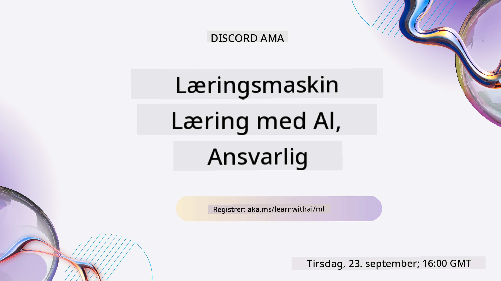
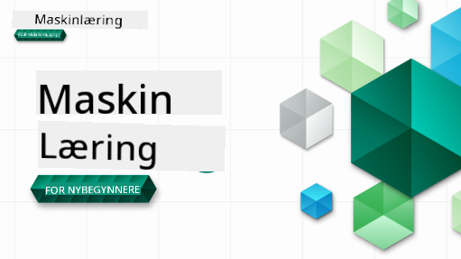

<!--
CO_OP_TRANSLATOR_METADATA:
{
  "original_hash": "a54f98da7bbee99ddc62a9e490eef7dc",
  "translation_date": "2025-09-29T22:04:40+00:00",
  "source_file": "README.md",
  "language_code": "no"
}
-->

### 🌐 Støtte for flere språk

#### Støttet via GitHub Action (Automatisk og alltid oppdatert)

[Fransk](../fr/README.md) | [Spansk](../es/README.md) | [Tysk](../de/README.md) | [Russisk](../ru/README.md) | [Arabisk](../ar/README.md) | [Persisk (Farsi)](../fa/README.md) | [Urdu](../ur/README.md) | [Kinesisk (forenklet)](../zh/README.md) | [Kinesisk (tradisjonell, Macau)](../mo/README.md) | [Kinesisk (tradisjonell, Hong Kong)](../hk/README.md) | [Kinesisk (tradisjonell, Taiwan)](../tw/README.md) | [Japansk](../ja/README.md) | [Koreansk](../ko/README.md) | [Hindi](../hi/README.md) | [Bengali](../bn/README.md) | [Marathi](../mr/README.md) | [Nepali](../ne/README.md) | [Punjabi (Gurmukhi)](../pa/README.md) | [Portugisisk (Portugal)](../pt/README.md) | [Portugisisk (Brasil)](../br/README.md) | [Italiensk](../it/README.md) | [Polsk](../pl/README.md) | [Tyrkisk](../tr/README.md) | [Gresk](../el/README.md) | [Thai](../th/README.md) | [Svensk](../sv/README.md) | [Dansk](../da/README.md) | [Norsk](./README.md) | [Finsk](../fi/README.md) | [Nederlandsk](../nl/README.md) | [Hebraisk](../he/README.md) | [Vietnamesisk](../vi/README.md) | [Indonesisk](../id/README.md) | [Malayisk](../ms/README.md) | [Tagalog (Filippinsk)](../tl/README.md) | [Swahili](../sw/README.md) | [Ungarsk](../hu/README.md) | [Tsjekkisk](../cs/README.md) | [Slovakisk](../sk/README.md) | [Rumensk](../ro/README.md) | [Bulgarsk](../bg/README.md) | [Serbisk (kyrillisk)](../sr/README.md) | [Kroatisk](../hr/README.md) | [Slovensk](../sl/README.md) | [Ukrainsk](../uk/README.md) | [Burmesisk (Myanmar)](../my/README.md)

#### Bli med i vårt fellesskap

Vi har en Discord-serie om læring med AI pågående. Lær mer og bli med oss på [Learn with AI Series](https://aka.ms/learnwithai/discord) fra 18. til 30. september 2025. Du vil få tips og triks om bruk av GitHub Copilot for dataanalyse.

# Maskinlæring for nybegynnere - Et pensum

> 🌍 Reis rundt i verden mens vi utforsker maskinlæring gjennom verdens kulturer 🌍

Cloud Advocates hos Microsoft er glade for å tilby et 12-ukers, 26-leksjons pensum om **maskinlæring**. I dette pensumet vil du lære om det som noen ganger kalles **klassisk maskinlæring**, hovedsakelig ved bruk av Scikit-learn som bibliotek og unngå dyp læring, som dekkes i vårt [AI for Beginners-pensum](https://aka.ms/ai4beginners). Kombiner disse leksjonene med vårt ['Data Science for Beginners'-pensum](https://aka.ms/ds4beginners), også!

Reis med oss rundt i verden mens vi bruker disse klassiske teknikkene på data fra mange områder av verden. Hver leksjon inkluderer quiz før og etter leksjonen, skriftlige instruksjoner for å fullføre leksjonen, en løsning, en oppgave og mer. Vår prosjektbaserte pedagogikk lar deg lære mens du bygger, en bevist måte for nye ferdigheter å "sitte fast".

**✍️ Stor takk til våre forfattere** Jen Looper, Stephen Howell, Francesca Lazzeri, Tomomi Imura, Cassie Breviu, Dmitry Soshnikov, Chris Noring, Anirban Mukherjee, Ornella Altunyan, Ruth Yakubu og Amy Boyd

**🎨 Takk også til våre illustratører** Tomomi Imura, Dasani Madipalli og Jen Looper

**🙏 Spesiell takk 🙏 til våre Microsoft Student Ambassador-forfattere, anmeldere og innholdsbidragsytere**, spesielt Rishit Dagli, Muhammad Sakib Khan Inan, Rohan Raj, Alexandru Petrescu, Abhishek Jaiswal, Nawrin Tabassum, Ioan Samuila og Snigdha Agarwal

**🤩 Ekstra takknemlighet til Microsoft Student Ambassadors Eric Wanjau, Jasleen Sondhi og Vidushi Gupta for våre R-leksjoner!**

# Kom i gang

Følg disse trinnene:
1. **Fork repoen**: Klikk på "Fork"-knappen øverst til høyre på denne siden.
2. **Klon repoen**:   `git clone https://github.com/microsoft/ML-For-Beginners.git`

> [Finn alle tilleggsmaterialer for dette kurset i vår Microsoft Learn-samling](https://learn.microsoft.com/en-us/collections/qrqzamz1nn2wx3?WT.mc_id=academic-77952-bethanycheum)

**[Studenter](https://aka.ms/student-page)**, for å bruke dette pensumet, fork hele repoen til din egen GitHub-konto og fullfør oppgavene alene eller med en gruppe:

- Start med en quiz før leksjonen.
- Les leksjonen og fullfør aktivitetene, ta pauser og reflekter ved hver kunnskapssjekk.
- Prøv å lage prosjektene ved å forstå leksjonene i stedet for å bare kjøre løsningskoden; denne koden er imidlertid tilgjengelig i `/solution`-mappene i hver prosjektorienterte leksjon.
- Ta quiz etter leksjonen.
- Fullfør utfordringen.
- Fullfør oppgaven.
- Etter å ha fullført en leksjonsgruppe, besøk [Diskusjonsforumet](https://github.com/microsoft/ML-For-Beginners/discussions) og "lær høyt" ved å fylle ut den passende PAT-rubrikken. En 'PAT' er et Progress Assessment Tool som er en rubrikk du fyller ut for å fremme læringen din. Du kan også reagere på andre PAT-er slik at vi kan lære sammen.

> For videre studier anbefaler vi å følge disse [Microsoft Learn](https://docs.microsoft.com/en-us/users/jenlooper-2911/collections/k7o7tg1gp306q4?WT.mc_id=academic-77952-leestott)-modulene og læringsstiene.

**Lærere**, vi har [inkludert noen forslag](for-teachers.md) om hvordan du kan bruke dette pensumet.

---

## Videogjennomganger

Noen av leksjonene er tilgjengelige som korte videoer. Du finner alle disse i leksjonene, eller på [ML for Beginners-spillelisten på Microsoft Developer YouTube-kanalen](https://aka.ms/ml-beginners-videos) ved å klikke på bildet nedenfor.

---

## Møt teamet

**Gif av** [Mohit Jaisal](https://linkedin.com/in/mohitjaisal)

> 🎥 Klikk på bildet ovenfor for en video om prosjektet og folkene som skapte det!

---

## Pedagogikk

Vi har valgt to pedagogiske prinsipper mens vi bygde dette pensumet: å sikre at det er praktisk **prosjektbasert** og at det inkluderer **hyppige quizer**. I tillegg har dette pensumet et felles **tema** for å gi det sammenheng.

Ved å sikre at innholdet er knyttet til prosjekter, blir prosessen mer engasjerende for studenter, og begrepsforståelsen vil bli styrket. I tillegg setter en lavterskelquiz før en klasse studentens intensjon mot å lære et emne, mens en andre quiz etter klassen sikrer ytterligere forståelse. Dette pensumet ble designet for å være fleksibelt og morsomt og kan tas i sin helhet eller delvis. Prosjektene starter små og blir stadig mer komplekse mot slutten av den 12-ukers syklusen. Dette pensumet inkluderer også et tillegg om virkelige applikasjoner av ML, som kan brukes som ekstra kreditt eller som grunnlag for diskusjon.

> Finn vår [Code of Conduct](CODE_OF_CONDUCT.md), [Contributing](CONTRIBUTING.md), og [Translation](TRANSLATIONS.md)-retningslinjer. Vi ønsker din konstruktive tilbakemelding velkommen!

## Hver leksjon inkluderer

- valgfri sketchnote
- valgfri tilleggsvideo
- videogjennomgang (kun noen leksjoner)
- [quiz før leksjonen](https://ff-quizzes.netlify.app/en/ml/)
- skriftlig leksjon
- for prosjektbaserte leksjoner, trinnvise guider for hvordan man bygger prosjektet
- kunnskapssjekker
- en utfordring
- tilleggslesing
- oppgave
- [quiz etter leksjonen](https://ff-quizzes.netlify.app/en/ml/)

> **En merknad om språk**: Disse leksjonene er hovedsakelig skrevet i Python, men mange er også tilgjengelige i R. For å fullføre en R-leksjon, gå til `/solution`-mappen og se etter R-leksjoner. De inkluderer en .rmd-utvidelse som representerer en **R Markdown**-fil som enkelt kan defineres som en embedding av `kodeblokker` (av R eller andre språk) og en `YAML-header` (som styrer hvordan man formaterer utganger som PDF) i et `Markdown-dokument`. Som sådan fungerer det som et eksemplarisk forfatterrammeverk for dataanalyse siden det lar deg kombinere koden din, dens utgang og tankene dine ved å skrive dem ned i Markdown. Dessuten kan R Markdown-dokumenter gjengis til utgangsformater som PDF, HTML eller Word.

> **En merknad om quizer**: Alle quizer er inneholdt i [Quiz App-mappen](../../quiz-app), for totalt 52 quizer med tre spørsmål hver. De er lenket fra leksjonene, men quiz-appen kan kjøres lokalt; følg instruksjonene i `quiz-app`-mappen for å kjøre lokalt eller distribuere til Azure.

| Leksjonsnummer |                             Emne                              |                   Leksjonsgruppe                   | Læringsmål                                                                                                                     |                                                              Lenket leksjon                                                               |                        Forfatter                        |
| :-----------: | :------------------------------------------------------------: | :-------------------------------------------------: | ------------------------------------------------------------------------------------------------------------------------------- | :--------------------------------------------------------------------------------------------------------------------------------------: | :--------------------------------------------------: |
|      01       |                Introduksjon til maskinlæring                |      [Introduksjon](1-Introduction/README.md)       | Lær de grunnleggende konseptene bak maskinlæring                                                                                |                                             [Leksjon](1-Introduction/1-intro-to-ML/README.md)                                             |                       Muhammad                       |
|      02       |                Historien til maskinlæring                 |      [Introduksjon](1-Introduction/README.md)       | Lær historien bak dette feltet                                                                                         |                                            [Leksjon](1-Introduction/2-history-of-ML/README.md)                                            |                     Jen og Amy                      |
|      03       |                 Rettferdighet og maskinlæring                  |      [Introduksjon](1-Introduction/README.md)       | Hvilke viktige filosofiske spørsmål rundt rettferdighet bør studenter vurdere når de bygger og bruker ML-modeller? |                                              [Leksjon](1-Introduction/3-fairness/README.md)                                               |                        Tomomi                        |
|      04       |                Teknikker for maskinlæring                      |      [Introduksjon](1-Introduction/README.md)       | Hvilke teknikker bruker ML-forskere for å bygge ML-modeller?                                                                     |                                          [Leksjon](1-Introduction/4-techniques-of-ML/README.md)                                           |                    Chris og Jen                     |
|      05       |                   Introduksjon til regresjon                   |        [Regresjon](2-Regression/README.md)          | Kom i gang med Python og Scikit-learn for regresjonsmodeller                                                                     |         [Python](2-Regression/1-Tools/README.md) • [R](../../2-Regression/1-Tools/solution/R/lesson_1.html)         |      Jen • Eric Wanjau       |
|      06       |                Nordamerikanske gresskarpriser 🎃               |        [Regresjon](2-Regression/README.md)          | Visualiser og rengjør data som forberedelse til ML                                                                               |          [Python](2-Regression/2-Data/README.md) • [R](../../2-Regression/2-Data/solution/R/lesson_2.html)          |      Jen • Eric Wanjau       |
|      07       |                Nordamerikanske gresskarpriser 🎃               |        [Regresjon](2-Regression/README.md)          | Bygg lineære og polynomiske regresjonsmodeller                                                                                   |        [Python](2-Regression/3-Linear/README.md) • [R](../../2-Regression/3-Linear/solution/R/lesson_3.html)        |      Jen og Dmitry • Eric Wanjau       |
|      08       |                Nordamerikanske gresskarpriser 🎃               |        [Regresjon](2-Regression/README.md)          | Bygg en logistisk regresjonsmodell                                                                                              |     [Python](2-Regression/4-Logistic/README.md) • [R](../../2-Regression/4-Logistic/solution/R/lesson_4.html)      |      Jen • Eric Wanjau       |
|      09       |                          En webapp 🔌                          |           [Webapp](3-Web-App/README.md)             | Bygg en webapp for å bruke din trente modell                                                                                     |                                                 [Python](3-Web-App/1-Web-App/README.md)                                                  |                         Jen                          |
|      10       |                 Introduksjon til klassifisering                |    [Klassifisering](4-Classification/README.md)     | Rengjør, forbered og visualiser dataene dine; introduksjon til klassifisering                                                   | [Python](4-Classification/1-Introduction/README.md) • [R](../../4-Classification/1-Introduction/solution/R/lesson_10.html)  | Jen og Cassie • Eric Wanjau |
|      11       |             Deilige asiatiske og indiske retter 🍜             |    [Klassifisering](4-Classification/README.md)     | Introduksjon til klassifikatorer                                                                                                 | [Python](4-Classification/2-Classifiers-1/README.md) • [R](../../4-Classification/2-Classifiers-1/solution/R/lesson_11.html) | Jen og Cassie • Eric Wanjau |
|      12       |             Deilige asiatiske og indiske retter 🍜             |    [Klassifisering](4-Classification/README.md)     | Flere klassifikatorer                                                                                                            | [Python](4-Classification/3-Classifiers-2/README.md) • [R](../../4-Classification/3-Classifiers-2/solution/R/lesson_12.html) | Jen og Cassie • Eric Wanjau |
|      13       |             Deilige asiatiske og indiske retter 🍜             |    [Klassifisering](4-Classification/README.md)     | Bygg en anbefalingswebapp ved hjelp av modellen din                                                                             |                                              [Python](4-Classification/4-Applied/README.md)                                              |                         Jen                          |
|      14       |                   Introduksjon til klynging                    |        [Klynging](5-Clustering/README.md)           | Rengjør, forbered og visualiser dataene dine; introduksjon til klynging                                                         |         [Python](5-Clustering/1-Visualize/README.md) • [R](../../5-Clustering/1-Visualize/solution/R/lesson_14.html)         |      Jen • Eric Wanjau       |
|      15       |              Utforsking av nigerianske musikksmaker 🎧         |        [Klynging](5-Clustering/README.md)           | Utforsk K-Means klyngemetoden                                                                                                   |           [Python](5-Clustering/2-K-Means/README.md) • [R](../../5-Clustering/2-K-Means/solution/R/lesson_15.html)           |      Jen • Eric Wanjau       |
|      16       |        Introduksjon til naturlig språkbehandling ☕️           |   [Naturlig språkbehandling](6-NLP/README.md)       | Lær det grunnleggende om NLP ved å bygge en enkel bot                                                                           |                                             [Python](6-NLP/1-Introduction-to-NLP/README.md)                                              |                       Stephen                        |
|      17       |                      Vanlige NLP-oppgaver ☕️                   |   [Naturlig språkbehandling](6-NLP/README.md)       | Fordyp deg i NLP ved å forstå vanlige oppgaver som kreves når man arbeider med språkstrukturer                                   |                                                    [Python](6-NLP/2-Tasks/README.md)                                                     |                       Stephen                        |
|      18       |             Oversettelse og sentimentanalyse ♥️               |   [Naturlig språkbehandling](6-NLP/README.md)       | Oversettelse og sentimentanalyse med Jane Austen                                                                                |                                            [Python](6-NLP/3-Translation-Sentiment/README.md)                                             |                       Stephen                        |
|      19       |                  Romantiske hoteller i Europa ♥️              |   [Naturlig språkbehandling](6-NLP/README.md)       | Sentimentanalyse med hotellanmeldelser 1                                                                                       |                                               [Python](6-NLP/4-Hotel-Reviews-1/README.md)                                                |                       Stephen                        |
|      20       |                  Romantiske hoteller i Europa ♥️              |   [Naturlig språkbehandling](6-NLP/README.md)       | Sentimentanalyse med hotellanmeldelser 2                                                                                       |                                               [Python](6-NLP/5-Hotel-Reviews-2/README.md)                                                |                       Stephen                        |
|      21       |            Introduksjon til tidsserieprognoser                 |        [Tidsserier](7-TimeSeries/README.md)         | Introduksjon til tidsserieprognoser                                                                                            |                                             [Python](7-TimeSeries/1-Introduction/README.md)                                              |                      Francesca                       |
|      22       | ⚡️ Verdens strømforbruk ⚡️ - tidsserieprognoser med ARIMA     |        [Tidsserier](7-TimeSeries/README.md)         | Tidsserieprognoser med ARIMA                                                                                                   |                                                 [Python](7-TimeSeries/2-ARIMA/README.md)                                                 |                      Francesca                       |
|      23       | ⚡️ Verdens strømforbruk ⚡️ - tidsserieprognoser med SVR       |        [Tidsserier](7-TimeSeries/README.md)         | Tidsserieprognoser med Support Vector Regressor                                                                                |                                                  [Python](7-TimeSeries/3-SVR/README.md)                                                  |                       Anirban                        |
|      24       |             Introduksjon til forsterkende læring              | [Forsterkende læring](8-Reinforcement/README.md)    | Introduksjon til forsterkende læring med Q-Learning                                                                            |                                             [Python](8-Reinforcement/1-QLearning/README.md)                                              |                        Dmitry                        |
|      25       |                 Hjelp Peter å unngå ulven! 🐺                  | [Forsterkende læring](8-Reinforcement/README.md)    | Forsterkende læring med Gym                                                                                                    |                                                [Python](8-Reinforcement/2-Gym/README.md)                                                 |                        Dmitry                        |
|  Postscript   |            Virkelige ML-scenarier og applikasjoner            |      [ML i praksis](9-Real-World/README.md)         | Interessante og avslørende virkelige applikasjoner av klassisk ML                                                              |                                             [Leksjon](9-Real-World/1-Applications/README.md)                                              |                         Team                         |
|  Postscript   |            Modellfeilsøking i ML med RAI-dashboard            |      [ML i praksis](9-Real-World/README.md)         | Modellfeilsøking i maskinlæring ved bruk av Responsible AI-dashboardkomponenter                                                |                                             [Leksjon](9-Real-World/2-Debugging-ML-Models/README.md)                                              |                         Ruth Yakubu                       |

> [finn alle tilleggsmaterialer for dette kurset i vår Microsoft Learn-samling](https://learn.microsoft.com/en-us/collections/qrqzamz1nn2wx3?WT.mc_id=academic-77952-bethanycheum)

## Offline tilgang

Du kan kjøre denne dokumentasjonen offline ved å bruke [Docsify](https://docsify.js.org/#/). Fork dette repoet, [installer Docsify](https://docsify.js.org/#/quickstart) på din lokale maskin, og skriv deretter `docsify serve` i rotmappen til dette repoet. Nettstedet vil bli servert på port 3000 på din localhost: `localhost:3000`.

## PDF-er

Finn en PDF av læreplanen med lenker [her](https://microsoft.github.io/ML-For-Beginners/pdf/readme.pdf).

## 🎒 Andre kurs 

Teamet vårt produserer andre kurs! Sjekk ut:

- [Edge AI for nybegynnere](https://aka.ms/edgeai-for-beginners)
- [AI-agenter for nybegynnere](https://aka.ms/ai-agents-beginners)
- [Generativ AI for nybegynnere](https://aka.ms/genai-beginners)
- [Generativ AI for nybegynnere .NET](https://github.com/microsoft/Generative-AI-for-beginners-dotnet)
- [Generativ AI med JavaScript](https://github.com/microsoft/generative-ai-with-javascript)
- [Generativ AI med Java](https://github.com/microsoft/Generative-AI-for-beginners-java)
- [AI for nybegynnere](https://aka.ms/ai-beginners)
- [Data Science for nybegynnere](https://aka.ms/datascience-beginners)
- [ML for nybegynnere](https://aka.ms/ml-beginners)
- [Cybersikkerhet for nybegynnere](https://github.com/microsoft/Security-101) 
- [Webutvikling for nybegynnere](https://aka.ms/webdev-beginners)
- [IoT for nybegynnere](https://aka.ms/iot-beginners)
- [XR-utvikling for nybegynnere](https://github.com/microsoft/xr-development-for-beginners)
- [Mestre GitHub Copilot for parprogrammering](https://github.com/microsoft/Mastering-GitHub-Copilot-for-Paired-Programming)
- [Mestre GitHub Copilot for C#/.NET-utviklere](https://github.com/microsoft/mastering-github-copilot-for-dotnet-csharp-developers)
- [Velg ditt eget Copilot-eventyr](https://github.com/microsoft/CopilotAdventures)

---

**Ansvarsfraskrivelse**:  
Dette dokumentet er oversatt ved hjelp av AI-oversettelsestjenesten [Co-op Translator](https://github.com/Azure/co-op-translator). Selv om vi tilstreber nøyaktighet, vær oppmerksom på at automatiserte oversettelser kan inneholde feil eller unøyaktigheter. Det originale dokumentet på sitt opprinnelige språk bør anses som den autoritative kilden. For kritisk informasjon anbefales profesjonell menneskelig oversettelse. Vi er ikke ansvarlige for eventuelle misforståelser eller feiltolkninger som oppstår ved bruk av denne oversettelsen.