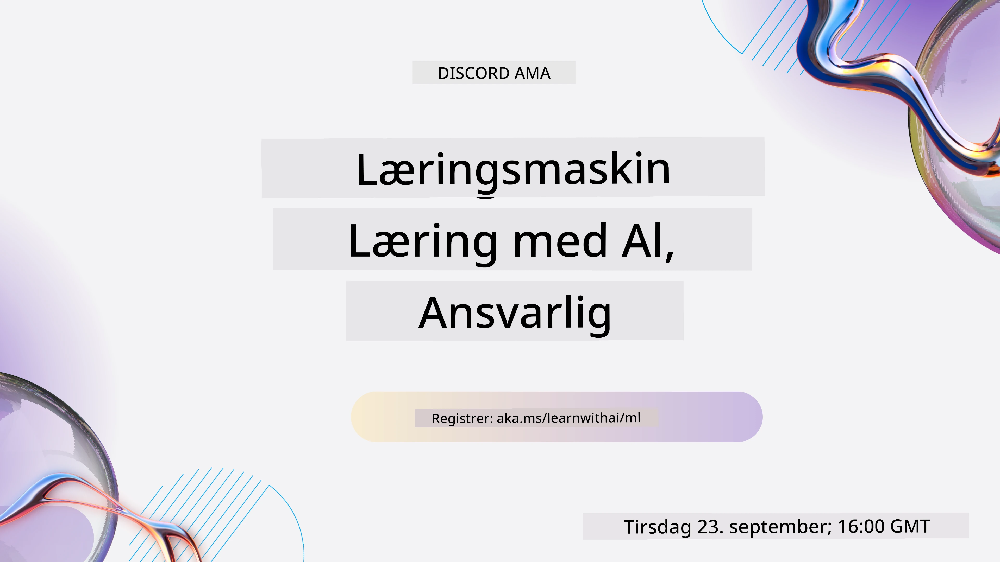
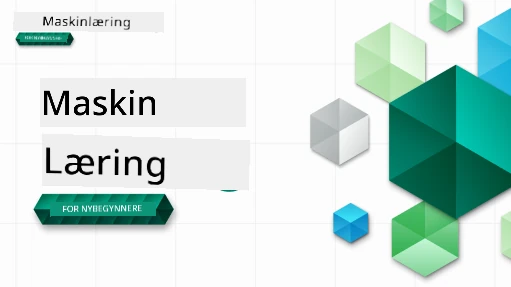

[](https://github.com/microsoft/ML-For-Beginners/blob/master/LICENSE)
[](https://GitHub.com/microsoft/ML-For-Beginners/graphs/contributors/)
[](https://GitHub.com/microsoft/ML-For-Beginners/issues/)
[](https://GitHub.com/microsoft/ML-For-Beginners/pulls/)
[](http://makeapullrequest.com)

[](https://GitHub.com/microsoft/ML-For-Beginners/watchers/)
[](https://GitHub.com/microsoft/ML-For-Beginners/network/)
[](https://GitHub.com/microsoft/ML-For-Beginners/stargazers/)

### 🌐 Støtte for flere språk

#### Støttet via GitHub Action (automatisert og alltid oppdatert)

<!-- CO-OP TRANSLATOR LANGUAGES TABLE START -->
[Arabisk](../ar/README.md) | [Bengali](../bn/README.md) | [Bulgarsk](../bg/README.md) | [Burmesisk (Myanmar)](../my/README.md) | [Kinesisk (forenklet)](../zh-CN/README.md) | [Kinesisk (tradisjonelt, Hong Kong)](../zh-HK/README.md) | [Kinesisk (tradisjonelt, Macau)](../zh-MO/README.md) | [Kinesisk (tradisjonelt, Taiwan)](../zh-TW/README.md) | [Kroatisk](../hr/README.md) | [Tsjekkisk](../cs/README.md) | [Dansk](../da/README.md) | [Nederlandsk](../nl/README.md) | [Estisk](../et/README.md) | [Finsk](../fi/README.md) | [Fransk](../fr/README.md) | [Tysk](../de/README.md) | [Gresk](../el/README.md) | [Hebraisk](../he/README.md) | [Hindi](../hi/README.md) | [Ungarsk](../hu/README.md) | [Indonesisk](../id/README.md) | [Italiensk](../it/README.md) | [Japansk](../ja/README.md) | [Kannada](../kn/README.md) | [Khmer](../km/README.md) | [Koreansk](../ko/README.md) | [Litauisk](../lt/README.md) | [Malayisk](../ms/README.md) | [Malayalam](../ml/README.md) | [Marathi](../mr/README.md) | [Nepali](../ne/README.md) | [Nigeriansk pidgin](../pcm/README.md) | [Norsk](./README.md) | [Persisk (Farsi)](../fa/README.md) | [Polsk](../pl/README.md) | [Portugisisk (Brasil)](../pt-BR/README.md) | [Portugisisk (Portugal)](../pt-PT/README.md) | [Punjabi (Gurmukhi)](../pa/README.md) | [Rumensk](../ro/README.md) | [Russisk](../ru/README.md) | [Serbisk (kyrillisk)](../sr/README.md) | [Slovakisk](../sk/README.md) | [Slovensk](../sl/README.md) | [Spansk](../es/README.md) | [Swahili](../sw/README.md) | [Svensk](../sv/README.md) | [Tagalog (Filippinsk)](../tl/README.md) | [Tamil](../ta/README.md) | [Telugu](../te/README.md) | [Thai](../th/README.md) | [Tyrkisk](../tr/README.md) | [Ukrainsk](../uk/README.md) | [Urdu](../ur/README.md) | [Vietnamesisk](../vi/README.md)

> **Foretrekker du å klone lokalt?**
>
> Dette depotet inkluderer 50+ språkoversettelser som betydelig øker nedlastingsstørrelsen. For å klone uten oversettelser, bruk sparsjekk ut:
>
> **Bash / macOS / Linux:**
> ```bash
> git clone --filter=blob:none --sparse https://github.com/microsoft/ML-For-Beginners.git
> cd ML-For-Beginners
> git sparse-checkout set --no-cone '/*' '!translations' '!translated_images'
> ```
>
> **CMD (Windows):**
> ```cmd
> git clone --filter=blob:none --sparse https://github.com/microsoft/ML-For-Beginners.git
> cd ML-For-Beginners
> git sparse-checkout set --no-cone "/*" "!translations" "!translated_images"
> ```
>
> Dette gir deg alt du trenger for å fullføre kurset med mye raskere nedlastning.
<!-- CO-OP TRANSLATOR LANGUAGES TABLE END -->

#### Bli med i vårt fellesskap

[](https://discord.gg/nTYy5BXMWG)

Vi har en Discord-serie "Learn with AI" pågående, lær mer og bli med oss på [Learn with AI Series](https://aka.ms/learnwithai/discord) fra 18. til 30. september 2025. Du vil få tips og triks for å bruke GitHub Copilot for Data Science.



# Maskinlæring for nybegynnere - Et pensum

> 🌍 Reis rundt i verden mens vi utforsker Maskinlæring gjennom verdens kulturer 🌍

Cloud Advocates hos Microsoft er glade for å tilby et 12-ukers, 26-leksjons pensum som handler om **Maskinlæring**. I dette pensumet vil du lære om det som noen ganger kalles **klassisk maskinlæring**, der vi primært bruker Scikit-learn som bibliotek og unngår dyp læring, som dekkes i vårt [AI for Beginners' pensum](https://aka.ms/ai4beginners). Kombiner disse leksjonene med vårt ['Data Science for Beginners'-pensum](https://aka.ms/ds4beginners), også!

Reis med oss rundt i verden mens vi anvender disse klassiske teknikkene på data fra mange deler av verden. Hver leksjon inkluderer quiz før og etter leksjon, skriftlige instruksjoner for å fullføre leksjonen, en løsning, en oppgave, og mer. Vår prosjektbaserte pedagogikk lar deg lære mens du bygger, en bevist måte for nye ferdigheter å feste seg.

**✍️ Hjertelig takk til våre forfattere** Jen Looper, Stephen Howell, Francesca Lazzeri, Tomomi Imura, Cassie Breviu, Dmitry Soshnikov, Chris Noring, Anirban Mukherjee, Ornella Altunyan, Ruth Yakubu og Amy Boyd

**🎨 Takk også til våre illustratører** Tomomi Imura, Dasani Madipalli og Jen Looper

**🙏 Spesiell takk 🙏 til våre Microsoft Student Ambassador-forfattere, -anmeldere og -innholdsmedarbeidere**, spesielt Rishit Dagli, Muhammad Sakib Khan Inan, Rohan Raj, Alexandru Petrescu, Abhishek Jaiswal, Nawrin Tabassum, Ioan Samuila, og Snigdha Agarwal

**🤩 Ekstra takk til Microsoft Student Ambassadors Eric Wanjau, Jasleen Sondhi og Vidushi Gupta for våre R-leksjoner!**

# Kom i gang

Følg disse trinnene:
1. **Fork depotet**: Klikk på "Fork" knappen oppe til høyre på denne siden.
2. **Klon depotet**:   `git clone https://github.com/microsoft/ML-For-Beginners.git`

> 💡 **Rask start-tip:** Vil du starte i en nettleser uten å sette opp Python lokalt? Bruk [GitHub Codespaces](https://github.com/features/codespaces) for å opprette et skyutviklingsmiljø for din fork. Åpne den grønne **Code** menyen, velg **Codespaces**, og opprett et codespace; installer hver leksjons nødvendige avhengigheter innenfor det etter behov.

> [finn alle ekstra ressurser for dette kurset i vår Microsoft Learn-samling](https://learn.microsoft.com/en-us/collections/qrqzamz1nn2wx3?WT.mc_id=academic-77952-bethanycheum)

> 🔧 **Trenger du hjelp?** Sjekk vår [Feilsøkingsguide](TROUBLESHOOTING.md) for løsninger på vanlige problemer med installasjon, oppsett og kjøring av leksjoner.


**[Studenter](https://aka.ms/student-page)**, for å bruke dette pensumet, forke hele repoet til din egen GitHub-konto og fullfør øvelsene alene eller i gruppe:

- Start med en quiz før forelesningen.
- Les forelesningen og fullfør aktivitetene, stopp og reflekter ved hver kunnskapskontroll.
- Prøv å lage prosjektene ved å forstå leksjonene i stedet for å kjøre løsningskoden; men den koden er tilgjengelig i `/solution` mappene i hver prosjektorientert leksjon.
- Ta quiz etter forelesningen.
- Fullfør utfordringen.
- Fullfør oppgaven.
- Etter å ha fullført en leksjonsgruppe, besøk [Diskusjonsforum](https://github.com/microsoft/ML-For-Beginners/discussions) og "lær høyt" ved å fylle ut riktig PAT-rubrik. Et 'PAT' er et verktøy for progresjonsvurdering som er en rubrikk du fyller ut for å fremme læringen videre. Du kan også reagere på andres PAT-er slik at vi kan lære sammen.

> For videre studier anbefaler vi å følge disse [Microsoft Learn](https://docs.microsoft.com/en-us/users/jenlooper-2911/collections/k7o7tg1gp306q4?WT.mc_id=academic-77952-leestott) modulene og læringsstiene.

**Lærere**, vi har [inkludert noen forslag](for-teachers.md) om hvordan bruke dette pensumet.

---

## Videogjennomganger

Noen av leksjonene er tilgjengelige som korte videoer. Du finner alle disse integrert i leksjonene, eller på [ML for Beginners spillelisten på Microsoft Developer YouTube-kanalen](https://aka.ms/ml-beginners-videos) ved å klikke på bildet under.

[](https://aka.ms/ml-beginners-videos)

---

## Møt teamet

[](https://youtu.be/Tj1XWrDSYJU)

**Gif av** [Mohit Jaisal](https://linkedin.com/in/mohitjaisal)

> 🎥 Klikk på bildet over for en video om prosjektet og personene som laget det!

---

## Pedagogikk

Vi har valgt to pedagogiske prinsipper mens vi bygde dette pensumet: å sikre at det er praktisk og **prosjektbasert**, og at det inkluderer **hyppige quizer**. I tillegg har dette pensumet et felles **tema** for å gi det sammenheng.

Ved å sikre at innholdet stemmer overens med prosjektene, blir prosessen mer engasjerende for studentene og begrepsfestingen styrkes. I tillegg setter en quiz med lav innsats før en time studentens intensjon om å lære et emne, mens en andre quiz etter timen sikrer ytterligere forståelse. Dette pensumet er designet for å være fleksibelt og morsomt, og kan tas helt eller delvis. Prosjektene starter smått og blir gradvis mer komplekse mot slutten av 12-ukerssyklusen. Dette pensumet inkluderer også et etterskrift om virkelige anvendelser av ML, som kan brukes som ekstra kreditt eller som grunnlag for diskusjon.

> Finn våre retningslinjer for [Atferdskodeks](CODE_OF_CONDUCT.md), [Bidrag](CONTRIBUTING.md), [Oversettelser](..), og [Feilsøking](TROUBLESHOOTING.md). Vi ønsker din konstruktive tilbakemelding velkommen!

## Hver leksjon inkluderer

- valgfri skisse
- valgfri supplerende video
- videogjennomgang (bare noen leksjoner)
- [oppvarmingsquiz før forelesning](https://ff-quizzes.netlify.app/en/ml/)
- skrevet leksjon
- for prosjektbaserte leksjoner, trinnvise guider for hvordan bygge prosjektet
- kunnskapskontroller
- en utfordring
- supplerende lesning
- oppgave
- [quiz etter forelesning](https://ff-quizzes.netlify.app/en/ml/)

> **Et notat om språk**: Disse leksjonene er hovedsakelig skrevet i Python, men mange er også tilgjengelige i R. For å fullføre en R-leksjon, gå til `/solution` mappen og let etter R-leksjoner. De inkluderer en .rmd filendelse som representerer en **R Markdown** fil som enkelt kan defineres som en innbedding av `kodebiter` (av R eller andre språk) og en `YAML-header` (som styrer hvordan utdata formateres som PDF) i et `Markdown-dokument`. Som sådan fungerer det som et eksemplarisk forfatterrammeverk for data science siden det lar deg kombinere koden din, utdataene og tankene dine ved at du kan skrive det ned i Markdown. Dessuten kan R Markdown dokumenter gjengis til utdataformater som PDF, HTML eller Word.

> **Et notat om quizer**: Alle quizer er samlet i [Quiz App mappen](../../quiz-app), totalt 52 quizer med tre spørsmål hver. De er lenket fra leksjonene, men quiz-appen kan kjøres lokalt; følg instruksjonene i `quiz-app` mappen for lokal hosting eller distribusjon til Azure.

| Leksjonsnummer |                             Tema                              |                   Leksjonsgruppe                   | Læringsmål                                                                                                             |                                                              Lenket leksjon                                                               |                        Forfatter                        |
| :-----------: | :------------------------------------------------------------: | :-------------------------------------------------: | ------------------------------------------------------------------------------------------------------------------------------- | :--------------------------------------------------------------------------------------------------------------------------------------: | :--------------------------------------------------: |
|      01       |                Introduksjon til maskinlæring                  |      [Introduction](1-Introduction/README.md)       | Lær de grunnleggende konseptene bak maskinlæring                                                                            |                                             [Lesson](1-Introduction/1-intro-to-ML/README.md)                                             |                       Muhammad                       |
|      02       |                Historien til maskinlæring                      |      [Introduction](1-Introduction/README.md)       | Lær historien bak dette feltet                                                                                                |                                            [Lesson](1-Introduction/2-history-of-ML/README.md)                                            |                     Jen and Amy                      |
|      03       |                 Rettferdighet og maskinlæring                  |      [Introduction](1-Introduction/README.md)       | Hva er de viktige filosofiske spørsmålene rundt rettferdighet som studenter bør vurdere når de bygger og bruker ML-modeller?   |                                              [Lesson](1-Introduction/3-fairness/README.md)                                               |                        Tomomi                        |
|      04       |                Metoder for maskinlæring                        |      [Introduction](1-Introduction/README.md)       | Hvilke metoder bruker ML-forskere for å bygge ML-modeller?                                                                   |                                          [Lesson](1-Introduction/4-techniques-of-ML/README.md)                                           |                    Chris and Jen                     |
|      05       |                   Introduksjon til regresjon                   |        [Regression](2-Regression/README.md)         | Kom i gang med Python og Scikit-learn for regresjonsmodeller                                                                |         [Python](2-Regression/1-Tools/README.md) • [R](../../2-Regression/1-Tools/solution/R/lesson_1.html)         |      Jen • Eric Wanjau       |
|      06       |                Nordamerikanske gresskarpriser 🎃               |        [Regression](2-Regression/README.md)         | Visualiser og rydd data som forberedelse til ML                                                                              |          [Python](2-Regression/2-Data/README.md) • [R](../../2-Regression/2-Data/solution/R/lesson_2.html)          |      Jen • Eric Wanjau       |
|      07       |                Nordamerikanske gresskarpriser 🎃               |        [Regression](2-Regression/README.md)         | Bygg lineære og polynomielle regresjonsmodeller                                                                              |        [Python](2-Regression/3-Linear/README.md) • [R](../../2-Regression/3-Linear/solution/R/lesson_3.html)        |      Jen and Dmitry • Eric Wanjau       |
|      08       |                Nordamerikanske gresskarpriser 🎃               |        [Regression](2-Regression/README.md)         | Bygg en logistisk regresjonsmodell                                                                                           |     [Python](2-Regression/4-Logistic/README.md) • [R](../../2-Regression/4-Logistic/solution/R/lesson_4.html)      |      Jen • Eric Wanjau       |
|      09       |                          En nettapp 🔌                         |           [Web App](3-Web-App/README.md)            | Bygg en nettapp for å bruke din trente modell                                                                                |                                                 [Python](3-Web-App/1-Web-App/README.md)                                                  |                         Jen                          |
|      10       |                 Introduksjon til klassifisering                |    [Classification](4-Classification/README.md)     | Rydd, forbered og visualiser dataene dine; introduksjon til klassifisering                                                  | [Python](4-Classification/1-Introduction/README.md) • [R](../../4-Classification/1-Introduction/solution/R/lesson_10.html)  | Jen and Cassie • Eric Wanjau |
|      11       |             Deilig asiatisk og indisk mat 🍜                    |    [Classification](4-Classification/README.md)     | Introduksjon til klassifikatorer                                                                                                | [Python](4-Classification/2-Classifiers-1/README.md) • [R](../../4-Classification/2-Classifiers-1/solution/R/lesson_11.html) | Jen and Cassie • Eric Wanjau |
|      12       |             Deilig asiatisk og indisk mat 🍜                    |    [Classification](4-Classification/README.md)     | Flere klassifikatorer                                                                                                          | [Python](4-Classification/3-Classifiers-2/README.md) • [R](../../4-Classification/3-Classifiers-2/solution/R/lesson_12.html) | Jen and Cassie • Eric Wanjau |
|      13       |             Deilig asiatisk og indisk mat 🍜                    |    [Classification](4-Classification/README.md)     | Bygg en anbefalingsnettapp med modellen din                                                                                    |                                              [Python](4-Classification/4-Applied/README.md)                                              |                         Jen                          |
|      14       |                   Introduksjon til klynging                     |        [Clustering](5-Clustering/README.md)         | Rydd, forbered og visualiser dataene dine; introduksjon til klynging                                                         |         [Python](5-Clustering/1-Visualize/README.md) • [R](../../5-Clustering/1-Visualize/solution/R/lesson_14.html)         |      Jen • Eric Wanjau       |
|      15       |              Utforske nigerianske musikksmak 🎧                |        [Clustering](5-Clustering/README.md)         | Utforsk K-Means klynge-metoden                                                                                                |           [Python](5-Clustering/2-K-Means/README.md) • [R](../../5-Clustering/2-K-Means/solution/R/lesson_15.html)           |      Jen • Eric Wanjau       |
|      16       |        Introduksjon til naturlig språkbehandling ☕️           |   [Natural language processing](6-NLP/README.md)    | Lær det grunnleggende om NLP ved å bygge en enkel bot                                                                         |                                             [Python](6-NLP/1-Introduction-to-NLP/README.md)                                              |                       Stephen                        |
|      17       |                      Vanlige NLP-oppgaver ☕️                   |   [Natural language processing](6-NLP/README.md)    | Fordyp kunnskapen din om NLP ved å forstå vanlige oppgaver som kreves ved håndtering av språkstrukturer                      |                                                    [Python](6-NLP/2-Tasks/README.md)                                                     |                       Stephen                        |
|      18       |             Oversettelse og sentimentanalyse ♥️                |   [Natural language processing](6-NLP/README.md)    | Oversettelse og sentimentanalyse med Jane Austen                                                                             |                                            [Python](6-NLP/3-Translation-Sentiment/README.md)                                             |                       Stephen                        |
|      19       |                  Romantiske hoteller i Europa ♥️               |   [Natural language processing](6-NLP/README.md)    | Sentimentanalyse med hotellomtaler 1                                                                                          |                                               [Python](6-NLP/4-Hotel-Reviews-1/README.md)                                                |                       Stephen                        |
|      20       |                  Romantiske hoteller i Europa ♥️               |   [Natural language processing](6-NLP/README.md)    | Sentimentanalyse med hotellomtaler 2                                                                                          |                                               [Python](6-NLP/5-Hotel-Reviews-2/README.md)                                                |                       Stephen                        |
|      21       |            Introduksjon til tidsserieprognoser                  |        [Time series](7-TimeSeries/README.md)        | Introduksjon til tidsserieprognoser                                                                                           |                                             [Python](7-TimeSeries/1-Introduction/README.md)                                              |                      Francesca                       |
|      22       | ⚡️ Verdens strømforbruk ⚡️ - tidsserieprognoser med ARIMA       |        [Time series](7-TimeSeries/README.md)        | Tidsserieprognoser med ARIMA                                                                                                  |                                                 [Python](7-TimeSeries/2-ARIMA/README.md)                                                 |                      Francesca                       |
|      23       |  ⚡️ Verdens strømforbruk ⚡️ - tidsserieprognoser med SVR       |        [Time series](7-TimeSeries/README.md)        | Tidsserieprognoser med Support Vector Regressor                                                                              |                                                  [Python](7-TimeSeries/3-SVR/README.md)                                                  |                       Anirban                        |
|      24       |             Introduksjon til forsterkende læring                | [Reinforcement learning](8-Reinforcement/README.md) | Introduksjon til forsterkende læring med Q-Learning                                                                          |                                             [Python](8-Reinforcement/1-QLearning/README.md)                                              |                        Dmitry                        |
|      25       |                 Hjelp Peter å unngå ulven! 🐺                   | [Reinforcement learning](8-Reinforcement/README.md) | Forsterkende læring Gym                                                                                                        |                                                [Python](8-Reinforcement/2-Gym/README.md)                                                 |                        Dmitry                        |
|  Bihang      |            Virkelige ML-scenarier og bruksområder                |      [ML in the Wild](9-Real-World/README.md)       | Interessante og avslørende virkelige bruksområder for klassisk ML                                                             |                                             [Lesson](9-Real-World/1-Applications/README.md)                                              |                         Team                         |
|  Bihang      |            Modellfeilsøking i ML med RAI dashbord                |      [ML in the Wild](9-Real-World/README.md)       | Modellfeilsøking i maskinlæring ved bruk av Responsible AI dashbordkomponenter                                               |                                             [Lesson](9-Real-World/2-Debugging-ML-Models/README.md)                                              |                     Ruth Yakubu                      |

> [finn alle tilleggsmaterialer for dette kurset i vår Microsoft Learn-samling](https://learn.microsoft.com/en-us/collections/qrqzamz1nn2wx3?WT.mc_id=academic-77952-bethanycheum)

## Offline tilgang

Du kan kjøre denne dokumentasjonen offline ved å bruke [Docsify](https://docsify.js.org/#/). Fork dette depotet, [installer Docsify](https://docsify.js.org/#/quickstart) på din lokale maskin, og deretter i roten av dette depotet, skriv `docsify serve`. Nettstedet vil være tilgjengelig på port 3000 på din localhost: `localhost:3000`.

## PDF-filer

Finn en pdf av pensum med lenker [her](https://microsoft.github.io/ML-For-Beginners/pdf/readme.pdf).


## 🎒 Andre kurs 

Teamet vårt produserer andre kurs! Sjekk ut:

<!-- CO-OP TRANSLATOR OTHER COURSES START -->
### LangChain
[](https://aka.ms/langchain4j-for-beginners)
[](https://aka.ms/langchainjs-for-beginners?WT.mc_id=m365-94501-dwahlin)
[](https://github.com/microsoft/langchain-for-beginners?WT.mc_id=m365-94501-dwahlin)
---

### Azure / Edge / MCP / Agenter
[](https://github.com/microsoft/AZD-for-beginners?WT.mc_id=academic-105485-koreyst)
[](https://github.com/microsoft/edgeai-for-beginners?WT.mc_id=academic-105485-koreyst)
[](https://github.com/microsoft/mcp-for-beginners?WT.mc_id=academic-105485-koreyst)
[](https://github.com/microsoft/ai-agents-for-beginners?WT.mc_id=academic-105485-koreyst)

---
 
### Generativ AI-serie
[](https://github.com/microsoft/generative-ai-for-beginners?WT.mc_id=academic-105485-koreyst)
[-9333EA?style=for-the-badge&labelColor=E5E7EB&color=9333EA)](https://github.com/microsoft/Generative-AI-for-beginners-dotnet?WT.mc_id=academic-105485-koreyst)
[-C084FC?style=for-the-badge&labelColor=E5E7EB&color=C084FC)](https://github.com/microsoft/generative-ai-for-beginners-java?WT.mc_id=academic-105485-koreyst)
[-E879F9?style=for-the-badge&labelColor=E5E7EB&color=E879F9)](https://github.com/microsoft/generative-ai-with-javascript?WT.mc_id=academic-105485-koreyst)

---
 
### Kjerneopplæring
[](https://aka.ms/ml-beginners?WT.mc_id=academic-105485-koreyst)
[](https://aka.ms/datascience-beginners?WT.mc_id=academic-105485-koreyst)
[](https://aka.ms/ai-beginners?WT.mc_id=academic-105485-koreyst)
[](https://github.com/microsoft/Security-101?WT.mc_id=academic-96948-sayoung)
[](https://aka.ms/webdev-beginners?WT.mc_id=academic-105485-koreyst)
[](https://aka.ms/iot-beginners?WT.mc_id=academic-105485-koreyst)
[](https://github.com/microsoft/xr-development-for-beginners?WT.mc_id=academic-105485-koreyst)

---
 
### Copilot-serie
[](https://aka.ms/GitHubCopilotAI?WT.mc_id=academic-105485-koreyst)
[](https://github.com/microsoft/mastering-github-copilot-for-dotnet-csharp-developers?WT.mc_id=academic-105485-koreyst)
[](https://github.com/microsoft/CopilotAdventures?WT.mc_id=academic-105485-koreyst)
<!-- CO-OP TRANSLATOR OTHER COURSES END -->

## Få hjelp

Hvis du står fast eller har spørsmål mens du lærer maskinlæring eller bygger AI-applikasjoner, ikke bekymre deg — hjelp er tilgjengelig.

Du kan delta i diskusjoner med andre lærende og utviklere, stille spørsmål og dele dine ideer med fellesskapet.

- Bli med i fellesskapet for å stille spørsmål og lære sammen med andre
- Diskuter maskinlæringskonsepter og prosjektideer
- Få veiledning fra erfarne utviklere

Et støttende fellesskap er en flott måte å utvikle ferdighetene dine og løse problemer raskere på.

[Microsoft Foundry Discord-fellesskap](https://discord.gg/nTYy5BXMWG)

Hvis du støter på feil, problemer eller har forslag til forbedringer, kan du også åpne en **Issue** i dette depotet for å rapportere problemet.

For produktfeedback eller for å søke i eksisterende innlegg i fellesskapet, besøk utviklerforumet:

[](https://aka.ms/foundry/forum)

## Ytterligere læringstips

- Gå gjennom notatbøkene etter hver leksjon for bedre forståelse.
- Øv på å implementere algoritmer på egen hånd.
- Utforsk virkelige datasett ved hjelp av lært kunnskap.

---

<!-- CO-OP TRANSLATOR DISCLAIMER START -->
**Ansvarsfraskrivelse**:
Dette dokumentet er oversatt ved hjelp av AI-oversettelsestjenesten [Co-op Translator](https://github.com/Azure/co-op-translator). Selv om vi streber etter nøyaktighet, vær oppmerksom på at automatiske oversettelser kan inneholde feil eller unøyaktigheter. Det opprinnelige dokumentet på originalspråket skal betraktes som den autoritative kilden. For kritisk informasjon anbefales profesjonell menneskelig oversettelse. Vi er ikke ansvarlige for eventuelle misforståelser eller feiltolkninger som oppstår ved bruk av denne oversettelsen.
<!-- CO-OP TRANSLATOR DISCLAIMER END -->