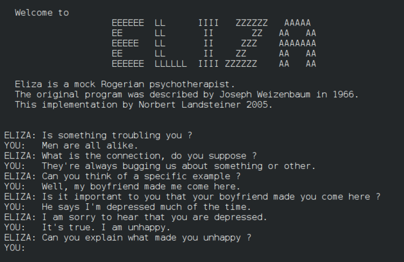

<!--
CO_OP_TRANSLATOR_METADATA:
{
  "original_hash": "b2d11df10030cacc41427a1fbc8bc8f1",
  "translation_date": "2025-08-29T17:43:21+00:00",
  "source_file": "1-Introduction/2-history-of-ML/README.md",
  "language_code": "pa"
}
-->
# ਮਸ਼ੀਨ ਲਰਨਿੰਗ ਦਾ ਇਤਿਹਾਸ

> ਸਕੈਚਨੋਟ [Tomomi Imura](https://www.twitter.com/girlie_mac) ਦੁਆਰਾ

## [ਪ੍ਰੀ-ਲੈਕਚਰ ਕਵਿਜ਼](https://gray-sand-07a10f403.1.azurestaticapps.net/quiz/3/)

---

> 🎥 ਉਪਰੋਕਤ ਚਿੱਤਰ 'ਤੇ ਕਲਿਕ ਕਰੋ ਇਸ ਪਾਠ ਨੂੰ ਸਮਝਣ ਲਈ ਇੱਕ ਛੋਟੀ ਵੀਡੀਓ ਦੇਖਣ ਲਈ।

ਇਸ ਪਾਠ ਵਿੱਚ, ਅਸੀਂ ਮਸ਼ੀਨ ਲਰਨਿੰਗ ਅਤੇ ਕ੍ਰਿਤਰਿਮ ਬੁੱਧੀ ਦੇ ਇਤਿਹਾਸ ਵਿੱਚ ਮਹੱਤਵਪੂਰਨ ਮੋੜਾਂ ਦੀ ਚਰਚਾ ਕਰਾਂਗੇ।

ਕ੍ਰਿਤਰਿਮ ਬੁੱਧੀ (AI) ਦੇ ਖੇਤਰ ਦਾ ਇਤਿਹਾਸ ਮਸ਼ੀਨ ਲਰਨਿੰਗ ਦੇ ਇਤਿਹਾਸ ਨਾਲ ਜੁੜਿਆ ਹੋਇਆ ਹੈ, ਕਿਉਂਕਿ ML ਦੇ ਅਲਗੋਰਿਥਮ ਅਤੇ ਗਣਨਾਤਮਕ ਤਰੱਕੀਆਂ ਨੇ AI ਦੇ ਵਿਕਾਸ ਵਿੱਚ ਯੋਗਦਾਨ ਪਾਇਆ। ਇਹ ਯਾਦ ਰੱਖਣਾ ਲਾਭਦਾਇਕ ਹੈ ਕਿ ਜਦੋਂ ਕਿ ਇਹ ਖੇਤਰ ਵੱਖ-ਵੱਖ ਖੋਜ ਦੇ ਖੇਤਰਾਂ ਵਜੋਂ 1950 ਦੇ ਦਹਾਕੇ ਵਿੱਚ ਸਪਸ਼ਟ ਹੋਣ ਲੱਗੇ, ਮਹੱਤਵਪੂਰਨ [ਅਲਗੋਰਿਥਮਿਕ, ਸਾਂਖਿਕ, ਗਣਿਤੀ, ਗਣਨਾਤਮਕ ਅਤੇ ਤਕਨੀਕੀ ਖੋਜਾਂ](https://wikipedia.org/wiki/Timeline_of_machine_learning) ਇਸ ਯੁੱਗ ਤੋਂ ਪਹਿਲਾਂ ਅਤੇ ਇਸ ਨਾਲ ਓਵਰਲੈਪ ਕਰਦੀਆਂ ਸਨ। ਹਕੀਕਤ ਵਿੱਚ, ਲੋਕ [ਸੈਂਕੜੇ ਸਾਲਾਂ](https://wikipedia.org/wiki/History_of_artificial_intelligence) ਤੋਂ ਇਨ੍ਹਾਂ ਸਵਾਲਾਂ ਬਾਰੇ ਸੋਚ ਰਹੇ ਹਨ: ਇਹ ਲੇਖ 'ਸੋਚਣ ਵਾਲੀ ਮਸ਼ੀਨ' ਦੇ ਵਿਚਾਰ ਦੇ ਇਤਿਹਾਸਕ ਬੁੱਧੀਮਾਨ ਅਧਾਰਾਂ ਦੀ ਚਰਚਾ ਕਰਦਾ ਹੈ।

---
## ਮਹੱਤਵਪੂਰਨ ਖੋਜਾਂ

- 1763, 1812 [Bayes Theorem](https://wikipedia.org/wiki/Bayes%27_theorem) ਅਤੇ ਇਸ ਦੇ ਪੂਰਵਜ। ਇਹ ਥਿਊਰਮ ਅਤੇ ਇਸ ਦੇ ਅਨੁਪ੍ਰਯੋਗ ਅਨੁਮਾਨ ਦੇ ਅਧਾਰ ਹਨ, ਜੋ ਪਹਿਲਾਂ ਦੀ ਜਾਣਕਾਰੀ ਦੇ ਅਧਾਰ 'ਤੇ ਕਿਸੇ ਘਟਨਾ ਦੇ ਹੋਣ ਦੀ ਸੰਭਾਵਨਾ ਦਾ ਵਰਣਨ ਕਰਦੇ ਹਨ।
- 1805 [Least Square Theory](https://wikipedia.org/wiki/Least_squares) ਫਰਾਂਸੀਸੀ ਗਣਿਤਜਨ Adrien-Marie Legendre ਦੁਆਰਾ। ਇਹ ਥਿਊਰੀ, ਜਿਸ ਬਾਰੇ ਤੁਸੀਂ ਰਿਗ੍ਰੈਸ਼ਨ ਯੂਨਿਟ ਵਿੱਚ ਸਿੱਖੋਗੇ, ਡਾਟਾ ਫਿਟਿੰਗ ਵਿੱਚ ਮਦਦ ਕਰਦੀ ਹੈ।
- 1913 [Markov Chains](https://wikipedia.org/wiki/Markov_chain), ਰੂਸੀ ਗਣਿਤਜਨ Andrey Markov ਦੇ ਨਾਮ 'ਤੇ, ਪਿਛਲੇ ਰਾਜ ਦੇ ਅਧਾਰ 'ਤੇ ਸੰਭਾਵਿਤ ਘਟਨਾਵਾਂ ਦੀ ਲੜੀ ਦਾ ਵਰਣਨ ਕਰਨ ਲਈ ਵਰਤੀ ਜਾਂਦੀ ਹੈ।
- 1957 [Perceptron](https://wikipedia.org/wiki/Perceptron) ਇੱਕ ਪ੍ਰਕਾਰ ਦਾ ਲੀਨੀਅਰ ਕਲਾਸੀਫਾਇਰ ਹੈ ਜੋ ਅਮਰੀਕੀ ਮਨੋਵਿਗਿਆਨੀ Frank Rosenblatt ਦੁਆਰਾ ਇਜਾਦ ਕੀਤਾ ਗਿਆ ਸੀ, ਜੋ ਡੀਪ ਲਰਨਿੰਗ ਵਿੱਚ ਤਰੱਕੀਆਂ ਦਾ ਅਧਾਰ ਹੈ।

---

- 1967 [Nearest Neighbor](https://wikipedia.org/wiki/Nearest_neighbor) ਇੱਕ ਅਲਗੋਰਿਥਮ ਹੈ ਜੋ ਮੂਲ ਰੂਪ ਵਿੱਚ ਰੂਟਾਂ ਨੂੰ ਨਕਸ਼ੇ ਵਿੱਚ ਦਰਸਾਉਣ ਲਈ ਡਿਜ਼ਾਈਨ ਕੀਤਾ ਗਿਆ ਸੀ। ML ਦੇ ਸੰਦਰਭ ਵਿੱਚ ਇਹ ਪੈਟਰਨ ਪਛਾਣਨ ਲਈ ਵਰਤਿਆ ਜਾਂਦਾ ਹੈ।
- 1970 [Backpropagation](https://wikipedia.org/wiki/Backpropagation) [feedforward neural networks](https://wikipedia.org/wiki/Feedforward_neural_network) ਨੂੰ ਟ੍ਰੇਨ ਕਰਨ ਲਈ ਵਰਤਿਆ ਜਾਂਦਾ ਹੈ।
- 1982 [Recurrent Neural Networks](https://wikipedia.org/wiki/Recurrent_neural_network) ਫੀਡਫਾਰਵਰਡ ਨਿਊਰਲ ਨੈਟਵਰਕ ਤੋਂ ਲਿਆਏ artificial neural networks ਹਨ ਜੋ ਅਸਥਾਈ ਗ੍ਰਾਫ ਬਣਾਉਂਦੇ ਹਨ।

✅ ਥੋੜੀ ਖੋਜ ਕਰੋ। ML ਅਤੇ AI ਦੇ ਇਤਿਹਾਸ ਵਿੱਚ ਹੋਰ ਕਿਹੜੀਆਂ ਤਾਰੀਖਾਂ ਮਹੱਤਵਪੂਰਨ ਹਨ?

---
## 1950: ਸੋਚਣ ਵਾਲੀਆਂ ਮਸ਼ੀਨਾਂ

Alan Turing, ਇੱਕ ਬੇਹਤਰੀਨ ਵਿਅਕਤੀ ਜਿਸ ਨੂੰ [2019 ਵਿੱਚ ਜਨਤਾ ਦੁਆਰਾ](https://wikipedia.org/wiki/Icons:_The_Greatest_Person_of_the_20th_Century) 20ਵੀਂ ਸਦੀ ਦਾ ਸਭ ਤੋਂ ਮਹਾਨ ਵਿਗਿਆਨੀ ਵੋਟ ਕੀਤਾ ਗਿਆ ਸੀ, ਨੂੰ 'ਸੋਚਣ ਵਾਲੀ ਮਸ਼ੀਨ' ਦੇ ਸੰਕਲਪ ਦੀ ਨੀਂਹ ਰੱਖਣ ਵਿੱਚ ਮਦਦ ਕਰਨ ਦਾ ਸ਼੍ਰੇਯ਼ ਦਿੱਤਾ ਜਾਂਦਾ ਹੈ। ਉਸ ਨੇ ਇਸ ਸੰਕਲਪ ਦੀ ਸੱਚਾਈ ਨੂੰ ਸਾਬਤ ਕਰਨ ਲਈ [Turing Test](https://www.bbc.com/news/technology-18475646) ਬਣਾਇਆ, ਜਿਸ ਬਾਰੇ ਤੁਸੀਂ NLP ਪਾਠਾਂ ਵਿੱਚ ਸਿੱਖੋਗੇ।

---
## 1956: ਡਾਰਟਮਾਊਥ ਸਮਰ ਰਿਸਰਚ ਪ੍ਰੋਜੈਕਟ

"ਡਾਰਟਮਾਊਥ ਸਮਰ ਰਿਸਰਚ ਪ੍ਰੋਜੈਕਟ ਕ੍ਰਿਤਰਿਮ ਬੁੱਧੀ ਦੇ ਖੇਤਰ ਲਈ ਇੱਕ ਮਹੱਤਵਪੂਰਨ ਘਟਨਾ ਸੀ," ਅਤੇ ਇੱਥੇ ਹੀ 'ਕ੍ਰਿਤਰਿਮ ਬੁੱਧੀ' ਸ਼ਬਦ ਦੀ ਰਚਨਾ ਕੀਤੀ ਗਈ ([source](https://250.dartmouth.edu/highlights/artificial-intelligence-ai-coined-dartmouth))।

> ਸਿੱਖਣ ਜਾਂ ਬੁੱਧੀ ਦੇ ਕਿਸੇ ਹੋਰ ਪੱਖ ਨੂੰ ਇਸ ਤਰ੍ਹਾਂ ਸਪਸ਼ਟ ਤੌਰ 'ਤੇ ਵਰਣਨ ਕੀਤਾ ਜਾ ਸਕਦਾ ਹੈ ਕਿ ਇੱਕ ਮਸ਼ੀਨ ਨੂੰ ਇਸ ਦੀ ਨਕਲ ਕਰਨ ਲਈ ਬਣਾਇਆ ਜਾ ਸਕੇ।

---

ਮੁੱਖ ਖੋਜਕਰਤਾ, ਗਣਿਤ ਦੇ ਪ੍ਰੋਫੈਸਰ John McCarthy ਨੇ "ਇਸ ਅਨੁਮਾਨ ਦੇ ਅਧਾਰ 'ਤੇ ਅੱਗੇ ਵਧਣ ਦੀ ਉਮੀਦ ਕੀਤੀ ਕਿ ਸਿੱਖਣ ਜਾਂ ਬੁੱਧੀ ਦੇ ਕਿਸੇ ਹੋਰ ਪੱਖ ਨੂੰ ਇਸ ਤਰ੍ਹਾਂ ਸਪਸ਼ਟ ਤੌਰ 'ਤੇ ਵਰਣਨ ਕੀਤਾ ਜਾ ਸਕਦਾ ਹੈ ਕਿ ਇੱਕ ਮਸ਼ੀਨ ਨੂੰ ਇਸ ਦੀ ਨਕਲ ਕਰਨ ਲਈ ਬਣਾਇਆ ਜਾ ਸਕੇ।" ਭਾਗੀਦਾਰਾਂ ਵਿੱਚ ਖੇਤਰ ਦੇ ਹੋਰ ਮਹਾਨ ਵਿਅਕਤੀ Marvin Minsky ਸ਼ਾਮਲ ਸਨ।

ਵਰਕਸ਼ਾਪ ਨੂੰ "ਪ੍ਰਤੀਕਾਤਮਕ ਵਿਧੀਆਂ ਦਾ ਉਭਾਰ, ਸੀਮਿਤ ਖੇਤਰਾਂ 'ਤੇ ਕੇਂਦਰਿਤ ਸਿਸਟਮ (ਸ਼ੁਰੂਆਤੀ ਵਿਸ਼ੇਸ਼ਜਨ ਸਿਸਟਮ), ਅਤੇ ਨਿਰਣਾਇਕ ਸਿਸਟਮ ਵਿਰੁੱਧ ਅਨੁਮਾਨਕ ਸਿਸਟਮ" ਸਮੇਤ ਕਈ ਚਰਚਾਵਾਂ ਨੂੰ ਸ਼ੁਰੂ ਕਰਨ ਅਤੇ ਉਤਸ਼ਾਹਿਤ ਕਰਨ ਦਾ ਸ਼੍ਰੇਯ਼ ਦਿੱਤਾ ਜਾਂਦਾ ਹੈ। ([source](https://wikipedia.org/wiki/Dartmouth_workshop)).

---
## 1956 - 1974: "ਸੁਨਹਿਰੀ ਸਾਲ"

1950 ਦੇ ਦਹਾਕੇ ਤੋਂ ਲੈ ਕੇ 70 ਦੇ ਮੱਧ ਤੱਕ, ਇਹ ਆਸ ਸੀ ਕਿ AI ਕਈ ਸਮੱਸਿਆਵਾਂ ਦਾ ਹੱਲ ਕਰ ਸਕਦਾ ਹੈ। 1967 ਵਿੱਚ, Marvin Minsky ਨੇ ਵਿਸ਼ਵਾਸ ਨਾਲ ਕਿਹਾ ਕਿ "ਇੱਕ ਪੀੜ੍ਹੀ ਦੇ ਅੰਦਰ ... 'ਕ੍ਰਿਤਰਿਮ ਬੁੱਧੀ' ਬਣਾਉਣ ਦੀ ਸਮੱਸਿਆ ਬਹੁਤ ਹੱਦ ਤੱਕ ਹੱਲ ਹੋ ਜਾਵੇਗੀ।" (Minsky, Marvin (1967), Computation: Finite and Infinite Machines, Englewood Cliffs, N.J.: Prentice-Hall)

ਕੁਦਰਤੀ ਭਾਸ਼ਾ ਪ੍ਰੋਸੈਸਿੰਗ ਖੋਜ ਫਲੀ-ਫੂਲੀ, ਖੋਜ ਨੂੰ ਸੁਧਾਰਿਆ ਗਿਆ ਅਤੇ ਵਧੇਰੇ ਸ਼ਕਤੀਸ਼ਾਲੀ ਬਣਾਇਆ ਗਿਆ, ਅਤੇ 'ਮਾਈਕਰੋ-ਵਰਲਡਸ' ਦਾ ਸੰਕਲਪ ਬਣਾਇਆ ਗਿਆ, ਜਿੱਥੇ ਸਧਾਰਨ ਕੰਮ ਸਧਾਰਨ ਭਾਸ਼ਾ ਦੇ ਨਿਰਦੇਸ਼ਾਂ ਦੀ ਵਰਤੋਂ ਕਰਕੇ ਪੂਰੇ ਕੀਤੇ ਗਏ।

---

ਸਰਕਾਰੀ ਏਜੰਸੀਆਂ ਦੁਆਰਾ ਖੋਜ ਨੂੰ ਵਧੀਆ ਫੰਡ ਦਿੱਤਾ ਗਿਆ, ਗਣਨਾ ਅਤੇ ਅਲਗੋਰਿਥਮ ਵਿੱਚ ਤਰੱਕੀਆਂ ਕੀਤੀਆਂ ਗਈਆਂ, ਅਤੇ ਬੁੱਧੀਮਾਨ ਮਸ਼ੀਨਾਂ ਦੇ ਪ੍ਰੋਟੋਟਾਈਪ ਬਣਾਏ ਗਏ। ਇਨ੍ਹਾਂ ਮਸ਼ੀਨਾਂ ਵਿੱਚ ਸ਼ਾਮਲ ਹਨ:

* [Shakey the robot](https://wikipedia.org/wiki/Shakey_the_robot), ਜੋ ਚਾਲ ਚਲ ਸਕਦਾ ਸੀ ਅਤੇ 'ਬੁੱਧੀਮਾਨ' ਤਰੀਕੇ ਨਾਲ ਕੰਮ ਕਰਨ ਦਾ ਫੈਸਲਾ ਕਰ ਸਕਦਾ ਸੀ।

    
    > Shakey 1972 ਵਿੱਚ

---

* Eliza, ਇੱਕ ਸ਼ੁਰੂਆਤੀ 'ਚੈਟਰਬੋਟ', ਲੋਕਾਂ ਨਾਲ ਗੱਲਬਾਤ ਕਰ ਸਕਦੀ ਸੀ ਅਤੇ ਇੱਕ ਆਦਿ 'ਥੈਰਾਪਿਸਟ' ਵਜੋਂ ਕੰਮ ਕਰ ਸਕਦੀ ਸੀ। ਤੁਸੀਂ NLP ਪਾਠਾਂ ਵਿੱਚ Eliza ਬਾਰੇ ਹੋਰ ਸਿੱਖੋਗੇ।

    
    > Eliza ਦਾ ਇੱਕ ਵਰਜਨ, ਇੱਕ ਚੈਟਬੋਟ

---

* "Blocks world" ਇੱਕ ਮਾਈਕਰੋ-ਵਰਲਡ ਦਾ ਉਦਾਹਰਨ ਸੀ ਜਿੱਥੇ ਬਲਾਕਾਂ ਨੂੰ ਢੇਰ ਅਤੇ ਵੱਖ-ਵੱਖ ਕੀਤਾ ਜਾ ਸਕਦਾ ਸੀ, ਅਤੇ ਮਸ਼ੀਨਾਂ ਨੂੰ ਫੈਸਲੇ ਕਰਨ ਸਿਖਾਉਣ ਦੇ ਪ੍ਰਯੋਗ ਕੀਤੇ ਜਾ ਸਕਦੇ ਸਨ। SHRDLU ਵਰਗੀਆਂ ਲਾਇਬ੍ਰੇਰੀਆਂ ਨਾਲ ਬਣੇ ਤਰੱਕੀਆਂ ਨੇ ਭਾਸ਼ਾ ਪ੍ਰੋਸੈਸਿੰਗ ਨੂੰ ਅੱਗੇ ਵਧਾਇਆ।

    

    > 🎥 ਉਪਰੋਕਤ ਚਿੱਤਰ 'ਤੇ ਕਲਿਕ ਕਰੋ: SHRDLU ਨਾਲ blocks world

---
## 1974 - 1980: "AI Winter"

1970 ਦੇ ਮੱਧ ਤੱਕ ਇਹ ਸਪਸ਼ਟ ਹੋ ਗਿਆ ਕਿ 'ਬੁੱਧੀਮਾਨ ਮਸ਼ੀਨਾਂ' ਬਣਾਉਣ ਦੀ ਜਟਿਲਤਾ ਨੂੰ ਘੱਟ ਅੰਕਿਆ ਗਿਆ ਸੀ ਅਤੇ ਉਪਲਬਧ ਗਣਨਾ ਸ਼ਕਤੀ ਦੇ ਨਾਲ ਇਸ ਦਾ ਵਾਅਦਾ ਵਧਾ ਚੁੱਕਾ ਸੀ। ਫੰਡਿੰਗ ਖਤਮ ਹੋ ਗਈ ਅਤੇ ਖੇਤਰ ਵਿੱਚ ਵਿਸ਼ਵਾਸ ਘਟ ਗਿਆ। ਕੁਝ ਮੁੱਦੇ ਜਿਨ੍ਹਾਂ ਨੇ ਵਿਸ਼ਵਾਸ ਨੂੰ ਪ੍ਰਭਾਵਿਤ ਕੀਤਾ ਸ਼ਾਮਲ ਹਨ:
---
- **ਪਾਬੰਦੀਆਂ**। ਗਣਨਾ ਸ਼ਕਤੀ ਬਹੁਤ ਸੀਮਿਤ ਸੀ।
- **ਕੰਬੀਨੇਟਰੀਲ ਧਮਾਕਾ**। ਪੈਰਾਮੀਟਰਾਂ ਦੀ ਗਿਣਤੀ exponentially ਵਧ ਗਈ ਜਿਵੇਂ ਕਿ ਕੰਪਿਊਟਰਾਂ ਤੋਂ ਹੋਰ ਦੀ ਮੰਗ ਕੀਤੀ ਗਈ, ਬਿਨਾਂ ਗਣਨਾ ਸ਼ਕਤੀ ਅਤੇ ਸਮਰੱਥਾ ਦੇ ਸਮਾਨਾਂਤਰ ਵਿਕਾਸ ਦੇ।
- **ਡਾਟਾ ਦੀ ਘਾਟ**। ਡਾਟਾ ਦੀ ਘਾਟ ਸੀ ਜਿਸ ਨੇ ਅਲਗੋਰਿਥਮਾਂ ਦੀ ਜਾਂਚ, ਵਿਕਾਸ ਅਤੇ ਸੁਧਾਰ ਦੀ ਪ੍ਰਕਿਰਿਆ ਨੂੰ ਰੋਕਿਆ।
- **ਕੀ ਅਸੀਂ ਸਹੀ ਸਵਾਲ ਪੁੱਛ ਰਹੇ ਹਾਂ?**। ਜਿਹੜੇ ਸਵਾਲ ਪੁੱਛੇ ਜਾ ਰਹੇ ਸਨ ਉਹਨਾਂ ਨੂੰ ਹੀ ਸਵਾਲ ਕੀਤਾ ਜਾਣ ਲੱਗਾ। ਖੋਜਕਰਤਾਵਾਂ ਨੇ ਆਪਣੇ ਪਹੁੰਚਾਂ ਬਾਰੇ ਆਲੋਚਨਾ ਦਾ ਸਾਹਮਣਾ ਕੀਤਾ:
  - Turing ਟੈਸਟਾਂ ਨੂੰ 'ਚਾਈਨੀਜ਼ ਰੂਮ ਥਿਊਰੀ' ਵਰਗੇ ਵਿਚਾਰਾਂ ਦੁਆਰਾ ਸਵਾਲ ਕੀਤਾ ਗਿਆ, ਜਿਸ ਨੇ ਇਹ ਦਲੀਲ ਦਿੱਤੀ ਕਿ "ਇੱਕ ਡਿਜੀਟਲ ਕੰਪਿਊਟਰ ਨੂੰ ਪ੍ਰੋਗਰਾਮ ਕਰਨਾ ਇਸ ਨੂੰ ਭਾਸ਼ਾ ਨੂੰ ਸਮਝਣ ਵਾਲਾ ਦਿਖਾ ਸਕਦਾ ਹੈ ਪਰ ਅਸਲ ਸਮਝ ਨਹੀਂ ਪੈਦਾ ਕਰ ਸਕਦਾ।" ([source](https://plato.stanford.edu/entries/chinese-room/))
  - "ਥੈਰਾਪਿਸਟ" ELIZA ਵਰਗੀਆਂ ਕ੍ਰਿਤਰਿਮ ਬੁੱਧੀਆਂ ਨੂੰ ਸਮਾਜ ਵਿੱਚ ਲਿਆਂਦਾ ਜਾਣ ਦੇ ਨੈਤਿਕਤਾ ਨੂੰ ਚੁਣੌਤੀ ਦਿੱਤੀ ਗਈ।

---

ਇਸੇ ਸਮੇਂ, ਵੱਖ-ਵੱਖ AI ਦੇ ਵਿਚਾਰਧਾਰਾ ਸਕੂਲ ਬਣਨ ਲੱਗੇ। ["scruffy" vs. "neat AI"](https://wikipedia.org/wiki/Neats_and_scruffies) ਅਭਿਆਸਾਂ ਵਿੱਚ ਇੱਕ ਵੱਖਰਾ ਬਣਾਇਆ ਗਿਆ। _Scruffy_ ਲੈਬਾਂ ਨੇ ਘੰਟਿਆਂ ਤੱਕ ਪ੍ਰੋਗਰਾਮਾਂ ਨੂੰ ਟਵੀਕ ਕੀਤਾ ਜਦੋਂ ਤੱਕ ਉਹ ਚਾਹੀਦਾ ਨਤੀਜਾ ਪ੍ਰਾਪਤ ਨਹੀਂ ਕਰ ਲੈਂਦੇ। _Neat_ ਲੈਬਾਂ "ਤਰਕ ਅਤੇ ਰਸਮੀ ਸਮੱਸਿਆ ਹੱਲ ਕਰਨ" 'ਤੇ ਕੇਂਦਰਿਤ ਸਨ। ELIZA ਅਤੇ SHRDLU ਪ੍ਰਸਿੱਧ _scruffy_ ਸਿਸਟਮ ਸਨ। 1980 ਦੇ ਦਹਾਕੇ ਵਿੱਚ, ਜਦੋਂ ML ਸਿਸਟਮਾਂ ਨੂੰ ਦੁਹਰਾਉਣਯੋਗ ਬਣਾਉਣ ਦੀ ਮੰਗ ਉਭਰੀ, _neat_ ਪਹੁੰਚ ਨੇ ਹੌਲੀ-ਹੌਲੀ ਅਗਵਾਈ ਕੀਤੀ ਕਿਉਂਕਿ ਇਸ ਦੇ ਨਤੀਜੇ ਵਧੇਰੇ ਸਮਝਣਯੋਗ ਹਨ।

---
## 1980s ਵਿਸ਼ੇਸ਼ਜਨ ਸਿਸਟਮ

ਜਿਵੇਂ ਖੇਤਰ ਵਧਿਆ, ਇਸ ਦਾ ਕਾਰੋਬਾਰ ਲਈ ਲਾਭ ਸਪਸ਼ਟ ਹੋਇਆ, ਅਤੇ 1980 ਦੇ ਦਹਾਕੇ ਵਿੱਚ 'ਵਿਸ਼ੇਸ਼ਜਨ ਸਿਸਟਮਾਂ' ਦਾ ਵਾਧਾ ਹੋਇਆ। "ਵਿਸ਼ੇਸ਼ਜਨ ਸਿਸਟਮ ਕ੍ਰਿਤਰਿਮ ਬੁੱਧੀ (AI) ਸਾਫਟਵੇਅਰ ਦੇ ਪਹਿਲੇ ਸੱਚਮੁੱਚ ਸਫਲ ਰੂਪਾਂ ਵਿੱਚੋਂ ਸਨ।" ([source](https://wikipedia.org/wiki/Expert_system)).

ਇਸ ਪ੍ਰਕਾਰ ਦਾ ਸਿਸਟਮ ਅਸਲ ਵਿੱਚ _hybrid_ ਹੈ, ਜਿਸ ਵਿੱਚ ਹਿੱਸਾ ਲਿਆ ਗਿਆ ਹੈ ਇੱਕ ਰੂਲ ਇੰਜਨ ਜੋ ਕਾਰੋਬਾਰੀ ਜ਼ਰੂਰਤਾਂ ਨੂੰ ਪਰਿਭਾਸ਼ਿਤ ਕਰਦਾ ਹੈ, ਅਤੇ ਇੱਕ ਅਨੁਮਾਨ ਇੰਜਨ ਜੋ ਨਵੇਂ ਤੱਥਾਂ ਨੂੰ ਨਿਰਧਾਰਤ ਕਰਨ ਲਈ ਰੂਲ ਸਿਸਟਮ ਦੀ ਵਰਤੋਂ ਕਰਦਾ ਹੈ।

ਇਸ ਯੁੱਗ ਵਿੱਚ ਨਿਊਰਲ ਨੈਟਵਰਕਾਂ 'ਤੇ ਵੀ ਵਧਦੀ ਧਿਆਨ ਦਿੱਤੀ ਗਈ।

---
## 1987 - 1993: AI 'Chill'

ਵਿਸ਼ੇਸ਼ਜਨ ਸਿਸਟਮਾਂ ਦੇ ਵਿਸ਼ੇਸ਼ ਹਾਰਡਵੇਅਰ ਦਾ ਵਾਧਾ ਬਦਕਿਸਮਤੀ ਨਾਲ ਬਹੁਤ ਜ਼ਿਆਦਾ ਵਿਸ਼ੇਸ਼ ਬਣ ਗਿਆ। ਪੈਰਸਨਲ ਕੰਪਿਊਟਰਾਂ ਦੇ ਉਭਾਰ ਨੇ ਵੀ ਇਨ੍ਹਾਂ ਵੱਡੇ, ਵਿਸ਼ੇਸ਼, ਕੇਂਦਰੀ ਸਿਸਟਮਾਂ ਨਾਲ ਮੁਕਾਬਲਾ ਕੀਤਾ। ਗਣਨਾ ਦੀ ਲੋਕਤੰਤਰਤਾ ਸ਼ੁਰੂ ਹੋ ਗਈ ਸੀ, ਅਤੇ ਇਸ ਨੇ ਆਖਿਰਕਾਰ ਵੱਡੇ ਡਾਟਾ ਦੇ ਆਧੁਨਿਕ ਧਮਾਕੇ ਦਾ ਰਾਹ ਖੋਲ੍ਹਿਆ।

---
## 1993 - 2011

ਇਸ ਯੁੱਗ ਨੇ ML ਅਤੇ AI ਲਈ ਕੁਝ ਸਮੱਸਿਆਵਾਂ ਹੱਲ ਕਰਨ ਲਈ ਇੱਕ ਨਵਾਂ ਯੁੱਗ ਲਿਆ ਜੋ ਪਹਿਲਾਂ ਡਾਟਾ ਅਤੇ ਗਣਨਾ ਸ਼ਕਤੀ ਦੀ ਘਾਟ ਕਾਰਨ ਹੋਈਆਂ ਸਨ। ਡਾਟਾ ਦੀ ਮਾਤਰਾ ਤੇਜ਼ੀ ਨਾਲ ਵਧਣ ਲੱਗੀ ਅਤੇ ਵਧੇਰੇ ਉਪਲਬਧ ਹੋਣ ਲੱਗੀ, ਚੰਗੇ ਅਤੇ ਮੰਦੇ ਦੋਵੇਂ ਲਈ, ਖਾਸ ਕਰਕੇ 2007 ਦੇ ਆਸ-ਪਾਸ ਸਮਾਰਟਫੋਨ ਦੇ ਆਗਮਨ ਨਾਲ। ਗਣਨਾ ਸ਼ਕਤੀ exponential ਤੌਰ 'ਤੇ ਵਧੀ, ਅਤੇ ਅਲਗੋਰਿਥਮ ਇਸ ਦੇ ਨਾਲ-ਨਾਲ ਵਿਕਸਿਤ ਹੋਏ। ਖੇਤਰ ਨੇ ਪਿਛਲੇ ਦਿਨਾਂ ਦੀ ਮੁਕਤ-ਵਿਹਲੀਆਂ ਦਿਨਾਂ ਤੋਂ ਪੱਕੇ ਹੋ ਕੇ ਇੱਕ ਸੱਚੇ ਵਿਸ਼ੇਸ਼ ਖੇਤਰ ਵਿੱਚ ਰੂਪ ਧਾਰਨ ਕਰਨਾ ਸ਼ੁਰੂ ਕੀਤਾ।

---
## ਹੁਣ

ਅੱਜ ਮਸ਼ੀਨ ਲਰਨਿੰਗ ਅਤੇ AI ਸਾਡੇ ਜੀਵਨ ਦੇ ਲਗਭਗ ਹਰ ਹਿੱਸੇ ਨੂੰ ਛੂਹ ਰਹੇ ਹਨ। ਇਹ ਯੁੱਗ ਇਨ੍ਹਾਂ ਅਲਗੋਰਿਥਮਾਂ ਦੇ ਮਨੁੱਖੀ ਜੀਵਨ 'ਤੇ

---

**ਅਸਵੀਕਰਤੀ**:  
ਇਹ ਦਸਤਾਵੇਜ਼ AI ਅਨੁਵਾਦ ਸੇਵਾ [Co-op Translator](https://github.com/Azure/co-op-translator) ਦੀ ਵਰਤੋਂ ਕਰਕੇ ਅਨੁਵਾਦ ਕੀਤਾ ਗਿਆ ਹੈ। ਜਦੋਂ ਕਿ ਅਸੀਂ ਸਹੀ ਹੋਣ ਦੀ ਕੋਸ਼ਿਸ਼ ਕਰਦੇ ਹਾਂ, ਕਿਰਪਾ ਕਰਕੇ ਧਿਆਨ ਦਿਓ ਕਿ ਸਵੈਚਾਲਿਤ ਅਨੁਵਾਦਾਂ ਵਿੱਚ ਗਲਤੀਆਂ ਜਾਂ ਅਸੁਚੀਤਤਾਵਾਂ ਹੋ ਸਕਦੀਆਂ ਹਨ। ਇਸ ਦੀ ਮੂਲ ਭਾਸ਼ਾ ਵਿੱਚ ਮੌਜੂਦ ਅਸਲ ਦਸਤਾਵੇਜ਼ ਨੂੰ ਅਧਿਕਾਰਤ ਸਰੋਤ ਮੰਨਿਆ ਜਾਣਾ ਚਾਹੀਦਾ ਹੈ। ਮਹੱਤਵਪੂਰਨ ਜਾਣਕਾਰੀ ਲਈ, ਪੇਸ਼ੇਵਰ ਮਨੁੱਖੀ ਅਨੁਵਾਦ ਦੀ ਸਿਫਾਰਸ਼ ਕੀਤੀ ਜਾਂਦੀ ਹੈ। ਇਸ ਅਨੁਵਾਦ ਦੀ ਵਰਤੋਂ ਤੋਂ ਪੈਦਾ ਹੋਣ ਵਾਲੇ ਕਿਸੇ ਵੀ ਗਲਤ ਫਹਿਮੀ ਜਾਂ ਗਲਤ ਵਿਆਖਿਆ ਲਈ ਅਸੀਂ ਜ਼ਿੰਮੇਵਾਰ ਨਹੀਂ ਹਾਂ।