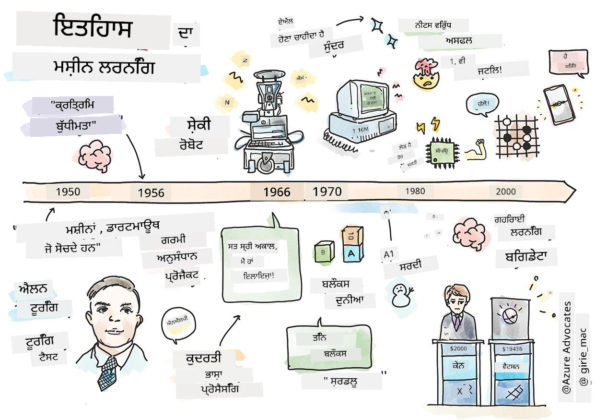
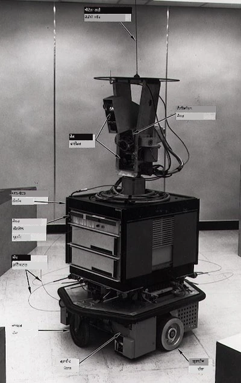
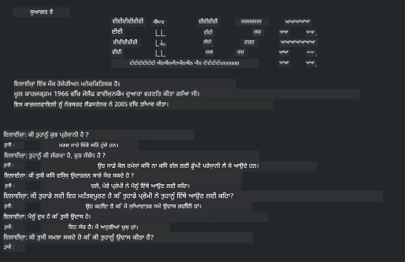

# ਮਸ਼ੀਨ ਲਰ್ನਿੰਗ ਦਾ ਇਤਿਹਾਸ

> ਸਕેਟਨોટ [ਟੋਮੋਮੀ ਇਮੁਰਾ](https://www.twitter.com/girlie_mac) ਵਲੋਂ

## [ਪੂਰਵ-ਲੇਕਚਰ ਕਵਿਜ਼](https://ff-quizzes.netlify.app/en/ml/)

---

> 🎥 ਇਸ ਪਾਠ ਭਰ ਵਿੱਚ ਛੋਟੀ ਵੀਡੀਓ ਦੇਖਣ ਲਈ ਉਪਰ ਦੀ ਚਿੱਤਰ 'ਤੇ ਕਲਿੱਕ ਕਰੋ।

ਇਸ ਪਾਠ ਵਿੱਚ, ਅਸੀਂ ਮਸ਼ੀਨ ਲਰਣਿੰਗ ਅਤੇ ਕৃত੍ਰਿਮ ਬੁੱਧੀ ਦੇ ਇਤਿਹਾਸ ਵਿੱਚ ਮੁੱਖ ਮੀਲਾਂ ਪੱਥਰਾਂ ਨੂੰ ਵੇਖਾਂਗੇ।

ਕ੍ਰਿਤ੍ਰਿਮ ਬੁੱਧੀ (AI) ਦੇ ਇਤਿਹਾਸ ਨੂੰ ਮਸ਼ੀਨ ਲਰਣਿੰਗ ਦੇ ਇਤਿਹਾਸ ਨਾਲ ਜੁੜਿਆ ਹੋਇਆ ਸਮਝਣਾ ਲਾਜ਼ਮੀ ਹੈ, ਕਿਉਂਕਿ ਜੋ ਅਲਗੋਰਿਦਮ ਅਤੇ ਕਮਪਿਊਟਿੰਗ ਵਿੱਚ ਤਰੱਕੀ ML ਦਾ ਆਧਾਰ ਬਣੀ ਉਹ AI ਦੀ ਵਿਕਾਸ ਵਿੱਚ ਸਹਿ ਭੂਮਿਕਾ ਨਿਭਾਉਂਦੇ ਹਨ। ਯਾਦ ਰਹੇ ਕਿ ਜਦੋਂ ਇਹ ਖੇਤਰ 1950 ਦੇ ਦਹਾਕੇ ਵਿੱਚ ਵੱਖਰੇ ਇਲਾਕਿਆਂ ਵਜੋਂ ਬਣਾ, ਉਸ ਤੋਂ ਪਹਿਲਾਂ ਵੀ ਮਹੱਤਵਪੂਰਨ [ਅਲਗੋਰਿਦਮਿਕ, ਸਾਂਖਿਆਕੀ, ਗਣਿਤੀ, ਕਮਪਿਊਟੇਸ਼ਨ ਅਤੇ ਤਕਨੀਕੀ ਖੋਜਾਂ](https://wikipedia.org/wiki/Timeline_of_machine_learning) ਹੋਈਆਂ ਸਨ। ਅਸਲ ਵਿੱਚ, ਲੋਕ ਸੈਂਕੜਿਆਂ ਸਾਲਾਂ ਤੋਂ ਇਹਨਾਂ ਸਵਾਲਾਂ ਬਾਰੇ ਸੋਚ ਰਹੇ ਹਨ: [ਕ੍ਰਿਤ੍ਰਿਮ ਬੁੱਧੀ ਦੇ ਇਤਿਹਾਸ](https://wikipedia.org/wiki/History_of_artificial_intelligence) ਇਸ ਵਿਚਾਰ 'ਸੋਚਣ ਵਾਲੀ ਮਸ਼ੀਨ' ਦੀ ਬੁੱਧਿਮੱਤਾ ਦੀ ਇਤਿਹਾਸਕ ਬੁਨਿਆਦਾਂ ਤੇ ਚਰਚਾ ਕਰਦਾ ਹੈ।

---
## ਪ੍ਰਮੁੱਖ ਖੋਜਾਂ

- 1763, 1812 [ਬੇਜ਼ ਸਿਧਾਂਤ](https://wikipedia.org/wiki/Bayes%27_theorem) ਅਤੇ ਇਸਦੇ ਪਹਿਲਾਂ ਵਾਲੇ। ਇਹ ਸਿਧਾਂਤ ਅਤੇ ਇਸਦੀ ਵਿਵਹਾਰਿਕਤਾ ਤਿਆਰ ਕਰਦੀ ਹੈ ਕਿ ਪਿਛਲੇ ਗਿਆਨ ਦੇ ਆਧਾਰ 'ਤੇ ਕਿਸੇ ਘਟਨਾ ਦੇ ਹੋਣ ਦੀ ਸੰਭਾਵਨਾ ਕਿਵੇਂ ਨਿਕਾਲੀ ਜਾ ਸਕਦੀ ਹੈ।
- 1805 ਫਰਾਂਸੀਸੀ ਗਣਿਤੀਜ್ಞಾನ ਐਡਰੀਅਨ-ਮੈਰੀ ਲੇਜੇੰਦਰ ਵੱਲੋਂ [ਲੀਸਟ ਸਕਵਾਯਰਥੀਅਰੀ](https://wikipedia.org/wiki/Least_squares)। ਇਸ ਸਿਧਾਂਤ ਨੂੰ ਤੁਸੀਂ ਸਾਡੇ ਰਿਗਰੇਸ਼ਨ ਯੂਨਿਟ ਵਿੱਚ ਸਿੱਖੋਗੇ, ਜੋ ਡੇਟਾ ਫਿਟਿੰਗ ਵਿੱਚ ਸਹਾਇਕ ਹੈ।
- 1913 [ਮਾਰਕੋਵ ਚੇਨਸ](https://wikipedia.org/wiki/Markov_chain), ਜੋ ਰੂਸ ਦੇ ਗਣਿਤੀਗਿਆਨ ਅੰਦੇਰੀ ਮਾਰਕੋਵ ਦੇ ਨਾਮ 'ਤੇ ਹੈ, ਇਹ ਪਿਛਲੇ ਹਾਲਤ ਦੇ ਆਧਾਰ 'ਤੇ ਸੰਭਾਵਿਤ ਘਟਨਾਵਾਂ ਦੀ ਲੜੀ ਵੇਖਾਉਂਦਾ ਹੈ।
- 1957 [ਪਰਸੈਪਟ੍ਰੌਨ](https://wikipedia.org/wiki/Perceptron) ਇੱਕ ਕਿਸਮ ਦਾ ਲੀਨੀਅਰ ਕਲਾਸੀਫਾਇਰ ਹੈ, ਜਿਸਨੂੰ ਅਮਰੀਕੀ ਮਨੋਵਿਗਿਆਨੀ ਫਰੈਂਕ ਰੋਜ਼ਨਬਲੈਟ ਨੇ ਬਣਾਇਆ, ਜੋ ਡੀਪ ਲਰਨਿੰਗ ਵਿੱਚ ਪ੍ਰਗਤੀ ਦਾ ਆਧਾਰ ਹੈ।

---

- 1967 [ਨੀਅਰੈਸਟ ਨੇਬਰ](https://wikipedia.org/wiki/Nearest_neighbor) ਇੱਕ ਅਲਗੋਰਿਦਮ ਹੈ ਜੋ ਮੂਲ ਰੂਪ ਵਿੱਚ ਰੂਟ ਮੈਪ ਕਰਨ ਲਈ ਬਣਾਇਆ ਗਿਆ ਸੀ। ML ਸੰਦਰਭ ਵਿੱਚ ਇਹ ਪੈਟਰਨਸ ਦੀ ਪਛਾਣ ਲਈ ਵਰਤਿਆ ਜਾਂਦਾ ਹੈ।
- 1970 [ਬੈਕਪ੍ਰੋਪਾਗੇਸ਼ਨ](https://wikipedia.org/wiki/Backpropagation) [ਫੀਡਫੋਰਵਰਡ ਨਿਊਰਲ ਨੈੱਟਵਰਕ](https://wikipedia.org/wiki/Feedforward_neural_network) ਨੂੰ ટ્રેન ਕਰਨ ਲਈ ਵਰਤਿਆ ਜਾਂਦਾ ਹੈ।
- 1982 [ਰੀਕਰੈਂਟ ਨਿਊਰਲ ਨੈੱਟਵਰਕਸ](https://wikipedia.org/wiki/Recurrent_neural_network) ਫੀਡਫੋਰਵਰਡ ਨਿਊਰਲ ਨੈੱਟਵਰਕ ਤੋਂ ਨਿਕਲੇ ਕ੍ਰਿਤ੍ਰਿਮ ਨਿਊਰਲ ਨੈੱਟਵਰਕ ਹਨ ਜੋ ਅਸਮਈ ਗਰਾਫ ਬਣਾਉਂਦੇ ਹਨ।

✅ ਥੋੜ੍ਹੀ ਖੋਜ ਕਰੋ। ਹੋਰ ਕਿਹੜੀਆਂ ਤਾਰੀਖਾਂ ML ਅਤੇ AI ਦੇ ਇਤਿਹਾਸ ਵਿੱਚ ਮੋੜ ਵਾਲੀਆਂ ਹਨ?

---
## 1950: ਸੋਚਣ ਵਾਲੀਆਂ ਮਸ਼ੀਨਾਂ

ਐਲਨ ਟਿuringਰ, ਇੱਕ ਬਹੁਤ ਹੀ ਅਦਭੁਤ ਵਿਅਕਤੀ ਜਿਸਨੂੰ [2019 'ਚ ਲੋਕਾਂ ਵਲੋਂ](https://wikipedia.org/wiki/Icons:_The_Greatest_Person_of_the_20th_Century) 20ਵੀਂ ਸਦੀ ਦਾ ਸਭ ਤੋਂ ਵੱਡਾ ਵਿਗਿਆਨੀ ਚੁਣਿਆ ਗਿਆ, ਉਸਨੂੰ 'ਸੋਚਣ ਵਾਲੀ ਮਸ਼ੀਨ' ਦੀ ਸੰਕਲਪਨਾ ਦਾ ਬੁਨਿਆਦ ਰੱਖਣ ਲਈ ਸਿਲਸਿਲੇਵਾਰ ਯੋਗਦਾਨ ਲਈ ਜਾਣਿਆ ਜਾਂਦਾ ਹੈ। ਉਸਨੇ ਨਕਾਰਾਤਮਕਾਂ ਨਾਲ ਜੂਝਣਾ ਪਿਆ ਅਤੇ ਇਸ ਸੰਕਲਪ ਦਾ ਪ੍ਰਮਾਣ ਲੱਭਣ ਲਈ ਆਪਣੇ ਤਰੀਕੇ, ਜਿਵੇਂ ਕਿ [ਟਿuringਰ ਟੈਸਟ](https://www.bbc.com/news/technology-18475646) ਬਣਾਇਆ, ਜਿਸਨੂੰ ਤੁਸੀਂ ਸਾਡੇ NLP ਪਾਠਾਂ ਵਿੱਚ ਵੇਖੋਗੇ।

---
## 1956: ਡਾਰਟਮਾਊਥ ਸਮਰ ਰਿਸਰਚ ਪ੍ਰਾਜੈਕਟ

"ਕ੍ਰਿਤ੍ਰਿਮ ਬੁੱਧੀ ਦੇ ਖੇਤਰ ਵਜੋਂ ਡਾਰਟਮਾਊਥ ਸਮਰ ਰਿਸਰਚ ਪ੍ਰਾਜੈਕਟ ਇੱਕ ਮੈਰੋਕ olay ਸੀ," ਅਤੇ ਇੱਥੇ ਹੀ 'ਕ੍ਰਿਤ੍ਰਿਮ ਬੁੱਧੀ' ਸ਼ਬਦ ਦਾ ਉਤਪੱਤੀ ਹੋਈ ([ਸਰੋਤ](https://250.dartmouth.edu/highlights/artificial-intelligence-ai-coined-dartmouth))।

> ਸਿੱਖਣ ਦਾ ਹਰ ਪਹਲੂ ਜਾਂ ਦੂਜੇ ਬੁੱਧੀ ਦੇ ਲੱਛਣ ਨੂੰ ਇਸ ਤਰ੍ਹਾਂ ਬਿਆਨ ਕੀਤਾ ਜਾ ਸਕਦਾ ਹੈ ਕਿ ਇੱਕ ਮਸ਼ੀਨ ਇਸ ਦੀ ਨਕਲ ਕਰ ਸਕੇ।

---

ਮੁੱਖ ਖੋਜਕਰਤਾ, ਗਣਿਤ ਪ੍ਰੋਫੈਸਰ ਜੌਨ ਮੱਕਾਰਥੀ, ਇਹ ਆਸਰਾ ਰੱਖਦੇ ਸਨ ਕਿ "ਸੀਖਣ ਦੇ ਹਰ ਪਹਲੂ ਜਾਂ ਕਿਸੇ ਹੋਰ ਬੁੱਧੀ ਲੱਛਣ ਨੂੰ ਇਸ ਜਰੂਰੀ ਸਿਧਾਂਤ ਦੇ ਆਧਾਰ 'ਤੇ ਇਸ ਤਰ੍ਹਾਂ ਸਹੀ ਤੌਰ 'ਤੇ ਵਰਣਿਤ ਕੀਤਾ ਜਾ ਸਕਦਾ ਹੈ ਕਿ ਇੱਕ ਮਸ਼ੀਨ ਇਸਦੀ ਤਕਰਾ ਕਰ ਸਕੇ।" ਇਸ ਵਿੱਚ ਫੀਲਡ ਦੀ ਇੱਕ ਹੋਰ ਪ੍ਰਸਿੱਧ ਸ਼ਖ਼ਸੀਅਤ ਮਾਰਵਿਨ ਮਿੰਸਕੀ ਵੀ ਸੀ।

ਇਹ ਵਰਕਸ਼ਾਪ ਕਈ ਚਰਚਾਵਾਂ ਦੀ ਸ਼ੁਰੂਆਤ ਅਤੇ ਪ੍ਰੇਰਣਾ ਲਈ ਜ਼ਿੰਮੇਵਾਰ ਮੰਨੀ ਜਾਂਦੀ ਹੈ, ਜਿਵੇਂ ਕਿ "ਚਿੰਨ੍ਹੀਤ ਤਰੀਕੇ, ਸੀਮਤ ਖੇਤਰਾਂ (ਪਹਿਲੇ ਐਕਸਪឺਰਟ ਸਿਸਟਮ), ਅਤੇ ਡਿਡਕਟਿਵ ਸਿਸਟਮ ਵਿਰੁੱਧ ਇੰਡਕਟਿਵ ਸਿਸਟਮ"। ([ਸਰੋਤ](https://wikipedia.org/wiki/Dartmouth_workshop))

---
## 1956 - 1974: "ਸੋਨੇ ਦੇ ਸਾਲ"

1950 ਤੋਂ ਮੱਧ 1970 ਤਕ, AI ਨਾਲ ਬਹੁਤ ਉਮੀਦਾਂ ਜੁੜੀਆਂ ਹੋਈਆਂ ਸਨ ਕਿ ਇਹ ਕਈ ਸਮੱਸਿਆਵਾਂ ਹੱਲ ਕਰ ਸਕਦਾ ਹੈ। 1967ਚ, ਮਾਰਵਿਨ ਮਿੰਸਕੀ ਨੇ ਪੱਕੀ ਗੱਲ ਕਹੀ ਕਿ "ਇੱਕ ਪੀੜੀ ਦੇ ਅੰਦਰ ... ਕ੍ਰਿਤ੍ਰਿਮ ਬੁੱਧੀ ਬਣਾਉਣ ਦਾ ਸਮੱਸਿਆ ਮੁੱਖ ਰੂਪ ਵਿੱਚ ਹੱਲ ਹੋ ਜਾਵੇਗੀ।" (ਮਿੰਸਕੀ, ਮਾਰਵਿਨ (1967), ਕੰਪਿਊਟੇਸ਼ਨ: ਫਾਈਨਿਟ ਅਤੇ ਇਨਫਿਨਿਟ ਮਸ਼ੀਨਾਂ, ਏਂਗਲਵੁੱਡ ਕਲਿਫਸ, N.J.: ਪ੍ਰੈਂਟਿਸ-ਹਾਲ)

ਕੁਦਰਤੀ ਭਾਸ਼ਾ ਪ੍ਰੋਸੈਸਿੰਗ ਖੋਜ ਚੜ੍ਹਾਈ 'ਤੇ ਸੀ, ਖੋਜ ਮੁਕੰਮਲ ਹੋਈ ਅਤੇ ਵਧੇਰੇ ਸਮਰੱਥ ਬਣੀ, ਅਤੇ 'ਮਾਈਕ੍ਰੋ-ਵਰਲਡ' ਦਾ ਸਿਧਾਂਤ ਬਣਾਇਆ ਗਿਆ ਜਿੱਥੇ ਸਾਦੇ ਕੰਮ ਸਧਾਰਣ ਭਾਸ਼ਾ ਹੁਕਮਾਂ ਨਾਲ ਕੀਤੇ ਗਏ।

---

ਸਰਕਾਰ ਵੱਲੋਂ ਖੋਜ ਨੂੰ ਚੰਗੀ ਤਰ੍ਹਾਂ ਫੰਡ ਮਿਲਿਆ, ਕਮਪਿਊਟੇਸ਼ਨ ਅਤੇ ਅਲਗੋਰਿਦਮ ਵਿੱਚ ਤਰੱਕੀ ਹੋਈ, ਅਤੇ ਬੁੱਧੀਮਾਨ ਮਸ਼ੀਨ ਦੇ ਪ੍ਰੋਟੋਟਾਈਪ ਬਣਾਏ ਗਏ। ਕੁਝ ਮਸ਼ੀਨਾਂ ਹਨ:

* [ਸ਼ੇਕੀ ਦ ਰੋਬੋਟ](https://wikipedia.org/wiki/Shakey_the_robot), ਜੋ ਸੁਚੇਤ ਨਾਲ ਮਊਵ ਕਰ ਸਕਦਾ ਸੀ ਅਤੇ ਕੰਮ ਕਿਵੇਂ ਕਰਨ ਦਾ ਫੈਸਲਾ ਕਰਦਾ ਸੀ।

    
    > 1972 ਵਿੱਚ ਸ਼ੇਕੀ

---

* ਏਲਿਜ਼ਾ, ਇੱਕ ਸ਼ੁਰੂਆਤੀ 'ਚੈਟਰਬੋਟ', ਲੋਕਾਂ ਨਾਲ ਗੱਲਬਾਤ ਕਰ ਸਕਦਾ ਸੀ ਅਤੇ ਇੱਕ ਪ੍ਰਾਚੀਨ 'ਥੇਰਾਪਿਸਟ' ਵਜੋਂ ਕੰਮ ਕਰਦਾ ਸੀ। ਤੁਸੀਂ NLP ਪਾਠਾਂ ਵਿੱਚ ਏਲਿਜ਼ਾ ਬਾਰੇ ਹੋਰ ਜਾਣੋਗੇ।

    
    > ਏਲਿਜ਼ਾ ਦਾ ਇੱਕ ਸੰਸਕਰਣ, ਇੱਕ ਚੈਟਬੋਟ

---

* "ਬਲਾਕਸ ਵਰਲਡ" ਇੱਕ ਮਾਈਕ੍ਰੋ-ਵਰਲਡ ਦਾ ਉਦਾਹਰਨ ਸੀ, ਜਿੱਥੇ ਬਲਾਕਸ ਨੂੰ ਸਟੈਕ ਅਤੇ ਸੌਰਟ ਕੀਤਾ ਜਾ ਸਕਦਾ ਸੀ, ਅਤੇ ਮਸ਼ੀਨਾਂ ਨੂੰ ਫੈਸਲੇ ਕਰਨ ਦੀ ਸਿੱਖਿਆ ਦੀਆਂ ਪ੍ਰਕਟਣਾਂ ਜਾਂਚੀਆਂ ਜਾ ਸكنਦੀਆਂ ਸਨ। [SHRDLU](https://wikipedia.org/wiki/SHRDLU) ਵਰਗੀਆਂ ਲਾਇਬਰੇਰੀਜ਼ ਨਾਲ ਬਣੀ ਤਰੱਕੀ ਨੇ ਭਾਸ਼ਾ ਪ੍ਰੋਸੈਸਿੰਗ ਨੂੰ ਅੱਗੇ ਵਧਾਈ।

    

    > 🎥 ਉਪਰ ਦਿੱਤੀ ਚਿੱਤਰ ਨੂੰ ਕਲਿੱਕ ਕਰਕੇ ਵੀਡੀਓ ਦੇਖੋ: SHRDLU ਨਾਲ ਬਲਾਕਸ ਵਰਲਡ

---
## 1974 - 1980: "AI ਸਰਦੀ"

1970 ਦੇ ਮੱਧ ਤੱਕ, ਇਹ ਸਾਫ ਹੋ ਗਿਆ ਸੀ ਕਿ 'ਸੂਚੇਤ ਮਸ਼ੀਨਾਂ' ਬਣਾਉਣ ਦੀ ਜਟਿਲਤਾ ਅੰਦਾਜ਼ ਤੋਂ ਘੱਟ ਅੰਕਿਤ ਕੀਤੀ ਗਈ ਸੀ ਅਤੇ ਇਸਦੇ ਵਾਅਦੇ, ਮੌਜੂਦਾ ਕਮਪਿਊਟਿੰਗ ਸ਼ਕਤੀ ਦੇ ਅਧੀਨ, ਜ਼ਿਆਦਾ ਵਧਾ-ਚੜ੍ਹਾ ਕੇ ਦੱਸੇ ਗਏ ਸਨ। ਫੰਡ ਖ਼ਤਮ ਹੋ ਗਏ ਅਤੇ ਖੇਤਰ ਵਿੱਚ ਵਿਸ਼ਵਾਸ ਘੱਟ ਹੋ ਗਿਆ। ਕੁਝ ਮੁੱਦੇ ਜੋ ਵਿਸ਼ਵਾਸ 'ਤੇ ਪ੍ਰਭਾਵਿਤ ਹੋਏ:
---
- **ਸੀਮਾਵਾਂ**. ਕਮਪਿਊਟਿੰਗ ਸ਼ਕਤੀ ਬਹੁਤ ਸੀਮਿਤ ਸੀ।
- **ਕੰਬੀਨੇਟੋਰੀਅਲ ਧਮਾਕਾ**. ਜਿੰਨੀ ਜਿਆਦਾ ਗਿਣਤੀਆਂ ਨੂੰ ਤਰਬੀਅਤ ਦੇਣ ਦੀ ਲੋੜ ਸੀ, ਉਨ੍ਹਾਂ ਦੀ ਗਿਣਤੀ ਗੁਣਾਤਮਕ ਤੌਰ 'ਤੇ ਵਧ ਰਹੀ ਸੀ, ਬਿਨਾਂ ਕਮਪਿਊਟਿੰਗ ਸ਼ਕਤੀ ਦੇ ਸਮਾਨ ਵਿਕਾਸ ਦੇ।
- **ਡੇਟਾ ਦੀ ਘਾਟ**. ਟੈਸਟ, ਵਿਕਾਸ ਅਤੇ ਸੁਧਾਰ ਵਿੱਚ ਸਹਾਇਤਾ ਕਰਨ ਵਾਲਾ ਡੇਟਾ ਘਟ ਮਿਲਦਾ ਸੀ।
- **ਕੀ ਅਸੀਂ ਸਹੀ ਸਵਾਲ ਪੁੱਛ ਰਹੇ ਹਾਂ?**. ਪੁੱਛੇ ਜਾ ਰਹੇ ਸਵਾਲਾਂ ਨੂੰ ਹੀ ਸਵਾਲ ਕਾਂ ਚੁੱਕਿਆ ਜਾਣ ਲੱਗਾ। ਖੋਜਕਰਤਿਆਂ ਨੂੰ ਆਪਣੀ ਪਹੁੰਚ 'ਤੇ ਆਲੋਚਨਾ ਵਰਨਦਾ ਹੋਇਆ:
  - ਟਿuringਰ ਟੈਸਟਾਂ ਨੂੰ ਪ੍ਰਸ਼ਨ ਚਿੰਨ੍ਹਤ ਕਰਨ ਲਈ, 'ਚਾਇਨੀਜ਼ ਰੂਮ ਥਿਊਰੀ' ਵਰਗੀਆਂ ਵਿਚਾਰਾਂ ਰਾਹੀਂ ਕਿਹਾ ਗਿਆ ਕਿ, "ਡਿਜੀਟਲ ਕਮਪਿਊਟਰ ਨੂੰ ਪ੍ਰਭਾਸ਼ ਕਰਵਾਉਣਾ ਕਿ ਉਹ ਭਾਸ਼ਾ ਸਮਝਦਾ ਹੈ ਪਰ ਸੱਚੀ ਸਮਝ ਨਹੀਂ ਦੇ ਸਕਦਾ।" ([ਸਰੋਤ](https://plato.stanford.edu/entries/chinese-room/))
  - ਸਮਾਜ ਵਿੱਚ "ਥੇਰਾਪਿਸਟ" ELIZA ਵਰਗੇ ਕ੍ਰਿਤ੍ਰਿਮ ਬੁੱਧੀ ਨੂੰ ਸ਼ਾਮਲ ਕਰਨ ਦੀ ਆਚਰਨਿਕਤਾ 'ਤੇ ਚੁਣੌਤੀ ਆਈ।

---

ਇਸ ਦੇ ਨਾਲ, ਵੱਖ-ਵੱਖ AI ਵਿਚਾਰਧਾਰਾਵਾਂ ਬਣਣ ਲੱਗੀਆਂ। ਇੱਕ ਦੋਹਾਂ 'ਸਕ੍ਰਫੀ' ਅਤੇ 'ਨੀਟ AI' ਅਭਿਆਸਾਂ ਵਿੱਚ ਵੰਡ ਬਣੀ। _ਸਕ੍ਰਫੀ_ ਲੈਬਰਟਰੀਆਂ ਪ੍ਰੋਗਰਾਮ ਨੂੰ ਘੰਟਿਆਂ ਤਕ ਟਵੀਕ ਕਰਦੀਆਂ ਰਹਿੰਦੀਆਂ ਤੱਕ ਕਿ ਚਾਹਵਾਂ ਨਤੀਜੇ ਮਿਲ ਜਾਣ। _ਨੀਟ_ ਲੈਬਰਟਰੀਆਂ ਨੇ "ਲਾਜਿਕ ਅਤੇ ਸੰਰਚਨਾਤਮਕ ਸਮੱਸਿਆ ਹੱਲ ਕਰਨ 'ਤੇ ਧਿਆਨ ਦਿੱਤਾ।" ELIZA ਅਤੇ SHRDLU ਭਲਕੇ _ਸਕ੍ਰਫੀ_ ਪ੍ਰਣਾਲੀਆਂ ਸਨ। 1980 ਦੇ ਦਹਾਕੇ ਵਿੱਚ ਜਦੋਂ ML ਪ੍ਰਣਾਲੀਆਂ ਨੂੰ ਲਾਗੂ ਕਰਨ ਯੋਗ ਬਣਾਉਣ ਦੀ ਲੋੜ ਵਧੀ, _ਨੀਟ_ ਤਰੀਕਾ ਅੱਗੇ ਆਇਆ ਕਿਉਂਕਿ ਇਸਦੇ ਨਤੀਜੇ ਵਧੀਆ ਵਿਆਖਿਆਯੋਗ ਹੁੰਦੇ ਸਨ।

---
## 1980 ਦੇ ਦਹਾਕੇ ਵਿੱਚ ਤਜਰਬੇਕਾਰ ਸਿਸਟਮ

ਖੇਤਰ ਦੇ ਵਧਦੇ ਨਾਲ, ਇਹ ਵਪਾਰ ਲਈ ਲਾਭਦਾਇਕ ਹੋਣ ਲਈ ਸਾਫ ਹੋ ਗਿਆ ਅਤੇ 1980 ਦੇ ਦਹਾਕੇ ਵਿੱਚ 'ਐਕਸਪੇਰਟ ਸਿਸਟਮ' ਦਾ ਪ੍ਰਚਲਨ ਵਧਿਆ। "ਐਕਸਪੇਰਟ ਸਿਸਟਮ ਸੱਚ-ਮੁੱਚ ਕ੍ਰਿਤ੍ਰਿਮ ਬੁੱਧੀ (AI) ਸਾਫਟਵੇਅਰ ਦੇ ਪਹਿਲੇ ਸਫਲ ਰੂਪਾਂ ਵਿੱਚੋਂ ਹਨ।" ([ਸਰੋਤ](https://wikipedia.org/wiki/Expert_system))

ਇਹ ਪ੍ਰਕਾਰ ਦੀ ਪ੍ਰਣਾਲੀ ਅਸਲ ਵਿੱਚ _ਹਾਈਬ੍ਰਿਡ_ ਹੈ, ਜਿਸ ਵਿੱਚ ਹਿੱਸਾ ਹਿੱਸਾ ਰੂਲ ਇੰਜਣ ਹੁੰਦਾ ਹੈ ਜੋ ਕਾਰੋਬਾਰੀ ਜ਼ਰੂਰਤਾਂ ਨੂੰ ਪਰਿਭਾਸ਼ਿਤ ਕਰਦਾ ਹੈ, ਅਤੇ ਇਕ ਇਨਫਰੈਂਸ ਇੰਜਣ ਜੋ ਨਵੇਂ ਤੱਥ ਨਿਕਾਲਣ ਲਈ ਰੂਲ ਸਿਸਟਮ ਦੀ ਵਰਤੋਂ ਕਰਦਾ ਹੈ।

ਇਸ ਦੌਰਾਨ ਨਿਊਰਲ ਨੈੱਟਵਰਕ ਉੱਤੇ ਧਿਆਨ ਵਧਿਆ।

---
## 1987 - 1993: AI ਵਿੱਚ ਠੰਢ

ਖਾਸ ਐਕਸਪੇਰਟ ਸਿਸਟਮ ਹਾਰਡਵੇਅਰ ਦੇ ਪ੍ਰਚਲਨ ਕਾਰਨ ਇਹ ਬਹੁਤ ਜ਼ਿਆਦਾ ਖਾਸ ਹੋ ਗਿਆ। ਨਿੱਜੀ ਕੰਪਿਊਟਰਾਂ ਦੇ ਉਭਾਰ ਨੇ ਵੀ ਇਹ ਵੱਡੀਆਂ, ਖਾਸ, ਕੇਂਦ੍ਰਿਤ ਪ੍ਰਣਾਲੀਆਂ ਨਾਲ ਮੁਕਾਬਲਾ ਕੀਤਾ। ਕਮਪਿਊਟਿੰਗ ਦੀ ਲੋਕ-ਪ੍ਰਧਾਨਤਾ ਸ਼ੁਰੂ ਹੋਈ ਅਤੇ ਇਹ ਆਖ਼ਿਰਕਾਰ ਵੱਡੇ ਡੇਟਾ ਦੇ ਆਧੁਨਿਕ ਵਿਸ਼ਫੋਟ ਲਈ ਰਸਤਾ ਬਣਾਇਆ।

---
## 1993 - 2011

ਇਸ ਯੁੱਗ ਵਿੱਚ ML ਅਤੇ AI ਨਵੇਂ ਯੁੱਗ ਵਿੱਚ ਦਾਖਲ ਹੋਏ ਜੋ ਡੇਟਾ ਅਤੇ ਕਮਪਿਊਟਿੰਗ ਸ਼ਕਤੀ ਦੀ ਘਾਟ ਕਾਰਨ ਪਹਿਲਾਂ ਬਨਦਿਸ਼ਾਂ ਪੈਦਾ ਹੋਈਆਂ ਸਮੱਸਿਆਵਾਂ ਦਾ ਹੱਲ ਕਰ ਸਕਦੇ ਸਨ। ਡੇਟਾ ਦੀ ਮਾਤਰਾ ਤੇਜ਼ੀ ਨਾਲ ਵਧੀ ਅਤੇ ਜਿਆਦਾ ਉਪਲਬਧ ਹੋਈ, ਖਾਸ ਕਰਕੇ 2007 ਕੋਲ ਸਮਾਰਟਫੋਨ ਦੇ ਆਵਿਰਭਾਵ ਨਾਲ। ਕਮਪਿਊਟਿੰਗ ਸ਼ਕਤੀ ਗੁਣਾ ਵਧੀ ਅਤੇ ਅਲਗੋਰਿਦਮ ਉਹਨਾਂ ਦੇ ਨਾਲ ਵਿਕਸਿਤ ਹੋਏ। ਖੇਤਰ ਨੇ ਆਪਣੀ ਪੱਕੜ ਪਾਈ ਜਦ ਪਿਛਲੇ ਅਜ਼ਾਦ ਦਿਵਸ ਸੱਚਮੁੱਚ ਇੱਕ ਵਿਸ਼ੇਸ਼ਤਾ ਵਿੱਚ ਪਰਿਵਰਤਿਤ ਹੋ ਗਏ।

---
## ਹੁਣ

ਅੱਜ ਮਸ਼ੀਨ ਲਰਣਿੰਗ ਅਤੇ AI ਸਾਡੀ ਜ਼ਿੰਦਗੀ ਦੇ ਲਗਭਗ ਹਰੇਕ ਹਿੱਸੇ ਨੂੰ ਛੂਹਦੇ ਹਨ। ਇਹ ਯੁੱਗ ਇਹ ਤਰ੍ਹਾਂ ਦੇ ਅਲਗੋਰਿਦਮਾਂ ਦੇ ਖਤਰਿਆਂ ਅਤੇ ਸੰਭਾਵਤ ਪ੍ਰਭਾਵਾਂ ਦਾ ਧਿਆਨਪੂਰਵਕ ਸਹੀ ਸਮਝ ਮੰਗਦਾ ਹੈ। ਜਿਵੇਂ ਮਾਈਕ੍ਰੋਸਾਫਟ ਦੇ ਬ੍ਰੈਡ ਸਮਿਥ ਨੇ ਕਿਹਾ, "ਸੂਚਨਾ ਟੈਕਨੋਲੋਜੀ ਉਹ ਮੁੱਦੇ ਉਠਾਉਂਦੀ ਹੈ ਜੋ ਮੁਲਭੂਤ ਮਨੁੱਖੀ ਅਧਿਕਾਰਾਂ ਦੀ ਸੁਰੱਖਿਆ ਨਾਲ ਸਬੰਧਤ ਹਨ ਜਿਵੇਂ ਕਿ ਨਿੱਜਤਾ ਅਤੇ ਅਭਿਵ્યਕਤੀ ਦੀ ਆਜ਼ਾਦੀ। ਇਹ ਮੁੱਦੇ ਉਹਨਾਂ ਟੈਕ ਕੰਪਨੀਆਂ ਲਈ ਜ਼ਿੰਮੇਵਾਰੀ ਵਧਾਉਂਦੇ ਹਨ ਜੋ ਇਹ ਉਤਪਾਦ ਬਣਾਉਂਦੀਆਂ ਹਨ। ਸਾਡੇ ਵਿਚਾਰ ਵਿੱਚ, ਇਹ ਸੋਚ-ਵਿਚਾਰ ਵਾਲੀ ਸਰਕਾਰੀ ਨਿਯਮਬੰਦੀ ਅਤੇ ਕਿਸੇ ਸਰਯੋਗ ਖਪਤਾਂ ਲਈ ਨਿਯਮਾਂ ਦੀ ਵਿਕਾਸ ਮੰਗਦਾ ਹੈ" ([ਸਰੋਤ](https://www.technologyreview.com/2019/12/18/102365/the-future-of-ais-impact-on-society/)).

---

ਇਹ ਵੇਖਣਾ ਬਾਕੀ ਹੈ ਕਿ ਭਵਿੱਖ ਕੀ ਲੈ ਕੇ ਆਵੇਗਾ, ਪਰ ਇਹ ਜਰੂਰੀ ਹੈ ਕਿ ਅਸੀਂ ਇਹਨਾਂ ਕੰਪਿਊਟਰ ਸਿਸਟਮਾਂ ਅਤੇ ਉਹਨਾਂ ਉੱਤੇ ਚੱਲਣ ਵਾਲੇ ਸਾਫਟਵੇਅਰ ਅਤੇ ਅਲਗੋਰਿਦਮਾਂ ਨੂੰ ਸਮਝੀਏ। ਅਸੀਂ ਆਸ ਕਰਦੇ ਹਾਂ ਕਿ ਇਹ ਪਾਠਕ੍ਰਮ ਤੁਹਾਨੂੰ ਵਧੀਆ ਸਮਝ ਪ੍ਰਦਾਨ ਕਰੇ ਤਾਂ ਕਿ ਤੁਸੀਂ ਆਪਣੇ ਲਈ ਫੈਸਲਾ ਕਰ ਸਕੋ।

> 🎥 ਉਪਰ ਦਿੱਤੀ ਚਿੱਤਰ ਕਲਿੱਕ ਕਰ ਕੇ ਵੀਡੀਓ: ਯਾਨ ਲੇਕਨ ਇਸ ਲੇਕਚਰ ਵਿੱਚ ਡੀਪ ਲਰਨਿੰਗ ਦੇ ਇਤਿਹਾਸ ਦੀ ਚਰਚਾ ਕਰਦੇ ਹਨ

---
## 🚀ਚੁਣੌਤੀ

ਇਨ੍ਹਾਂ ਇਤਿਹਾਸਕ ਪਲਾਂ ਵਿੱਚੋਂ ਕਿਸੇ ਇੱਕ ਵਿੱਚ ਡੂੰਘਾਈ ਨਾਲ ਜਾਣ ਅਤੇ ਉਹਨਾਂ ਸ਼ਖਸੀਅਤਾਂ ਬਾਰੇ ਜ਼ਿਆਦਾ ਜਾਣੋ। ਇਥੇ ਦਿਲਚਸਪ ਵਿਅਕਤੀ ਹਨ, ਅਤੇ ਕੋਈ ਵੀ ਵਿਗਿਆਨਕ ਖੋਜ ਕਦੇ ਵੀ ਸਾਂਸਕ੍ਰਿਤਕ ਖਾਲੀ ਜਗ੍ਹਾ 'ਚ ਨਹੀਂ ਬਣੀ। ਤੁਸੀਂ ਕੀ ਖੋਜਦੇ ਹੋ?

## [ਪੋਸਟ-ਲੇਕਚਰ ਕਵਿਜ਼](https://ff-quizzes.netlify.app/en/ml/)

---
## ਸਮੀਖਿਆ ਅਤੇ ਸਵਯੰ ਅਧਿਆਨ

ਇੱਥੇ ਕੁਝ ਚੀਜ਼ਾਂ ਹਨ ਜੋ ਤੁਸੀਂ ਦੇਖ ਅਤੇ ਸੁਣ ਸਕਦੇ ਹੋ:

[ਇਹ ਪਾਡਕਾਸਟ ਜਿਸ ਵਿੱਚ ਐਮੀ ਬੋਇਡ AI ਦੀ ਵਿਕਾਸ 'ਤੇ ਚਰਚਾ ਕਰਦੀ ਹੈ](http://runasradio.com/Shows/Show/739)

---

## ਅਸਾਈਨਮੈਂਟ

[ਟਾਈਮਲਾਈਨ ਬਣਾਓ](assignment.md)

---

<!-- CO-OP TRANSLATOR DISCLAIMER START -->
**ਅਸਵੀਕਾਰੋਪਣ**:
ਇਸ ਦਸਤਾਵੇਜ਼ ਦਾ ਅਨੁਵਾਦ ਏਆਈ ਅਨੁਵਾਦ ਸੇਵਾ [Co-op Translator](https://github.com/Azure/co-op-translator) ਦੀ ਵਰਤੋਂ ਕਰਕੇ ਕੀਤਾ ਗਿਆ ਹੈ। ਜਦੋਂ ਕਿ ਅਸੀਂ ਸਹੀਤਾਵਾਂ ਲਈ ਯਤਨਸ਼ੀਲ ਹਾਂ, ਕਿਰਪਾ ਕਰਕੇ ਧਿਆਨ ਰੱਖੋ ਕਿ ਸਵੈਚਾਲਿਤ ਅਨੁਵਾਦਾਂ ਵਿੱਚ ਗਲਤੀਆਂ ਜਾਂ ਅਸਮੱਤਿਆਵਾਂ ਹੋ ਸਕਦੀਆਂ ਹਨ। ਮੂਲ ਦਸਤਾਵੇਜ਼ ਆਪਣੀ ਮੂਲ ਭਾਸ਼ਾ ਵਿੱਚ ਅਧਿਕਾਰਕ ਸਰੋਤ ਮੰਨਿਆ ਜਾਣਾ ਚਾਹੀਦਾ ਹੈ। ਜਰੂਰੀ ਜਾਣਕਾਰੀ ਲਈ, ਪੇਸ਼ੇਵਰ ਮਨੁੱਖੀ ਅਨੁਵਾਦ ਦੀ ਸਿਫ਼ਾਰਸ਼ ਕੀਤੀ ਜਾਂਦੀ ਹੈ। ਅਸੀਂ ਇਸ ਅਨੁਵਾਦ ਦੇ ਉਪਯੋਗ ਤੋਂ ਪੈਦਾ ਹੋਣ ਵਾਲੀਆਂ ਕਿਸੇ ਵੀ ਗਲਤਫਹਿਮੀਆਂ ਜਾਂ ਗਲਤ ਵਿਆਖਿਆਵਾਂ ਲਈ ਜਵਾਬਦੇਹ ਨਹੀਂ ਹਾਂ।
<!-- CO-OP TRANSLATOR DISCLAIMER END -->