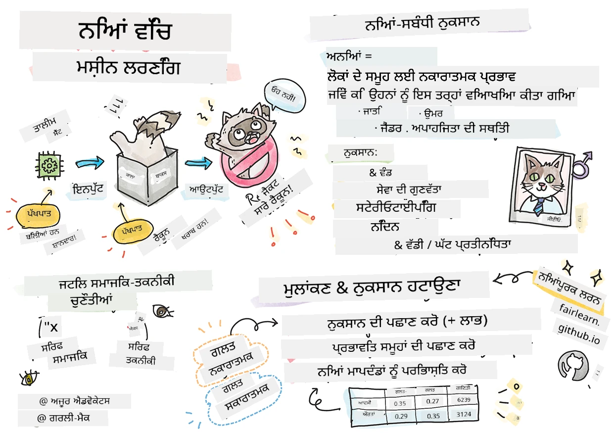

# ਜ਼ਿੰਮੇਵਾਰ AI ਨਾਲ ਮਸ਼ੀਨ ਲਰਨਿੰਗ ਹੱਲ ਬਣਾਉਣਾ
 

> ਸਕੈਚਨੋਟ ਲੇਖਕ [Tomomi Imura](https://www.twitter.com/girlie_mac)

## [ਪ੍ਰੀ-ਲੇਕਚਰ ਕੁਇਜ਼](https://ff-quizzes.netlify.app/en/ml/)
 
## ਪਰਿਚਯ

ਇਸ ਪਾਠਕ੍ਰਮ ਵਿੱਚ, ਤੁਸੀਂ ਪਤਾ ਲਗਾਉਣਾ ਸ਼ੁਰੂ ਕਰੋਗੇ ਕਿ ਮਸ਼ੀਨ ਲਰਨਿੰਗ ਸਾਡੇ ਰੋਜ਼ਾਨਾ ਜੀਵਨ 'ਤੇ ਕਿਵੇਂ ਅਤੇ ਕਿਦਾਂ ਪ੍ਰਭਾਵ ਪਾ ਰਹੀ ਹੈ। ਅਜੇ ਵੀ, ਸਿਸਟਮ ਅਤੇ ਮਾਡਲ ਦੈਨੀਕ ਫੈਸਲੇ ਲੈਣ ਵਾਲੇ ਕੰਮਾਂ 'ਚ ਸ਼ਾਮਿਲ ਹਨ, ਜਿਵੇਂ ਕਿ ਸਿਹਤ ਸੰਭਾਲ ਦੀ ਨਿਧਾਨੀ, ਲੋਨ ਮਨਜ਼ੂਰੀ ਜਾਂ ਧੋਖਾਧੜੀ ਦੀ ਪਛਾਣ। ਇਸ ਲਈ ਇਹ ਜ਼ਰੂਰੀ ਹੈ ਕਿ ਇਹ ਮਾਡਲ ਵਧੀਆ ਕੰਮ ਕਰਨ ਤਾਂ ਜੋ ਨਤੀਜੇ ਭਰੋਸੇਯੋਗ ਹੋਣ। ਜਿਵੇਂ ਕਿਸੇ ਵੀ ਸਾਫਟਵੇਅਰ ਏਪਲੀਕੇਸ਼ਨ ਦੀ ਤਰ੍ਹਾਂ, AI ਸਿਸਟਮ ਉਮੀਦਾਂ 'ਤੇ ਖਰਾ ਨਹੀਂ ਉਤਰ ਸਕਦੇ ਜਾਂ ਨاپਸੰਦ ਨਤੀਜੇ ਦਿੰਦੇ ਹਨ। ਇਸ ਲਈ AI ਮਾਡਲ ਦੇ ਵਰਤਾਵ ਨੂੰ ਸਮਝਣਾ ਅਤੇ ਵਿਆਖਿਆ ਕਰਨਾ ਬਹੁਤ ਜ਼ਰੂਰੀ ਹੈ।

ਸੋਚੋ ਜਦੋਂ ਤੁਸੀਂ ਮਾਡਲ ਬਣਾਉਣ ਲਈ ਜੋ ਡੇਟਾ ਵਰਤ ਰਹੇ ਹੋ ਉਹ ਕੁਝਲੋੜੀਂਦੇ ਲੋਕਸੰਖਿਆਵਾਂ, ਜਿਵੇਂ ਕਿ ਜਾਤੀ, ਲਿੰਗ, ਸਿਆਸੀ ਦ੍ਰਿਸ਼ਟੀਕੋਣ, ਧਰਮ ਦਾ ਘਾਟ ਹੈ ਜਾਂ ਦਰੁਸਤ ਤੌਰ 'ਤੇ ਨੁਮਾਇੰਦਗੀ ਨਹੀਂ ਕਰਦਾ। ਜਦ ਮਾਡਲ ਦਾ ਨਤੀਜਾ ਕਿਸੇ ਖਾਸ ਲੋਕਸੰਖਿਆਵਾਂ ਦੇ ਹੱਕ ਵਿੱਚ ਪਰਗਟ ਕੀਤਾ ਜਾਂਦਾ ਹੈ ਤਾਂ ਕੀ ਹੁੰਦਾ ਹੈ? ਐਪਲੀਕੇਸ਼ਨ ਲਈ ਨਤੀਜਾ ਕੀ ਹੈ? ਇਸ ਤੋਂ ਇਲਾਵਾ, ਜਦ ਮਾਡਲ ਦਾ ਨਤੀਜਾ ਵਿਰੋਧੀ ਹੁੰਦਾ ਹੈ ਅਤੇ ਲੋਕਾਂ ਨੂੰ ਨੁਕਸਾਨ ਪਹੁੰਚਾਉਂਦਾ ਹੈ ਤਾਂ ਕੀ ਹੁੰਦਾ ਹੈ? AI ਸਿਸਟਮ ਦੇ ਵਰਤਾਵ ਲਈ ਜਿੱਤੂ ਨੰਬਰ ਹੈ? ਇਹ ਕੁਝ ਪ੍ਰਸ਼ਨ ਹਨ ਜੋ ਅਸੀਂ ਇਸ ਪਾਠਕ੍ਰਮ ਵਿੱਚ ਖੋਜਾਂਗੇ।

ਇਸ ਪਾਠ ਵਿੱਚ, ਤੁਸੀਂ:

- ਮਸ਼ੀਨ ਲਰਨਿੰਗ ਵਿੱਚ ਨਿਆਂ ਦੀ ਮਹੱਤਤਾ ਅਤੇ ਨਿਆਂ ਨਾਲ ਜੁੜੇ ਨੁਕਸਾਨਾਂ ਦੀ ਜਾਗਰੂਕਤਾ ਵਧਾਓਗੇ।
- ਭਰੋਸੇਯੋਗਤਾ ਅਤੇ ਸੁਰੱਖਿਆ ਨੂੰ ਯਕੀਨੀ ਬਨਾਉਣ ਲਈ ਅਸਧਾਰਣ ਹਾਲਤਾਂ ਅਤੇ ਦੁਸਪ੍ਰਵਿਰਤੀਆਂ ਦੀ ਖੋਜ ਕਰਨ ਦੀ ਅਭਿਆਸ ਨਾਲ ਜਾਣੂ ਹੋਵੋਗੇ।
- ਸ਼ਾਮਲ ਸਿਸਟਮ ਡਿਜ਼ਾਈਨ ਕਰਕੇ ਸਾਰੇ ਨੂੰ ਸ਼ਕਤੀਸ਼ਾਲੀ ਬਣਾਉਣ ਦੀ ਲੋੜ ਨੂੰ ਸਮਝੋਗੇ।
- ਡੇਟਾ ਅਤੇ ਲੋਕਾਂ ਦੀ ਗੋਪਨੀਯਤਾ ਅਤੇ ਸੁਰੱਖਿਆ ਦੀ ਰੱਖਿਆ ਕਿੰਨੀ ਜਰੂਰੀ ਹੈ ਇਸ ਨੂੰ ਵੇਖੋਂਗੇ।
- AI ਮਾਡਲ ਦੀ ਵਰਤੋਂ ਨੂੰ ਸਮਝਾਉਣ ਲਈ ਕਾਂਚ ਦੀ ਡੱਬੀ (ਗਲਾਸ ਬਾਕਸ) ਪਹੁੰਚ ਦੀ ਮਹੱਤਤਾ ਨੂੰ ਸਮਝੋਂਗੇ।
- AI ਸਿਸਟਮ ਵਿੱਚ ਭਰੋਸਾ ਬਣਾਉਣ ਲਈ ਲਾਗੂ ਜਾਣ ਦੀ ਜ਼ਰੂਰਤ ਦਾ ਧਿਆਨ ਰੱਖੋਗੇ।

## ਪੂਰਵ-ਸ਼ਰਤ

ਇੱਕ ਪੂਰਵ-ਸ਼ਰਤ ਵਜੋਂ, ਕਿਰਪਾ ਕਰਕੇ "ਜ਼ਿੰਮੇਵਾਰ AI ਸਿਧਾਂਤ" ਲਰਨ ਪਾਥ ਲਓ ਅਤੇ ਹੇਠਾਂ ਦਿੱਤੀ ਵੀਡੀਓ ਵੇਖੋ:

ਇਸ [ਲਰਨਿੰਗ ਪਾਥ](https://docs.microsoft.com/learn/modules/responsible-ai-principles/?WT.mc_id=academic-77952-leestott) ਨੂੰ ਫੋਲੋ ਕਰਕੇ ਜ਼ਿੰਮੇਵਾਰ AI ਬਾਰੇ ਹੋਰ ਸਿੱਖੋ

> 🎥 ਉੱਪਰ ਦੀ ਚਿੱਤਰ ਤੇ ਕਲਿੱਕ ਕਰੋ ਇੱਕ ਵੀਡੀਓ ਲਈ: Microsoft ਦੀ ਜ਼ਿੰਮੇਵਾਰ AI ਤਰੀਕਾ

## ਨਿਆਂ

AI ਸਿਸਟਮ ਸਭ ਨੂੰ ਨਿਆਂਪੂਰਕਵਾਂ ਵਤੀਕਾ ਨਾਲ ਤਕ ਰਹਿਣਾ ਚਾਹੀਦਾ ਹੈ ਅਤੇ ਇੱਕੋ ਸਮੂਹ ਦੇ ਲੋਕਾਂ ਨੂੰ ਵੱਖ-ਵੱਖ ਤਰੀਕਿਆਂ ਨਾਲ ਪ੍ਰਭਾਵਿਤ ਕਰਨ ਤੋਂ ਬਚਣਾ ਚਾਹੀਦਾ ਹੈ। ਉਦਾਹਰਣ ਲਈ, ਜਦ AI ਸਿਸਟਮ ਮੈਡੀਕਲ ਇਲਾਜ, ਲੋਨ ਅਰਜ਼ੀਆਂ ਜਾਂ ਨੌਕਰੀ ਸਮੰਬੰਧੀ ਸਲਾਹ ਦਿੰਦੇ ਹਨ, ਤਾਂ ਉਹ ਇੱਕੋ ਲੱਛਣਾਂ, ਵਿੱਤੀ ਹਾਲਾਤਾਂ ਜਾਂ ਪੇਸ਼ੇਵਰ ਯੋਗਤਾਵਾਂ ਵਾਲੇ ਹਰ ਕਿਸੇ ਲਈ ਇੱਕੋ ਜਿਹੇ ਸਿਫਾਰਸ਼ਾਂ ਕਰਨ। ਹਰ ਇਕ ਇਨਸਾਨ ਦੇ ਅੰਦਰ ਵਿਰਾਸਤ ਵਾਲੇ ਭੇਦਭਾਵ ਹੁੰਦੇ ਹਨ ਜੋ ਸਾਡੇ ਫੈਸਲਿਆਂ ਅਤੇ ਕਾਰਵਾਈਆਂ ਨੂੰ ਪ੍ਰਭਾਵਿਤ ਕਰਦੇ ਹਨ। ਇਹ ਭੇਦਭਾਵ ਮਸ਼ੀਨ ਲਰਨਿੰਗ ਸਿਸਟਮ ਟ੍ਰੇਨ ਕਰਨ ਵਾਲੇ ਡੇਟਾ ਵਿੱਚ ਵਿਖਾਈ ਦੇ ਸਕਦੇ ਹਨ। ਕਈ ਵਾਰ ਇਹ ਮਨਜ਼ੂਰੀ ਤੋਂ ਬਿਨਾਂ ਹੁੰਦਾ ਹੈ। ਜਾਣ-ਬੁਝ ਕੇ ਡੇਟਾ ਵਿੱਚ ਭੇਦਭਾਵ ਛੱਡਣੀ ਔਖਾ ਹੁੰਦਾ ਹੈ।

**“ਨਿਆਂਪੂਰਕਤਾ ਦੀ ਘਾਟ”** ਦੇ ਅਰਥ ਹਨ ਨਕਾਰਾਤਮਕ ਪ੍ਰਭਾਵ ਜਾਂ “ਨੁਕਸਾਨ” ਜਿਸ ਦਾ ਪ੍ਰਭਾਵ ਕੁਝ ਲੋਕਸੰਖਿਆਵਾਂ ਉਤੇ ਪੈਂਦਾ ਹੈ ਜਿਵੇਂ ਕਿ ਜਾਤੀ, ਲਿੰਗ, ਉਮਰ ਜਾਂ ਅਪੰਗਤਾ ਦੀ ਸਥਿਤੀ। ਮੁੱਖ ਨਿਆਂ ਨਾਲ ਜੁੜੇ ਨੁਕਸਾਨ ਨੂੰ ਵੱਖ-ਵੱਖ ਤਰ੍ਹਾਂ ਵੰਡਿਆ ਜਾ ਸਕਦਾ ਹੈ:

- **ਵੰਡ**: ਉਦਾਹਰਣ ਵਜੋਂ ਕਿਸੇ ਲਿੰਗ ਜਾਂ ਜਨਸੰਖਿਆਵਾਂ ਨੂੰ ਦੂਜੇ ਨਾਲੋਂ ਪਸੰਦ ਕਰਨਾ।
- **ਸੇਵਾ ਦੀ ਗੁਣਵੱਤਾ**: ਜੇ ਤੁਸੀਂ ਕਿਸੇ ਖਾਸ ਹਾਲਤ ਲਈ ਡੇਟਾ ਸਿਖਾਉਂਦੇ ਹੋ ਪਰ ਹਕੀਕਤ ਕਾਫੀ ਜ਼ਿਆਦਾ ਕੁੰਝਣੀ ਹੁੰਦੀ ਹੈ, ਤਾਂ ਇਹ ਖਰਾਬ ਕਾਰਗੁਜ਼ਾਰੀ ਵਾਲੀ ਸੇਵਾ ਦੇਵੇਗਾ। ਉਦਾਹਰਣ ਵਜੋਂ ਇੱਕ ਹੱਥ ਮੈਲੀ ਫੋਹਣ ਵਾਲਾ ਜਿਹੜਾ ਗੋਰੇ ਤੇ ਕਾਲੇ ਚਿੱਬੜ ਵਾਲੇ ਲੋਕਾਂ ਨੂੰ ਅੰਦਰ ਨਾ ਸੁੰਘ ਪਾਏ। [Reference](https://gizmodo.com/why-cant-this-soap-dispenser-identify-dark-skin-1797931773)
- **ਧੋਖਾਧੜੀ**: ਕਿਸੇ ਚੀਜ਼ ਜਾਂ ਕਿਸੇ ਨੂੰ ਅਨਿਆਂਪੂਰਕ ਆਲੋਚਨਾ ਕਰਨੀ ਜਾਂ ਲੇਬਲ ਲਾਉਣਾ। ਉਦਾਹਰਣ ਵਜੋਂ, ਇੱਕ ਚਿੱਤਰ ਲੇਬਲਿੰਗ ਤਕਨੀਕ ਨੇ ਕਾਲੇ ਚਿੱਬੜ ਵਾਲੇ ਲੋਕਾਂ ਦੀਆਂ ਤਸਵੀਰਾਂ ਨੂੰ ਗੋਰਿਲਾ ਦੇ ਤੌਰ ਤੇ ਗਲਤ ਲੇਬਲ ਕੀਤਾ।
- **ਅਧਿਕ ਜਾਂ ਘੱਟ ਪ੍ਰਤੀਨਿਧਿਤਾ**: ਵਿਚਾਰ ਇਹ ਹੈ ਕਿ ਇੱਕ ਸਮੂਹ ਕਿਸੇ ਖਾਸ ਪੇਸ਼ੇ ਵਿੱਚ ਨਹੀਂ ਦੇਖਿਆ ਜਾਂਦਾ ਅਤੇ ਕੋਈ ਵੀ ਸੇਵਾ ਜਾਂ ਕੰਮ ਜੋ ਇਸ ਸਮੂਹ ਨੂੰ ਅੱਗੇ ਵਧਾਉਂਦੀ ਹੈ, ਉਹ ਨੁਕਸਾਨ ਪਹੁੰਚਾ ਰਹੀ ਹੈ।
- **ਸਟੇਰੀਓਟਾਈਪਿੰਗ**: ਕਿਸੇ ਸਮੂਹ ਨੂੰ ਪਹਿਲਾਂ ਤੋਂ ਦਿੱਤੇ ਗਏ ਗੁਣਾਂ ਨਾਲ ਜੋੜਨਾ। ਉਦਾਹਰਣ ਵਜੋਂ, ਇੱਕ ਭਾਸ਼ਾ ਅਨੁਵਾਦ ਪ੍ਰਣਾਲੀ ਜਿਹੜਾ ਅੰਗਰੇਜ਼ੀ ਅਤੇ ਤੁਰਕੀ ਭਾਸ਼ਾ ਵਿਚਕਾਰ ਅਕਸਰਲੜੀਆਂ ਨਾਲ ਲਿੰਗ ਨਾਲ ਸਬੰਧਿਤ ਵਿਚਾਰਾਂ ਦੀ ਵਜ੍ਹਾ ਨਾਲ ਗਲਤੀਆਂ ਕਰ ਸਕਦੀ ਹੈ।

> ਤੁਰਕੀ ਭਾਸ਼ਾ ਵਿੱਚ ਅਨੁਵਾਦ

> ਅੰਗਰੇਜ਼ੀ ਵਾਪਸ ਅਨੁਵਾਦ

ਜਦ AI ਸਿਸਟਮ ਡਿਜ਼ਾਈਨ ਅਤੇ ਟੈਸਟ ਕੀਤੇ ਜਾਂਦੇ ਹਨ, ਸਾਨੂੰ ਯਕੀਨੀ ਬਣਾਉਣਾ ਚਾਹੀਦਾ ਹੈ ਕਿ AI ਨਿਆਂਪੂਰਕ ਹੈ ਅਤੇ ਪੱਖਪਾਤੀ ਜਾਂ ਵੱਖਰਾ ਦਿਲਚਸਪੀ ਵਾਲੇ ਫੈਸਲੇ ਨਹੀਂ ਲੈਂਦਾ, ਜਿਹੜੇ ਮਨੁੱਖਾਂ ਨੂੰ ਵੀ ਮਨਜ਼ੂਰ ਨਹੀਂ। AI ਅਤੇ ਮਸ਼ੀਨ ਲਰਨਿੰਗ ਵਿੱਚ ਨਿਆਂ ਦੀ ਗਾਰੰਟੀ ਦੇਣਾ ਇੱਕ ਜਟਿਲ ਸਮਾਜ-ਤਕਨਾਲੋਜੀ ਦੀ ਚੁਣੌਤੀ ਹੈ।

### ਭਰੋਸੇਯੋਗਤਾ ਅਤੇ ਸੁਰੱਖਿਆ

ਭਰੋਸਾ ਬਣਾਉਣ ਲਈ, AI ਸਿਸਟਮ ਸਾਧਾਰਣ ਅਤੇ ਅਣਪੇਖੇ ਹਾਲਤਾਂ ਵਿੱਚ ਭਰੋਸੇਯੋਗ, ਸੁਰੱਖਿਅਤ ਅਤੇ ਲਗਾਤਾਰ ਹੋਣੇ ਚਾਹੀਦੇ ਹਨ। ਇਹ ਜਾਣਨਾ ਜਰੂਰੀ ਹੈ ਕਿ AI ਸਿਸਟਮ ਕਿਵੇਂ ਵੱਖ-ਵੱਖ ਸਥਿਤੀਆਂ ਵਿੱਚ ਵਰਤੋਂ ਕਰਨਗੇ, ਖ਼ਾਸ ਕਰ ਕੇ ਜਦ ਉਹ ਅਸਾਧਾਰਣ ਪੜਦੇ ਹਨ। AI ਹੱਲ ਬਣਾਉਂਦੇ ਸਮੇਂ, ਇਹ ਬਹੁਤ ਜਰੂਰੀ ਹੈ ਕਿ ਸਾਰੇ ਸੰਭਾਵਿਤ ਹਾਲਾਤਾਂ ਦੀ ਸੰਭਾਲ ਕਿਵੇਂ ਕਰਨੀ ਹੈ, ਜਿਸ ਨਾਲ AI ਹੋਰ ਸਵਾਲਾਂ ਦਾ ਸਾਹਮਣਾ ਕਰ ਸਕਦਾ ਹੈ। ਉਦਾਹਰਣ ਲਈ, ਇੱਕ ਸਵੈ-ਚਲਿਤ ਕਾਰ ਦੀ ਸਭ ਤੋਂ ਵੱਡੀ ਤਰਜੀਹ ਲੋਕਾਂ ਦੀ ਸੁਰੱਖਿਆ ਹੁੰਦੀ ਹੈ। ਇਸ ਲਈ, ਕਾਰ ਨੂੰ ਚਲਾਉਣ ਲਈ AI ਨੂੰ ਉਹ ਸਾਰੇ ਸੰਭਾਵਿਤ ਸਥਿਤੀਆਂ ਦਾ ਧਿਆਨ ਰੱਖਣਾ ਪੈਂਦਾ ਹੈ ਜਿਵੇਂ ਕਿ ਰਾਤ, ਤੂਫਾਨ, ਬਰਫ਼ਦਾਰ ਹਵਾ, ਬੱਚੇ ਸੜਕ ਪਾਰ ਕਰਦੇ ਹੋਏ, ਪਾਲਤੂ ਜਾਨਵਰ, ਸੜਕ ਦੀ ਮਰੰਮਤ ਆਦਿ। ਇੱਕ AI ਸਿਸਟਮ ਕਿਵੇਂ ਇਸ ਤਰ੍ਹਾਂ ਦੀਆਂ ਸਥਿਤੀਆਂ ਨੂੰ ਵਿਸ਼ਵਾਸਯੋਗ ਅਤੇ ਸੁਰੱਖਿਅਤ ਤਰੀਕੇ ਨਾਲ ਮੈਨੇਜ ਕਰਦਾ ਹੈ, ਇਹ ਸਿਫ਼ਤ ਦਾ ਪੱਧਰ ਦਰਸਾਉਂਦਾ ਹੈ ਜੋ ਡੇਟਾ ਵਿਗਿਆਨੀ ਜਾਂ AI ਵਿਕਾਸਕਰਤਾ ਨੇ ਡਿਜ਼ਾਈਨ ਜਾਂ ਟੈਸਟ ਦੇ ਦੌਰਾਨ ਵਿਚਾਰ ਕੀਤੇ ਹਨ।

> [🎥 ਏਥੇ ਕਲਿੱਕ ਕਰੋ ਇੱਕ ਵੀਡੀਓ ਲਈ: ](https://www.microsoft.com/videoplayer/embed/RE4vvIl)

### ਸ਼ਾਮਿਲਤਾ

AI ਸਿਸਟਮ ਇਸ ਤਰ੍ਹਾਂ ਡਿਜ਼ਾਈਨ ਕਰਨੇ ਚਾਹੀਦੇ ਹਨ ਕਿ ਸਾਰੇ ਲੋਕ ਸ਼ਾਮਿਲ ਹੋਣ ਅਤੇ ਸ਼ਕਤੀਸ਼ਾਲੀ ਬਣਾਉਣ। ਜਦ AI ਸਿਸਟਮਾਂ ਦਾ ਡਿਜ਼ਾਈਨ ਅਤੇ ਅਮਲ ਕੀਤਾ ਜਾਂਦਾ ਹੈ, ਡੇਟਾ ਵਿਗਿਆਨੀ ਅਤੇ AI ਵਿਕਾਸਕਰਤਾ ਉਨ੍ਹਾਂ ਅੜਚਣਾਂ ਦੀ ਪਹਚਾਣ ਕਰਦੇ ਹਨ ਅਤੇ ਹੱਲ ਕਰਦੇ ਹਨ ਜੋ ਬਿਨਾਂ ਇੱਛਤ ਲੋਕਾਂ ਨੂੰ ਬਾਹਰ ਰੱਖ ਸਕਦੀਆਂ ਹਨ। ਉਦਾਹਰਣ ਵਜੋਂ, ਦੁਨੀਆ ਭਰ ਵਿੱਚ 1 ਬਿਲੀਅਨ ਲੋਕ ਅਪੰਗਤਾ ਵਾਲੇ ਹਨ। AI ਦੇ ਵਿਕਾਸ ਨਾਲ ਉਹ ਹਰ ਰੋਜ਼ ਦੇ ਜੀਵਨ ਵਿੱਚ ਬਹੁਤ ਸਾਰੀ ਜਾਣਕਾਰੀ ਅਤੇ ਮੁਲਾਂਕਣਾਂ ਤੱਕ ਆਸਾਨੀ ਨਾਲ ਪਹੁੰਚ ਸਕਦੇ ਹਨ। ਅੜਚਣਾਂ ਦਾ ਹੱਲ ਕਰਕੇ, ਇਹ ਸਭ ਲਈ ਬਿਹਤਰ ਅਨੁਭਵ ਵਾਲੇ AI ਉਤਪਾਦ ਵਿਕਸਿਤ ਕਰਨ ਦੇ ਮੌਕੇ ਬਣਾਉਂਦਾ ਹੈ।

> [🎥 ਏਥੇ ਕਲਿੱਕ ਕਰੋ ਇੱਕ ਵੀਡੀਓ ਲਈ: AI ਵਿੱਚ ਸ਼ਾਮਿਲਤਾ](https://www.microsoft.com/videoplayer/embed/RE4vl9v)

### ਸੁਰੱਖਿਆ ਅਤੇ ਗੋਪਨੀਯਤਾ 

AI ਸਿਸਟਮ ਸੁਰੱਖਿਅਤ ਹੋਣ ਅਤੇ ਲੋਕਾਂ ਦੀ ਗੋਪਨੀਯਤਾ ਦਾ ਸਤਿਕਾਰ ਕਰਨੇ ਚਾਹੀਦੇ ਹਨ। ਲੋਕ ਉਹਨਾਂ ਸਿਸਟਮਾਂ ਤੇ ਘੱਟ ਭਰੋਸਾ ਕਰਦੇ ਹਨ ਜੋ ਉਨ੍ਹਾਂ ਦੀ ਗੋਪਨੀਯਤਾ, ਜਾਣਕਾਰੀ, ਜਾਂ ਜਿੰਦਗੀ ਨੂੰ ਖ਼ਤਰੇ ਵਿੱਚ ਪਾਉਂਦੇ ਹਨ। ਮਸ਼ੀਨ ਲਰਨਿੰਗ ਮਾਡਲ ਟਰੇਨ ਕਰਦੇ ਸਮੇਂ, ਅਸੀਂ ਵਧੀਆ ਨਤੀਜੇ ਲੈਣ ਲਈ ਡੇਟਾ ਦੀ ਭਰੋਸਾ ਕਰਦੇ ਹਾਂ। ਇਸ ਕਾਰਜ ਵਿੱਚ, ਡੇਟਾ ਦਾ ਮੂਲ ਅਤੇ ਇਮਾਨਦਾਰੀ ਧਿਆਨ ਵਿੱਚ ਰੱਖਣੀਆਂ ਚਾਹੀਦੀਆਂ ਹਨ। ਉਦਾਹਰਣ ਲਈ, ਕੀ ਡੇਟਾ ਯੂਜ਼ਰ ਨੇ ਦਿੱਤਾ ਸੀ ਜਾਂ ਸਭ ਲੋਕਾਂ ਲਈ ਉਪਲਬਧ ਸੀ? ਅਗਲੇ, ਡੇਟਾ ਨਾਲ ਕੰਮ ਕਰਦੇ ਹੋਏ, AI ਸਿਸਟਮਾਂ ਨੂੰ ਰਾਜ਼ਦਾਰ ਜਾਣਕਾਰੀ ਦੀ ਰੱਖਿਆ ਅਤੇ ਹਮਲਿਆਂ ਤੋਂ ਬਚਾਅ ਕਰਨ ਨੂੰ ਵਿਕਸਤ ਕਰਨਾ ਜ਼ਰੂਰੀ ਹੈ। ਜਿਵੇਂ-ਜਿਵੇਂ AI ਵਿਆਪਕ ਹੁੰਦਾ ਜਾ ਰਿਹਾ ਹੈ, ਗੋਪਨੀਯਤਾ ਦੀ ਸੁਰੱਖਿਆ ਅਤੇ ਨਿੱਜੀ ਜਾਂ ਕਾਰੋਬਾਰੀ ਜਾਣਕਾਰੀ ਦੀ ਸੁਰੱਖਿਆ ਬਹੁਤ ਮਹੱਤਵਪੂਰਨ ਅਤੇ ਜਟਿਲ ਹੁੰਦੀ ਜਾ ਰਹੀ ਹੈ। AI ਲਈ ਗੋਪਨੀਯਤਾ ਅਤੇ ਡੇਟਾ ਸੁਰੱਖਿਆ ਮੁੱਦੇ ਖਾਸ ਧਿਆਨ ਦੀ ਮੰਗ ਕਰਦੇ ਹਨ ਕਿਉਂਕਿ ਡੇਟਾ ਤੱਕ ਪਹੁੰਚ AI ਸਿਸਟਮਾਂ ਲਈ ਅੰਦਾਜ਼ੇ ਅਤੇ ਫੈਸਲੇ ਕਰਨ ਲਈ ਅਸਲ ਅਤੇ ਜਾਣਕਾਰੀ ਵਾਲੇ ਬਣਾਉਂਦੇ ਹਨ।

> [🎥 ਏਥੇ ਕਲਿੱਕ ਕਰੋ ਇੱਕ ਵੀਡੀਓ ਲਈ: AI ਵਿੱਚ ਸੁਰੱਖਿਆ](https://www.microsoft.com/videoplayer/embed/RE4voJF)

- ਇੰਡਸਟਰੀ ਵਜੋਂ ਅਸੀਂ ਗੋਪਨੀਯਤਾ ਅਤੇ ਸੁਰੱਖਿਆ ਵਿੱਚ ਮਹੱਤਵਪੂਰਨ ਤਰੱਕੀ ਕੀਤੀ ਹੈ, ਜਿਸਦਾ ਮੁੱਖ ਪ੍ਰੇਰਕ GDPR (ਸਧਾਰਨ ਡੇਟਾ ਸੁਰੱਖਿਆ ਨਿਯਮ) ਵਰਗੇ ਨਿਯਮ ਹਨ।
- ਫਿਰ ਵੀ AI ਸਿਸਟਮਾਂ ਨਾਲ ਸਾਨੂੰ ਇੱਕ ਤਣਾਅ ਸਵੀਕਾਰਣਾ ਪੈਂਦਾ ਹੈ ਜੋ ਵੱਧ ਨਿੱਜੀ ਡੇਟਾ ਦੀ ਲੋੜ ਅਤੇ ਗੋਪਨੀਯਤਾ ਦਰਮਿਆਨ ਹੈ।
- ਜਿਵੇਂ ਇੰਟਰਨੈੱਟ ਨਾਲ ਕੰਪਿਊਟਰਾਂ ਦੇ ਜਨਮ ਦੇ ਸਮੇਂ, ਹੁਣ ਅਸੀਂ AI ਨਾਲ ਸਬੰਧਤ ਸੁਰੱਖਿਆ ਮੁੱਦਿਆਂ ਵਿੱਚ ਵੱਡੀ ਵਾਧਾ ਦੇਖ ਰਹੇ ਹਾਂ।
- ਉਸੇ ਸਮੇਂ, ਅਸੀਂ AI ਨੂੰ ਸੁਰੱਖਿਆ ਵਿੱਚ ਸੁਧਾਰ ਕਰਨ ਲਈ ਵੀ ਵਰਤਦੇ ਦੇਖਦੇ ਹਾਂ। ਉਦਾਹਰਣ ਲਈ, ਆਧੁਨਿਕ ਵਾਇਰਸ ਸਕੈਨਰ ਆਜ ਕਈ AI ਹੀਯੂਰਿਸਟਿਕਸ ਨਾਲ ਚੱਲਦੇ ਹਨ।
- ਸਾਨੂੰ ਯਕੀਨੀ ਬਣਾਉਣਾ ਪਵੇਗਾ ਕਿ ਸਾਡੀਆਂ ਡੇਟਾ ਸਾਇੰਸ prakiriyā'an ਨਵੀਨਤਮ ਗੋਪਨੀਯਤਾ ਅਤੇ ਸੁਰੱਖਿਆ ਅਮਲਾਂ ਨਾਲ ਸੁੰਦਰਤਾ ਨਾਲ ਮਿਲ ਰਹੀਆਂ ਹਨ।

### ਪਾਰਦਰਸ਼ਤਾ
AI ਸਿਸਟਮ ਸਮਝਣ ਯੋਗ ਹੋਣੇ ਚਾਹੀਦੇ ਹਨ। ਪਾਰਦਰਸ਼ਤਾ ਦਾ ਇੱਕ ਅਹਿਮ ਹਿੱਸਾ AI ਸਿਸਟਮਾਂ ਅਤੇ ਉਹਨਾਂ ਦੇ ਘਟਕਾਂ ਦੇ ਵਰਤਾਵ ਦੀ ਵਿਆਖਿਆ ਕਰਨਾ ਹੈ। AI ਬਾਰੇ ਸਮਝ ਵਧਾਉਣ ਲਈ ਇਹ ਜ਼ਰੂਰੀ ਹੈ ਕਿ ਹਿੱਸੇਦਾਰ ਸਮਝ ਲੈਣ ਕਿ ਇਹ ਕਿਵੇਂ ਅਤੇ ਕਿਉਂ ਕੰਮ ਕਰਦੇ ਹਨ ਤਾਂ ਜੋ ਉਹ ਸੰਭਾਵਿਤ ਕਾਰਗੁਜ਼ਾਰੀ ਸਮੱਸਿਆਵਾਂ, ਸੁਰੱਖਿਆ ਅਤੇ ਗੋਪਨੀਯਤਾ ਚਿੰਤਾਵਾਂ, ਭੇਦਭਾਵ, ਬਾਹਰ ਕੱਢਣ ਵਾਲੀਆਂ ਪ੍ਰਥਾਵਾਂ ਜਾਂ ਅਣਇੱਛਿਤ ਨਤੀਜਿਆਂ ਦੀ ਪਹਚਾਣ ਕਰ ਸਕਣ। ਅਸੀਂ ਇਹ ਵੀ ਮੰਨਦੇ ਹਾਂ ਕਿ ਜੋ AI ਸਿਸਟਮ ਵਰਤਦੇ ਹਨ ਉਹ ਸੱਚੇ ਹੋਣੇ ਚਾਹੀਦੇ ਹਨ ਅਤੇ ਇਹ ਦੱਸਣਾ ਚਾਹੀਦਾ ਹੈ ਕਿ ਕਦੋਂ, ਕਿਉਂ ਅਤੇ ਕਿਵੇਂ ਉਹਨਾ ਨੂੰ ਵਰਤਿਆ ਜਾ ਰਿਹਾ ਹੈ ਅਤੇ ਉਹਨਾਂ ਦੀਆਂ ਸੀਮਾਵਾਂ ਕੀ ਹਨ। ਉਦਾਹਰਣ ਵਜੋਂ, ਜੇ ਇੱਕ ਬੈਂਕ ਆਪਣੀਆਂ ਲੈਣਦਾਰੀ ਫੈਸਲਿਆਂ ਵਿੱਚ AI ਸਿਸਟਮ ਦੀ ਸਹਾਇਤਾ ਲੈਂਦੀ ਹੈ, ਤਾਂ ਇਹ ਜਰੂਰੀ ਹੈ ਕਿ ਨਤੀਜਿਆਂ ਦੀ ਸਮੀਖਿਆ ਕੀਤੀ ਜਾਵੇ ਅਤੇ ਸਮਝਿਆ ਜਾਵੇ ਕਿ ਕਿਹੜਾ ਡੇਟਾ ਸਿਸਟਮ ਦੀ ਸਿਫਾਰਸ਼ਾਂ ਨੂੰ ਪ੍ਰਭਾਵਿਤ ਕਰਦਾ ਹੈ। ਸਰਕਾਰਾਂ ਉਦਯੋਗ ਵਿੱਚ AI ਨੂੰ ਨਿਯੰਤ੍ਰਿਤ ਕਰਨ ਲੱਗੀਆਂ ਹਨ, ਇਸ ਲਈ ਡੇਟਾ ਵਿਗਿਆਨੀ ਅਤੇ ਸੰਸਥਾਵਾਂ ਨੂੰ ਇਹ ਸਮਝਾਉਣਾ ਪਵੇਗਾ ਕਿ ਕੀ AI ਸਿਸਟਮ ਨਿਯਮਾਂ ਦੀ ਪਾਲਣਾ ਕਰਦਾ ਹੈ, ਖ਼ਾਸ ਕਰ ਕੇ ਜਦ ਕੋਈ ਅਣਚਾਹਾ ਨਤੀਜਾ ਨਿਕਲਦਾ ਹੈ।

> [🎥 ਏਥੇ ਕਲਿੱਕ ਕਰੋ ਇੱਕ ਵੀਡੀਓ ਲਈ: AI ਵਿੱਚ ਪਾਰਦਰਸ਼ਤਾ](https://www.microsoft.com/videoplayer/embed/RE4voJF)

- ਕਿਉਂਕਿ AI ਸਿਸਟਮ ਬਹੁਤ ਕੁੰਝਣੀ ਹੁੰਦੇ ਹਨ, ਇਹ ਸਮਝਣਾ ਅੌਖਾ ਹੈ ਕਿ ਇਹ ਕਿਵੇਂ ਕੰਮ ਕਰਦੇ ਹਨ ਅਤੇ ਨਤੀਜਿਆਂ ਦੀ ਵਿਆਖਿਆ ਕਰਨਾ।
- ਇਹ ਸਮਝ ਨਾ ਹੋਣ ਕਾਰਨ ਇਹ ਸਿਸਟਮ ਕਿਵੇਂ ਸਾਂਭੇ ਜਾਂ ਸੰਚਾਲਿਤ ਕੀਤੇ ਜਾਂਦੇ ਹਨ ਅਤੇ ਦਸਤਾਵੇਜ਼ੀਕਰਨ ਪ੍ਰਭਾਵਿਤ ਹੁੰਦਾ ਹੈ।
- ਸਭ ਤੋਂ ਮਹੱਤਵਪੂਰਨ, ਇਸ ਸਮਝ ਨਾ ਹੋਣ ਕਾਰਨ ਇਸ ਸਿਸਟਮ ਨਾਲ ਕੀਤੇ ਨਤੀਜਿਆਂ 'ਤੇ ਆਧਾਰਿਤ ਫੈਸਲੇ ਪ੍ਰਭਾਵਿਤ ਹੁੰਦੇ ਹਨ।

### ਜਵਾਬਦੇਹੀ 
 
ਜਿਹੜੇ ਲੋਕ AI ਸਿਸਟਮਾਂ ਦਾ ਡਿਜ਼ਾਈਨ ਤੇ ਤਾਇਨਾਤ ਕਰਦੇ ਹਨ ਉਹਨਾਂ ਨੂੰ ਇਹ ਜਵਾਬਦੇਹ ਹੋਣਾ ਜ਼ਰੂਰੀ ਹੈ ਕਿ ਉਹਨਾਂ ਦੇ ਸਿਸਟਮ ਕਿਵੇਂ ਕੰਮ ਕਰ ਰਹੇ ਹਨ। ਜਵਾਬਦੇਹੀ ਦੀ ਲੋੜ ਖ਼ਾਸ ਕਰ ਕੇ ਸੈਂਸਿਟਿਵ ਉਪਯੋਗਤਮਕ ਤਕਨੀਕਾਂ ਲਈ ਬਹੁਤ ਮੁਹਤਵਪੂਰਨ ਹੈ ਜਿਵੇਂ ਕਿ ਚਿਹਰਾ ਪਛਾਣ। ਹਾਲ ਹੀ ਵਿੱਚ, ਚਿਹਰਾ ਪਛਾਣ ਤਕਨੀਕ ਲਈ ਮੰਗ ਵੱਧ ਰਹੀ ਹੈ, ਖ਼ਾਸ ਕਰ ਕੇ ਕਾਨੂੰਨੀ ਏਜੰਸੀਆਂ ਤੋਂ ਜੋ ਇਸ ਤਕਨੀਕ ਨੂੰ ਗੁੰਮਸੁਮ ਬੱਚਿਆਂ ਨੂੰ ਲਭਣ ਲਈ ਵਧੀਆ ਮੰਨਦੀਆਂ ਹਨ। ਪਰ ਇਹ ਤਕਨੀਕਾਂ ਸਰਕਾਰ ਵੱਲੋਂ ਆਪਣੇ ਨਾਗਰਿਕਾਂ ਦੀਆਂ ਮੂਲਭੂਤ ਆਜ਼ਾਦੀਆਂ ਨੂੰ ਖ਼ਤਰੇ ਵਿੱਚ ਪਾਕੇ ਵਰਤੀ ਜਾ ਸਕਦੀਆਂ ਹਨ, ਉਦਾਹਰਣ ਵਜੋਂ ਕਿਸੇ ਵਿਸ਼ੇਸ਼ ਵਿਅਕਤੀਆਂ ਦੀ ਲਗਾਤਾਰ ਨਿਗਰਾਨੀ ਕਰਨ ਲਈ। ਇਸ ਲਈ, ਡੇਟਾ ਵਿਗਿਆਨੀ ਅਤੇ ਸੰਗਠਨਾਂ ਨੂੰ ਜ਼ਿੰਮੇਵਾਰ ਹੋਣਾ ਚਾਹੀਦਾ ਹੈ ਕਿ ਉਹਨਾਂ ਦਾ AI ਸਿਸਟਮ ਵਿਅਕਤੀਆਂ ਜਾਂ ਸਮਾਜ 'ਤੇ ਕਿਵੇਂ ਪ੍ਰਭਾਵ ਪਾਉਂਦਾ ਹੈ।

> 🎥 ਉੱਪਰ ਦਿੱਤੀ ਚਿੱਤਰ ਤੇ ਕਲਿੱਕ ਕਰੋ ਇੱਕ ਵੀਡੀਓ ਲਈ: ਚਿਹਰਾ ਪਛਾਣ ਰਾਹੀਂ ਜਨਤਕ ਨਿਗਰਾਨੀ ਦੀਆਂ ਚੇਤਾਵਨੀਆਂ

ਆਖਰੀ ਤੌਰ 'ਤੇ, ਸਾਡੇ ਜਮਾਨੇ ਲਈ ਸਭ ਤੋਂ ਵੱਡਾ ਸਵਾਲ ਇੱਕ ਹੈ, ਕਿਵੇਂ ਯਕੀਨੀ ਬਣਾਈਏ ਕਿ ਕੰਪਿਊਟਰ ਲੋਕਾਂ ਲਈ ਜਵਾਬਦੇਹ ਰਹਿਣਗੇ ਅਤੇ ਜੋ ਉਹਨਾਂ ਕੰਪਿਊਟਰਾਂ ਨੂੰ ਡਿਜ਼ਾਈਨ ਕਰਦੇ ਹਨ, ਉਹ ਹਰ ਕਿਸੇ ਲਈ ਜਵਾਬਦੇਹ ਰਹਿਣਗੇ।

## ਪ੍ਰਭਾਵ ਮੁਲਾਂਕਣ

ਮਸ਼ੀਨ ਲਰਨਿੰਗ ਮਾਡਲ ਟ੍ਰੇਨ ਕਰਨ ਤੋ ਪਹਿਲਾਂ, ਪ੍ਰਭਾਵ ਮੁਲਾਂਕਣ ਕਰਨਾ ਜ਼ਰੂਰੀ ਹੈ ਤਾਂ ਜੋ ਇਹ ਸਮਝਿਆ ਜਾਵੇ ਕਿ AI ਸਿਸਟਮ ਦਾ ਮਕਸਦ ਕੀ ਹੈ; ਇਸਦਾ ਇਛਿਤ ਉਪਯੋਗ ਕੀ ਹੈ; ਕਿੱਥੇ ਇਸਨੂੰ ਤਾਇਨਾਤ ਕੀਤਾ ਜਾਵੇਗਾ; ਅਤੇ ਕੌਣ ਇਸ ਸਿਸਟਮ ਨਾਲ ਸੰਪਰਕ ਕਰੇਗਾ। ਇਹ ਸੰਪਾਲਕਾਂ ਜਾਂ ਟੈਸਟ ਕਰਨ ਵਾਲਿਆਂ ਲਈ ਮਦਦਗਾਰ ਹੁੰਦਾ ਹੈ ਜੋ ਸਿਸਟਮ ਦਾ ਮੁਲਾਂਕਣ ਕਰਦੇ ਹਨ ਤਾਂ ਜੋ ਉਹ ਸੰਭਾਵਿਤ ਜੋਖਿਮ ਤੇ ਅਸਰਾਂ ਨੂੰ ਸਮਝ ਸਕਣ।

ਪ੍ਰਭਾਵ ਮੁਲਾਂਕਣ ਦੌਰਾਨ ਧਿਆਨ ਕੇਂਦਰਿਤ ਕਰਨ ਵਾਲੀਆਂ ਚੀਜ਼ਾਂ:

* **ਵਿਅਕਤੀਆਂ 'ਤੇ ਨਕਾਰਾਤਮਕ ਅਸਰ**। ਕਿਸੇ ਪਾਬੰਦੀ ਜਾਂ ਲੋੜਾਂ, ਅਣਸਮਰਥਿਤ ਉਪਯੋਗ ਜਾਂ ਕਿਸੇ ਵੀ ਜਾਣੀ-ਪਛਾਣੀ ਸੀਮਾਵਾਂ ਨੂੰ ਜਾਣਣਾ ਜਰੂਰੀ ਹੈ ਜੋ ਸਿਸਟਮ ਦੀ ਕਾਰਗੁਜ਼ਾਰੀ ਵਿਚ ਰੁਕਾਵਟ ਪਾ ਸਕਦੀਆਂ ਹਨ ਤਾਂ ਜੋ ਇਹ ਯਕੀਨੀ ਬਣਾਇਆ ਜਾਵੇ ਕਿ ਸਿਸਟਮ ਅਜਿਹੇ ਤਰੀਕੇ ਨਾਲ ਵਰਤਿਆ ਨਾ ਜਾਵੇ ਜੋ ਲੋਕਾਂ ਨੂੰ ਨੁਕਸਾਨ ਪਹੁੰਚਾਵੇ।
* **ਡੇਟਾ ਲੋੜਾਂ**। ਇਹ ਸਮਝਣਾ ਕਿ ਸਿਸਟਮ ਡੇਟਾ ਨੂੰ ਕਿਵੇਂ ਅਤੇ ਕਿੱਥੇ ਵਰਤੇਗਾ, ਸਮੀਖਿਅਕਾਂ ਲਈ ਵਧੀਆ ਹੁੰਦਾ ਹੈ ਤਾਂ ਜੋ ਉਹ ਕਿਸੇ ਵੀ ਡੇਟਾ ਦੀ ਲੋੜਾਂ ਜਾਂ ਪਾਬੰਦੀਆਂ (ਜਿਵੇਂ GDPR ਜਾਂ HIPAA ਨਿਯਮ) ਦਾ ਧਿਆਨ ਰੱਖ ਸਕਣ। ਇਸਦੇ ਨਾਲ-ਨਾਲ ਇਹ ਦੇਖਣੀ ਵੀ ਜ਼ਰੂਰੀ ਹੈ ਕਿ ਡੇਟਾ ਦਾ ਮੂਲ ਜਾਂ ਮਾਤਰਾ ਟਰੇਨਿੰਗ ਲਈ ਪਰਯਾਪਤ ਹੈ ਜਾਂ ਨਹੀਂ।
* **ਪ੍ਰਭਾਵ ਦਾ ਸੰਖੇਪ**। ਸਿਸਟਮ ਦੀ ਵਰਤੋਂ ਨਾਲ ਉੱਭਰ ਸਕਦੀਆਂ ਸੰਭਾਵਿਤ ਨੁਕਸਾਨਾਂ ਦੀ ਸੂਚੀ ਇਕੱਠੀ ਕਰੋ। ਪੂਰੇ ਮਸ਼ੀਨ ਲਰਨਿੰਗ ਜੀਵਨਚੱਕਰ ਵਿੱਚ, ਮੁਲਾਂਕਣ ਕਰੋ ਕਿ ਪਛਾਣੀਆਂ ਸਮੱਸਿਆਵਾਂ ਦੂਰ ਕੀਤੀਆਂ ਜਾਂ ਹੱਲ ਕੀਤੀਆਂ ਗਈਆਂ ਹਨ ਜਾਂ ਨਹੀਂ।
* **ਲਾਗੂ ਉਦਦੇਸ਼** ਛੇ ਮੁੱਖ ਸਿਧਾਂਤਾਂ ਲਈ। ਜਾਂਚੋ ਕਿ ਹਰ ਸਿਧਾਂਤ ਦੇ ਉਦੇਸ਼ ਪੂਰੇ ਹੋ ਰਹੇ ਹਨ ਜਾਂ ਕੋਈ ਖਾਚਾਂ ਹਨ।

## ਜ਼ਿੰਮੇਵਾਰ AI ਨਾਲ ਡਿਬੱਗਿੰਗ  

ਜਿਵੇਂ ਕਿਸੇ ਸਾਫਟਵੇਅਰ ਏਪਲੀਕੇਸ਼ਨ ਦਾ ਡਿਬੱਗ ਕਰਨਾ, AI ਸਿਸਟਮ ਦਾ ਡਿਬੱਗ ਕਰਨਾ ਵੀ ਇਸਦੀ ਸਮੱਸਿਆ ਦੀ ਪਹਚਾਣ ਅਤੇ ਉਸਦਾ ਹੱਲ ਲੱਭਣ ਦੀ ਜਰੂਰੀ ਪ੍ਰਕਿਰਿਆ ਹੈ। ਕਈ ਕਾਰਕ ਹਨ ਜੋ ਮਾਡਲ ਨੂੰ ਉਮੀਦਾਂ ਮੁਤਾਬਕ ਜਾਂ ਜ਼ਿੰਮੇਵਾਰ ਤਰੀਕੇ ਨਾਲ ਕੰਮ ਨਹੀਂ ਕਰਨ ਦਿੰਦੇ। ਜ਼ਿਆਦਾਤਰ ਰਵਾਇਤੀ ਮਾਡਲ ਕਾਰਗੁਜ਼ਾਰੀ ਮੈਟਰਿਕਸ ਮਾਡਲ ਦੇ ਕਾਰਗੁਜ਼ਾਰੀ ਦੇ ਮਾਤਰਾਤਮਕ ਸੰਗ੍ਰਹਿਣ ਹਨ, ਜੋ ਕਿ ਜ਼ਿੰਮੇਵਾਰ AI ਸਿਧਾਂਤਾਂ ਦਾ ਉਲੰਘਣ ਕਿਵੇਂ ਹੁੰਦਾ ਹੈ, ਇਹ ਜਾਣਚ ਕਰਨ ਲਈ ਕਾਫੀ ਨਹੀਂ। ਇਸ ਤੋਂ ਇਲਾਵਾ, ਮਸ਼ੀਨ ਲਰਨਿੰਗ ਮਾਡਲ ਕਾਲੀ ਡੱਬੀ ਹੁੰਦੀ ਹੈ ਜੋ ਇਹ ਸਮਝਣਾ ਮੁਸ਼ਕਿਲ ਕਰ ਦਿੰਦੀ ਹੈ ਕਿ ਕਿਸ ਚੀਜ਼ ਨੇ ਇਸਦਾ ਨਤੀਜਾ ਪ੍ਰਭਾਵਿਤ ਕੀਤਾ ਜਾਂ ਜਦੋਂ ਗਲਤੀ ਹੁੰਦੀ ਹੈ ਤਦ ਉਸਦੀ ਵਿਆਖਿਆ ਦੇਣੀ ਜਰੂਰੀ ਹੈ। ਇਸ ਕੋਰਸ ਵਿੱਚ ਅੱਗੇ ਅਸੀਂ ਸਿੱਖਾਂਗੇ ਕਿ ਕਿਵੇਂ Responsible AI ਡੈਸ਼ਬੋਰਡ ਦੀ ਵਰਤੋਂ ਕਰਕੇ AI ਸਿਸਟਮਾਂ ਨੂੰ ਡਿਬੱਗ ਕੀਤਾ ਜਾ ਸਕਦਾ ਹੈ। ਇਹ ਡੈਸ਼ਬੋਰਡ ਡੇਟਾ ਵਿਗਿਆਨੀਆਂ ਅਤੇ AI ਡਿਵੈਲਪਰਾਂ ਲਈ ਇੱਕ ਸਮੱਗੜੀ ਟੂਲ ਹੈ ਜੋ ਵਿੱਚ ਵੱਖ-ਵੱਖ ਗਤਿਵਿਧੀਆਂ ਹੈ:

* **ਗਲਤੀ ਵਿਸ਼ਲੇਸ਼ਣ**: ਮਾਡਲ ਦੀ ਗਲਤੀ ਵੰਡ ਦੀ ਪਛਾਣ ਕਰਨ ਲਈ ਜੋ ਸਿਸਟਮ ਦੀ ਨਿਆਂਪੂਰਕਤਾ ਜਾਂ ਭਰੋਸੇਯੋਗਤਾ ਨੂੰ ਪ੍ਰਭਾਵਿਤ ਕਰ ਸਕਦੀ ਹੈ।
* **ਮਾਡਲ ਸੰਖੇਪ**: ਵੇਖੋ ਕਿ ਕਿਹੜੇ ਡੇਟਾ ਕੋਹੋਰਟਸ ਵਿੱਚ ਮਾਡਲ ਦੀ ਕਾਰਗੁਜ਼ਾਰੀ ਵਿੱਚ ਅੰਤਰ ਹਨ।
* **ਡੇਟਾ ਵਿਸ਼ਲੇਸ਼ਣ**: ਡੇਟਾ ਦੀ ਵੰਡ ਨੂੰ ਸਮਝਣ ਅਤੇ ਕਿਸੇ ਵੀ ਸੰਭਾਵਿਤ ਭੇਦਭਾਵ ਦੀ ਪਹਚਾਣ ਕਰਨ ਲਈ ਜੋ ਨਿਆਂ, ਸ਼ਾਮਿਲਤਾ ਅਤੇ ਭਰੋਸੇਯੋਗਤਾ ਮੁੱਦਿਆਂ ਵੱਲ ਲੈ ਕਰ ਜਾਂਦਾ ਹੈ।
* **ਮਾਡਲ ਵਿਆਖਿਆਯੋਗਤਾ**: ਸਮਝੋ ਕਿ ਮਾਡਲ ਦੀਆਂ ਭਵਿੱਖਵਾਣੀਆਂ ਨੂੰ ਕੀ ਪ੍ਰਭਾਵਿਤ ਕਰਦਾ ਹੈ। ਇਹ ਮਾਡਲ ਦੇ ਵਰਤਾਵ ਦੀ ਵਿਆਖਿਆ ਵਿੱਚ ਮਦਦ ਕਰਦਾ ਹੈ ਜੋ ਪਾਰਦਰਸ਼ਤਾ ਅਤੇ ਜਵਾਬਦੇਹੀ ਲਈ ਮਹੱਤਵਪੂਰਨ ਹੈ।

## 🚀 ਚੁਣੌਤੀ 
 
ਨੁਕਸਾਨ ਪੈਦਾ ਹੋਣ ਤੋਂ ਪਹਿਲਾਂ ਰੋਕਣ ਲਈ ਸਾਨੂੰ:

- ਉਹਨਾਂ ਲੋਕਾਂ ਵਿੱਚ ਵੱਖ-ਵੱਖ ਪਿਛੋਕੜਾਂ ਅਤੇ ਨਜ਼ਰੀਏ ਹੋਣੇ ਚਾਹੀਦੇ ਹਨ ਜੋ ਸਿਸਟਮ 'ਤੇ ਕੰਮ ਕਰ ਰਹੇ ਹਨ
- ਸਮਾਜ ਦੀ ਵੱਖ-ਵੱਖਤਾ ਨੂੰ ਦਰਸਾਉਣ ਵਾਲੇ ਡੇਟਾਸੈੱਟਾਂ ਵਿੱਚ ਨਿਵੇਸ਼ ਕਰੋ
- ਮਸ਼ੀਨ ਲਰਨਿੰਗ ਦੇ ਜੀਵਨਚੱਕਰ ਵਿੱਚ ਜ਼ਿੰਮੇਵਾਰ AI ਦੇ ਖ਼ਿਲਾਫ ਗ਼ਲਤੀ ਜਾਂ ਪੱਖਪਾਤ ਤੜਫਣ ਅਤੇ ਸਹੀ ਕਰਨ ਦੇ ਬਿਹਤਰ ਤਰੀਕੇ ਵਿਕਸਤ ਕਰੋ

ਅਸਲ ਜ਼ਿੰਦਗੀ ਦੀਆਂ ਸਥਿਤੀਆਂ ਬਾਰੇ ਸੋਚੋ ਜਿੱਥੇ ਮਾਡਲ ਦੀ ਅਣਭਰੋਸਾ ਮਾਫ਼ ਹੋ ਰਹੀ ਹੈ ਮਾਡਲ ਬਣਾਉਣ ਅਤੇ ਵਰਤੋਂ ਵਿੱਚ। ਹੋਰ ਕੀ ਧਿਆਨ ਵਿੱਚ ਲੈਣਾ ਚਾਹੀਦਾ ਹੈ?

## [ਪੋਸਟ-ਲੇਕਚਰ ਕੁਇਜ਼](https://ff-quizzes.netlify.app/en/ml/)

## ਸਮੀਖਿਆ ਅਤੇ ਸਵੈ-ਅਧਿਐਨ 
 

ਇਸ ਪਾਠ ਵਿੱਚ, ਤੁਸੀਂ ਮਸ਼ੀਨ ਲਰਨਿੰਗ ਵਿੱਚ ਨਿਆਂ ਅਤੇ ਅਨਿਆਂ ਦੇ ਕੁਝ ਬੁਨਿਆਦੀ ਸਿਧਾਂਤ ਸਿੱਖੇ ਹਨ।  
 
ਇਸ ਵਰਕਸ਼ਾਪ ਨੂੰ ਦੇਖੋ ਤਾਂ ਜੋ ਵਿਸ਼ਿਆਂ ਵਿੱਚ ਹੋਰ ਗਹਿਰਾਈ ਨਾਲ ਜਾ ਸਕੋ: 

- ਜ਼ਿੰਮੇਵਾਰ ਏਆਈ ਦੀ ਖੋਜ ਵਿੱਚ: ਪ੍ਰਿੰਸੀਪਲ ਨੂੰ ਅਮਲ ਵਿੱਚ ਲਿਆਉਣਾ ਬੈਸਮੀਰਾ ਨੁਸ਼ੀ, ਮੇਹਰਨੂਸ਼ ਸਾਮੇਕੀ ਅਤੇ ਅਮਿਤ ਸ਼ਰਮਾ ਵੱਲੋਂ

> 🎥 ਵੀਡੀਓ ਲਈ ਉੱਪਰ ਦਿੱਤੀ ਜਾ ਤਸਵੀਰ 'ਤੇ ਕਲਿਕ ਕਰੋ: ਜ਼ਿੰਮੇਵਾਰ ਏਆਈ ਟੂਲਬਾਕਸ: ਜ਼ਿੰਮੇਵਾਰ ਏਆਈ ਬਣਾਉਣ ਲਈ ਇੱਕ ਓਪਨ-ਸੋਰਸ ਫਰੇਮਵਰਕ ਬੈਸਮੀਰਾ ਨੁਸ਼ੀ, ਮੇਹਰਨੂਸ਼ ਸਾਮੇਕੀ, ਅਤੇ ਅਮਿਤ ਸ਼ਰਮਾ ਵੱਲੋਂ

ਇਸਦੇ ਅਲਾਵਾ, ਪੜ੍ਹੋ: 

- ਮਾਈਕਰੋਸੋਫ਼ਟ ਦਾ RAI ਸਰੋਤ ਕੇਂਦਰ: [Responsible AI Resources – Microsoft AI](https://www.microsoft.com/ai/responsible-ai-resources?activetab=pivot1%3aprimaryr4) 

- ਮਾਈਕਰੋਸੋਫ਼ਟ ਦਾ FATE ਰਿਸਰਚ ਗਰੁੱਪ: [FATE: Fairness, Accountability, Transparency, and Ethics in AI - Microsoft Research](https://www.microsoft.com/research/theme/fate/) 

RAI ਟੂਲਬਾਕਸ: 

- [Responsible AI Toolbox GitHub repository](https://github.com/microsoft/responsible-ai-toolbox)

ਐਜ਼ੂਰ ਮਸ਼ੀਨ ਲਰਨਿੰਗ ਦੇ ਉਪਕਰਨਾਂ ਬਾਰੇ ਪੜ੍ਹੋ ਜੋ ਨਿਆਂਸੰਗਤਾ ਨੂੰ ਯਕੀਨੀ ਬਨਾਉਂਦੇ ਹਨ:

- [Azure Machine Learning](https://docs.microsoft.com/azure/machine-learning/concept-fairness-ml?WT.mc_id=academic-77952-leestott) 

## ਅਸਾਈਨਮੈਂਟ

[RAI Toolbox ਦਾ ਅਨੁਸੰਧਾਨ ਕਰੋ](assignment.md)

---

<!-- CO-OP TRANSLATOR DISCLAIMER START -->
**ਅਸਵੀਕਾਰੋਪਣ**:
ਇਸ ਦਸਤਾਵੇਜ਼ ਦਾ ਅਨੁਵਾਦ ਏਆਈ ਅਨੁਵਾਦ ਸੇਵਾ [Co-op Translator](https://github.com/Azure/co-op-translator) ਦੀ ਵਰਤੋਂ ਕਰਕੇ ਕੀਤਾ ਗਿਆ ਹੈ। ਜਦੋਂ ਕਿ ਅਸੀਂ ਸਹੀਤਾਵਾਂ ਲਈ ਯਤਨਸ਼ੀਲ ਹਾਂ, ਕਿਰਪਾ ਕਰਕੇ ਧਿਆਨ ਰੱਖੋ ਕਿ ਸਵੈਚਾਲਿਤ ਅਨੁਵਾਦਾਂ ਵਿੱਚ ਗਲਤੀਆਂ ਜਾਂ ਅਸਮੱਤਿਆਵਾਂ ਹੋ ਸਕਦੀਆਂ ਹਨ। ਮੂਲ ਦਸਤਾਵੇਜ਼ ਆਪਣੀ ਮੂਲ ਭਾਸ਼ਾ ਵਿੱਚ ਅਧਿਕਾਰਕ ਸਰੋਤ ਮੰਨਿਆ ਜਾਣਾ ਚਾਹੀਦਾ ਹੈ। ਜਰੂਰੀ ਜਾਣਕਾਰੀ ਲਈ, ਪੇਸ਼ੇਵਰ ਮਨੁੱਖੀ ਅਨੁਵਾਦ ਦੀ ਸਿਫ਼ਾਰਸ਼ ਕੀਤੀ ਜਾਂਦੀ ਹੈ। ਅਸੀਂ ਇਸ ਅਨੁਵਾਦ ਦੇ ਉਪਯੋਗ ਤੋਂ ਪੈਦਾ ਹੋਣ ਵਾਲੀਆਂ ਕਿਸੇ ਵੀ ਗਲਤਫਹਿਮੀਆਂ ਜਾਂ ਗਲਤ ਵਿਆਖਿਆਵਾਂ ਲਈ ਜਵਾਬਦੇਹ ਨਹੀਂ ਹਾਂ।
<!-- CO-OP TRANSLATOR DISCLAIMER END -->