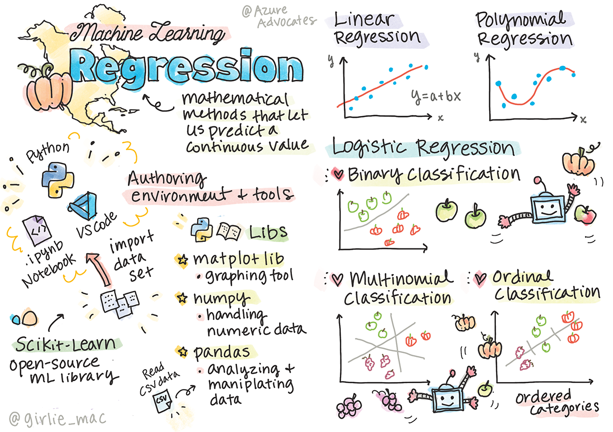

<!--
CO_OP_TRANSLATOR_METADATA:
{
  "original_hash": "6b1cb0e46d4c5b747eff6e3607642760",
  "translation_date": "2025-08-29T16:50:37+00:00",
  "source_file": "2-Regression/1-Tools/README.md",
  "language_code": "pa"
}
-->
# Python ਅਤੇ Scikit-learn ਨਾਲ ਰਿਗ੍ਰੈਸ਼ਨ ਮਾਡਲਾਂ ਲਈ ਸ਼ੁਰੂਆਤ ਕਰੋ



> ਸਕੈਚਨੋਟ [Tomomi Imura](https://www.twitter.com/girlie_mac) ਦੁਆਰਾ

## [ਪ੍ਰੀ-ਲੈਕਚਰ ਕਵਿਜ਼](https://gray-sand-07a10f403.1.azurestaticapps.net/quiz/9/)

> ### [ਇਹ ਪਾਠ R ਵਿੱਚ ਉਪਲਬਧ ਹੈ!](../../../../2-Regression/1-Tools/solution/R/lesson_1.html)

## ਪਰਿਚਯ

ਇਨ੍ਹਾਂ ਚਾਰ ਪਾਠਾਂ ਵਿੱਚ, ਤੁਸੀਂ ਸਿੱਖੋਗੇ ਕਿ ਰਿਗ੍ਰੈਸ਼ਨ ਮਾਡਲਾਂ ਕਿਵੇਂ ਬਣਾਉਣੇ ਹਨ। ਅਸੀਂ ਜਲਦੀ ਹੀ ਚਰਚਾ ਕਰਾਂਗੇ ਕਿ ਇਹ ਕਿਉਂ ਜ਼ਰੂਰੀ ਹਨ। ਪਰ ਕੁਝ ਵੀ ਕਰਨ ਤੋਂ ਪਹਿਲਾਂ, ਇਹ ਯਕੀਨੀ ਬਣਾਓ ਕਿ ਤੁਹਾਡੇ ਕੋਲ ਸਹੀ ਟੂਲ ਹਨ ਤਾਂ ਜੋ ਪ੍ਰਕਿਰਿਆ ਸ਼ੁਰੂ ਕੀਤੀ ਜਾ ਸਕੇ!

ਇਸ ਪਾਠ ਵਿੱਚ, ਤੁਸੀਂ ਸਿੱਖੋਗੇ ਕਿ:

- ਆਪਣੀ ਕੰਪਿਊਟਰ ਨੂੰ ਸਥਾਨਕ ਮਸ਼ੀਨ ਲਰਨਿੰਗ ਕਾਰਜਾਂ ਲਈ ਕਨਫਿਗਰ ਕਰਨਾ।
- Jupyter ਨੋਟਬੁੱਕਾਂ ਨਾਲ ਕੰਮ ਕਰਨਾ।
- Scikit-learn ਦੀ ਵਰਤੋਂ ਕਰਨਾ, ਜਿਸ ਵਿੱਚ ਇੰਸਟਾਲੇਸ਼ਨ ਸ਼ਾਮਲ ਹੈ।
- ਲੀਨੀਅਰ ਰਿਗ੍ਰੈਸ਼ਨ ਦੀ ਪੜਚੋਲ ਕਰਨਾ ਇੱਕ ਹੱਥ-ਅਭਿਆਸ ਨਾਲ।

## ਇੰਸਟਾਲੇਸ਼ਨ ਅਤੇ ਕਨਫਿਗਰੇਸ਼ਨ

[](https://youtu.be/-DfeD2k2Kj0 "ਮਸ਼ੀਨ ਲਰਨਿੰਗ ਮਾਡਲ ਬਣਾਉਣ ਲਈ ਆਪਣੇ ਟੂਲ ਸੈਟਅਪ ਕਰੋ")

> 🎥 ਉਪਰੋਕਤ ਚਿੱਤਰ 'ਤੇ ਕਲਿਕ ਕਰੋ ਇੱਕ ਛੋਟੀ ਵੀਡੀਓ ਦੇਖਣ ਲਈ ਜਿਸ ਵਿੱਚ ML ਲਈ ਕੰਪਿਊਟਰ ਕਨਫਿਗਰ ਕੀਤਾ ਗਿਆ ਹੈ।

1. **Python ਇੰਸਟਾਲ ਕਰੋ**। ਯਕੀਨੀ ਬਣਾਓ ਕਿ [Python](https://www.python.org/downloads/) ਤੁਹਾਡੇ ਕੰਪਿਊਟਰ 'ਤੇ ਇੰਸਟਾਲ ਹੈ। ਤੁਸੀਂ Python ਨੂੰ ਕਈ ਡਾਟਾ ਸਾਇੰਸ ਅਤੇ ਮਸ਼ੀਨ ਲਰਨਿੰਗ ਕਾਰਜਾਂ ਲਈ ਵਰਤੋਂਗੇ। ਜ਼ਿਆਦਾਤਰ ਕੰਪਿਊਟਰ ਸਿਸਟਮਾਂ ਵਿੱਚ ਪਹਿਲਾਂ ਹੀ Python ਇੰਸਟਾਲ ਹੁੰਦੀ ਹੈ। ਕੁਝ ਵਰਤੋਂਕਾਰਾਂ ਲਈ ਸੈਟਅਪ ਨੂੰ ਆਸਾਨ ਬਣਾਉਣ ਲਈ [Python Coding Packs](https://code.visualstudio.com/learn/educators/installers?WT.mc_id=academic-77952-leestott) ਵੀ ਉਪਲਬਧ ਹਨ।

   ਹਾਲਾਂਕਿ Python ਦੀ ਕੁਝ ਵਰਤੋਂ ਇੱਕ ਵਰਜਨ ਦੀ ਲੋੜ ਰੱਖਦੀ ਹੈ, ਜਦਕਿ ਹੋਰ ਵਰਤੋਂ ਲਈ ਵੱਖਰੀ ਵਰਜਨ ਦੀ ਲੋੜ ਹੁੰਦੀ ਹੈ। ਇਸ ਕਾਰਨ, ਇੱਕ [ਵਰਚੁਅਲ ਵਾਤਾਵਰਣ](https://docs.python.org/3/library/venv.html) ਵਿੱਚ ਕੰਮ ਕਰਨਾ ਲਾਭਦਾਇਕ ਹੁੰਦਾ ਹੈ।

2. **Visual Studio Code ਇੰਸਟਾਲ ਕਰੋ**। ਯਕੀਨੀ ਬਣਾਓ ਕਿ Visual Studio Code ਤੁਹਾਡੇ ਕੰਪਿਊਟਰ 'ਤੇ ਇੰਸਟਾਲ ਹੈ। [Visual Studio Code](https://code.visualstudio.com/) ਨੂੰ ਇੰਸਟਾਲ ਕਰਨ ਲਈ ਇਹ ਹਦਾਇਤਾਂ ਪਾਲੋ। ਤੁਸੀਂ ਇਸ ਕੋਰਸ ਵਿੱਚ Python ਨੂੰ Visual Studio Code ਵਿੱਚ ਵਰਤੋਂਗੇ, ਇਸ ਲਈ [Visual Studio Code](https://docs.microsoft.com/learn/modules/python-install-vscode?WT.mc_id=academic-77952-leestott) ਨੂੰ Python ਵਿਕਾਸ ਲਈ ਕਨਫਿਗਰ ਕਰਨ ਬਾਰੇ ਸਿੱਖਣ ਦੀ ਸਿਫਾਰਸ਼ ਕੀਤੀ ਜਾਂਦੀ ਹੈ।

   > Python ਨਾਲ ਆਰਾਮਦਾਇਕ ਹੋਣ ਲਈ, [Learn modules](https://docs.microsoft.com/users/jenlooper-2911/collections/mp1pagggd5qrq7?WT.mc_id=academic-77952-leestott) ਦੇ ਇਸ ਸੰਗ੍ਰਹਿ 'ਤੇ ਕੰਮ ਕਰੋ।
   >
   > [](https://youtu.be/yyQM70vi7V8 "Visual Studio Code ਨਾਲ Python ਸੈਟਅਪ ਕਰੋ")
   >
   > 🎥 ਉਪਰੋਕਤ ਚਿੱਤਰ 'ਤੇ ਕਲਿਕ ਕਰੋ ਇੱਕ ਵੀਡੀਓ ਦੇਖਣ ਲਈ: VS Code ਵਿੱਚ Python ਦੀ ਵਰਤੋਂ।

3. **Scikit-learn ਇੰਸਟਾਲ ਕਰੋ**, [ਇਹ ਹਦਾਇਤਾਂ](https://scikit-learn.org/stable/install.html) ਪਾਲੋ। ਕਿਉਂਕਿ ਤੁਹਾਨੂੰ ਯਕੀਨੀ ਬਣਾਉਣਾ ਹੈ ਕਿ ਤੁਸੀਂ Python 3 ਦੀ ਵਰਤੋਂ ਕਰ ਰਹੇ ਹੋ, ਇਸ ਲਈ ਵਰਚੁਅਲ ਵਾਤਾਵਰਣ ਦੀ ਸਿਫਾਰਸ਼ ਕੀਤੀ ਜਾਂਦੀ ਹੈ। ਧਿਆਨ ਦਿਓ, ਜੇ ਤੁਸੀਂ M1 Mac 'ਤੇ ਇਹ ਲਾਇਬ੍ਰੇਰੀ ਇੰਸਟਾਲ ਕਰ ਰਹੇ ਹੋ, ਤਾਂ ਉਪਰੋਕਤ ਲਿੰਕ 'ਤੇ ਵਿਸ਼ੇਸ਼ ਹਦਾਇਤਾਂ ਹਨ।

4. **Jupyter Notebook ਇੰਸਟਾਲ ਕਰੋ**। ਤੁਹਾਨੂੰ [Jupyter ਪੈਕੇਜ](https://pypi.org/project/jupyter/) ਇੰਸਟਾਲ ਕਰਨ ਦੀ ਲੋੜ ਹੋਵੇਗੀ।

## ਤੁਹਾਡਾ ML ਲੇਖਨ ਵਾਤਾਵਰਣ

ਤੁਸੀਂ **ਨੋਟਬੁੱਕਾਂ** ਦੀ ਵਰਤੋਂ ਕਰਕੇ ਆਪਣਾ Python ਕੋਡ ਵਿਕਸਿਤ ਕਰੋਗੇ ਅਤੇ ਮਸ਼ੀਨ ਲਰਨਿੰਗ ਮਾਡਲ ਬਣਾਉਣਗੇ। ਇਹ ਫਾਈਲ ਕਿਸਮ ਡਾਟਾ ਸਾਇੰਟਿਸਟਾਂ ਲਈ ਆਮ ਟੂਲ ਹੈ, ਅਤੇ ਇਹਨਾਂ ਨੂੰ `.ipynb` ਐਕਸਟੈਂਸ਼ਨ ਦੁਆਰਾ ਪਛਾਣਿਆ ਜਾ ਸਕਦਾ ਹੈ।

ਨੋਟਬੁੱਕ ਇੱਕ ਇੰਟਰਐਕਟਿਵ ਵਾਤਾਵਰਣ ਹੈ ਜੋ ਵਿਕਸਿਤ ਕਰਨ ਵਾਲੇ ਨੂੰ ਕੋਡ ਲਿਖਣ ਅਤੇ ਕੋਡ ਦੇ ਆਲੇ-ਦੁਆਲੇ ਦਸਤਾਵੇਜ਼ ਬਣਾਉਣ ਦੀ ਆਗਿਆ ਦਿੰਦਾ ਹੈ, ਜੋ ਪ੍ਰਯੋਗਾਤਮਕ ਜਾਂ ਖੋਜ-ਅਧਾਰਿਤ ਪ੍ਰਾਜੈਕਟਾਂ ਲਈ ਕਾਫ਼ੀ ਮਦਦਗਾਰ ਹੁੰਦਾ ਹੈ।

[](https://youtu.be/7E-jC8FLA2E "ਮਸ਼ੀਨ ਲਰਨਿੰਗ ਲਈ Jupyter ਨੋਟਬੁੱਕ ਸੈਟਅਪ ਕਰੋ")

> 🎥 ਉਪਰੋਕਤ ਚਿੱਤਰ 'ਤੇ ਕਲਿਕ ਕਰੋ ਇੱਕ ਛੋਟੀ ਵੀਡੀਓ ਦੇਖਣ ਲਈ।

### ਅਭਿਆਸ - ਨੋਟਬੁੱਕ ਨਾਲ ਕੰਮ ਕਰੋ

ਇਸ ਫੋਲਡਰ ਵਿੱਚ, ਤੁਹਾਨੂੰ _notebook.ipynb_ ਫਾਈਲ ਮਿਲੇਗੀ।

1. _notebook.ipynb_ ਨੂੰ Visual Studio Code ਵਿੱਚ ਖੋਲ੍ਹੋ।

   ਇੱਕ Jupyter ਸਰਵਰ Python 3+ ਨਾਲ ਸ਼ੁਰੂ ਹੋਵੇਗਾ। ਤੁਹਾਨੂੰ ਨੋਟਬੁੱਕ ਦੇ ਖੇਤਰ ਮਿਲਣਗੇ ਜੋ `run` ਕੀਤੇ ਜਾ ਸਕਦੇ ਹਨ, ਕੋਡ ਦੇ ਟੁਕੜੇ। ਤੁਸੀਂ ਕੋਡ ਬਲਾਕ ਨੂੰ ਚਲਾਉਣ ਲਈ ਪਲੇ ਬਟਨ ਵਰਗੇ ਆਈਕਨ ਨੂੰ ਚੁਣ ਸਕਦੇ ਹੋ।

1. `md` ਆਈਕਨ ਚੁਣੋ ਅਤੇ ਕੁਝ ਮਾਰਕਡਾਊਨ ਅਤੇ ਹੇਠਾਂ ਦਿੱਤਾ ਟੈਕਸਟ ਸ਼ਾਮਲ ਕਰੋ **# ਤੁਹਾਡੇ ਨੋਟਬੁੱਕ ਵਿੱਚ ਸਵਾਗਤ ਹੈ**।

   ਅਗਲੇ, ਕੁਝ Python ਕੋਡ ਸ਼ਾਮਲ ਕਰੋ।

1. ਕੋਡ ਬਲਾਕ ਵਿੱਚ **print('hello notebook')** ਲਿਖੋ।
1. ਕੋਡ ਚਲਾਉਣ ਲਈ ਤੀਰ ਚੁਣੋ।

   ਤੁਹਾਨੂੰ ਪ੍ਰਿੰਟ ਕੀਤਾ ਬਿਆਨ ਦੇਖਣਾ ਚਾਹੀਦਾ ਹੈ:

    ```output
    hello notebook
    ```


ਤੁਸੀਂ ਆਪਣੇ ਕੋਡ ਨੂੰ ਟਿੱਪਣੀਆਂ ਨਾਲ ਮਿਲਾ ਕੇ ਨੋਟਬੁੱਕ ਨੂੰ ਸਵੈ-ਦਸਤਾਵੇਜ਼ ਕਰ ਸਕਦੇ ਹੋ।

✅ ਇੱਕ ਮਿੰਟ ਲਈ ਸੋਚੋ ਕਿ ਇੱਕ ਵੈੱਬ ਡਿਵੈਲਪਰ ਦਾ ਕੰਮ ਕਰਨ ਦਾ ਵਾਤਾਵਰਣ ਡਾਟਾ ਸਾਇੰਟਿਸਟ ਦੇ ਵਾਤਾਵਰਣ ਤੋਂ ਕਿੰਨਾ ਵੱਖਰਾ ਹੈ।

## Scikit-learn ਨਾਲ ਸ਼ੁਰੂਆਤ

ਹੁਣ ਜਦੋਂ Python ਤੁਹਾਡੇ ਸਥਾਨਕ ਵਾਤਾਵਰਣ ਵਿੱਚ ਸੈਟਅਪ ਹੈ, ਅਤੇ ਤੁਸੀਂ Jupyter ਨੋਟਬੁੱਕਾਂ ਨਾਲ ਆਰਾਮਦਾਇਕ ਹੋ, ਆਓ Scikit-learn ਨਾਲ ਵੀ ਆਰਾਮਦਾਇਕ ਹੋ ਜਾਈਏ (ਇਸ ਨੂੰ `sci` ਵਾਂਗ `science` ਉਚਾਰਨ ਕਰੋ)। Scikit-learn ਤੁਹਾਨੂੰ ML ਕਾਰਜ ਕਰਨ ਵਿੱਚ ਮਦਦ ਕਰਨ ਲਈ ਇੱਕ [ਵਿਆਪਕ API](https://scikit-learn.org/stable/modules/classes.html#api-ref) ਪ੍ਰਦਾਨ ਕਰਦਾ ਹੈ।

ਉਨ੍ਹਾਂ ਦੇ [ਵੈਬਸਾਈਟ](https://scikit-learn.org/stable/getting_started.html) ਦੇ ਅਨੁਸਾਰ, "Scikit-learn ਇੱਕ ਖੁੱਲ੍ਹੇ ਸਰੋਤ ਮਸ਼ੀਨ ਲਰਨਿੰਗ ਲਾਇਬ੍ਰੇਰੀ ਹੈ ਜੋ ਸਪਰਵਾਈਜ਼ਡ ਅਤੇ ਅਨਸਪਰਵਾਈਜ਼ਡ ਲਰਨਿੰਗ ਦਾ ਸਮਰਥਨ ਕਰਦੀ ਹੈ। ਇਹ ਮਾਡਲ ਫਿਟਿੰਗ, ਡਾਟਾ ਪ੍ਰੀ-ਪ੍ਰੋਸੈਸਿੰਗ, ਮਾਡਲ ਚੋਣ ਅਤੇ ਮੁਲਾਂਕਣ, ਅਤੇ ਕਈ ਹੋਰ ਯੂਟਿਲਿਟੀਜ਼ ਲਈ ਵੱਖ-ਵੱਖ ਟੂਲ ਪ੍ਰਦਾਨ ਕਰਦੀ ਹੈ।"

ਇਸ ਕੋਰਸ ਵਿੱਚ, ਤੁਸੀਂ Scikit-learn ਅਤੇ ਹੋਰ ਟੂਲਾਂ ਦੀ ਵਰਤੋਂ ਕਰਕੇ ਮਸ਼ੀਨ ਲਰਨਿੰਗ ਮਾਡਲ ਬਣਾਉਣਗੇ ਜੋ ਅਸੀਂ 'ਪ੍ਰੰਪਰਾਗਤ ਮਸ਼ੀਨ ਲਰਨਿੰਗ' ਕਾਰਜ ਕਹਿੰਦੇ ਹਾਂ। ਅਸੀਂ ਜਾਨਬੁੱਝ ਕੇ ਨਿਊਰਲ ਨੈਟਵਰਕ ਅਤੇ ਡੀਪ ਲਰਨਿੰਗ ਤੋਂ ਬਚੇ ਹਾਂ, ਕਿਉਂਕਿ ਇਹ ਸਾਡੇ ਆਉਣ ਵਾਲੇ 'AI for Beginners' ਕੋਰਸ ਵਿੱਚ ਚੰਗੇ ਤਰੀਕੇ ਨਾਲ ਕਵਰ ਕੀਤੇ ਗਏ ਹਨ।

Scikit-learn ਮਾਡਲ ਬਣਾਉਣ ਅਤੇ ਉਨ੍ਹਾਂ ਨੂੰ ਵਰਤਣ ਲਈ ਮੁਲਾਂਕਣ ਕਰਨਾ ਆਸਾਨ ਬਣਾਉਂਦਾ ਹੈ। ਇਹ ਮੁੱਖ ਤੌਰ 'ਤੇ ਸੰਖਿਆਤਮਕ ਡਾਟਾ ਦੀ ਵਰਤੋਂ 'ਤੇ ਧਿਆਨ ਕੇਂਦਰਿਤ ਕਰਦਾ ਹੈ ਅਤੇ ਸਿੱਖਣ ਦੇ ਟੂਲਾਂ ਵਜੋਂ ਵਰਤਣ ਲਈ ਕਈ ਤਿਆਰ-ਕੀਤੇ ਡਾਟਾਸੈਟ ਸ਼ਾਮਲ ਕਰਦਾ ਹੈ। ਇਹ ਵਿਦਿਆਰਥੀਆਂ ਲਈ ਪ੍ਰੀ-ਬਿਲਟ ਮਾਡਲ ਵੀ ਸ਼ਾਮਲ ਕਰਦਾ ਹੈ। ਆਓ Scikit-learn ਨਾਲ ਪਹਿਲੇ ML ਮਾਡਲ ਨੂੰ ਕੁਝ ਬੁਨਿਆਦੀ ਡਾਟਾ ਨਾਲ ਪੜਚੋਲ ਕਰੀਏ।

## ਅਭਿਆਸ - ਤੁਹਾਡਾ ਪਹਿਲਾ Scikit-learn ਨੋਟਬੁੱਕ

> ਇਹ ਟਿਊਟੋਰਿਅਲ Scikit-learn ਦੀ ਵੈਬਸਾਈਟ 'ਤੇ [ਲੀਨੀਅਰ ਰਿਗ੍ਰੈਸ਼ਨ ਉਦਾਹਰਨ](https://scikit-learn.org/stable/auto_examples/linear_model/plot_ols.html#sphx-glr-auto-examples-linear-model-plot-ols-py) ਤੋਂ ਪ੍ਰੇਰਿਤ ਹੈ।

[](https://youtu.be/2xkXL5EUpS0 "Python ਵਿੱਚ ਤੁਹਾਡਾ ਪਹਿਲਾ ਲੀਨੀਅਰ ਰਿਗ੍ਰੈਸ਼ਨ ਪ੍ਰਾਜੈਕਟ")

> 🎥 ਉਪਰੋਕਤ ਚਿੱਤਰ 'ਤੇ ਕਲਿਕ ਕਰੋ ਇੱਕ ਛੋਟੀ ਵੀਡੀਓ ਦੇਖਣ ਲਈ।

_notebook.ipynb_ ਫਾਈਲ ਵਿੱਚ, ਸਾਰੇ ਸੈਲਾਂ ਨੂੰ 'trash can' ਆਈਕਨ ਦਬਾ ਕੇ ਸਾਫ ਕਰੋ।

ਇਸ ਭਾਗ ਵਿੱਚ, ਤੁਸੀਂ Scikit-learn ਵਿੱਚ ਸਿੱਖਣ ਦੇ ਉਦੇਸ਼ਾਂ ਲਈ ਬਣਾਏ ਗਏ ਡਾਇਬਟੀਜ਼ ਡਾਟਾਸੈਟ ਨਾਲ ਕੰਮ ਕਰੋਗੇ। ਕਲਪਨਾ ਕਰੋ ਕਿ ਤੁਸੀਂ ਡਾਇਬਟੀਜ਼ ਮਰੀਜ਼ਾਂ ਲਈ ਇੱਕ ਇਲਾਜ ਦੀ ਜਾਂਚ ਕਰਨਾ ਚਾਹੁੰਦੇ ਹੋ। ਮਸ਼ੀਨ ਲਰਨਿੰਗ ਮਾਡਲ ਤੁਹਾਨੂੰ ਇਹ ਨਿਰਧਾਰਤ ਕਰਨ ਵਿੱਚ ਮਦਦ ਕਰ ਸਕਦੇ ਹਨ ਕਿ ਕਿਹੜੇ ਮਰੀਜ਼ ਇਲਾਜ ਲਈ ਵਧੀਆ ਪ੍ਰਤੀਕ੍ਰਿਆ ਦੇਣਗੇ, ਵੱਖ-ਵੱਖ ਚਰਾਂ ਦੇ ਸੰਯੋਜਨਾਂ ਦੇ ਆਧਾਰ 'ਤੇ। ਜਦੋਂ ਇੱਕ ਬਹੁਤ ਹੀ ਬੁਨਿਆਦੀ ਰਿਗ੍ਰੈਸ਼ਨ ਮਾਡਲ ਨੂੰ ਵਿਜੁਅਲਾਈਜ਼ ਕੀਤਾ ਜਾਂਦਾ ਹੈ, ਤਾਂ ਇਹ ਚਰਾਂ ਬਾਰੇ ਜਾਣਕਾਰੀ ਦਿਖਾ ਸਕਦਾ ਹੈ ਜੋ ਤੁਹਾਨੂੰ ਆਪਣੇ ਸਿਧਾਂਤਕ ਕਲੀਨਿਕਲ ਟ੍ਰਾਇਲਾਂ ਨੂੰ ਸੰਗਠਿਤ ਕਰਨ ਵਿੱਚ ਮਦਦ ਕਰ ਸਕਦਾ ਹੈ।

✅ ਰਿਗ੍ਰੈਸ਼ਨ ਦੇ ਕਈ ਤਰੀਕੇ ਹਨ, ਅਤੇ ਤੁਸੀਂ ਕਿਹੜਾ ਚੁਣਦੇ ਹੋ ਇਹ ਤੁਹਾਡੇ ਸਵਾਲ ਦੇ ਜਵਾਬ 'ਤੇ ਨਿਰਭਰ ਕਰਦਾ ਹੈ। ਜੇ ਤੁਸੀਂ ਕਿਸੇ ਦਿੱਤੇ ਉਮਰ ਦੇ ਵਿਅਕਤੀ ਲਈ ਸੰਭਾਵਿਤ ਉਚਾਈ ਦੀ ਪੇਸ਼ਗੂਈ ਕਰਨਾ ਚਾਹੁੰਦੇ ਹੋ, ਤਾਂ ਤੁਸੀਂ ਲੀਨੀਅਰ ਰਿਗ੍ਰੈਸ਼ਨ ਦੀ ਵਰਤੋਂ ਕਰੋਗੇ, ਕਿਉਂਕਿ ਤੁਸੀਂ ਇੱਕ **ਸੰਖਿਆਤਮਕ ਮੁੱਲ** ਦੀ ਖੋਜ ਕਰ ਰਹੇ ਹੋ। ਜੇ ਤੁਸੀਂ ਇਹ ਪਤਾ ਲਗਾਉਣ ਵਿੱਚ ਦਿਲਚਸਪੀ ਰੱਖਦੇ ਹੋ ਕਿ ਕੀ ਕਿਸੇ ਖਾਣੇ ਨੂੰ ਸ਼ਾਕਾਹਾਰੀ ਮੰਨਿਆ ਜਾਣਾ ਚਾਹੀਦਾ ਹੈ ਜਾਂ ਨਹੀਂ, ਤਾਂ ਤੁਸੀਂ **ਸ਼੍ਰੇਣੀ ਅਸਾਈਨਮੈਂਟ** ਦੀ ਖੋਜ ਕਰ ਰਹੇ ਹੋ, ਇਸ ਲਈ ਤੁਸੀਂ ਲੌਜਿਸਟਿਕ ਰਿਗ੍ਰੈਸ਼ਨ ਦੀ ਵਰਤੋਂ ਕਰੋਗੇ। ਤੁਸੀਂ ਬਾਅਦ ਵਿੱਚ ਲੌਜਿਸਟਿਕ ਰਿਗ੍ਰੈਸ਼ਨ ਬਾਰੇ ਹੋਰ ਸਿੱਖੋਗੇ। ਡਾਟਾ ਤੋਂ ਕੁਝ ਸਵਾਲ ਪੁੱਛਣ ਬਾਰੇ ਸੋਚੋ, ਅਤੇ ਇਹਨਾਂ ਤਰੀਕਿਆਂ ਵਿੱਚੋਂ ਕਿਹੜਾ ਵਧੀਆ ਹੋਵੇਗਾ।

ਆਓ ਇਸ ਕਾਰਜ 'ਤੇ ਸ਼ੁਰੂਆਤ ਕਰੀਏ।

### ਲਾਇਬ੍ਰੇਰੀਆਂ ਇੰਪੋਰਟ ਕਰੋ

ਇਸ ਕਾਰਜ ਲਈ ਅਸੀਂ ਕੁਝ ਲਾਇਬ੍ਰੇਰੀਆਂ ਇੰਪੋਰਟ ਕਰਾਂਗੇ:

- **matplotlib**। ਇਹ ਇੱਕ ਉਪਯੋਗ [ਗ੍ਰਾਫਿੰਗ ਟੂਲ](https://matplotlib.org/) ਹੈ ਅਤੇ ਅਸੀਂ ਇਸਨੂੰ ਲਾਈਨ ਪਲਾਟ ਬਣਾਉਣ ਲਈ ਵਰਤੋਂਗੇ।
- **numpy**। [numpy](https://numpy.org/doc/stable/user/whatisnumpy.html) ਸੰਖਿਆਤਮਕ ਡਾਟਾ ਨੂੰ ਸੰਭਾਲਣ ਲਈ ਇੱਕ ਉਪਯੋਗ ਲਾਇਬ੍ਰੇਰੀ ਹੈ।
- **sklearn**। ਇਹ [Scikit-learn](https://scikit-learn.org/stable/user_guide.html) ਲਾਇਬ੍ਰੇਰੀ ਹੈ।

ਆਪਣੇ ਕਾਰਜਾਂ ਵਿੱਚ ਮਦਦ ਕਰਨ ਲਈ ਕੁਝ ਲਾਇਬ੍ਰੇਰੀਆਂ ਇੰਪੋਰਟ ਕਰੋ।

1. ਹੇਠਾਂ ਦਿੱਤਾ ਕੋਡ ਲਿਖ ਕੇ ਇੰਪੋਰਟ ਸ਼ਾਮਲ ਕਰੋ:

   ```python
   import matplotlib.pyplot as plt
   import numpy as np
   from sklearn import datasets, linear_model, model_selection
   ```

   ਉਪਰੋਕਤ ਵਿੱਚ ਤੁਸੀਂ `matplotlib`, `numpy` ਅਤੇ `sklearn` ਤੋਂ `datasets`, `linear_model` ਅਤੇ `model_selection` ਨੂੰ ਇੰਪੋਰਟ ਕਰ ਰਹੇ ਹੋ। `model_selection` ਡਾਟਾ ਨੂੰ ਟ੍ਰੇਨਿੰਗ ਅਤੇ ਟੈਸਟ ਸੈਟਾਂ ਵਿੱਚ ਵੰਡਣ ਲਈ ਵਰਤਿਆ ਜਾਂਦਾ ਹੈ।

### ਡਾਇਬਟੀਜ਼ ਡਾਟਾਸੈਟ

[ਡਾਇਬਟੀਜ਼ ਡਾਟਾਸੈਟ](https://scikit-learn.org/stable/datasets/toy_dataset.html#diabetes-dataset) ਵਿੱਚ ਡਾਇਬਟੀਜ਼ ਦੇ ਆਲੇ-ਦੁਆਲੇ 442 ਨਮੂਨੇ ਸ਼ਾਮਲ ਹਨ, ਜਿਨ੍ਹਾਂ ਵਿੱਚ 10 ਫੀਚਰ ਚਰਾਂ ਹਨ, ਜਿਨ੍ਹਾਂ ਵਿੱਚ ਕੁਝ ਸ਼ਾਮਲ ਹਨ:

- ਉਮਰ: ਸਾਲਾਂ ਵਿੱਚ ਉਮਰ
- ਬੀਐਮਆਈ: ਬਾਡੀ ਮਾਸ ਇੰਡੈਕਸ
- ਬੀਪੀ: ਔਸਤ ਰਕਤ ਦਬਾਅ
- s1 tc: ਟੀ-ਸੈਲ (ਸਫ਼ੈਦ ਰਕਤ ਕੋਸ਼ਾਂ ਦੀ ਇੱਕ ਕਿਸਮ)

✅ ਇਸ ਡਾਟਾਸੈਟ ਵਿੱਚ 'ਲਿੰਗ' ਦੀ ਧਾਰਨਾ ਸ਼ਾਮਲ ਹੈ ਜੋ ਡਾਇਬਟੀਜ਼ ਦੇ ਆਲੇ-ਦੁਆਲੇ ਖੋਜ ਲਈ ਇੱਕ ਮਹੱਤਵਪੂਰਨ ਫੀਚਰ ਚਰ ਹੈ। ਕਈ ਮੈਡੀਕਲ ਡਾਟਾਸੈਟਾਂ ਵਿੱਚ ਇਸ ਕਿਸਮ ਦੀ ਬਾਈਨਰੀ ਵਰਗੀਕਰਨ ਸ਼ਾਮਲ ਹੁੰਦੀ ਹੈ। ਸੋਚੋ ਕਿ ਇਸ ਤਰ੍ਹਾਂ ਦੀ ਵਰਗੀਕਰਨ ਕਿਵੇਂ ਆਬਾਦੀ ਦੇ ਕੁਝ ਹਿੱਸਿਆਂ ਨੂੰ ਇਲਾਜ ਤੋਂ ਬਾਹਰ ਰੱਖ ਸਕਦੀ ਹੈ।

ਹੁਣ, X ਅਤੇ y ਡਾਟਾ ਲੋਡ ਕਰੋ।

> 🎓 ਯਾਦ ਰੱਖੋ, ਇਹ ਸਪਰਵਾਈਜ਼ਡ ਲਰਨਿੰਗ ਹੈ, ਅਤੇ ਸਾਨੂੰ
✅ ਸੋਚੋ ਕਿ ਇੱਥੇ ਕੀ ਹੋ ਰਿਹਾ ਹੈ। ਇੱਕ ਸਿੱਧੀ ਲਾਈਨ ਕਈ ਛੋਟੇ ਡਾਟਾ ਪੌਇੰਟਸ ਦੇ ਰਾਹੀਂ ਗੁਜ਼ਰ ਰਹੀ ਹੈ, ਪਰ ਇਹ ਅਸਲ ਵਿੱਚ ਕੀ ਕਰ ਰਹੀ ਹੈ? ਕੀ ਤੁਸੀਂ ਦੇਖ ਸਕਦੇ ਹੋ ਕਿ ਤੁਸੀਂ ਇਸ ਲਾਈਨ ਨੂੰ ਕਿਵੇਂ ਵਰਤ ਸਕਦੇ ਹੋ ਤਾਂ ਜੋ ਨਵੇਂ, ਅਣਜਾਣ ਡਾਟਾ ਪੌਇੰਟ ਨੂੰ ਪਲਾਟ ਦੇ y ਅਕਸ ਨਾਲ ਸਬੰਧਿਤ ਕਿੱਥੇ ਫਿੱਟ ਕਰਨਾ ਚਾਹੀਦਾ ਹੈ, ਇਸ ਦੀ ਪੇਸ਼ਗੂਈ ਕੀਤੀ ਜਾ ਸਕੇ? ਇਸ ਮਾਡਲ ਦੇ ਵਿਆਹਾਰਕ ਉਪਯੋਗ ਨੂੰ ਸ਼ਬਦਾਂ ਵਿੱਚ ਵਿਆਖਿਆ ਕਰਨ ਦੀ ਕੋਸ਼ਿਸ਼ ਕਰੋ।

ਮੁਬਾਰਕਾਂ, ਤੁਸੀਂ ਆਪਣਾ ਪਹਿਲਾ ਲੀਨੀਅਰ ਰਿਗ੍ਰੈਸ਼ਨ ਮਾਡਲ ਬਣਾਇਆ, ਇਸ ਨਾਲ ਇੱਕ ਪੇਸ਼ਗੂਈ ਕੀਤੀ, ਅਤੇ ਇਸ ਨੂੰ ਪਲਾਟ ਵਿੱਚ ਦਿਖਾਇਆ!

---
## 🚀ਚੁਣੌਤੀ

ਇਸ ਡਾਟਾਸੈਟ ਤੋਂ ਇੱਕ ਵੱਖਰਾ ਵੈਰੀਏਬਲ ਪਲਾਟ ਕਰੋ। ਸੁਝਾਅ: ਇਸ ਲਾਈਨ ਨੂੰ ਸੋਧੋ: `X = X[:,2]`. ਇਸ ਡਾਟਾਸੈਟ ਦੇ ਟਾਰਗੇਟ ਨੂੰ ਦੇਖਦੇ ਹੋਏ, ਤੁਸੀਂ ਡਾਇਬਟੀਜ਼ ਦੇ ਇੱਕ ਬਿਮਾਰੀ ਵਜੋਂ ਪ੍ਰਗਤੀ ਬਾਰੇ ਕੀ ਪਤਾ ਲਗਾ ਸਕਦੇ ਹੋ?

## [ਪੋਸਟ-ਲੈਕਚਰ ਕਵਿਜ਼](https://gray-sand-07a10f403.1.azurestaticapps.net/quiz/10/)

## ਸਮੀਖਿਆ ਅਤੇ ਸਵੈ ਅਧਿਐਨ

ਇਸ ਟਿਊਟੋਰਿਅਲ ਵਿੱਚ, ਤੁਸੀਂ ਸਧਾਰਨ ਲੀਨੀਅਰ ਰਿਗ੍ਰੈਸ਼ਨ ਨਾਲ ਕੰਮ ਕੀਤਾ, ਨਾ ਕਿ ਯੂਨੀਵੈਰੀਏਟ ਜਾਂ ਮਲਟੀਪਲ ਲੀਨੀਅਰ ਰਿਗ੍ਰੈਸ਼ਨ ਨਾਲ। ਇਨ੍ਹਾਂ ਵਿਧੀਆਂ ਦੇ ਵਿਚਕਾਰ ਅੰਤਰਾਂ ਬਾਰੇ ਕੁਝ ਪੜ੍ਹੋ, ਜਾਂ [ਇਸ ਵੀਡੀਓ](https://www.coursera.org/lecture/quantifying-relationships-regression-models/linear-vs-nonlinear-categorical-variables-ai2Ef) ਨੂੰ ਦੇਖੋ।

ਰਿਗ੍ਰੈਸ਼ਨ ਦੇ ਸੰਕਲਪ ਬਾਰੇ ਹੋਰ ਪੜ੍ਹੋ ਅਤੇ ਸੋਚੋ ਕਿ ਕਿਹੜੇ ਪ੍ਰਸ਼ਨ ਇਸ ਤਕਨੀਕ ਦੁਆਰਾ ਹੱਲ ਕੀਤੇ ਜਾ ਸਕਦੇ ਹਨ। ਆਪਣੀ ਸਮਝ ਨੂੰ ਗਹਿਰਾ ਕਰਨ ਲਈ ਇਹ [ਟਿਊਟੋਰਿਅਲ](https://docs.microsoft.com/learn/modules/train-evaluate-regression-models?WT.mc_id=academic-77952-leestott) ਲਓ।

## ਅਸਾਈਨਮੈਂਟ

[ਇੱਕ ਵੱਖਰਾ ਡਾਟਾਸੈਟ](assignment.md)

---

**ਅਸਵੀਕਰਤੀ**:  
ਇਹ ਦਸਤਾਵੇਜ਼ AI ਅਨੁਵਾਦ ਸੇਵਾ [Co-op Translator](https://github.com/Azure/co-op-translator) ਦੀ ਵਰਤੋਂ ਕਰਕੇ ਅਨੁਵਾਦ ਕੀਤਾ ਗਿਆ ਹੈ। ਜਦੋਂ ਕਿ ਅਸੀਂ ਸਹੀ ਹੋਣ ਦਾ ਯਤਨ ਕਰਦੇ ਹਾਂ, ਕਿਰਪਾ ਕਰਕੇ ਧਿਆਨ ਦਿਓ ਕਿ ਸਵੈਚਾਲਿਤ ਅਨੁਵਾਦਾਂ ਵਿੱਚ ਗਲਤੀਆਂ ਜਾਂ ਅਸੁੱਤੀਆਂ ਹੋ ਸਕਦੀਆਂ ਹਨ। ਇਸ ਦੀ ਮੂਲ ਭਾਸ਼ਾ ਵਿੱਚ ਮੌਜੂਦ ਮੂਲ ਦਸਤਾਵੇਜ਼ ਨੂੰ ਪ੍ਰਮਾਣਿਕ ਸਰੋਤ ਮੰਨਿਆ ਜਾਣਾ ਚਾਹੀਦਾ ਹੈ। ਮਹੱਤਵਪੂਰਨ ਜਾਣਕਾਰੀ ਲਈ, ਪੇਸ਼ੇਵਰ ਮਨੁੱਖੀ ਅਨੁਵਾਦ ਦੀ ਸਿਫਾਰਸ਼ ਕੀਤੀ ਜਾਂਦੀ ਹੈ। ਇਸ ਅਨੁਵਾਦ ਦੇ ਪ੍ਰਯੋਗ ਤੋਂ ਪੈਦਾ ਹੋਣ ਵਾਲੇ ਕਿਸੇ ਵੀ ਗਲਤਫਹਿਮੀ ਜਾਂ ਗਲਤ ਵਿਆਖਿਆ ਲਈ ਅਸੀਂ ਜ਼ਿੰਮੇਵਾਰ ਨਹੀਂ ਹਾਂ।  