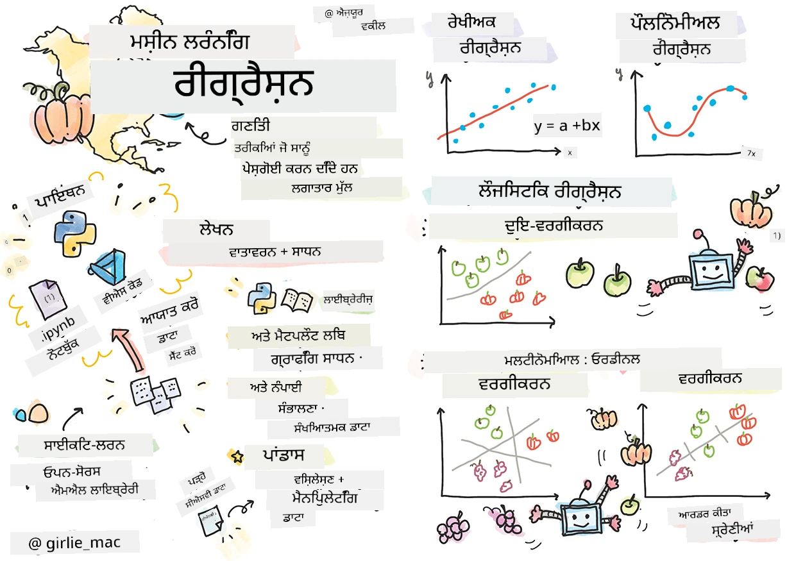
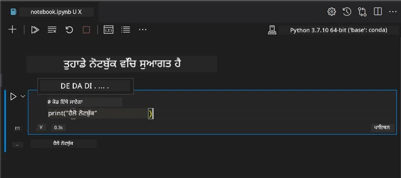
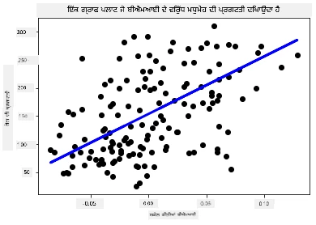

# ਰਿਗ੍ਰੈਸ਼ਨ ਮਾਡਲਾਂ ਲਈ Python ਅਤੇ Scikit-learn ਨਾਲ ਸ਼ੁਰੂਆਤ ਕਰੋ



> ਸਕੈਚਨੋਟ ਲੇਖਕ [Tomomi Imura](https://www.twitter.com/girlie_mac)

## [ਪ੍ਰੀ-ਲੈਕਚਰ ਕ੍ਵਿਜ਼](https://ff-quizzes.netlify.app/en/ml/)

> ### [ਇਹ ਲੈਸਨ R ਵਿੱਚ ਉਪਲਬਧ ਹੈ!](../../../../2-Regression/1-Tools/solution/R/lesson_1.html)

## ਪਰਿਚਯ

ਇਨ੍ਹਾਂ ਚਾਰ ਪਾਠਾਂ ਵਿੱਚ, ਤੁਸੀਂ ਸਿੱਖੋਗੇ ਕਿ ਰਿਗ੍ਰੈਸ਼ਨ ਮਾਡਲ ਕਿਵੇਂ ਬਣਾਏ ਜਾਣ। ਅਸੀਂ ਜਲਦੀ ਹੀ ਇਹ ਸੰਝਾਓਂਗੇ ਕਿ ਇਹ ਕਿਉਂ ਵਰਤੀਦੇ ਹਨ। ਪਰ ਕੁਝ ਵੀ ਕਰਨ ਤੋਂ ਪਹਿਲਾਂ, ਇਹ ਯਕੀਨੀ ਬਣਾਓ ਕਿ ਤੁਹਾਡੇ ਕੋਲ ਸਹੀ ਟੂਲਜ਼ ਮੌਜੂਦ ਹਨ ਜਿਨ੍ਹਾਂ ਨਾਲ ਤੁਸੀਂ ਇਸ ਪ੍ਰਕਿਰਿਆ ਨੂੰ ਸ਼ੁਰੂ ਕਰ ਸਕੋ!

ਇਸ ਪਾਠ ਵਿੱਚ, ਤੁਸੀਂ ਸਿੱਖੋਗੇ ਕਿ ਕਿਵੇਂ:

- ਆਪਣਾ ਕੰਪਿਊਟਰ ਸਥਾਨਕ ਮਸ਼ੀਨ ਲਰਨਿੰਗ ਕੰਮਾਂ ਲਈ ਸੰਰਚਿਤ ਕਰੋ।
- Jupyter Notebooks ਨਾਲ ਕੰਮ ਕਰੋ।
- Scikit-learn ਵਰਤੋਂ ਕਰੋ, ਜਿਸ ਵਿੱਚ ਇੰਸਟਾਲੇਸ਼ਨ ਵੀ ਸ਼ਾਮਲ ਹੈ।
- ਇੱਕ ਪ੍ਰਯੋਗਸ਼ੀਲ ਕਸਰਤ ਨਾਲ ਲੀਨੀਅਰ ਰਿਗ੍ਰੈਸ਼ਨ ਦੀ ਪੜਚੋਲ ਕਰੋ।

## ਇੰਸਟਾਲੇਸ਼ਨ ਅਤੇ ਸੰਰਚਨਾਵਾਂ

[](https://youtu.be/-DfeD2k2Kj0 "ਨਵੀਂ ਸਿੱਖਿਆ ਲਈ ਮਸ਼ੀਨ ਲਰਨਿੰਗ ਮਾਡਲ ਬਣਾਉਣ ਲਈ ਆਪਣੇ ਟੂਲਜ਼ ਤਿਆਰ ਕਰੋ")

> 🎥 ML ਲਈ ਕੰਪਿਊਟਰ ਸੰਰਚਿਤ ਕਰਨ ਬਾਰੇ ਛੋਟਾ ਵੀਡੀਓ ਦੇਖਣ ਲਈ ਉਪਰ ਦਿੱਤੀ ਤਸਵੀਰ 'ਤੇ ਕਲਿੱਕ ਕਰੋ।

1. **Python ਇੰਸਟਾਲ ਕਰੋ**। ਯਕੀਨੀ ਬਣਾਓ ਕਿ [Python](https://www.python.org/downloads/) ਤੁਹਾਡੇ ਕੰਪਿਊਟਰ 'ਤੇ ਇੰਸਟਾਲ ਹੈ। ਤੁਸੀਂ ਬਹੁਤ ਸਾਰੇ ਡਾਟਾ ਸਾਇੰਸ ਅਤੇ ਮਸ਼ੀਨ ਲਰਨਿੰਗ ਕੰਮਾਂ ਲਈ Python ਵਰਤੋਂਗੇ। ਜ਼ਿਆਦਾਤਰ ਕੰਪਿਊਟਰ ਸਿਸਟਮਾਂ ਵਿੱਚ ਪਹਿਲਾਂ ਹੀ Python ਇੰਸਟਾਲ ਹੁੰਦੀ ਹੈ। ਕੁਝ ਵਰਤੋਂਕਾਰਾਂ ਲਈ ਸਹੂਲਤ ਦੇ ਲਈ ਉਪਲਬਧ [Python Coding Packs](https://code.visualstudio.com/learn/educators/installers?WT.mc_id=academic-77952-leestott) ਵੀ ਹਨ।

   ਪਰ ਕੁਝ ਵਰਤੋਂ ਲਈ Python ਦੇ ਇੱਕ ਵਰਜਨ ਦੀ ਲੋੜ ਹੁੰਦੀ ਹੈ, ਜਦਕਿ ਦੂਜੇ ਲਈ ਵੱਖਰਾ ਵਰਜਨ। ਇਸ ਲਈ ਇੱਕ [ਵਰਚੁਅਲ ਇੰਵਾਇਰਨਮੈਂਟ](https://docs.python.org/3/library/venv.html) ਵਿੱਚ ਕੰਮ ਕਰਨਾ ਫਾਇਦੇਮੰਦ ਹੁੰਦਾ ਹੈ।

2. **Visual Studio Code ਇੰਸਟਾਲ ਕਰੋ**। ਯਕੀਨੀ ਬਣਾਓ ਕਿ ਤੁਹਾਡੇ ਕੰਪਿਊਟਰ 'ਤੇ Visual Studio Code ਇੰਸਟਾਲ ਹੈ। ਮੁੱਢਲਾ ਇੰਸਟਾਲੇਸ਼ਨ ਕਰਨ ਲਈ ਇਹਹ ਨਿਰਦੇਸ਼ਾਂ ਦੀ ਪਾਲਣਾ ਕਰੋ [Visual Studio Code ਇੰਸਟਾਲ ਕਰੋ](https://code.visualstudio.com/)। ਇਸ ਕੋਰਸ ਵਿੱਚ ਤੁਸੀਂ Visual Studio Code ਵਿੱਚ Python ਵਰਤੋਂਗੇ, ਇਸ ਲਈ ਤੁਸੀਂ ਜਾ ਕੇ [Visual Studio Code ਦੀ ਸੰਰਚਨਾ](https://docs.microsoft.com/learn/modules/python-install-vscode?WT.mc_id=academic-77952-leestott) ਬਾਰੇ ਜਾਣ-ਪਛਾਣ ਕਰ ਸਕਦੇ ਹੋ।

   > ਇਸ [Learn modules](https://docs.microsoft.com/users/jenlooper-2911/collections/mp1pagggd5qrq7?WT.mc_id=academic-77952-leestott) ਦੇ ਜਮਾ ਕੀਤੇ ਸੰਗ੍ਰਹਿ ਦੁਆਰਾ Python ਨਾਲ ਪੱਕੀ ਪਹਿਚਾਣ ਬਣਾਓ।
   >
   > [](https://youtu.be/yyQM70vi7V8 "Visual Studio Code ਨਾਲ Python ਸੈਟਅਪ ਕਰੋ")
   >
   > 🎥 ਉਪਰ ਦਿੱਤੀ ਤਸਵੀਰ 'ਤੇ ਕਲਿੱਕ ਕਰਕੇ VS Code ਵਿੱਚ Python ਵਰਤੋਂ ਬਾਰੇ ਵੀਡੀਓ ਦੇਖੋ।

3. **Scikit-learn ਇੰਸਟਾਲ ਕਰੋ**, [ਇਹਹ ਨਿਰਦੇਸ਼ਾਂ](https://scikit-learn.org/stable/install.html) ਦੀ ਪਾਲਣਾ ਕਰਕੇ। ਕਿਉਂਕਿ ਤੁਹਾਨੂੰ ਯਕੀਨੀ ਬਣਾਣਾ ਹੈ ਕਿ ਤੁਸੀਂ Python 3 ਵਰਤ ਰਹੇ ਹੋ, ਇਸ ਲਈ ਵਰਚੁਅਲ ਇੰਵਾਇਰਨਮੈਂਟ ਵਰਤਣਾ ਸਧਾਰਨ ਹੈ। ਜੇ ਤੁਸੀਂ M1 Mac 'ਤੇ ਇਹ ਲਾਇਬਰੇਰੀ ਇੰਸਟਾਲ ਕਰ ਰਹੇ ਹੋ, ਤਾਂ ਉਪਰ ਦਿੱਤੇ ਲਿੰਕ ਤੇ ਖਾਸ ਨਿਰਦੇਸ਼ ਹਨ।

1. **Jupyter Notebook ਇੰਸਟਾਲ ਕਰੋ**। ਤੁਹਾਨੂੰ [Jupyter ਪੈਕੇਜ ਇੰਸਟਾਲ ਕਰਨਾ ਹੋਵੇਗਾ](https://pypi.org/project/jupyter/)।

## ਤੁਹਾਡਾ ML ਲੇਖਨ ਵਾਤਾਵਰਨ

ਤੁਸੀਂ ਆਪਣੇ Python ਕੋਡ ਨੂੰ ਵਿਕਸਤ ਕਰਨ ਅਤੇ ਮਸ਼ੀਨ ਲਰਨਿੰਗ ਮਾਡਲ ਬਨਾਉਣ ਲਈ **ਨੋਟਬੁੱਕ** ਵਰਤੋਂਗੇ। ਇਸ ਤਰ੍ਹਾਂ ਦੀ ਫਾਈਲ ਡਾਟਾ ਸਾਇੰਟਿਸਟਾਂ ਲਈ ਆਮ ਸੰਦ ਹੈ, ਅਤੇ ਇਹਨਾਂ ਨੂੰ ਉਨ੍ਹਾਂ ਦੇ ਫਾਇਲ ਸਫਿਕਸ ਜਾਂ ਐਕਸਟੈਨਸ਼ਨ `.ipynb` ਨਾਲ ਪਹਚਾਣਿਆ ਜਾਂਦਾ ਹੈ।

ਨੋਟਬੁੱਕ ਇੱਕ ਇੰਟਰਐਕਟਿਵ ਵਾਤਾਵਰਨ ਹੈ ਜੋ ਵਿਕਾਸਕਾਰ ਨੂੰ ਕੋਡਿੰਗ ਕਰਨ ਅਤੇ ਕੋਡ ਦੇ ਆਲੇ-ਦੁਆਲੇ ਟਿੱਪਣੀਆਂ ਅਤੇ ਦਸਤਾਵੇਜ਼ ਲਿਖਣ ਦੀ ਆਜ਼ਾਦੀ ਦਿੰਦਾ ਹੈ, ਜੋ ਪ੍ਰਯੋਗ ਜਾਂ ਖੋਜ-ਮੁਖੀ ਪਰਿਯੋਜਨਾਵਾਂ ਲਈ ਬਹੁਤ ਮਦਦਗਾਰ ਹੁੰਦਾ ਹੈ।

[](https://youtu.be/7E-jC8FLA2E "ਮਸ਼ੀਨ ਲਰਨਿੰਗ ਨਵਾਂ ਸਿਖਣ ਵਾਲਿਆਂ ਲਈ - ਰਿਗ੍ਰੈਸ਼ਨ ਮਾਡਲ ਬਣਾਉਂਦੇ ਹੋਏ Jupyter Notebooks ਸੈੱਟ ਕਰੋ")

> 🎥 ਇਸ ਕਸਰਤ ਨੂੰ ਕਰਦਿਆਂ ਛੋਟਾ ਵੀਡੀਓ ਦੇਖਣ ਲਈ ਉਪਰ ਦਿੱਤੀ ਤਸਵੀਰ 'ਤੇ ਕਲਿੱਕ ਕਰੋ।

### ਕਸਰਤ - ਨੋਟਬੁੱਕ ਨਾਲ ਕੰਮ ਕਰੋ

ਇਸ ਫੋਲਡਰ ਵਿੱਚ ਤੁਹਾਨੂੰ ਫਾਈਲ _notebook.ipynb_ ਮਿਲੇਗੀ।

1. Visual Studio Code ਵਿੱਚ _notebook.ipynb_ ਖੋਲ੍ਹੋ।

   ਇੱਕ Jupyter ਸਰਵਰ Python 3+ ਨਾਲ ਚਾਲੂ ਹੋ ਜਾਵੇਗਾ। ਤੁਸੀਂ ਨੋਟਬੁੱਕ ਵਿੱਚ ਉਹ ਹਿੱਸੇ ਮਿਲਣਗੇ ਜਿਹੜੇ ਤੂੰਹਾਨੂੰ `ਚਲਾਉਣਾ` ਹੈ, ਜੋ ਕੋਡ ਦੇ ਟੁਕੜੇ ਹਨ। ਤੁਸੀਂ ਇੱਕ ਕੋਡ ਬਲਾਕ ਚਲਾ ਸਕਦੇ ਹੋ, ਪਲੇ ਬਟਨ ਵਰਗੇ ਆਈਕਾਨ ਤੇ ਕੱਲੀਕ ਕਰਕੇ।

1. `md` ਆਈਕਾਨ ਚੁਣੋ ਅਤੇ ਇਕ ਮਾਰਕਡਾਊਨ ਸ਼ਾਮਿਲ ਕਰੋ, ਅਤੇ ਹੇਠਾਂ ਦਿੱਤਾ ਲਿਖੋ **# ਤੁਹਾਡਾ ਨੋਟਬੁੱਕ ਵਿੱਚ ਸਵਾਗਤ ਹੈ**।

   ਫਿਰ ਕੁਝ Python ਕੋਡ ਸ਼ਾਮਿਲ ਕਰੋ।

1. ਕੋਡ ਬਲਾਕ ਵਿੱਚ **print('hello notebook')** ਲਿਖੋ।
1. ਕੋਡ ਚਲਾਉਣ ਲਈ ਤੀਰ ਵਿੱਚ ਕਲਿੱਕ ਕਰੋ।

   ਤੁਸੀਂ ਪ੍ਰਿੰਟ ਕੀਤਾ ਟੈਕਸਟ ਦੇਖੋਗੇ:

    ```output
    hello notebook
    ```



ਤੁਸੀਂ ਆਪਣੇ ਕੋਡ ਵਿੱਚ ਟਿੱਪਣੀਆਂ ਦੋਹਰਾਉਂਦੇ ਹੋਏ ਨੋਟਬੁੱਕ ਨੂੰ ਆਪਣਾ ਦਸਤਾਵੇਜ਼ੀਕਰਨ ਦੇ ਸਕਦੇ ਹੋ।

✅ ਇੱਕ ਮਿੰਟ ਲਈ ਸੋਚੋ ਕਿ ਵੈੱਬ ਡਿਵੈਲਪਰ ਦਾ ਕੰਮ ਕਰਨ ਵਾਲਾ ਵਾਤਾਵਰਨ ਡਾਟਾ ਵਿਗਿਆਨੀ ਦੇ ਵਾਤਾਵਰਨ ਨਾਲ ਕਿੰਨਾ ਵੱਖਰਾ ਹੁੰਦਾ ਹੈ।

## Scikit-learn ਨਾਲ ਸ਼ੁਰੂ ਕਰੋ

ਹੁਣ ਜਦੋਂ Python ਤੁਹਾਡੇ ਸਥਾਨਕ ਵਾਤਾਵਰਨ ਵਿੱਚ ਸੈੱਟ ਹੈ ਅਤੇ ਤੁਸੀਂ Jupyter Notebooks ਨਾਲ ਆਰਾਮਦਾਇਕ ਹੋ, ਆਓ Scikit-learn ਨਾਲ ਵੀ ਸਮਾਨ ਆਰਾਮ ਮਹਿਸੂਸ ਕਰੀਏ (ਇਸ ਨੂੰ `sci` ਅੱਖਰਾਂ ਵਾਂਗ ਉਚਾਰੋ, ਜਿਵੇਂ ਕਿ `science`). Scikit-learn ਤੁਹਾਡੇ ML ਕੰਮਾਂ ਲਈ ਇੱਕ [ਵਿਆਪਕ API](https://scikit-learn.org/stable/modules/classes.html#api-ref) ਮੁਹੱਈਆ ਕਰਦਾ ਹੈ।

ਉਨ੍ਹਾਂ ਦੀ [ਵੈੱਬਸਾਈਟ](https://scikit-learn.org/stable/getting_started.html) ਅਨੁਸਾਰ, "Scikit-learn ਇੱਕ ਖੁੱਲ੍ਹਾ ਸਰੋਤ ਮਸ਼ੀਨ ਲਰਨਿੰਗ ਲਾਇਬਰੇਰੀ ਹੈ ਜੋ ਨਿਗਰਾਨ ਅਤੇ ਬਿਨਾ-ਨਿਗਰਾਨ ਸਿਖਲਾਈ ਨੂੰ ਸਹਾਇਤਾ ਦਿੰਦੀ ਹੈ। ਇਹ ਮਾਡਲ ਫਿੱਟਿੰਗ, ਡੇਟਾ ਪ੍ਰੀ-ਪ੍ਰੋਸੈਸਿੰਗ, ਮਾਡਲ ਚੋਣ ਅਤੇ ਮੂਲਾਂਕਣ ਲਈ ਭਿੰਨ-ਭਿੰਨ ਟੂਲਜ਼ ਵੀਪ੍ਰਦਾਨ ਕਰਦਾ ਹੈ।"

ਇਸ ਕੋਰਸ ਵਿੱਚ, ਤੁਸੀਂ ਮਸ਼ੀਨ ਲਰਨਿੰਗ ਮਾਡਲਾਂ ਬਣਾਉਣ ਲਈ Scikit-learn ਅਤੇ ਹੋਰ ਟੂਲਜ਼ ਵਰਤੋਂਗੇ ਜੋ ਅਸੀਂ 'ਪਾਰੰਪਰਿਕ ਮਸ਼ੀਨ ਲਰਨਿੰਗ' ਕਹਿੰਦੇ ਹਾਂ। ਅਸੀਂ ਇੱਥੇ ਜਾਲੀ ਨੈੱਟਵਰਕਾਂ ਅਤੇ ਡੀਪ ਲਰਨਿੰਗ ਵਿਚੋਂ ਜੁੜੇ ਵਿਸ਼ਿਆਂ ਤੋਂ ਸਚੇਤ ਰਿਹਾ ਹਾਂ, ਕਿਉਂਕਿ ਇਹ ਅਗਲੇ 'AI for Beginners' ਕਾਰਜਕ੍ਰਮ ਵਿੱਚ ਬਿਹਤਰ ਸਮਝਾਏ ਜਾਣਗੇ।

Scikit-learn ਨਾਲ ਮਾਡਲਾਂ ਬਣਾਉਣਾ ਅਤੇ ਉਨ੍ਹਾਂ ਦੀ ਸਮੀਖਿਆ ਕਰਨਾ ਸੌਖਾ ਹੈ। ਇਹ ਮੁੱਖ ਤੌਰ 'ਤੇ ਸਾਖਿਆਂ ਵਾਲਾ ਡਾਟਾ ਵਰਤਦਾ ਹੈ ਅਤੇ ਸਿੱਖਾਈ ਲਈ ਕਈ ਤਿਆਰ ਡਾਟਾਸੈਟਾਂ ਵੀ ਸ਼ਾਮਿਲ ਕਰਦਾ ਹੈ। ਇਸ ਵਿੱਚ ਪਹਿਲਾਂ ਤੋਂ ਬਣੇ ਕਈ ਮਾਡਲ ਵੀ ਹੁੰਦੇ ਹਨ ਜਿਨ੍ਹਾਂ ਨੂੰ ਵਿਦਿਆਰਥੀ ਟ੍ਰਾਈ ਕਰ ਸਕਦੇ ਹਨ। ਆਓ ਪਹਿਲਾਂ ਇੱਕ ਤਿਆਰ ਡਾਟਾ ਲੋਡ ਕਰਨ ਅਤੇ Scikit-learn ਨਾਲ ਪਹਿਲਾ ML ਮਾਡਲ ਬਣਾਉਣ ਦੀ ਪ੍ਰਕਿਰਿਆ ਪੜਚੋਲ ਕਰੀਏ।

## ਕਸਰਤ - ਤੁਹਾਡਾ ਪਹਿਲਾ Scikit-learn ਨੋਟਬੁੱਕ

> ਇਹ ਟਿਊਟੋਰિયલ Scikit-learn ਦੀ ਵੈੱਬਸਾਈਟ 'ਤੇ [ਲੀਨੀਅਰ ਰਿਗ੍ਰੈਸ਼ਨ ਉਦਾਹਰਨ](https://scikit-learn.org/stable/auto_examples/linear_model/plot_ols.html#sphx-glr-auto-examples-linear-model-plot-ols-py) ਤੋਂ ਪ੍ਰੇਰਿਤ ਹੈ।


[](https://youtu.be/2xkXL5EUpS0 "Python ਵਿੱਚ ਤੁਹਾਡਾ ਪਹਿਲਾ ਲੀਨੀਅਰ ਰਿਗ੍ਰੈਸ਼ਨ ਪ੍ਰਾਜੈਕਟ - ਮਸ਼ੀਨ ਲਰਨਿੰਗ ਨਵੇਂ ਸਿਖਣ ਵਾਲੇ")

> 🎥 ਇਸ ਕਸਰਤ ਕਰਦਿਆਂ ਛੋਟਾ ਵੀਡੀਓ ਦੇਖਣ ਲਈ ਉਪਰ ਦਿੱਤੀ ਤਸਵੀਰ 'ਤੇ ਕਲਿੱਕ ਕਰੋ।

ਇਸ ਪਾਠ ਨਾਲ ਜੁੜੀ _notebook.ipynb_ ਫਾਈਲ ਵਿੱਚ ਸਾਰੇ ਸੈਲ 'ਟ੍ਰੈਸ਼ ਕੈਨ' ਆਈਕਾਨ ਦਬਾ ਕੇ ਸਾਫ਼ ਕਰੋ।

ਇਸ ਭਾਗ ਵਿੱਚ, ਤੁਸੀਂ Scikit-learn ਵਿੱਚ ਸਿੱਖਣ ਲਈ ਬਣਾਏ ਇੱਕ ਛੋਟੇ ਡਾਟਾਸੈਟ 'ਡੀਬੇਟੀਜ਼' ਨਾਲ ਕੰਮ ਕਰੋਗੇ। ਸੋਚੋ ਕਿ ਤੁਸੀਂ ਮਧੁਮੇਹੀ ਮਰੀਜ਼ਾਂ ਲਈ ਇਲਾਜ ਦੀ ਟੈਸਟ ਕਰਨਾ ਚਾਹੁੰਦੇ ਹੋ। ਮਸ਼ੀਨ ਲਰਨਿੰਗ ਮਾਡਲ ਤੁਹਾਨੂੰ ਇਹ ਸਹਾਇਤਾ ਕਰ ਸਕਦੇ ਹਨ ਕਿ ਕਿਹੜੇ ਮਰੀਜ਼ ਇਲਾਜ ਦਾ ਵਧੀਆ ਜਵਾਬ ਦੇਣਗੇ, ਵੱਖ-ਵੱਖ ਵੇਰੀਏਬਲਾਂ ਦੇ ਸੰਯੋਗ ਦੇ ਅਧਾਰ 'ਤੇ। ਇੱਕ ਬੁਨਿਆਦੀ ਰਿਗ੍ਰੈਸ਼ਨ ਮਾਡਲ ਵੀ, ਜਦੋਂ ਦ੍ਰਸ਼ਟੀਕ ਤੌਰ 'ਤੇ ਦੇਖਿਆ ਜਾਵੇ, ਤਦ ਉਹ ਤਥ्यों ਬਾਰੇ ਸੰਵੇਦਨਸ਼ੀਲ ਜਾਣਕਾਰੀ ਦਿਖਾ ਸਕਦਾ ਹੈ ਜੋ ਤੁਹਾਨੂੰ ਆਪਣੇ ਸਿਧਾਂਤਕ ਕਲੀਨੀਕੀ ਟ੍ਰਾਇਲਾਂ ਦਾ ਆਯੋਜਨ ਕਰਨ ਵਿੱਚ ਮਦਦ ਕਰੇਗੀ।

✅ ਰਿਗ੍ਰੈਸ਼ਨ ਦੇ ਕਈ ਤਰੀਕੇ ਹੁੰਦੇ ਹਨ, ਅਤੇ ਤੁਸੀਂ ਜੋ ਕਿਸੇ ਪ੍ਰਸ਼ਨ ਦਾ ਜਵਾਬ ਲੱਭ ਰਹੇ ਹੋ, ਉਸਦੇ ਅਨੁਸਾਰ ਕਿਸ ਤਰੀਕੇ ਨੂੰ ਚੁਣਨਾ ਹੈ। ਜੇ ਤੁਸੀਂ ਕਿਸੇ ਵਿਅਕਤੀ ਦੀ ਉਮਰ ਦੇ ਅਧਾਰ 'ਤੇ ਸੰਭਾਵਿਤ ਉਚਾਈ ਅੰਦਾਜ਼ਾ ਲਗਾਉਣਾ ਚਾਹੁੰਦੇ ਹੋ, ਤਾਂ ਤੁਸੀਂ ਲੀਨੀਅਰ ਰਿਗ੍ਰੈਸ਼ਨ ਵਰਤੋਂਗੇ, ਕਿਉਂਕਿ ਤੁਸੀਂ ਇੱਕ **ਸੰਖਿਆਤਮਕ ਮੁੱਲ** ਲੱਭ ਰਹੇ ਹੋ। ਜੇ ਤੁਸੀਂ ਕਿਸੇ ਵਿਧਾ ਦੇ ਖਾਣੇ ਨੂੰ ਸ਼ਾਕਾਹਾਰੀ ਜਾਂ ਨਾ, ਕੈਟੇਗਰੀ ਵਿੱਚ ਰੱਖਣਾ ਚਾਹੁੰਦੇ ਹੋ, ਤਾਂ ਤੁਸੀਂ ਲੋਜਿਸਟਿਕ ਰਿਗ੍ਰੈਸ਼ਨ ਵਰਤੋਂਗੇ। ਲੋਜਿਸਟਿਕ ਰਿਗ੍ਰੈਸ਼ਨ ਬਾਰੇ ਹੋਰ ਬਾਅਦ ਵਿੱਚ ਸਿਖੋਗੇ। ਕੁਝ ਪ੍ਰਸ਼ਨ ਸੋਚੋ ਜਿਹੜੇ ਤੁਸੀਂ ਡਾਟਾ ਤੋਂ ਪੁੱਛ ਸਕਦੇ ਹੋ, ਅਤੇ ਇਹ ਸੋਚੋ ਕਿ ਕਿਹੜਾ ਤਰੀਕਾ ਸਭ ਤੋਂ ਯੋਗ ਹੈ।

ਆਓ ਇਸ ਕੰਮ ਨੂੰ ਸ਼ੁਰੂ ਕਰੀਏ।

### ਲਾਇਬ੍ਰੇਰੀਆਂ ਇੰਪੋਰਟ ਕਰੋ

ਇਸ ਕੰਮ ਲਈ ਅਸੀਂ ਕੁਝ ਲਾਇਬ੍ਰੇਰੀਆਂ ਨੂੰ ਇੰਪੋਰਟ ਕਰਾਂਗੇ:

- **matplotlib**। ਇਹ ਇੱਕ ਉਪਯੋਗੀ [ਗ੍ਰਾਫਿੰਗ ਟੂਲ](https://matplotlib.org/) ਹੈ ਅਤੇ ਅਸੀਂ ਇਸਦਾ ਵਰਤੋਂ ਲਾਈਨ ਪਲੌਟ ਬਣਾਉਣ ਲਈ ਕਰਾਂਗੇ।
- **numpy**। [numpy](https://numpy.org/doc/stable/user/whatisnumpy.html) Python ਵਿੱਚ ਗਣਿਤੀ ਡਾਟਾ ਨੂੰ ਸੰਭਾਲਣ ਲਈ ਇੱਕ ਲਾਇਬ੍ਰੇਰੀ ਹੈ।
- **sklearn**। ਇਹ [Scikit-learn](https://scikit-learn.org/stable/user_guide.html) ਲਾਇਬ੍ਰੇਰੀ ਹੈ।

ਆਪਣੀਆਂ ਕਸਰਤਾਂ ਵਿੱਚ ਮਦਦ ਕਰਨ ਲਈ ਕੁਝ ਲਾਇਬ੍ਰੇਰੀਆਂ ਇੰਪੋਰਟ ਕਰੋ।

1. ਹੇਠਾਂ ਦਿੱਤਾ ਕੋਡ ਟਾਈਪ ਕਰਕੇ ਇੰਪੋਰਟ ਕਰੋ:

   ```python
   import matplotlib.pyplot as plt
   import numpy as np
   from sklearn import datasets, linear_model, model_selection
   ```

   ਉਪਰ ਤੁਸੀਂ `matplotlib`, `numpy` ਨੂੰ ਇੰਪੋਰਟ ਕਰ ਰਹੇ ਹੋ ਅਤੇ `sklearn` ਵਲੋਂ `datasets`, `linear_model` ਅਤੇ `model_selection` ਲੈ ਰਹੇ ਹੋ। `model_selection` ਡਾਟਾ ਨੂੰ ਟ੍ਰੇਨਿੰਗ ਅਤੇ ਟੈਸਟ ਸੈੱਟ ਵਿੱਚ ਵੰਡਣ ਲਈ ਵਰਤਿਆ ਜਾਂਦਾ ਹੈ।

### ਡੀਬੇਟੀਜ਼ ਡਾਟਾਸੈਟ

ਬਿਲਟ-ਇਨ [ਡੀਬੇਟੀਜ਼ ਡਾਟਾਸੈਟ](https://scikit-learn.org/stable/datasets/toy_dataset.html#diabetes-dataset) ਵਿੱਚ ਮਧੁਮੇਹ ਦੇ ਬਾਰੇ 442 ਸੈਂਪਲ ਹਨ, ਜਿਨ੍ਹਾਂ ਵਿੱਚ 10 ਫੀਚਰ ਵੇਰੀਏਬਲ ਹਨ, ਜਿਨ੍ਹਾਂ ਵਿੱਚੋਂ ਕੁਝ ਹਨ:

- ਉਮਰ: ਸਾਲਾਂ ਵਿੱਚ ਉਮਰ
- bmi: ਬੋਡੀ ਮਾਸ ਇੰਡੈਕਸ
- bp: ਔਸਤ ਬਲੱਡ ਪ੍ਰੈਸ਼ਰ
- s1 tc: ਟੀ-ਸੈੱਲ (ਇੱਕ ਕਿਸਮ ਦੇ ਚਿੱਟੇ ਬਲੱਡ ਸੈੱਲ)

✅ ਇਸ ਡਾਟਾਸੈਟ ਵਿੱਚ 'ਲਿੰਗ' ਦਾ ਸਿਧਾਂਤ ਵੀ ਸ਼ਾਮਿਲ ਹੈ ਜੋ ਮਧੁਮੇਹ ਖੋਜ ਲਈ ਮਹੱਤਵਪੂਰਨ ਫੀਚਰ ਹੈ। ਕਈ ਮੈਡੀਕਲ ਡਾਟਾਸੈਟਾਂ ਵਿੱਚ ਇਹ ਤਰੀਕਾ ਬਾਈਨਰੀ ਵਰਗੀਵਾਰਤਨ ਨੂੰ ਸ਼ਾਮਿਲ ਕਰਦਾ ਹੈ। ਸੋਚੋ ਕਿ ਇਸ ਤਰ੍ਹਾਂ ਦੀ ਵਰਗੀਕਰਨ ਕਿਵੇਂ ਕੁਝ ਆਬਾਦੀ ਦੇ ਹਿੱਸਿਆਂ ਨੂੰ ਇਲਾਜਾਂ ਤੋਂ ਵੱਖ ਕਰ ਸਕਦੀ ਹੈ।

ਹੁਣ, X ਅਤੇ y ਡਾਟਾ ਲੋਡ ਕਰੋ।

> 🎓 ਯਾਦ ਰੱਖੋ, ਇਹ ਨਿਗਰਾਨ ਸਿੱਖਣ ਹੈ, ਅਤੇ ਸਾਨੂੰ ਇੱਕ ਨਾਂ ਵਾਲਾ 'y' ਟਾਰਗਟ ਚਾਹੀਦਾ ਹੈ।

ਇੱਕ ਨਵੇਂ ਕੋਡ ਸੈੱਲ ਵਿੱਚ, ਇਹ ਕਾਲ ਕਰਕੇ ਡਿਬੇਟੀਜ਼ ਡਾਟਾਸੈਟ ਲੋਡ ਕਰੋ `load_diabetes()`। ਇਨਪੁੱਟ `return_X_y=True` ਦੱਸਦਾ ਹੈ ਕਿ `X` ਡਾਟਾ ਮੈਟਰਿਕਸ ਹੋਵੇਗਾ, ਅਤੇ `y` ਰਿਗ੍ਰੈਸ਼ਨ ਟਾਰਗਟ ਹੋਵੇਗਾ।

1. ਡਾਟਾ ਮੈਟਰਿਕਸ ਦੇ ਆਕਾਰ ਅਤੇ ਪਹਿਲੇ ਤੱਤ ਨੂੰ ਦਰਸਾਉਣ ਲਈ ਕੁਝ ਪ੍ਰਿੰਟ ਕਮਾਂਡ ਸ਼ਾਮਿਲ ਕਰੋ:

    ```python
    X, y = datasets.load_diabetes(return_X_y=True)
    print(X.shape)
    print(X[0])
    ```

    ਜੋ ਤੁਸੀਂ ਵਾਪਸ ਪ੍ਰਾਪਤ ਕਰ ਰਹੇ ਹੋ, ਉਹ ਇੱਕ ਟਿਊਪਲ ਹੈ। ਤੁਸੀਂ ਉਸ ਟਿਊਪਲ ਦੇ ਪਹਿਲੇ ਦੋ ਮੁੱਲ ਨੂੰ ਕ੍ਰਮਵਾਰ `X` ਅਤੇ `y` ਵਿੱਚ ਅਸਾਈਨ ਕਰ ਰਹੇ ਹੋ। ਹੋਰ ਜਾਣਕਾਰੀ ਲਈ [ਟਿਊਪਲਸ ਬਾਰੇ ਪੜ੍ਹੋ](https://wikipedia.org/wiki/Tuple)।

    ਤੁਸੀਂ ਦੇਖ ਸਕਦੇ ਹੋ ਕਿ ਇਸ ਡਾਟਾ ਵਿੱਚ 442 ਆਈਟਮ ਹਨ ਜੋ 10 ਤੱਤਾਂ ਵਾਲੀਆਂ ਏਰੇਜ਼ ਵਿੱਚ ਸ਼ਕਲਬੱਧ ਹਨ:

    ```text
    (442, 10)
    [ 0.03807591  0.05068012  0.06169621  0.02187235 -0.0442235  -0.03482076
    -0.04340085 -0.00259226  0.01990842 -0.01764613]
    ```

    ✅ ਥੋੜ੍ਹਾ ਸੋਚੋ ਕਿ ਡਾਟਾ ਅਤੇ ਰਿਗ੍ਰੈਸ਼ਨ ਟਾਰਗਟ ਵਿਚਕਾਰ ਕਿਹੜਾ ਸਬੰਧ ਹੈ। ਲੀਨੀਅਰ ਰਿਗ੍ਰੈਸ਼ਨ ਫੀਚਰ X ਅਤੇ ਟਾਰਗਟ ਵੇਰੀਏਬਲ y ਵਿਚਕਾਰ ਰਿਸ਼ਤੇ ਭਵਿੱਖਬਾਣੀ ਕਰਦਾ ਹੈ। ਕੀ ਤੁਸੀਂ [ਟਾਰਗਟ](https://scikit-learn.org/stable/datasets/toy_dataset.html#diabetes-dataset) ਨੂੰ ਡੀਬੇਟੀਜ਼ ਡਾਟਾਸੈਟ ਦੀ ਦਸਤਾਵੇਜ਼ ਵਿੱਚ ਲੱਭ ਸਕਦੇ ਹੋ? ਇਸ ਟਾਰਗਟ ਨੂੰ ਦੇਖਦੇ ਹੋਏ ਇਹ ਡਾਟਾਸੈਟ ਕੀ ਦਰਸਾ ਰਿਹਾ ਹੈ?

2. ਹੁਣ, ਡਾਟਾਸੈਟ ਦਾ ਇੱਕ ਹਿੱਸਾ ਚੁਣੋ ਜੋ ਪਲੌਟ ਕੀਤਾ ਜਾਵੇ, ਡਾਟਾ ਸੈੱਟ ਦੇ 3ਵੇਂ ਕਾਲਮ ਨੂੰ ਚੁਣੋ। ਤੁਸੀਂ ਦਾ ਸਾਰੇ ਕਤਾਰਾਂ ਨੂੰ ਚੁਣਨ ਲਈ `:` ਓਪਰੇਟਰ ਵਰਤ ਸਕਦੇ ਹੋ, ਫਿਰ ਇੰਡੈਕਸ (2) ਨਾਲ 3ਵਾ ਕਾਲਮ ਚੁਣ ਸਕਦੇ ਹੋ। ਤੁਸੀਂ ਡਾਟਾ ਨੂੰ ਇੱਕ 2D ਐਰੇ ਵਿੱਚ ਬਦਲ ਵੀ ਸਕਦੇ ਹੋ - ਜਿਵੇਂ ਕਿ ਪਲੌਟਿੰਗ ਲਈ ਲੋੜੀਂਦਾ ਹੋਵੇ - `reshape(n_rows, n_columns)` ਵਰਤ ਕੇ। ਜੇਕਰ ਕਿਸੇ ਪੈਰਾਮੀਟਰ ਨੂੰ -1 ਦਿੱਤਾ ਜਾਵੇ, ਤਾਂ ਉਸ ਅਨੁਸਾਰ ਮਾਪ ਆਪ- ਆਪ ਨਿਕੱਲ ਜਾਂਦਾ ਹੈ।

   ```python
   X = X[:, 2]
   X = X.reshape((-1,1))
   ```

   ✅ ਕਿਸੇ ਵੀ ਸਮੇਂ ਡਾਟਾ ਦੇ ਆਕਾਰ ਨੂੰ ਪ੍ਰਿੰਟ ਕਰਕੇ ਜਾਂਚੋ।

3. ਹੁਣ ਜਦ ਕਿ ਤੁਹਾਡੇ ਕੋਲ ਪਲੌਟ ਕਰਨ ਲਈ ਡਾਟਾ ਤਤਿਆਰ ਹੈ, ਤੁਸੀਂ ਵੇਖ ਸਕਦੇ ਹੋ ਕਿ ਕੀ ਮਸ਼ੀਨ ਡਾਟਾ ਵਿੱਚ ਗਾਣਿਆਂ ਵਿਚਕਾਰ ਤਰਕਸੰਗਤ ਵੰਡ ਦੀ ਪਹਿਚਾਣ ਕਰ ਸਕਦੀ ਹੈ। ਇਸ ਲਈ, ਤੁਹਾਨੂੰ ਡਾਟਾ (X) ਅਤੇ ਟਾਰਗਟ (y) ਦੋਹਾਂ ਨੂੰ ਟੈਸਟ ਅਤੇ ਟ੍ਰੇਨਿੰਗ ਸੈੱਟਾਂ ਵਿੱਚ ਵੰਡਣਾ ਪਵੇਗਾ। Scikit-learn ਵਿੱਚ ਇਸਦਾ ਸਿੱਧਾ ਤਰੀਕਾ ਹੈ, ਤੁਸੀਂ ਕਿਸੇ ਵਿਸ਼ੇਸ਼ ਬਿੰਦੂ 'ਤੇ ਆਪਣੇ ਟੈਸਟ ਡਾਟਾ ਨੂੰ ਵੰਡ ਸਕਦੇ ਹੋ।

   ```python
   X_train, X_test, y_train, y_test = model_selection.train_test_split(X, y, test_size=0.33)
   ```

4. ਹੁਣ ਤੁਸੀਂ ਆਪਣੇ ਮਾਡਲ ਨੂੰ ਟ੍ਰੇਨ ਕਰਨ ਲਈ ਤਿਆਰ ਹੋ! ਲੀਨੀਅਰ ਰਿਗ੍ਰੈਸ਼ਨ ਮਾਡਲ ਲੋਡ ਕਰੋ ਅਤੇ ਆਪਣੇ X ਅਤੇ y ਟ੍ਰੇਨਿੰਗ ਸੈੱਟਾਂ ਨਾਲ `model.fit()` ਵਰਤੋਂ:

    ```python
    model = linear_model.LinearRegression()
    model.fit(X_train, y_train)
    ```

    ✅ `model.fit()` ਉਹ ਫੰਕਸ਼ਨ ਹੈ ਜੋ ਤੁਸੀਂ ਬਹੁਤ ਸਾਰੀਆਂ ML ਲਾਇਬ੍ਰੇਰੀਆਂ ਜਿਵੇਂ TensorFlow ਵਿੱਚ ਦੇਖੋਗੇ

5. ਫਿਰ, ਟੈਸਟ ਡਾਟਾ ਦਾ ਪ੍ਰਿਡਿਕਸ਼ਨ ਬਣਾਉਣ ਲਈ `predict()` ਫੰਕਸ਼ਨ ਵਰਤੋਂ। ਇਹ ਲਾਈਨ ਖਿੱਚਣ ਲਈ ਵਰਤੀ ਜਾਵੇਗੀ ਜੋ ਡਾਟਾ ਗਰੂਪਾਂ ਵਿੱਚ ਵੰਡ ਦਿਖਾਏਗੀ।

    ```python
    y_pred = model.predict(X_test)
    ```

6. ਹੁਣ ਡਾਟਾ ਨੂੰ ਪਲੌਟ ਵਿੱਚ ਵਿਖਾਉਣ ਦਾ ਸਮਾਂ ਹੈ। Matplotlib ਇਸ ਕਾਰਜ ਲਈ ਬਹੁਤ ਲਾਭਕਾਰੀ ਟੂਲ ਹੈ। X ਅਤੇ y ਟੈਸਟ ਡਾਟਾ ਦਾ ਸਾਰੇ ਡਾਟਾਪੁਆਇੰਟਾਂ ਦਾ ਸਕੈਟਰਪਲੌਟ ਬਣਾਓ, ਅਤੇ ਪ੍ਰਿਡਿਕਸ਼ਨ ਨਾਲ ਮਾਡਲ ਦੇ ਡਾਟਾ ਗਰੂਪਾਂ ਵਿਚਕਾਰ ਸਭ ਤੋਂ ਉਚਿਤ ਜਗ੍ਹਾ 'ਤੇ ਇੱਕ ਲਾਈਨ ਖਿੱਚੋ।

    ```python
    plt.scatter(X_test, y_test,  color='black')
    plt.plot(X_test, y_pred, color='blue', linewidth=3)
    plt.xlabel('Scaled BMIs')
    plt.ylabel('Disease Progression')
    plt.title('A Graph Plot Showing Diabetes Progression Against BMI')
    plt.show()
    ```

   


   ✅ ਇੱਥੇ ਕਿੰਝ ਚੱਲ ਰਿਹਾ ਹੈ ਬਾਰੇ ਕੁਝ ਸੋਚੋ। ਇੱਕ ਸਿੱਧੀ ਲਾਈਨ ਬਹੁਤ ਸਾਰੇ ਛੋਟੇ ਡਾਟਾ ਪੁਆਇੰਟਾਂ ਵਿੱਚੋਂ ਲੰਘ ਰਹੀ ਹੈ, ਪਰ ਇਹ ਸਹੀ-ਸਹੀ ਕੀ ਕਰ ਰਹੀ ਹੈ? ਕੀ ਤੁਸੀਂ ਵੇਖ ਸਕਦੇ ਹੋ ਕਿ ਤੁਸੀਂ ਇਸ ਲਾਈਨ ਦੀ ਵਰਤੋਂ ਕਰਕੇ ਕਿਸੇ ਨਵੇਂ, ਅਣਦੇਖੇ ਡਾਟਾ ਪੁਆਇੰਟ ਦੀ ਪੋਜ਼ਿਸ਼ਨ ਪਲੌਟ ਦੇ y ਅਕਸੋਂ ਦੇ ਸਬੰਧ ਵਿੱਚ ਕਿਵੇਂ ਪਤਾ ਕਰ ਸਕਦੇ ਹੋ? ਇਸ ਮਾਡਲ ਦੇ ਵਿਆਵਹਾਰਿਕ ਉਪਯੋਗ ਨੂੰ ਸ਼ਬਦਾਂ ਵਿੱਚ ਵਿਆਖਿਆ ਕਰਨ ਦੀ ਕੋਸ਼ਿਸ਼ ਕਰੋ।

ਮੁਬਾਰਕਾਂ ਹੋ, ਤੁਸੀਂ ਆਪਣਾ ਪਹਿਲਾ ਲੀਨੀਅਰ ਰਿਗ੍ਰੈਸ਼ਨ ਮਾਡਲ ਤਿਆਰ ਕੀਤਾ, ਇਸ ਨਾਲ ਇੱਕ ਪੂਰਵ ਆਨੁਮਾਨ ਬਣਾਇਆ, ਅਤੇ ਇਸਨੂੰ ਇੱਕ ਪਲੌਟ ਵਿੱਚ ਦਰਸਾਇਆ!

---
## 🚀ਚੁਣੌਤੀ

ਇਸ ਡਾਟਾਸੇਟ ਤੋਂ ਇੱਕ ਵੱਖਰਾ ਵੇਰੀਏਬਲ ਪਲੌਟ ਕਰੋ। ਸੁਝਾਅ: ਇਸ ਲਾਈਨ ਨੂੰ ਸੋਧੋ: `X = X[:,2]`। ਇਸ ਡਾਟਾਸੇਟ ਦੇ ਟਾਰਗਟ ਨੂੰ ਦੇਖਦਿਆਂ, ਤੁਸੀਂ ਮਧੁਮੇਹ ਦੇ ਬਿਮਾਰੀ ਵਜੋਂ ਪ੍ਰਗਟਾਵੇ ਬਾਰੇ ਕੀ ਜਾਣ ਸਕਦੇ ਹੋ?
## [ਪੋਸਟ-ਲੇਕਚਰ ਕੁਇਜ਼](https://ff-quizzes.netlify.app/en/ml/)

## ਸਮੀਖਿਆ ਅਤੇ ਸਵੈ-ਅਧਿਆਇ

ਇਸ ਟਿਊਟੋਰਿਯਲ ਵਿੱਚ, ਤੁਸੀਂ ਸਧਾਰਣ ਲੀਨੀਅਰ ਰਿਗ੍ਰੈਸ਼ਨ ਨਾਲ ਕੰਮ ਕੀਤਾ, ਦੇਸ਼ਵਾਰੀ ਜਾਂ ਬਹੁ-ਰੀਲੀਨੀਅਰ ਰਿਗ੍ਰੈਸ਼ਨ ਨਾਲ ਨਹੀਂ। ਇਨ੍ਹਾਂ ਤਰੀਕਿਆਂ ਵਿੱਚ ਫਰਕ ਬਾਰੇ ਥੋੜ੍ਹੀ ਗੱਲ ਪੜ੍ਹੋ, ਜਾਂ [ਇਸ ਵੀਡੀਓ](https://www.coursera.org/lecture/quantifying-relationships-regression-models/linear-vs-nonlinear-categorical-variables-ai2Ef) ਨੂੰ ਵੇਖੋ।

ਰਿਗ੍ਰੈਸ਼ਨ ਧਾਰਨਾ ਬਾਰੇ ਹੋਰ ਪੜ੍ਹੋ ਅਤੇ ਸੋਚੋ ਕਿ ਇਸ ਤਕਨੀਕ ਨਾਲ ਕਿਸ ਕਿਸਮ ਦੇ ਪ੍ਰਸ਼ਨਾਂ ਦੇ ਜਵਾਬ ਦਿੱਤੇ ਜਾ ਸਕਦੇ ਹਨ। ਆਪਣੀ ਸਮਝ ਨੂੰ ਵਧਾਉਣ ਲਈ ਇਸ [ਟਿਊਟੋਰਿਯਲ](https://docs.microsoft.com/learn/modules/train-evaluate-regression-models?WT.mc_id=academic-77952-leestott) ਨੂੰ ਲੋ।

## ਅਸਾਈਨਮੈਂਟ

[ਇੱਕ ਵੱਖਰਾ ਡਾਟਾਸੇਟ](assignment.md)

---

<!-- CO-OP TRANSLATOR DISCLAIMER START -->
**ਅਸਵੀਕਾਰੋਪਣ**:
ਇਸ ਦਸਤਾਵੇਜ਼ ਦਾ ਅਨੁਵਾਦ ਏਆਈ ਅਨੁਵਾਦ ਸੇਵਾ [Co-op Translator](https://github.com/Azure/co-op-translator) ਦੀ ਵਰਤੋਂ ਕਰਕੇ ਕੀਤਾ ਗਿਆ ਹੈ। ਜਦੋਂ ਕਿ ਅਸੀਂ ਸਹੀਤਾਵਾਂ ਲਈ ਯਤਨਸ਼ੀਲ ਹਾਂ, ਕਿਰਪਾ ਕਰਕੇ ਧਿਆਨ ਰੱਖੋ ਕਿ ਸਵੈਚਾਲਿਤ ਅਨੁਵਾਦਾਂ ਵਿੱਚ ਗਲਤੀਆਂ ਜਾਂ ਅਸਮੱਤਿਆਵਾਂ ਹੋ ਸਕਦੀਆਂ ਹਨ। ਮੂਲ ਦਸਤਾਵੇਜ਼ ਆਪਣੀ ਮੂਲ ਭਾਸ਼ਾ ਵਿੱਚ ਅਧਿਕਾਰਕ ਸਰੋਤ ਮੰਨਿਆ ਜਾਣਾ ਚਾਹੀਦਾ ਹੈ। ਜਰੂਰੀ ਜਾਣਕਾਰੀ ਲਈ, ਪੇਸ਼ੇਵਰ ਮਨੁੱਖੀ ਅਨੁਵਾਦ ਦੀ ਸਿਫ਼ਾਰਸ਼ ਕੀਤੀ ਜਾਂਦੀ ਹੈ। ਅਸੀਂ ਇਸ ਅਨੁਵਾਦ ਦੇ ਉਪਯੋਗ ਤੋਂ ਪੈਦਾ ਹੋਣ ਵਾਲੀਆਂ ਕਿਸੇ ਵੀ ਗਲਤਫਹਿਮੀਆਂ ਜਾਂ ਗਲਤ ਵਿਆਖਿਆਵਾਂ ਲਈ ਜਵਾਬਦੇਹ ਨਹੀਂ ਹਾਂ।
<!-- CO-OP TRANSLATOR DISCLAIMER END -->