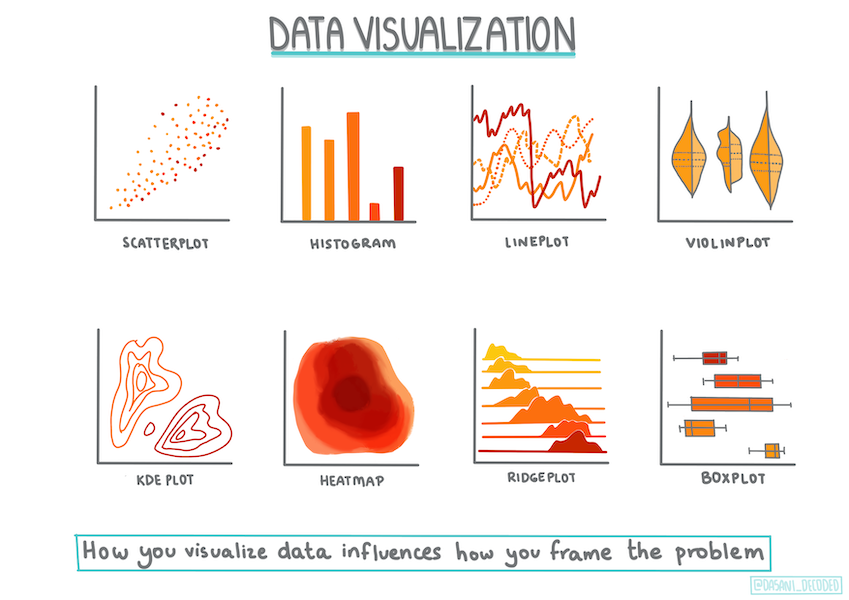

<!--
CO_OP_TRANSLATOR_METADATA:
{
  "original_hash": "a683e1fe430bb0d4a10b68f6ca15e0a6",
  "translation_date": "2025-08-29T16:54:55+00:00",
  "source_file": "2-Regression/2-Data/README.md",
  "language_code": "pa"
}
-->
# ਸਕਾਈਕਿਟ-ਲਰਨ ਦੀ ਵਰਤੋਂ ਕਰਕੇ ਰਿਗ੍ਰੈਸ਼ਨ ਮਾਡਲ ਬਣਾਓ: ਡਾਟਾ ਤਿਆਰ ਕਰੋ ਅਤੇ ਵਿਜੁਅਲਾਈਜ਼ ਕਰੋ



ਇਨਫੋਗ੍ਰਾਫਿਕ [ਦਸਾਨੀ ਮਡੀਪੱਲੀ](https://twitter.com/dasani_decoded) ਦੁਆਰਾ

## [ਪ੍ਰੀ-ਲੈਕਚਰ ਕਵਿਜ਼](https://gray-sand-07a10f403.1.azurestaticapps.net/quiz/11/)

> ### [ਇਹ ਪਾਠ ਰ ਵਿੱਚ ਵੀ ਉਪਲਬਧ ਹੈ!](../../../../2-Regression/2-Data/solution/R/lesson_2.html)

## ਪਰਿਚਯ

ਹੁਣ ਜਦੋਂ ਤੁਹਾਡੇ ਕੋਲ ਸਕਾਈਕਿਟ-ਲਰਨ ਦੀ ਵਰਤੋਂ ਕਰਕੇ ਮਸ਼ੀਨ ਲਰਨਿੰਗ ਮਾਡਲ ਬਣਾਉਣ ਲਈ ਲੋੜੀਂਦੇ ਸਾਰੇ ਟੂਲ ਹਨ, ਤੁਸੀਂ ਆਪਣੇ ਡਾਟਾ ਤੋਂ ਸਵਾਲ ਪੁੱਛਣ ਲਈ ਤਿਆਰ ਹੋ। ਜਦੋਂ ਤੁਸੀਂ ਡਾਟਾ ਨਾਲ ਕੰਮ ਕਰਦੇ ਹੋ ਅਤੇ ਮਸ਼ੀਨ ਲਰਨਿੰਗ ਹੱਲ ਲਾਗੂ ਕਰਦੇ ਹੋ, ਤਾਂ ਇਹ ਸਮਝਣਾ ਬਹੁਤ ਜ਼ਰੂਰੀ ਹੈ ਕਿ ਸਹੀ ਸਵਾਲ ਕਿਵੇਂ ਪੁੱਛਣਾ ਹੈ ਤਾਂ ਜੋ ਆਪਣੇ ਡਾਟਾਸੈੱਟ ਦੀ ਸੰਭਾਵਨਾ ਨੂੰ ਸਹੀ ਤਰੀਕੇ ਨਾਲ ਖੋਲ੍ਹਿਆ ਜਾ ਸਕੇ।

ਇਸ ਪਾਠ ਵਿੱਚ, ਤੁਸੀਂ ਸਿੱਖੋਗੇ:

- ਮਾਡਲ ਬਣਾਉਣ ਲਈ ਆਪਣੇ ਡਾਟਾ ਨੂੰ ਕਿਵੇਂ ਤਿਆਰ ਕਰਨਾ ਹੈ।
- ਡਾਟਾ ਵਿਜੁਅਲਾਈਜ਼ੇਸ਼ਨ ਲਈ ਮੈਟਪਲਾਟਲਿਬ ਦੀ ਵਰਤੋਂ ਕਿਵੇਂ ਕਰਨੀ ਹੈ।

## ਆਪਣੇ ਡਾਟਾ ਤੋਂ ਸਹੀ ਸਵਾਲ ਪੁੱਛਣਾ

ਜਿਸ ਸਵਾਲ ਦਾ ਤੁਹਾਨੂੰ ਜਵਾਬ ਚਾਹੀਦਾ ਹੈ, ਉਹ ਇਹ ਨਿਰਧਾਰਤ ਕਰੇਗਾ ਕਿ ਤੁਸੀਂ ਕਿਹੜੇ ਕਿਸਮ ਦੇ ਮਸ਼ੀਨ ਲਰਨਿੰਗ ਐਲਗੋਰਿਦਮ ਦੀ ਵਰਤੋਂ ਕਰੋਗੇ। ਅਤੇ ਤੁਹਾਨੂੰ ਮਿਲਣ ਵਾਲੇ ਜਵਾਬ ਦੀ ਗੁਣਵੱਤਾ ਤੁਹਾਡੇ ਡਾਟਾ ਦੀ ਪ੍ਰਕਿਰਤੀ 'ਤੇ ਬਹੁਤ ਨਿਰਭਰ ਕਰੇਗੀ।

ਇਸ ਪਾਠ ਲਈ ਦਿੱਤੇ ਗਏ [ਡਾਟਾ](https://github.com/microsoft/ML-For-Beginners/blob/main/2-Regression/data/US-pumpkins.csv) ਨੂੰ ਵੇਖੋ। ਤੁਸੀਂ ਇਸ .csv ਫਾਈਲ ਨੂੰ VS ਕੋਡ ਵਿੱਚ ਖੋਲ੍ਹ ਸਕਦੇ ਹੋ। ਇੱਕ ਛੋਟੀ ਜਿਹੀ ਝਲਕ ਦਿਖਾਉਂਦੀ ਹੈ ਕਿ ਇਸ ਵਿੱਚ ਖਾਲੀ ਜਗ੍ਹਾ ਅਤੇ ਸਤਰਾਂ ਅਤੇ ਗਿਣਤੀ ਡਾਟਾ ਦਾ ਮਿਸ਼ਰਣ ਹੈ। ਇੱਥੇ ਇੱਕ ਅਜੀਬ ਕਾਲਮ 'ਪੈਕੇਜ' ਵੀ ਹੈ ਜਿਸ ਵਿੱਚ ਡਾਟਾ 'ਸੈਕਸ', 'ਬਿਨਜ਼' ਅਤੇ ਹੋਰ ਮੁੱਲਾਂ ਦਾ ਮਿਸ਼ਰਣ ਹੈ। ਅਸਲ ਵਿੱਚ, ਡਾਟਾ ਕੁਝ ਗੜਬੜ ਹੈ।

[](https://youtu.be/5qGjczWTrDQ "ਮਸ਼ੀਨ ਲਰਨਿੰਗ ਲਈ ਸ਼ੁਰੂਆਤੀ - ਡਾਟਾਸੈੱਟ ਦਾ ਵਿਸ਼ਲੇਸ਼ਣ ਅਤੇ ਸਾਫ਼ ਕਰਨ ਦਾ ਤਰੀਕਾ")

> 🎥 ਉਪਰੋਕਤ ਚਿੱਤਰ 'ਤੇ ਕਲਿੱਕ ਕਰੋ ਇਸ ਪਾਠ ਲਈ ਡਾਟਾ ਤਿਆਰ ਕਰਨ ਦੀ ਪ੍ਰਕਿਰਿਆ ਦੇਖਣ ਲਈ ਇੱਕ ਛੋਟੀ ਵੀਡੀਓ ਲਈ।

ਅਸਲ ਵਿੱਚ, ਇਹ ਬਹੁਤ ਘੱਟ ਹੁੰਦਾ ਹੈ ਕਿ ਤੁਹਾਨੂੰ ਇੱਕ ਡਾਟਾਸੈੱਟ ਮਿਲੇ ਜੋ ਬਾਕਸ ਤੋਂ ਬਾਹਰ ਮਸ਼ੀਨ ਲਰਨਿੰਗ ਮਾਡਲ ਬਣਾਉਣ ਲਈ ਪੂਰੀ ਤਰ੍ਹਾਂ ਤਿਆਰ ਹੋਵੇ। ਇਸ ਪਾਠ ਵਿੱਚ, ਤੁਸੀਂ ਸਿੱਖੋਗੇ ਕਿ ਮਿਆਰੀ ਪਾਈਥਨ ਲਾਇਬ੍ਰੇਰੀਆਂ ਦੀ ਵਰਤੋਂ ਕਰਕੇ ਕੱਚੇ ਡਾਟਾ ਨੂੰ ਕਿਵੇਂ ਤਿਆਰ ਕਰਨਾ ਹੈ। ਤੁਸੀਂ ਡਾਟਾ ਨੂੰ ਵਿਜੁਅਲਾਈਜ਼ ਕਰਨ ਦੇ ਵੱਖ-ਵੱਖ ਤਰੀਕੇ ਵੀ ਸਿੱਖੋਗੇ।

## ਕੇਸ ਸਟਡੀ: 'ਕਦੂ ਦਾ ਬਾਜ਼ਾਰ'

ਇਸ ਫੋਲਡਰ ਵਿੱਚ ਤੁਹਾਨੂੰ ਰੂਟ `data` ਫੋਲਡਰ ਵਿੱਚ ਇੱਕ .csv ਫਾਈਲ ਮਿਲੇਗੀ ਜਿਸਦਾ ਨਾਮ [US-pumpkins.csv](https://github.com/microsoft/ML-For-Beginners/blob/main/2-Regression/data/US-pumpkins.csv) ਹੈ, ਜਿਸ ਵਿੱਚ ਕਦੂ ਦੇ ਬਾਜ਼ਾਰ ਬਾਰੇ 1757 ਲਾਈਨਾਂ ਦਾ ਡਾਟਾ ਹੈ, ਜੋ ਸ਼ਹਿਰਾਂ ਅਨੁਸਾਰ ਵੰਡਿਆ ਗਿਆ ਹੈ। ਇਹ ਕੱਚਾ ਡਾਟਾ ਸੰਯੁਕਤ ਰਾਜ ਦੇ ਖੇਤੀਬਾੜੀ ਵਿਭਾਗ ਦੁਆਰਾ ਜਾਰੀ ਕੀਤੇ [Specialty Crops Terminal Markets Standard Reports](https://www.marketnews.usda.gov/mnp/fv-report-config-step1?type=termPrice) ਤੋਂ ਪ੍ਰਾਪਤ ਕੀਤਾ ਗਿਆ ਹੈ।

### ਡਾਟਾ ਤਿਆਰ ਕਰਨਾ

ਇਹ ਡਾਟਾ ਪਬਲਿਕ ਡੋਮੇਨ ਵਿੱਚ ਹੈ। ਇਸਨੂੰ USDA ਵੈਬਸਾਈਟ ਤੋਂ ਵੱਖ-ਵੱਖ ਸ਼ਹਿਰਾਂ ਲਈ ਵੱਖ-ਵੱਖ ਫਾਈਲਾਂ ਵਿੱਚ ਡਾਊਨਲੋਡ ਕੀਤਾ ਜਾ ਸਕਦਾ ਹੈ। ਬਹੁਤ ਸਾਰੀਆਂ ਵੱਖ-ਵੱਖ ਫਾਈਲਾਂ ਤੋਂ ਬਚਣ ਲਈ, ਅਸੀਂ ਸਾਰੇ ਸ਼ਹਿਰਾਂ ਦੇ ਡਾਟਾ ਨੂੰ ਇੱਕ ਸਪ੍ਰੈਡਸ਼ੀਟ ਵਿੱਚ ਜੋੜ ਦਿੱਤਾ ਹੈ, ਇਸ ਤਰ੍ਹਾਂ ਅਸੀਂ ਪਹਿਲਾਂ ਹੀ ਡਾਟਾ ਨੂੰ ਕੁਝ ਹੱਦ ਤੱਕ _ਤਿਆਰ_ ਕਰ ਦਿੱਤਾ ਹੈ। ਹੁਣ, ਆਓ ਡਾਟਾ ਨੂੰ ਧਿਆਨ ਨਾਲ ਵੇਖੀਏ।

### ਕਦੂ ਦਾ ਡਾਟਾ - ਸ਼ੁਰੂਆਤੀ ਨਤੀਜੇ

ਤੁਸੀਂ ਇਸ ਡਾਟਾ ਬਾਰੇ ਕੀ ਨੋਟਿਸ ਕੀਤਾ? ਤੁਸੀਂ ਪਹਿਲਾਂ ਹੀ ਦੇਖਿਆ ਕਿ ਇਸ ਵਿੱਚ ਸਤਰਾਂ, ਗਿਣਤੀ, ਖਾਲੀ ਜਗ੍ਹਾ ਅਤੇ ਅਜੀਬ ਮੁੱਲਾਂ ਦਾ ਮਿਸ਼ਰਣ ਹੈ, ਜਿਸਨੂੰ ਤੁਹਾਨੂੰ ਸਮਝਣਾ ਪਵੇਗਾ।

ਤੁਸੀਂ ਇਸ ਡਾਟਾ ਤੋਂ ਰਿਗ੍ਰੈਸ਼ਨ ਤਕਨੀਕ ਦੀ ਵਰਤੋਂ ਕਰਕੇ ਕਿਹੜਾ ਸਵਾਲ ਪੁੱਛ ਸਕਦੇ ਹੋ? ਜਿਵੇਂ ਕਿ "ਕਿਸੇ ਦਿੱਤੇ ਮਹੀਨੇ ਦੌਰਾਨ ਵਿਕਰੀ ਲਈ ਕਦੂ ਦੀ ਕੀਮਤ ਦੀ ਭਵਿੱਖਵਾਣੀ ਕਰੋ"। ਡਾਟਾ ਨੂੰ ਦੁਬਾਰਾ ਵੇਖਦੇ ਹੋਏ, ਤੁਹਾਨੂੰ ਇਸ ਕੰਮ ਲਈ ਲੋੜੀਂਦੇ ਡਾਟਾ ਸਟ੍ਰਕਚਰ ਨੂੰ ਬਣਾਉਣ ਲਈ ਕੁਝ ਬਦਲਾਅ ਕਰਨੇ ਪੈਣਗੇ।

## ਅਭਿਆਸ - ਕਦੂ ਦੇ ਡਾਟਾ ਦਾ ਵਿਸ਼ਲੇਸ਼ਣ ਕਰੋ

ਆਓ [Pandas](https://pandas.pydata.org/) ਦੀ ਵਰਤੋਂ ਕਰੀਏ, (ਇਸਦਾ ਨਾਮ `Python Data Analysis` ਲਈ ਹੈ) ਜੋ ਡਾਟਾ ਨੂੰ ਸ਼ੇਪ ਦੇਣ ਲਈ ਬਹੁਤ ਹੀ ਲਾਭਦਾਇਕ ਟੂਲ ਹੈ, ਕਦੂ ਦੇ ਇਸ ਡਾਟਾ ਦਾ ਵਿਸ਼ਲੇਸ਼ਣ ਅਤੇ ਤਿਆਰੀ ਕਰਨ ਲਈ।

### ਪਹਿਲਾਂ, ਗੁੰਮ ਹੋਈਆਂ ਤਰੀਕਾਂ ਦੀ ਜਾਂਚ ਕਰੋ

ਤੁਹਾਨੂੰ ਪਹਿਲਾਂ ਇਹ ਚੈੱਕ ਕਰਨਾ ਪਵੇਗਾ ਕਿ ਕੋਈ ਗੁੰਮ ਹੋਈਆਂ ਤਰੀਕਾਂ ਹਨ ਜਾਂ ਨਹੀਂ:

1. ਤਰੀਕਾਂ ਨੂੰ ਮਹੀਨੇ ਦੇ ਫਾਰਮੈਟ ਵਿੱਚ ਬਦਲੋ (ਇਹ ਅਮਰੀਕੀ ਤਰੀਕਾਂ ਹਨ, ਇਸ ਲਈ ਫਾਰਮੈਟ `MM/DD/YYYY` ਹੈ)।
2. ਮਹੀਨੇ ਨੂੰ ਇੱਕ ਨਵੇਂ ਕਾਲਮ ਵਿੱਚ ਕੱਢੋ।

_ਨੋਟਬੁੱਕ.ipynb_ ਫਾਈਲ ਨੂੰ Visual Studio Code ਵਿੱਚ ਖੋਲ੍ਹੋ ਅਤੇ ਸਪ੍ਰੈਡਸ਼ੀਟ ਨੂੰ ਇੱਕ ਨਵੇਂ Pandas ਡਾਟਾਫਰੇਮ ਵਿੱਚ ਇੰਪੋਰਟ ਕਰੋ।

1. ਪਹਿਲੀਆਂ ਪੰਜ ਲਾਈਨਾਂ ਦੇਖਣ ਲਈ `head()` ਫੰਕਸ਼ਨ ਦੀ ਵਰਤੋਂ ਕਰੋ।

    ```python
    import pandas as pd
    pumpkins = pd.read_csv('../data/US-pumpkins.csv')
    pumpkins.head()
    ```

    ✅ ਤੁਸੀਂ ਪਿਛਲੀਆਂ ਪੰਜ ਲਾਈਨਾਂ ਦੇਖਣ ਲਈ ਕਿਹੜੇ ਫੰਕਸ਼ਨ ਦੀ ਵਰਤੋਂ ਕਰੋਗੇ?

1. ਮੌਜੂਦਾ ਡਾਟਾਫਰੇਮ ਵਿੱਚ ਗੁੰਮ ਹੋਏ ਡਾਟਾ ਦੀ ਜਾਂਚ ਕਰੋ:

    ```python
    pumpkins.isnull().sum()
    ```

    ਗੁੰਮ ਹੋਇਆ ਡਾਟਾ ਹੈ, ਪਰ ਸ਼ਾਇਦ ਇਹ ਇਸ ਕੰਮ ਲਈ ਮਹੱਤਵਪੂਰਨ ਨਹੀਂ ਹੋਵੇਗਾ।

1. ਆਪਣੇ ਡਾਟਾਫਰੇਮ ਨੂੰ ਕੰਮ ਕਰਨ ਲਈ ਆਸਾਨ ਬਣਾਉਣ ਲਈ, ਸਿਰਫ਼ ਜ਼ਰੂਰੀ ਕਾਲਮਾਂ ਨੂੰ ਚੁਣੋ, `loc` ਫੰਕਸ਼ਨ ਦੀ ਵਰਤੋਂ ਕਰਕੇ ਜੋ ਮੂਲ ਡਾਟਾਫਰੇਮ ਤੋਂ ਲਾਈਨਾਂ (ਪਹਿਲੇ ਪੈਰਾਮੀਟਰ ਵਜੋਂ ਪਾਸ ਕੀਤੀਆਂ) ਅਤੇ ਕਾਲਮਾਂ (ਦੂਜੇ ਪੈਰਾਮੀਟਰ ਵਜੋਂ ਪਾਸ ਕੀਤੀਆਂ) ਨੂੰ ਕੱਢਦਾ ਹੈ। ਹੇਠਾਂ ਦਿੱਤੇ ਕੇਸ ਵਿੱਚ `:` ਦਾ ਅਰਥ ਹੈ "ਸਭ ਲਾਈਨਾਂ"।

    ```python
    columns_to_select = ['Package', 'Low Price', 'High Price', 'Date']
    pumpkins = pumpkins.loc[:, columns_to_select]
    ```

### ਦੂਜਾ, ਕਦੂ ਦੀ ਔਸਤ ਕੀਮਤ ਨਿਰਧਾਰਤ ਕਰੋ

ਇੱਕ ਮਹੀਨੇ ਵਿੱਚ ਕਦੂ ਦੀ ਔਸਤ ਕੀਮਤ ਨਿਰਧਾਰਤ ਕਰਨ ਲਈ ਕਿਹੜੇ ਕਾਲਮ ਚੁਣੋਗੇ? ਸੰਕੇਤ: ਤੁਹਾਨੂੰ 3 ਕਾਲਮਾਂ ਦੀ ਲੋੜ ਹੋਵੇਗੀ।

ਹੱਲ: `Low Price` ਅਤੇ `High Price` ਕਾਲਮਾਂ ਦੀ ਔਸਤ ਲੈ ਕੇ ਨਵੇਂ Price ਕਾਲਮ ਨੂੰ ਭਰੋ, ਅਤੇ Date ਕਾਲਮ ਨੂੰ ਸਿਰਫ਼ ਮਹੀਨਾ ਦਿਖਾਉਣ ਲਈ ਬਦਲੋ। ਖੁਸ਼ਕਿਸਮਤੀ ਨਾਲ, ਉਪਰੋਕਤ ਜਾਂਚ ਦੇ ਅਨੁਸਾਰ, ਤਰੀਕਾਂ ਜਾਂ ਕੀਮਤਾਂ ਲਈ ਕੋਈ ਗੁੰਮ ਹੋਇਆ ਡਾਟਾ ਨਹੀਂ ਹੈ।

1. ਔਸਤ ਦੀ ਗਣਨਾ ਕਰਨ ਲਈ, ਹੇਠਾਂ ਦਿੱਤਾ ਕੋਡ ਸ਼ਾਮਲ ਕਰੋ:

    ```python
    price = (pumpkins['Low Price'] + pumpkins['High Price']) / 2

    month = pd.DatetimeIndex(pumpkins['Date']).month

    ```

   ✅ ਤੁਸੀਂ `print(month)` ਦੀ ਵਰਤੋਂ ਕਰਕੇ ਕੋਈ ਵੀ ਡਾਟਾ ਪ੍ਰਿੰਟ ਕਰ ਸਕਦੇ ਹੋ ਜਿਸਨੂੰ ਤੁਸੀਂ ਚੈੱਕ ਕਰਨਾ ਚਾਹੁੰਦੇ ਹੋ।

2. ਹੁਣ, ਆਪਣੇ ਬਦਲੇ ਹੋਏ ਡਾਟਾ ਨੂੰ ਇੱਕ ਨਵੇਂ Pandas ਡਾਟਾਫਰੇਮ ਵਿੱਚ ਕਾਪੀ ਕਰੋ:

    ```python
    new_pumpkins = pd.DataFrame({'Month': month, 'Package': pumpkins['Package'], 'Low Price': pumpkins['Low Price'],'High Price': pumpkins['High Price'], 'Price': price})
    ```

    ਆਪਣੇ ਡਾਟਾਫਰੇਮ ਨੂੰ ਪ੍ਰਿੰਟ ਕਰਨਾ ਤੁਹਾਨੂੰ ਇੱਕ ਸਾਫ਼, ਸਧਾਰਨ ਡਾਟਾਸੈੱਟ ਦਿਖਾਵੇਗਾ ਜਿਸ 'ਤੇ ਤੁਸੀਂ ਆਪਣਾ ਨਵਾਂ ਰਿਗ੍ਰੈਸ਼ਨ ਮਾਡਲ ਬਣਾਉਣ ਲਈ ਕੰਮ ਕਰ ਸਕਦੇ ਹੋ।

### ਪਰ ਰੁਕੋ! ਇੱਥੇ ਕੁਝ ਅਜੀਬ ਹੈ

ਜੇ ਤੁਸੀਂ `Package` ਕਾਲਮ ਨੂੰ ਵੇਖੋ, ਤਾਂ ਕਦੂ ਵੱਖ-ਵੱਖ ਸੰਰਚਨਾਵਾਂ ਵਿੱਚ ਵੇਚੇ ਜਾਂਦੇ ਹਨ। ਕੁਝ '1 1/9 bushel' ਮਾਪ ਵਿੱਚ ਵੇਚੇ ਜਾਂਦੇ ਹਨ, ਕੁਝ '1/2 bushel' ਮਾਪ ਵਿੱਚ, ਕੁਝ ਪ੍ਰਤੀ ਕਦੂ, ਕੁਝ ਪ੍ਰਤੀ ਪੌਂਡ, ਅਤੇ ਕੁਝ ਵੱਡੇ ਬਕਸਿਆਂ ਵਿੱਚ ਵੱਖ-ਵੱਖ ਚੌੜਾਈਆਂ ਨਾਲ।

> ਕਦੂ ਨੂੰ ਸਥਿਰ ਤੌਰ 'ਤੇ ਤੋਲਣਾ ਬਹੁਤ ਮੁਸ਼ਕਲ ਲੱਗਦਾ ਹੈ

ਅਸਲ ਡਾਟਾ ਵਿੱਚ ਖੋਜ ਕਰਨ 'ਤੇ, ਇਹ ਦਿਲਚਸਪ ਹੈ ਕਿ ਜਿਹਨਾਂ ਦਾ `Unit of Sale` 'EACH' ਜਾਂ 'PER BIN' ਹੈ, ਉਹਨਾਂ ਦੇ `Package` ਕਿਸਮ ਪ੍ਰਤੀ ਇੰਚ, ਪ੍ਰਤੀ ਬਿਨ, ਜਾਂ 'each' ਹੈ। ਕਦੂ ਨੂੰ ਸਥਿਰ ਤੌਰ 'ਤੇ ਤੋਲਣਾ ਬਹੁਤ ਮੁਸ਼ਕਲ ਲੱਗਦਾ ਹੈ, ਇਸ ਲਈ ਆਓ ਸਿਰਫ਼ ਉਹਨਾਂ ਕਦੂਆਂ ਨੂੰ ਫਿਲਟਰ ਕਰੀਏ ਜਿਨ੍ਹਾਂ ਦੇ `Package` ਕਾਲਮ ਵਿੱਚ 'bushel' ਸ਼ਬਦ ਹੈ।

1. ਫਾਈਲ ਦੇ ਸ਼ੁਰੂ ਵਿੱਚ, ਸ਼ੁਰੂਆਤੀ .csv ਇੰਪੋਰਟ ਦੇ ਹੇਠਾਂ ਇੱਕ ਫਿਲਟਰ ਸ਼ਾਮਲ ਕਰੋ:

    ```python
    pumpkins = pumpkins[pumpkins['Package'].str.contains('bushel', case=True, regex=True)]
    ```

    ਜੇ ਤੁਸੀਂ ਹੁਣ ਡਾਟਾ ਪ੍ਰਿੰਟ ਕਰੋ, ਤਾਂ ਤੁਸੀਂ ਦੇਖ ਸਕਦੇ ਹੋ ਕਿ ਤੁਹਾਨੂੰ ਸਿਰਫ਼ 415 ਜਾਂ ਇਸ ਤੋਂ ਵੱਧ ਲਾਈਨਾਂ ਦਾ ਡਾਟਾ ਮਿਲ ਰਿਹਾ ਹੈ ਜਿਸ ਵਿੱਚ ਬਸੇਲ ਦੁਆਰਾ ਕਦੂ ਹਨ।

### ਪਰ ਰੁਕੋ! ਇੱਕ ਹੋਰ ਗੱਲ ਕਰਨ ਦੀ ਲੋੜ ਹੈ

ਕੀ ਤੁਸੀਂ ਨੋਟ ਕੀਤਾ ਕਿ ਬਸੇਲ ਦੀ ਮਾਤਰਾ ਹਰ ਲਾਈਨ ਵਿੱਚ ਵੱਖਰੀ ਹੈ? ਤੁਹਾਨੂੰ ਕੀਮਤਾਂ ਨੂੰ ਸਧਾਰਨ ਕਰਨ ਦੀ ਲੋੜ ਹੈ ਤਾਂ ਜੋ ਤੁਸੀਂ ਪ੍ਰਤੀ ਬਸੇਲ ਕੀਮਤ ਦਿਖਾ ਸਕੋ, ਇਸ ਲਈ ਕੁਝ ਗਣਨਾ ਕਰੋ।

1. ਨਵੇਂ_pumpkins ਡਾਟਾਫਰੇਮ ਬਣਾਉਣ ਵਾਲੇ ਬਲਾਕ ਦੇ ਹੇਠਾਂ ਇਹ ਲਾਈਨਾਂ ਸ਼ਾਮਲ ਕਰੋ:

    ```python
    new_pumpkins.loc[new_pumpkins['Package'].str.contains('1 1/9'), 'Price'] = price/(1 + 1/9)

    new_pumpkins.loc[new_pumpkins['Package'].str.contains('1/2'), 'Price'] = price/(1/2)
    ```

✅ [The Spruce Eats](https://www.thespruceeats.com/how-much-is-a-bushel-1389308) ਦੇ ਅਨੁਸਾਰ, ਇੱਕ ਬਸੇਲ ਦਾ ਵਜ਼ਨ ਉਤਪਾਦ ਦੀ ਕਿਸਮ 'ਤੇ ਨਿਰਭਰ ਕਰਦਾ ਹੈ, ਕਿਉਂਕਿ ਇਹ ਇੱਕ ਵਾਲਿਊਮ ਮਾਪ ਹੈ। "ਉਦਾਹਰਣ ਲਈ, ਟਮਾਟਰਾਂ ਦਾ ਇੱਕ ਬਸੇਲ 56 ਪੌਂਡ ਦਾ ਹੋਣਾ ਚਾਹੀਦਾ ਹੈ... ਪੱਤੇ ਅਤੇ ਸਾਗ ਜ਼ਿਆਦਾ ਜਗ੍ਹਾ ਲੈਂਦੇ ਹਨ ਪਰ ਘੱਟ ਵਜ਼ਨ ਹੁੰਦੇ ਹਨ, ਇਸ ਲਈ ਸਪਿਨੇਚ ਦਾ ਇੱਕ ਬਸੇਲ ਸਿਰਫ਼ 20 ਪੌਂਡ ਹੈ।" ਇਹ ਸਾਰਾ ਕੁਝ ਕਾਫ਼ੀ ਜਟਿਲ ਹੈ! ਆਓ ਬਸੇਲ-ਤੋਂ-ਪੌਂਡ ਬਦਲਾਅ ਕਰਨ ਦੀ ਥਕਾਵਟ ਨਾ ਲਵਾਂ, ਅਤੇ ਬਸੇਲ ਦੁਆਰਾ ਕੀਮਤ ਲਗਾਈਏ। ਕਦੂਆਂ ਦੇ ਬਸੇਲਾਂ ਦਾ ਇਹ ਸਾਰਾ ਅਧਿਐਨ, ਹਾਲਾਂਕਿ, ਇਹ ਦਿਖਾਉਂਦਾ ਹੈ ਕਿ ਤੁਹਾਡੇ ਡਾਟਾ ਦੀ ਪ੍ਰਕਿਰਤੀ ਨੂੰ ਸਮਝਣਾ ਕਿੰਨਾ ਮਹੱਤਵਪੂਰਨ ਹੈ!

ਹੁਣ, ਤੁਸੀਂ ਬਸੇਲ ਮਾਪ ਦੇ ਅਧਾਰ 'ਤੇ ਪ੍ਰਤੀ ਯੂਨਿਟ ਕੀਮਤ ਦਾ ਵਿਸ਼ਲੇਸ਼ਣ ਕਰ ਸਕਦੇ ਹੋ। ਜੇ ਤੁਸੀਂ ਡਾਟਾ ਨੂੰ ਇੱਕ ਵਾਰ ਫਿਰ ਪ੍ਰਿੰਟ ਕਰੋ, ਤਾਂ ਤੁਸੀਂ ਦੇਖ ਸਕਦੇ ਹੋ ਕਿ ਇਹ ਸਧਾਰਨ ਹੋ ਗਿਆ ਹੈ।

✅ ਕੀ ਤੁਸੀਂ ਨੋਟ ਕੀਤਾ ਕਿ ਅੱਧੇ ਬਸੇਲ ਦੁਆਰਾ ਵੇਚੇ ਗਏ ਕਦੂ ਬਹੁਤ ਮਹਿੰਗੇ ਹਨ? ਕੀ ਤੁਸੀਂ ਪਤਾ ਲਗਾ ਸਕਦੇ ਹੋ ਕਿ ਕਿਉਂ? ਸੰਕੇਤ: ਛੋਟੇ ਕਦੂ ਵੱਡੇ ਕਦੂਆਂ ਨਾਲੋਂ ਕਾਫ਼ੀ ਮਹਿੰਗੇ ਹੁੰਦੇ ਹਨ, ਸ਼ਾਇਦ ਇਸ ਲਈ ਕਿ ਇੱਕ ਬਸੇਲ ਵਿੱਚ ਉਹਨਾਂ ਦੀ ਗਿਣਤੀ ਕਾਫ਼ੀ ਵੱਧ ਹੁੰਦੀ ਹੈ, ਜਿਵੇਂ ਕਿ ਇੱਕ ਵੱਡੇ ਪਾਈ ਕਦੂ ਦੁਆਰਾ ਲਿਆ ਗਿਆ ਖਾਲੀ ਸਥਾਨ।

## ਵਿਜੁਅਲਾਈਜ਼ੇਸ਼ਨ ਰਣਨੀਤੀਆਂ

ਡਾਟਾ ਸਾਇੰਟਿਸਟ ਦਾ ਇੱਕ ਭਾਗ ਇਹ ਹੈ ਕਿ ਉਹ ਆਪਣੇ ਡਾਟਾ ਦੀ ਗੁਣਵੱਤਾ ਅਤੇ ਪ੍ਰਕਿਰਤੀ ਨੂੰ ਦਰਸਾਉਣ। ਇਸ ਲਈ, ਉਹ ਅਕਸਰ ਦਿਲਚਸਪ ਵਿਜੁਅਲਾਈਜ਼ੇਸ਼ਨ ਬਣਾਉਂਦੇ ਹਨ, ਜਿਵੇਂ ਕਿ ਪਲਾਟ, ਗ੍ਰਾਫ, ਅਤੇ ਚਾਰਟ, ਜੋ ਡਾਟਾ ਦੇ ਵੱਖ-ਵੱਖ ਪਹਲੂਆਂ ਨੂੰ ਦਿਖਾਉਂਦੇ ਹਨ। ਇਸ ਤਰੀਕੇ ਨਾਲ, ਉਹ ਦ੍ਰਿਸ਼ਟੀਗਤ ਤੌਰ 'ਤੇ ਰਿਸ਼ਤੇ ਅਤੇ ਖਾਮੀਆਂ ਦਿਖਾ ਸਕਦੇ ਹਨ ਜੋ ਹੋਰ ਤਰੀਕੇ ਨਾਲ ਖੋਜਣ ਲਈ ਮੁਸ਼ਕਲ ਹੁੰਦੀਆਂ ਹਨ।

[](https://youtu.be/SbUkxH6IJo0 "ਮਸ਼ੀਨ ਲਰਨਿੰਗ ਲਈ ਸ਼ੁਰੂਆਤੀ - ਮੈਟਪਲਾਟਲਿਬ ਨਾਲ ਡਾਟਾ ਨੂੰ ਕਿਵੇਂ ਵਿਜੁਅਲਾਈਜ਼ ਕਰਨਾ ਹੈ")

> 🎥 ਉਪਰੋਕਤ ਚਿੱਤਰ 'ਤੇ ਕਲਿੱਕ ਕਰੋ ਇਸ ਪਾਠ ਲਈ ਡਾਟਾ ਵਿਜੁਅਲਾਈਜ਼ ਕਰਨ ਦੀ ਪ੍ਰਕਿਰਿਆ ਦੇਖਣ ਲਈ ਇੱਕ ਛੋਟੀ ਵੀਡੀਓ ਲਈ।

ਵਿਜੁਅਲਾਈਜ਼ੇਸ਼ਨ ਇਹ ਵੀ ਨਿਰਧਾਰਤ ਕਰਨ ਵਿੱਚ ਮਦਦ ਕਰ ਸਕਦੇ ਹਨ ਕਿ ਕਿਹੜੀ ਮਸ਼ੀਨ ਲਰਨਿੰਗ ਤਕਨੀਕ ਡਾਟਾ ਲਈ ਸਭ ਤੋਂ ਉਚਿਤ ਹੈ। ਉਦਾਹਰਣ ਲਈ, ਇੱਕ ਸਕੈਟਰਪਲਾਟ ਜੋ ਇੱਕ ਲਾਈਨ ਦੀ ਪਾਲਣਾ ਕਰਦਾ ਹੈ, ਇਹ ਦਰਸਾਉਂਦਾ ਹੈ ਕਿ ਡਾਟਾ ਲੀਨੀਅਰ ਰਿਗ੍ਰੈਸ਼ਨ ਅਭਿਆਸ ਲਈ

---

**ਅਸਵੀਕਤੀ**:  
ਇਹ ਦਸਤਾਵੇਜ਼ AI ਅਨੁਵਾਦ ਸੇਵਾ [Co-op Translator](https://github.com/Azure/co-op-translator) ਦੀ ਵਰਤੋਂ ਕਰਕੇ ਅਨੁਵਾਦ ਕੀਤਾ ਗਿਆ ਹੈ। ਜਦੋਂ ਕਿ ਅਸੀਂ ਸਹੀ ਹੋਣ ਦੀ ਕੋਸ਼ਿਸ਼ ਕਰਦੇ ਹਾਂ, ਕਿਰਪਾ ਕਰਕੇ ਧਿਆਨ ਦਿਓ ਕਿ ਸਵੈਚਾਲਿਤ ਅਨੁਵਾਦਾਂ ਵਿੱਚ ਗਲਤੀਆਂ ਜਾਂ ਅਸੁਚਤਤਾਵਾਂ ਹੋ ਸਕਦੀਆਂ ਹਨ। ਇਸ ਦੀ ਮੂਲ ਭਾਸ਼ਾ ਵਿੱਚ ਮੌਜੂਦ ਮੂਲ ਦਸਤਾਵੇਜ਼ ਨੂੰ ਅਧਿਕਾਰਤ ਸਰੋਤ ਮੰਨਿਆ ਜਾਣਾ ਚਾਹੀਦਾ ਹੈ। ਮਹੱਤਵਪੂਰਨ ਜਾਣਕਾਰੀ ਲਈ, ਪੇਸ਼ੇਵਰ ਮਨੁੱਖੀ ਅਨੁਵਾਦ ਦੀ ਸਿਫਾਰਸ਼ ਕੀਤੀ ਜਾਂਦੀ ਹੈ। ਇਸ ਅਨੁਵਾਦ ਦੀ ਵਰਤੋਂ ਤੋਂ ਪੈਦਾ ਹੋਣ ਵਾਲੇ ਕਿਸੇ ਵੀ ਗਲਤਫਹਿਮੀ ਜਾਂ ਗਲਤ ਵਿਆਖਿਆ ਲਈ ਅਸੀਂ ਜ਼ਿੰਮੇਵਾਰ ਨਹੀਂ ਹਾਂ।