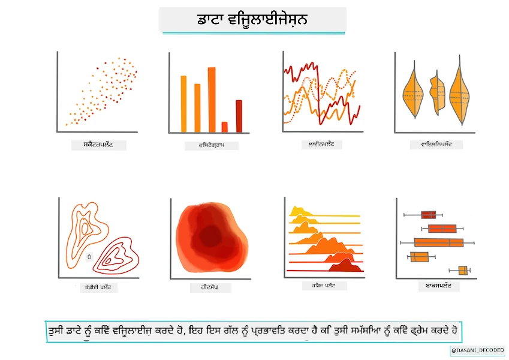
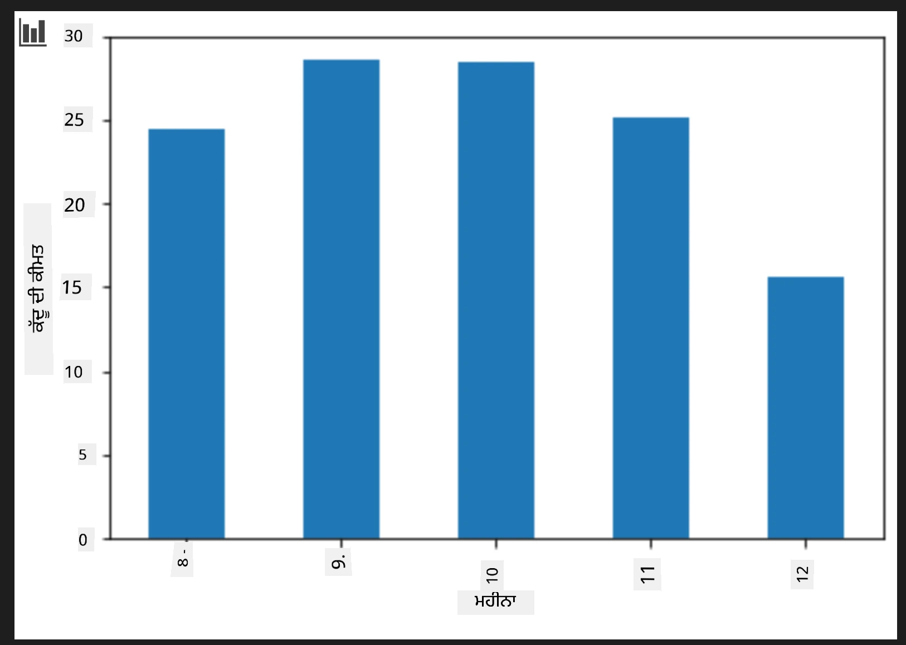
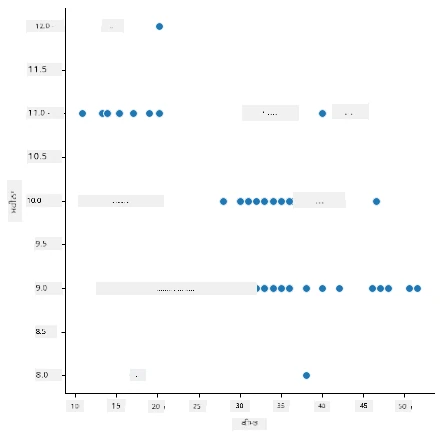
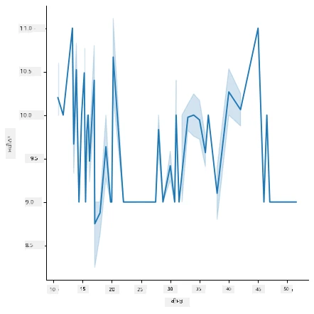
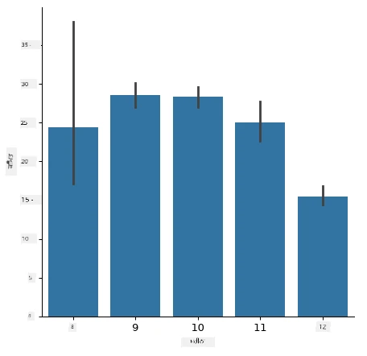
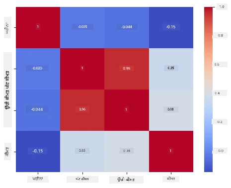

# Scikit-learn ਦੀ ਵਰਤੋਂ ਕਰਕੇ ਇੱਕ ਰਿਗ੍ਰੈਸ਼ਨ ਮਾਡਲ ਬਣਾਓ: ਡਾਟਾ ਤਿਆਰ ਕਰੋ ਅਤੇ ਦ੍ਰਿਸ਼ਟੀਕਰਨ ਕਰੋ



ਇਨਫੋਗ੍ਰਾਫਿਕ [Dasani Madipalli](https://twitter.com/dasani_decoded) ਦੁਆਰਾ

## [ਪੂਰਵ-ਲੈਕਚਰ ਕਵੀਜ਼](https://ff-quizzes.netlify.app/en/ml/)

> ### [ਇਹ ਪਾਠ R ਵਿੱਚ ਉਪਲਬਧ ਹੈ!](../../../../2-Regression/2-Data/solution/R/lesson_2.html)

## ਪਰਿਚਯ

ਹੁਣ ਜਦ ਤੁਸੀਂ Scikit-learn ਨਾਲ ਮਸ਼ੀਨ ਲਰਨਿੰਗ ਮਾਡਲ ਬਣਾਉਣ ਦੀ ਸ਼ੁਰੂਆਤ ਕਰਨ ਲਈ ਜ਼ਰੂਰੀ ਸਾਧਨਾਂ ਨਾਲ ਤਿਆਰ ਹੋ, ਤਾਂ ਤੁਸੀਂ ਆਪਣੇ ਡਾਟਾ ਨੂੰ ਲੈ ਕੇ ਸਵਾਲ ਪੁੱਛਣ ਲਈ ਤਿਆਰ ਹੋ। ਜਦ ਤੁਸੀਂ ਡਾਟਾ ਨਾਲ ਕੰਮ ਕਰਦੇ ਹੋ ਅਤੇ ML ਹੱਲ ਲੱਗਦੇ ਹੋ, ਤਾਂ ਇਹ ਬਹੁਤ ਜ਼ਰੂਰੀ ਹੈ ਕਿ ਤੁਸੀਂ ਆਪਣੇ ਡਾਟਾ ਸੈਟ ਦੀ ਸੰਭਾਵਨਾਵਾਂ ਨੂੰ ਠੀਕ ਤਰੀਕੇ ਨਾਲ ਖੋਲ੍ਹਣ ਲਈ ਸਹੀ ਸਵਾਲ ਕਿਵੇਂ ਪੁੱਛਣਾ ਹੈ ਸਮਝੋ।

ਇਸ ਪਾਠ ਵਿੱਚ, ਤੁਸੀਂ ਸਿੱਖੋਗੇ:

- ਮਾਡਲ ਬਣਾਉਣ ਲਈ ਆਪਣਾ ਡਾਟਾ ਕਿਵੇਂ ਤਿਆਰ ਕਰਨਾ ਹੈ।
- ਡਾਟਾ ਦ੍ਰਿਸ਼ਟੀਕਰਨ ਲਈ Matplotlib ਦਾ ਵਰਤੋਂ ਕਿਵੇਂ ਕਰਨੀ ਹੈ।
- ਹੋਰ ਪ੍ਰਗਟਵਾਦੀ ਡਾਟਾ ਦ੍ਰਿਸ਼ਟੀਕਰਨ ਲਈ Seaborn ਦੀ ਵਰਤੋਂ ਕਿਵੇਂ ਕਰਨੀ ਹੈ।

## ਆਪਣੇ ਡਾਟਾ ਤੋਂ ਸਹੀ ਸਵਾਲ ਪੁਛਣਾ

ਤੁਹਾਨੂੰ ਜਿਸ ਸਵਾਲ ਦਾ ਜਵਾਬ ਚਾਹੀਦਾ ਹੈ, ਉਹ ਇਸ ਗੱਲ ਦਾ ਨਿਰਣੇ ਕਰੇਗਾ ਕਿ ਤੁਸੀਂ ਕਿਸ ਕਿਸਮ ਦੇ ML ਅਲਗੋਰਿਥਮ ਵਰਤੋਂਗੇ। ਅਤੇ ਤੁਹਾਨੂੰ ਮਿਲਣ ਵਾਲੇ ਜਵਾਬ ਦੀ ਗੁਣਵੱਤਾ ਤੁਹਾਡੇ ਡਾਟਾ ਦੀ ਪ੍ਰਕਿਰਤੀ 'ਤੇ ਬਹੁਤ ਨਿਰਭਰ ਕਰੇਗੀ।

ਇਸ ਪਾਠ ਵਿੱਚ ਦਿੱਤਾ ਗਿਆ [ਡਾਟਾ](https://github.com/microsoft/ML-For-Beginners/blob/main/2-Regression/data/US-pumpkins.csv) ਵੇਖੋ। ਤੁਸੀਂ ਇਹ .csv ਫਾਈਲ VS ਕੋਡ ਵਿੱਚ ਖੋਲ੍ਹ ਸਕਦੇ ਹੋ। ਇੱਕ ਛੇਤੀ ਜ਼ਾਚ ਵਿਚ ਤੁਰੰਤ ਦਿਖਾਈ देता ਹੈ ਕਿ ਕੁਝ ਖਾਲੀ ਥਾਂਵਾਂ ਹਨ ਅਤੇ ਸਤਰਾਂ ਅਤੇ ਅੰਕੜਿਆਂ ਦਾ ਮਿਲਾਪ ਹੈ। ਇਕ ਅਜੀਬ ਕਾਲਮ 'Package' ਵੀ ਹੈ ਜਿੱਥੇ ਡਾਟਾ 'sacks', 'bins' ਅਤੇ ਹੋਰ ਮੁੱਲਾਂ ਵਿੱਚ ਮਿਲਾ-ਜੁਲਾ ਹੈ। ਹਕੀਕਤ ਵਿੱਚ, ਇਹ ਡਾਟਾ ਕੁਝ ਵਿਗੜਿਆ ਹੋਇਆ ਹੈ।

[](https://youtu.be/5qGjczWTrDQ "ਆਰੰਭਕਾਂ ਲਈ ਐਮ ਐਲ - ਡਾਟਾ ਸਾਫ਼-ਸਫਾਈ ਅਤੇ ਵਿਸ਼ਲੇਸ਼ਣ ਕਿਵੇਂ ਕਰੀਏ")

> 🎥 ਇਸ ਪਾਠ ਲਈ ਡਾਟਾ ਤਿਆਰ ਕਰਨ ਲਈ ਇੱਕ ਛੋਟੀ ਵੀਡੀਓ ਦੇਖਣ ਲਈ ਉਪਰ ਦਿੱਤੀ ਚਿੱਤਰ 'ਤੇ ਕਲਿੱਕ ਕਰੋ।

ਹਕੀਕਤ ਵਿੱਚ, ਇੱਕ ਡਾਟਾਸੈੱਟ ਜੋ ਬਿਨਾ ਕਿਸੇ ਤਿਆਰੀ ਦੇ ਸਿੱਧਾ ਮਸ਼ੀਨ ਲਰਨਿੰਗ ਮਾਡਲ ਬਣਾਉਣ ਲਈ ਤਿਆਰ ਦਿੱਤਾ ਜਾਵੇ, ਇਹ ਬਹੁਤ ਅਸਧਾਰਣ ਹੈ। ਇਸ ਪਾਠ ਵਿੱਚ, ਤੁਸੀਂ ਸਟੈਂਡਰਡ ਪਾਇਥਨ ਲਾਇਬ੍ਰੇਰੀਜ਼ ਦੀ ਵਰਤੋਂ ਕਰਕੇ ਕੱਚੇ ਡਾਟਾ ਨੂੰ ਤਿਆਰ ਕਰਨਾ ਸਿੱਖੋਗੇ। ਤੁਸੀਂ ਡਾਟਾ ਨੂੰ ਦ੍ਰਿਸ਼ਟੀਗ੍ਰਹਣ ਕਰਨ ਲਈ ਵੱਖ-ਵੱਖ ਤਕਨੀਕਾਂ ਵੀ ਸਿੱਖੋਗੇ।

## ਕੇਸ ਅਧਿਐਨ: 'ਕੁੱਕੜੀ ਮੰਡੀ'

ਇਸ ਫੋਲਡਰ ਵਿੱਚ ਤੁਹਾਨੂੰ ਰੂਟ `data` ਫੋਲਡਰ ਵਿੱਚ ਸਥਿਤ [US-pumpkins.csv](https://github.com/microsoft/ML-For-Beginners/blob/main/2-Regression/data/US-pumpkins.csv) ਨਾਂ ਦੀ ਇੱਕ .csv ਫਾਈਲ ਮਿਲੇਗੀ ਜਿਸ ਵਿੱਚ 1757 ਲਾਈਨਾਂ ਪੰਪਕਿੰਨ ਮਾਰਕੀਟ ਬਾਰੇ ਡਾਟਾ ਹੈ, ਜੋ ਸ਼ਹਿਰਾਂ ਅਨੁਸਾਰ ਸਮੂਹਬੱਧ ਹੈ। ਇਹ ਇੱਕ ਕੱਚਾ ਡਾਟਾ ਹੈ ਜੋ [Specialty Crops Terminal Markets Standard Reports](https://www.marketnews.usda.gov/mnp/fv-report-config-step1?type=termPrice) ਤੋਂ ਬਾਹਰ ਕੱਢਿਆ ਗਿਆ ਹੈ ਜੋ ਸੰਯੁਕਤ ਰਾਜ ਅਮਰੀਕਾ ਦੇ ਖੇਤੀਬਾੜੀ ਵਿਭਾਗ ਵੱਲੋਂ ਵੰਡਿਆ ਜਾਂਦਾ ਹੈ।

### ਡਾਟਾ ਤਿਆਰ ਕਰਨਾ

ਇਹ ਡਾਟਾ ਜਨਤਕ ਡੋਮੇਨ ਵਿੱਚ ਹੈ। ਇਹ USDA ਵੈੱਬਸਾਈਟ ਤੋਂ ਸ਼ਹਿਰ ਅਨੁਸਾਰ ਕਈ ਵੱਖਰੇ ਫਾਈਲਾਂ ਵਿੱਚ ਡਾਊਨਲੋਡ ਕੀਤਾ ਜਾ ਸਕਦਾ ਹੈ। ਬਹੁਤ ਸਾਰੇ ਵੱਖਰੇ ਫਾਈਲਾਂ ਤੋਂ ਬਚਣ ਲਈ, ਅਸੀਂ ਸਾਰੇ ਸ਼ਹਿਰਾਂ ਦਾ ਡਾਟਾ ਇੱਕ ਸਪ੍ਰੈਡਸ਼ੀਟ ਵਿੱਚ ਜੋੜ ਦਿੱਤਾ ਹੈ, ਇਸ ਤਰ੍ਹਾਂ ਅਸੀਂ ਕੁਝ ਡਾਟਾ ਪਹਿਲਾਂ ਹੀ _ਤਿਆਰ_ ਕਰ ਦਿੱਤਾ ਹੈ। ਅਗਲੇ, ਡਾਟਾ 'ਤੇ ਹੋਰ ਧਿਆਨ ਨਾਲ ਨਜ਼ਰ ਮਾਰਦੇ ਹਾਂ।

### ਕਦੂ ਦਾ ਡਾਟਾ - ਸ਼ੁਰੂਆਤੀ ਨਤੀਜੇ

ਤੁਸੀਂ ਇਸ ਡਾਟੇ ਬਾਰੇ ਕੀ ਧਿਆਨ ਦਿੱਤਾ? ਤੁਸੀਂ ਪਹਿਲਾਂ ਹੀ ਵੇਖਿਆ ਕਿ ਇਹ ਵਿੱਚ ਸਤਰਾਂ, ਅੰਕੜੇ, ਖਾਲੀ ਥਾਂ ਅਤੇ ਅਜੀਬ ਮੁੱਲਾਂ ਦਾ ਮਿਲਾਪ ਹੈ ਜਿਨ੍ਹਾਂ ਨੂੰ ਤੁਸੀਂ ਸਮਝਣਾ ਹੈ।

ਤੁਸੀਂ ਇਸ ਡਾਟੇ ਤੋਂ Regression ਤਕਨੀਕ ਵਰਤ ਕੇ ਕਿਹੜਾ ਸਵਾਲ ਪੁੱਛ ਸਕਦੇ ਹੋ? ਕੀ "ਇੱਕ ਦਿੱਤੇ ਮਹੀਨੇ ਦੌਰਾਨ ਵਿਕਰੀ ਲਈ ਕਦੂ ਦੀ ਕੀਮਤ ਦੀ ਪੇਸ਼ਗੋਈ" ਬਾਰੇ ਸੋਚਿਆ ਜਾ ਸਕਦਾ ਹੈ? ਡਾਟੇ ਨੂੰ ਦੁਬਾਰਾ ਵੇਖਦੇ ਹੋਏ, ਕੁਝ ਬਦਲਾਅ ਕਰਨੇ ਪੈਣਗੇ ਤਾਂ ਜੋ ਕਾਰਜ ਲਈ ਡਾਟਾ ਢਾਂਚਾ ਬਣਾਇਆ ਜਾ ਸਕੇ।
## ਅਭਿਆਸ - ਕਦੂ ਦੇ ਡਾਟੇ ਦਾ ਵਿਸ਼ਲੇਸ਼ਣ ਕਰੋ

ਚਲੋ, [Pandas](https://pandas.pydata.org/) (ਜੋ `Python Data Analysis` ਦਾ ਸੰਕੇਤ ਹੈ) ਇਕ ਟੂਲ ਜੋ ਡਾਟੇ ਨੂੰ ਗਠਿਤ ਕਰਨ ਲਈ ਬਹੁਤ ਲਾਭਦਾਇਕ ਹੈ ਵਰਤ ਕੇ ਕਦੂ ਦੇ ਡਾਟੇ ਦਾ ਵਿਸ਼ਲੇਸ਼ਣ ਅਤੇ ਤਿਆਰੀ ਕਰੀਏ।

### ਸਭ ਤੋਂ ਪਹਿਲਾਂ, ਗੁੰਮ ਸ਼ੁਦ dates ਦੀ ਜਾਂਚ ਕਰੋ

ਤੁਹਾਨੂੰ ਸਭ ਤੋਂ ਪਹਿਲਾਂ ਗੁੰਮ ਸ਼ੁਦ dates ਨੂੰ ਜਾਂਚਣ ਲਈ ਕਦਮ ਚੁੱਕਣੇ ਹੋਣਗੇ:

1. ਤਾਰੀਖ਼ਾਂ ਨੂੰ ਮਹੀਨੇ ਦੇ ਫਾਰਮੈਟ ਵਿੱਚ ਬਦਲੋ (ਇਹ US ਦੀਆਂ ਤਾਰੀਖਾਂ ਹਨ, ਇਸ ਲਈ ਫਾਰਮੈਟ `MM/DD/YYYY` ਹੈ)।
2. ਮਹੀਨਾ ਨਵੀਂ ਕਾਲਮ ਵਿੱਚ ਕੱਢੋ।

_notebook.ipynb_ ਫਾਈਲ ਨੂੰ Visual Studio Code ਵਿੱਚ ਖੋਲ੍ਹੋ ਅਤੇ ਸਪ੍ਰੈਡਸ਼ੀਟ ਨੂੰ ਨਵੀਂ Pandas ਡਾਟਾਫਰੇਮ ਵਿੱਚ ਇੰਪੋਰਟ ਕਰੋ।

1. ਪਹਿਲੇ ਪੰਜ ਕਤਾਰਾਂ ਦੇਖਣ ਲਈ `head()` ਫੰਕਸ਼ਨ ਦੀ ਵਰਤੋਂ ਕਰੋ।

    ```python
    import pandas as pd
    pumpkins = pd.read_csv('../data/US-pumpkins.csv')
    pumpkins.head()
    ```

    ✅ ਪਿਛਲੇ ਪੰਜ ਕਤਾਰਾਂ ਦੇਖਣ ਲਈ ਤੁਸੀਂ ਕਿਹੜਾ ਫੰਕਸ਼ਨ ਵਰਤੋਂਗੇ?

1. ਇਹ ਵੀ ਜਾਂਚੋ ਕਿ ਮੌਜੂਦਾ ਡਾਟਾਫਰੇਮ ਵਿੱਚ ਕੋਈ ਗੁੰਮ ਡਾਟਾ ਹੈ ਜਾਂ ਨਹੀਂ:

    ```python
    pumpkins.isnull().sum()
    ```

    ਕੁਝ ਡਾਟਾ ਗੁੰਮ ਹੈ, ਪਰ ਸ਼ਾਇਦ ਇਹ ਕਾਰਜ ਲਈ ਮਹੱਤਵਪੂਰਨ ਨਾਹ ਹੋਵੇ।

1. ਆਪਣੇ ਡਾਟਾਫਰੇਮ ਨੂੰ ਆਸਾਨ ਬਣਾਉਣ ਲਈ, ਸਿਰਫ ਉਹ ਕਾਲਮ ਚੁਣੋ ਜੋ ਤੁਹਾਨੂੰ ਚਾਹੀਦੇ ਹਨ, `loc` ਫੰਕਸ਼ਨ ਦੀ ਵਰਤੋਂ ਕਰਕੇ ਜੋ ਮੂਲ ਡਾਟਾਫਰੇਮ ਤੋਂ ਇੱਕ ਸਮੂਹ ਕਤਾਰਾਂ (ਜੋ ਪਹਿਲੇ ਪੈਰਾਮੀਟਰ ਵਜੋਂ ਦਿੱਤੀ ਗਈ ਹਨ) ਅਤੇ ਕਾਲਮ (ਦੂਜੇ ਪੈਰਾਮੀਟਰ ਵਜੋਂ) ਕੱਢਦਾ ਹੈ। ਹੇਠਾਂ ਦਿੱਤਾ ਗਿਆ `:` ਅਭਿਵਿਆਕਤੀ ਸਾਰੇ ਕਤਾਰਾਂ ਲਈ ਹੈ।

    ```python
    columns_to_select = ['Package', 'Low Price', 'High Price', 'Date']
    pumpkins = pumpkins.loc[:, columns_to_select]
    ```

### ਦੂਜਾ, ਕਦੂ ਦੀ ਔਸਤ ਕੀਮਤ ਦਾ ਨਿਰਧਾਰਨ ਕਰੋ

ਸੋਚੋ ਕਿ ਕਿਸ ਤਰੀਕੇ ਨਾਲ ਇੱਕ ਦਿੱਤੇ ਮਹੀਨੇ ਵਿੱਚ ਕਦੂ ਦੀ ਔਸਤ ਕੀਮਤ ਨਿਰਧਾਰਤ ਕੀਤੀ ਜਾਵੇ। ਤੁਸੀਂ ਇਸ ਕਾਰਜ ਲਈ ਕਿਹੜੇ ਕਾਲਮ ਚੁਣੋਗੇ? ਸੁਝਾਅ: ਤਿੰਨ ਕਾਲਮ ਲੋੜੀਂਦੇ ਹਨ।

ਹੱਲ: ਨਵੀਂ Price ਕਾਲਮ ਨੂੰ ਭਰਨ ਲਈ `Low Price` ਅਤੇ `High Price` ਕਾਲਮਾਂ ਦੀ ਔਸਤ ਲਓ, ਅਤੇ Date ਕਾਲਮ ਨੂੰ ਸਿਰਫ ਮਹੀਨਾ ਦਿਖਾਉਣ ਲਈ ਬਦਲੋ। ਖੁਸ਼ਕਿਸਮਤੀ ਨਾਲ, ਉਪਰ ਦਿੱਤੀ ਜਾਂਚ ਮੁਤਾਬਕ, dates ਜਾਂ ਕੀਮਤਾਂ ਲਈ ਕੋਈ ਗੁੰਮ ਡਾਟਾ ਨਹੀਂ ਹੈ।

1. ਔਸਤ ਨਿਕਾਲਣ ਲਈ ਹੇਠ ਲਿਖਿਆ ਕੋਡ ਸ਼ਾਮਿਲ ਕਰੋ:

    ```python
    price = (pumpkins['Low Price'] + pumpkins['High Price']) / 2

    month = pd.DatetimeIndex(pumpkins['Date']).month

    ```

   ✅ ਆਪਣੀ ਜਾਂਚ ਲਈ ਤੁਸੀਂ `print(month)` ਵਰਗੇ ਕਮਾਂਡ ਨਾਲ ਕੋਈ ਵੀ ਡਾਟਾ ਛਾਪ ਸਕਦੇ ਹੋ।

2. ਹੁਣ, ਆਪਣਾ ਬਦਲਿਆ ਹੋਇਆ ਡਾਟਾ ਤਾਜ਼ਾ Pandas ਡਾਟਾਫਰੇਮ ਵਿੱਚ ਕਾਪੀ ਕਰੋ:

    ```python
    new_pumpkins = pd.DataFrame({'Month': month, 'Package': pumpkins['Package'], 'Low Price': pumpkins['Low Price'],'High Price': pumpkins['High Price'], 'Price': price})
    ```

    ਆਪਣੇ ਡਾਟਾਫਰੇਮ ਨੂੰ ਪ੍ਰਿੰਟ ਕਰਨ ਨਾਲ ਤੁਹਾਨੂੰ ਇੱਕ ਸਾਫ਼ ਅਤੇ ਵਿਵਸਥਿਤ ਡਾਟਾ ਮਿਲੇਗਾ ਜਿਸ 'ਤੇ ਤੁਸੀਂ ਆਪਣਾ ਨਵਾਂ ਰਿਗ੍ਰੈਸ਼ਨ ਮਾਡਲ ਬਣਾਉ ਸਕਦੇ ਹੋ।

### ਪਰ ਰੁਕੋ! ਇੱਥੇ ਕੁਝ ਗੜਬੜ ਹੈ

ਜੇ ਤੁਸੀਂ `Package` ਕਾਲਮ ਵੇਖੋ, ਤਾਂ ਕਦੂ ਕਈ ਵੱਖ-ਵੱਖ ਰੂਪਾਂ ਵਿੱਚ ਵੇਚੇ ਜਾਂਦੇ ਹਨ। ਕੁਝ '1 1/9 ਬਸ਼ਲ' ਮਾਪ ਵਿੱਚ ਵੇਚੇ ਜਾਂਦੇ ਹਨ, ਕੁਝ '1/2 ਬਸ਼ਲ' ਮਾਪ ਵਿੱਚ, ਕੁਝ ਪ੍ਰਤੀ ਕਦੂ, ਕੁਝ ਪ੍ਰਤੀ ਪੌਂਡ ਅਤੇ ਕੁਝ ਵੱਡੇ ਬਕਸਿਆਂ ਵਿੱਚ ਜਿਨ੍ਹਾਂ ਦੀ ਵਿਆਪਕਤਾ ਵੱਖਰੀ ਹੁੰਦੀ ਹੈ।

> ਕਦੂਆਂ ਨੂੰ ਲਗਾਤਾਰ ਤੌਰ 'ਤੇ ਤੋਲਣਾ ਬਹੁਤ ਮੁਸ਼ਕਲ ਦਿੱਸਦਾ ਹੈ

ਮੂਲ ਡਾਟੇ ਦੀ ਖੋਜ ਕਰਨ 'ਤੇ, ਇਹ ਦਿਲਚਸਪ ਹੈ ਕਿ ਜਿਸ ਡਾਟੇ ਵਿੱਚ `Unit of Sale` 'EACH' ਜਾਂ 'PER BIN' ਦੇ ਬਰਾਬਰ ਹੈ, ਉਹਨਾਂ ਦਾ `Package` ਕਿਸਮ ਪ੍ਰਤੀ ਇੰਚ, ਪ੍ਰਤੀ ਬਿਨ ਜਾਂ 'each' ਹੁੰਦੀ ਹੈ। ਕਦੂਆਂ ਨੂੰ ਲਗਾਤਾਰ ਤੌਰ 'ਤੇ ਤੋਲਣਾ ਮੁਸ਼ਕਲ ਹੈ, ਇਸ ਲਈ ਆਓ ਸਿਰਫ ਉਹ ਕਦੂ ਚੁਣੀਏ ਜਿਨ੍ਹਾਂ ਦੇ `Package` ਕਾਲਮ ਵਿਚ ਸ਼ਬਦ 'bushel' ਹੈ।

1. ਫਾਈਲ ਦੇ ਸ਼ੁਰੂ ਵਿੱਚ, ਮੁਢਲੇ .csv ਇੰਪੋਰਟ ਦੇ ਥੱਲੇ ਇੱਕ ਫਿਲਟਰ ਸ਼ਾਮਿਲ ਕਰੋ:

    ```python
    pumpkins = pumpkins[pumpkins['Package'].str.contains('bushel', case=True, regex=True)]
    ```

    ਹੁਣ ਜੇ ਤੁਸੀਂ ਡਾਟਾ ਪ੍ਰਿੰਟ ਕਰੋਗੇ, ਤਾਂ ਤੁਹਾਨੂੰ ਸਿਰਫ਼ ਬਸ਼ਲ ਨਾਲ ਸੰਬੰਧਿਤ ਕਰੀਬ 415 ਲਾਈਨਾਂ ਮਿਲਣਗੀਆਂ।

### ਪਰ ਰੁਕੋ! ਐਕ ਹੋਰ ਚੀਜ਼ ਕਰਨੀ ਹੈ

ਕੀ ਤੁਸੀਂ ਧਿਆਨ ਦਿੱਤਾ ਕਿ ਬਸ਼ਲ ਦੀ ਮਾਤਰਾ ਪ੍ਰਤੀ ਕਤਾਰ ਵੱਖਰੀ ਹੈ? ਤੁਹਾਨੂੰ ਕੀਮਤਨੂੰ ਪ੍ਰਤੀ ਬਸ਼ਲ ਨਾਰਮਲਾਈਜ਼ ਕਰਨੀ ਪਏਗੀ, ਇਸ ਲਈ ਇਸ ਨੂੰ ਮਾਪਦੰਡਿਤ ਕਰਨ ਲਈ ਕੁਝ ਗਣਿਤ ਕਰਨੀ ਹੋਵੇਗੀ।

1. ਨਵੇਂ new_pumpkins ਡਾਟਾਫਰੇਮ ਬਣਾਉਣ ਵਾਲੇ ਬਲਾਕ ਤੋਂ ਬਾਅਦ ਇਹ ਲਾਈਨਾਂ ਸ਼ਾਮਿਲ ਕਰੋ:

    ```python
    new_pumpkins.loc[new_pumpkins['Package'].str.contains('1 1/9'), 'Price'] = price/(1 + 1/9)

    new_pumpkins.loc[new_pumpkins['Package'].str.contains('1/2'), 'Price'] = price/(1/2)
    ```

✅ [The Spruce Eats](https://www.thespruceeats.com/how-much-is-a-bushel-1389308) ਅਨੁਸਾਰ, ਇੱਕ ਬਸ਼ਲ ਦਾ ਵਜ਼ਨ ਉਸ ਦੇ ਉਤਪਾਦ ਦੇ ਕਿਸਮ 'ਤੇ ਨਿਰਭਰ ਕਰਦਾ ਹੈ, ਕਿਉਂਕਿ ਇਹ ਇੱਕ ਆਕਾਰ ਮਾਪ ਹੈ। "ਟਮਾਟਰ ਦਾ ਇੱਕ ਬਸ਼ਲ, ਉਦਾਹਰਨ ਲਈ, 56 ਪੌਂਡ ਤੋਲਣਾ ਆਦਰਸ਼ ਹੈ... ਪੱਤੇ ਅਤੇ ਹਰੀਆ ਭਾਗ ਜਿਆਦਾ ਜਗ੍ਹਾ ਘੇਰਦੇ ਹਨ ਪਰ ਘੱਟ ਵਜ਼ਨ ਵਾਲੇ ਹੁੰਦੇ ਹਨ, ਇਸ ਲਈ ਸਪਿਨੇਚ ਦਾ ਬਸ਼ਲ ਸਿਰਫ 20 ਪੌਂਡ ਹੈ।" ਇਹ ਸਭ ਕੁਝ ਕਾਫ਼ੀ ਜਟਿਲ ਹੈ! ਆਓ ਬਸ਼ਲ ਤੋਂ ਪੌਂਡ ਤਬਦੀਲ ਕਰਨ ਦੀ ਕੋਸ਼ਿਸ਼ ਨਾ ਕਰੀਏ, ਇਸ ਦੇ ਬਦਲੇ ਪ੍ਰਤੀ ਬਸ਼ਲ ਕੀਮਤ ਦਿਖਾਈਏ। ਪਰ ਇਹ ਪੰਪਕਿਨ ਬਸ਼ਲਾਂ ਦੀ ਅਧਿਐਨ ਇਹ ਦਿਖਾਉਂਦਾ ਹੈ ਕਿ ਆਪਣੇ ਡਾਟੇ ਦੀ ਪ੍ਰਕਿਰਤੀ ਨੂੰ ਸਮਝਣਾ ਕਿੰਨਾ ਜ਼ਰੂਰੀ ਹੈ!

ਹੁਣ ਤੁਸੀਂ ਆਪਣੇ ਬਸ਼ਲ ਮਾਪ ਦੇ ਆਧਾਰ 'ਤੇ ਕੀਮਤਾਂ ਦਾ ਵਿਸ਼ਲੇਸ਼ਣ ਕਰ ਸਕਦੇ ਹੋ। ਜੇ ਤੁਸੀਂ ਡਾਟਾ ਇੱਕ ਵਾਰੀ ਹੋਰ ਪ੍ਰਿੰਟ ਕਰੋ, ਤਾਂ ਤੁਹਾਨੂੰ ਮਿਆਰੀਕ੍ਰਿਤ ਕੀਮਤਾਂ ਦਿਖਾਈ ਦੇਣਗੀਆਂ।

✅ ਕੀ ਤੁਸੀਂ ਦੇਖਿਆ ਕਿ ਅੱਧਾ ਬਸ਼ਲ ਵਿੱਚ ਵੇਚੇ ਜਾਣ ਵਾਲੇ ਕਦੂ ਬਹੁਤ ਮਹਿੰਗੇ ਹੁੰਦੇ ਹਨ? ਕੀ ਤੁਸੀਂ ਕਾਰਨ ਪਤਾ ਲਾ ਸਕਦੇ ਹੋ? ਸੁਝਾਅ: ਛੋਟੇ ਕਦੂ ਵੱਡੇ ਮੁਕਾਬਲੇ ਕਾਫੀ ਜ਼ਿਆਦਾ ਮਹਿੰਗੇ ਹੁੰਦੇ ਹਨ, ਸ਼ਾਇਦ ਇਸ ਕਰਕੇ ਕਿ ਬਸ਼ਲ ਵਿੱਚ ਬਹੁਤ ਜ਼ਿਆਦਾ ਛੋਟੇ ਕਦੂ ਆ ਜਾਂਦੇ ਹਨ, ਜਦਕਿ ਇਕ ਵੱਡਾ ਖਾਲੀ ਪਾਈ ਕਦੂ ਜਗ੍ਹਾ ਘੇਰਦਾ ਹੈ।

## ਦ੍ਰਿਸ਼ਟੀਕਰਨ ਤਕਨੀਕਾਂ

ਡਾਟਾ ਸਾਇੰਟਿਸਟ ਦਾ ਇੱਕ ਹਿੱਸਾ ਇਹ ਦਰਸਾਉਣਾ ਹੈ ਕਿ ਉਹ ਕਿਸ ਪ੍ਰਕਾਰ ਦਾ ਡਾਟਾ ਵਰਤ ਰਿਹਾ ਹੈ। ਇਸ ਲਈ ਉਹ ਅਕਸਰ ਦਿਲਚਸਪ ਦ੍ਰਿਸ਼ਟੀਕਰਨ (visualizations), ਗ੍ਰਾਫ, ਚਾਰਟ ਬਣਾਉਂਦੇ ਹਨ ਜੋ ਡਾਟੇ ਦੇ ਵੱਖ-ਵੱਖ ਪੱਖ ਦਿਖਾਉਂਦੇ ਹਨ। ਇਸ ਤਰੀਕੇ ਨਾਲ, ਉਹ ਸੰਬੰਧਾਂ ਅਤੇ ਖਾਮੀਆਂ ਜੋ ਆਮ ਤੌਰ 'ਤੇ ਪਤਾ ਲਗਾਉਣਾ ਮੁਸ਼ਕਲ ਹੁੰਦਾ ਹੈ, ਵਰਣਨ ਕਰ ਸਕਦੇ ਹਨ।

[](https://youtu.be/SbUkxH6IJo0 "ਆਰੰਭਕਾਂ ਲਈ ਐਮ ਐਲ - Matplotlib ਨਾਲ ਡਾਟਾ ਦ੍ਰਿਸ਼ਟੀਗ੍ਰਹਣ ਕਿਵੇਂ ਕਰੀਏ")

> 🎥 ਇਸ ਪਾਠ ਲਈ ਡਾਟਾ ਦ੍ਰਿਸ਼ਟੀਗ੍ਰਹਣ ਕਰਨ ਬਾਰੇ ਇੱਕ ਛੋਟੀ ਵੀਡੀਓ ਦੇਖਣ ਲਈ ਉਪਰ ਦਿੱਤੀ ਚਿੱਤਰ 'ਤੇ ਕਲਿੱਕ ਕਰੋ।

ਦ੍ਰਿਸ਼ਟੀਗ੍ਰਹਣ ਮਸ਼ੀਨ ਲਰਨਿੰਗ ਤਕਨੀਕ ਪ੍ਰਾਪਤ ਕਰਨ ਵਿੱਚ ਵੀ ਮਦਦ ਕਰਦੇ ਹਨ ਜੋ ਡਾਟੇ ਲਈ ਸਭ ਤੋਂ ਜਚਦੀ ਹੈ। ਉਦਾਹਰਨ ਵਜੋਂ, ਇੱਕ scatterplot ਜੋ ਲਕੀਰ ਦੇ ਅਨੁਕੂਲ ਦਿੱਸ ਰਿਹਾ ਹੈ, ਓਹੁ ਡਾਟਾ ਲੀਨੀਅਰ ਰਿਗ੍ਰੈਸ਼ਨ ਅਭਿਆਸ ਲਈ ਮਾਣਤਾ ਦਿੰਦਾ ਹੈ।

ਇੱਕ ਡਾਟਾ ਦ੍ਰਿਸ਼ਟੀਗ੍ਰਹਣ ਲਾਇਬ੍ਰੇਰੀ ਜੋ Jupyter ਨੋਟਬੁੱਕ ਵਿੱਚ ਚੰਗੀ ਤਰ੍ਹਾਂ ਕੰਮ ਕਰਦੀ ਹੈ ਉਹ ਹੈ [Matplotlib](https://matplotlib.org/) (ਜੋ ਤੁਸੀਂ ਪਹਿਲਾਂ ਦੇ ਪਾਠ ਵਿੱਚ ਵੀ ਦੇਖ ਚੁਕੇ ਹੋ)।

> ਡਾਟਾ ਦ੍ਰਿਸ਼ਟੀਗ੍ਰਹਣ ਵਿੱਚ ਹੋਰ ਅਨੁਭਵ ਪ੍ਰਾਪਤ ਕਰਨ ਲਈ [ਇਸ ਟਿਊਟੋਰਿਯਲ](https://docs.microsoft.com/learn/modules/explore-analyze-data-with-python?WT.mc_id=academic-77952-leestott) ਨੂੰ ਦੇਖੋ।

## ਅਭਿਆਸ - Matplotlib ਨਾਲ ਪ੍ਰਯੋਗ ਕਰੋ

ਕੁਝ ਅਸਲ ਗ੍ਰਾਫ ਬਣਾਓ ਜੋ ਨਵਾਂ ਡਾਟਾਫਰੇਮ ਦਿਖਾਉਂਦੇ ਹਨ ਜੋ ਤੁਸੀਂ ਹੁਣੀ ਬਣਾਇਆ ਹੈ। ਇੱਕ ਸਧਾਰਣ ਲਾਈਨ ਗ੍ਰਾਫ ਕੀ ਦਿਖਾਵੇਗਾ?

1. ਫਾਈਲ ਦੇ ਊਪਰ Pandas ਇੰਪੋਰਟ ਦੇ ਥੱਲੇ Matplotlib ਇੰਪੋਰਟ ਕਰੋ:

    ```python
    import matplotlib.pyplot as plt
    ```

1. ਪੂਰੀ ਨੋਟਬੁੱਕ ਨੂੰ ਦੁਬਾਰਾ ਚਲਾਓ ਤਾ ਜੋ ਨਵਾਂ ਡਾਟਾ ਲੋਡ ਹੋ ਜਾਵੇ।
1. ਨੋਟਬੁੱਕ ਦੇ ਹੇਠਾਂ ਇੱਕ ਸੈੱਲ ਸ਼ਾਮਿਲ ਕਰੋ ਜੋ ਡਾਟਾ ਨੂੰ ਬਾਕਸ ਪਲਾਟ ਵਜੋਂ ਪ੍ਰਦਰਸ਼ਿਤ ਕਰੇ:

    ```python
    price = new_pumpkins.Price
    month = new_pumpkins.Month
    plt.scatter(price, month)
    plt.show()
    ```

    

    ਕੀ ਇਹ ਇੱਕ ਲਾਭਦਾਇਕ ਪਲਾਟ ਹੈ? ਕੀ ਤੁਹਾਨੂੰ ਇਸ ਵਿੱਚ ਕੋਈ ਹੈਰਾਨੀਜਨਕ ਗੱਲ ਮਿਲੀ?

    ਇਹ ਖ਼ਾਸ ਤੌਰ 'ਤੇ ਲਾਭਦਾਇਕ ਨਹੀਂ ਹੈ ਕਿਉਂਕਿ ਇਹ ਸਿਰਫ਼ ਵੱਖ-ਵੱਖ ਮਹੀਨਿਆਂ ਵਿੱਚ ਤੁਹਾਡੇ ਡਾਟਾ ਨੂੰ ਬਿੰਦੂਆਂ ਵਜੋਂ ਦਿਖਾਉਂਦਾ ਹੈ।

### ਇਸ ਨੂੰ ਲਾਭਦਾਇਕ ਬਣਾਓ

ਲਾਭਦਾਇਕ ਡੇਟਾ ਦਿਖਾਉਣ ਲਈ, ਅਕਸਰ ਤੁਸੀਂ ਡਾਟਾ ਨੂੰ ਸਮੂਹ ਕਰਨਾ ਹੁੰਦਾ ਹੈ। ਚਲੋ ਇੱਕ ਅਜਿਹਾ ਗ੍ਰੁੱਪ ਕੀਤਾ ਗਿਆ ਬਾਰ ਚਾਰਟ ਬਣਾਈਏ ਜਿਸ ਵਿੱਚ y ਅਕਸ ਦਰਸਾਵੇ ਮਹੀਨੇ ਅਤੇ ਡਾਟਾ ਵੰਡ ਨੂੰ ਦਰਸਾਵੇ।

1. ਇੱਕ ਸੈੱਲ ਸ਼ਾਮਿਲ ਕਰੋ ਜੋ ਇੱਕ ਗ੍ਰੁੱਪ ਕੀਤਾ ਗਿਆ ਬਾਰ ਚਾਰਟ ਬਣਾਵੇ:

    ```python
    new_pumpkins.groupby(['Month'])['Price'].mean().plot(kind='bar')
    plt.ylabel("Pumpkin Price")
    ```

    

    ਇਹ ਡਾਟਾ ਦ੍ਰਿਸ਼ਟੀਗ੍ਰਹਣ ਜ਼ਿਆਦਾ ਲਾਭਦਾਇਕ ਹੈ! ਇਹ ਦਰਸਾਉਂਦਾ ਹੈ ਕਿ ਕਦੂਆਂ ਦੀ ਸਭ ਤੋਂ ਵੱਧ ਕੀਮਤ ਸਤੰਬਰ ਅਤੇ ਅਕਤੂਬਰ ਵਿੱਚ ਹੁੰਦੀ ਹੈ। ਕੀ ਇਹ ਤੁਹਾਡੀ ਉਮੀਦ ਨਾਲ ਮੇਲ ਖਾਂਦਾ ਹੈ? ਕਿਉਂ ਜਾਂ ਕਿਉਂ ਨਹੀਂ?

## ਅਭਿਆਸ - Seaborn ਨਾਲ ਪ੍ਰਯੋਗ ਕਰੋ

Matplotlib ਸ਼ਕਤੀਸ਼ਾਲੀ ਹੈ, ਪਰ ਇੱਕ ਚੰਗਾ ਚਾਰਟ ਬਣਾਉਣ ਲਈ ਇਹ ਬਹੁਤ ਕੋਡ ਲੱਗਦਾ ਹੈ। [Seaborn](https://seaborn.pydata.org/) Matplotlib ਦੇ ਉੱਤੇ ਬਣਾਈ ਗਈ ਇੱਕ ਲਾਇਬ੍ਰੇਰੀ ਹੈ ਜੋ ਅੰਕੜਿਆਂ ਦੇ ਅਧਾਰ 'ਤੇ ਡਾਟਾ ਦ੍ਰਿਸ਼ਟੀਗ੍ਰਹਣ ਲਈ ਡਿਜ਼ਾਇਨ ਕੀਤੀ ਗਈ ਹੈ। ਇਹ ਸਿੱਧਾ Pandas ਡਾਟਾਫਰੇਮ ਨਾਲ ਕੰਮ ਕਰਦੀ ਹੈ, ਖੂਬਸੂਰਤ ਡਿਫਾਲਟ ਸਟਾਈਲ ਲਗਾਉਂਦੀ ਹੈ ਅਤੇ ਘੱਟ ਕੋਡ ਨਾਲ ਜਾਣਕਾਰੀਪੂਰਣ ਪਲਾਟ ਬਣਾਉਂਦੀ ਹੈ। ਕਿਉਂਕਿ Seaborn Matplotlib ਦੇ ਆਬਜੈਕਟ ਰਿਟਰਨ ਕਰਦਾ ਹੈ, ਤੁਸੀਂ ਹਾਲੇ ਵੀ Matplotlib ਬਾਰੇ ਜੋ ਕੁਝ ਜਾਣਦੇ ਹੋ ਨਾਲ ਨਤੀਜਾ ਬਹਿਤਰੀਨ ਕਰ ਸਕਦੇ ਹੋ।

> ਜੇ ਤੁਹਾਡੇ ਕੋਲ Seaborn ਇੰਸਟਾਲ ਨਹੀਂ ਹੈ, ਤਾਂ ਇਸਨੂੰ `pip install seaborn` ਨਾਲ ਇੰਸਟਾਲ ਕਰੋ।

1. ਨੋਟਬੁੱਕ ਦੇ ਸ਼ੁਰੂ ਵਿੱਚ ਹੋਰ ਇੰਪੋਰਟਾਂ ਦੇ ਥੱਲੇ Seaborn ਨੂੰ ਇੰਪੋਰਟ ਕਰੋ। ਇਹ ਆਮ ਤੌਰ 'ਤੇ `sns` ਵਜੋਂ ਇੰਪੋਰਟ ਕੀਤਾ ਜਾਂਦਾ ਹੈ:

    ```python
    import seaborn as sns
    ```

### ਸੰਬੰਧ ਦਿਖਾਉਣ ਲਈ scatter plots

ਮਾਡਲ ਬਣਾਉਣ ਤੋਂ ਪਹਿਲਾਂ ਡਾਟਾ ਖੋਜਨ ਦਾ ਵੱਡਾ ਹਿੱਸਾ ਹੈ ਵਰੀਏਬਲਾਂ ਵਿਚਕਾਰ ਦੇ _ਸੰਬੰਧਾਂ_ ਨੂੰ ਲੱਭਣ ਦਾ। ਇੱਕ [scatter plot](https://en.wikipedia.org/wiki/Scatter_plot) ਇਸ ਲਈ ਸਭ ਤੋਂ ਵਧੀਆ ਔਜ਼ਾਰਾਂ ਵਿੱਚੋਂ ਇੱਕ ਹੈ: ਜੇ ਬਿੰਦੂ ਇੱਕ ਲਕੀਰ ਦੀ ਪਾਲਣਾ ਕਰਦੇ ਦਿੱਸਦੇ ਹਨ, ਤਾਂ ਦੋਹਾਂ ਵਰੀਏਬਲਾਂ ਵਿੱਚ ਸਬੰਧ ਹੋ ਸਕਦਾ ਹੈ, ਜੋ ਕਿ ਲੀਨੀਅਰ ਰਿਗ੍ਰੈਸ਼ਨ ਮਾਡਲ ਲਈ ਚੰਗੀ ਗੱਲ ਹੈ।

1. ਪਹਿਲਾਂ ਬਣਾਏ ਗਏ ਕੀਮਤ-ਮਹੀਨਾ scatter plot ਨੂੰ ਫਿਰ ਬਣਾਓ, ਇਸ ਵਾਰੀ Seaborn ਦੇ [`relplot()`](https://seaborn.pydata.org/generated/seaborn.relplot.html) (ਰਿਲੇਸ਼ਨਲ ਪਲਾਟ) ਦੀ ਵਰਤੋਂ ਕਰਕੇ, ਜੋ ਸਿੱਧਾ ਤੁਹਾਡੇ ਡਾਟਾਫਰੇਮ ਕਾਲਮਾਂ ਨਾਲ ਕੰਮ ਕਰਦਾ ਹੈ:

    ```python
    sns.relplot(x="Price", y="Month", data=new_pumpkins)
    ```

    

    ਧਿਆਨ ਦਿਓ ਕਿ ਤੁਸੀਂ ਕਿਵੇਂ _ਕਾਲਮ ਨਾਮਾਂ_ ਅਤੇ ਡਾਟਾਫਰੇਮ ਦਿੰਦੇ ਹੋ, ਅਤੇ Seaborn ਤੁਹਾਡੇ ਲਈ ਅਕਸਾਂ ਦੇ ਲੇਬਲ ਸੁਚੱਜੇ ਤਰੀਕੇ ਨਾਲ ਬਣਾਉਂਦਾ ਹੈ।

2. ਤੁਸੀਂ `kind="line"` ਪਾਸ ਕਰਕੇ ਲਾਈਨ ਪਲਾਟ 'ਤੇ ਬਦਲ ਸਕਦੇ ਹੋ। Seaborn ਲਾਈਨ ਦੇ ਆਲੇ-ਦੁਆਲੇ ਵਿਸ਼ਵਾਸ інтэрਵਾਲ ਦਿਖਾਉਂਦਾ ਹੈ:

    ```python
    sns.relplot(x="Price", y="Month", kind="line", data=new_pumpkins)
    ```

    

    ਇਹ ਵਿਸ਼ੇਸ਼ ਡਾਟਾ ਕਾਫੀ ਸ਼ੋਰ ਵਾਲਾ ਹੈ, ਇਸ ਲਈ ਲਾਈਨ ਪਲਾਟ ਸਭ ਤੋਂ ਸਾਫ਼ ਨਾਹ ਹੈ — ਪਰ ਇਸ ਨਾਲ ਦਿਖਾਇਆ ਗਿਆ ਹੈ ਕਿ ਤੁਸੀਂ ਕਿਵੇਂ ਅਸਾਨੀ ਨਾਲ Seaborn ਵਿੱਚ ਚਾਰਟ ਦਾ ਕਿਸਮ ਬਦਲ ਸਕਦੇ ਹੋ।

### ਵੰਡਾਂ ਦਿਖਾਉਣ ਲਈ ਬਾਰ ਚਾਰਟ


ਪਹਿਲਾਂ ਤੁਸੀਂ ਮੈਟਪਲੌਟਲਿਬ ਨਾਲ ਇੱਕ ਬਾਰ ਚਾਰਟ ਬਣਾਉਣ ਲਈ ਡਾਟਾ ਹੱਥੋਂ ਗਰੂਪ ਕੀਤਾ ਸੀ। ਸੀਬੋਰਨ ਦਾ [`catplot()`](https://seaborn.pydata.org/generated/seaborn.catplot.html) (ਵਰਗੀਕਰਿਤ ਪਲਾਟ) ਤੁਹਾਡੇ ਲਈ ਗਰੂਪਿੰਗ ਅਤੇ ਸਮੀਕਰਨ ਕਰ ਸਕਦਾ ਹੈ। ਡੀਫ਼ਾਲਟ ਵਜੋਂ `kind="bar"` ਹਰ ਵਰਗ ਦਾ ਔਸਤ ਦਿਖਾਉਂਦਾ ਹੈ, ਨਾਲ ਹੀ ਇੱਕ ਕਾਲੀ ਲਾਈਨ ਜੋ ਭਰੋਸੇਮੰਦ ਇੰਤਰਾਲ ਦਰਸਾਂਦੀ ਹੈ।

1. ਹਰ ਮਹੀਨੇ ਦੀ ਔਸਤ ਕੀਮਤ ਦਾ ਬਾਰ ਚਾਰਟ ਬਣਾਓ:

    ```python
    sns.catplot(x="Month", y="Price", data=new_pumpkins, kind="bar")
    ```

    

    ਇਹ ਮੈਟਪਲੌਟਲਿਬ ਨਾਲ ਜੋ ਤੁਸੀਂ ਦੇਖਿਆ ਉਸਦੀ ਪੁਸ਼ਟੀ ਕਰਦਾ ਹੈ — ਕੀਮਤਾਂ ਸਤੰਬਰ ਅਤੇ ਅਕਤੂਬਰ ਦੇ ਆਲੇ ਦੁਆਲੇ ਚੋਟੀ ਤੇ ਹਨ — ਪਰ ਸੀਬੋਰਨ ਇਹ ਵੀ ਦਿਖਾਉਂਦਾ ਹੈ ਕਿ ਹਰ ਮਹੀਨੇ ਅੰਦਰ ਕੀਮਤ ਕਿੰਨੀ ਵੱਧ/ਘੱਟ ਹੁੰਦੀ ਹੈ।

### ਸਬੰਧ ਦਿਖਾਉਣ ਲਈ ਹੀਟਮੇਪਸ

ਸਕੈਟਰ ਪਲਾਟ ਇੱਕ ਸਮੇਂ ਦੋ ਚਰ ਨੂੰ ਤੁਲਨਾ ਕਰਦੇ ਹਨ। ਜਦੋਂ ਤੁਹਾਡੇ ਕੋਲ ਕਈ ਗਿਣਤੀ ਵਾਲੇ ਕਾਲਮ ਹੁੰਦੇ ਹਨ, ਤਾਂ ਇੱਕ [ਹੀਟਮੇਪ](https://en.wikipedia.org/wiki/Heat_map) ਤੁਹਾਨੂੰ ਸਾਰੇ ਕਾਲਮਾਂ ਦੇ ਜੋੜਿਆਂ ਵਿਚਕਾਰ ਸਬੰਧ ਦੀ ਤਾਕਤ ਇੱਕ ਵਾਰੀ ਵੇਖਣ ਦਿੰਦਾ ਹੈ। ਇਹ ਇੱਕ ਆਮ ਤਰੀਕਾ ਹੈ ਇਹ ਪਤਾ ਕਰਨ ਲਈ ਕਿ ਕਿਹੜੇ ਫੀਚਰ ਸਭ ਤੋਂ ਵੱਧ ਸੰਬੰਧਤ ਹਨ ਇਸ ਤੋਂ ਪਹਿਲਾਂ ਕਿ ਤੁਸੀਂ ਮਾਡਲ ਵਿੱਚ ਕੀ ਸ਼ਾਮਲ ਕਰੋ (ਅਤੇ ਵੱਖ-ਵੱਖ ਕਿਸਮ ਦਾ ਚਾਰਟ ਬਾਅਦ ਵਿੱਚ ਕਲਾਸੀਫਿਕੇਸ਼ਨ ਵਿੱਚ ਕਨਫਿਊਜ਼ਨ ਮੈਟ੍ਰਿਕਸ ਦਿਖਾਉਣ ਲਈ ਵਰਤਿਆ ਜਾਂਦਾ ਹੈ)।

1. ਪੈਂਡਾਸ ਨਾਲ ਇੱਕ ਕੋਰੀਲੇਸ਼ਨ ਮੈਟ੍ਰਿਕਸ ਬਣਾਓ, ਫਿਰ ਸੀਬੋਰਨ ਦੇ [`heatmap()`](https://seaborn.pydata.org/generated/seaborn.heatmap.html) ਨਾਲ ਤਸਵੀਰ ਕਾਢੋ। `annot=True` ਵਿਕਲਪ ਹਰ ਕੋਸ਼ਿਕਾ 'ਤੇ ਕੋਰੀਲੇਸ਼ਨ ਮੁੱਲ ਪ੍ਰਿੰਟ ਕਰਦਾ ਹੈ:

    ```python
    correlations = new_pumpkins[['Month', 'Low Price', 'High Price', 'Price']].corr()
    sns.heatmap(correlations, annot=True, cmap="coolwarm")
    ```

    

    ਮੁੱਲ ਜੋ `1` (ਜਾਂ `-1`) ਦੇ ਨੇੜੇ ਹਨ, ਦਾ ਮਤਲਬ ਹੈ ਕਿ ਕਾਲਮਾਂ ਵਿੱਚ ਤੀਬਰ _ਰੇਖੀਅਤਮਕ_ ਸੰਬੰਧ ਹੈ। ਧਿਆਨ ਦਿਓ ਕਿ `Low Price` ਅਤੇ `High Price` ਲਗਭਗ ਪੂਰੀ ਤਰ੍ਹਾਂ ਸੰਬੰਧਤ ਹਨ। ਦੂਜੇ ਪਾਸੇ, `Month` ਸਿਰਫ਼ ਕਮਜ਼ੋਰ ਰੇਖੀਅਤਮਕ ਸੰਬੰਧ ਦਿਖਾਉਂਦਾ ਹੈ — ਹਾਲਾਂਕਿ ਉੱਪਰ ਦਿੱਤੇ ਬਾਰ ਚਾਰਟ ਨੇ ਸਤੰਬਰ ਅਤੇ ਅਕਤੂਬਰ ਵਿੱਚ ਇੱਕ ਸਪਸ਼ਟ ਮੌਸਮੀ ਚੋਟੀ ਦਿਖਾਈ ਸੀ। ਇਹ ਇੱਕ ਮਹੱਤਵਪੂਰਨ ਸਿੱਖਿਆ ਹੈ: ਕੋਰੀਲੇਸ਼ਨ ਕੋਐਫ਼ੀਸ਼ੈਂਟ صرف _ਸਿੱਧਾ-ਰੇਖਾ_ ਦੇ ਸੰਬੰਧ ਮਾਪਦਾ ਹੈ, ਇਸ ਲਈ ਇਹ ਮੌਸਮੀ ਜਾਂ ਹੋਰ ਕਿਸਮ ਦੇ ਗੈਰ ਰੇਖੀਅਤਮਕ ਪੈਟਰਨਾਂ ਨੂੰ ਨਾ ਦਰਸਾ ਸਕਦਾ। ✅ ਕਿਉਂ ਇਹ ਫਾਇਦ੍ਹੇਮੰਦ ਹੈ ਕਿ ਸਿੱਧਾ ਹੀਟਮੇਪ ਅਤੇ ਬਾਰ ਚਾਰਟ ਵਰਗੇ ਚਾਰਟਾਂ ਨੂੰ ਦੇਖ ਕੇ ਇਹ ਫੈਸਲਾ ਕਰਨਾ ਕਿ ਕਿਹੜੇ ਕਾਲਮ ਵਰਤਣੇ ਹਨ?

### ਮੈਟਪਲੌਟਲਿਬ ਜਾਂ ਸੀਬੋਰਨ?

ਦੋਹਾਂ ਲਾਇਬ੍ਰੇਰੀਆਂ ਜਾਣਣ ਯੋਗ ਹਨ:

- **ਮੈਟਪਲੌਟਲਿਬ** ਤੁਹਾਨੂੰ ਇੱਕ ਚਾਰਟ ਦੇ ਹਰ ਤੱਤ 'ਤੇ ਬਾਰੀਕੀ ਨਾਲ ਕੰਟਰੋਲ ਦਿੰਦੀ ਹੈ ਅਤੇ ਇਹ ਲਗਭਗ ਹਰ ਹੋਰ ਪਾਇਥਨ ਪਲਾਟਿੰਗ ਲਾਇਬ੍ਰੇਰੀ ਦੀ ਬੁਨਿਆਦ ਹੈ।
- **ਸੀਬੋਰਨ** ਉੱਚ-ਪੱਧਰੀ ਫੰਕਸ਼ਨਾਂ ਅਤੇ ਆਕਰਸ਼ਕ ਡੀਫਾਲਟ ਪ੍ਰਦਾਨ ਕਰਦਾ ਹੈ ਸਾਂਖਿਆਕੀ ਚਾਰਟਾਂ ਲਈ, ਸਿੱਧਾ ਡਾਟਾ ਫਰੇਮਜ਼ ਨਾਲ ਕੰਮ ਕਰਦਾ ਹੈ, ਅਤੇ ਐਕਸਪਲੋਰੇਟਰੀ ਡੇਟਾ ਵਿਸ਼ਲੇਸ਼ਣ ਲਈ ਅਕਸਰ ਤੇਜ਼ ਹੁੰਦਾ ਹੈ।

ਇੱਕ ਆਮ ਕਾਰਜ-ਪ੍ਰਵਾਹ ਹੈ ਕਿ ਬੜੀ ਤੇਜ਼ੀ ਨਾਲ ਡਾਟਾ ਬੁਝਣ ਲਈ ਸੀਬੋਰਨ ਨੂੰ ਵਰਤਨਾ, ਫਿਰ ਜਦੋਂ ਵਿਸਥਾਰ ਵਿੱਚ ਬਦਲਾਵਾਂ ਕਰਨੇ ਹੋਣ ਤਾਂ ਮੈਟਪਲੌਟਲਿਬ 'ਤੇ ਜਾਵੇ।

---

## 🚀ਚੁਣੌਤੀ

ਮੈਟਪਲੌਟਲਿਬ ਅਤੇ ਸੀਬੋਰਨ ਜੋ ਵੱਖ-ਵੱਖ ਤਰ੍ਹਾਂ ਦੀਆਂ ਵਿਜ਼ੂਅਲਾਈਜ਼ੇਸ਼ਨ ਦਿੰਦੇ ਹਨ, ਉਹਨਾਂ ਦਾ ਪਤਾ ਲਗਾਓ। ਕਿਹੜੇ ਤਰ੍ਹਾਂ ਲੋਕ ਸਭ ਤੋਂ ਵੱਧ ਰਿਗਰੈਸ਼ਨ ਸਮੱਸਿਆਵਾਂ ਲਈ ਮੁਆਫਿਕ ਹਨ?

## [ਪੋਸਟ-ਲੇਕਚਰ ਕਵਿਜ਼](https://ff-quizzes.netlify.app/en/ml/)

## ਸਮੀਖਿਆ ਅਤੇ ਸਵੈ ਅਧਿਐਨ

ਡਾਟਾ ਡਿੱਖਾਉਣ ਦੇ ਕਈ ਤਰੀਕਿਆਂ 'ਤੇ ਇੱਕ ਨਜ਼ਰ ਮਾਰੋ। ਵੱਖ-ਵੱਖ ਲਾਇਬ੍ਰੇਰੀਆਂ ਦੀ ਸੂਚੀ ਬਣਾਓ ਅਤੇ ਜਿਹੜੀਆਂ ਕਿਸ ਤਰ੍ਹਾਂ ਦੇ ਕੰਮਾਂ ਲਈ ਸਭ ਤੋਂ ਵਧੀਆ ਹਨ, ਵਾਂਗ 2D ਵਿਜ਼ੂਅਲਾਈਜ਼ੇਸ਼ਨ ਬਨਾਮ 3D ਵਿਜ਼ੂਅਲਾਈਜ਼ੇਸ਼ਨ, ਲੇਖ ਕਰੋ। ਤੁਸੀਂ ਕੀ ਖੋਜ ਕਰਦੇ ਹੋ?

## ਅਸਾਈਨਮੈਂਟ

[ਵਿਜ਼ੂਅਲਾਈਜ਼ੇਸ਼ਨ ਦੀ ਖੋਜ](assignment.md)

---

<!-- CO-OP TRANSLATOR DISCLAIMER START -->
**ਅਸਵੀਕਾਰੋਪਣ**:
ਇਸ ਦਸਤਾਵੇਜ਼ ਦਾ ਅਨੁਵਾਦ ਏਆਈ ਅਨੁਵਾਦ ਸੇਵਾ [Co-op Translator](https://github.com/Azure/co-op-translator) ਦੀ ਵਰਤੋਂ ਕਰਕੇ ਕੀਤਾ ਗਿਆ ਹੈ। ਜਦੋਂ ਕਿ ਅਸੀਂ ਸਹੀਤਾਵਾਂ ਲਈ ਯਤਨਸ਼ੀਲ ਹਾਂ, ਕਿਰਪਾ ਕਰਕੇ ਧਿਆਨ ਰੱਖੋ ਕਿ ਸਵੈਚਾਲਿਤ ਅਨੁਵਾਦਾਂ ਵਿੱਚ ਗਲਤੀਆਂ ਜਾਂ ਅਸਮੱਤਿਆਵਾਂ ਹੋ ਸਕਦੀਆਂ ਹਨ। ਮੂਲ ਦਸਤਾਵੇਜ਼ ਆਪਣੀ ਮੂਲ ਭਾਸ਼ਾ ਵਿੱਚ ਅਧਿਕਾਰਕ ਸਰੋਤ ਮੰਨਿਆ ਜਾਣਾ ਚਾਹੀਦਾ ਹੈ। ਜਰੂਰੀ ਜਾਣਕਾਰੀ ਲਈ, ਪੇਸ਼ੇਵਰ ਮਨੁੱਖੀ ਅਨੁਵਾਦ ਦੀ ਸਿਫ਼ਾਰਸ਼ ਕੀਤੀ ਜਾਂਦੀ ਹੈ। ਅਸੀਂ ਇਸ ਅਨੁਵਾਦ ਦੇ ਉਪਯੋਗ ਤੋਂ ਪੈਦਾ ਹੋਣ ਵਾਲੀਆਂ ਕਿਸੇ ਵੀ ਗਲਤਫਹਿਮੀਆਂ ਜਾਂ ਗਲਤ ਵਿਆਖਿਆਵਾਂ ਲਈ ਜਵਾਬਦੇਹ ਨਹੀਂ ਹਾਂ।
<!-- CO-OP TRANSLATOR DISCLAIMER END -->