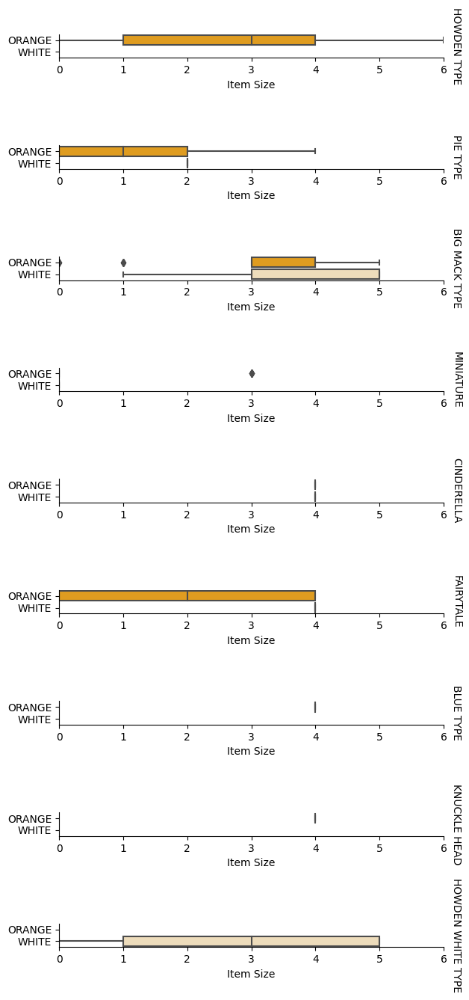

<!--
CO_OP_TRANSLATOR_METADATA:
{
  "original_hash": "72b5bae0879baddf6aafc82bb07b8776",
  "translation_date": "2025-08-29T16:45:57+00:00",
  "source_file": "2-Regression/4-Logistic/README.md",
  "language_code": "pa"
}
-->
# ਲੌਜਿਸਟਿਕ ਰਿਗ੍ਰੈਸ਼ਨ ਨਾਲ ਸ਼੍ਰੇਣੀਆਂ ਦੀ ਭਵਿੱਖਬਾਣੀ


## [ਪ੍ਰੀ-ਲੈਕਚਰ ਕਵਿਜ਼](https://gray-sand-07a10f403.1.azurestaticapps.net/quiz/15/)

> ### [ਇਹ ਪਾਠ ਰ ਵਿੱਚ ਵੀ ਉਪਲਬਧ ਹੈ!](../../../../2-Regression/4-Logistic/solution/R/lesson_4.html)

## ਪਰਿਚਯ

ਰਿਗ੍ਰੈਸ਼ਨ ਦੇ ਇਸ ਆਖਰੀ ਪਾਠ ਵਿੱਚ, ਜੋ ਕਿ ਬੁਨਿਆਦੀ _ਕਲਾਸਿਕ_ ਮਸ਼ੀਨ ਲਰਨਿੰਗ ਤਕਨੀਕਾਂ ਵਿੱਚੋਂ ਇੱਕ ਹੈ, ਅਸੀਂ ਲੌਜਿਸਟਿਕ ਰਿਗ੍ਰੈਸ਼ਨ ਦਾ ਅਧਿਐਨ ਕਰਾਂਗੇ। ਤੁਸੀਂ ਇਸ ਤਕਨੀਕ ਨੂੰ ਬਾਈਨਰੀ ਸ਼੍ਰੇਣੀਆਂ ਦੀ ਭਵਿੱਖਬਾਣੀ ਕਰਨ ਲਈ ਪੈਟਰਨ ਖੋਜਣ ਲਈ ਵਰਤੋਂਗੇ। ਕੀ ਇਹ ਕੈਂਡੀ ਚਾਕਲੇਟ ਹੈ ਜਾਂ ਨਹੀਂ? ਕੀ ਇਹ ਬਿਮਾਰੀ ਸੰਕਰਮਕ ਹੈ ਜਾਂ ਨਹੀਂ? ਕੀ ਇਹ ਗਾਹਕ ਇਸ ਉਤਪਾਦ ਨੂੰ ਚੁਣੇਗਾ ਜਾਂ ਨਹੀਂ?

ਇਸ ਪਾਠ ਵਿੱਚ, ਤੁਸੀਂ ਸਿੱਖੋਗੇ:

- ਡਾਟਾ ਵਿਜੁਅਲਾਈਜ਼ੇਸ਼ਨ ਲਈ ਇੱਕ ਨਵੀਂ ਲਾਇਬ੍ਰੇਰੀ
- ਲੌਜਿਸਟਿਕ ਰਿਗ੍ਰੈਸ਼ਨ ਲਈ ਤਕਨੀਕਾਂ

✅ ਇਸ ਪ੍ਰਕਾਰ ਦੇ ਰਿਗ੍ਰੈਸ਼ਨ ਨਾਲ ਕੰਮ ਕਰਨ ਦੀ ਆਪਣੀ ਸਮਝ ਨੂੰ ਇਸ [ਲਰਨ ਮਾਡਿਊਲ](https://docs.microsoft.com/learn/modules/train-evaluate-classification-models?WT.mc_id=academic-77952-leestott) ਵਿੱਚ ਗਹਿਰਾ ਕਰੋ।

## ਪੂਰਵ ਸ਼ਰਤ

ਕਦੂ ਦੇ ਡਾਟਾ ਨਾਲ ਕੰਮ ਕਰਨ ਤੋਂ ਬਾਅਦ, ਅਸੀਂ ਹੁਣ ਇਸ ਨਾਲ ਕਾਫ਼ੀ ਜਾਣੂ ਹੋ ਗਏ ਹਾਂ ਕਿ ਇੱਕ ਬਾਈਨਰੀ ਸ਼੍ਰੇਣੀ ਹੈ ਜਿਸ ਨਾਲ ਅਸੀਂ ਕੰਮ ਕਰ ਸਕਦੇ ਹਾਂ: `Color`।

ਆਓ ਇੱਕ ਲੌਜਿਸਟਿਕ ਰਿਗ੍ਰੈਸ਼ਨ ਮਾਡਲ ਬਣਾਈਏ ਜੋ ਕੁਝ ਵੈਰੀਏਬਲ ਦੇ ਆਧਾਰ 'ਤੇ ਇਹ ਭਵਿੱਖਬਾਣੀ ਕਰੇ ਕਿ _ਦਿੱਤੇ ਗਏ ਕਦੂ ਦਾ ਰੰਗ ਕੀ ਹੋਵੇਗਾ_ (ਸੰਤਰੀ 🎃 ਜਾਂ ਚਿੱਟਾ 👻)।

> ਅਸੀਂ ਰਿਗ੍ਰੈਸ਼ਨ ਦੇ ਪਾਠ ਸਮੂਹ ਵਿੱਚ ਬਾਈਨਰੀ ਵਰਗੀਕਰਨ ਬਾਰੇ ਕਿਉਂ ਗੱਲ ਕਰ ਰਹੇ ਹਾਂ? ਸਿਰਫ਼ ਭਾਸ਼ਾਈ ਸੁਵਿਧਾ ਲਈ, ਕਿਉਂਕਿ ਲੌਜਿਸਟਿਕ ਰਿਗ੍ਰੈਸ਼ਨ [ਅਸਲ ਵਿੱਚ ਇੱਕ ਵਰਗੀਕਰਨ ਵਿਧੀ ਹੈ](https://scikit-learn.org/stable/modules/linear_model.html#logistic-regression), ਹਾਲਾਂਕਿ ਇਹ ਲੀਨੀਅਰ-ਅਧਾਰਿਤ ਹੈ। ਅਗਲੇ ਪਾਠ ਸਮੂਹ ਵਿੱਚ ਡਾਟਾ ਨੂੰ ਵਰਗੀਕ੍ਰਿਤ ਕਰਨ ਦੇ ਹੋਰ ਤਰੀਕਿਆਂ ਬਾਰੇ ਸਿੱਖੋ।

## ਪ੍ਰਸ਼ਨ ਨੂੰ ਪਰਿਭਾਸ਼ਿਤ ਕਰੋ

ਸਾਡੇ ਮਕਸਦ ਲਈ, ਅਸੀਂ ਇਸਨੂੰ ਇੱਕ ਬਾਈਨਰੀ ਰੂਪ ਵਿੱਚ ਪ੍ਰਗਟ ਕਰਾਂਗੇ: 'ਚਿੱਟਾ' ਜਾਂ 'ਚਿੱਟਾ ਨਹੀਂ'। ਸਾਡੇ ਡਾਟਾਸੈਟ ਵਿੱਚ ਇੱਕ 'ਧਾਰੀਦਾਰ' ਸ਼੍ਰੇਣੀ ਵੀ ਹੈ ਪਰ ਇਸਦੇ ਕੁਝ ਹੀ ਉਦਾਹਰਨ ਹਨ, ਇਸ ਲਈ ਅਸੀਂ ਇਸਨੂੰ ਵਰਤਾਂਗੇ ਨਹੀਂ। ਇਹ ਤਾਂਵਾਂ ਹੀ ਗਾਇਬ ਹੋ ਜਾਂਦੀ ਹੈ ਜਦੋਂ ਅਸੀਂ ਡਾਟਾਸੈਟ ਵਿੱਚੋਂ ਨੱਲ ਮੁੱਲ ਹਟਾਉਂਦੇ ਹਾਂ।

> 🎃 ਮਜ਼ੇਦਾਰ ਤੱਥ: ਅਸੀਂ ਕਈ ਵਾਰ ਚਿੱਟੇ ਕਦੂਆਂ ਨੂੰ 'ਭੂਤ' ਕਦੂ ਕਹਿੰਦੇ ਹਾਂ। ਇਹ ਕੱਟਣ ਲਈ ਬਹੁਤ ਆਸਾਨ ਨਹੀਂ ਹੁੰਦੇ, ਇਸ ਲਈ ਇਹ ਸੰਤਰੀ ਕਦੂਆਂ ਜਿੰਨੇ ਲੋਕਪ੍ਰਿਯ ਨਹੀਂ ਹਨ ਪਰ ਇਹ ਦਿਖਣ ਵਿੱਚ ਕਾਫ਼ੀ ਵਧੀਆ ਹੁੰਦੇ ਹਨ! ਇਸ ਲਈ ਅਸੀਂ ਆਪਣੇ ਪ੍ਰਸ਼ਨ ਨੂੰ ਇਸ ਤਰ੍ਹਾਂ ਵੀ ਦੁਬਾਰਾ ਬਣਾਉਣ ਦੀ ਸੋਚ ਸਕਦੇ ਹਾਂ: 'ਭੂਤ' ਜਾਂ 'ਭੂਤ ਨਹੀਂ'। 👻

## ਲੌਜਿਸਟਿਕ ਰਿਗ੍ਰੈਸ਼ਨ ਬਾਰੇ

ਲੌਜਿਸਟਿਕ ਰਿਗ੍ਰੈਸ਼ਨ ਕੁਝ ਮਹੱਤਵਪੂਰਨ ਤਰੀਕਿਆਂ ਵਿੱਚ ਲੀਨੀਅਰ ਰਿਗ੍ਰੈਸ਼ਨ ਤੋਂ ਵੱਖਰਾ ਹੈ, ਜਿਸ ਬਾਰੇ ਤੁਸੀਂ ਪਹਿਲਾਂ ਸਿੱਖਿਆ ਸੀ।

[](https://youtu.be/KpeCT6nEpBY "ਮਸ਼ੀਨ ਲਰਨਿੰਗ ਵਰਗੀਕਰਨ ਲਈ ਲੌਜਿਸਟਿਕ ਰਿਗ੍ਰੈਸ਼ਨ ਨੂੰ ਸਮਝਣਾ")

> 🎥 ਉੱਪਰ ਦਿੱਤੀ ਤਸਵੀਰ 'ਤੇ ਕਲਿੱਕ ਕਰੋ ਲੌਜਿਸਟਿਕ ਰਿਗ੍ਰੈਸ਼ਨ ਦਾ ਇੱਕ ਛੋਟਾ ਵੀਡੀਓ ਝਲਕ ਵੇਖਣ ਲਈ।

### ਬਾਈਨਰੀ ਵਰਗੀਕਰਨ

ਲੌਜਿਸਟਿਕ ਰਿਗ੍ਰੈਸ਼ਨ ਲੀਨੀਅਰ ਰਿਗ੍ਰੈਸ਼ਨ ਵਰਗੀਆਂ ਵਿਸ਼ੇਸ਼ਤਾਵਾਂ ਨਹੀਂ ਦਿੰਦੀ। ਪਹਿਲੀ ਵਿਧੀ ਬਾਈਨਰੀ ਸ਼੍ਰੇਣੀ ('ਚਿੱਟਾ ਜਾਂ ਚਿੱਟਾ ਨਹੀਂ') ਬਾਰੇ ਭਵਿੱਖਬਾਣੀ ਦਿੰਦੀ ਹੈ ਜਦਕਿ ਦੂਜੀ ਵਿਧੀ ਲਗਾਤਾਰ ਮੁੱਲਾਂ ਦੀ ਭਵਿੱਖਬਾਣੀ ਕਰਨ ਦੇ ਯੋਗ ਹੈ, ਉਦਾਹਰਨ ਲਈ, ਜੇਕਰ ਕਦੂ ਦੀ ਉਤਪੱਤੀ ਅਤੇ ਕੱਟਣ ਦਾ ਸਮਾਂ ਦਿੱਤਾ ਜਾਵੇ, _ਇਸਦੀ ਕੀਮਤ ਕਿੰਨੀ ਵਧੇਗੀ_।


> ਇਨਫੋਗ੍ਰਾਫਿਕ [ਦਸਾਨੀ ਮਦੀਪੱਲੀ](https://twitter.com/dasani_decoded) ਦੁਆਰਾ

### ਹੋਰ ਵਰਗੀਕਰਨ

ਲੌਜਿਸਟਿਕ ਰਿਗ੍ਰੈਸ਼ਨ ਦੇ ਹੋਰ ਕਿਸਮਾਂ ਵੀ ਹਨ, ਜਿਵੇਂ ਕਿ ਮਲਟੀਨੋਮਿਅਲ ਅਤੇ ਆਰਡਿਨਲ:

- **ਮਲਟੀਨੋਮਿਅਲ**, ਜਿਸ ਵਿੱਚ ਇੱਕ ਤੋਂ ਵੱਧ ਸ਼੍ਰੇਣੀਆਂ ਸ਼ਾਮਲ ਹੁੰਦੀਆਂ ਹਨ - "ਸੰਤਰੀ, ਚਿੱਟਾ, ਅਤੇ ਧਾਰੀਦਾਰ"।
- **ਆਰਡਿਨਲ**, ਜਿਸ ਵਿੱਚ ਕ੍ਰਮਬੱਧ ਸ਼੍ਰੇਣੀਆਂ ਸ਼ਾਮਲ ਹੁੰਦੀਆਂ ਹਨ, ਜੋ ਕਿ ਸਾਡੇ ਨਤੀਜਿਆਂ ਨੂੰ ਤਰਤੀਬਬੱਧ ਤਰੀਕੇ ਨਾਲ ਲਗਾਉਣ ਲਈ ਲਾਭਦਾਇਕ ਹੁੰਦੀਆਂ ਹਨ, ਜਿਵੇਂ ਸਾਡੇ ਕਦੂ ਜੋ ਇੱਕ ਨਿਰਧਾਰਿਤ ਗਿਣਤੀ ਦੇ ਆਕਾਰਾਂ (ਛੋਟਾ, ਮੱਧਮ, ਵੱਡਾ, ਆਦਿ) ਦੁਆਰਾ ਕ੍ਰਮਬੱਧ ਕੀਤੇ ਗਏ ਹਨ।


### ਵੈਰੀਏਬਲ ਦਾ ਸਬੰਧ ਹੋਣਾ ਜ਼ਰੂਰੀ ਨਹੀਂ

ਤੁਹਾਨੂੰ ਯਾਦ ਹੋਵੇਗਾ ਕਿ ਲੀਨੀਅਰ ਰਿਗ੍ਰੈਸ਼ਨ ਵਧੇਰੇ ਸਬੰਧਿਤ ਵੈਰੀਏਬਲਾਂ ਨਾਲ ਚੰਗਾ ਕੰਮ ਕਰਦਾ ਸੀ? ਲੌਜਿਸਟਿਕ ਰਿਗ੍ਰੈਸ਼ਨ ਇਸਦਾ ਉਲਟ ਹੈ - ਵੈਰੀਏਬਲਾਂ ਨੂੰ ਸਬੰਧਿਤ ਹੋਣ ਦੀ ਲੋੜ ਨਹੀਂ। ਇਹ ਇਸ ਡਾਟੇ ਲਈ ਚੰਗਾ ਕੰਮ ਕਰਦਾ ਹੈ ਜਿਸ ਵਿੱਚ ਸਬੰਧ ਕਾਫ਼ੀ ਕਮਜ਼ੋਰ ਹਨ।

### ਤੁਹਾਨੂੰ ਬਹੁਤ ਸਾਰਾ ਸਾਫ਼ ਡਾਟਾ ਚਾਹੀਦਾ ਹੈ

ਲੌਜਿਸਟਿਕ ਰਿਗ੍ਰੈਸ਼ਨ ਵਧੇਰੇ ਡਾਟੇ ਨਾਲ ਵਧੇਰੇ ਸਹੀ ਨਤੀਜੇ ਦਿੰਦਾ ਹੈ; ਸਾਡਾ ਛੋਟਾ ਡਾਟਾਸੈਟ ਇਸ ਕੰਮ ਲਈ ਉਪਯੁਕਤ ਨਹੀਂ ਹੈ, ਇਸ ਲਈ ਇਸ ਗੱਲ ਨੂੰ ਯਾਦ ਰੱਖੋ।

[](https://youtu.be/B2X4H9vcXTs "ਲੌਜਿਸਟਿਕ ਰਿਗ੍ਰੈਸ਼ਨ ਲਈ ਡਾਟਾ ਵਿਸ਼ਲੇਸ਼ਣ ਅਤੇ ਤਿਆਰੀ")

✅ ਉਹ ਡਾਟਾ ਕਿਸਮਾਂ ਬਾਰੇ ਸੋਚੋ ਜੋ ਲੌਜਿਸਟਿਕ ਰਿਗ੍ਰੈਸ਼ਨ ਲਈ ਚੰਗੀ ਤਰ੍ਹਾਂ ਕੰਮ ਕਰ ਸਕਦੀਆਂ ਹਨ।

## ਅਭਿਆਸ - ਡਾਟਾ ਸਾਫ਼ ਕਰੋ

ਸਭ ਤੋਂ ਪਹਿਲਾਂ, ਡਾਟਾ ਨੂੰ ਕੁਝ ਸਾਫ਼ ਕਰੋ, ਨੱਲ ਮੁੱਲ ਹਟਾਓ ਅਤੇ ਸਿਰਫ਼ ਕੁਝ ਕਾਲਮ ਚੁਣੋ:

1. ਹੇਠਾਂ ਦਿੱਤਾ ਕੋਡ ਸ਼ਾਮਲ ਕਰੋ:

    ```python
  
    columns_to_select = ['City Name','Package','Variety', 'Origin','Item Size', 'Color']
    pumpkins = full_pumpkins.loc[:, columns_to_select]

    pumpkins.dropna(inplace=True)
    ```

    ਤੁਸੀਂ ਹਮੇਸ਼ਾਂ ਆਪਣੇ ਨਵੇਂ ਡਾਟਾਫ੍ਰੇਮ 'ਤੇ ਝਾਤ ਮਾਰ ਸਕਦੇ ਹੋ:

    ```python
    pumpkins.info
    ```

### ਵਿਜੁਅਲਾਈਜ਼ੇਸ਼ਨ - ਸ਼੍ਰੇਣੀਬੱਧ ਪਲਾਟ

ਹੁਣ ਤੱਕ ਤੁਸੀਂ [ਸ਼ੁਰੂਆਤੀ ਨੋਟਬੁੱਕ](./notebook.ipynb) ਵਿੱਚ ਕਦੂ ਡਾਟਾ ਲੋਡ ਕਰ ਲਿਆ ਹੈ ਅਤੇ ਇਸਨੂੰ ਸਾਫ਼ ਕੀਤਾ ਹੈ ਤਾਂ ਜੋ ਕੁਝ ਵੈਰੀਏਬਲਾਂ ਸਮੇਤ ਇੱਕ ਡਾਟਾਸੈਟ ਬਚ ਸਕੇ, ਜਿਸ ਵਿੱਚ `Color` ਸ਼ਾਮਲ ਹੈ। ਆਓ ਨੋਟਬੁੱਕ ਵਿੱਚ ਡਾਟਾਫ੍ਰੇਮ ਨੂੰ ਇੱਕ ਵੱਖਰੀ ਲਾਇਬ੍ਰੇਰੀ ਦੀ ਵਰਤੋਂ ਕਰਕੇ ਵਿਜੁਅਲਾਈਜ਼ ਕਰੀਏ: [Seaborn](https://seaborn.pydata.org/index.html), ਜੋ ਕਿ ਪਹਿਲਾਂ ਵਰਤੀ ਗਈ Matplotlib 'ਤੇ ਅਧਾਰਿਤ ਹੈ।

Seaborn ਤੁਹਾਡੇ ਡਾਟੇ ਨੂੰ ਵਿਜੁਅਲਾਈਜ਼ ਕਰਨ ਦੇ ਕੁਝ ਵਧੀਆ ਤਰੀਕੇ ਪੇਸ਼ ਕਰਦਾ ਹੈ। ਉਦਾਹਰਨ ਲਈ, ਤੁਸੀਂ ਇੱਕ ਸ਼੍ਰੇਣੀਬੱਧ ਪਲਾਟ ਵਿੱਚ ਹਰ `Variety` ਅਤੇ `Color` ਦੇ ਡਾਟੇ ਦੇ ਵੰਡ ਦੀ ਤੁਲਨਾ ਕਰ ਸਕਦੇ ਹੋ।

1. `catplot` ਫੰਕਸ਼ਨ ਦੀ ਵਰਤੋਂ ਕਰਕੇ, ਸਾਡੇ ਕਦੂ ਡਾਟਾ `pumpkins` ਦੀ ਵਰਤੋਂ ਕਰਦੇ ਹੋਏ, ਅਤੇ ਹਰ ਕਦੂ ਸ਼੍ਰੇਣੀ (ਸੰਤਰੀ ਜਾਂ ਚਿੱਟਾ) ਲਈ ਇੱਕ ਰੰਗ ਨਕਸ਼ਾ ਨਿਰਧਾਰਤ ਕਰਦੇ ਹੋਏ, ਇੱਕ ਪਲਾਟ ਬਣਾਓ:

    ```python
    import seaborn as sns
    
    palette = {
    'ORANGE': 'orange',
    'WHITE': 'wheat',
    }

    sns.catplot(
    data=pumpkins, y="Variety", hue="Color", kind="count",
    palette=palette, 
    )
    ```

    

    ਡਾਟੇ ਨੂੰ ਦੇਖ ਕੇ, ਤੁਸੀਂ ਵੇਖ ਸਕਦੇ ਹੋ ਕਿ Color ਡਾਟਾ ਦਾ Variety ਨਾਲ ਕਿਵੇਂ ਸਬੰਧ ਹੈ।

    ✅ ਇਸ ਸ਼੍ਰੇਣੀਬੱਧ ਪਲਾਟ ਨੂੰ ਦੇਖਦੇ ਹੋਏ, ਤੁਹਾਨੂੰ ਕਿਹੜੀਆਂ ਦਿਲਚਸਪ ਖੋਜਾਂ ਦੀ ਕਲਪਨਾ ਹੁੰਦੀ ਹੈ?

### ਡਾਟਾ ਪ੍ਰੀ-ਪ੍ਰੋਸੈਸਿੰਗ: ਫੀਚਰ ਅਤੇ ਲੇਬਲ ਐਨਕੋਡਿੰਗ
ਸਾਡੇ ਕਦੂ ਡਾਟਾਸੈਟ ਵਿੱਚ ਸਾਰੇ ਕਾਲਮਾਂ ਲਈ ਸਟਰਿੰਗ ਮੁੱਲ ਹਨ। ਸ਼੍ਰੇਣੀਬੱਧ ਡਾਟੇ ਨਾਲ ਕੰਮ ਕਰਨਾ ਮਨੁੱਖਾਂ ਲਈ ਸਹਜ ਹੈ ਪਰ ਮਸ਼ੀਨਾਂ ਲਈ ਨਹੀਂ। ਮਸ਼ੀਨ ਲਰਨਿੰਗ ਐਲਗੋਰਿਥਮ ਨੰਬਰਾਂ ਨਾਲ ਚੰਗਾ ਕੰਮ ਕਰਦੇ ਹਨ। ਇਸੇ ਲਈ ਐਨਕੋਡਿੰਗ ਡਾਟਾ ਪ੍ਰੀ-ਪ੍ਰੋਸੈਸਿੰਗ ਦੇ ਚਰਣ ਵਿੱਚ ਇੱਕ ਬਹੁਤ ਮਹੱਤਵਪੂਰਨ ਕਦਮ ਹੈ, ਕਿਉਂਕਿ ਇਹ ਸਾਨੂੰ ਸ਼੍ਰੇਣੀਬੱਧ ਡਾਟੇ ਨੂੰ ਸੰਖਿਆਤਮਕ ਡਾਟੇ ਵਿੱਚ ਬਦਲਣ ਯੋਗ ਬਣਾਉਂਦਾ ਹੈ, ਬਿਨਾਂ ਕਿਸੇ ਜਾਣਕਾਰੀ ਨੂੰ ਗੁਆਏ। ਚੰਗੀ ਐਨਕੋਡਿੰਗ ਇੱਕ ਚੰਗਾ ਮਾਡਲ ਬਣਾਉਣ ਵਿੱਚ ਸਹਾਇਕ ਹੁੰਦੀ ਹੈ।

ਫੀਚਰ ਐਨਕੋਡਿੰਗ ਲਈ ਦੋ ਮੁੱਖ ਕਿਸਮਾਂ ਦੇ ਐਨਕੋਡਰ ਹਨ:

1. ਆਰਡਿਨਲ ਐਨਕੋਡਰ: ਇਹ ਆਰਡਿਨਲ ਵੈਰੀਏਬਲਾਂ ਲਈ ਚੰਗਾ ਹੈ, ਜੋ ਸ਼੍ਰੇਣੀਬੱਧ ਵੈਰੀਏਬਲ ਹਨ ਜਿੱਥੇ ਉਨ੍ਹਾਂ ਦੇ ਡਾਟੇ ਦਾ ਲਾਜ਼ਮੀ ਕ੍ਰਮ ਹੁੰਦਾ ਹੈ, ਜਿਵੇਂ ਸਾਡੇ ਡਾਟਾਸੈਟ ਵਿੱਚ `Item Size` ਕਾਲਮ। ਇਹ ਇੱਕ ਨਕਸ਼ਾ ਬਣਾਉਂਦਾ ਹੈ ਜਿਸ ਵਿੱਚ ਹਰ ਸ਼੍ਰੇਣੀ ਨੂੰ ਇੱਕ ਨੰਬਰ ਦੁਆਰਾ ਦਰਸਾਇਆ ਜਾਂਦਾ ਹੈ, ਜੋ ਕਾਲਮ ਵਿੱਚ ਸ਼੍ਰੇਣੀ ਦਾ ਕ੍ਰਮ ਹੁੰਦਾ ਹੈ।

    ```python
    from sklearn.preprocessing import OrdinalEncoder

    item_size_categories = [['sml', 'med', 'med-lge', 'lge', 'xlge', 'jbo', 'exjbo']]
    ordinal_features = ['Item Size']
    ordinal_encoder = OrdinalEncoder(categories=item_size_categories)
    ```

2. ਸ਼੍ਰੇਣੀਬੱਧ ਐਨਕੋਡਰ: ਇਹ ਨਾਮਮਾਤਰ ਵੈਰੀਏਬਲਾਂ ਲਈ ਚੰਗਾ ਹੈ, ਜੋ ਸ਼੍ਰੇਣੀਬੱਧ ਵੈਰੀਏਬਲ ਹਨ ਜਿੱਥੇ ਉਨ੍ਹਾਂ ਦੇ ਡਾਟੇ ਦਾ ਕੋਈ ਲਾਜ਼ਮੀ ਕ੍ਰਮ ਨਹੀਂ ਹੁੰਦਾ, ਜਿਵੇਂ ਸਾਡੇ ਡਾਟਾਸੈਟ ਵਿੱਚ `Item Size` ਤੋਂ ਵੱਖਰੇ ਸਾਰੇ ਫੀਚਰ। ਇਹ ਇੱਕ ਇੱਕ-ਹਾਟ ਐਨਕੋਡਿੰਗ ਹੈ, ਜਿਸਦਾ ਅਰਥ ਹੈ ਕਿ ਹਰ ਸ਼੍ਰੇਣੀ ਨੂੰ ਇੱਕ ਬਾਈਨਰੀ ਕਾਲਮ ਦੁਆਰਾ ਦਰਸਾਇਆ ਜਾਂਦਾ ਹੈ: ਐਨਕੋਡ ਕੀਤਾ ਵੈਰੀਏਬਲ 1 ਦੇ ਬਰਾਬਰ ਹੈ ਜੇਕਰ ਕਦੂ ਉਸ Variety ਨਾਲ ਸਬੰਧਿਤ ਹੈ ਅਤੇ ਨਹੀਂ ਤਾਂ 0।

    ```python
    from sklearn.preprocessing import OneHotEncoder

    categorical_features = ['City Name', 'Package', 'Variety', 'Origin']
    categorical_encoder = OneHotEncoder(sparse_output=False)
    ```
ਫਿਰ, `ColumnTransformer` ਨੂੰ ਕਈ ਐਨਕੋਡਰਾਂ ਨੂੰ ਇੱਕ ਹੀ ਕਦਮ ਵਿੱਚ ਜੋੜਨ ਅਤੇ ਉਨ੍ਹਾਂ ਨੂੰ ਉਚਿਤ ਕਾਲਮਾਂ 'ਤੇ ਲਾਗੂ ਕਰਨ ਲਈ ਵਰਤਿਆ ਜਾਂਦਾ ਹੈ।

```python
    from sklearn.compose import ColumnTransformer
    
    ct = ColumnTransformer(transformers=[
        ('ord', ordinal_encoder, ordinal_features),
        ('cat', categorical_encoder, categorical_features)
        ])
    
    ct.set_output(transform='pandas')
    encoded_features = ct.fit_transform(pumpkins)
```
ਦੂਜੇ ਪਾਸੇ, ਲੇਬਲ ਨੂੰ ਐਨਕੋਡ ਕਰਨ ਲਈ, ਅਸੀਂ scikit-learn ਦੀ `LabelEncoder` ਕਲਾਸ ਦੀ ਵਰਤੋਂ ਕਰਦੇ ਹਾਂ, ਜੋ ਲੇਬਲ ਨੂੰ ਨਾਰਮਲਾਈਜ਼ ਕਰਨ ਵਿੱਚ ਮਦਦ ਕਰਨ ਲਈ ਇੱਕ ਯੂਟਿਲਿਟੀ ਕਲਾਸ ਹੈ ਤਾਂ ਜੋ ਉਹ ਸਿਰਫ਼ 0 ਤੋਂ n_classes-1 (ਇੱਥੇ, 0 ਅਤੇ 1) ਤੱਕ ਮੁੱਲਾਂ ਨੂੰ ਸ਼ਾਮਲ ਕਰੇ।

```python
    from sklearn.preprocessing import LabelEncoder

    label_encoder = LabelEncoder()
    encoded_label = label_encoder.fit_transform(pumpkins['Color'])
```
ਜਦੋਂ ਅਸੀਂ ਫੀਚਰ ਅਤੇ ਲੇਬਲ ਨੂੰ ਐਨਕੋਡ ਕਰ ਲੈਂਦੇ ਹਾਂ, ਤਾਂ ਅਸੀਂ ਉਨ੍ਹਾਂ ਨੂੰ ਇੱਕ ਨਵੇਂ ਡਾਟਾਫ੍ਰੇਮ `encoded_pumpkins` ਵਿੱਚ ਮਿਲਾ ਸਕਦੇ ਹਾਂ।

```python
    encoded_pumpkins = encoded_features.assign(Color=encoded_label)
```
✅ `Item Size` ਕਾਲਮ ਲਈ ਆਰਡਿਨਲ ਐਨਕੋਡਰ ਵਰਤਣ ਦੇ ਫਾਇਦੇ ਕੀ ਹਨ?

### ਵੈਰੀਏਬਲਾਂ ਦੇ ਵਿਚਕਾਰ ਸਬੰਧਾਂ ਦਾ ਵਿਸ਼ਲੇਸ਼ਣ ਕਰੋ

ਹੁਣ ਜਦੋਂ ਅਸੀਂ ਆਪਣੇ ਡਾਟੇ ਨੂੰ ਪ੍ਰੀ-ਪ੍ਰੋਸੈਸ ਕਰ ਲਿਆ ਹੈ, ਅਸੀਂ ਫੀਚਰਾਂ ਅਤੇ ਲੇਬਲ ਦੇ ਵਿਚਕਾਰ ਸਬੰਧਾਂ ਦਾ ਵਿਸ਼ਲੇਸ਼ਣ ਕਰ ਸਕਦੇ ਹਾਂ ਤਾਂ ਜੋ ਇਹ ਸਮਝ ਸਕੀਏ ਕਿ ਮਾਡਲ ਫੀਚਰਾਂ ਦੇ ਆਧਾਰ 'ਤੇ ਲੇਬਲ ਦੀ ਭਵਿੱਖਬਾਣੀ ਕਿੰਨਾ ਚੰਗਾ ਕਰ ਸਕੇਗਾ। 

ਸਭ ਤੋਂ ਵਧੀਆ ਤਰੀਕਾ ਡਾਟੇ ਨੂੰ ਪਲਾਟ ਕਰਨਾ ਹੈ। ਅਸੀਂ ਫਿਰ ਤੋਂ Seaborn ਦੇ `catplot` ਫੰਕਸ਼ਨ ਦੀ ਵਰਤੋਂ ਕਰਾਂਗੇ, `Item Size`, `Variety` ਅਤੇ `Color` ਦੇ ਵਿਚਕਾਰ ਸਬੰਧਾਂ ਨੂੰ ਇੱਕ ਸ਼੍ਰੇਣੀਬੱਧ ਪਲਾਟ ਵਿੱਚ ਵਿਜੁਅਲਾਈਜ਼ ਕਰਨ ਲਈ। ਡਾਟੇ ਨੂੰ ਵਧੀਆ ਪਲਾਟ ਕਰਨ ਲਈ ਅਸੀਂ ਐਨਕੋਡ ਕੀਤਾ `Item Size` ਕਾਲਮ ਅਤੇ ਅਨਐਨਕੋਡ ਕੀਤਾ `Variety` ਕਾਲਮ ਵਰਤਾਂਗੇ।

```python
    palette = {
    'ORANGE': 'orange',
    'WHITE': 'wheat',
    }
    pumpkins['Item Size'] = encoded_pumpkins['ord__Item Size']

    g = sns.catplot(
        data=pumpkins,
        x="Item Size", y="Color", row='Variety',
        kind="box", orient="h",
        sharex=False, margin_titles=True,
        height=1.8, aspect=4, palette=palette,
    )
    g.set(xlabel="Item Size", ylabel="").set(xlim=(0,6))
    g.set_titles(row_template="{row_name}")
```


### ਸਵਾਰਮ ਪਲਾਟ ਦੀ ਵਰਤੋਂ ਕਰੋ

ਕਿਉਂਕਿ Color ਇੱਕ ਬਾਈਨਰੀ ਸ਼੍ਰੇਣੀ ਹੈ (ਚਿੱਟਾ ਜਾਂ ਨਹੀਂ), ਇਸਨੂੰ ਵਿਜੁਅਲਾਈਜ਼ ਕਰਨ ਲਈ 'ਇੱਕ [ਖਾਸ ਤਰੀਕੇ](https://seaborn.pydata.org/tutorial/categorical.html?highlight=bar) ਦੀ ਲੋੜ ਹੈ।' 

ਤੁਸੀਂ Seaborn ਪਲਾਟਾਂ ਦੀ ਵਰਤੋਂ ਕਰਕੇ ਵੈਰੀਏਬਲਾਂ ਨੂੰ ਸਾਈਡ-ਬਾਈ-ਸਾਈਡ ਵਿਜੁਅਲਾਈਜ਼ ਕਰ ਸਕਦੇ ਹੋ।

1. ਮੁੱਲਾਂ ਦੇ ਵੰਡ ਨੂੰ ਦਿਖਾਉਣ ਲਈ ਇੱਕ 'ਸਵਾਰਮ' ਪਲਾਟ ਦੀ ਕੋਸ਼ਿਸ਼ ਕਰੋ:

    ```python
    palette = {
    0: 'orange',
    1: 'wheat'
    }
    sns.swarmplot(x="Color", y="ord__Item Size", data=encoded_pumpkins, palette=palette)
    ```

    

**
ਕਨਫਿਊਜ਼ਨ ਮੈਟ੍ਰਿਕਸ ਪ੍ਰਿਸੀਜ਼ਨ ਅਤੇ ਰੀਕਾਲ ਨਾਲ ਕਿਵੇਂ ਸੰਬੰਧਿਤ ਹੈ? ਯਾਦ ਰੱਖੋ, ਉੱਪਰ ਪ੍ਰਿੰਟ ਕੀਤੀ ਗਈ ਕਲਾਸੀਫਿਕੇਸ਼ਨ ਰਿਪੋਰਟ ਨੇ ਪ੍ਰਿਸੀਜ਼ਨ (0.85) ਅਤੇ ਰੀਕਾਲ (0.67) ਦਿਖਾਈ।

ਪ੍ਰਿਸੀਜ਼ਨ = tp / (tp + fp) = 22 / (22 + 4) = 0.8461538461538461

ਰੀਕਾਲ = tp / (tp + fn) = 22 / (22 + 11) = 0.6666666666666666

✅ ਪ੍ਰਸ਼ਨ: ਕਨਫਿਊਜ਼ਨ ਮੈਟ੍ਰਿਕਸ ਦੇ ਅਨੁਸਾਰ, ਮਾਡਲ ਕਿਵੇਂ ਕਰ ਰਿਹਾ ਹੈ? ਜਵਾਬ: ਬੁਰਾ ਨਹੀਂ; ਸਹੀ ਨੈਗੇਟਿਵਜ਼ ਦੀ ਗਿਣਤੀ ਵਧੀਆ ਹੈ ਪਰ ਕੁਝ ਗਲਤ ਨੈਗੇਟਿਵਜ਼ ਵੀ ਹਨ।

ਆਓ, ਉਹ ਸ਼ਬਦ ਜੋ ਅਸੀਂ ਪਹਿਲਾਂ ਵੇਖੇ ਸਨ, TP/TN ਅਤੇ FP/FN ਦੇ ਕਨਫਿਊਜ਼ਨ ਮੈਟ੍ਰਿਕਸ ਮੈਪਿੰਗ ਦੀ ਮਦਦ ਨਾਲ ਦੁਬਾਰਾ ਸਮਝੀਏ:

🎓 ਪ੍ਰਿਸੀਜ਼ਨ: TP/(TP + FP) ਉਹ ਹਿੱਸਾ ਜੋ ਰਿਲੀਵੈਂਟ ਇੰਸਟੈਂਸਜ਼ ਵਿੱਚੋਂ ਸਹੀ ਲੇਬਲ ਕੀਤੇ ਗਏ ਹਨ।

🎓 ਰੀਕਾਲ: TP/(TP + FN) ਉਹ ਹਿੱਸਾ ਜੋ ਰਿਲੀਵੈਂਟ ਇੰਸਟੈਂਸਜ਼ ਵਿੱਚੋਂ ਰੀਟ੍ਰੀਵ ਕੀਤੇ ਗਏ ਹਨ, ਚਾਹੇ ਉਹ ਸਹੀ ਲੇਬਲ ਕੀਤੇ ਗਏ ਹੋਣ ਜਾਂ ਨਹੀਂ।

🎓 f1-ਸਕੋਰ: (2 * ਪ੍ਰਿਸੀਜ਼ਨ * ਰੀਕਾਲ)/(ਪ੍ਰਿਸੀਜ਼ਨ + ਰੀਕਾਲ) ਪ੍ਰਿਸੀਜ਼ਨ ਅਤੇ ਰੀਕਾਲ ਦਾ ਵਜ਼ਨਦਾਰ ਔਸਤ, ਜਿਸਦਾ ਸਭ ਤੋਂ ਵਧੀਆ ਸਕੋਰ 1 ਅਤੇ ਸਭ ਤੋਂ ਖਰਾਬ 0 ਹੁੰਦਾ ਹੈ।

🎓 ਸਪੋਰਟ: ਹਰ ਲੇਬਲ ਦੀ ਗਿਣਤੀ ਜੋ ਰੀਟ੍ਰੀਵ ਕੀਤੀ ਗਈ ਹੈ।

🎓 ਐਕ੍ਯੂਰੇਸੀ: (TP + TN)/(TP + TN + FP + FN) ਉਹ ਪ੍ਰਤੀਸ਼ਤ ਜੋ ਸੈਂਪਲ ਲਈ ਸਹੀ ਤੌਰ 'ਤੇ ਪੇਸ਼ਗੋਈ ਕੀਤੀ ਗਈ ਹੈ।

🎓 ਮੈਕਰੋ ਐਵਰੇਜ: ਹਰ ਲੇਬਲ ਲਈ ਅਣਵਜ਼ਨਦਾਰ ਮੀਨ ਮੈਟ੍ਰਿਕਸ ਦੀ ਗਿਣਤੀ, ਲੇਬਲ ਅਸਮਾਨਤਾ ਨੂੰ ਧਿਆਨ ਵਿੱਚ ਨਾ ਲਿਆ ਕੇ।

🎓 ਵਜ਼ਨਦਾਰ ਐਵਰੇਜ: ਹਰ ਲੇਬਲ ਲਈ ਮੀਨ ਮੈਟ੍ਰਿਕਸ ਦੀ ਗਿਣਤੀ, ਲੇਬਲ ਅਸਮਾਨਤਾ ਨੂੰ ਧਿਆਨ ਵਿੱਚ ਲਿਆ ਕੇ ਅਤੇ ਉਨ੍ਹਾਂ ਦੇ ਸਪੋਰਟ (ਹਰ ਲੇਬਲ ਲਈ ਸਹੀ ਇੰਸਟੈਂਸਜ਼ ਦੀ ਗਿਣਤੀ) ਨਾਲ ਵਜ਼ਨਦਾਰ ਕਰਕੇ।

✅ ਕੀ ਤੁਸੀਂ ਸੋਚ ਸਕਦੇ ਹੋ ਕਿ ਕਿਹੜੇ ਮੈਟ੍ਰਿਕਸ ਨੂੰ ਦੇਖਣਾ ਚਾਹੀਦਾ ਹੈ ਜੇ ਤੁਸੀਂ ਆਪਣੇ ਮਾਡਲ ਵਿੱਚ ਗਲਤ ਨੈਗੇਟਿਵਜ਼ ਦੀ ਗਿਣਤੀ ਘਟਾਉਣਾ ਚਾਹੁੰਦੇ ਹੋ?

## ਇਸ ਮਾਡਲ ਦੇ ROC ਕਰਵ ਨੂੰ ਵਿਜੁਅਲਾਈਜ਼ ਕਰੋ

[](https://youtu.be/GApO575jTA0 "ML ਲਈ ਸ਼ੁਰੂਆਤੀ - ਲੌਜਿਸਟਿਕ ਰਿਗ੍ਰੈਸ਼ਨ ਪ੍ਰਦਰਸ਼ਨ ਦਾ ਵਿਸ਼ਲੇਸ਼ਣ ROC ਕਰਵ ਨਾਲ")

> 🎥 ਉੱਪਰ ਦਿੱਤੀ ਤਸਵੀਰ 'ਤੇ ਕਲਿੱਕ ਕਰੋ ROC ਕਰਵਜ਼ ਦਾ ਛੋਟਾ ਜਿਹਾ ਵੀਡੀਓ ਝਲਕ ਵੇਖਣ ਲਈ।

ਆਓ ਇੱਕ ਹੋਰ ਵਿਜੁਅਲਾਈਜ਼ੇਸ਼ਨ ਕਰੀਏ ਤਾਂ ਜੋ ਅਸੀਂ ਇਸਨੂੰ 'ROC' ਕਰਵ ਕਹਿ ਸਕੀਏ:

```python
from sklearn.metrics import roc_curve, roc_auc_score
import matplotlib
import matplotlib.pyplot as plt
%matplotlib inline

y_scores = model.predict_proba(X_test)
fpr, tpr, thresholds = roc_curve(y_test, y_scores[:,1])

fig = plt.figure(figsize=(6, 6))
plt.plot([0, 1], [0, 1], 'k--')
plt.plot(fpr, tpr)
plt.xlabel('False Positive Rate')
plt.ylabel('True Positive Rate')
plt.title('ROC Curve')
plt.show()
```

ਮੈਟਪਲਾਟਲਿਬ ਦੀ ਵਰਤੋਂ ਕਰਕੇ, ਮਾਡਲ ਦੇ [ਰਿਸੀਵਰ ਓਪਰੇਟਿੰਗ ਕੈਰੈਕਟ੍ਰਿਸਟਿਕ](https://scikit-learn.org/stable/auto_examples/model_selection/plot_roc.html?highlight=roc) ਜਾਂ ROC ਨੂੰ ਪਲਾਟ ਕਰੋ। ROC ਕਰਵਜ਼ ਨੂੰ ਅਕਸਰ ਇੱਕ ਕਲਾਸੀਫਾਇਰ ਦੇ ਆਉਟਪੁੱਟ ਨੂੰ ਇਸਦੇ ਸਹੀ ਅਤੇ ਗਲਤ ਪਾਜ਼ਿਟਿਵਜ਼ ਦੇ ਤੌਰ 'ਤੇ ਵੇਖਣ ਲਈ ਵਰਤਿਆ ਜਾਂਦਾ ਹੈ। "ROC ਕਰਵਜ਼ ਆਮ ਤੌਰ 'ਤੇ Y ਧੁਰੇ 'ਤੇ ਸਹੀ ਪਾਜ਼ਿਟਿਵ ਦਰ ਅਤੇ X ਧੁਰੇ 'ਤੇ ਗਲਤ ਪਾਜ਼ਿਟਿਵ ਦਰ ਦਿਖਾਉਂਦੇ ਹਨ।" ਇਸ ਲਈ, ਕਰਵ ਦੀ ਢਲਾਣ ਅਤੇ ਮਿਡਪੌਇੰਟ ਲਾਈਨ ਅਤੇ ਕਰਵ ਦੇ ਵਿਚਕਾਰ ਦੀ ਜਗ੍ਹਾ ਮਹੱਤਵਪੂਰਨ ਹੈ: ਤੁਸੀਂ ਇੱਕ ਕਰਵ ਚਾਹੁੰਦੇ ਹੋ ਜੋ ਜਲਦੀ ਉੱਪਰ ਜਾਂਦਾ ਹੈ ਅਤੇ ਲਾਈਨ ਤੋਂ ਪਰੇ। ਸਾਡੇ ਕੇਸ ਵਿੱਚ, ਸ਼ੁਰੂ ਵਿੱਚ ਕੁਝ ਗਲਤ ਪਾਜ਼ਿਟਿਵਜ਼ ਹਨ, ਅਤੇ ਫਿਰ ਲਾਈਨ ਠੀਕ ਢੰਗ ਨਾਲ ਉੱਪਰ ਜਾਂਦੀ ਹੈ:


ਅਖੀਰ ਵਿੱਚ, ਸਕਾਈਟ-ਲਰਨ ਦੇ [`roc_auc_score` API](https://scikit-learn.org/stable/modules/generated/sklearn.metrics.roc_auc_score.html?highlight=roc_auc#sklearn.metrics.roc_auc_score) ਦੀ ਵਰਤੋਂ ਕਰਕੇ ਅਸਲ 'ਏਰੀਆ ਅੰਡਰ ਦ ਕਰਵ' (AUC) ਦੀ ਗਿਣਤੀ ਕਰੋ:

```python
auc = roc_auc_score(y_test,y_scores[:,1])
print(auc)
```  
ਨਤੀਜਾ ਹੈ `0.9749908725812341`। ਕਿਉਂਕਿ AUC 0 ਤੋਂ 1 ਤੱਕ ਹੁੰਦਾ ਹੈ, ਤੁਸੀਂ ਵੱਡਾ ਸਕੋਰ ਚਾਹੁੰਦੇ ਹੋ, ਕਿਉਂਕਿ ਇੱਕ ਮਾਡਲ ਜੋ 100% ਸਹੀ ਪੇਸ਼ਗੋਈ ਕਰਦਾ ਹੈ, ਉਸਦਾ AUC 1 ਹੋਵੇਗਾ; ਇਸ ਕੇਸ ਵਿੱਚ, ਮਾਡਲ _ਕਾਫ਼ੀ ਵਧੀਆ_ ਹੈ।

ਭਵਿੱਖ ਦੇ ਕਲਾਸੀਫਿਕੇਸ਼ਨ ਪਾਠਾਂ ਵਿੱਚ, ਤੁਸੀਂ ਆਪਣੇ ਮਾਡਲ ਦੇ ਸਕੋਰਾਂ ਨੂੰ ਸੁਧਾਰਨ ਲਈ ਕਿਵੇਂ ਦੁਹਰਾਉਣਾ ਹੈ, ਇਹ ਸਿੱਖੋਗੇ। ਪਰ ਇਸ ਸਮੇਂ ਲਈ, ਵਧਾਈ ਹੋ! ਤੁਸੀਂ ਇਹ ਰਿਗ੍ਰੈਸ਼ਨ ਪਾਠ ਪੂਰੇ ਕਰ ਲਏ ਹਨ!

---
## 🚀ਚੈਲੈਂਜ

ਲੌਜਿਸਟਿਕ ਰਿਗ੍ਰੈਸ਼ਨ ਬਾਰੇ ਹੋਰ ਬਹੁਤ ਕੁਝ ਸਿੱਖਣ ਲਈ ਹੈ! ਪਰ ਸਿਖਣ ਦਾ ਸਭ ਤੋਂ ਵਧੀਆ ਤਰੀਕਾ ਪ੍ਰਯੋਗ ਕਰਨਾ ਹੈ। ਇੱਕ ਡਾਟਾਸੈਟ ਲੱਭੋ ਜੋ ਇਸ ਕਿਸਮ ਦੇ ਵਿਸ਼ਲੇਸ਼ਣ ਲਈ ਉਚਿਤ ਹੋਵੇ ਅਤੇ ਇਸ ਨਾਲ ਇੱਕ ਮਾਡਲ ਬਣਾਓ। ਤੁਸੀਂ ਕੀ ਸਿੱਖਦੇ ਹੋ? ਸੁਝਾਅ: ਦਿਲਚਸਪ ਡਾਟਾਸੈਟ ਲਈ [Kaggle](https://www.kaggle.com/search?q=logistic+regression+datasets) ਦੀ ਕੋਸ਼ਿਸ਼ ਕਰੋ।

## [ਪਾਠ-ਬਾਅਦ ਕਵਿਜ਼](https://gray-sand-07a10f403.1.azurestaticapps.net/quiz/16/)

## ਸਮੀਖਿਆ ਅਤੇ ਸਵੈ ਅਧਿਐਨ

[ਸਟੈਨਫੋਰਡ ਤੋਂ ਇਸ ਪੇਪਰ](https://web.stanford.edu/~jurafsky/slp3/5.pdf) ਦੇ ਪਹਿਲੇ ਕੁਝ ਪੰਨਿਆਂ ਨੂੰ ਪੜ੍ਹੋ ਜੋ ਲੌਜਿਸਟਿਕ ਰਿਗ੍ਰੈਸ਼ਨ ਦੇ ਕੁਝ ਪ੍ਰੈਕਟਿਕਲ ਉਪਯੋਗਾਂ ਬਾਰੇ ਹੈ। ਉਹ ਕੰਮ ਸੋਚੋ ਜੋ ਅਸੀਂ ਹੁਣ ਤੱਕ ਪੜ੍ਹੇ ਰਿਗ੍ਰੈਸ਼ਨ ਦੇ ਕਿਸੇ ਇੱਕ ਜਾਂ ਦੂਜੇ ਕਿਸਮ ਲਈ ਵਧੀਆ ਹਨ। ਕਿਹੜਾ ਤਰੀਕਾ ਸਭ ਤੋਂ ਵਧੀਆ ਕੰਮ ਕਰੇਗਾ?

## ਅਸਾਈਨਮੈਂਟ

[ਇਸ ਰਿਗ੍ਰੈਸ਼ਨ ਨੂੰ ਦੁਬਾਰਾ ਕੋਸ਼ਿਸ਼ ਕਰੋ](assignment.md)

---

**ਅਸਵੀਕਾਰਨਾ**:  
ਇਹ ਦਸਤਾਵੇਜ਼ AI ਅਨੁਵਾਦ ਸੇਵਾ [Co-op Translator](https://github.com/Azure/co-op-translator) ਦੀ ਵਰਤੋਂ ਕਰਕੇ ਅਨੁਵਾਦ ਕੀਤਾ ਗਿਆ ਹੈ। ਜਦੋਂ ਕਿ ਅਸੀਂ ਸਹੀ ਹੋਣ ਦੀ ਕੋਸ਼ਿਸ਼ ਕਰਦੇ ਹਾਂ, ਕਿਰਪਾ ਕਰਕੇ ਧਿਆਨ ਦਿਓ ਕਿ ਸਵੈਚਾਲਿਤ ਅਨੁਵਾਦਾਂ ਵਿੱਚ ਗਲਤੀਆਂ ਜਾਂ ਅਸੁਚੱਜੇਪਣ ਹੋ ਸਕਦੇ ਹਨ। ਮੂਲ ਦਸਤਾਵੇਜ਼, ਜੋ ਇਸਦੀ ਮੂਲ ਭਾਸ਼ਾ ਵਿੱਚ ਹੈ, ਨੂੰ ਅਧਿਕਾਰਤ ਸਰੋਤ ਮੰਨਿਆ ਜਾਣਾ ਚਾਹੀਦਾ ਹੈ। ਮਹੱਤਵਪੂਰਨ ਜਾਣਕਾਰੀ ਲਈ, ਪੇਸ਼ੇਵਰ ਮਨੁੱਖੀ ਅਨੁਵਾਦ ਦੀ ਸਿਫਾਰਸ਼ ਕੀਤੀ ਜਾਂਦੀ ਹੈ। ਇਸ ਅਨੁਵਾਦ ਦੀ ਵਰਤੋਂ ਤੋਂ ਪੈਦਾ ਹੋਣ ਵਾਲੇ ਕਿਸੇ ਵੀ ਗਲਤਫਹਿਮੀ ਜਾਂ ਗਲਤ ਵਿਆਖਿਆ ਲਈ ਅਸੀਂ ਜ਼ਿੰਮੇਵਾਰ ਨਹੀਂ ਹਾਂ।