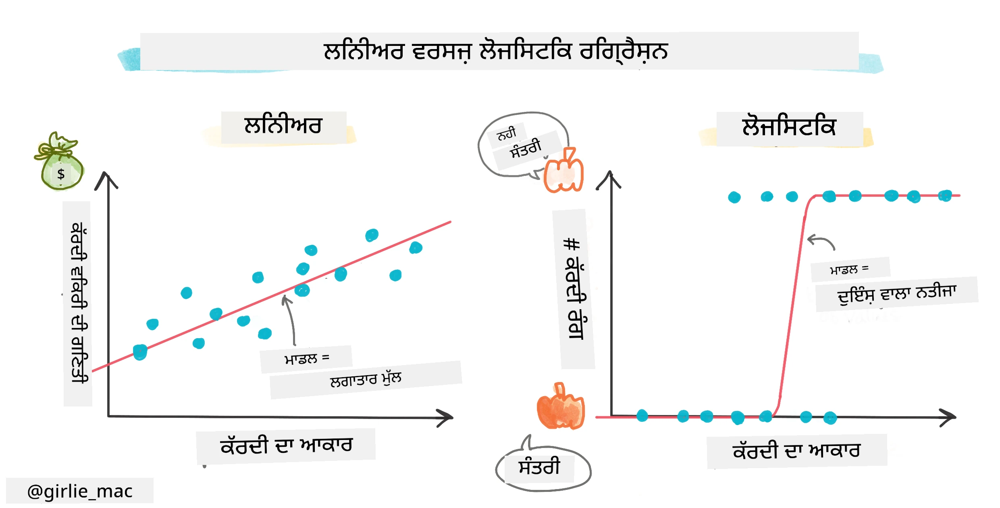
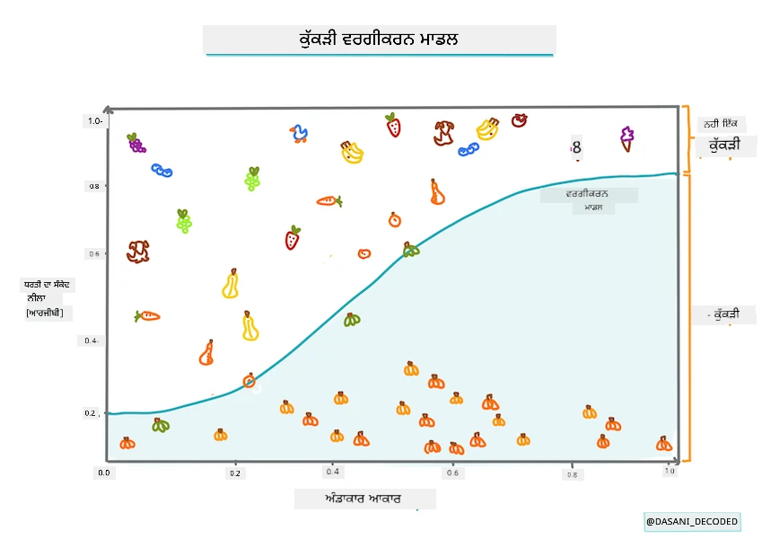
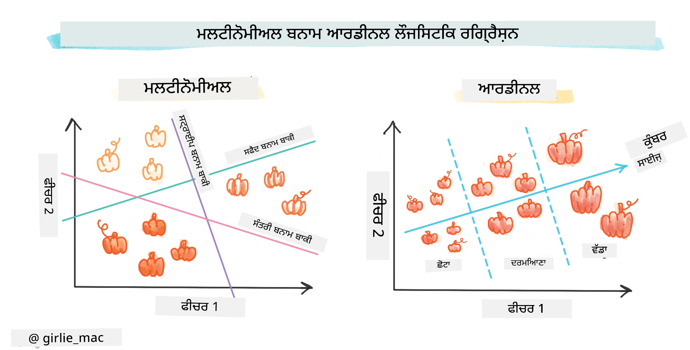
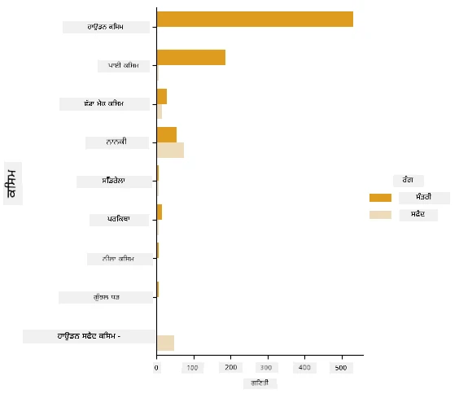
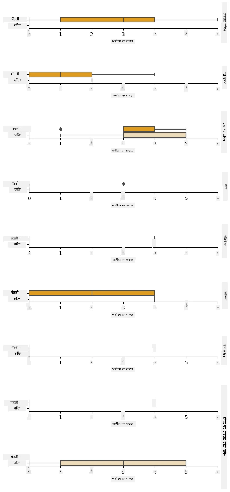
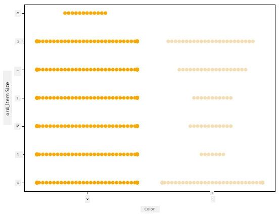
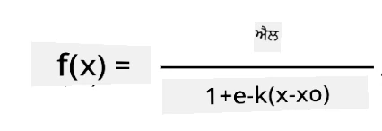
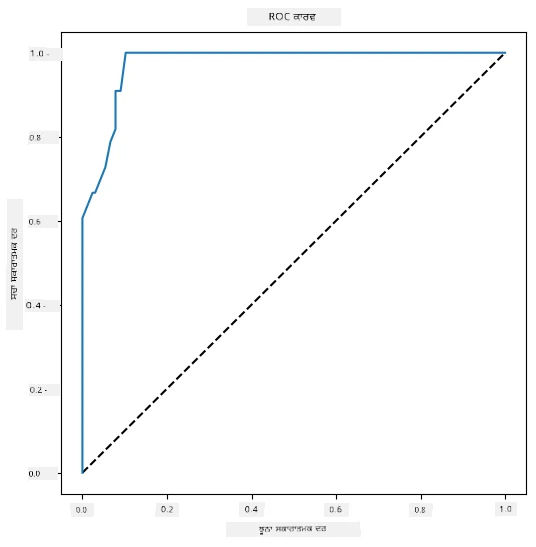

# ਸ਼੍ਰੇਣੀਆਂ ਦੀ ਭਵਿੱਖਬਾਣੀ ਲਈ ਲੋਜਿਸਟਿਕ ਰੈਗਰੈਸ਼ਨ



## [ਪ੍ਰੀ-ਲੇਕਚਰ ਕਵਿਜ਼](https://ff-quizzes.netlify.app/en/ml/)

> ### [ਇਹ ਪਾਠ R ਵਿੱਚ ਉਪਲਬਧ ਹੈ!](../../../../2-Regression/4-Logistic/solution/R/lesson_4.html)

## ਜਾਣੁ-ਪਛਾਣ

ਰੈਗਰੈਸ਼ਨ ਬਾਰੇ ਇਸ ਅਖੀਰਲੇ ਪਾਠ ਵਿੱਚ, ਜੋ ਕਿ ਇੱਕ ਮੂਲ _ਪੁਰਾਣੀ_ ਐਮਐਲ ਤਕਨੀਕ ਹੈ, ਅਸੀਂ ਲੋਜਿਸਟਿਕ ਰੈਗਰੈਸ਼ਨ ਉੱਤੇ ਨਜ਼ਰ ਮਾਰਾਂਗੇ। ਤੁਸੀਂ ਇਸ ਤਕਨੀਕ ਨੂੰ ਬਾਇਨਰੀ ਸ਼੍ਰੇਣੀਆਂ ਦੀ ਭਵਿੱਖਬਾਣੀ ਕਰਨ ਲਈ ਵਰਤੋਂਗੇ। ਕੀ ਇਹ ਮਿੱਠਾਈ ਚਾਕਲੇਟ ਹੈ ਜਾਂ ਨਹੀਂ? ਕੀ ਇਹ ਬਿਮਾਰੀ ਸੰਕਰਮਕ ਹੈ ਜਾਂ ਨਹੀਂ? ਕੀ ਇਹ ਗਾਹਕ ਇਸ ਉਤਪਾਦ ਨੂੰ ਚੁਣੇਗਾ ਜਾਂ ਨਹੀਂ?

ਇਸ ਪਾਠ ਵਿੱਚ, ਤੁਸੀਂ ਸਿੱਖੋਗੇ:

- ਡੇਟਾ ਵਿਜ਼ੂਅਲਾਈਜ਼ੇਸ਼ਨ ਲਈ ਇੱਕ ਨਵਾਂ ਲਾਇਬ੍ਰੇਰੀ
- ਲੋਜਿਸਟਿਕ ਰੈਗਰੈਸ਼ਨ ਦੀਆਂ ਤਕਨੀਕਾਂ

✅ ਇਸ [Learn module](https://docs.microsoft.com/learn/modules/train-evaluate-classification-models?WT.mc_id=academic-77952-leestott) ਵਿੱਚ ਇਸ ਤਰ੍ਹਾਂ ਦੇ ਰੈਗਰੈਸ਼ਨ ਨਾਲ ਕੰਮ ਕਰਨ ਦੀ ਆਪਣੀ ਸਮਝ ਨੂੰਗਹਿਰਾ ਕਰੋ

## ਪਹਿਲੂਕਾਇਤ

ਜਦੋਂ ਅਸੀਂ ਕੱਦੂ ਦੇ ਡੇਟਾ ਦੇ ਨਾਲ ਕੰਮ ਕਰ ਚੁੱਕੇ ਹਾਂ, ਤਾਂ ਸਾਨੂੰ ਇਸ ਨਾਲ ਸਭ ਕੁਝ ਕਾਫੀ ਜਾਣੂ ਹੈ ਕਿ ਇੱਕ ਬਾਇਨਰੀ ਸ਼੍ਰੇਣੀ ਹੈ ਜਿਸ ਨਾਲ ਅਸੀਂ ਕੰਮ ਕਰ ਸਕਦੇ ਹਾਂ: ` ਰੰਗ `।

ਆਓ ਇੱਕ ਲੋਜਿਸਟਿਕ ਰੈਗਰੈਸ਼ਨ ਮਾਡਲ ਬਣਾਈਏ ਇਹ ਅਨੁਮਾਨ ਲਗਾਉਣ ਲਈ ਕਿ ਕੁਝ ਵੈਰੀਏਬਲ ਦੇ ਆਧਾਰ 'ਤੇ, _ਕਿਸ ਰੰਗ ਦਾ ਇੱਕ ਦਿੱਤਾ ਹੋਇਆ ਕੱਦੂ ਸੰਭਾਵਿਤ ਹੈ_ (ਸੰਤਰੀ 🎃 ਜਾਂ ਸਫੈਦ 👻)।

> ਅਸੀਂ ਰੈਗਰੈਸ਼ਨ ਨਾਲ ਸੰਬੰਧਤ ਪਾਠ ਸਮੂਹ ਵਿੱਚ ਬਾਇਨਰੀ ਵਰਗੀਕਰਨ ਦੀ ਗੱਲ ਕਿਉਂ ਕਰ ਰਹੇ ਹਾਂ? ਸਿਰਫ਼ ਭਾਸ਼ਾਈ ਸਹੂਲਤ ਲਈ, ਕਿਉਂਕਿ ਲੋਜਿਸਟਿਕ ਰੈਗਰੈਸ਼ਨ [ਵਾਸਤਵ ਵਿੱਚ ਇੱਕ ਵਰਗੀਕਰਨ ਤਰੀਕਾ ਹੈ](https://scikit-learn.org/stable/modules/linear_model.html#logistic-regression), ਹਾਲਾਂਕਿ ਇਹ ਇੱਕ ਲੀਨੀਅਰ-ਆਧਾਰਿਤ ਹੈ। ਅਗਲੇ ਪਾਠ ਸਮੂਹ ਵਿੱਚ ਡੇਟਾ ਦੀ ਹੋਰ ਕਿਸ ਤਰ੍ਹਾਂ ਵਰਗੀਕਰਨ ਕਰਨੀ ਹੈ, ਇਸ ਬਾਰੇ ਜਾਣੋ।

## ਪ੍ਰਸ਼ਨ ਪਰਿਭਾਸ਼ਿਤ ਕਰੋ

ਸਾਡੇ ਉਦੇਸ਼ ਲਈ, ਅਸੀਂ ਇਸਨੂੰ ਬਾਇਨਰੀ ਰੂਪ ਵਿੱਚ ਪ੍ਰਗਟਾਵਾਂਗੇ: 'ਸਫੈਦ' ਜਾਂ 'ਸਫੈਦ ਨਹੀਂ'। ਸਾਡੇ ਡੇਟਾਸੈੱਟ ਵਿੱਚ ਇੱਕ 'ਧਾਰੀਦਾਰ' ਸ਼੍ਰੇਣੀ ਵੀ ਹੈ ਪਰ ਇਸ ਵਿੱਚ ਕੁਝ ਘਟਨਾਵਾਂ ਹਨ, ਇਸ ਲਈ ਅਸੀਂ ਇਸਨੂੰ ਵਰਤੋਂਗੇ ਨਹੀਂ। ਜੇ ਅਸੀਂ ਡੇਟਾ ਵਿੱਚੋਂ ਨੱਲ ਮੁੱਲ ਹਟਾ ਦਿੰਦੇ ਹਾਂ ਤਾਂ ਇਹ ਗੁੰਮ ਹੋ ਜਾਂਦੀ ਹੈ।

> 🎃 ਮਜ਼ੇਦਾਰ ਤੱਥ, ਅਸੀਂ ਕਈ ਵਾਰੀ ਸਫੈਦ ਕੱਦੂਆਂ ਨੂੰ 'ਭੂਤ' ਕੱਦੂ ਕਹਿੰਦੇ ਹਾਂ। ਇਹਨਾਂ ਨੂੰ ਕੱਟਣਾ ਵੱਧ ਸੌਖਾ ਨਹੀਂ ਹੁੰਦਾ, ਇਸ ਲਈ ਇਹ ਸੰਤਰੀ ਵਾਲਿਆਂ ਵਾਂਗ ਪਾਪուլਰ ਨਹੀਂ ਹਨ ਪਰ ਇਹ ਦਿੱਖ ਵਿੱਚ ਸ਼ਾਨਦਾਰ ਹੁੰਦੇ ਹਨ! ਇਸ ਲਈ ਅਸੀਂ ਆਪਣਾ ਸਵਾਲ ਮੁੜ ਬਣਾ ਸਕਦੇ ਹਾਂ: 'ਭੂਤ' ਜਾਂ 'ਭੂਤ ਨਹੀਂ'. 👻

## ਲੋਜਿਸਟਿਕ ਰੈਗਰੈਸ਼ਨ ਬਾਰੇ

ਲੋਜਿਸਟਿਕ ਰੈਗਰੈਸ਼ਨ ਕੁਝ ਅਹੰਕਾਰਪੂਰਕ ਤਰੀਕਿਆਂ ਵਿੱਚ ਲੀਨੀਅਰ ਰੈਗਰੈਸ਼ਨ ਤੋਂ ਵੱਖਰਾ ਹੈ, ਜਿਸ ਬਾਰੇ ਤੁਸੀਂ ਪਹਿਲਾਂ ਸਿੱਖਿਆ ਸੀ।

[](https://youtu.be/KpeCT6nEpBY "ਐਮਐਲ ਬੇਗਿਨਰਜ਼ ਲਈ - ਮਸ਼ੀਨ ਲਰਨਿੰਗ ਵਰਗੀਕਰਨ ਲਈ ਲੋਜਿਸਟਿਕ ਰੈਗਰੈਸ਼ਨ ਦੀ ਸਮਝ")

> 🎥 ਲੋਜਿਸਟਿਕ ਰੈਗਰੈਸ਼ਨ ਦਾ ਇੱਕ ਛੋਟਾ ਵੀਡੀਓ ਵੇਰਵਾ ਦੇਖਣ ਲਈ ਉੱਪਰ ਦਰਸਾਈ ਚਿੱਤਰ 'ਤੇ ਕਲਿੱਕ ਕਰੋ।

### ਬਾਇਨਰੀ ਵਰਗੀਕਰਨ

ਲੋਜਿਸਟਿਕ ਰੈਗਰੈਸ਼ਨ ਲੀਨੀਅਰ ਰੈਗਰੈਸ਼ਨ ਵਾਂਗੇ ਫੀਚਰਾਂ ਦਾ ਉਪਲਬਧ ਕਰਵਾਉਂਦਾ ਨਹੀਂ। ਪਹਿਲਾ ਇੱਕ ਬਾਇਨਰੀ ਸ਼੍ਰੇਣੀ ਬਾਰੇ ਅਨੁਮਾਨ ਦਿੰਦਾ ਹੈ ("ਸਫੈਦ ਜਾਂ ਸਫੈਦ ਨਹੀਂ") ਜਦਕਿ ਦੂਜਾ ਲਗਾਤਾਰ ਮੁੱਲਾਂ ਦੀ ਭਵਿੱਖਬਾਣੀ ਕਰ ਸਕਦਾ ਹੈ, ਉਦਾਹਰਨ ਵਜੋਂ ਕਿਸੇ ਕੱਦੂ ਦੇ ਮੂਲ ਅਤੇ ਕਟਾਈ ਦੇ ਸਮੇਂ ਦੇ ਆਧਾਰ 'ਤੇ, _ਉਸ ਦੀ ਕੀਮਤ ਕਿੰਨੀ ਵੱਧੇਗੀ_।


> ਇਨਫੋਗ੍ਰਾਫਿਕ ਦੁਆਰਾ [ਦਸਾਨੀ ਮਾਡੀਪੱਲੀ](https://twitter.com/dasani_decoded)

### ਹੋਰ ਵਰਗੀਕਰਨ

ਹੋਰ ਕਿਸਮਾਂ ਦੇ ਲੋਜਿਸਟਿਕ ਰੈਗਰੈਸ਼ਨ ਹਨ, ਜਿਵੇਂ ਕਿ ਮਲਟੀਨੋਮਿਯਲ ਅਤੇ ਓਰਡੀਨਲ:

- **ਮਲਟੀਨੋਮਿਯਲ**, ਜਿਸ ਵਿੱਚ ਇੱਕ ਤੋਂ ਵੱਧ ਸ਼੍ਰੇਣੀਆਂ ਹੁੰਦੀਆਂ ਹਨ - "ਸੰਤਰੀ, ਸਫੈਦ, ਅਤੇ ਧਾਰੀਦਾਰ"।
- **ਓਰਡੀਨਲ**, ਜਿਸ ਵਿੱਚ ਆਰਡਰ ਵਾਲੀਆਂ ਸ਼੍ਰੇਣੀਆਂ ਹੁੰਦੀਆਂ ਹਨ, ਜਿਹੜੀਆਂ ਸਾਨੂੰ ਸਾਡੀਆਂ ਨਤੀਜਿਆਂ ਨੂੰ ਲਾਜ਼ਮੀ ਤੌਰ 'ਤੇ ਕ੍ਰਮਵਾਰ ਕਰਨ ਵਿੱਚ ਸਹਾਇਤਾ ਦਿੰਦਾ ਹੈ, ਜਿਵੇਂ ਸਾਡੇ ਕੱਦੂ, ਜੋ ਇੱਕ ਨਿਰਧਾਰਤ ਗਿਣਤੀ ਦੀਆਂ ਸਾਈਜ਼ਾਂ (ਮੀਨੀ, ਛੋਟਾ, ਦਰਮਿਆਨਾ, ਵੱਡਾ, ਐਕਸਐਲ, ਡਬਲ ਐਕਸਐਲ) ਨਾਲ ਕ੍ਰਮਵੱਧ ਹਨ।



### ਵੈਰੀਏਬਲਾਂ ਨੂੰ ਲਾਜ਼ਮੀ ਤੌਰ 'ਤੇ ਇਕ ਦੂਜੇ ਨਾਲ ਸੰਬੰਧਿਤ ਹੋਣਾ ਜ਼ਰੂਰੀ ਨਹੀਂ

ਮਹਿਸੂਸ ਕਰੋ ਕਿ ਲੀਨੀਅਰ ਰੈਗਰੈਸ਼ਨ ਵੱਧ ਸਬੰਧਤ ਵੈਰੀਏਬਲਾਂ ਨਾਲ ਵਧੀਆ ਕੰਮ ਕਰਦਾ ਹੈ? ਲੋਜਿਸਟਿਕ ਰੈਗਰੈਸ਼ਨ ਇਸਦਾ ਉਲਟ ਹੈ - ਵੈਰੀਏਬਲਾਂ ਨੂੰ ਸਹਿਮਤ ਹੋਣ ਦੀ ਲੋੜ ਨਹੀਂ। ਇਹ ਇਸ ਡੇਟਾ ਲਈ ਚੰਗਾ ਹੈ ਜਿਸ ਵਿੱਚ ਛੋਟੀਆਂ ਕੋਰੀਲੇਸ਼ਨ ਹਨ।

### ਤੁਹਾਨੂੰ ਬਹੁਤ ਸਾਫ ਸੂਥਰਾ ਡੇਟਾ ਚਾਹੀਦਾ ਹੈ

ਜੇ ਤੁਸੀਂ ਵੱਧ ਡੇਟਾ ਵਰਤੋਂਗੇ ਤਾਂ ਲੋਜਿਸਟਿਕ ਰੈਗਰੈਸ਼ਨ ਵਧੀਆ ਨਤੀਜੇ ਦੇਵੇਗਾ; ਸਾਡਾ ਛੋਟਾ ਡੇਟਾਸੈਟ ਇਸ ਕੰਮ ਲਈ ਠੀਕ ਨਹੀਂ ਹੈ, ਇਸ ਲਈ ਇਹ ਯਾਦ ਰੱਖੋ।

[](https://youtu.be/B2X4H9vcXTs "ਐਮਐਲ ਬੇਗਿਨਰਜ਼ - ਲੋਜਿਸਟਿਕ ਰੈਗਰੈਸ਼ਨ ਲਈ ਡੇਟਾ ਵਿਸ਼ਲੇਸ਼ਣ ਅਤੇ ਤਿਆਰੀ")

> 🎥 ਲੀਨੀਅਰ ਰੈਗਰੈਸ਼ਨ ਲਈ ਡੇਟਾ ਤਿਆਰ ਕਰਨ ਬਾਰੇ ਛੋਟਾ ਵੀਡੀਓ ਵੇਖਣ ਲਈ ਉੱਪਰ ਹੇਠਾਂ ਚਿੱਤਰ 'ਤੇ ਕਲਿੱਕ ਕਰੋ

✅ ਸੋਚੋ ਕਿ ਕਿਹੜੇ ਕਿਸਮ ਦੇ ਡੇਟਾ ਲੋਜਿਸਟਿਕ ਰੈਗਰੈਸ਼ਨ ਲਈ ਅਨੁਕੂਲ ਹੋਣਗੇ

## ਅਭਿਆਸ - ਡੇਟਾ ਸਾਫ਼ ਕਰੋ

ਸਭ ਤੋਂ ਪਹਿਲਾਂ, ਡੇਟਾ ਵੱਧ ਸਾਫ਼ ਕਰੋ, ਨੱਲ ਮੁੱਲਾਂ ਨੂੰ ਹਟਾਓ ਅਤੇ ਕਈ ਕਾਲਮਾਂ ਵਿੱਚੋਂ ਕੁਝ ਕਾਲਮਾਂ ਨੂੰ ਚੁਣੋ:

1. ਹੇਠਾਂ ਦਿੱਤਾ ਕੋਡ ਸ਼ਾਮਲ ਕਰੋ:

    ```python
  
    columns_to_select = ['City Name','Package','Variety', 'Origin','Item Size', 'Color']
    pumpkins = full_pumpkins.loc[:, columns_to_select]

    pumpkins.dropna(inplace=True)
    ```

    ਤੁਸੀਂ ਹਮੇਸ਼ਾ ਆਪਣੇ ਨਵੇਂ ਡਾਟਾ ਫਰੇਮ 'ਤੇ ਇੱਕ ਨਜ਼ਰ ਮਾਰ ਸਕਦੇ ਹੋ:

    ```python
    pumpkins.info
    ```

### ਵਿਜ਼ੂਅਲਾਈਜ਼ੇਸ਼ਨ - ਵਰਗੀਕਰਨ ਪਲੌਟ

ਹੁਣ ਤੱਕ ਤੁਸੀਂ [ਸਟਾਰਟਰ ਨੋਟਬੁੱਕ](./notebook.ipynb) ਵਿੱਚ ਕੱਦੂਆਂ ਦਾ ਡੇਟਾ ਮੁੜ ਲੋਡ ਕਰ ਚੁੱਕੇ ਹੋ ਅਤੇ ਸਫਾਈ ਕੀਤੀ ਹੈ ਤਾਂ ਜੋ `Color` ਸਮੇਤ ਕੁਝ ਵੈਰੀਏਬਲਾਂ ਵਾਲਾ ਡੇਟਾਸੈੱਟ ਬਚਾ ਰਹੇ। ਆਓ ਨੋਟਬੁੱਕ ਵਿੱਚ ਇੱਕ ਵੱਖਰੀ ਲਾਇਬ੍ਰੇਰੀ [Seaborn](https://seaborn.pydata.org/index.html) ਦੀ ਵਰਤੋਂ ਕਰਕੇ ਡਾਟਾ ਫਰੇਮ ਦਾ ਉਤਪਾਦਨ ਕਰੀਏ, ਜੋ Matplotlib 'ਤੇ ਆਧਾਰਤ ਹੈ ਜੋ ਅਸੀਂ ਪਹਿਲਾਂ ਵਰਤਿਆ ਸੀ।

Seaborn ਤੁਹਾਡੇ ਡੇਟਾ ਨੂੰ ਵਿਜ਼ੂਅਲਾਈਜ਼ ਕਰਨ ਦੇ ਕੁਝ ਸੁੰਦਰ ਤਰੀਕੇ ਦਿੰਦਾ ਹੈ। ਉਦਾਹਰਨ ਵਜੋਂ, ਤੁਸੀਂ `Variety` ਅਤੇ `Color` ਹਰ ਇੱਕ ਦੀ ਡੇਟਾ ਦੀਆਂ ਵੰਡਾਂ ਦੀ ਤੁਲਨਾ ਇੱਕ ਵਰਗੀਕਰਨ ਪਲੌਟ ਵਿੱਚ ਕਰ ਸਕਦੇ ਹੋ।

1. `catplot` ਫੰਕਸ਼ਨ ਦੀ ਵਰਤੋਂ ਕਰਕੇ ਇੱਕ ਐਸਾ ਪਲੌਟ ਬਣਾਓ, ਸਾਡੇ ਕੱਦੂ ਦੇ ਡੇਟਾ `pumpkins` ਨੂੰ ਵਰਤਦੇ ਹੋਏ, ਅਤੇ ਹਰ ਇੱਕ ਕੱਦੂ ਸ਼੍ਰੇਣੀ ਲਈ ਇੱਕ ਰੰਗ ਨਕਸ਼ਾ ਦਰਸਾਉਂਦੇ ਹੋਏ (ਸੰਤਰੀ ਜਾਂ ਸਫੈਦ):

    ```python
    import seaborn as sns
    
    palette = {
    'ORANGE': 'orange',
    'WHITE': 'wheat',
    }

    sns.catplot(
    data=pumpkins, y="Variety", hue="Color", kind="count",
    palette=palette, 
    )
    ```

    

    ਡੇਟਾ ਦੇ ਨਿਰੀਖਣ ਨਾਲ, ਤੁਸੀਂ ਵੇਖ ਸਕਦੇ ਹੋ ਕਿ ਰੰਗ ਦਾ ਡੇਟਾ ਕਿਸ ਤਰ੍ਹਾਂ Variety ਨਾਲ ਸਬੰਧਿਤ ਹੈ।

    ✅ ਇਸ ਵਰਗੀਕਰਨ ਪਲੌਟ ਨੂੰ ਦੇਖਦੇ ਹੋਏ, ਤੁਸੀਂ ਕਿਹੜੀਆਂ ਦਿਲਚਸਪ ਖੋਜਾਂ ਕਾ ਸੋਚ ਸਕਦੇ ਹੋ?

### ਡੇਟਾ ਪੂਰਵ-ਪ੍ਰਕਿਰਿਆ: ਫੀਚਰ ਅਤੇ ਲੇਬਲ ਇਨਕੋਡਿੰਗ
ਸਾਡੇ ਕੱਦੂਆਂ ਦੇ ਡੇਟਾਸੈੱਟ ਵਿੱਚ ਸਾਰੇ ਕਾਲਮਾਂ ਲਈ ਸਤਰਾਂ ਦੇ ਮੁੱਲ ਹਨ। ਵਰਗੀਕਰਨ ਡੇਟਾ ਨਾਲ ਕੰਮ ਕਰਨਾ ਮਨੁੱਖਾਂ ਲਈ ਸੁਲਭ ਹੈ ਪਰ ਮਸ਼ੀਨਾਂ ਲਈ ਨਹੀਂ। ਮਸ਼ੀਨ ਲਰਨਿੰਗ ਅਲਗੋਰਿਦਮ ਨੰਬਰਾਂ ਨਾਲ ਵਧੀਆ ਕੰਮ ਕਰਦੇ ਹਨ। ਇਸ ਲਈ ਇਨਕੋਡਿੰਗ ਡੇਟਾ ਦੀ ਪੂਰਵ-ਪ੍ਰਕਿਰਿਆ ਵਿੱਚ ਬਹੁਤ ਅਹੰਕਾਰਪੂਰਕ ਕਦਮ ਹੈ, ਕਿਉਂਕਿ ਇਹ ਸਾਡੇ ਲਈ ਵਰਗੀਕਰਨ ਡੇਟਾ ਨੂੰ ਗਿਣਤੀ ਵਾਲੇ ਡੇਟਾ ਵਿੱਚ ਬਦਲਣਾ ਯਕੀਨੀ ਬਣਾਉਂਦਾ ਹੈ, ਬਿਨਾਂ ਕਿਸੇ ਜਾਣਕਾਰੀ ਨੂੰ ਗੁਆਏ। ਚੰਗੀ ਇਨਕੋਡਿੰਗ ਇੱਕ ਚੰਗਾ ਮਾਡਲ ਬਨਾਉਂਦੀ ਹੈ।

ਫੀਚਰ ਇਨਕੋਡਿੰਗ ਲਈ ਮੁੱਖ ਤੌਰ ਤੇ ਦੋ ਕਿਸਮਾਂ ਦੀਆਂ ਇਨਕੋਡਰ ਹਨ:

1. ਓਰਡੀਨਲ ਇਨਕੋਡਰ: ਇਹ ਓਰਡੀਨਲ ਵੈਰੀਏਬਲਾਂ ਲਈ ਵਧੀਆ ਹੈ, ਜੋ ਵਰਗੀਕਰਨ ਵੈਰੀਏਬਲ ਹੁੰਦੇ ਹਨ ਜਿਥੇ ਡੇਟਾ ਲਾਜ਼ਮੀ ਤੌਰ 'ਤੇ ਇਕ ਤਰਤੀਬ ਵਿੱਚ ਹੁੰਦਾ ਹੈ, ਜਿਵੇਂ ਸਾਡੇ ਡੇਟਾਸੈੱਟ ਵਿੱਚ `Item Size` ਕਾਲਮ। ਇਹ ਐਸਾ ਮੈਪਿੰਗ ਬਣਾਉਂਦਾ ਹੈ ਕਿ ਹਰ ਸ਼੍ਰੇਣੀ ਨੂੰ ਇੱਕ ਨੰਬਰ ਨਾਲ ਦਰਸਾਇਆ ਜਾਵੇ, ਜੋ ਉਸ ਕਾਲਮ ਵਿੱਚ ਸ਼੍ਰੇਣੀ ਦੀ ਕ੍ਰਮਬੱਧਤਾ ਹੈ।

    ```python
    from sklearn.preprocessing import OrdinalEncoder

    item_size_categories = [['sml', 'med', 'med-lge', 'lge', 'xlge', 'jbo', 'exjbo']]
    ordinal_features = ['Item Size']
    ordinal_encoder = OrdinalEncoder(categories=item_size_categories)
    ```

2. ਵਰਗੀਕਰਨ ਇਨਕੋਡਰ: ਇਹ ਨਾਮਮਾਤਰ ਵੈਰੀਏਬਲਾਂ ਲਈ ਵਧੀਆ ਹੈ, ਜੋ ਕੋਈ ਲਾਜ਼ਮੀ ਤਰਤੀਬ ਨਹੀਂ ਰੱਖਦੇ, ਜਿਵੇਂ ਸਾਡੇ ਡੇਟਾਸੈੱਟ ਵਿੱਚ `Item Size` ਤੋਂ ਵੱਖਰੇ ਫੀਚਰ। ਇਹ ਇੱਕ-ਹੌਟ ਇਨਕੋਡਿੰਗ ਹੈ, ਜਿਸਦਾ ਮਤਲਬ ਹੈ ਕਿ ਹਰ ਸ਼੍ਰੇਣੀ ਇੱਕ ਬਾਈਨਰੀ ਕਾਲਮ ਨਾਲ ਦਰਸਾਈ ਜਾਂਦੀ ਹੈ: ਇਨਕੋਡ ਕੀਤੀ ਵੈਰੀਏਬਲ 1 ਹੁੰਦੀ ਹੈ ਜੇ ਕੱਦੂ ਉਸ Variety ਨਾਲ ਸਬੰਧਤ ਹੈ ਅਤੇ 0 ਹੋਰਥੇ।

    ```python
    from sklearn.preprocessing import OneHotEncoder

    categorical_features = ['City Name', 'Package', 'Variety', 'Origin']
    categorical_encoder = OneHotEncoder(sparse_output=False)
    ```
ਫਿਰ, `ColumnTransformer` ਦਾ ਇਸਤੇਮਾਲ ਇੱਕ ਕਦਮ ਵਿੱਚ ਕਈ ਇਨਕੋਡਰਾਂ ਨੂੰ ਜੋੜਨ ਅਤੇ ਉਚਿਤ ਕਾਲਮਾਂ 'ਤੇ ਲਾਗੂ ਕਰਨ ਲਈ ਕੀਤਾ ਜਾਂਦਾ ਹੈ।

```python
    from sklearn.compose import ColumnTransformer
    
    ct = ColumnTransformer(transformers=[
        ('ord', ordinal_encoder, ordinal_features),
        ('cat', categorical_encoder, categorical_features)
        ])
    
    ct.set_output(transform='pandas')
    encoded_features = ct.fit_transform(pumpkins)
```
ਦੂਜੇ ਪਾਸੇ, ਲੇਬਲ ਇਨਕੋਡ ਕਰਨ ਲਈ ਅਸੀਂ ਸਕਾਈਟ-ਲਰਨ ਦਾ `LabelEncoder` ਕਲਾਸ ਵਰਤਦੇ ਹਾਂ, ਜੋ ਕਿ ਇੱਕ ਸਹੂਲਤ ਕਲਾਸ ਹੈ ਜੋ ਲੇਬਲਾਂ ਨੂੰ ਇੱਕ-ਸਧਾਰਣ ਰੂਪ ਵਿੱਚ ਨਿੱਥਾਰਤ ਕਰ ਸਕਦਾ ਹੈ ਜਿਵੇਂ ਕਿ ਉਹ ਸਿਰਫ਼ 0 ਤੋਂ n_classes-1 (ਇੱਥੇ, 0 ਅਤੇ 1) ਦੇ ਦਰਮਿਆਨ ਮੁੱਲ ਰੱਖਦੇ ਹਨ।

```python
    from sklearn.preprocessing import LabelEncoder

    label_encoder = LabelEncoder()
    encoded_label = label_encoder.fit_transform(pumpkins['Color'])
```
ਜਦੋਂ ਅਸੀਂ ਫੀਚਰ ਅਤੇ ਲੇਬਲ ਨੂੰ ਇਨਕੋਡ ਕਰ ਲੈਂਦੇ ਹਾਂ, ਅਸੀਂ ਉਨ੍ਹਾਂ ਨੂੰ ਇੱਕ ਨਵੇਂ ਡੇਟਾ ਫਰੇਮ `encoded_pumpkins` ਵਿਚ ਜੋੜ ਸਕਦੇ ਹਾਂ।

```python
    encoded_pumpkins = encoded_features.assign(Color=encoded_label)
```
✅ `Item Size` ਕਾਲਮ ਲਈ ਓਰਡੀਨਲ ਇਨਕੋਡਰ ਵਰਤਣ ਦੇ ਕੀ ਫਾਇਦੇ ਹਨ?

### ਵੈਰੀਏਬਲਾਂ ਵਿਚਕਾਰ ਸੰਬੰਧਾਂ ਦਾ ਵਿਸ਼ਲੇਸ਼ਣ ਕਰੋ

ਹੁਣ ਜਦੋਂ ਅਸੀਂ ਆਪਣੇ ਡੇਟਾ ਦੀ ਪੂਰਵ-ਪ੍ਰਕਿਰਿਆ ਕਰ ਲਈ ਹੈ, ਅਸੀਂ ਫੀਚਰਾਂ ਅਤੇ ਲੇਬਲ ਦੇ ਸੰਬੰਧਾਂ ਦਾ ਵਿਸ਼ਲੇਸ਼ਣ ਕਰ ਸਕਦੇ ਹਾਂ ਤਾਂ ਜੋ ਇਹ ਸਮਝ ਬਣਾ ਸਕੀਏ ਕਿ ਮਾਡਲ ਫੀਚਰਾਂ ਦੇ ਆਧਾਰ 'ਤੇ ਲੇਬਲ ਦੀ ਭਵਿੱਖਬਾਣੀ ਕਿੰਨੀ ਵਧੀਆ ਕਰ ਸਕਦਾ ਹੈ।
ਇਸ ਕਿਸਮ ਦੇ ਵਿਸ਼ਲੇਸ਼ਣ ਲਈ ਸਭ ਤੋਂ ਵਧੀਆ ਤਰੀਕਾ ਹੈ ਡੇਟਾ ਨੂੰ ਪਲੌਟ ਕਰਨਾ। ਅਸੀਂ ਫਿਰ ਤੋਂ Seaborn ਦਾ `catplot` ਫੰਕਸ਼ਨ ਵਰਤਾਂਗੇ, `Item Size`, `Variety` ਅਤੇ `Color` ਵਿਚਕਾਰ ਸੰਬੰਧਾਂ ਨੂੰ ਇੱਕ ਵਰਗੀਕਰਨ ਪਲੌਟ ਵਿੱਚ ਵੇਖਣ ਲਈ। ਡੇਟਾ ਨੂੰ ਬਿਹਤਰ ਪਲੌਟ ਕਰਨ ਲਈ ਅਸੀਂ ਇਨਕੋਡ ਕੀਤਾ ਹੋਇਆ `Item Size` ਕਾਲਮ ਅਤੇ ਅਣਇਨਕੋਡ ਕੀਤਾ ਹੋਇਆ `Variety` ਕਾਲਮ ਵਰਤਾਂਗੇ।

```python
    palette = {
    'ORANGE': 'orange',
    'WHITE': 'wheat',
    }
    pumpkins['Item Size'] = encoded_pumpkins['ord__Item Size']

    g = sns.catplot(
        data=pumpkins,
        x="Item Size", y="Color", row='Variety',
        kind="box", orient="h",
        sharex=False, margin_titles=True,
        height=1.8, aspect=4, palette=palette,
    )
    g.set(xlabel="Item Size", ylabel="").set(xlim=(0,6))
    g.set_titles(row_template="{row_name}")
```


### ਇੱਕ ਸਵਾਰਮ ਪਲੌਟ ਵਰਤੋਂ

ਜਿਵੇਂ ਕਿ Color ਇੱਕ ਬਾਇਨਰੀ ਸ਼੍ਰੇਣੀ ਹੈ (ਸਫੈਦ ਜਾਂ ਨਹੀਂ), ਇਸਨੂੰ ਵਿਜ਼ੂਅਲਾਈਜ਼ ਕਰਨ ਲਈ 'ਵਿਸ਼ੇਸ਼ ਤਰੀਕੇ' ਦੀ ਜ਼ਰੂਰਤ ਹੁੰਦੀ ਹੈ। ਇਸ ਸ਼੍ਰੇਣੀ ਦੇ ਹੋਰ ਵੈਰੀਏਬਲਾਂ ਨਾਲ ਸੰਬੰਧਾਂ ਨੂੰ ਵੇਖਣ ਦੇ ਹੋਰ ਤਰੀਕਿਆਂ ਵੀ ਹਨ।

ਤੁਸੀਂ Seaborn ਪਲੌਟਾਂ ਨਾਲ ਵੈਰੀਏਬਲਾਂ ਨੂੰ ਇਕੱਠੇ ਵੇਖਾ ਸਕਦੇ ਹੋ।

1. ਕਦਰਾਂ ਦੇ ਵਿਤਰਨ ਨੂੰ ਦਿਖਾਉਣ ਲਈ ਇੱਕ 'ਸਵਾਰਮ' ਪਲੌਟ ਬਣਾਓ:

    ```python
    palette = {
    0: 'orange',
    1: 'wheat'
    }
    sns.swarmplot(x="Color", y="ord__Item Size", data=encoded_pumpkins, palette=palette)
    ```

    

**ਸਾਵਧਾਨ**: ਉਪਰੋਕਤ ਕੋਡ ਇੱਕ ਚੇਤਾਵਨੀ ਦੇ ਸਕਦਾ ਹੈ, ਕਿਉਂਕਿ seaborn ਇੰਨੀ ਵੱਡੀ ਸੰਖਿਆ ਵਿੱਚ ਡੇਟਾਪਾਇੰਟ ਨੂੰ ਸਵਾਰਮ ਪਲੌਟ ਵਿੱਚ ਦਰਸਾਉਣ ਵਿੱਚ ਅਸਫਲ ਹੁੰਦਾ ਹੈ। ਇੱਕ ਸੰਭਾਵਿਤ ਹੱਲ ਨਿਸ਼ਾਨ ਦੇ ਆਕਾਰ ਨੂੰ ਕੱਟਣਾ ਹੈ, 'size' ਪੈਰਾਮੀਟਰ ਦੀ ਵਰਤੋਂ ਕਰਕੇ। ਪਰ ਧਿਆਨ ਰੱਖੋ ਜੋ ਇਸ ਦਾ ਪ੍ਰਭਾਵ ਪਲੌਟ ਦੀ ਪੜ੍ਹਨਯੋਗਤਾ 'ਤੇ ਪੈਂਦਾ ਹੈ।


> **🧮 ਮੈਥਮੈਟਿਕਸ ਦਿਖਾਓ**
>
> ਲੋਜਿਸਟਿਕ ਰੈਗਰੈਸ਼ਨ 'ਜ਼ਿਆਦਾ ਸੰਭਾਵਨਾਵਾਂ' ਦੇ ਸੰਕਲਪ ਤੇ ਆਧਾਰਿਤ ਹੈ ਅਤੇ ਇਸ ਵਿੱਚ [ਸਿਗਮਾਇਡ ਫੰਕਸ਼ਨਾਂ](https://wikipedia.org/wiki/Sigmoid_function) ਦਾ ਇਸਤੇਮਾਲ ਹੁੰਦਾ ਹੈ। ਇੱਕ 'ਸਿਗਮਾਇਡ ਫੰਕਸ਼ਨ' ਪਲੌਟ 'ਤੇ ਇੱਕ 'S' ਆਕਾਰ ਵਾਂਗ਼ ਦਿੱਖਦਾ ਹੈ। ਇਹ ਮੁੱਲ ਲੈਂਦਾ ਹੈ ਅਤੇ ਉਸ ਨੂੰ 0 ਅਤੇ 1 ਦੇ ਵਿਚਕਾਰ ਨਕਸ਼ਾ ਬਣਾਉਂਦਾ ਹੈ। ਇਸ ਦੀ ਵਕ੍ਰਤਾ ਨੂੰ 'ਲੋਜਿਸਟਿਕ ਕ੍ਰਿਵ' ਵੀ ਕਹਿੰਦੇ ਹਨ। ਇਸਦਾ ਫਾਰਮੂਲਾ ਇਸ ਤਰ੍ਹਾਂ ਹੈ:
>
> 
>
> ਜਿੱਥੇ ਸਿਗਮਾਇਡ ਦਾ ਮਿਡਪੌਇੰਟ x ਦੇ 0 ਬਿੰਦੂ ਤੇ ਹੁੰਦਾ ਹੈ, L ਕ੍ਰਿਵ ਦੀ ਵੱਧ ਤੋਂ ਵੱਧ ਮੁੱਲ ਹੈ, ਅਤੇ k ਕ੍ਰਿਵ ਦੀ ਤੇਜ਼ੀ ਹੈ। ਜੇ ਫੰਕਸ਼ਨ ਦਾ ਨਤੀਜਾ 0.5 ਤੋਂ ਵੱਧ ਹੈ, ਤਾਂ ਪ੍ਰਸ਼ਨ ਵਾਲੇ ਲੇਬਲ ਨੂੰ ਬਾਇਨਰੀ ਚੋਣ ਦੀ '1' ਕਲਾਸ ਦਿੱਤੀ ਜਾਵੇਗੀ। ਨਹੀਂ ਤਾਂ, ਇਸਨੂੰ '0' ਵਜੋਂ ਵਰਗੀਕ੍ਰਿਤ ਕੀਤਾ ਜਾਵੇਗਾ।

## ਆਪਣਾ ਮਾਡਲ ਬਣਾਓ

ਸਕਾਈਟ-ਲਰਨ ਵਿਚ ਇਹ ਬਾਇਨਰੀ ਵਰਗੀਕਰਨ ਲੱਭਣ ਲਈ ਮਾਡਲ ਬਣਾਉਣਾ ਹੈਰਾਨ ਕਰਨ ਵਾਲਾ ਤੌਰ 'ਤੇ ਸਿੱਧਾ ਹੈ।

[](https://youtu.be/MmZS2otPrQ8 "ਐਮਐਲ ਬੇਗਿਨਰਜ਼ - ਡੇਟਾ ਦੀ ਵਰਗੀਕਰਨ ਲਈ ਲੋਜਿਸਟਿਕ ਰੈਗਰੈਸ਼ਨ")

> 🎥 ਲੀਨੀਅਰ ਰੈਗਰੈਸ਼ਨ ਮਾਡਲ ਬਣਾਉਣ ਦੇ ਛੋਟੇ ਵੀਡੀਓ ਸਮੀਖਿਆ ਲਈ ਉੱਪਰ ਦਰਸਾਈ ਚਿੱਤਰ 'ਤੇ ਕਲਿੱਕ ਕਰੋ

1. ਆਪਣੇ ਵਰਗੀਕਰਨ ਮਾਡਲ ਵਿੱਚ ਵਰਤਣ ਲਈ ਵੈਰੀਏਬਲ ਚੁਣੋ ਅਤੇ `train_test_split()` ਕਾਲ ਕਰਕੇ ਟ੍ਰੇਨਿੰਗ ਅਤੇ ਟੈਸਟ ਸੈੱਟ ਵੰਡੋ:

    ```python
    from sklearn.model_selection import train_test_split
    
    X = encoded_pumpkins[encoded_pumpkins.columns.difference(['Color'])]
    y = encoded_pumpkins['Color']

    X_train, X_test, y_train, y_test = train_test_split(X, y, test_size=0.2, random_state=0)
    
    ```

2. ਹੁਣ ਤੁਸੀਂ `fit()` ਕਾਲ ਕਰਕੇ ਆਪਣੇ ਟ੍ਰੇਨਿੰਗ ਡੇਟਾ ਨਾਲ ਮਾਡਲ ਟ੍ਰੇਨ ਕਰ ਸਕਦੇ ਹੋ ਅਤੇ ਇਸਦਾ ਨਤੀਜਾ ਪ੍ਰਿੰਟ ਕਰ ਸਕਦੇ ਹੋ:

    ```python
    from sklearn.metrics import f1_score, classification_report 
    from sklearn.linear_model import LogisticRegression

    model = LogisticRegression()
    model.fit(X_train, y_train)
    predictions = model.predict(X_test)

    print(classification_report(y_test, predictions))
    print('Predicted labels: ', predictions)
    print('F1-score: ', f1_score(y_test, predictions))
    ```

    ਆਪਣੇ ਮਾਡਲ ਦਾ ਸਕੋਰਬੋਰਡ ਦੇਖੋ। ਇਹ ਬੁਰੀ ਗੱਲ ਨਹੀਂ ਹੈ, ਧਿਆਨ ਵਿੱਚ ਰੱਖਦੇ ਹੋਏ ਕਿ ਤੁਹਾਡੇ ਕੋਲ صرف ਲਗਭਗ 1000 ਕਤਾਰਾਂ ਦਾ ਡੇਟਾ ਹੈ:

    ```output
                       precision    recall  f1-score   support
    
                    0       0.94      0.98      0.96       166
                    1       0.85      0.67      0.75        33
    
        accuracy                                0.92       199
        macro avg           0.89      0.82      0.85       199
        weighted avg        0.92      0.92      0.92       199
    
        Predicted labels:  [0 0 0 0 0 0 0 0 0 0 0 0 0 0 0 0 0 0 0 0 1 0 0 1 0 0 0 0 0 0 0 0 1 0 0 0 0
        0 0 0 0 0 1 0 1 0 0 1 0 0 0 0 0 1 0 1 0 1 0 1 0 0 0 0 0 0 0 0 0 0 0 0 0 0
        1 0 0 0 0 0 0 0 1 0 0 0 0 0 0 0 1 0 0 0 0 0 0 0 0 1 0 1 0 0 0 0 0 0 0 1 0
        0 0 0 0 0 0 0 0 0 0 0 0 0 0 0 0 0 0 0 0 0 1 0 0 0 0 0 0 0 0 1 0 0 0 1 1 0
        0 0 0 0 1 0 0 0 0 0 1 0 0 0 0 0 0 0 0 0 0 0 0 0 0 0 0 0 0 0 0 0 0 0 0 0 1
        0 0 0 1 0 0 0 0 0 0 0 0 1 1]
        F1-score:  0.7457627118644068
    ```

## ਇਕਨੁਭਵ ਮੈਟ੍ਰਿਕਸ ਰਾਹੀਂ ਬੇਹਤਰ ਸਮਝ

ਜਦੋਂ ਤੁਸੀਂ [terms](https://scikit-learn.org/stable/modules/generated/sklearn.metrics.classification_report.html?highlight=classification_report#sklearn.metrics.classification_report) ਪ੍ਰਿੰਟ ਕਰਕੇ ਸਕੋਰਬੋਰਡ ਰਿਪੋਰਟ ਪ੍ਰਾਪਤ ਕਰ ਸਕਦੇ ਹੋ, ਤਾਂ ਤੁਸੀਂ ਆਪਣੇ ਮਾਡਲ ਦੀ ਕਾਰਗੁਜ਼ਾਰੀ ਨੂੰ ਬਿਹਤਰ ਸਮਝਣ ਲਈ ਇੱਕ [ਕਨਫਿਊਜ਼ਨ ਮੈਟ੍ਰਿਕਸ](https://scikit-learn.org/stable/modules/model_evaluation.html#confusion-matrix) ਦੀ ਵਰਤੋਂ ਕਰ ਸਕਦੇ ਹੋ।

> 🎓 ਇੱਕ '[ਕਨਫਿਊਜ਼ਨ ਮੈਟ੍ਰਿਕਸ](https://wikipedia.org/wiki/Confusion_matrix)' (ਜਾਂ 'ਐਰਰ ਮੈਟ੍ਰਿਕਸ') ਇਕ ਸਾਰਣੀ ਹੁੰਦੀ ਹੈ ਜੋ ਤੁਹਾਡੇ ਮਾਡਲ ਦੇ ਸੱਚੇ ਅਤੇ ਗਲਤ ਪੋਜ਼ੀਟਿਵ ਅਤੇ ਨੇਗੇਟਿਵ ਪ੍ਰਦਰਸ਼ਿਤ ਕਰਦੀ ਹੈ, ਇਸ ਤਰ੍ਹਾਂ ਭਵਿੱਖਬਾਣੀਆਂ ਦੀ ਯਥਾਰਥਤਾ ਨੂੰ ਅੰਕਿਤ ਕਰਦੀ ਹੈ।

1. ਕਨਫਿਊਜ਼ਨ ਮੈਟ੍ਰਿਕਸ ਵਰਤਣ ਲਈ, `confusion_matrix()` ਕਾਲ ਕਰੋ:

    ```python
    from sklearn.metrics import confusion_matrix
    confusion_matrix(y_test, predictions)
    ```

    ਆਪਣੇ ਮਾਡਲ ਦੀ ਕਨਫਿਊਜ਼ਨ ਮੈਟ੍ਰਿਕਸ ਦੇਖੋ:

    ```output
    array([[162,   4],
           [ 11,  22]])
    ```

ਸਕਾਈਟ-ਲਰਨ ਵਿੱਚ, ਕਨਫਿਊਜ਼ਨ ਮੈਟ੍ਰਿਕਸ ਰੋਜ਼ (ਅਕਸ 0) ਅਸਲੀ ਲੇਬਲ ਹਨ ਅਤੇ ਕਾਲਮ (ਅਕਸ 1) ਅਨੁਮਾਨਿਤ ਲੇਬਲ ਹਨ।

|       |   0   |   1   |
| :---: | :---: | :---: |
|   0   |  TN   |  FP   |
|   1   |  FN   |  TP   |

ਇੱਥੇ ਕੀ ਹੋ ਰਿਹਾ ਹੈ? ਚਲੋ ਕਹੀਏ ਸਾਡਾ ਮਾਡਲ ਕੱਦੂਆਂ ਨੂੰ ਦੋ ਬਾਇਨਰੀ ਸ਼੍ਰੇਣੀਆਂ ਵਿੱਚ ਵੰਡਣ ਲਈ ਪੁੱਛਿਆ ਗਿਆ ਹੈ, ਸ਼੍ਰੇਣੀ 'ਸਫੈਦ' ਅਤੇ ਸ਼੍ਰੇਣੀ 'ਸਫੈਦ-ਨਹੀਂ'।

- ਜੇ ਤੁਹਾਡਾ ਮਾਡਲ ਕੱਦੂ ਨੂੰ ਸਫੈਦ ਨਾ ਕਹਿੰਦਾ ਹੈ ਅਤੇ ਉਹ ਅਸਲ ਵਿੱਚ 'ਸਫੈਦ-ਨਹੀਂ' ਸ਼੍ਰੇਣੀ ਵਿੱਚ ਆਉਂਦਾ ਹੈ ਤਾਂ ਅਸੀਂ ਇਸਨੂੰ ਸੱਚਾ ਨਕਾਰਾਤਮਕ ਕਹਿੰਦੇ ਹਾਂ, ਜੋ ਸਿਖਰਲੇ ਖੱਬੇ ਨੰਬਰ ਨਾਲ ਦਰਸਾਇਆ ਗਿਆ ਹੈ।
- ਜੇ ਤੁਹਾਡਾ ਮਾਡਲ ਕੱਦੂ ਨੂੰ ਸਫੈਦ ਕਹਿੰਦਾ ਹੈ ਅਤੇ ਉਹ ਅਸਲ ਵਿੱਚ 'ਸਫੈਦ-ਨਹੀਂ' ਸ਼੍ਰੇਣੀ ਵਿੱਚ ਆਉਂਦਾ ਹੈ ਤਾਂ ਅਸੀਂ ਇਸਨੂੰ ਗਲਤ ਨਕਾਰਾਤਮਕ ਕਹਿੰਦੇ ਹਾਂ, ਜੋ ਹੇਠਲੇ ਖੱਬੇ ਨੰਬਰ ਨਾਲ ਦਰਸਾਇਆ ਗਿਆ ਹੈ।
- ਜੇ ਤੁਹਾਡਾ ਮਾਡਲ ਕੱਦੂ ਨੂੰ ਸਫੈਦ ਨਾ ਕਹਿੰਦਾ ਹੈ ਅਤੇ ਉਹ ਅਸਲ ਵਿੱਚ 'ਸਫੈਦ' ਸ਼੍ਰੇਣੀ ਵਿੱਚ ਆਉਂਦਾ ਹੈ ਤਾਂ ਅਸੀਂ ਇਸਨੂੰ ਗਲਤ ਸਕਾਰਾਤਮਕ ਕਹਿੰਦੇ ਹਾਂ, ਜੋ ਸਿਖਰਲੇ ਸੱਜੇ ਨੰਬਰ ਨਾਲ ਦਰਸਾਇਆ ਗਿਆ ਹੈ।
- ਜੇ ਤੁਹਾਡਾ ਮਾਡਲ ਕੱਦੂ ਨੂੰ ਸਫੈਦ ਕਹਿੰਦਾ ਹੈ ਅਤੇ ਉਹ ਅਸਲ ਵਿੱਚ 'ਸਫੈਦ' ਸ਼੍ਰੇਣੀ ਵਿੱਚ ਆਉਂਦਾ ਹੈ ਤਾਂ ਅਸੀਂ ਇਸਨੂੰ ਸੱਚਾ ਸਕਾਰਾਤਮਕ ਕਹਿੰਦੇ ਹਾਂ, ਜੋ ਹੇਠਲੇ ਸੱਜੇ ਨੰਬਰ ਨਾਲ ਦਰਸਾਇਆ ਗਿਆ ਹੈ।


ਜਿਵੇਂ ਤੁਸੀਂ ਸ਼ਾਇਦ ਅਨੁਮਾਨ ਲਗਾਇਆ ਹੋਵੇਗਾ, ਇਹ ਚੰਗਾ ਹੈ ਕਿ ਸੱਚੇ ਸਕਾਰਾਤਮਕਾਂ ਅਤੇ ਸੱਚੇ ਨਕਾਰਾਤਮਕਾਂ ਦੀ ਗਿਣਤੀ ਵੱਧ ਹੋਵੇ ਅਤੇ ਗਲਤ ਸਕਾਰਾਤਮਕਾਂ ਅਤੇ ਗਲਤ ਨਕਾਰਾਤਮਕਾਂ ਦੀ ਗਿਣਤੀ ਘੱਟ ਹੋਵੇ, ਜਿਹੜਾ ਮਾਡਲ ਦੇ ਬਿਹਤਰ ਹੋਣ ਦਾ ਸੂਚਕ ਹੁੰਦਾ ਹੈ।

ਗਲਤਫਹਮੀ ਮੈਟ੍ਰਿਕਸ PRECISION ਅਤੇ RECALL ਨਾਲ ਕਿਵੇਂ ਸੰਬੰਧਿਤ ਹੈ? ਯਾਦ ਰੱਖੋ, ਉਪਰ ਦਿੱਤੇ ਗਏ ਵਰਗੀਕਰਨ ਰਿਪੋਰਟ ਵਿੱਚ PRECISION (0.85) ਅਤੇ RECALL (0.67) ਦਰਸਾਇਆ ਗਿਆ ਸੀ।

Precision = tp / (tp + fp) = 22 / (22 + 4) = 0.8461538461538461

Recall = tp / (tp + fn) = 22 / (22 + 11) = 0.6666666666666666

✅ ਪ੍ਰਸ਼ਨ: ਗਲਤਫਹਮੀ ਮੈਟ੍ਰਿਕਸ ਮੁਤਾਬਕ, ਮਾਡਲ ਕਿਵੇਂ ਕੀਤਾ? ਜਵਾਬ: ਬੁਰਾ ਨਹੀਂ; ਸੱਚੇ ਨਕਾਰਾਤਮਕਾਂ ਦੀ ਵਧੀਆ ਗਿਣਤੀ ਹੈ ਪਰ ਕੁਝ ਗਲਤ ਨਕਾਰਾਤਮਕ ਵੀ ਹਨ।

ਆਓ ਫਿਰ ਉਸ ਸ਼ਬਦਾਵਲੀ ਨੂੰ ਮੁੜ ਵੇਖੀਏ ਜੋ ਅਸੀਂ ਪਹਿਲਾਂ ਗਲਤਫਹਮੀ ਮੈਟ੍ਰਿਕਸ ਦੇ TP/TN ਅਤੇ FP/FN ਨਾਲ ਦੇਖੀ ਸੀ:

🎓 Precision: TP/(TP + FP) ਪ੍ਰਾਪਤ ਕੀਤੀਆਂ ਘਟਨਾਵਾਂ ਵਿੱਚੋਂ ਸੰਬੰਧਿਤ ਘਟਨਾਵਾਂ ਦਾ ਅਨੁਪਾਤ (ਉਦਾਹਰਨ ਵਜੋਂ, ਜਿਹੜੇ ਲੇਬਲ ਚੰਗੇ ਤਰੀਕੇ ਨਾਲ ਲੇਬਲ ਕੀਤੇ ਗਏ)

🎓 Recall: TP/(TP + FN) ਸੰਬੰਧਿਤ ਘਟਨਾਵਾਂ ਵਿੱਚੋਂ ਜਿਹੜੀਆਂ ਪ੍ਰਾਪਤ ਕੀਤੀਆਂ ਗਈਆਂ ਹਨ, ਚਾਹੇ ਚੰਗੇ ਤਰੀਕੇ ਨਾਲ ਲੇਬਲ ਕੀਤੀਆਂ ਹੋਣ ਜਾਂ ਨਾ ਹੋਣ

🎓 f1-score: (2 * precision * recall)/(precision + recall) ਪ੍ਰਿਸਿਜ਼ਨ ਅਤੇ ਰੀਕਾਲ ਦਾ ਭਾਰਿਤ ਮਿਆਰੀਕਰਨ, 1 ਸਭ ਤੋਂ ਵਧੀਆ ਅਤੇ 0 ਸਭ ਤੋਂ ਠੀਕ ਨਹੀਂ

🎓 Support: ਪ੍ਰਾਪਤ ਕੀਤੇ ਗਏ ਹਰ ਲੇਬਲ ਦੀ ਘਟਨਾ ਦੀ ਗਿਣਤੀ

🎓 Accuracy: (TP + TN)/(TP + TN + FP + FN) ਨਮੂਨੇ ਲਈ ਸਹੀ ਤਰੀਕੇ ਨਾਲ ਭਵਿੱਖਵਾਣੀ ਕੀਤੇ ਗਏ ਲੇਬਲਾਂ ਦਾ ਪ੍ਰਤੀਸ਼ਤ।

🎓 Macro Avg: ਹਰ ਲੇਬਲ ਲਈ ਬਿਨਾ ਵਜ਼ਨ ਵਾਲੇ ਗਣਨਾ ਮਿਆਰ, ਲੇਬਲ ਅਸੰਤੁਲਨ ਨੂੰ ਧਿਆਨ ਵਿੱਚ ਨਾ ਲੈਂਦੇ ਹੋਏ।

🎓 Weighted Avg: ਹਰ ਲੇਬਲ ਲਈ ਮਿਆਰ ਮਾਪਦਾ ਹੈ, ਜਿਸ ਵਿੱਚ ਲੇਬਲ ਅਸੰਤੁਲਨ ਨੂੰ ਧਿਆਨ ਵਿੱਚ ਰੱਖ ਕੇ ਤਿੰਨਦੇ ਸਹਾਇਤਾ (ਸੱਚੇ ਘਟਨਾਵਾਂ ਦੀ ਗਿਣਤੀ) ਨਾਲ ਭਾਰ ਦਿੱਤਾ ਜਾਂਦਾ ਹੈ।

✅ ਕੀ ਤੁਸੀਂ ਸੋਚ ਸਕਦੇ ਹੋ ਕਿ ਤੁਹਾਡੇ ਮਾਡਲ ਨੂੰ ਗਲਤ ਨਕਾਰਾਤਮਕਾਂ ਦੀ ਗਿਣਤੀ ਘਟਾਉਣ ਲਈ ਕਿਹੜਾ ਮਾਪ ਵਖੇੜਨਾ ਚਾਹੀਦਾ ਹੈ?

## ਇਸ ਮਾਡਲ ਦੀ ROC ਕਰਵ ਨੂੰ ਵੇਖੋ

[](https://youtu.be/GApO575jTA0 "ML for beginners - Analyzing Logistic Regression Performance with ROC Curves")

> 🎥 ਉਪਰ ਦੀ ਤਸਵੀਰ 'ਤੇ ਕਲਿੱਕ ਕਰੋ ROC ਕਰਵਾਂ ਦੀ ਇੱਕ ਛੋਟੀ ਵੀਡੀਓ ਜਾਣਕਾਰੀ ਲਈ

ਆਓ ਅਸੀਂ ਇਕ ਹੋਰ ਵਿਜ਼ੂਅਲਾਈਜ਼ੇਸ਼ਨ ਕਰੀਏ ਜਿਸਨੂੰ 'ROC' ਕਰਵ ਕਹਿੰਦੇ ਹਨ:

```python
from sklearn.metrics import roc_curve, roc_auc_score
import matplotlib
import matplotlib.pyplot as plt
%matplotlib inline

y_scores = model.predict_proba(X_test)
fpr, tpr, thresholds = roc_curve(y_test, y_scores[:,1])

fig = plt.figure(figsize=(6, 6))
plt.plot([0, 1], [0, 1], 'k--')
plt.plot(fpr, tpr)
plt.xlabel('False Positive Rate')
plt.ylabel('True Positive Rate')
plt.title('ROC Curve')
plt.show()
```

Matplotlib ਦੀ ਵਰਤੋਂ ਕਰਕੇ, ਮਾਡਲ ਦੀ [Receiving Operating Characteristic](https://scikit-learn.org/stable/auto_examples/model_selection/plot_roc.html?highlight=roc) ਜਾਂ ROC ਨੂੰ ਨਕਸ਼ਾ ਬਣਾਓ। ROC ਕਰਵਾਂ ਆਮ ਤੌਰ ਤੇ ਕਲਾਸੀਫਾਇਰ ਦੇ ਆਉਟਪੁੱਟ ਨੂੰ ਸੱਚੇ ਵਿਰੁੱਧ ਗਲਤ ਸਕਾਰਾਤਮਕ ਦੇ ਤੌਰ 'ਤੇ ਵੇਖਣ ਲਈ ਵਰਤੀਆਂ ਜਾਂਦੀਆਂ ਹਨ। "ROC ਕਰਵਾਂ ਵਿੱਚ ਆਮ ਤੌਰ ਤੇ Y ਅಕ್ಷ ਤੇ ਸੱਚੇ ਸਕਾਰਾਤਮਕ ਦਰ ਅਤੇ X ਅक्ष ਤੇ ਗਲਤ ਸਕਾਰਾਤਮਕ ਦਰ ਹੁੰਦੀ ਹੈ।" ਇਸ ਲਈ, ਕਰਵ ਦੀ ਖੜਕ ਜਾਂ ਸੰਕੇਤ ਅਤੇ ਮਧ્યਬਿੰਦੂ ਰੇਖਾ ਅਤੇ ਕਰਵ ਵਿਚਕਾਰ ਦੀ ਜਗ੍ਹਾ ਮੱਤਵਪੂਰਣ ਹੈ: ਤੁਸੀਂ ਚਾਹੁੰਦੇ ਹੋ ਕਿ ਕਰਵ ਜਲਦੀ ਉੱਪਰ ਵੱਲ ਜਾਂਦੀ ਹੋਵੇ ਅਤੇ ਲਾਈਨ ਤੋਂ ਉੱਪਰ ਚੱਲ ਜਾਵੇ। ਸਾਡੇ ਮਾਮਲੇ ਵਿੱਚ, ਸ਼ੁਰੂ ਵਿੱਚ ਗਲਤ ਸਕਾਰਾਤਮਕ ਹਨ, ਪਰ ਫਿਰ ਲਾਈਨ ਠੀਕ ਢੰਗ ਨਾਲ ਉੱਪਰ ਵੱਲ ਜਾਂਦੀ ਹੈ:



ਆਖ਼ਰੀ ਤੌਰ 'ਤੇ, Scikit-learn ਦੀ [`roc_auc_score` API](https://scikit-learn.org/stable/modules/generated/sklearn.metrics.roc_auc_score.html?highlight=roc_auc#sklearn.metrics.roc_auc_score) ਦੀ ਵਰਤੋਂ ਕਰਕੇ ਅਸਲ 'Area Under the Curve' (AUC) ਕੈਲਕੁਲੇਟ ਕਰੋ:

```python
auc = roc_auc_score(y_test,y_scores[:,1])
print(auc)
```
ਨਤੀਜਾ ਹੈ `0.9749908725812341`। ਕਿਉਂਕਿ AUC ਦੀ ਰੇਂਜ 0 ਤੋਂ 1 ਹੈ, ਤੁਸੀਂ ਵੱਡਾ ਸਕੋਰ ਚਾਹੁੰਦੇ ਹੋ, ਕਿਉਂਕਿ ਇੱਕ ਮਾਡਲ ਜੋ ਆਪਣੀਆਂ ਭਵਿੱਖਵਾਣੀਆਂ ਵਿੱਚ 100% ਠੀਕ ਹੁੰਦਾ ਹੈ ਉਸਦਾ AUC 1 ਹੋਵੇਗਾ; ਇਸ ਮਾਮਲੇ ਵਿੱਚ, ਮਾਡਲ _ਕਾਫ਼ੀ ਵਧੀਆ_ ਹੈ।

ਭਵਿੱਖ ਦੇ ਵਰਗਾਂ ਵਿੱਚ ਤੁਸੀਂ ਸਿੱਖੋਗੇ ਕਿ ਆਪਣੇ ਮਾਡਲ ਦੇ ਸਕੋਰ ਨੂੰ ਬਿਹਤਰ ਬਣਾਉਣ ਲਈ ਕਿਵੇਂ ਵਾਰੰ-ਵਾਰ ਬਦਲਾਅ ਕਰਨਾ ਹੈ। ਪਰ ਇਸ ਸਮੇਂ ਲਈ, ਵਧਾਈਆਂ! ਤੁਸੀਂ ਇਹ ਰਿਗ੍ਰੈਸ਼ਨ ਪਰਛੇ ਪੂਰੇ ਕਰ ਲਏ ਹਨ!

---
## 🚀ਚੈਲੈਂਜ

ਲਾਜਿਸਟਿਕ ਰਿਗ੍ਰੈਸ਼ਨ ਬਾਰੇ ਹੋਰ ਵੀ ਕਾਫੀ ਕੁਝ ਹੈ ਜਾਣਨ ਲਈ! ਪਰ ਸਿਖਣ ਦਾ ਸਭ ਤੋਂ ਵਧੀਆ ਤਰੀਕਾ ਤਜਰਬਾ ਕਰਨਾ ਹੈ। ਕੋਈ ਐਸਾ ਡੇਟਾਸੇਟ ਲੱਭੋ ਜੋ ਇਸ ਪ੍ਰਕਾਰ ਦੀ ਵਿਸ਼ਲੇਸ਼ਣ ਲਈ ਢੁਕਵੀਂ ਹੋਵੇ ਅਤੇ ਇਸ ਨਾਲ ਇੱਕ ਮਾਡਲ ਬਣਾਓ। ਤੁਸੀਂ ਕੀ ਸਿੱਖਦੇ ਹੋ? ਸੁਝਾਅ: ਰੁਚਿਕਰ ਡੇਟਾਸੇਟਾਂ ਲਈ [Kaggle](https://www.kaggle.com/search?q=logistic+regression+datasets) ਨੂੰ ਕੋਸ਼ਿਸ਼ ਕਰੋ।

## [ਪਾਠ-ਪੂਰਤੀ ਕਵਿਜ਼](https://ff-quizzes.netlify.app/en/ml/)

## ਸਮੀਖਿਆ ਅਤੇ ਸਵੈ ਅਧਿਐਨ

ਇਸ [ਸਟੈਨਫੋਰਡ ਪੇਪਰ](https://web.stanford.edu/~jurafsky/slp3/5.pdf) ਦਾ ਪਹਿਲਾ ਕੁਝ ਪੰਨੇ ਪੜ੍ਹੋ ਜੋ ਲਾਜਿਸਟਿਕ ਰਿਗ੍ਰੈਸ਼ਨ ਦੇ ਕੁਝ ਅਮਲੀ ਉਪਯੋਗਾਂ ਬਾਰੇ ਹੈ। ਕਿਸ ਕਿਸਮ ਦੇ ਕੰਮ ਉਨ੍ਹਾਂ ਵਿਚੋਂ ਕਿਹੜੇ ਲਾਜਿਸਟਿਕ ਰਿਗ੍ਰੈਸ਼ਨ ਕੰਮਾਂ ਲਈ ਜ਼ਿਆਦਾ ਉਚਿਤ ਹਨ, ਇਸ ਬਾਰੇ ਸੋਚੋ ਜੋ ਅਸੀਂ ਹੁਣ ਤੱਕ ਅਧਿਐਨ ਕੀਤੇ ਹਨ। ਸਭ ਤੋਂ ਵਧੀਆ ਕੀ ਕੰਮ ਕਰੇਗਾ?

## ਅਸਾਈਨਮੈਂਟ

[ਇਸ ਰਿਗ੍ਰੈਸ਼ਨ ਨੂੰ ਦੁਬਾਰਾ ਕੋਸ਼ਿਸ਼ ਕਰਨਾ](assignment.md)

---

<!-- CO-OP TRANSLATOR DISCLAIMER START -->
**ਅਸਵੀਕਾਰੋਪਣ**:
ਇਸ ਦਸਤਾਵੇਜ਼ ਦਾ ਅਨੁਵਾਦ ਏਆਈ ਅਨੁਵਾਦ ਸੇਵਾ [Co-op Translator](https://github.com/Azure/co-op-translator) ਦੀ ਵਰਤੋਂ ਕਰਕੇ ਕੀਤਾ ਗਿਆ ਹੈ। ਜਦੋਂ ਕਿ ਅਸੀਂ ਸਹੀਤਾਵਾਂ ਲਈ ਯਤਨਸ਼ੀਲ ਹਾਂ, ਕਿਰਪਾ ਕਰਕੇ ਧਿਆਨ ਰੱਖੋ ਕਿ ਸਵੈਚਾਲਿਤ ਅਨੁਵਾਦਾਂ ਵਿੱਚ ਗਲਤੀਆਂ ਜਾਂ ਅਸਮੱਤਿਆਵਾਂ ਹੋ ਸਕਦੀਆਂ ਹਨ। ਮੂਲ ਦਸਤਾਵੇਜ਼ ਆਪਣੀ ਮੂਲ ਭਾਸ਼ਾ ਵਿੱਚ ਅਧਿਕਾਰਕ ਸਰੋਤ ਮੰਨਿਆ ਜਾਣਾ ਚਾਹੀਦਾ ਹੈ। ਜਰੂਰੀ ਜਾਣਕਾਰੀ ਲਈ, ਪੇਸ਼ੇਵਰ ਮਨੁੱਖੀ ਅਨੁਵਾਦ ਦੀ ਸਿਫ਼ਾਰਸ਼ ਕੀਤੀ ਜਾਂਦੀ ਹੈ। ਅਸੀਂ ਇਸ ਅਨੁਵਾਦ ਦੇ ਉਪਯੋਗ ਤੋਂ ਪੈਦਾ ਹੋਣ ਵਾਲੀਆਂ ਕਿਸੇ ਵੀ ਗਲਤਫਹਿਮੀਆਂ ਜਾਂ ਗਲਤ ਵਿਆਖਿਆਵਾਂ ਲਈ ਜਵਾਬਦੇਹ ਨਹੀਂ ਹਾਂ।
<!-- CO-OP TRANSLATOR DISCLAIMER END -->