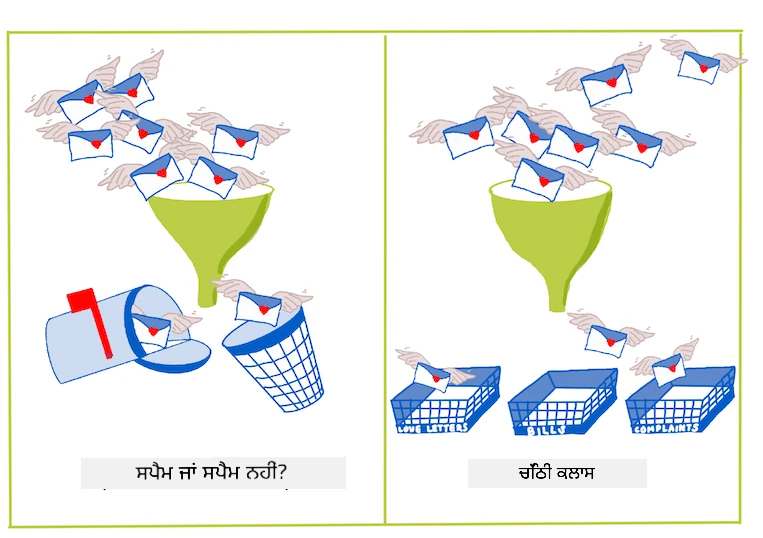
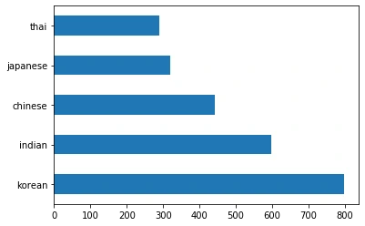
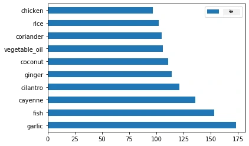
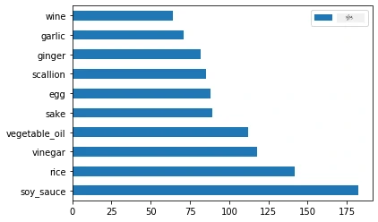
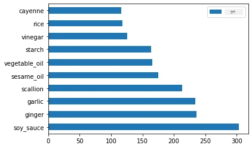
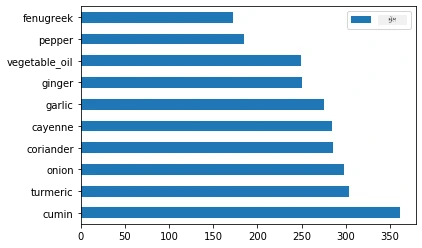
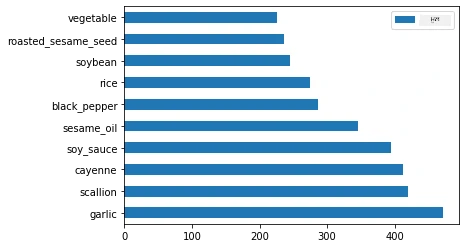

# ਵਰਗੀਕਰਨ ਦਾ ਪਰਿਚਯ  

ਇਸ ਚਾਰ ਪਾਠਾਂ ਵਿੱਚ, ਤੁਸੀਂ ਕਲਾਸਿਕ ਮਸ਼ੀਨ ਲਰਨਿੰਗ ਦੇ ਇੱਕ ਮੂਲ ਧਿਆਨ - _ਵਰਗੀਕਰਨ_ ਨੂੰ ਖੋਜੋਗੇ। ਅਸੀਂ ਏਸ਼ੀਆ ਅਤੇ ਭਾਰਤ ਦੇ ਸਾਰੇ ਸ਼ਾਨਦਾਰ ਪਾਕਸ਼ਾਲਾਂ ਬਾਰੇ ਡੇਟਾਸੈੱਟ ਨਾਲ ਵੱਖ-ਵੱਖ ਵਰਗੀਕਰਨ ਐਲਗੋਰਿਦਮਾਂ ਦੀ ਵਰਤੋਂ ਕਰਾਂਗੇ। ਉਮੀਦ ਹੈ ਤੁਸੀਂ ਭੁੱਖੇ ਹੋ!  

  

> ਇਨ੍ਹਾਂ ਪਾਠਾਂ ਵਿੱਚ ਪੈਨ-ਐਸ਼ੀਅਨ ਪਾਕਵਿਧੀਆਂ ਦਾ ਜਸ਼ਨ ਮਨਾਓ! ਚਿੱਤਰ [Jen Looper](https://twitter.com/jenlooper) ਵੱਲੋਂ  

ਵਰਗੀਕਰਨ ਇੱਕ ਤਰ੍ਹਾਂ ਦੀ [ਸੁਪਰਵਾਈਜ਼ਡ ਲਰਨਿੰਗ](https://wikipedia.org/wiki/Supervised_learning) ਹੈ ਜੋ ਰਿਗ੍ਰੈਸ਼ਨ ਤਕਨੀਕਾਂ ਨਾਲ ਕਾਫੀ ਮਿਲਦੀ-ਜੁਲਦੀ ਹੈ। ਜੇ ਮਸ਼ੀਨ ਲਰਨਿੰਗ ਡੇਟਾਸੈੱਟ ਦੀ ਵਰਤੋਂ ਨਾਲ ਚੀਜ਼ਾਂ ਦੇ ਮੁੱਲ ਜਾਂ ਨਾਮਾਂ ਦੀ ਭਵਿੱਖਬਾਣੀ ਕਰਨ ਬਾਰੇ ਹੈ, ਤਾਂ ਵਰਗੀਕਰਨ ਆਮ ਤੌਰ 'ਤੇ ਦੋ ਸਮੂਹਾਂ ਵਿੱਚ ਵੰਡਿਆ ਜਾਂਦਾ ਹੈ: _ਬਾਈਨਰੀ ਵਰਗੀਕਰਨ_ ਅਤੇ _ਮਲਟੀਕਲਾਸ ਵਰਗੀਕਰਨ_।  

[](https://youtu.be/eg8DJYwdMyg "ਵਰਗੀਕਰਨ ਦਾ ਪਰਿਚਯ")  

> 🎥 ਵਡੀਚਿੱਤਰ ਤੇ ਕਲਿੱਕ ਕਰੋ: MIT ਦੇ ਜੌਨ ਗੱਟੈਗ ਮਸ਼ੀਨ ਲਰਨਿੰਗ ਦਾ ਪਰਿਚਯ ਕਰਵਾਉਂਦੇ ਹਨ  

ਯਾਦ ਰੱਖੋ:  

- **ਲੀਨੀਅਰ ਰਿਗ੍ਰੈਸ਼ਨ** ਤੁਹਾਡੇ ਨੂੰ ਵੈਰੀਏਬਲਾਂ ਵਿਚਕਾਰ ਸੰਬੰਧਾਂ ਦੀ ਭਵਿੱਖਬਾਣੀ ਕਰਨ ਵਿੱਚ ਮਦਦ ਕਰਦਾ ਹੈ ਅਤੇ ਦੱਸਦਾ ਹੈ ਕਿ ਕੋਈ ਨਵਾਂ ਡੇਟਾਪੌਇੰਟ ਕਿੱਥੇ ਪਵੇਗਾ। ਉਦਾਹਰਨ ਵਜੋਂ, ਤੁਸੀਂ ਇਹ ਅੰਦਾਜ਼ਾ ਲਗਾ ਸਕਦੇ ਹੋ _ਕਿੱਤਨਾ ਕਦੂ ਦਾ ਭਾਅ ਸਤੰਬਰ ਵੱਲੋਂ ਦਸੰਬਰ ਤਕ ਹੋਵੇਗਾ_।  
- **ਲੌਜਿਸਟਿਕ ਰਿਗ੍ਰੈਸ਼ਨ** ਤੁਹਾਨੂੰ "ਬਾਈਨਰੀ ਸ਼੍ਰੇਣੀਆਂ" ਖੋਜਣ 'ਚ ਮਦਦ ਕਰਦਾ ਹੈ: ਇਸ ਮੁੱਲ ਤੇ, _ਕੀ ਇਹ ਕਦੂ ਸੰਤਰੀ ਰੰਗ ਦਾ ਹੈ ਜਾਂ ਨਹੀਂ_?  

ਵਰਗੀਕਰਨ ਵੱਖ-ਵੱਖ ਐਲਗੋਰਿਦਮ ਵਰਤਦਾ ਹੈ ਡੇਟਾ ਪੁਆਇੰਟ ਦੇ ਲੇਬਲ ਜਾਂ ਕਲਾਸ ਦਾ ਦਰਜਾ ਤੈਅ ਕਰਨ ਲਈ। ਆਓ ਇਸ ਪਾਕਸ਼ਾਲਾ ਡੇਟਾ ਨਾਲ ਕੰਮ ਕਰੀਏ ਅਤੇ ਵੇਖੀਏ ਕਿ ਕੁਝ ਸਮੱਗਰੀ ਦੇ ਸਮੂਹ ਨੂੰ ਦੇਖ ਕੇ ਅਸੀਂ ਉਸ ਦੇ ਪਾਕਸ਼ਾਲਾ ਦਾ ਪਤਾ ਲਗਾ ਸਕਦੇ ਹਾਂ ਜਾਂ ਨਹੀਂ।  

## [ਪੂਰਵ-ਦਰਸਨ ਪ੍ਰਸ਼ਨਾਵਲੀ](https://ff-quizzes.netlify.app/en/ml/)  

> ### [ਇਹ ਪਾਠ R ਵਿੱਚ ਵੀ ਉਪਲਬਧ ਹੈ!](../../../../4-Classification/1-Introduction/solution/R/lesson_10.html)  

### ਪਰਿਚਯ  

ਵਰਗੀਕਰਨ ਮਸ਼ੀਨ ਲਰਨਿੰਗ ਖੋਜਕਾਰ ਅਤੇ ਡੇਟਾ ਵਿਗਿਆਨੀ ਦੀਆਂ ਮੂਲ ਭੂਮਿਕਾਵਾਂ ਵਿੱਚੋਂ ਇੱਕ ਹੈ। ਬੁਨਿਆਦੀ ਵਰਗੀਕਰਨ, ਜਿਵੇਂ "ਕੀ ਇਹ ਈਮੇਲ ਸਪੈਮ ਹੈ ਜਾਂ ਨਹੀਂ?", ਤੋਂ ਲੈ ਕੇ ਕੰਪਿਊਟਰ ਵਿਜ਼ਨ ਦੀ ਵਰਤੋਂ ਨਾਲ ਜਟਿਲ ਚਿੱਤਰ ਵਰਗੀਕਰਨ ਅਤੇ ਵਿਭਾਜਨ ਤੱਕ, ਡੇਟਾ ਨੂੰ ਕਲਾਸਾਂ ਵਿੱਚ ਵੰਡਣ ਅਤੇ ਉਸ ਵਿੱਚੋਂ ਸਵਾਲ ਪੁੱਛਣ ਵਿਚ ਸਦਾ ਮਦਦਗਾਰ ਹੁੰਦਾ ਹੈ।  

ਇਸ ਪ੍ਰਕਿਰਿਆ ਨੂੰ ਵਿਗਿਆਨਕ ਤਰੀਕੇ ਨਾਲ ਕਹਿਣ ਤੇ, ਤੁਹਾਡਾ ਵਰਗੀਕਰਨ ਤਰੀਕਾ ਇੱਕ ਭਵਿੱਖਬਾਣੀ ਮਾਡਲ ਬਣਾਉਂਦਾ ਹੈ ਜੋ ਇਨਪੁਟ ਵੈਰੀਏਬਲਾਂ ਅਤੇ ਆਉਟਪੁਟ ਵੈਰੀਏਬਲਾਂ ਵਿਚਕਾਰ ਸੰਬੰਧ ਬਣਾਉਂਦਾ ਹੈ।  

  

> ਬਾਈਨਰੀ ਵर्सਸ ਮਲਟੀਕਲਾਸ ਸਮੱਸਿਆਵਾਂ ਜੋ ਵਰਗੀਕਰਨ ਐਲਗੋਰਿਦਮਾਂ ਨੂੰ ਸਾਰੇ ਕਰਨੀਆਂ ਪੈਂਦੀਆਂ ਹਨ। ਜਾਣਕਾਰੀ ਕਲਾਕਾਰ [Jen Looper](https://twitter.com/jenlooper)  

ਡੇਟਾ ਸਾਫ਼ ਕਰਨ, ਵਿਜ਼ੁਅਲਾਈਜ਼ ਕਰਨ ਅਤੇ ਆਪਣੇ ML ਕੰਮਾਂ ਲਈ ਤੈਅ ਕਰਨ ਦੀ ਪ੍ਰਕਿਰਿਆ ਸ਼ੁਰੂ ਕਰਨ ਤੋਂ ਪਹਿਲਾਂ, ਆਓ ਮਸ਼ੀਨ ਲਰਨਿੰਗ ਦੁਆਰਾ ਵਰਗੀਕਰਨ ਕਰਨ ਦੇ ਵੱਖ-ਵੱਖ ਤਰੀਕਿਆਂ ਬਾਰੇ ਕੁਝ ਜਾਣਕਾਰੀ ਪ੍ਰਾਪਤ ਕਰੀਏ।  

[ਸੰਖਿਆਕੀ ਵਿਗਿਆਨ](https://wikipedia.org/wiki/Statistical_classification) ਤੋਂ ਲਿਆ ਗਿਆ, ਕਲਾਸਿਕ ਮਸ਼ੀਨ ਲਰਨਿੰਗ ਵਿੱਚ ਵਰਗੀਕਰਨ `smoker`, `weight`, ਅਤੇ `age` ਵਰਗੇ ਫੀਚਰਾਂ ਦੀ ਵਰਤੋਂ ਕਰਦਾ ਹੈ ਤਾ ਕਿ _ਕਿਸੇ ਵਾਇਰਸ ਜਾਂ ਬੀਮਾਰੀ ਦਾ ਹੋਣ ਦਾ ਸੰਭਾਵਨਾ_ ਦਰਜ ਕੀਤੀ ਜਾ ਸਕੇ। ਜਿਵੇਂ ਤੁਸੀਂ ਪਹਿਲਾਂ ਕੀਤੇ ਰਿਗ੍ਰੈਸ਼ਨ ਅਭਿਆਸਾਂ ਵਿੱਚ ਵਾਂਗ, ਤੁਹਾਡੇ ਡੇਟਾ ਨੂੰ ਲੇਬਲ ਕੀਤਾ ਹੁੰਦਾ ਹੈ ਅਤੇ ML ਐਲਗੋਰਿਦਮ ਉਹਨਾਂ ਲੇਬਲਾਂ ਨੂੰ ਵਰਤ ਕੇ ਡੇਟਾਸੈੱਟ ਦੇ ਕਲਾਸ (ਜਾਂ 'ਫੀਚਰ') ਦੀ ਭਵਿੱਖਬਾਣੀ ਕਰਦੇ ਹਨ ਅਤੇ ਉਨ੍ਹਾਂ ਨੂੰ ਇੱਕ ਸਮੂਹ ਜਾਂ ਨਤੀਜੇ ਵਿੱਚ ਵੰਡਦੇ ਹਨ।  

✅ ਇੱਕ ਡੇਟਾਸੈੱਟ ਬਾਰੇ ਸੋਚੋ ਜੋ ਪਾਕਸ਼ਾਲਾਂ ਬਾਰੇ ਹੈ। ਮਲਟੀਕਲਾਸ ਮਾਡਲ ਕਿਸ ਕਿਸਮ ਦੇ ਸਵਾਲਾਂ ਦੇ ਜਵਾਬ ਦੇ ਸਕਦਾ ਹੈ? ਬਾਈਨਰੀ ਮਾਡਲ ਕਿਸ ਕਿਸਮ ਦੇ ਸਵਾਲਾਂ ਦੇ ਜਵਾਬ ਦੇ ਸਕਦਾ ਹੈ? ਜੇ ਤੁਸੀਂ ਜਾਣਨਾ ਚਾਹੁੰਦੇ ਕਿ ਕੋਈ ਦਿੱਤੀ ਗਈ ਪਾਕਸ਼ਾਲਾ ਵਿੱਚ ਮੇਥਾ ਵਰਤੀ ਜਾਂਦੀ ਹੈ? ਜੇ ਤੁਹਾਡੇ ਕੋਲ ਸਿਤਾਰੇ ਦੀਆਂ ਫੁੱਲਾਂ, ਆਰਟਿਚੋਕ, ਫੁੱਲਗੋਭੀ ਅਤੇ ਅੱਜਮੋਦ ਵਾਲੇ ਗ੍ਰੋਸਰੀ ਬੈਗ ਦਾ ਹਾਜ਼ਰੀ ਹੈ, ਤਾਂ ਕੀ ਤੁਸੀਂ ਮੁਲ੍ਹਾਂ ਭਾਰਤੀ ਵਿਆੰਜਨ ਬਣਾ ਸਕਦੇ ਹੋ?  

[](https://youtu.be/GuTeDbaNoEU "ਪਾਗਲ ਰਹੱਸਮਈ ਟੋਕਰੀਆਂ")  

> 🎥 ਉਪਰ ਦਿੱਤੇ ਚਿੱਤਰ ‘ਤੇ ਕਲਿੱਕ ਕਰੋ: ਸ਼ੋਅ 'ਚੌਪਡ' ਦਾ ਮੁੱਖ ਵਿਚਾਰ 'ਰਹੱਸਮਈ ਟੋਕਰੀ' ਹੈ ਜਿੱਥੇ ਕਿਸ਼ਨੀਆਂ ਨੂੰ ਬਿਨਾਂ ਚੁਣੇ ਸਮੱਗਰੀ ਵਿੱਚੋਂ ਇੱਕ ਵਿਆੰਜਨ ਬਨਾਉਣਾ ਪੈਂਦਾ ਹੈ। ਜ਼ਰੂਰ ML ਮਾਡਲ ਮਦਦਗਾਰ ਹੁੰਦਾ!  

## ਹੈਲੋ 'ਵਰਗੀਕਰਨਕਾਰ'  

ਅਸੀਂ ਇਸ ਪਾਕਸ਼ਾਲਾ ਡੇਟਾ ਸੈੱਟ ਤੋਂ ਪੁੱਛਣਾ ਚਾਹੁੰਦੇ ਹਾਂ ਇੱਕ **ਮਲਟੀਕਲਾਸ ਸਵਾਲ**, ਕਿਉਂਕਿ ਸਾਡੇ ਕੋਲ ਕਈ ਸੰਭਾਵਿਤ ਰਾਸ਼ਟਰੀ ਪਾਕਸ਼ਾਲਾਂ ਹਨ। ਦਿੱਤੀਆਂ ਸਮੱਗਰੀ ਦੇ ਸਮੂਹ ਨਾਲ, ਡੇਟਾ ਕਿਹੜੀ ਕਲਾਸ ਵਿੱਚ ਫਿੱਟ ਹੋਵੇਗਾ?  

Scikit-learn ਵੱਖ-ਵੱਖ ਐਲਗੋਰਿਦਮ ਮੁਹੱਈਆ ਕਰਵਾਉਂਦਾ ਹੈ ਜੋ ਤੁਸੀਂ ਹੱਲ ਕਰਨ ਵਾਲੀ ਸਮੱਸਿਆ ਦੇ ਅਨੁਸਾਰ ਵਰਤ ਸਕਦੇ ਹੋ। ਅਗਲੇ ਦੋ ਪਾਠਾਂ ਵਿੱਚ, ਤੁਸੀਂ ਕਈ ਐਲਗੋਰਿਦਮਾਂ ਬਾਰੇ ਜਾਣੋਗੇ।  

## ਅਭਿਆਸ - ਆਪਣਾ ਡੇਟਾ ਸਾਫ ਅਤੇ ਸੰਤੁਲਿਤ ਕਰੋ  

ਇਸ ਪ੍ਰੋਜੈਕਟ ਸ਼ੁਰੂ ਕਰਨ ਤੋਂ ਪਹਿਲਾਂ ਪਹਿਲਾ ਕੰਮ ਤੁਹਾਡੇ ਡੇਟਾ ਨੂੰ ਸਾਫ ਅਤੇ **ਸੰਤੁਲਿਤ** ਕਰਨਾ ਹੈ ਤਾਂ ਜੋ ਬਿਹਤਰ ਨਤੀਜੇ ਮਿਲ ਸਕਣ। ਇਸ ਫੋਲਡਰ ਦੇ ਮੂਲ ਵਿੱਚ ਖਾਲੀ _notebook.ipynb_ ਫਾਇਲ ਨਾਲ ਸ਼ੁਰੂ ਕਰੋ।  

ਸਭ ਤੋਂ ਪਹਿਲਾਂ ਜਿਹੜੀ ਚੀਜ਼ ਇੰਸਟਾਲ ਕਰਨੀ ਹੈ ਉਹ ਹੈ [imblearn](https://imbalanced-learn.org/stable/). ਇਹ Scikit-learn ਪੈਕੇਜ ਹੈ ਜੋ ਤੁਹਾਡੇ ਡੇਟਾ ਨੂੰ ਬਿਹਤਰ ਤਰ੍ਹਾਂ ਸੰਤੁਲਿਤ ਕਰਨ ਲਈ ਵਰਤੀ ਜਾਵੇਗੀ (ਤੁਸੀਂ ਇਸ ਕੰਮ ਬਾਰੇ ਹਾਲ ਹੀ ਵਿੱਚ ਹੋਰ ਜਾਣੋਗੇ)।  

1. `imblearn` ਇੰਸਟਾਲ ਕਰਨ ਲਈ `pip install` ਚਲਾਓ, ਇਸ ਤਰ੍ਹਾਂ:  

    ```python
    pip install imblearn
    ```
  
1. ਉਹ ਪੈਕੇਜ ਜਿਨ੍ਹਾਂ ਦੀ ਲੋੜ ਹੈ ਜਿਨ੍ਹਾਂ ਨਾਲ ਤੁਸੀਂ ਡੇਟਾ ਇੰਪੋਰਟ ਕਰ ਸਕਦੇ ਹੋ ਅਤੇ ਵਿਜੁਅਲਾਈਜ਼ ਕਰ ਸਕਦੇ ਹੋ, ਉਹ ਇੰਪੋਰਟ ਕਰੋ, ਨਾਲ ਹੀ `SMOTE` ਨੂੰ `imblearn` ਤੋਂ ਇੰਪੋਰਟ ਕਰੋ।  

    ```python
    import pandas as pd
    import matplotlib.pyplot as plt
    import matplotlib as mpl
    import numpy as np
    from imblearn.over_sampling import SMOTE
    ```
  
    ਹੁਣ ਤੁਸੀਂ ਡੇਟਾ ਅਗਲੇ ਕਦਮ ਲਈ ਇੰਪੋਰਟ ਕਰਨ ਲਈ ਤਿਆਰ ਹੋ।  

1. ਅਗਲਾ ਕੰਮ ਡੇਟਾ ਇੰਪੋਰਟ ਕਰਨਾ ਹੈ:  

    ```python
    df  = pd.read_csv('../data/cuisines.csv')
    ```
  
   `read_csv()` ਵਰਤੋਂ ਕਰ ਕੇ _cusines.csv_ ਫਾਇਲ ਦਾ ਸਮੱਗਰੀ ਪੜ੍ਹਿਆ ਜਾਂਦਾ ਹੈ ਅਤੇ ਇਹ `df` ਵਰੀਏਬਲ ਵਿੱਚ ਰੱਖ ਦਿੱਤਾ ਜਾਂਦਾ ਹੈ।  

1. ਡੇਟਾ ਦਾ ਆਕਾਰ (shape) ਚੈਕ ਕਰੋ:  

    ```python
    df.head()
    ```
  
   ਪਹਿਲੀਆਂ ਪੰਜ ਸਤਰਾਂ ਇਹਨਾਂ ਜਿਹੀਆਂ ਹਨ:  

    ```output
    |     | Unnamed: 0 | cuisine | almond | angelica | anise | anise_seed | apple | apple_brandy | apricot | armagnac | ... | whiskey | white_bread | white_wine | whole_grain_wheat_flour | wine | wood | yam | yeast | yogurt | zucchini |
    | --- | ---------- | ------- | ------ | -------- | ----- | ---------- | ----- | ------------ | ------- | -------- | --- | ------- | ----------- | ---------- | ----------------------- | ---- | ---- | --- | ----- | ------ | -------- |
    | 0   | 65         | indian  | 0      | 0        | 0     | 0          | 0     | 0            | 0       | 0        | ... | 0       | 0           | 0          | 0                       | 0    | 0    | 0   | 0     | 0      | 0        |
    | 1   | 66         | indian  | 1      | 0        | 0     | 0          | 0     | 0            | 0       | 0        | ... | 0       | 0           | 0          | 0                       | 0    | 0    | 0   | 0     | 0      | 0        |
    | 2   | 67         | indian  | 0      | 0        | 0     | 0          | 0     | 0            | 0       | 0        | ... | 0       | 0           | 0          | 0                       | 0    | 0    | 0   | 0     | 0      | 0        |
    | 3   | 68         | indian  | 0      | 0        | 0     | 0          | 0     | 0            | 0       | 0        | ... | 0       | 0           | 0          | 0                       | 0    | 0    | 0   | 0     | 0      | 0        |
    | 4   | 69         | indian  | 0      | 0        | 0     | 0          | 0     | 0            | 0       | 0        | ... | 0       | 0           | 0          | 0                       | 0    | 0    | 0   | 0     | 1      | 0        |
    ```
  
1. ਇਸ ਡੇਟਾ ਬਾਰੇ ਜਾਣਕਾਰੀ ਲਈ `info()` ਕਾਲ ਕਰੋ:  

    ```python
    df.info()
    ```
  
    ਤੁਹਾਡੇ ਨਤੀਜੇ ਦੇਖਣ ਵਿਚ ਇਸ ਤਰ੍ਹਾਂ ਹੋਣਗੇ:  

    ```output
    <class 'pandas.core.frame.DataFrame'>
    RangeIndex: 2448 entries, 0 to 2447
    Columns: 385 entries, Unnamed: 0 to zucchini
    dtypes: int64(384), object(1)
    memory usage: 7.2+ MB
    ```
  
## ਅਭਿਆਸ - ਪਾਕਸ਼ਾਲ ਬਾਰੇ ਸਿੱਖਣਾ  

ਹੁਣ ਕੰਮ ਹੋਰ ਰੁਚਿਕਰ ਹੋ ਜਾਂਦਾ ਹੈ। ਪਾਕਸ਼ਾਲ ਅਨੁਸਾਰ ਡੇਟਾ ਦੇ ਵੰਡ ਬਾਰੇ ਪਤਾ ਲਗਾਈਏ  

1. `barh()` ਕਾਲ ਕਰਕੇ ਡੇਟਾ ਨੂੰ ਬਾਰਾਂ ਵਜੋਂ ਪਲਾਟ ਕਰੋ:  

    ```python
    df.cuisine.value_counts().plot.barh()
    ```
  
      

    ਪਾਕਸ਼ਾਲਾਂ ਦੀ ਮਾਤਰਾ ਸੀਮਤ ਹੈ, ਪਰ ਡੇਟਾ ਦੀ ਵੰਡ ਬਰਾਬਰ ਨਹੀਂ ਹੈ। ਤੁਸੀਂ ਇਸਨੂੰ ਠੀਕ ਕਰ ਸਕਦੇ ਹੋ! ਇੱਥੇ ਤੱਕ ਆਉਣ ਤੋਂ ਪਹਿਲਾਂ, ਹੋਰ ਖੋਜ ਕਰੋ।  

1. ਪ੍ਰਤੀ ਪਾਕਸ਼ਾਲ ਕੁਝ ਕਿੰਨਾ ਡੇਟਾ ਉਪਲਬਧ ਹੈ ਪਤਾ ਕਰੋ ਅਤੇ ਪ੍ਰਿੰਟ ਕਰੋ:  

    ```python
    thai_df = df[(df.cuisine == "thai")]
    japanese_df = df[(df.cuisine == "japanese")]
    chinese_df = df[(df.cuisine == "chinese")]
    indian_df = df[(df.cuisine == "indian")]
    korean_df = df[(df.cuisine == "korean")]
    
    print(f'thai df: {thai_df.shape}')
    print(f'japanese df: {japanese_df.shape}')
    print(f'chinese df: {chinese_df.shape}')
    print(f'indian df: {indian_df.shape}')
    print(f'korean df: {korean_df.shape}')
    ```
  
    ਨਤੀਜਾ ਇਸ ਤਰ੍ਹਾਂ ਹੁੰਦਾ ਹੈ:  

    ```output
    thai df: (289, 385)
    japanese df: (320, 385)
    chinese df: (442, 385)
    indian df: (598, 385)
    korean df: (799, 385)
    ```
  
## ਸਮੱਗਰੀਆਂ ਦੀ ਖੋਜ  

ਹੁਣ ਤੁਸੀਂ ਡੇਟਾ ਵਿੱਚ ਡੂੰਘਾਈ ਵਿੱਚ ਜਾ ਕੇ ਪੱਕਾ ਕਰ ਸਕਦੇ ਹੋ ਕਿ ਪ੍ਰਤਿ ਪਾਕਸ਼ਾਲ ਕੀ ਆਮ ਸਮੱਗਰੀ ਹਨ। ਤੁਹਾਨੂੰ ਅਜਿਹੇ ਡੇਟਾ ਨੂੰ ਸਾਫ ਕਰਨਾ ਚਾਹੀਦਾ ਹੈ ਜੋ ਵੱਖਰੇ ਪਾਕਸ਼ਾਲਾਂ ਵਿਚ ਭ੍ਰਮ ਪੈਦਾ ਕਰਦਾ ਹੈ, ਤਾਂ ਆਓ ਇਸ ਸਮੱਸਿਆ ਬਾਰੇ ਸਿੱਖੀਏ।  

1. ਪਾਇਥਨ ਵਿੱਚ `create_ingredient()` ਨਾਮ ਦਾ ਫੰਕਸ਼ਨ ਬਣਾਓ ਜੋ ਸਮੱਗਰੀ ਦਾ ਡੇਟਾਫਰੇਮ ਬਣਾਉਂਦਾ ਹੈ। ਇਹ ਫੰਕਸ਼ਨ ਇੱਕ ਅਣਜਰੂਰੀ ਕਾਲਮ ਨੂੰ ਹਟਾ ਕੇ ਸਮੱਗਰੀਆਂ ਨੂੰ ਉਨ੍ਹਾਂ ਦੀ ਗਿਣਤੀ ਦੇ ਅਨੁਸਾਰ ਛਾਂਟੇਗਾ:  

    ```python
    def create_ingredient_df(df):
        ingredient_df = df.T.drop(['cuisine','Unnamed: 0']).sum(axis=1).to_frame('value')
        ingredient_df = ingredient_df[(ingredient_df.T != 0).any()]
        ingredient_df = ingredient_df.sort_values(by='value', ascending=False,
        inplace=False)
        return ingredient_df
    ```
  
   ਹੁਣ ਤੁਸੀਂ ਇਸ ਫੰਕਸ਼ਨ ਦੀ ਵਰਤੋਂ ਕਰਕੇ ਪਾਕਸ਼ਾਲ ਅਨੁਸਾਰ ਸਭ ਤੋਂ ਪ੍ਰਸਿੱਧ ਦੱਸ ਸਮੱਗਰੀਆਂ ਦਾ ਖ਼ਾਕਾ ਪੈਦਾ ਕਰ ਸਕਦੇ ਹੋ।  

1. `create_ingredient()` ਕਾਲ ਕਰੋ ਅਤੇ `barh()` ਕਾਲ ਕਰਕੇ ਪਲਾਟ ਕਰੋ:  

    ```python
    thai_ingredient_df = create_ingredient_df(thai_df)
    thai_ingredient_df.head(10).plot.barh()
    ```
  
      

1. ਜਪਾਨੀ ਡੇਟਾ ਲਈ ਵੀ ਇਹ ਕਰੋਂ:  

    ```python
    japanese_ingredient_df = create_ingredient_df(japanese_df)
    japanese_ingredient_df.head(10).plot.barh()
    ```
  
      

1. ਹੁਣ ਚੀਨੀ ਸਮੱਗਰੀ:  

    ```python
    chinese_ingredient_df = create_ingredient_df(chinese_df)
    chinese_ingredient_df.head(10).plot.barh()
    ```
  
      

1. ਭਾਰਤੀ ਸਮੱਗਰੀ ਪਲਾਟ ਕਰੋ:  

    ```python
    indian_ingredient_df = create_ingredient_df(indian_df)
    indian_ingredient_df.head(10).plot.barh()
    ```
  
      

1. ਆਖਿਰਕਾਰ, ਕੋਰੀਆਈ ਸਮੱਗਰੀਆਂ ਪਲਾਟ ਕਰੋ:  

    ```python
    korean_ingredient_df = create_ingredient_df(korean_df)
    korean_ingredient_df.head(10).plot.barh()
    ```
  
      

1. ਹੁਣ, `drop()` ਕਾਲ ਕਰਕੇ ਸਭ ਤੋਂ ਆਮ ਸਮੱਗਰੀ ਜੋ ਵੱਖਰੇ ਪਾਕਸ਼ਾਲਾਂ ਵਿੱਚ ਭ੍ਰਮ ਪੈਦਾ ਕਰਦੀ ਹੈ, ਹਟਾਓ:  

   ਸਾਰੇ ਨੂੰ ਚਾਵਲ, ਲਸਣ ਅਤੇ ਅਦਰਕ ਪਸੰਦ ਹਨ!  

    ```python
    feature_df= df.drop(['cuisine','Unnamed: 0','rice','garlic','ginger'], axis=1)
    labels_df = df.cuisine #.unique()
    feature_df.head()
    ```
  
## ਡੇਟਾਸੈੱਟ ਸੰਤੁਲਿਤ ਕਰੋ  

ਹੁਣ ਜਦੋਂ ਤੁਹਾਡਾ ਡੇਟਾ ਸਾਫ ਹੋ ਗਿਆ ਹੈ, [SMOTE](https://imbalanced-learn.org/dev/references/generated/imblearn.over_sampling.SMOTE.html) - "ਸਿੰਥੇਟਿਕ ਮਾਈਨਾਰਿਟੀ ਓਵਰ-ਸੈਂਪਲਿੰਗ ਤਕਨੀਕ" - ਵਰਤ ਕੇ ਇਸਨੂੰ ਸੰਤੁਲਿਤ ਕਰੋ।  

1. `fit_resample()` ਕਾਲ ਕਰੋ, ਇਹ ਰਣਨੀਤੀ ਅੰਤਰਪ੍ਰਤੀਕਰਨ ਰਾਹੀਂ ਨਵੇਂ ਨਮੂਨੇ ਬਣਾਉਂਦੀ ਹੈ।  

    ```python
    oversample = SMOTE()
    transformed_feature_df, transformed_label_df = oversample.fit_resample(feature_df, labels_df)
    ```
  
    ਡੇਟਾ ਸੰਤੁਲਿਤ ਕਰਨ ਨਾਲ, ਤੁਸੀਂ ਇਸਨੂੰ ਵਰਗੀਕਰਨ ਕਰਦੇ ਸਮੇਂ ਬਿਹਤਰ ਨਤੀਜੇ ਪ੍ਰਾਪਤ ਕਰੋਗੇ। ਸੋਚੋ ਇੱਕ ਬਾਈਨਰੀ ਵਰਗੀਕਰਨ ਬਾਰੇ। ਜੇ ਤੁਹਾਡੇ ਡੇਟਾ ਦੀ ਬਹੁਤਰ ਕਲਾਸ ਇੱਕ ਹੋਵੇ, ਤਾਂ ML ਮਾਡਲ ਉਸ ਕਲਾਸ ਦੀ ਭਵਿੱਖਬਾਣੀ ਜ਼ਿਆਦਾ ਕਰੇਗਾ, ਸਿਰਫ ਇਸ ਕਰਕੇ ਕਿਉਂਕਿ ਉਸ ਕਲਾਸ ਦਾ ਡੇਟਾ ਜ਼ਿਆਦਾ ਹੈ। ਡੇਟਾ ਨੂੰ ਸੰਤੁਲਿਤ ਕਰਨਾ ਕਿਸੇ ਵੀ ਪੱਖਪਾਤੀ ਡੇਟਾ ਨੂੰ ਘਟਾਉਂਦਾ ਹੈ ਅਤੇ ਇਸ ਬੇਅਮਾਨੀ ਨੂੰ ਦੂਰ ਕਰਦਾ ਹੈ।  

1. ਹੁਣ ਸਮੱਗਰੀ ਪ੍ਰਤੀ ਲੇਬਲ ਦੀ ਗਿਣਤੀ ਦੀ ਜਾਂਚ ਕਰੋ:  

    ```python
    print(f'new label count: {transformed_label_df.value_counts()}')
    print(f'old label count: {df.cuisine.value_counts()}')
    ```
  
    ਤੁਹਾਡਾ ਨਤੀਜਾ ਇਸ ਤਰ੍ਹਾਂ ਹੋਵੇਗਾ:  

    ```output
    new label count: korean      799
    chinese     799
    indian      799
    japanese    799
    thai        799
    Name: cuisine, dtype: int64
    old label count: korean      799
    indian      598
    chinese     442
    japanese    320
    thai        289
    Name: cuisine, dtype: int64
    ```
  
    ਡੇਟਾ ਸੁਥਰਾ ਅਤੇ ਸੰਤੁਲਿਤ ਅਤੇ ਬਹੁਤ ਸਵਾਦਿਸ਼ਟ ਹੈ!  

1. ਆਖਰੀ ਕਦਮ ਹੈ ਆਪਣਾ ਸੰਤੁਲਿਤ ਡੇਟਾ, ਜਿਸ ਵਿੱਚ ਲੇਬਲ ਅਤੇ ਫੀਚਰ ਸ਼ਾਮਿਲ ਹਨ, ਇੱਕ ਨਵੇਂ ਡੇਟਾਫਰੇਮ ਵਿੱਚ ਸੇਵ ਕਰਨਾ ਜੋ ਫਾਇਲ ਵਜੋਂ ਨਿਰਯਾਤ ਕੀਤਾ ਜਾ ਸਕੇ।  

    ```python
    transformed_df = pd.concat([transformed_label_df,transformed_feature_df],axis=1, join='outer')
    ```
  
1. ਤੁਸੀਂ `transformed_df.head()` ਅਤੇ `transformed_df.info()` ਵਰਤ ਕੇ ਡੇਟਾ ਨੂੰ ਇਕ ਵਾਰ ਹੋਰ ਦੇਖ ਸਕਦੇ ਹੋ। ਇਸ ਡੇਟਾ ਦੀ ਨਕਲ ਭਵਿੱਖ ਦੇ ਪਾਠਾਂ ਲਈ ਸੇਵ ਕਰੋ:  

    ```python
    transformed_df.head()
    transformed_df.info()
    transformed_df.to_csv("../data/cleaned_cuisines.csv")
    ```
  
    ਇਹ ਤਾਜਾ CSV ਹੁਣ ਰੂਟ ਡੇਟਾ ਫੋਲਡਰ ਵਿੱਚ ਮਿਲੇਗੀ।  

---  

## 🚀ਚੁਣੌਤੀ  

ਇਹ ਕੋਰਸ ਕਈ ਰੁਚਿਕਰ ਡੇਟਾਸੈੱਟ ਰੱਖਦਾ ਹੈ। 'data' ਫੋਲਡਰ ਵਿੱਚ ਦੂੱਧਾ ਕਰੋ ਅਤੇ ਦੇਖੋ ਕਿ ਕੋਈ ਐਸਾ ਡੇਟਾਸੈੱਟ ਹੈ ਜੋ ਬਾਈਨਰੀ ਜਾਂ ਮਲਟੀ-ਕਲਾਸ ਵਰਗੀਕਰਨ ਲਈ ਉਚਿਤ ਹੋਵੇ? ਤੁਸੀਂ ਉਸ ਡੇਟਾਸੈੱਟ ਤੋਂ ਕੀ ਸਵਾਲ ਪੁੱਛੋਗੇ?  

## [ਪੋਸਟ-ਦਰਸਨ ਪ੍ਰਸ਼ਨਾਵਲੀ](https://ff-quizzes.netlify.app/en/ml/)  

## ਸਮੀਖਿਆ ਅਤੇ ਸੁਤੰਤਰ ਅਧਿਐਨ  

SMOTE ਦੀ API ਨੂੰ ਖੋਜੋ। ਇਹ ਕਿਸ ਕਿਸ ਤਰ੍ਹਾਂ ਦੇ ਵਰਤੋਂ ਕੇਸਾਂ ਲਈ ਸਭ ਤੋਂ ਵਧੀਆ ਹੈ? ਇਹ ਕਿਹੜੀਆਂ ਸਮੱਸਿਆਵਾਂ ਹੱਲ ਕਰਦਾ ਹੈ?  

## ਅਸਾਈਨਮੈਂਟ  

[ਵਰਗੀਕਰਨ ਦੇ ਤਰੀਕੇ ਖੋਜੋ](assignment.md)  

---

<!-- CO-OP TRANSLATOR DISCLAIMER START -->
**ਅਸਵੀਕਾਰੋਪਣ**:
ਇਸ ਦਸਤਾਵੇਜ਼ ਦਾ ਅਨੁਵਾਦ ਏਆਈ ਅਨੁਵਾਦ ਸੇਵਾ [Co-op Translator](https://github.com/Azure/co-op-translator) ਦੀ ਵਰਤੋਂ ਕਰਕੇ ਕੀਤਾ ਗਿਆ ਹੈ। ਜਦੋਂ ਕਿ ਅਸੀਂ ਸਹੀਤਾਵਾਂ ਲਈ ਯਤਨਸ਼ੀਲ ਹਾਂ, ਕਿਰਪਾ ਕਰਕੇ ਧਿਆਨ ਰੱਖੋ ਕਿ ਸਵੈਚਾਲਿਤ ਅਨੁਵਾਦਾਂ ਵਿੱਚ ਗਲਤੀਆਂ ਜਾਂ ਅਸਮੱਤਿਆਵਾਂ ਹੋ ਸਕਦੀਆਂ ਹਨ। ਮੂਲ ਦਸਤਾਵੇਜ਼ ਆਪਣੀ ਮੂਲ ਭਾਸ਼ਾ ਵਿੱਚ ਅਧਿਕਾਰਕ ਸਰੋਤ ਮੰਨਿਆ ਜਾਣਾ ਚਾਹੀਦਾ ਹੈ। ਜਰੂਰੀ ਜਾਣਕਾਰੀ ਲਈ, ਪੇਸ਼ੇਵਰ ਮਨੁੱਖੀ ਅਨੁਵਾਦ ਦੀ ਸਿਫ਼ਾਰਸ਼ ਕੀਤੀ ਜਾਂਦੀ ਹੈ। ਅਸੀਂ ਇਸ ਅਨੁਵਾਦ ਦੇ ਉਪਯੋਗ ਤੋਂ ਪੈਦਾ ਹੋਣ ਵਾਲੀਆਂ ਕਿਸੇ ਵੀ ਗਲਤਫਹਿਮੀਆਂ ਜਾਂ ਗਲਤ ਵਿਆਖਿਆਵਾਂ ਲਈ ਜਵਾਬਦੇਹ ਨਹੀਂ ਹਾਂ।
<!-- CO-OP TRANSLATOR DISCLAIMER END -->