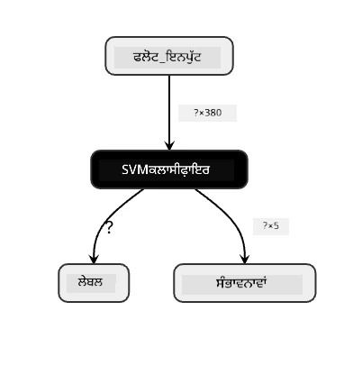
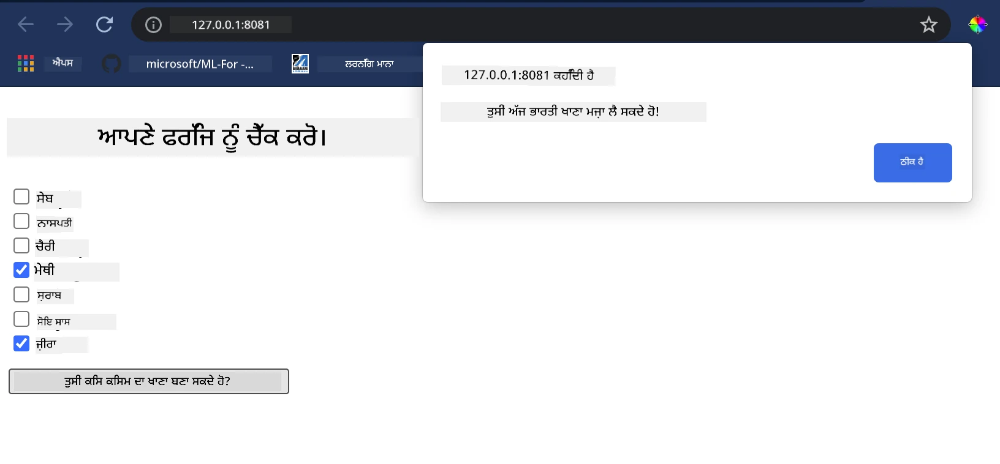

# ਇੱਕ ਖਾਣ-ਪੀਣ ਸੁਝਾਅ ਵੈੱਬ ਐਪ ਬਣਾਓ

ਇਸ ਪਾਠ ਵਿੱਚ, ਤੁਸੀਂ ਕਲਾਸੀਫਿਕੇਸ਼ਨ ਮਾਡਲ ਬਣਾਵੋਗੇ ਜੋ ਕਿ ਤੁਸੀਂ ਪਿਛਲੇ ਪਾਠਾਂ ਵਿੱਚ ਸਿੱਖੀਆਂ ਕੁਝ ਤਕਨੀਕਾਂ ਦੀ ਵਰਤੋਂ ਕਰਕੇ ਅਤੇ ਇਸ ਸੀਰੀਜ਼ ਵਿੱਚ ਪੂਰੇ ਸਮੇਂ ਵਰਤੇ ਜਾਣ ਵਾਲੇ ਸੁਆਦਿਸ਼ਟ ਖਾਣ-ਪੀਣ ਡੇਟਾਸੈੱਟ ਨਾਲ ਬਣਾਇਆ ਜਾਵੇਗਾ। ਇਨ੍ਹਾਂ ਤੋਂ ਇਲਾਵਾ, ਤੁਸੀਂ ਇੱਕ ਛੋਟਾ ਵੈੱਬ ਐਪ ਵੀ ਬਣਾਵੋਗੇ ਜੋ ਕਿ ਸਟੋਰ ਕੀਤਾ ਹੋਇਆ ਮਾਡਲ ਵਰਤੇਗਾ, ਜੋ ਕਿ Onnx ਦੀ ਵੈੱਬ ਰਨਟਾਈਮ ਦੀ ਵਰਤੋਂ ਕਰਦਾ ਹੈ।

ਮਸ਼ੀਨ ਲਰਨਿੰਗ ਦੇ ਸਭ ਤੋਂ ਲਾਭਦਾਇਕ ਵਪਾਰਿਕ ਉਪਯੋਗਾਂ ਵਿੱਚੋਂ ਇੱਕ ਹੈ ਸਿਫਾਰਸ਼ੀ ਪ੍ਰਣਾਲੀਆਂ ਬਣਾਉਣਾ, ਅਤੇ ਤੁਸੀਂ ਅੱਜ ਇਸ ਦਿਸ਼ਾ ਵਿੱਚ ਪਹਿਲਾ ਕਦਮ ਲੈ ਸਕਦੇ ਹੋ!

[](https://youtu.be/17wdM9AHMfg "Applied ML")

> 🎥 ਉੱਪਰ ਦਿੱਤੀ ਤਸਵੀਰ 'ਤੇ ਕਲਿੱਕ ਕਰੋ ਵੀਡੀਓ ਲਈ: Jen Looper ਇੱਕ ਵੈੱਬ ਐਪ ਬਣਾਉਂਦਾ ਹੈ ਕਲਾਸੀਫਾਇਡ ਖਾਣ-ਪੀਣ ਡੇਟਾ ਦੀ ਵਰਤੋਂ ਕਰਕੇ

## [ਪ੍ਰੀ-ਲੈਕਚਰ ਕਵਿਜ਼](https://ff-quizzes.netlify.app/en/ml/)

ਇਸ ਪਾਠ ਵਿੱਚ ਤੁਸੀਂ ਸਿੱਖੋਗੇ:

- ਕਿਸ ਤਰ੍ਹਾਂ ਇੱਕ ਮਾਡਲ ਬਣਾਉਣਾ ਅਤੇ ਉਸਨੂੰ Onnx ਮਾਡਲ ਵਜੋਂ ਸੇਵ ਕਰਨਾ
- ਮਾਡਲ ਨੂੰ ਦੇਖਣ ਲਈ Netron ਦੀ ਵਰਤੋਂ ਕਿਵੇਂ ਕਰਨੀ ਹੈ
- ਆਪਣੇ ਮਾਡਲ ਨੂੰ ਇੱਕ ਵੈੱਬ ਐਪ ਵਿੱਚ ਇੰਫਰੈਂਸ ਲਈ ਕਿਵੇਂ ਵਰਤਣਾ ਹੈ

## ਆਪਣੇ ਮਾਡਲ ਨੂੰ ਬਣਾਓ

ਲਾਗੂ ਕੀਤੇ ਮਸ਼ੀਨ ਲਰਨਿੰਗ ਪ੍ਰਣਾਲੀਆਂ ਬਣਾਉਣਾ ਤੁਹਾਡੇ ਵਪਾਰਕ ਪ੍ਰਣਾਲੀਆਂ ਲਈ ਇਹ ਤਕਨੀਕਾਂ ਵਰਤਣ ਦਾ ਇੱਕ ਮਹੱਤਵਪੂਰਣ ਭਾਗ ਹੈ। ਤੁਸੀਂ ਆਪਣੇ ਵੈੱਬ ਐਪਲੀਕੇਸ਼ਨਾਂ ਵਿੱਚ ਮਾਡਲ ਦੀ ਵਰਤੋਂ ਕਰ ਸਕਦੇ ਹੋ (ਅਤੇ ਜ਼ਰੂਰਤ ਪੈਣ ਤੇ ਆਫਲਾਈਨ ਵੀ ਇਸਨੂੰ ਵਰਤ ਸਕਦੇ ਹੋ) Onnx ਦੀ ਵਰਤੋਂ ਕਰਕੇ।

ਇੱਕ [ਪਿਛਲੇ ਪਾਠ](../../3-Web-App/1-Web-App/README.md) ਵਿੱਚ, ਤੁਸੀਂ UFO ਦੇ ਨਜ਼ਾਰੇ ਬਾਰੇ ਇੱਕ ਰਿਗਰੈਸ਼ਨ ਮਾਡਲ ਬਣਾਇਆ ਸੀ, ਜਿਸਨੂੰ 'ਪਿਕਲ' ਕੀਤਾ ਸੀ, ਅਤੇ ਫਲਾਸਕ ਐਪ ਵਿੱਚ ਇਸਦੀ ਵਰਤੋਂ ਕੀਤੀ ਸੀ। ਜਦਕਿ ਇਹ ਆਰਕੀਟੈਕਚਰ ਜਾਣਨਾ ਬਹੁਤ ਲਾਇਕ ਹੈ, ਪਰ ਇਹ ਇੱਕ ਫੁੱਲ-ਸਟੈਕ ਪਾਈਥਨ ਐਪ ਹੈ, ਅਤੇ ਤੁਹਾਡੀਆਂ ਜਰੂਰਤਾਂ ਜਾਵਾਸਕ੍ਰਿਪਟ ਐਪਲੀਕੇਸ਼ਨ ਦੀ ਵਰਤੋਂ ਮੰਗ ਸਕਦੀਆਂ ਹਨ।

ਇਸ ਪਾਠ ਵਿੱਚ, ਤੁਸੀਂ ਇੱਕ ਬੁਨਿਆਦੀ ਜਾਵਾਸਕ੍ਰਿਪਟ-ਆਧਾਰਿਤ ਪ੍ਰਣਾਲੀ ਇੰਫਰੈਂਸ ਲਈ ਬਣਾਓਗੇ। ਪਰ ਪਹਿਲਾਂ ਇਹ ਜਰੂਰੀ ਹੈ ਕਿ ਤੁਸੀਂ ਇੱਕ ਮਾਡਲ ਟਰੇਨ ਕਰੋ ਅਤੇ ਇਸਨੂੰ Onnx ਵਰਤੋਂ ਲਈ ਰੂਪਾਂਤਰਿਤ ਕਰੋ।

## ਅਭਿਆਸ - ਕਲਾਸੀਫਿਕੇਸ਼ਨ ਮਾਡਲ ਟਰੇਨ ਕਰੋ

ਪਹਿਲਾਂ, ਸਾਫ਼ ਕੀਤੇ ਖਾਣ-ਪੀਣ ਡੇਟਾਸੈੱਟ ਦੀ ਵਰਤੋਂ ਕਰਕੇ ਇੱਕ ਕਲਾਸੀਫਿਕੇਸ਼ਨ ਮਾਡਲ ਟਰੇਨ ਕਰੋ। 

1. ਲੋੜੀਂਦੀਆਂ ਲਾਇਬ੍ਰੇਰੀਆਂ ਇੰਪੋਰਟ ਕਰਨਾ ਸ਼ੁਰੂ ਕਰੋ:

    ```python
    !pip install skl2onnx
    import pandas as pd 
    ```

    ਤੁਹਾਨੂੰ '[skl2onnx](https://onnx.ai/sklearn-onnx/)' ਦੀ ਲੋੜ ਪਵੇਗੀ ਜੋ ਤੁਹਾਡੇ ਸਕਾਈਕਿਟ-ਲਰਨ ਮਾਡਲ ਨੂੰ Onnx ਫਾਰਮੈਟ ਵਿੱਚ ਤਬਦੀਲ ਕਰਨ ਵਿੱਚ ਮਦਦ ਕਰੇਗਾ।

1. ਫਿਰ, ਆਪਣਾ ਡਾਟਾ ਉਨ੍ਹਾਂ ਤਰੀਕਿਆਂ ਨਾਲ ਵਰਤੋ ਜੋ ਤੁਸੀਂ ਪਿਛਲੇ ਪਾਠਾਂ ਵਿੱਚ ਕੀਤਾ ਸੀ, ਜਿਵੇਂ `read_csv()` ਨਾਲ CSV ਫਾਇਲ ਪੜ੍ਹਨਾ:

    ```python
    data = pd.read_csv('../data/cleaned_cuisines.csv')
    data.head()
    ```

1. ਪਹਿਲੇ ਦੋ ਲੋੜ-ਨਹੀਂ ਕਾਲਮ ਹਟਾਓ ਅਤੇ ਬਾਕੀ ਬਚੇ ਹੋਏ ਡਾਟਾ ਨੂੰ 'X' ਵਜੋਂ ਸੇਵ ਕਰੋ:

    ```python
    X = data.iloc[:,2:]
    X.head()
    ```

1. ਲੇਬਲਾਂ ਨੂੰ 'y' ਵਜੋਂ ਸੇਵ ਕਰੋ:

    ```python
    y = data[['cuisine']]
    y.head()
    
    ```

### ਟ੍ਰੇਨਿੰਗ ਰੁਟੀਨ ਸ਼ੁਰੂ ਕਰੋ

ਅਸੀਂ 'SVC' ਲਾਇਬ੍ਰੇਰੀ ਵਰਤਾਂਗੇ ਜੋ ਚੰਗੀ ਸਹੀਤਾ ਵਾਲੀ ਹੈ।

1. ਸਕਾਈਕਿਟ-ਲਰਨ ਤੋਂ ਉਚਿਤ ਲਾਇਬ੍ਰੇਰੀਆਂ ਇੰਪੋਰਟ ਕਰੋ:

    ```python
    from sklearn.model_selection import train_test_split
    from sklearn.svm import SVC
    from sklearn.model_selection import cross_val_score
    from sklearn.metrics import accuracy_score,precision_score,confusion_matrix,classification_report
    ```

1. ਟ੍ਰੇਨਿੰਗ ਅਤੇ ਟੈਸਟ ਸੈੱਟਾਂ ਵੱਖ-ਵੱਖ ਕਰੋ:

    ```python
    X_train, X_test, y_train, y_test = train_test_split(X,y,test_size=0.3)
    ```

1. ਪਿਛਲੇ ਪਾਠ ਵਾਂਗ SVC ਕਲਾਸੀਫਿਕੇਸ਼ਨ ਮਾਡਲ ਬਣਾਓ:

    ```python
    model = SVC(kernel='linear', C=10, probability=True,random_state=0)
    model.fit(X_train,y_train.values.ravel())
    ```

1. ਹੁਣ, ਆਪਣੇ ਮਾਡਲ ਦਾ ਟੈਸਟ ਕਰੋ, `predict()` ਕਾਲ ਕਰਕੇ:

    ```python
    y_pred = model.predict(X_test)
    ```

1. ਮਾਡਲ ਦੀ ਗੁਣਵੱਤਾ ਜਾਂਚਣ ਲਈ ਕਲਾਸੀਫਿਕੇਸ਼ਨ ਰਿਪੋਰਟ ਪ੍ਰਿੰਟ ਕਰੋ:

    ```python
    print(classification_report(y_test,y_pred))
    ```

    ਪਹਿਲਾਂ ਵੇਖਿਆ ਗਿਆ ਹੈ ਕਿ ਸਹੀਤਾ ਚੰਗੀ ਹੈ:

    ```output
                    precision    recall  f1-score   support
    
         chinese       0.72      0.69      0.70       257
          indian       0.91      0.87      0.89       243
        japanese       0.79      0.77      0.78       239
          korean       0.83      0.79      0.81       236
            thai       0.72      0.84      0.78       224
    
        accuracy                           0.79      1199
       macro avg       0.79      0.79      0.79      1199
    weighted avg       0.79      0.79      0.79      1199
    ```

### ਆਪਣੇ ਮਾਡਲ ਨੂੰ Onnx ਵਿੱਚ ਤਬਦੀਲ ਕਰੋ

ਯਕੀਨੀ ਬਣਾਓ ਕਿ ਤਬਦੀਲੀ ਸਹੀ ਟੈਂਸਰ ਨੰਬਰ ਨਾਲ ਕੀਤੀ ਜਾਵੇ। ਇਸ ਡੇਟਾਸੈੱਟ ਵਿੱਚ 380 ਸਮੱਗਰੀਆਂ ਲਿਖੀਆਂ ਗਈਆਂ ਹਨ, ਇਸ ਲਈ ਤੁਹਾਨੂੰ `FloatTensorType` ਵਿੱਚ ਇਹ ਨੰਬਰ ਦਰਜ ਕਰਨਾ ਹੋਵੇਗਾ:

1. 380 ਦੇ ਟੈਂਸਰ ਨੰਬਰ ਦੀ ਵਰਤੋਂ ਕਰਕੇ ਤਬਦੀਲ ਕਰੋ।

    ```python
    from skl2onnx import convert_sklearn
    from skl2onnx.common.data_types import FloatTensorType
    
    initial_type = [('float_input', FloatTensorType([None, 380]))]
    options = {id(model): {'nocl': True, 'zipmap': False}}
    ```

1. onx ਬਣਾਓ ਅਤੇ ਫਾਇਲ ਵਜੋਂ ਸੇਵ ਕਰੋ **model.onnx**:

    ```python
    onx = convert_sklearn(model, initial_types=initial_type, options=options)
    with open("./model.onnx", "wb") as f:
        f.write(onx.SerializeToString())
    ```

    > ਨੋਟ ਕਰੋ, ਤੁਸੀਂ ਆਪਣੀ ਤਬਦੀਲੀ ਸਕ੍ਰਿਪਟ ਵਿੱਚ [ਵਿਕਲਪ](https://onnx.ai/sklearn-onnx/parameterized.html) ਵੀ ਦੇ ਸਕਦੇ ਹੋ। ਇਸ ਸਕ੍ਰਿਪਟ ਵਿੱਚ ਅਸੀਂ 'nocl' ਨੂੰ True ਅਤੇ 'zipmap' ਨੂੰ False ਸੈੱਟ ਕੀਤਾ। ਇਹ ਕਲਾਸੀਫਿਕੇਸ਼ਨ ਮਾਡਲ ਹੈ, ਇਸ ਲਈ ਤੁਹਾਡੇ ਕੋਲ ZipMap ਨੂੰ ਹਟਾਉਣ ਦਾ ਵਿਕਲਪ ਹੁੰਦਾ ਹੈ, ਜੋ ਕਿ ਡਿਕਸ਼ਨਰੀਆਂ ਦੀ ਸੂਚੀ ਤਿਆਰ ਕਰਦਾ ਹੈ (ਲੋੜੀਂਦਾ ਨਹੀਂ). `nocl` ਦਾ ਮਤਲਬ ਹੈ ਕਿ ਮਾਡਲ ਵਿੱਚ ਕਲਾਸ ਜਾਣਕਾਰੀ ਸ਼ਾਮਲ ਹੈ। ਆਪਣੀ ਮਾਡਲ ਦਾ ਆਕਾਰ ਘਟਾਉਣ ਲਈ `nocl` ਨੂੰ 'True' ਤੇ ਰੱਖੋ।

ਪੂਰਾ ਨੋਟਬੁੱਕ ਚਲਾਉਣ 'ਤੇ ਹੁਣ ਇੱਕ Onnx ਮਾਡਲ ਤਿਆਰ ਹੋ ਕੇ ਇਸ ਫੋਲਡਰ ਵਿੱਚ ਸੇਵ ਹੋ ਜਾਵੇਗਾ।

## ਆਪਣੇ ਮਾਡਲ ਨੂੰ ਵੇਖੋ

Onnx ਮਾਡਲਸ ਵਿਜ਼ੁਅਲ ਸਟੂਡੀਓ ਕੋਡ ਵਿੱਚ ਬਹੁਤ ਜ਼ਿਆਦਾ ਦਿਖਾਈ ਨਹੀਂ ਦਿੰਦੇ, ਪਰ ਇੱਕ ਚੰਗਾ ਮੁਫ਼ਤ ਸਾਫਟਵੇਅਰ ਹੈ, ਜਿਹਨੂੰ ਬਹੁਤ ਸਾਰੇ ਰਿਸਰਚਰ ਵਰਤਦੇ ਹਨ ਮਾਡਲ ਨੂੰ ਵਰਚੁਅਲਾਈਜ਼ ਕਰਨ ਲਈ ਤਾਂ ਜੋ ਇਹ ਸਭ ਠੀਕ ਤਰੀਕੇ ਨਾਲ ਬਣਿਆ ਹੋਵੇ। [Netron](https://github.com/lutzroeder/Netron) ਡਾਊਨਲੋਡ ਕਰੋ ਅਤੇ ਆਪਣੀ model.onnx ਫਾਇਲ ਖੋਲ੍ਹੋ। ਤੁਸੀਂ ਦਰਸ਼ਾ ਸਕਦੇ ਹੋ ਕਿ ਤੁਹਾਡਾ ਸਧਾਰਣ ਮਾਡਲ ਕਿਸ ਤਰ੍ਹਾਂ ਵਰਚੁਅਲਾਈਜ਼ ਹੋਇਆ ਹੈ, ਜਿਸਦੇ 380 ਇਨਪੁੱਟ ਅਤੇ ਕਲਾਸੀਫਾਇਰ ਦਰਸਾਏ ਗਏ ਹਨ:



Netron ਤੁਹਾਡੇ ਮਾਡਲ ਦੇਖਣ ਦਾ ਇੱਕ ਮਦਦਗਾਰ ਟੂਲ ਹੈ।

ਹੁਣ ਤੁਸੀਂ ਇਸ ਸੁੰਦਰ ਮਾਡਲ ਨੂੰ ਇੱਕ ਵੈੱਬ ਐਪ ਵਿੱਚ ਵਰਤਣ ਲਈ ਤਿਆਰ ਹੋ। ਚਲੋ ਇੱਕ ਐਪ ਬਣਾਈਏ ਜੋ ਇੰਨਦਿਆਂ ਫ਼ਾਇਦੇਮੰਦ ਹੋਵੇ ਜਦੋਂ ਤੁਸੀਂ ਆਪਣੇ ਫ੍ਰਿਜ ਵਿੱਚ ਦੇਖਦੇ ਹੋ ਅਤੇ ਸਮਝਣ ਦੀ ਕੋਸ਼ਿਸ਼ ਕਰਦੇ ਹੋ ਕਿ ਆਪਣੇ ਬਚੇ-ਖੂਟੇ ਸਮੱਗਰੀਆਂ ਦੇ ਕਿਹੜੇ ਮਿਲਾਪ ਨਾਲ ਕੋਈ ਖਾਸ ਖਾਣਾ ਬਣ ਸਕਦਾ ਹੈ, ਜੋ ਕਿ ਤੁਹਾਡੇ ਮਾਡਲ ਨੇ ਨਿਰਧਾਰਿਤ ਕੀਤਾ ਹੋਵੇ।

## ਇੱਕ ਸੁਝਾਅ ਦਿੰਦੀਆਂ ਵੈੱਬ ਐਪ ਬਣਾਓ

ਤੁਸੀਂ ਆਪਣੇ ਮਾਡਲ ਨੂੰ ਸਿੱਧਾ ਵੈੱਬ ਐਪ ਵਿੱਚ ਵਰਤ ਸਕਦੇ ਹੋ। ਇਹ ਆਰਕੀਟੈਕਚਰ ਤੁਹਾਨੂੰ ਇਸਨੂੰ ਲੋਕਲ ਤੌਰ 'ਤੇ ਚਲਾਉਣ ਅਤੇ ਜੇ ਲੋੜ ਹੋਵੇ ਤਾਂ ਆਫਲਾਈਨ ਵੀ ਚਲਾਉਣ ਦੀ ਆਗਿਆ ਦਿੰਦਾ ਹੈ। "model.onnx" ਫਾਇਲ ਜਿਥੇ ਸਟੋਰ ਕੀਤੀ ਹੈ, ਉਹੋ ਪੁੱਟ ਵਿੱਚ ਇੱਕ `index.html` ਫਾਇਲ ਬਣਾਉ।

1. ਇਸ ਫਾਇਲ _index.html_ ਵਿੱਚ ਹੇਠਾਂ ਦਿੱਤਾ ਮਾਰਕਅਪ ਸ਼ਾਮਲ ਕਰੋ:

    ```html
    <!DOCTYPE html>
    <html>
        <header>
            <title>Cuisine Matcher</title>
        </header>
        <body>
            ...
        </body>
    </html>
    ```

1. ਹੁਣ, `body` ਟੈਗ ਦੇ ਅੰਦਰ ਕੁਝ ਮਾਰਕਅਪ ਸ਼ਾਮਲ ਕਰੋ ਜੋ ਕਿ ਕੁਝ ਸਮੱਗਰੀਆਂ ਦੀ ਇੱਕ ਚੈੱਕਬਾਕਸ ਸੂਚੀ ਦਿਖਾਉਂਦਾ ਹੈ:

    ```html
    <h1>Check your refrigerator. What can you create?</h1>
            <div id="wrapper">
                <div class="boxCont">
                    <input type="checkbox" value="4" class="checkbox">
                    <label>apple</label>
                </div>
            
                <div class="boxCont">
                    <input type="checkbox" value="247" class="checkbox">
                    <label>pear</label>
                </div>
            
                <div class="boxCont">
                    <input type="checkbox" value="77" class="checkbox">
                    <label>cherry</label>
                </div>
    
                <div class="boxCont">
                    <input type="checkbox" value="126" class="checkbox">
                    <label>fenugreek</label>
                </div>
    
                <div class="boxCont">
                    <input type="checkbox" value="302" class="checkbox">
                    <label>sake</label>
                </div>
    
                <div class="boxCont">
                    <input type="checkbox" value="327" class="checkbox">
                    <label>soy sauce</label>
                </div>
    
                <div class="boxCont">
                    <input type="checkbox" value="112" class="checkbox">
                    <label>cumin</label>
                </div>
            </div>
            <div style="padding-top:10px">
                <button onClick="startInference()">What kind of cuisine can you make?</button>
            </div> 
    ```

    ਧਿਆਨ ਦਿਓ ਕਿ ਹਰ ਚੈੱਕਬਾਕਸ ਨੂੰ ਇੱਕ ਕਦਰ ਦਿੱਤੀ ਗਈ ਹੈ। ਇਹ ਡੇਟਾਸੈੱਟ ਅਨੁਸਾਰ ਜਿਸ ਇੰਡੈਕਸ 'ਤੇ ਸਮੱਗਰੀ ਮਿਲਦੀ ਹੈ ਉਸ ਦਾ ਪ੍ਰਤੀਕ ਹੈ। ਉਦਾਹਰਨ ਵਜੋਂ, ਸੇਬ (Apple), ਇਸ ਅਲਫਾਬੇਟਿਕ ਸੂਚੀ ਵਿੱਚ ਪੰਜਵੇਂ ਕਾਲਮ ਵਿੱਚ ਹੈ, ਇਸ ਲਈ ਉਸਦੀ ਕਦਰ '4' ਹੈ ਕਿਉਂਕਿ ਅਸੀਂ ਸ਼ੁਰੂਆਤ 0 ਤੋਂ ਕਰਦੇ ਹਾਂ। ਤੁਸੀਂ [ingredients spreadsheet](../../../../4-Classification/data/ingredient_indexes.csv) ਵੇਖ ਕੇ ਕਿਸੇ ਸਮੱਗਰੀ ਦਾ ਇੰਡੈਕਸ ਪਤਾ ਕਰ ਸਕਦੇ ਹੋ।

    index.html ਫਾਇਲ ਵਿੱਚ ਕੰਮ ਜਾਰੀ ਰੱਖਦੇ ਹੋਏ, ਇੱਕ ਸਕ੍ਰਿਪਟ ਬਲਾਕ ਸ਼ਾਮਲ ਕਰੋ ਜਿੱਥੇ ਮਾਡਲ ਨੂੰ ਆਖਰੀ ਬੰਦ `</div>` ਤੋਂ ਬਾਅਦ ਕਾਲ ਕੀਤਾ ਜਾਂਦਾ ਹੈ।

1. ਸਭ ਤੋਂ ਪਹਿਲਾਂ, [Onnx Runtime](https://www.onnxruntime.ai/) ਨੂੰ ਇੰਪੋਰਟ ਕਰੋ:

    ```html
    <script src="https://cdn.jsdelivr.net/npm/onnxruntime-web@1.9.0/dist/ort.min.js"></script> 
    ```

    > Onnx Runtime ਤੁਹਾਡੇ Onnx ਮਾਡਲਾਂ ਨੂੰ ਵੱਖ-ਵੱਖ ਹਾਰਡਵੇਅਰ ਪਲੇਟਫਾਰਮਾਂ 'ਤੇ ਚਲਾਉਣ ਯੋਗ ਕਰਦਾ ਹੈ, ਜਿਸ ਵਿੱਚ ਅਪਟੀਮਾਈਜ਼ੇਸ਼ਨ ਅਤੇ ਵਰਤੋਂ ਲਈ ਇਕ API ਸ਼ਾਮਲ ਹੈ।

1. ਜਿਵੇਂ ਹੀ Runtime ਤਿਆਰ ਹੋਇਆ, ਤੁਸੀਂ ਇਸਨੂੰ ਕਾਲ ਕਰ ਸਕਦੇ ਹੋ:

    ```html
    <script>
        const ingredients = Array(380).fill(0);
        
        const checks = [...document.querySelectorAll('.checkbox')];
        
        checks.forEach(check => {
            check.addEventListener('change', function() {
                // toggle the state of the ingredient
                // based on the checkbox's value (1 or 0)
                ingredients[check.value] = check.checked ? 1 : 0;
            });
        });

        function testCheckboxes() {
            // validate if at least one checkbox is checked
            return checks.some(check => check.checked);
        }

        async function startInference() {

            let atLeastOneChecked = testCheckboxes()

            if (!atLeastOneChecked) {
                alert('Please select at least one ingredient.');
                return;
            }
            try {
                // create a new session and load the model.
                
                const session = await ort.InferenceSession.create('./model.onnx');

                const input = new ort.Tensor(new Float32Array(ingredients), [1, 380]);
                const feeds = { float_input: input };

                // feed inputs and run
                const results = await session.run(feeds);

                // read from results
                alert('You can enjoy ' + results.label.data[0] + ' cuisine today!')

            } catch (e) {
                console.log(`failed to inference ONNX model`);
                console.error(e);
            }
        }
               
    </script>
    ```

ਇਸ ਕੋਡ ਵਿੱਚ ਕਈ ਗੱਲਾਂ ਹੋ ਰਹੀਆਂ ਹਨ:

1. ਤੁਸੀਂ 380 ਸੰਭਾਵਤ ਕਦਰਾਂ (1 ਜਾਂ 0) ਦੀ ਇੱਕ ਐਰੇ ਬਣਾਈ ਜੋ ਸੈਟ ਕੀਤੀ ਜਾਏਗੀ ਅਤੇ ਮਾਡਲ ਨੂੰ ਇੰਫਰੈਂਸ ਲਈ ਭੇਜੀ ਜਾਵੇਗੀ, ਇਹ ਇਸ ਗੱਲ 'ਤੇ ਨਿਰਭਰ ਕਰਦਾ ਹੈ ਕਿ ਕੋਈ ਸਮੱਗਰੀ ਚੈੱਕਬਾਕਸ ਚੈਕ ਹੈ ਕਿ ਨਹੀਂ।
2. ਤੁਸੀਂ ਚੈੱਕਬਾਕਸ ਦਾ ਇੱਕ ਐਰੇ ਬਣਾਇਆ ਅਤੇ ਇੱਕ 'init' ਫੰਕਸ਼ਨ ਵਿੱਚ ਇਹ ਜਾਂਚ ਕਰਨ ਦਾ ਤਰੀਕਾ ਬਣਾਇਆ ਕਿ ਉਹ ਚੈਕੇਡ ਹਨ ਜਾਂ ਨਹੀਂ, ਜੋ ਐਪਲੀਕੇਸ਼ਨ ਦੇ ਸ਼ੁਰੂ ਹੋਣ 'ਤੇ ਕਾਲ ਹੁੰਦਾ ਹੈ। ਜੇ ਕੋਈ ਚੈੱਕਬਾਕਸ ਚੈੱਕ ਹੋਵੇ, ਤਾਂ `ingredients` ਐਰੇ ਨੂੰ ਚੁਣੀ ਗਈ ਸਮੱਗਰੀ ਦੇ ਅਨੁਸਾਰ ਬਦਲ ਦਿੱਤਾ ਜਾਂਦਾ ਹੈ।
3. ਤੁਸੀਂ ਇੱਕ `testCheckboxes` ਫੰਕਸ਼ਨ ਬਣਾਇਆ ਜੋ ਜਾਂਚਦਾ ਹੈ ਕਿ ਕੋਈ ਵੀ ਚੈੱਕਬਾਕਸ ਚੈੱਕ ਹੈ ਕਿ ਨਹੀਂ।
4. ਤੁਸੀਂ `startInference` ਫੰਕਸ਼ਨ ਦੀ ਵਰਤੋਂ ਕਰਦੇ ਹੋ ਜਦੋਂ ਬਟਨ ਦਬਾਇਆ ਗਿਆ ਹੋਵੇ ਅਤੇ ਜੇ ਕੋਈ ਵੀ ਚੈੱਕਬਾਕਸ ਚੈੱਕ ਹੈ, ਤਾਂ ਇੰਫਰੈਂਸ ਸ਼ੁਰੂ ਕਰਦੇ ਹੋ।
5. ਇੰਫਰੈਂਸ ਰੁਟੀਨ ਵਿੱਚ ਸ਼ਾਮਲ ਹੈ:
   1. ਮਾਡਲ ਦੀ ਅਸਿੰਕ੍ਰੋਨਸ ਲੋਡਿੰਗ ਨੂੰ ਸੈੱਟ ਕਰਨਾ
   2. ਮਾਡਲ ਨੂੰ ਭੇਜਣ ਲਈ ਟੈਂਸਰ ਬਣਾਉਣਾ
   3. 'feeds' ਬਣਾਉਣਾ ਜੋ ਇਹ ਦਰਸਾਉਂਦਾ ਹੈ ਕਿ `float_input` ਇਨਪੁੱਟ ਜੋ ਤੁਸੀਂ ਮਾਡਲ ਟਰੇਨਿੰਗ ਦੌਰਾਨ ਬਣਾਇਆ (ਤੁਸੀਂ ਇਹ ਨਾਮ Netron ਦੇਖ ਕੇ ਪੁਸ਼ਟੀ ਕਰ ਸਕਦੇ ਹੋ)
   4. ਇਨ੍ਹਾਂ 'feeds' ਨੂੰ ਮਾਡਲ ਨੂੰ ਭੇਜਣਾ ਅਤੇ ਜਵਾਬ ਦੀ ਉਡੀਕ ਕਰਨੀ

## ਆਪਣੀ ਐਪਲੀਕੇਸ਼ਨ ਦੀ ਜਾਂਚ ਕਰੋ

Visual Studio Code ਵਿੱਚ ਉਸ ਫੋਲਡਰ ਵਿੱਚ ਟਰਮੀਨਲ ਸੈਸ਼ਨ ਖੋਲ੍ਹੋ ਜਿੱਥੇ ਤੁਹਾਡੀ index.html ਫਾਇਲ ਹੈ। ਯਕੀਨੀ ਬਣਾਓ ਕਿ ਤੁਸੀਂ [http-server](https://www.npmjs.com/package/http-server) ਗਲੋਬਲੀ ਇੰਸਟਾਲ ਕੀਤਾ ਹੈ, ਅਤੇ ਪ੍ਰਾਪਤ ਟਰਮੀਨਲ 'ਤੇ `http-server` ਲਿਖੋ। ਇੱਕ ਲੋਕਲਹੋਸਟ ਖੁਲਣਾ ਚਾਹੀਦਾ ਹੈ ਅਤੇ ਤੁਸੀਂ ਆਪਣੀ ਵੈੱਬ ਐਪ ਵੇਖ ਸਕਦੇ ਹੋ। ਵੱਖ-ਵੱਖ ਸਮੱਗਰੀਆਂ ਦੇ ਅਧਾਰ 'ਤੇ ਕਿਸ ਖਾਣੇ ਦੀ ਸਿਫਾਰਸ਼ ਕੀਤੀ ਜਾ ਰਹੀ ਹੈ, ਤੁਸੀਂ ਦੇਖੋ:



ਵਧਾਈ ਹੋਵੇ, ਤੁਸੀਂ ਇੱਕ ਸੁਝਾਅ ਦੇਣ ਵਾਲੀ ਵੈੱਬ ਐਪ ਬਣਾਈ ਹੈ ਜਿਸ ਵਿੱਚ ਕੁਝ ਖੇਤਰ ਹਨ। ਇਸ ਪ੍ਰਣਾਲੀ ਨੂੰ ਵਿਕਸਤ ਕਰਨ ਲਈ ਕੁਝ ਸਮਾਂ ਲਗਾਓ!
## 🚀ਚੈਲੇਂਜ

ਤੁਹਾਡੀ ਵੈੱਬ ਐਪ ਬਹੁਤ ਹੀ ਘੱਟ ਹੈ, ਇਸਨੂੰ ਬਣਾ ਰਹਿਣਾ ਜਾਰੀ ਰੱਖੋ ਅਤੇ [ingredient_indexes](../../../../4-Classification/data/ingredient_indexes.csv) ਡੇਟਿਆਂ ਦੇ ਸਮੱਗਰੀਆਂ ਅਤੇ ਉਨ੍ਹਾਂ ਦੇ ਇੰਡੈਕਸਾਂ ਦੀ ਵਰਤੋਂ ਕਰੋ। ਕਿਹੜੇ ਸਵਾਦ ਦੇ ਥੁੱਲਿਆਂ ਨਾਲ ਕੋਈ ਦੇਸ਼ ਦੀ ਵਿਸ਼ੇਸ਼ ਵਿਆੰਜਣ ਬਣਦੀ ਹੈ?

## [ਪੋਸਟ-ਲੈਕਚਰ ਕਵਿਜ਼](https://ff-quizzes.netlify.app/en/ml/)

## ਸਮੀਖਿਆ ਅਤੇ ਸਵੈ ਅਧਿਐਨ

ਜਦਕਿ ਇਸ ਪਾਠ ਨੇ ਸਿਰਫ ਖਾਣ ਪਦਾਰਥਾਂ ਲਈ ਇੱਕ ਸਿਫਾਰਸ਼ੀ ਪ੍ਰਣਾਲੀ ਬਣਾਉਣ ਦੀ ਯੂਟਿਲਿਟੀ 'ਤੇ ਝਲਕ ਦਿੱਤੀ ਹੈ, ਇਸ ਖੇਤਰ ਵਿੱਚ ਮਸ਼ੀਨ ਲਰਨਿੰਗ ਐਪਲੀਕੇਸ਼ਨਾਂ ਦੇ ਬਹੁਤ ਸਾਰੇ ਉਦਾਹਰਨ ਹਨ। ਪੜ੍ਹੋ ਕਿ ਇਹ ਪ੍ਰਣਾਲੀਆਂ ਕਿਵੇਂ ਬਣਾਈ ਜਾਂਦੀਆਂ ਹਨ:

- https://www.sciencedirect.com/topics/computer-science/recommendation-engine
- https://www.technologyreview.com/2014/08/25/171547/the-ultimate-challenge-for-recommendation-engines/
- https://www.technologyreview.com/2015/03/23/168831/everything-is-a-recommendation/

## ਅਸਾਈਨਮੈਂਟ 

[ਨਵਾਂ ਸੁਝਾਅ ਦਿੰਦੀਆਂ ਪ੍ਰਣਾਲੀ ਬਣਾਓ](assignment.md)

---

<!-- CO-OP TRANSLATOR DISCLAIMER START -->
**ਅਸਵੀਕਾਰੋਪਣ**:
ਇਸ ਦਸਤਾਵੇਜ਼ ਦਾ ਅਨੁਵਾਦ ਏਆਈ ਅਨੁਵਾਦ ਸੇਵਾ [Co-op Translator](https://github.com/Azure/co-op-translator) ਦੀ ਵਰਤੋਂ ਕਰਕੇ ਕੀਤਾ ਗਿਆ ਹੈ। ਜਦੋਂ ਕਿ ਅਸੀਂ ਸਹੀਤਾਵਾਂ ਲਈ ਯਤਨਸ਼ੀਲ ਹਾਂ, ਕਿਰਪਾ ਕਰਕੇ ਧਿਆਨ ਰੱਖੋ ਕਿ ਸਵੈਚਾਲਿਤ ਅਨੁਵਾਦਾਂ ਵਿੱਚ ਗਲਤੀਆਂ ਜਾਂ ਅਸਮੱਤਿਆਵਾਂ ਹੋ ਸਕਦੀਆਂ ਹਨ। ਮੂਲ ਦਸਤਾਵੇਜ਼ ਆਪਣੀ ਮੂਲ ਭਾਸ਼ਾ ਵਿੱਚ ਅਧਿਕਾਰਕ ਸਰੋਤ ਮੰਨਿਆ ਜਾਣਾ ਚਾਹੀਦਾ ਹੈ। ਜਰੂਰੀ ਜਾਣਕਾਰੀ ਲਈ, ਪੇਸ਼ੇਵਰ ਮਨੁੱਖੀ ਅਨੁਵਾਦ ਦੀ ਸਿਫ਼ਾਰਸ਼ ਕੀਤੀ ਜਾਂਦੀ ਹੈ। ਅਸੀਂ ਇਸ ਅਨੁਵਾਦ ਦੇ ਉਪਯੋਗ ਤੋਂ ਪੈਦਾ ਹੋਣ ਵਾਲੀਆਂ ਕਿਸੇ ਵੀ ਗਲਤਫਹਿਮੀਆਂ ਜਾਂ ਗਲਤ ਵਿਆਖਿਆਵਾਂ ਲਈ ਜਵਾਬਦੇਹ ਨਹੀਂ ਹਾਂ।
<!-- CO-OP TRANSLATOR DISCLAIMER END -->