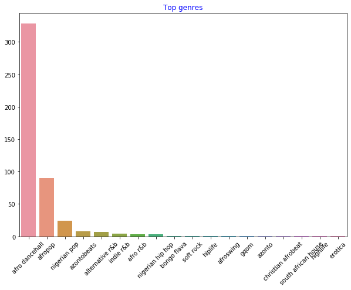

<!--
CO_OP_TRANSLATOR_METADATA:
{
  "original_hash": "0ab69b161efd7a41d325ee28b29415d7",
  "translation_date": "2025-08-29T17:14:35+00:00",
  "source_file": "5-Clustering/1-Visualize/README.md",
  "language_code": "pa"
}
-->
# ਕਲੱਸਟਰਿੰਗ ਦਾ ਪਰਿਚਯ

ਕਲੱਸਟਰਿੰਗ [ਅਨਸੁਪਰਵਾਈਜ਼ਡ ਲਰਨਿੰਗ](https://wikipedia.org/wiki/Unsupervised_learning) ਦੀ ਇੱਕ ਕਿਸਮ ਹੈ ਜੋ ਮੰਨਦੀ ਹੈ ਕਿ ਡੇਟਾਸੈੱਟ ਅਣਲੈਬਲਡ ਹੈ ਜਾਂ ਇਸਦੇ ਇਨਪੁਟ ਪਹਿਲੋਂ ਤੋਂ ਪਰਿਭਾਸ਼ਿਤ ਆਉਟਪੁਟ ਨਾਲ ਮੇਲ ਨਹੀਂ ਖਾਂਦੇ। ਇਹ ਵੱਖ-ਵੱਖ ਐਲਗੋਰਿਥਮਾਂ ਦੀ ਵਰਤੋਂ ਕਰਕੇ ਅਣਲੈਬਲਡ ਡੇਟਾ ਨੂੰ ਛਾਂਟਦਾ ਹੈ ਅਤੇ ਡੇਟਾ ਵਿੱਚ ਪਾਏ ਗਏ ਪੈਟਰਨਾਂ ਦੇ ਅਧਾਰ 'ਤੇ ਸਮੂਹ ਬਣਾਉਂਦਾ ਹੈ।

[](https://youtu.be/ty2advRiWJM "No One Like You by PSquare")

> 🎥 ਉੱਪਰ ਦਿੱਤੀ ਤਸਵੀਰ 'ਤੇ ਕਲਿੱਕ ਕਰਕੇ ਵੀਡੀਓ ਵੇਖੋ। ਜਦੋਂ ਤੁਸੀਂ ਕਲੱਸਟਰਿੰਗ ਨਾਲ ਮਸ਼ੀਨ ਲਰਨਿੰਗ ਪੜ੍ਹ ਰਹੇ ਹੋ, ਤਾਂ ਨਾਈਜੀਰੀਆਈ ਡਾਂਸ ਹਾਲ ਗੀਤਾਂ ਦਾ ਆਨੰਦ ਲਵੋ - ਇਹ PSquare ਦਾ 2014 ਦਾ ਬਹੁਤ ਪ੍ਰਸੰਸਿਤ ਗੀਤ ਹੈ।

## [ਪ੍ਰੀ-ਲੈਕਚਰ ਕਵਿਜ਼](https://gray-sand-07a10f403.1.azurestaticapps.net/quiz/27/)

### ਪਰਿਚਯ

[ਕਲੱਸਟਰਿੰਗ](https://link.springer.com/referenceworkentry/10.1007%2F978-0-387-30164-8_124) ਡੇਟਾ ਐਕਸਪਲੋਰੇਸ਼ਨ ਲਈ ਬਹੁਤ ਹੀ ਲਾਭਦਾਇਕ ਹੈ। ਆਓ ਵੇਖੀਏ ਕਿ ਕੀ ਇਹ ਨਾਈਜੀਰੀਆਈ ਦਰਸ਼ਕਾਂ ਦੇ ਸੰਗੀਤ ਸੁਣਨ ਦੇ ਢੰਗਾਂ ਅਤੇ ਪੈਟਰਨਾਂ ਦੀ ਖੋਜ ਕਰਨ ਵਿੱਚ ਮਦਦਗਾਰ ਹੋ ਸਕਦੀ ਹੈ।

✅ ਇੱਕ ਮਿੰਟ ਲਓ ਅਤੇ ਕਲੱਸਟਰਿੰਗ ਦੇ ਉਪਯੋਗਾਂ ਬਾਰੇ ਸੋਚੋ। ਅਸਲ ਜ਼ਿੰਦਗੀ ਵਿੱਚ, ਕਲੱਸਟਰਿੰਗ ਉਸ ਸਮੇਂ ਹੁੰਦੀ ਹੈ ਜਦੋਂ ਤੁਹਾਡੇ ਕੋਲ ਕੱਪੜਿਆਂ ਦਾ ਢੇਰ ਹੁੰਦਾ ਹੈ ਅਤੇ ਤੁਹਾਨੂੰ ਆਪਣੇ ਪਰਿਵਾਰ ਦੇ ਮੈਂਬਰਾਂ ਦੇ ਕੱਪੜੇ ਵੱਖ ਕਰਨੇ ਪੈਂਦੇ ਹਨ 🧦👕👖🩲। ਡੇਟਾ ਸਾਇੰਸ ਵਿੱਚ, ਕਲੱਸਟਰਿੰਗ ਉਸ ਸਮੇਂ ਹੁੰਦੀ ਹੈ ਜਦੋਂ ਕਿਸੇ ਯੂਜ਼ਰ ਦੀ ਪਸੰਦ ਦਾ ਵਿਸ਼ਲੇਸ਼ਣ ਕਰਨਾ ਹੋਵੇ ਜਾਂ ਕਿਸੇ ਅਣਲੈਬਲਡ ਡੇਟਾਸੈੱਟ ਦੀ ਵਿਸ਼ੇਸ਼ਤਾਵਾਂ ਦਾ ਨਿਰਧਾਰਨ ਕਰਨਾ ਹੋਵੇ। ਕਲੱਸਟਰਿੰਗ, ਇੱਕ ਤਰੀਕੇ ਨਾਲ, ਗੁੰਝਲਦਾਰ ਚੀਜ਼ਾਂ ਨੂੰ ਸਮਝਣ ਵਿੱਚ ਮਦਦ ਕਰਦੀ ਹੈ, ਜਿਵੇਂ ਕਿ ਮੋਜ਼ਿਆਂ ਦੀ ਦਰਾਜ਼।

[](https://youtu.be/esmzYhuFnds "Introduction to Clustering")

> 🎥 ਉੱਪਰ ਦਿੱਤੀ ਤਸਵੀਰ 'ਤੇ ਕਲਿੱਕ ਕਰਕੇ ਵੀਡੀਓ ਵੇਖੋ: MIT ਦੇ ਜੌਨ ਗੁਟਟੈਗ ਕਲੱਸਟਰਿੰਗ ਦਾ ਪਰਿਚਯ ਦਿੰਦੇ ਹਨ।

ਪੇਸ਼ੇਵਰ ਸੈਟਿੰਗ ਵਿੱਚ, ਕਲੱਸਟਰਿੰਗ ਨੂੰ ਬਾਜ਼ਾਰ ਸੈਗਮੈਂਟੇਸ਼ਨ ਜਿਵੇਂ ਕਿ ਨਿਰਧਾਰਤ ਕਰਨ ਲਈ ਵਰਤਿਆ ਜਾ ਸਕਦਾ ਹੈ ਕਿ ਕਿਹੜੀਆਂ ਉਮਰ ਦੇ ਸਮੂਹ ਕਿਹੜੀਆਂ ਚੀਜ਼ਾਂ ਖਰੀਦਦੇ ਹਨ। ਇੱਕ ਹੋਰ ਉਪਯੋਗ ਅਨੋਖੇ ਪੈਟਰਨਾਂ ਦੀ ਪਛਾਣ ਕਰਨਾ ਹੋ ਸਕਦਾ ਹੈ, ਜਿਵੇਂ ਕਿ ਕ੍ਰੈਡਿਟ ਕਾਰਡ ਲੈਣ-ਦੇਣ ਦੇ ਡੇਟਾਸੈੱਟ ਵਿੱਚ ਧੋਖਾਧੜੀ ਦੀ ਪਛਾਣ ਕਰਨਾ। ਜਾਂ ਤੁਸੀਂ ਕਲੱਸਟਰਿੰਗ ਨੂੰ ਮੈਡੀਕਲ ਸਕੈਨਾਂ ਦੇ ਢੇਰ ਵਿੱਚ ਟਿਊਮਰਾਂ ਦੀ ਪਛਾਣ ਕਰਨ ਲਈ ਵਰਤ ਸਕਦੇ ਹੋ।

✅ ਇੱਕ ਮਿੰਟ ਲਈ ਸੋਚੋ ਕਿ ਤੁਸੀਂ ਕਲੱਸਟਰਿੰਗ ਨੂੰ 'ਜੀਵਨ ਵਿੱਚ ਕਿਤੇ' ਦੇਖਿਆ ਹੋਵੇ, ਜਿਵੇਂ ਕਿ ਬੈਂਕਿੰਗ, ਈ-ਕਾਮਰਸ ਜਾਂ ਕਾਰੋਬਾਰ ਸੈਟਿੰਗ ਵਿੱਚ।

> 🎓 ਦਿਲਚਸਪ ਗੱਲ ਇਹ ਹੈ ਕਿ ਕਲੱਸਟਰ ਵਿਸ਼ਲੇਸ਼ਣ ਦੀ ਸ਼ੁਰੂਆਤ 1930 ਦੇ ਦਹਾਕੇ ਵਿੱਚ ਐਂਥਰੋਪੋਲੋਜੀ ਅਤੇ ਸਾਇਕੋਲੋਜੀ ਦੇ ਖੇਤਰਾਂ ਵਿੱਚ ਹੋਈ ਸੀ। ਕੀ ਤੁਸੀਂ ਸੋਚ ਸਕਦੇ ਹੋ ਕਿ ਇਸਦਾ ਕਿਵੇਂ ਉਪਯੋਗ ਕੀਤਾ ਗਿਆ ਹੋਵੇਗਾ?

ਇਸਦੇ ਬਦਲੇ, ਤੁਸੀਂ ਇਸਨੂੰ ਖੋਜ ਦੇ ਨਤੀਜਿਆਂ ਨੂੰ ਸਮੂਹਬੱਧ ਕਰਨ ਲਈ ਵਰਤ ਸਕਦੇ ਹੋ - ਉਦਾਹਰਣ ਲਈ, ਖਰੀਦਦਾਰੀ ਲਿੰਕਾਂ, ਚਿੱਤਰਾਂ ਜਾਂ ਸਮੀਖਿਆਵਾਂ ਦੁਆਰਾ। ਜਦੋਂ ਤੁਹਾਡੇ ਕੋਲ ਇੱਕ ਵੱਡਾ ਡੇਟਾਸੈੱਟ ਹੁੰਦਾ ਹੈ ਜਿਸਨੂੰ ਤੁਸੀਂ ਘਟਾਉਣਾ ਚਾਹੁੰਦੇ ਹੋ ਅਤੇ ਜਿਸ 'ਤੇ ਤੁਸੀਂ ਹੋਰ ਵਿਸ਼ਲੇਸ਼ਣ ਕਰਨਾ ਚਾਹੁੰਦੇ ਹੋ, ਤਾਂ ਕਲੱਸਟਰਿੰਗ ਲਾਭਦਾਇਕ ਹੁੰਦੀ ਹੈ। ਇਸ ਤਕਨੀਕ ਨੂੰ ਹੋਰ ਮਾਡਲ ਬਣਾਉਣ ਤੋਂ ਪਹਿਲਾਂ ਡੇਟਾ ਬਾਰੇ ਸਿੱਖਣ ਲਈ ਵਰਤਿਆ ਜਾ ਸਕਦਾ ਹੈ।

✅ ਜਦੋਂ ਤੁਹਾਡਾ ਡੇਟਾ ਕਲੱਸਟਰਾਂ ਵਿੱਚ ਸੰਗਠਿਤ ਹੋ ਜਾਂਦਾ ਹੈ, ਤਾਂ ਤੁਸੀਂ ਇਸਨੂੰ ਇੱਕ ਕਲੱਸਟਰ ID ਸੌਂਪਦੇ ਹੋ। ਇਹ ਤਕਨੀਕ ਡੇਟਾਸੈੱਟ ਦੀ ਗੋਪਨੀਯਤਾ ਨੂੰ ਬਰਕਰਾਰ ਰੱਖਣ ਵਿੱਚ ਮਦਦਗਾਰ ਹੋ ਸਕਦੀ ਹੈ; ਤੁਸੀਂ ਕਲੱਸਟਰ ਦੇ ਹੋਰ ਤੱਤਾਂ ਦੀ ਬਜਾਏ ਡੇਟਾ ਪੌਇੰਟ ਨੂੰ ਇਸਦੇ ਕਲੱਸਟਰ ID ਨਾਲ ਦਰਸਾ ਸਕਦੇ ਹੋ। ਕੀ ਤੁਸੀਂ ਹੋਰ ਕਾਰਨਾਂ ਬਾਰੇ ਸੋਚ ਸਕਦੇ ਹੋ ਕਿ ਤੁਸੀਂ ਕਲੱਸਟਰ ID ਨੂੰ ਕਿਉਂ ਵਰਤੋਗੇ?

ਕਲੱਸਟਰਿੰਗ ਤਕਨੀਕਾਂ ਦੀ ਆਪਣੀ ਸਮਝ ਨੂੰ ਇਸ [ਲਰਨ ਮਾਡਿਊਲ](https://docs.microsoft.com/learn/modules/train-evaluate-cluster-models?WT.mc_id=academic-77952-leestott) ਵਿੱਚ ਗਹਿਰਾ ਕਰੋ।

## ਕਲੱਸਟਰਿੰਗ ਨਾਲ ਸ਼ੁਰੂਆਤ

[Scikit-learn](https://scikit-learn.org/stable/modules/clustering.html) ਕਲੱਸਟਰਿੰਗ ਕਰਨ ਲਈ ਕਈ ਤਰੀਕੇ ਪੇਸ਼ ਕਰਦਾ ਹੈ। ਤੁਸੀਂ ਕਿਹੜਾ ਤਰੀਕਾ ਚੁਣਦੇ ਹੋ, ਇਹ ਤੁਹਾਡੇ ਕੇਸ ਦੇ ਉਪਯੋਗ 'ਤੇ ਨਿਰਭਰ ਕਰਦਾ ਹੈ। ਦਸਤਾਵੇਜ਼ਾਂ ਦੇ ਅਨੁਸਾਰ, ਹਰ ਤਰੀਕੇ ਦੇ ਵੱਖ-ਵੱਖ ਫਾਇਦੇ ਹਨ। ਹੇਠਾਂ Scikit-learn ਦੁਆਰਾ ਸਮਰਥਿਤ ਤਰੀਕਿਆਂ ਅਤੇ ਉਨ੍ਹਾਂ ਦੇ ਉਪਯੋਗ ਮਾਮਲਿਆਂ ਦੀ ਇੱਕ ਸਰਲ ਸਾਰਣੀ ਦਿੱਤੀ ਗਈ ਹੈ:

| ਤਰੀਕੇ ਦਾ ਨਾਮ                | ਉਪਯੋਗ ਮਾਮਲਾ                                                        |
| :--------------------------- | :------------------------------------------------------------------ |
| K-Means                      | ਆਮ ਉਦੇਸ਼, ਇੰਡਕਟਿਵ                                                |
| Affinity propagation         | ਕਈ, ਅਸਮਾਨ ਕਲੱਸਟਰ, ਇੰਡਕਟਿਵ                                       |
| Mean-shift                   | ਕਈ, ਅਸਮਾਨ ਕਲੱਸਟਰ, ਇੰਡਕਟਿਵ                                       |
| Spectral clustering          | ਥੋੜ੍ਹੇ, ਸਮਾਨ ਕਲੱਸਟਰ, ਟ੍ਰਾਂਸਡਕਟਿਵ                                 |
| Ward hierarchical clustering | ਕਈ, ਰੋਕੇ ਹੋਏ ਕਲੱਸਟਰ, ਟ੍ਰਾਂਸਡਕਟਿਵ                                |
| Agglomerative clustering     | ਕਈ, ਰੋਕੇ ਹੋਏ, ਗੈਰ-ਯੂਕਲਿਡੀਅਨ ਦੂਰੀਆਂ, ਟ੍ਰਾਂਸਡਕਟਿਵ                |
| DBSCAN                       | ਗੈਰ-ਸਮਤਲ ਜਿਓਮੈਟਰੀ, ਅਸਮਾਨ ਕਲੱਸਟਰ, ਟ੍ਰਾਂਸਡਕਟਿਵ                    |
| OPTICS                       | ਗੈਰ-ਸਮਤਲ ਜਿਓਮੈਟਰੀ, ਅਸਮਾਨ ਕਲੱਸਟਰ ਜਿਨ੍ਹਾਂ ਦੀ ਘਣਤਾ ਵੱਖਰੀ ਹੈ, ਟ੍ਰਾਂਸਡਕਟਿਵ |
| Gaussian mixtures            | ਸਮਤਲ ਜਿਓਮੈਟਰੀ, ਇੰਡਕਟਿਵ                                          |
| BIRCH                        | ਵੱਡੇ ਡੇਟਾਸੈੱਟ ਨਾਲ ਆਊਟਲਾਇਰ, ਇੰਡਕਟਿਵ                              |

> 🎓 ਕਲੱਸਟਰ ਬਣਾਉਣ ਦਾ ਤਰੀਕਾ ਇਸ ਗੱਲ 'ਤੇ ਨਿਰਭਰ ਕਰਦਾ ਹੈ ਕਿ ਅਸੀਂ ਡੇਟਾ ਪੌਇੰਟਾਂ ਨੂੰ ਸਮੂਹਾਂ ਵਿੱਚ ਕਿਵੇਂ ਇਕੱਠਾ ਕਰਦੇ ਹਾਂ। ਆਓ ਕੁਝ ਸ਼ਬਦਾਵਲੀ ਨੂੰ ਸਮਝੀਏ:

> 🎓 ['ਟ੍ਰਾਂਸਡਕਟਿਵ' ਵਿਰੁੱਧ 'ਇੰਡਕਟਿਵ'](https://wikipedia.org/wiki/Transduction_(machine_learning))  
> 
> ਟ੍ਰਾਂਸਡਕਟਿਵ ਅਨੁਮਾਨ ਉਹਨਾਂ ਟ੍ਰੇਨਿੰਗ ਕੇਸਾਂ ਤੋਂ ਪ੍ਰਾਪਤ ਹੁੰਦਾ ਹੈ ਜੋ ਖਾਸ ਟੈਸਟ ਕੇਸਾਂ ਨਾਲ ਜੁੜਦੇ ਹਨ। ਇੰਡਕਟਿਵ ਅਨੁਮਾਨ ਟ੍ਰੇਨਿੰਗ ਕੇਸਾਂ ਤੋਂ ਪ੍ਰਾਪਤ ਹੁੰਦਾ ਹੈ ਜੋ ਆਮ ਨਿਯਮਾਂ ਨੂੰ ਨਿਰਧਾਰਤ ਕਰਦੇ ਹਨ ਅਤੇ ਫਿਰ ਉਨ੍ਹਾਂ ਨੂੰ ਟੈਸਟ ਕੇਸਾਂ 'ਤੇ ਲਾਗੂ ਕਰਦੇ ਹਨ।  
> 
> ਉਦਾਹਰਣ: ਕਲਪਨਾ ਕਰੋ ਕਿ ਤੁਹਾਡੇ ਕੋਲ ਇੱਕ ਡੇਟਾਸੈੱਟ ਹੈ ਜੋ ਸਿਰਫ਼ ਹਿੱਸੇਵਾਰ ਲੈਬਲਡ ਹੈ। ਕੁਝ ਚੀਜ਼ਾਂ 'ਰੇਕਾਰਡ' ਹਨ, ਕੁਝ 'ਸੀਡੀ' ਹਨ, ਅਤੇ ਕੁਝ ਖਾਲੀ ਹਨ। ਤੁਹਾਡਾ ਕੰਮ ਖਾਲੀਆਂ ਚੀਜ਼ਾਂ ਲਈ ਲੇਬਲ ਪ੍ਰਦਾਨ ਕਰਨਾ ਹੈ।  
> 
> 🎓 ['ਗੈਰ-ਸਮਤਲ' ਵਿਰੁੱਧ 'ਸਮਤਲ' ਜਿਓਮੈਟਰੀ](https://datascience.stackexchange.com/questions/52260/terminology-flat-geometry-in-the-context-of-clustering)  
> 
> 'ਸਮਤਲ' ਜਿਓਮੈਟਰੀ ਵਿੱਚ ਦੂਰੀਆਂ ਯੂਕਲਿਡੀਅਨ ਜਿਓਮੈਟਰੀ ਦੇ ਅਧਾਰ 'ਤੇ ਮਾਪੀਆਂ ਜਾਂਦੀਆਂ ਹਨ, ਜਦੋਂ ਕਿ 'ਗੈਰ-ਸਮਤਲ' ਵਿੱਚ ਗੈਰ-ਯੂਕਲਿਡੀਅਨ ਤਰੀਕਿਆਂ ਦੀ ਵਰਤੋਂ ਹੁੰਦੀ ਹੈ।  
> 
> 🎓 ['ਦੂਰੀਆਂ'](https://web.stanford.edu/class/cs345a/slides/12-clustering.pdf)  
> 
> ਕਲੱਸਟਰਾਂ ਨੂੰ ਉਨ੍ਹਾਂ ਦੀ ਦੂਰੀ ਮੈਟ੍ਰਿਕਸ ਦੁਆਰਾ ਪਰਿਭਾਸ਼ਿਤ ਕੀਤਾ ਜਾਂਦਾ ਹੈ।  
> 
> 🎓 ['ਰੋਕੇ ਹੋਏ'](https://wikipedia.org/wiki/Constrained_clustering)  
> 
> ਰੋਕੇ ਹੋਏ ਕਲੱਸਟਰਿੰਗ ਵਿੱਚ ਕੁਝ ਨਿਯਮ ਲਾਗੂ ਕੀਤੇ ਜਾਂਦੇ ਹਨ।  
> 
> 🎓 'ਘਣਤਾ'  
> 
> 'ਘਣ' ਡੇਟਾ ਉਹ ਹੁੰਦਾ ਹੈ ਜਿਸ ਵਿੱਚ ਕਲੱਸਟਰਾਂ ਦੇ ਅੰਦਰ ਦੂਰੀਆਂ ਬਹੁਤ ਘੱਟ ਜਾਂ ਜ਼ਿਆਦਾ ਹੋ ਸਕਦੀਆਂ ਹਨ।  

## ਕਲੱਸਟਰਿੰਗ ਐਲਗੋਰਿਥਮ

ਕਲੱਸਟਰਿੰਗ ਲਈ 100 ਤੋਂ ਵੱਧ ਐਲਗੋਰਿਥਮ ਹਨ, ਅਤੇ ਉਨ੍ਹਾਂ ਦੀ ਵਰਤੋਂ ਡੇਟਾ ਦੀ ਪ੍ਰਕਿਰਤੀ 'ਤੇ ਨਿਰਭਰ ਕਰਦੀ ਹੈ। ਆਓ ਕੁਝ ਮੁੱਖ ਐਲਗੋਰਿਥਮਾਂ ਦੀ ਚਰਚਾ ਕਰੀਏ:

- **ਹਾਇਰਾਰਕੀਕਲ ਕਲੱਸਟਰਿੰਗ**: ਜਦੋਂ ਕਿਸੇ ਵਸਤੂ ਨੂੰ ਇਸਦੇ ਨੇੜੇ ਦੀ ਵਸਤੂ ਨਾਲ ਦੂਰੀ ਦੇ ਅਧਾਰ 'ਤੇ ਵਰਗਬੱਧ ਕੀਤਾ ਜਾਂਦਾ ਹੈ।  
- **ਸੈਂਟਰਾਇਡ ਕਲੱਸਟਰਿੰਗ**: 'k' ਦੀ ਚੋਣ ਦੀ ਲੋੜ ਹੁੰਦੀ ਹੈ।  
- **ਡਿਸਟ੍ਰੀਬਿਊਸ਼ਨ-ਅਧਾਰਿਤ ਕਲੱਸਟਰਿੰਗ**: ਸੰਭਾਵਨਾ ਦੇ ਅਧਾਰ 'ਤੇ।  
- **ਘਣਤਾ-ਅਧਾਰਿਤ ਕਲੱਸਟਰਿੰਗ**: ਡੇਟਾ ਪੌਇੰਟਾਂ ਨੂੰ ਉਨ੍ਹਾਂ ਦੀ ਘਣਤਾ ਦੇ ਅਧਾਰ 'ਤੇ ਸਮੂਹਬੱਧ ਕੀਤਾ ਜਾਂਦਾ ਹੈ।  
- **ਗ੍ਰਿਡ-ਅਧਾਰਿਤ ਕਲੱਸਟਰਿੰਗ**: ਬਹੁ-ਪੱਖੀ ਡੇਟਾਸੈੱਟਾਂ ਲਈ।  

## ਅਭਿਆਸ - ਆਪਣੇ ਡੇਟਾ ਨੂੰ ਕਲੱਸਟਰ ਕਰੋ

ਕਲੱਸਟਰਿੰਗ ਨੂੰ ਸਹੀ ਦ੍ਰਿਸ਼ਟੀਕੋਣ ਨਾਲ ਦੇਖਣਾ ਬਹੁਤ ਜ਼ਰੂਰੀ ਹੈ। ਆਓ ਸੰਗੀਤ ਡੇਟਾ ਨੂੰ ਵਿਜੁਅਲਾਈਜ਼ ਕਰਕੇ ਸ਼ੁਰੂ ਕਰੀਏ।  

1. [_notebook.ipynb_](https://github.com/microsoft/ML-For-Beginners/blob/main/5-Clustering/1-Visualize/notebook.ipynb) ਫਾਈਲ ਖੋਲ੍ਹੋ।  
2. `Seaborn` ਪੈਕੇਜ ਨੂੰ ਇੰਪੋਰਟ ਕਰੋ।  
3. [_nigerian-songs.csv_](https://github.com/microsoft/ML-For-Beginners/blob/main/5-Clustering/data/nigerian-songs.csv) ਤੋਂ ਗੀਤਾਂ ਦਾ ਡੇਟਾ ਲੋਡ ਕਰੋ।  

|     | name                     | album                        | artist              | artist_top_genre | release_date | length | popularity | danceability | acousticness | energy | instrumentalness | liveness | loudness | speechiness | tempo   | time_signature |  
| --- | ------------------------ | ---------------------------- | ------------------- | ---------------- | ------------ | ------ | ---------- | ------------ | ------------ | ------ | ---------------- | -------- | -------- | ----------- | ------- | -------------- |  
| 0   | Sparky                   | Mandy & The Jungle           | Cruel Santino       | alternative r&b  | 2019         | 144000 | 48         | 0.666        | 0.851        | 0.42   | 0.534            | 0.11     | -6.699   | 0.0829      | 133.015 | 5              |  
| 1   | shuga rush               | EVERYTHING YOU HEARD IS TRUE | Odunsi (The Engine) | afropop          | 2020         | 89488  | 30         | 0.71         | 0.0822       | 0.683  | 0.000169         | 0.101    | -5.64    | 0.36        | 129.993 | 3              |  
| 2   | ਲਿਟ!                    | ਲਿਟ!                        | AYLØ                | ਇੰਡੀ r&b        | 2018         | 207758 | 40         | 0.836        | 0.272        | 0.564  | 0.000537         | 0.11     | -7.127   | 0.0424      | 130.005 | 4              |
| 3   | ਕਾਨਫਿਡੈਂਟ / ਫੀਲਿੰਗ ਕੂਲ | ਆਪਣੀ ਜ਼ਿੰਦਗੀ ਦਾ ਆਨੰਦ ਲਓ    | ਲੇਡੀ ਡੋਨਲੀ          | ਨਾਈਜੀਰੀਅਨ ਪੌਪ   | 2019         | 175135 | 14         | 0.894        | 0.798        | 0.611  | 0.000187         | 0.0964   | -4.961   | 0.113       | 111.087 | 4              |
| 4   | ਵਾਂਟਿਡ ਯੂ               | ਰੇਅਰ.                      | ਓਡੁੰਸੀ (ਦ ਇੰਜਨ)    | ਐਫਰੋਪੌਪ          | 2018         | 152049 | 25         | 0.702        | 0.116        | 0.833  | 0.91             | 0.348    | -6.044   | 0.0447      | 105.115 | 4              |

1. ਡਾਟਾਫਰੇਮ ਬਾਰੇ ਕੁਝ ਜਾਣਕਾਰੀ ਪ੍ਰਾਪਤ ਕਰੋ, `info()` ਕਾਲ ਕਰਕੇ:

    ```python
    df.info()
    ```

   ਨਤੀਜਾ ਇਸ ਤਰ੍ਹਾਂ ਦਿਖਾਈ ਦੇ ਰਿਹਾ ਹੈ:

    ```output
    <class 'pandas.core.frame.DataFrame'>
    RangeIndex: 530 entries, 0 to 529
    Data columns (total 16 columns):
     #   Column            Non-Null Count  Dtype  
    ---  ------            --------------  -----  
     0   name              530 non-null    object 
     1   album             530 non-null    object 
     2   artist            530 non-null    object 
     3   artist_top_genre  530 non-null    object 
     4   release_date      530 non-null    int64  
     5   length            530 non-null    int64  
     6   popularity        530 non-null    int64  
     7   danceability      530 non-null    float64
     8   acousticness      530 non-null    float64
     9   energy            530 non-null    float64
     10  instrumentalness  530 non-null    float64
     11  liveness          530 non-null    float64
     12  loudness          530 non-null    float64
     13  speechiness       530 non-null    float64
     14  tempo             530 non-null    float64
     15  time_signature    530 non-null    int64  
    dtypes: float64(8), int64(4), object(4)
    memory usage: 66.4+ KB
    ```

1. ਨਲ ਮੁੱਲਾਂ ਦੀ ਦੂਬਾਰਾ ਜਾਂਚ ਕਰੋ, `isnull()` ਕਾਲ ਕਰਕੇ ਅਤੇ ਇਹ ਪੱਕਾ ਕਰਕੇ ਕਿ ਜੋੜ 0 ਹੈ:

    ```python
    df.isnull().sum()
    ```

    ਸਭ ਕੁਝ ਠੀਕ ਹੈ:

    ```output
    name                0
    album               0
    artist              0
    artist_top_genre    0
    release_date        0
    length              0
    popularity          0
    danceability        0
    acousticness        0
    energy              0
    instrumentalness    0
    liveness            0
    loudness            0
    speechiness         0
    tempo               0
    time_signature      0
    dtype: int64
    ```

1. ਡਾਟਾ ਦਾ ਵੇਰਵਾ ਦਿਓ:

    ```python
    df.describe()
    ```

    |       | ਰਿਲੀਜ਼ ਦੀ ਤਾਰੀਖ | ਲੰਬਾਈ      | ਪਾਪੁਲਰਿਟੀ | ਡਾਂਸੇਬਿਲਿਟੀ | ਐਕੂਸਟਿਕਨੈਸ | ਐਨਰਜੀ   | ਇੰਸਟਰੂਮੈਂਟਲਨੈਸ | ਲਾਈਵਨੈਸ | ਲਾਊਡਨੈਸ  | ਸਪੀਚੀਨੈਸ | ਟੈਂਪੋ      | ਟਾਈਮ_ਸਿਗਨੇਚਰ |
    | ----- | -------------- | ----------- | ---------- | ------------ | ------------ | -------- | ---------------- | -------- | --------- | ----------- | ---------- | -------------- |
    | ਗਿਣਤੀ | 530            | 530         | 530        | 530          | 530          | 530      | 530              | 530      | 530       | 530         | 530        | 530            |
    | ਔਸਤ  | 2015.390566    | 222298.1698 | 17.507547  | 0.741619     | 0.265412     | 0.760623 | 0.016305         | 0.147308 | -4.953011 | 0.130748    | 116.487864 | 3.986792       |
    | ਸਟੈਂਡਰਡ ਡਿਵੀਏਸ਼ਨ | 3.131688     | 39696.82226 | 18.992212  | 0.117522     | 0.208342     | 0.148533 | 0.090321         | 0.123588 | 2.464186  | 0.092939    | 23.518601  | 0.333701       |
    | ਘੱਟੋ-ਘੱਟ | 1998         | 89488       | 0          | 0.255        | 0.000665     | 0.111    | 0                | 0.0283   | -19.362   | 0.0278      | 61.695     | 3              |
    | 25%   | 2014         | 199305      | 0          | 0.681        | 0.089525     | 0.669    | 0                | 0.07565  | -6.29875  | 0.0591      | 102.96125  | 4              |
    | 50%   | 2016         | 218509      | 13         | 0.761        | 0.2205       | 0.7845   | 0.000004         | 0.1035   | -4.5585   | 0.09795     | 112.7145   | 4              |
    | 75%   | 2017         | 242098.5    | 31         | 0.8295       | 0.403        | 0.87575  | 0.000234         | 0.164    | -3.331    | 0.177       | 125.03925  | 4              |
    | ਵੱਧ ਤੋਂ ਵੱਧ | 2020         | 511738      | 73         | 0.966        | 0.954        | 0.995    | 0.91             | 0.811    | 0.582     | 0.514       | 206.007    | 5              |

> 🤔 ਜੇਕਰ ਅਸੀਂ ਕਲੱਸਟਰਿੰਗ ਨਾਲ ਕੰਮ ਕਰ ਰਹੇ ਹਾਂ, ਇੱਕ ਅਨਸੁਪਰਵਾਈਜ਼ਡ ਵਿਧੀ ਜੋ ਲੇਬਲਡ ਡਾਟਾ ਦੀ ਲੋੜ ਨਹੀਂ ਰੱਖਦੀ, ਤਾਂ ਅਸੀਂ ਇਹ ਡਾਟਾ ਲੇਬਲਸ ਨਾਲ ਕਿਉਂ ਦਿਖਾ ਰਹੇ ਹਾਂ? ਡਾਟਾ ਐਕਸਪਲੋਰੇਸ਼ਨ ਦੇ ਚਰਨ ਵਿੱਚ, ਇਹ ਸਹਾਇਕ ਹੁੰਦੇ ਹਨ, ਪਰ ਕਲੱਸਟਰਿੰਗ ਐਲਗੋਰਿਥਮਾਂ ਦੇ ਕੰਮ ਕਰਨ ਲਈ ਇਹ ਜ਼ਰੂਰੀ ਨਹੀਂ ਹਨ। ਤੁਸੀਂ ਕਾਲਮ ਹੈਡਰਜ਼ ਨੂੰ ਹਟਾ ਸਕਦੇ ਹੋ ਅਤੇ ਕਾਲਮ ਨੰਬਰ ਦੁਆਰਾ ਡਾਟਾ ਦਾ ਹਵਾਲਾ ਦੇ ਸਕਦੇ ਹੋ।

ਡਾਟਾ ਦੇ ਆਮ ਮੁੱਲਾਂ ਨੂੰ ਦੇਖੋ। ਧਿਆਨ ਦਿਓ ਕਿ ਪਾਪੁਲਰਿਟੀ '0' ਹੋ ਸਕਦੀ ਹੈ, ਜੋ ਉਹ ਗੀਤ ਦਿਖਾਉਂਦੇ ਹਨ ਜਿਨ੍ਹਾਂ ਦੀ ਕੋਈ ਰੈਂਕਿੰਗ ਨਹੀਂ ਹੈ। ਆਓ ਇਸਨੂੰ ਜਲਦੀ ਹਟਾਈਏ।

1. ਸਭ ਤੋਂ ਪ੍ਰਸਿੱਧ ਜਾਨਰਜ਼ ਦਾ ਪਤਾ ਲਗਾਉਣ ਲਈ ਬਾਰਪਲੌਟ ਦੀ ਵਰਤੋਂ ਕਰੋ:

    ```python
    import seaborn as sns
    
    top = df['artist_top_genre'].value_counts()
    plt.figure(figsize=(10,7))
    sns.barplot(x=top[:5].index,y=top[:5].values)
    plt.xticks(rotation=45)
    plt.title('Top genres',color = 'blue')
    ```

    

✅ ਜੇ ਤੁਸੀਂ ਹੋਰ ਸਿਖਰਲੇ ਮੁੱਲਾਂ ਨੂੰ ਦੇਖਣਾ ਚਾਹੁੰਦੇ ਹੋ, ਤਾਂ ਸਿਖਰ `[:5]` ਨੂੰ ਵੱਡੇ ਮੁੱਲ ਵਿੱਚ ਬਦਲੋ, ਜਾਂ ਇਸਨੂੰ ਹਟਾ ਦਿਓ ਤਾਂ ਜੋ ਸਾਰੇ ਨੂੰ ਦੇਖ ਸਕੋ।

ਨੋਟ ਕਰੋ, ਜਦੋਂ ਸਿਖਰਲੇ ਜਾਨਰ ਨੂੰ 'ਮਿਸਿੰਗ' ਵਜੋਂ ਵਰਣਨ ਕੀਤਾ ਜਾਂਦਾ ਹੈ, ਤਾਂ ਇਸਦਾ ਮਤਲਬ ਹੈ ਕਿ Spotify ਨੇ ਇਸਨੂੰ ਵਰਗਬੱਧ ਨਹੀਂ ਕੀਤਾ, ਇਸ ਲਈ ਆਓ ਇਸਨੂੰ ਹਟਾ ਦਿਓ।

1. ਗੁੰਮ ਹੋਏ ਡਾਟਾ ਨੂੰ ਫਿਲਟਰ ਕਰਕੇ ਹਟਾਓ

    ```python
    df = df[df['artist_top_genre'] != 'Missing']
    top = df['artist_top_genre'].value_counts()
    plt.figure(figsize=(10,7))
    sns.barplot(x=top.index,y=top.values)
    plt.xticks(rotation=45)
    plt.title('Top genres',color = 'blue')
    ```

    ਹੁਣ ਜਾਨਰਜ਼ ਦੀ ਦੁਬਾਰਾ ਜਾਂਚ ਕਰੋ:

    

1. ਸਪਸ਼ਟ ਤੌਰ 'ਤੇ, ਸਿਖਰਲੇ ਤਿੰਨ ਜਾਨਰਜ਼ ਇਸ ਡਾਟਾਸੈਟ ਵਿੱਚ ਹਾਵੀ ਹਨ। ਆਓ `afro dancehall`, `afropop`, ਅਤੇ `nigerian pop` 'ਤੇ ਧਿਆਨ ਕੇਂਦਰਿਤ ਕਰੀਏ, ਇਸ ਤੋਂ ਇਲਾਵਾ ਡਾਟਾਸੈਟ ਨੂੰ ਫਿਲਟਰ ਕਰਕੇ 0 ਪਾਪੁਲਰਿਟੀ ਮੁੱਲ ਵਾਲੇ ਕਿਸੇ ਵੀ ਚੀਜ਼ ਨੂੰ ਹਟਾਓ (ਜਿਸਦਾ ਮਤਲਬ ਹੈ ਕਿ ਇਸਨੂੰ ਡਾਟਾਸੈਟ ਵਿੱਚ ਪਾਪੁਲਰਿਟੀ ਨਾਲ ਵਰਗਬੱਧ ਨਹੀਂ ਕੀਤਾ ਗਿਆ ਸੀ ਅਤੇ ਸਾਡੇ ਉਦੇਸ਼ਾਂ ਲਈ ਇਸਨੂੰ ਸ਼ੋਰ ਮੰਨਿਆ ਜਾ ਸਕਦਾ ਹੈ):

    ```python
    df = df[(df['artist_top_genre'] == 'afro dancehall') | (df['artist_top_genre'] == 'afropop') | (df['artist_top_genre'] == 'nigerian pop')]
    df = df[(df['popularity'] > 0)]
    top = df['artist_top_genre'].value_counts()
    plt.figure(figsize=(10,7))
    sns.barplot(x=top.index,y=top.values)
    plt.xticks(rotation=45)
    plt.title('Top genres',color = 'blue')
    ```

1. ਜਲਦੀ ਟੈਸਟ ਕਰੋ ਕਿ ਡਾਟਾ ਕਿਸੇ ਖਾਸ ਤਰੀਕੇ ਨਾਲ ਮਜ਼ਬੂਤੀ ਨਾਲ ਸੰਬੰਧਿਤ ਹੈ ਜਾਂ ਨਹੀਂ:

    ```python
    corrmat = df.corr(numeric_only=True)
    f, ax = plt.subplots(figsize=(12, 9))
    sns.heatmap(corrmat, vmax=.8, square=True)
    ```

    

    ਸਿਰਫ਼ ਮਜ਼ਬੂਤ ਸੰਬੰਧ `energy` ਅਤੇ `loudness` ਦੇ ਵਿਚਕਾਰ ਹੈ, ਜੋ ਹੈਰਾਨੀਜਨਕ ਨਹੀਂ ਹੈ, ਕਿਉਂਕਿ ਉੱਚ-ਅਵਾਜ਼ ਵਾਲਾ ਸੰਗੀਤ ਆਮ ਤੌਰ 'ਤੇ ਕਾਫ਼ੀ ਜ਼ਿਆਦਾ ਉਤਸ਼ਾਹਪੂਰਣ ਹੁੰਦਾ ਹੈ। ਇਸ ਤੋਂ ਇਲਾਵਾ, ਸੰਬੰਧ ਕਾਫ਼ੀ ਕਮਜ਼ੋਰ ਹਨ। ਇਹ ਦੇਖਣਾ ਦਿਲਚਸਪ ਹੋਵੇਗਾ ਕਿ ਕਲੱਸਟਰਿੰਗ ਐਲਗੋਰਿਥਮ ਇਸ ਡਾਟਾ ਤੋਂ ਕੀ ਬਣਾਉਂਦਾ ਹੈ।

    > 🎓 ਨੋਟ ਕਰੋ ਕਿ ਸੰਬੰਧ ਕਾਰਨ ਨੂੰ ਦਰਸਾਉਂਦਾ ਨਹੀਂ ਹੈ! ਸਾਡੇ ਕੋਲ ਸੰਬੰਧ ਦਾ ਸਬੂਤ ਹੈ ਪਰ ਕਾਰਨ ਦਾ ਸਬੂਤ ਨਹੀਂ। ਇੱਕ [ਮਜ਼ੇਦਾਰ ਵੈਬਸਾਈਟ](https://tylervigen.com/spurious-correlations) ਕੁਝ ਵਿਜੁਅਲ ਦਿਖਾਉਂਦੀ ਹੈ ਜੋ ਇਸ ਬਿੰਦੂ ਨੂੰ ਜ਼ੋਰ ਦਿੰਦੀ ਹੈ।

ਕੀ ਇਸ ਡਾਟਾਸੈਟ ਵਿੱਚ ਗੀਤ ਦੀ ਪਾਪੁਲਰਿਟੀ ਅਤੇ ਡਾਂਸੇਬਿਲਿਟੀ ਦੇ ਧਾਰਨਾ ਵਾਲੇ ਪੱਖ ਵਿੱਚ ਕੋਈ ਸੰਮਿਲਨ ਹੈ? ਇੱਕ FacetGrid ਦਿਖਾਉਂਦਾ ਹੈ ਕਿ ਕੁਝ ਕੇਂਦਰੀ ਚੱਕਰ ਲਾਈਨ ਅਪ ਹੁੰਦੇ ਹਨ, ਜਾਨਰ ਦੇ ਬਾਵਜੂਦ। ਕੀ ਇਹ ਹੋ ਸਕਦਾ ਹੈ ਕਿ ਨਾਈਜੀਰੀਅਨ ਰੁਚੀਆਂ ਇਸ ਜਾਨਰ ਲਈ ਡਾਂਸੇਬਿਲਿਟੀ ਦੇ ਇੱਕ ਖਾਸ ਪੱਧਰ 'ਤੇ ਸੰਮਿਲਿਤ ਹੁੰਦੀਆਂ ਹਨ?

✅ ਵੱਖ-ਵੱਖ ਡਾਟਾਪੌਇੰਟ (energy, loudness, speechiness) ਅਤੇ ਹੋਰ ਜਾਂ ਵੱਖਰੇ ਸੰਗੀਤਕ ਜਾਨਰਜ਼ ਦੀ ਕੋਸ਼ਿਸ਼ ਕਰੋ। ਤੁਸੀਂ ਕੀ ਖੋਜ ਸਕਦੇ ਹੋ? ਡਾਟਾ ਪੌਇੰਟਸ ਦੇ ਆਮ ਫੈਲਾਅ ਨੂੰ ਦੇਖਣ ਲਈ `df.describe()` ਟੇਬਲ 'ਤੇ ਨਜ਼ਰ ਮਾਰੋ।

### ਅਭਿਆਸ - ਡਾਟਾ ਵੰਡ

ਕੀ ਇਹ ਤਿੰਨ ਜਾਨਰਜ਼ ਡਾਂਸੇਬਿਲਿਟੀ ਦੀ ਧਾਰਨਾ ਵਿੱਚ ਪਾਪੁਲਰਿਟੀ ਦੇ ਅਧਾਰ 'ਤੇ ਮਹੱਤਵਪੂਰਣ ਤੌਰ 'ਤੇ ਵੱਖਰੇ ਹਨ?

1. ਸਾਡੇ ਸਿਖਰਲੇ ਤਿੰਨ ਜਾਨਰਜ਼ ਦੇ ਡਾਟਾ ਵੰਡ ਦੀ ਜਾਂਚ ਕਰੋ ਪਾਪੁਲਰਿਟੀ ਅਤੇ ਡਾਂਸੇਬਿਲਿਟੀ ਲਈ ਦਿੱਤੇ ਗਏ x ਅਤੇ y ਧੁਰੇ ਦੇ ਨਾਲ।

    ```python
    sns.set_theme(style="ticks")
    
    g = sns.jointplot(
        data=df,
        x="popularity", y="danceability", hue="artist_top_genre",
        kind="kde",
    )
    ```

    ਤੁਸੀਂ ਇੱਕ ਆਮ ਸੰਮਿਲਨ ਬਿੰਦੂ ਦੇ ਆਲੇ-ਦੁਆਲੇ ਕੇਂਦਰੀ ਚੱਕਰਾਂ ਦੀ ਖੋਜ ਕਰ ਸਕਦੇ ਹੋ, ਜੋ ਬਿੰਦੂਆਂ ਦੀ ਵੰਡ ਦਿਖਾਉਂਦਾ ਹੈ।

    > 🎓 ਨੋਟ ਕਰੋ ਕਿ ਇਹ ਉਦਾਹਰਨ ਇੱਕ KDE (Kernel Density Estimate) ਗ੍ਰਾਫ ਦੀ ਵਰਤੋਂ ਕਰਦਾ ਹੈ ਜੋ ਡਾਟਾ ਨੂੰ ਇੱਕ ਲਗਾਤਾਰ ਸੰਭਾਵਨਾ ਘਣਤਾ ਵਕਰ ਦੀ ਵਰਤੋਂ ਕਰਕੇ ਦਰਸਾਉਂਦਾ ਹੈ। ਇਹ ਸਾਨੂੰ ਕਈ ਵੰਡਾਂ ਨਾਲ ਕੰਮ ਕਰਦੇ ਸਮੇਂ ਡਾਟਾ ਦੀ ਵਿਆਖਿਆ ਕਰਨ ਦੀ ਆਗਿਆ ਦਿੰਦਾ ਹੈ।

    ਆਮ ਤੌਰ 'ਤੇ, ਤਿੰਨ ਜਾਨਰਜ਼ ਪਾਪੁਲਰਿਟੀ ਅਤੇ ਡਾਂਸੇਬਿਲਿਟੀ ਦੇ ਅਰਥ ਵਿੱਚ ਢਿੱਲੇ ਤੌਰ 'ਤੇ ਸੰਗਠਿਤ ਹੁੰਦੇ ਹਨ। ਇਸ ਢਿੱਲੇ-ਸੰਗਠਿਤ ਡਾਟਾ ਵਿੱਚ ਕਲੱਸਟਰਾਂ ਨੂੰ ਨਿਰਧਾਰਤ ਕਰਨਾ ਇੱਕ ਚੁਣੌਤੀ ਹੋਵੇਗੀ:

    

1. ਇੱਕ ਸਕੈਟਰ ਪਲੌਟ ਬਣਾਓ:

    ```python
    sns.FacetGrid(df, hue="artist_top_genre", height=5) \
       .map(plt.scatter, "popularity", "danceability") \
       .add_legend()
    ```

    ਉਹੀ ਧੁਰੇ ਦੇ ਸਕੈਟਰਪਲੌਟ ਇੱਕ ਸਮਾਨ ਸੰਮਿਲਨ ਪੈਟਰਨ ਦਿਖਾਉਂਦਾ ਹੈ

    

ਆਮ ਤੌਰ 'ਤੇ, ਕਲੱਸਟਰਿੰਗ ਲਈ, ਤੁਸੀਂ ਡਾਟਾ ਦੇ ਕਲੱਸਟਰਾਂ ਨੂੰ ਦਿਖਾਉਣ ਲਈ ਸਕੈਟਰਪਲੌਟ ਦੀ ਵਰਤੋਂ ਕਰ ਸਕਦੇ ਹੋ, ਇਸ ਲਈ ਇਸ ਕਿਸਮ ਦੇ ਵਿਜੁਅਲਾਈਜ਼ੇਸ਼ਨ ਨੂੰ ਮਾਸਟਰ ਕਰਨਾ ਬਹੁਤ ਹੀ ਲਾਭਦਾਇਕ ਹੈ। ਅਗਲੇ ਪਾਠ ਵਿੱਚ, ਅਸੀਂ ਇਸ ਫਿਲਟਰ ਕੀਤੇ ਡਾਟਾ ਨੂੰ ਲੈ ਕੇ k-means ਕਲੱਸਟਰਿੰਗ ਦੀ ਵਰਤੋਂ ਕਰਾਂਗੇ ਤਾਂ ਜੋ ਇਸ ਡਾਟਾ ਵਿੱਚ ਸਮੂਹਾਂ ਦੀ ਖੋਜ ਕੀਤੀ ਜਾ ਸਕੇ ਜੋ ਦਿਲਚਸਪ ਤਰੀਕੇ ਨਾਲ ਓਵਰਲੈਪ ਕਰਦੇ ਹਨ।

---

## 🚀ਚੁਣੌਤੀ

ਅਗਲੇ ਪਾਠ ਦੀ ਤਿਆਰੀ ਵਿੱਚ, ਵੱਖ-ਵੱਖ ਕਲੱਸਟਰਿੰਗ ਐਲਗੋਰਿਥਮਾਂ ਬਾਰੇ ਇੱਕ ਚਾਰਟ ਬਣਾਓ ਜੋ ਤੁਸੀਂ ਖੋਜ ਸਕਦੇ ਹੋ ਅਤੇ ਉਤਪਾਦਨ ਵਾਤਾਵਰਣ ਵਿੱਚ ਵਰਤ ਸਕਦੇ ਹੋ। ਕਲੱਸਟਰਿੰਗ ਕਿਸ ਕਿਸਮ ਦੀਆਂ ਸਮੱਸਿਆਵਾਂ ਨੂੰ ਹੱਲ ਕਰਨ ਦੀ ਕੋਸ਼ਿਸ਼ ਕਰ ਰਹੀ ਹੈ?

## [ਪੋਸਟ-ਲੈਕਚਰ ਕਵਿਜ਼](https://gray-sand-07a10f403.1.azurestaticapps.net/quiz/28/)

## ਸਮੀਖਿਆ ਅਤੇ ਸਵੈ ਅਧਿਐਨ

ਕਲੱਸਟਰਿੰਗ ਐਲਗੋਰਿਥਮਾਂ ਨੂੰ ਲਾਗੂ ਕਰਨ ਤੋਂ ਪਹਿਲਾਂ, ਜਿਵੇਂ ਕਿ ਅਸੀਂ ਸਿੱਖਿਆ ਹੈ, ਇਹ ਤੁਹਾਡੇ ਡਾਟਾਸੈਟ ਦੀ ਪ੍ਰਕਿਰਤੀ ਨੂੰ ਸਮਝਣ ਦਾ ਇੱਕ ਚੰਗਾ ਵਿਚਾਰ ਹੈ। ਇਸ ਵਿਸ਼ੇ 'ਤੇ ਹੋਰ ਪੜ੍ਹੋ [ਇੱਥੇ](https://www.kdnuggets.com/2019/10/right-clustering-algorithm.html)

[ਇਹ ਸਹਾਇਕ ਲੇਖ](https://www.freecodecamp.org/news/8-clustering-algorithms-in-machine-learning-that-all-data-scientists-should-know/) ਤੁਹਾਨੂੰ ਵੱਖ-ਵੱਖ ਤਰੀਕਿਆਂ ਨਾਲ ਲੰਘਦਾ ਹੈ ਕਿ ਵੱਖ-ਵੱਖ ਕਲੱਸਟਰਿੰਗ ਐਲਗੋਰਿਥਮ ਵੱਖ-ਵੱਖ ਡਾਟਾ ਸ਼ੇਪਾਂ ਨੂੰ ਦੇਖਦੇ ਹੋਏ ਕਿਵੇਂ ਵਿਹਾਰ ਕਰਦੇ ਹਨ।

## ਅਸਾਈਨਮੈਂਟ

[ਕਲੱਸਟਰਿੰਗ ਲਈ ਹੋਰ ਵਿਜੁਅਲਾਈਜ਼ੇਸ਼ਨ ਖੋਜੋ](assignment.md)

---

**ਅਸਵੀਕਾਰਨਾ**:  
ਇਹ ਦਸਤਾਵੇਜ਼ AI ਅਨੁਵਾਦ ਸੇਵਾ [Co-op Translator](https://github.com/Azure/co-op-translator) ਦੀ ਵਰਤੋਂ ਕਰਕੇ ਅਨੁਵਾਦ ਕੀਤਾ ਗਿਆ ਹੈ। ਜਦੋਂ ਕਿ ਅਸੀਂ ਸਹੀਤਾ ਲਈ ਯਤਨਸ਼ੀਲ ਹਾਂ, ਕਿਰਪਾ ਕਰਕੇ ਧਿਆਨ ਦਿਓ ਕਿ ਸਵੈਚਾਲਿਤ ਅਨੁਵਾਦਾਂ ਵਿੱਚ ਗਲਤੀਆਂ ਜਾਂ ਅਸੁਚੀਤਤਾਵਾਂ ਹੋ ਸਕਦੀਆਂ ਹਨ। ਮੂਲ ਦਸਤਾਵੇਜ਼ ਨੂੰ ਇਸਦੀ ਮੂਲ ਭਾਸ਼ਾ ਵਿੱਚ ਅਧਿਕਾਰਤ ਸਰੋਤ ਮੰਨਿਆ ਜਾਣਾ ਚਾਹੀਦਾ ਹੈ। ਮਹੱਤਵਪੂਰਨ ਜਾਣਕਾਰੀ ਲਈ, ਪੇਸ਼ੇਵਰ ਮਨੁੱਖੀ ਅਨੁਵਾਦ ਦੀ ਸਿਫਾਰਸ਼ ਕੀਤੀ ਜਾਂਦੀ ਹੈ। ਇਸ ਅਨੁਵਾਦ ਦੀ ਵਰਤੋਂ ਤੋਂ ਪੈਦਾ ਹੋਣ ਵਾਲੇ ਕਿਸੇ ਵੀ ਗਲਤਫਹਿਮੀ ਜਾਂ ਗਲਤ ਵਿਆਖਿਆ ਲਈ ਅਸੀਂ ਜ਼ਿੰਮੇਵਾਰ ਨਹੀਂ ਹਾਂ।